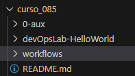
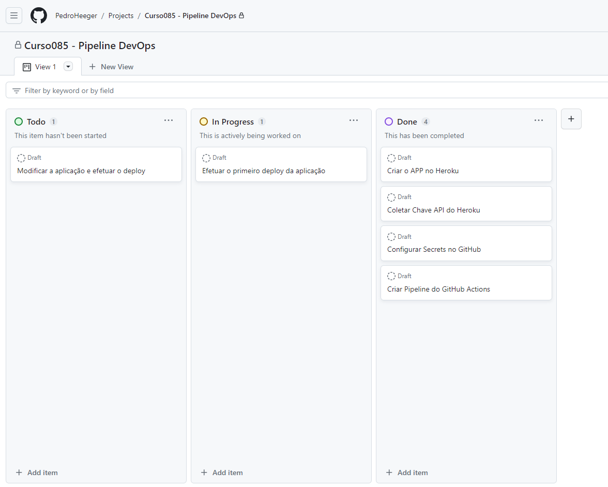
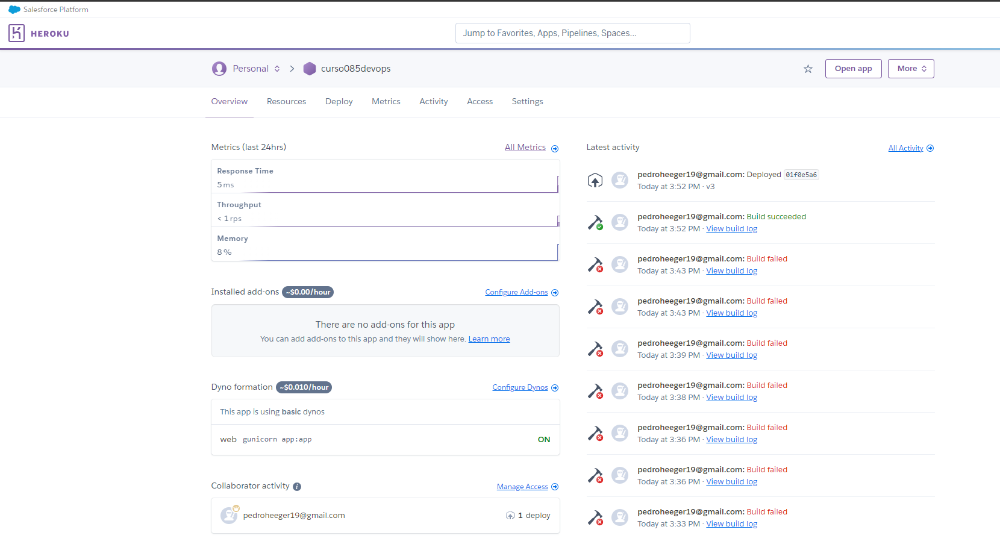
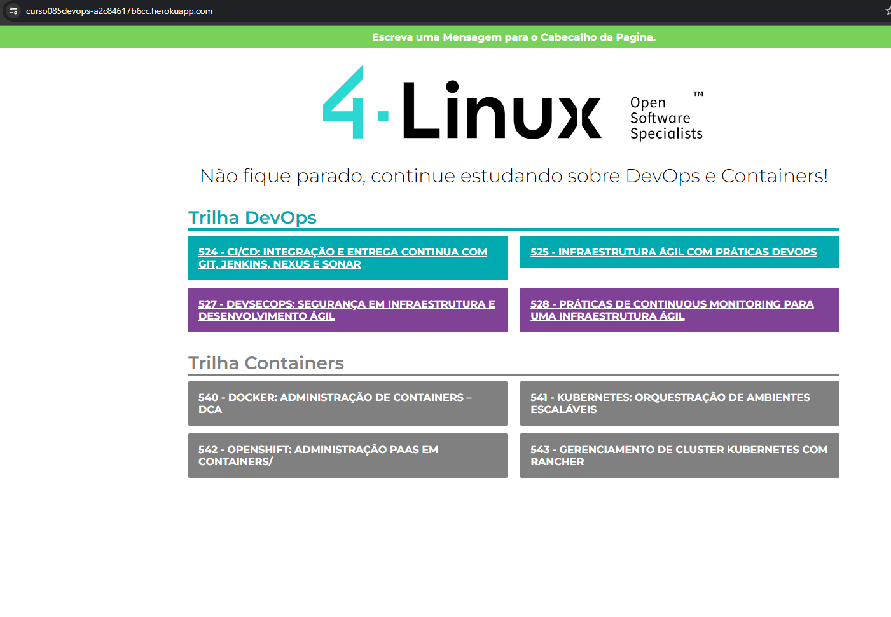
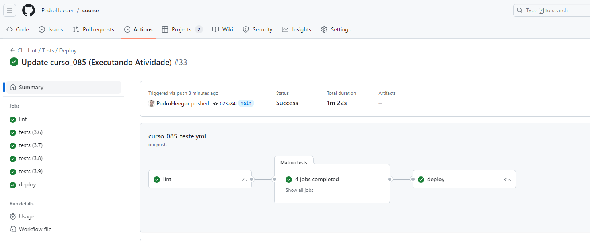
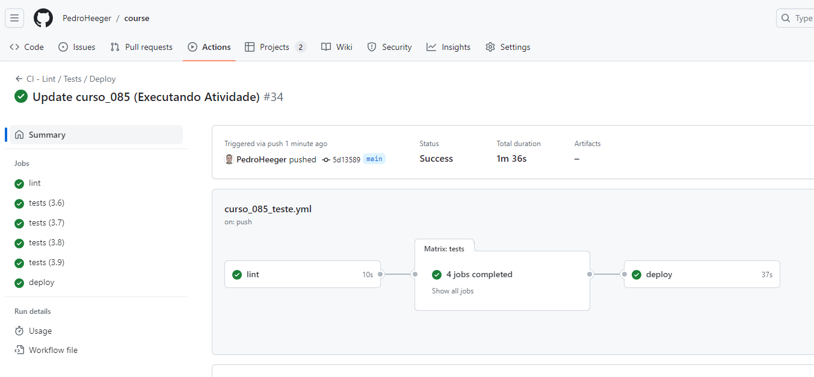
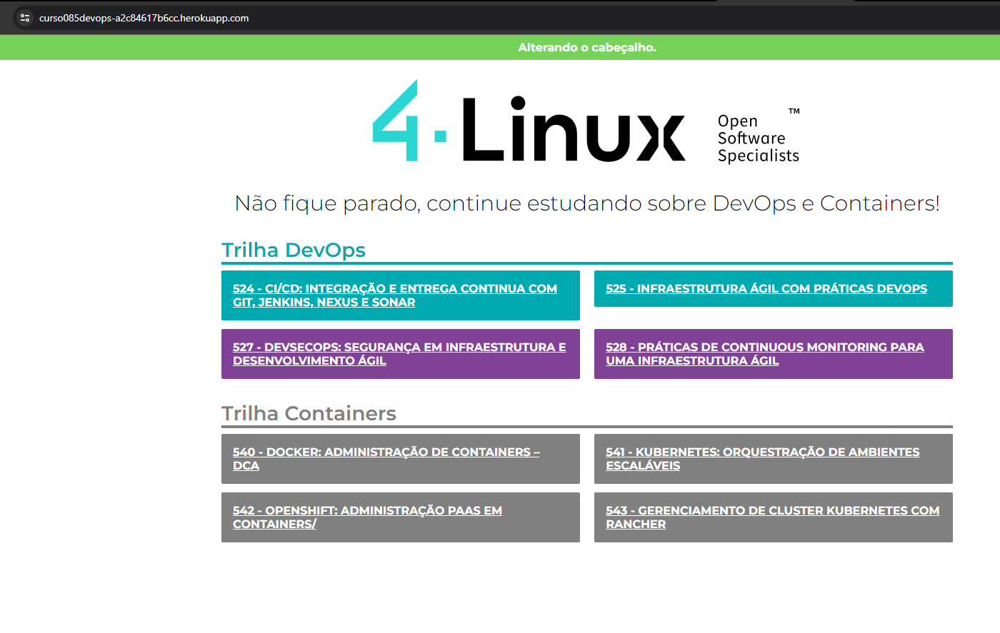
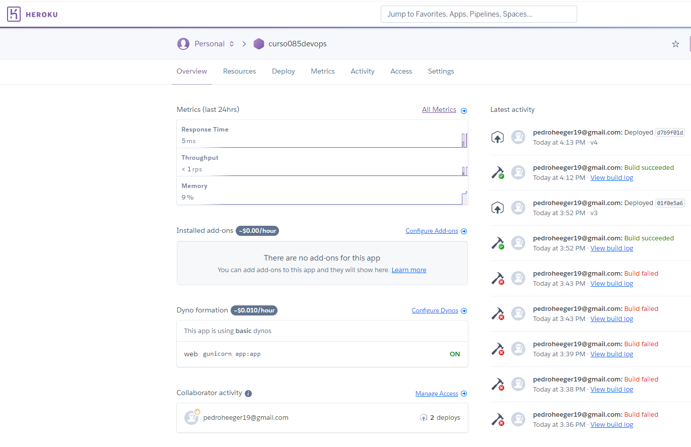

# DevOps Essentials   

### Repository: [course](../../../)   
### Platform: <a href="../../">4.Linux   </a>   
### Software/Subject: <a href="../">devops   </a>
### Course: <a href="./">curso_085 (DevOps Essentials)   </a>

#### <a href="https://github.com/PedroHeeger/main/blob/main/cert_ti/04-curso/development/devops/(23-11-12)%20DevOps%20Essentials%20PH%204.Linux.pdf">Certificate</a>

---

### Theme:
- DevOps

### Used Tools:
- Operating System (OS): 
  - Linux 
  - Windows 11 
- Cloud Services:
  - Google Drive 
- Web Developement:
  - Heroku   
- Language:
  - HTML   
  - Markdown   
  - Python   
- Integrated Development Environment (IDE) and Text Editor:
  - Visual Studio Code (VS Code)   
- Versioning: 
  - Git   
- Repository:
  - GitHub   
- Server and Databases:
  - Gunicorn   
- Command Line Interpreter (CLI):
  - Bash e Sh   
- Workflow Management System (WFMS):
  - GitHub Actions   
- Frameworks:
  - Flask   
- Library:
  - WerkZeug   
  
---

<a name="item0"><h3>Course Strcuture:</h3></a>
1. <a href="#item01">Aula 01: A Cultura DevOps</a> 
2. <a href="#item02">Aula 02: De Dev ou Ops para DevOps</a> 
3. <a href="#item03">Aula 03: Mercado DevOps</a> 
4. <a href="#item04">Aula 04: Pipeline DevOps</a> 
5. <a href="#item05">Aula 05: GitOps</a> 
6. <a href="#item06">Aula 06: Ferramentas DevOps</a> 
7. <a href="#item07">Aula 07: Primeiros Passos com DevOps (Laboratório GitOps)</a> 
8. <a href="#item08">Aula 08: Próximos Passos</a> 
9. Aula 09: Conclusão

---

### Objective:
Esse curso teve como objeto abordar sobre o assunto **DevOps** que é uma cultura muito utilizada atualmente no desenvolvimento de software.

### Structure:
A estrutura do curso é formada por:
- Este arquivo de README.md.
- A pasta do projeto **Python** fornecida pela plataforma do curso, cujo nome é `devOpsLab-HelloWorld`.
- O diretório `workflows` contendo o único arquivo de workflow para execução da Pipeline.
- A pasta `0-aux`, pasta auxiliar com imagens utilizadas na construção desse arquivo de README. 

<figure>
     
    <figcaption>Imagem 01.</figcaption>
</figure>
 

### Development:
Este cuso foi realizado em nove aulas, sendo a aula 9 apenas conclusão e todas as demais aulas teóricas, não havendo aulas práticas.

<a name="item01"><h4>Aula 01: A Cultura DevOps</h4></a>[Back to summary](#item0)

Na primeira aula deste curso foi abordado sobre a cultura DevOps, um pouco de sua história, como ela surgiu e a sua importância. DevOps tornou-se uma cultura, mas pode ser compreendido como um processo de desenvolvimento e entrega de software que enfatiza a comunicação entre os profissionais de desenvolvimento e operações. São diversos objetivos de um ambiente com práticas DevOps, entre eles podem ser citados: Melhorar a frequência dos deploys; Automatizar processos; Diminuir a ocorrência de erros em novas versões; Curtos períodos de tempo para mudanças e melhorias; Recuperação rápida em caso de falhas no ambiente; Padronização nos processos de configuração e Servidores. A cultura de DevOps tem como pilares: Respect the Culture (Respeita a cultura), Automate if Possible (Automatize se possível), Measure Results (Medir Resultados) e Sharing the Feedback (Compartilhar o Feedback), formando a sigla CAMS.

Para entender tanto a história da cultura DevOps quanto seu significado é necessário compreender sobre o conceito e história da Metodologia Ágil, pois o DevOps surge e correlaciona com a Metodologia Ágil, sendo conhecido por ser um processo ágil. A Metodologia Ágil surge na década de 60 com a origem de diversas metodologias para processos de desenvolvimento, como por exemplo o **Kanban**. Após muita discussões sobre esse tema, foi criado o Manifesto para Desenvolvimento Ágil de Softwares, que ficou popularmente conhecido como Manifesto Ágil. Este manifesto afirma que melhores resultados no desenvolvimento de software podem ser obtidos através da valorização de: Indivíduos e interações, mais que processos e ferramentas; Software em funcionamento, mais que documentação abrangente; Responder a mudanças, mais que seguir um plano.

O conceito de Agile (Ágil) é definido como um processo de desenvolvimento de software que foca em pequenos entregáveis e um processo cíclico que sempre mobiliza melhorias. O produto final, nesse modelo, é entregue em pequenas frações visando o conceito de melhoria contínua. Nesse sentido, é diferente do modelo ainda utilizado em ambientes industriais, chamado waterfall, onde o projeto é entregue por completo e, portanto, não responde às diferentes necessidades do cliente durante o processo de desenvolvimento. Algumas modelos de Metodologia Ágeis foram implantados ao longo do tempo, sendo bastante conhecida a metodologia **Scrum** e a **Spotify Squads** desenvolvida pela Spotify.

<a name="item02"><h4>Aula 02: De Dev ou Ops para DevOps</h4></a>[Back to summary](#item0)

Na aula 2 foi ensinado o que é preciso parar tornar um profissional DevOps, sendo necessário o aprendizado de diversos temas como: Cultura; Programação; Gerenciar Servidores, Virtualização, Redes e Segurança; Criação de Scripts; Instalar e configurar middlewares; Instalar softwares; Versionar arquivos com GIT; Automatizar tarefas e gerenciar configurações; Infraestrutura como Código; Observabilidade; Orquestração de Containers; Compartilhar. Também foi explicado o porque de se utilizar o sistema operacional **GNU/Linux** para trabalhar com a cultura DevOps, no qual o principal motivo é porque a maior parte dos servidores na internet operam nesse sistema. Por fim foi explicado a diferença entre cloud e on-premise, dois termos que estão sempre relacionados a DevOps.

<a name="item03"><h4>Aula 03: Mercado DevOps</h4></a>[Back to summary](#item0)

A terceira aula foi bem curta, apenas para mostrar como está aquecido o mercado de DevOps e apresentar as principais certificações relacionadas a DevOps.

<a name="item04"><h4>Aula 04: Pipeline DevOps</h4></a>[Back to summary](#item0)

Já na aula 4 foi apresentado e explicado o conceito de Pipeline, amplamente utilizado quando o assunto é DevOps, que significa tubulação, um recurso utilizado para transportar um produto (seja óleo, gás, água, etc.) para um destino. Em seguida foi explicado sobre o Pipeline Agile, a base para o Pipeline DevOps, que é um pipeline de entrega de software, no qual normalmente constitui das seguintes etapas: Planejamento; Análise; Desenho; Implementação; Testes e Integração; Deploy e Revisão. É um processo em ciclos, onde é definido um entregável e trabalhado até sua conclusão. Depois disso, um novo ciclo é iniciado, definindo novamente um entregável e trabalhando até sua conclusão.

Já o Pipeline DevOps também trabalha com pequenos entregáveis, porém o processo é um ciclo sem fim. Existem dois círculos, onde metade é trabalhada pela parte de Dev (Planejar; Desenvolver ou Codificar; Construir; Testar), e a outra metade pela parte de Ops (Lançar; Implantar e Operar; Monitorar). Cada etapa desta foi explicada, sendo apresentadas as ferramentas mais utilizadas para cada uma delas. Por fim, para a integração de todos os passos de uma pipeline DevOps, foi ensinado sobre os conceitos de Continous Integration (CI), que significa Integração Contínua, e Continous Deployment (CD) ou Continous Delivery (CD), que significa Entrega ou Implantação Contínua

<a name="item05"><h4>Aula 05: GitOps</h4></a>[Back to summary](#item0)

Nesta aula foi apresentado o conceito de GitOps, que em resumo é a implementação da automação no git server (**GitHub**, **Gitab**, **Bitbucket**, etc.) onde todo o desenvolvimento ágil é “puxado” através do Git. Também foi explicado alguns conceitos básicos referente ao **GitHub** como: repositório local, repositório remoto, branches, pull request, review, merge e webhook. O GitOps traz bastantes benefícios para uma pipeline devops, sendo o principal a cultura de compartilhamento e trabalho distribuído, o qual permite que diversas pessoas consigam trabalhar de forma simultânea a fim de atingir a entrega de maneira mais rápida, ou seja, mais ágil. Outros benefícios do GitOps são: aumento de produtividade, experiência de desenvolvedor aprimorada e maior confiabilidade. Por fim, o conceito de ChatOps foi apresentado ChatOps, que é a junção das tarefas de Automação e Colaboração. O ChatOps segue a mesma linha do GitOps e do DevOps, podendo ser considerado uma metodologia.

<a name="item06"><h4>Aula 06: Ferramentas DevOps</h4></a>[Back to summary](#item0)

Esta aula resumiu-se a apenas apresentar algumas ferramentas para cada etapa da cultura DevOps. Para planejamento (Plan), as ferramentas são: Notion, Trello, GitHub, Gitlab, Diagrams. Para codificação (Code): Git, VS Code. Para Pipelines CI/CD: Jenkins, GitHub, Gitlab. As ferramentas para a etapa de teste (Test) são: Inspec, Molecule, Selenium. Para a etapa de Release / Deploy as ferramentas são: Docker, Kubernetes, Ansible, Terraform. Por fim, para a etapa de monitoramento (Monitor) e operações (Operate), as ferramentas são: Prometheus, Grafana, Zabbix, Graylog, Fluentd, Slack, RocketChat.

<a name="item07"><h4>Aula 07: Primeiros Passos com DevOps (Laboratório GitOps)</h4></a>[Back to summary](#item0)

A aula 7 foi a única aula prática do curso, cujo objetivo foi simular um ambiente DevOps com a construção de um Pipeline de CI/CD através de um arquivo workflow **YAML** do **GitHub Actions** para realizar os jobs de lint, test e deploy de uma aplicação em **Python** na plataforma do **Heroku**, e posteriormente acessá-la pelo navegador da wab da maquina física **Windows**. O primeiro passo foi realizar a fase de `plan` da cultura DevOps, indo no repositório `course` do **GitHub** onde este curso estava e então criar um projeto na opção `projects`, dando um nome para este projeto, que na ocasião foi `Curso085 - Pipeline DevOps`. Essa funcionalidade do **GitHub** permite gerenciar os projetos do repositório, no qual existem três modelos que podem ser escolhidos, `Table`, `Roadmap` e `Board`, que foi o selecionado. O modelo `Board` funciona como a metodologia **Kanban**, onde o gerenciamento do projeto é feito através de cartões visuais nos diferentes estágios do fluxo do trabalho. Os estágios disponíveis no modelo `Board` eram: `Todo`, ou seja, que precisava ser feito, `In Progress`, que estava em execução, e `Done`, que já estava concluído. Portanto, foram criados seis cartões no `Todo`, fragmentando o projeto em etapas, e a medida que o projeto fosse executado, os cards eram transferidos para os outros estágios até que todos os cards tivessem no estágio `Done`, que então significaria que o projeto estava finalizado. A imagem 02 abaixo ilustra o quadro em um momento específico da execução do projeto

<figure>
     
    <figcaption>Imagem 02.</figcaption>
</figure>
 

Com a etapa de `plan` concluída, agora era só seguir os cartões na ordem. O primeiro card indicava `Criar o APP no Heroku`, então foi necessário realizar o cadastro na plataforma **Heroku** e criar um APP `curso085devops`. Tenha atenção, pois a utilização da plataforma gerou custos e portanto foi necessário cadastrar um cartão de crédito. O segundo card do projeto indicava `Coletar Chave API do Heroku`, para isso dentro do **Heroku**, na opção `Account Settings`, na aba `Account`, no final dela tinha a opção `API Key` e foi possível revelar essa chave, no qual ela foi copiada para utilizar nas `secrets` do **GitHub**. O terceiro cartão apontava para `Configurar Secrets no GitHub`, então no repositório `course`, onde estava este curso, a opção `settings` foi aberta e detro de`Security`, a opção `Secrets and variables` foi selecionada, exibindo três novas opções, cuja escolhida agora foi `Actions`, pois as `secrets` que seriam cadastradas eram para utilização do **GitHub Actions**. As `secrets` cadastradas foram: `HEROKU_API_KEY`, que foi a chave copiada, `HEROKU_APP_NAME`, o nome dado para o APP em desenvolvimento, e `HEROKU_USER_EMAIL`, o email cadastrado na conta do **Heroku**. Assim o **GitHub Actions** poderiam se comunicar com o **Heroku** e fazer o deploy da aplicação nele. O **Heroku** é uma plataforma de nuvem como serviço (PaaS) que suporta várias linguagens de programação e possibilita a hospedagem na internet da aplicação. Portanto, o **Heroku** foi escolhido para hospedar a aplicação.

Seguindo os cartões, o quarto card indicava `Criar Pipeline do GitHub Actions`, então o arquivo [curso_085.yml](./workflows/curso_085.yml) dentro do sub-diretório também criado [workflows](./workflows/). Este sub-diretório é apenas do projeto `curso_085`, onde o arquivo de workflow é armazenado. Para execução do arquivo pelo **GitHub Actions**, uma cópia idêntica dele tem que ser enviada para pasta padrão de workflows, cujo nome é `workflows`. Na minha organização, esta pasta deve sempre ficar vazia, só recebendo as cópias dos arquivos de workflows quando algum projeto tiver que ser executado, após a realização do projeto, essas cópias são apagadas, mantendo o arquivo original de workflow na pasta do curso correspondente.

O arquivo de workflow deste curso teve como trigger um Push para o repositório remoto do arquivo criado `start.txt` na pasta do projeto [devOpsLab-HelloWorld]. A pasta do projeto foi baixada manualmente do repositório da plataforma do curso e transferida para dentro do diretório deste curso. Todo o projeto foi fornecido pela plataforma do curso, no qual a linguagem de programação utilizada era **Python**. A única alteração feita por mim no diretório do projeto foi a criação do arquivo [start.txt](./devOpsLab-HelloWorld/start.txt), onde ele era utilizado para escrever a versão do Pipeline que seria executada quando realizasse um Push para o repositório remoto, iniciando de `v1`. Este arquivo funcionou como um trigger para que o Pipeline só fosse acionado quando este arquivo fosse enviado para o repositório remoto.

Já o Pipeline desenvolvido no arquivo de workflow possuía três jobs, todos eles rodando em um **Linux Ubuntu** na versão `20.04`. O primeiro o job `lint` continha as seguintes steps: checkout do repositório, configuração do ambiente **Python** na versão `3.9`, instalação das dependências e utilização do comando `flake8` para analisar o código **Python** em busca de erros e violações de estilo. O job de `lint` geralmente refere-se a um processo de análise de código estático para encontrar possíveis problemas, normalmente relacionados à formatação, estilo ou práticas de codificação consistentes. O segundo job foi o de `test` que necessitava do job de `lint` para ser executado, este continha os seguintes passos: checkout do repositório, configuração do ambiente **Python**, atualização do gerenciador de pacotes do **Python**, o **Pip**, instalação do **Flake8** e do **Pytest**, instalação das dependências do projeto através do arquivo `requirements.txt` e por fim, a execução do teste de integração através do arquivo `test.py`. O último job foi o `deploy` que para ser executado precisava que o job anterior fosse concluído com sucesso. O job de `deploy` constituíu-se das seguintes steps: checkout do repositório, configuração do ambiente **Python** na versão `3.9` e o deploy no **Heroku**, sendo este último passo onde foi declarado as três `secrets` do **Heroku** criadas no **GitHub**.

Tanto no job `test` como no job `deploy`, o diretório de trabalho foi indicado como a pasta do projeto `devOpsLab-HelloWorld`. No job `test`, durante a sua execução, ele foi ramificado em cinco outros jobs, sendo todos iguais, porém cada um com uma das seguintes versões de **Python**: `3.5`, `3.6`, `3.7`, `3.8` e `3.9`. Ainda neste job, alguns erros surgiram, sendo necessário realizar duas alterações. A primeira delas foi a remoção da versão `3.5`, pois não era mais compatível com os frameworks e bibliotecas do **Python** utilizadas. A segunda foi no arquivo [requirements.txt](./devOpsLab-HelloWorld/requirements.txt), inserindo esta dependência que precisava ser instalada na versão correta `Werkzeug==2.0.1`. 

Já no job de `deploy`, aconteceu um erro em que o **Heroku** não indentificava a linguagem de programação utilizada. O Heroku usa o conceito de buildpacks para identificar e configurar automaticamente o ambiente de execução com base na linguagem de programação do aplicativo. Um buildpack é um conjunto de scripts e configurações que instrui o Heroku sobre como compilar e executar seu aplicativo. A identificação automática da linguagem geralmente é realizada através de arquivos como `requirements.txt` para **Python**, `package.json` para **Node.js**, `Gemfile` para **Ruby**, etc. O **Heroku** examina esses arquivos e usa a informação encontrada para configurar o ambiente. O arquivo `runtime.txt` é usado para especificar a versão desejada do interpretador **Python** no **Heroku**. Ele é opcional, mas útil quando deseja-se garantir que a aplicação seja executada com uma versão específica do **Python**. Se o **Heroku** detectar o arquivo `runtime.txt`, ele usará a versão do **Python** especificada no arquivo. Devido a isso, foi necessário alterar no arquivo [runtime.txt](./devOpsLab-HelloWorld/runtime.txt) a versão do **Python** que era de `3.10.7` para a versão `3.9.13` compatível com a configuração do ambiente que foi na versão `3.9` e uma das versões disponíveis para tempo de exeução **Python**, conforme [documentação](https://elements.heroku.com/buildpacks/heroku/heroku-buildpack-python). O arquivo [Procfile](./devOpsLab-HelloWorld/Procfile) é usado para declarar os comandos que são executados pelo **Heroku** na inicialização do aplicativo. Ele é essencial para aplicativos web, pois especifica como iniciar o servidor web que atenderá às solicitações da aplicação. Neste arquivo foi mantido o comando `web: gunicorn app:app`, indicando ao **Heroku** para utilizar o **Guanicorn** como servidor web para uma aplicação **Flask**. 

O quinto card apontava para `Efetuar o primeiro deploy da aplicação`, o que significava que bastava enviar para o repositório remoto através de um Push, o arquivo de workflow desenvolvido na pasta padrão de workflows do **GitHub**, a pasta da aplicação `devOpsLab-HelloWorld` e o arquivo `start.txt` criada dentro dela. Toda vez que alguma alteração fosse feita tanto no diretório do projeto como no diretório de workflows, o arquivo `start.txt` tinha que ser alterado para a próxima versão para que ele fosse enviado novamente para o repositório remoto e conseguisse acionar o Pipeline. A imagem 03 mostra a aplicação em execução na plataforma do **Heroku**, enquanto a imagem 04 exibe ela sendo acessada pelo navegador da maquina física **Windows** através do endereço gerado pela **Heroku** (`https://curso085devops.heroku.app.com`). Na imagem 05 é evidenciado todos os jobs do Pipeline concluídos. Perceba que o número de execução já estava em 33, isso ocorreu pois cada tentativa que não foi bem sucedida contou como execução do Pipeline.

<figure>
     
    <figcaption>Imagem 03.</figcaption>
</figure>
 

<figure>
     
    <figcaption>Imagem 04.</figcaption>
</figure>
 

<figure>
     
    <figcaption>Imagem 05.</figcaption>
</figure>
 

Antes de ir para o último cartão, dois pontos precisam ser ditos. O primeiro deles é que foi utilizado pelo professor a plataforma **Codeanywhere** como Integrated Development Environment (IDE), porém optei por utilizar o próprio **Visual Studio Code (VS Code)** já instalado na maquina física. Portanto, já existia uma configuração do **VS Code** com o **GitHub** através de um `Personal Access Tokens (PAT)`, que é uma forma de autenticação baseada em token, no qual o token substitui a senha na hora de interagir com o **GitHub**. Essa forma é diferente da utilizada pelo professor que é o `SSH Keys`, que é um par de chaves criptográficas (pública e privada) usado para autenticação segura. A chave pública é adicionada à conta do **GitHub**, enquanto a chave privada fica armazenada localmente. Para geração da chave pelo professor foi utilizado o comando `ssh-keygen`, onde nenhuma senha foi especificada.

O último card indicava `Modificar a aplicação e efetuar o deploy`, portanto, no arquivo [index.html](./devOpsLab-HelloWorld/templates/index.html) dentro da pasta do projeto, foi alterado o texto da linha 13 `
Escreva uma Mensagem para o Cabecalho da Pagina.
`, escrevendo uma mensagem para aparecer de cabeçalho. Também foi necessário alterar o arquivo de teste [test.py](./devOpsLab-HelloWorld/test.py), modificando na linha 22 o texto `Escreva uma Mensagem para o Cabecalho da Pagina.` pelo menos texto alterado no arquivo anterior. Como esses arquivos foram alterados, para que o Pipeline seja acionado o arquivo de trigger também tinha que ser alterado, aumentando mais um na versão da execução. Em seguida, todos esses arquivos foram commitados e enviados para o repositório remoto para que o Pipeline fosse alterado e as modificação da versão da aplicação fosse realizada. Na imagem 06 abaixo é exibido a conclusão de todos os jobs do workflow. Na imagem 07, a aplicação foi novamente visualizada agora com alteração de versão, no qual foi modificado o título. Já na imagem 08, a aplicação em execução é visualizada plataforma do **Heroku**, no qual o número de deploys foi modificado para 2.

<figure>
     
    <figcaption>Imagem 06.</figcaption>
</figure>
 

<figure>
     
    <figcaption>Imagem 07.</figcaption>
</figure>
 

<figure>
     
    <figcaption>Imagem 08.</figcaption>
</figure>
 

Por fim, o arquivo de workflow (cópia) foi removido da pasta padrão de workflows, pois este curso foi concluído. Também dentro do diretório do projeto os dois arquivos onde foram feito as alterações para mudança de versão, foram corrigidos para versão original, cujo texto era `Escreva uma Mensagem para o Cabecalho da Pagina.`, e o arquivo de acionamento do Pipeline foi alterado para versão `v0`, para que quando este projeto fosse executado novamente a contagem de Pipeline começasse do 0. Após isso, foi deletado o APP construindo na plataforma **Heroku** de nome `curso085devops`.

<a name="item08"><h4>Aula 08: Próximos Passos</h4></a>[Back to summary](#item0)

Na última aula foi apresentado os próximos passos para trabalhar com DevOps, indicando quais ferramentas e assuntos seguir estudando para aprimorar no conhecimento. Algumas das indicadas foram: **Git**, Redes, **Linux**, Monitoramento, Cloud (**AWS**, **GCP** e **Azure**), **Terraform**, Containers (**Docker** e **Kubernetes**). Para um ambiente on-premise as indicações foram: Sistemas Operacionais (**Linux**), **Ansible** e **Puppet**.