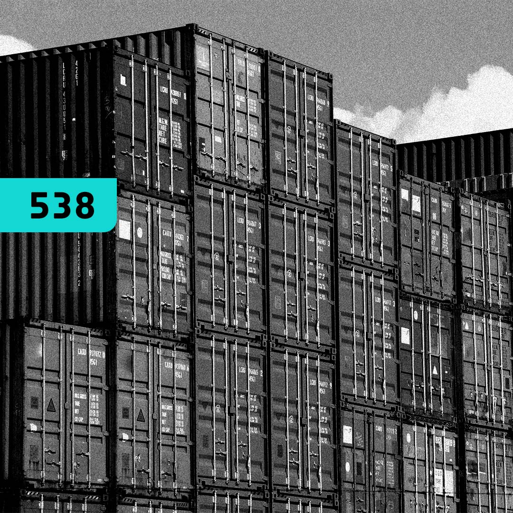
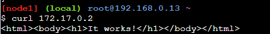
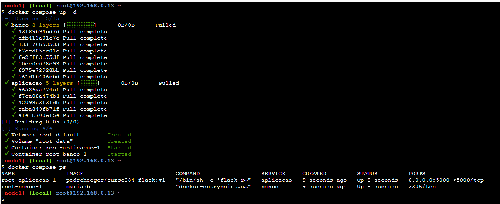
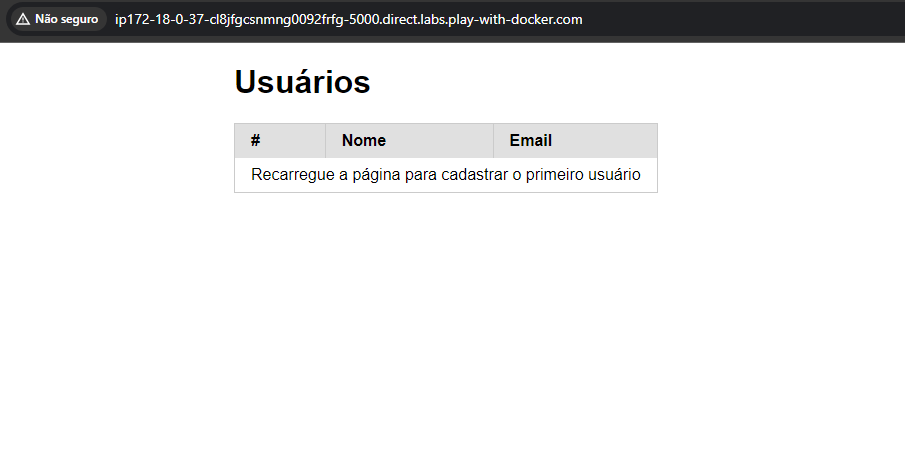

# Containers Fundamentals   

### Repository: [course](../../../)   
### Platform: <a href="../../">4.Linux   </a>   
### Software/Subject: <a href="../">docker   </a>
### Course: <a href="./">curso_084 (Containers Fundamentals)   </a>

#### <a href="https://github.com/PedroHeeger/main/blob/main/cert_ti/04-curso/os/linux/(23-08-22)%20Linux%20Fundamentals%20PH%204.Linux.pdf">Certificate</a>

---

### Theme:
- Operating System (OS)

### Used Tools:
- Operating System (OS): 
  - Linux 
  - Windows 11 
- Linux Distribution: 
  - Alpine Linux   
  - Debian   
- Cloud Services:
  - Google Drive 
- Containerization: 
  - Docker   
  - Docker Compose   
  - Docker Playground; Play With Docker (PWD)   
- Language:
  - HTML   
  - Markdown   
  - Python   
- Integrated Development Environment (IDE) and Text Editor:
  - VI iMproved (Vim)   
  - Visual Studio Code (VS Code)   
- Versioning: 
  - Git   
- Repository:
  - Docker Hub   
  - GitHub   
- Command Line Interpreter (CLI):
  - Bash e Sh   
- Server and Databases:
  - Apache HTTP Server (httpd)   
  - MariaDB   
  - Nginx   
- Tools:
  - Alpine Package Keeper (APK)   
  - Curl   
  
---

<a name="item0"><h3>Course Strcuture:</h3></a>
0. Aula 00: Apresentação
1. <a href="#item01">Aula 01: Introdução</a><br>
2. <a href="#item02">Aula 02: Contêiner</a><br>
3. <a href="#item03">Aula 03: Mercado</a><br>
4. <a href="#item04">Aula 04: Microsserviços</a><br>
5. <a href="#item05">Aula 05: O SysAdmin, o Programador e o DBA</a><br>
6. <a href="#item06">Aula 06: Docker - Teoria</a><br>
7. <a href="#item07">Aula 07: Docker - Primeiros Passos</a><br>
8. <a href="#item08">Aula 08: Docker - Caminhando Sozinho</a><br>
9. Aula 09: Final

---

### Objective:
Esse curso teve como objeto abordar sobre o assunto container, explicando seu conceito e como funcionam os containers, tendo como foco a principal ferramenta que é o **Docker**.

### Structure:
A estrutura do curso (Imagem 01) é formada por:
- Um arquivo `Dockerfile` para criação de uma imagem **Docker**.
- Um arquivo `docker-compose.yaml` para construção da infraestrutura de containers.
- A pasta `0-aux`, pasta auxiliar com imagens utilizadas na construção desse arquivo de README. 

<div align="Center"><figure>
    <br>
    <figcaption>Imagem 01.</figcaption>
</figure></div><br>

### Development:
Este cuso foi realizado em dez aulas, sendo a aula 0 e aula 9 apenas apresentação e conclusão, e as aulas 7 e 8 práticas, onde foi utilizado como ambiente de execução a plataforma **Play With Docker (Docker Playground)** da **Docker** no navegador da maquina física. Com isso foi possível utilizar maquinas virtuais para execução dos comandos de **Docker**.

<a name="item01"><h4>Aula 01: Introdução</h4></a>[Back to summary](#item0)

A primeira aula foi teórica assim como as próximas 5 aulas, no qual foi apresentado o assunto do curso que foi sobre containers, cujo o foco seria na principal ferramenta de containers hoje no mercado, o **Docker**. Contudo, existem outras ferramentas equivalentes ao Docker como o **LXD** e o **Podman**, além de ferramentas de outras categorias como o **Containerd**, **Katacontainer** e **Cri-o**. Estas estão atreladas a um tipo de arquitetura mais complexa, geralmente distribuída e possuem um propósito diferente.

<a name="item02"><h4>Aula 02: Contêiner</h4></a>[Back to summary](#item0)

Na aula 2 foi explicado sobre o conceito de containers que são pequenos pacotes de software com todas as dependências dentro de si, leves e fáceis de mover entre os mais variados tipos de infraestrutura. Os containers são baseados em imagens que possuem camadas que podem ser compartilhadas entre si. Logo, foram abordados também os conceitos de imagens e camadas. Foi explanado as diferenças entre as maquinas virtuais e os containers, como que é a infraestrutura de cada uma deles e como eles funcionam. A maior diferença é referente ao tamanho, no qual os containers são bem mais leves. Por fim, foi explicado porque o nome container foi adotado para essa tecnologia, ou melhor, um conjunto de tecnologias do kernel do **Linux**, já que contemplam algumas tecnologias sendo as três principais: `Namespaces`, `Cgroups` e `Union Mount/Union Mounting`.

<a name="item03"><h4>Aula 03: Mercado</h4></a>[Back to summary](#item0)

Na terceira aula a temática foi referente ao mercado de containers, onde foram apresentadas diversas pesquisas de como está o cenário do uso de containers e explicado o motivo de adotar containers do ponto de vista do negócio. A utilização de containers propicia economia e agilidade sem sacrificar a estabilidade. Também foi realizada a introdução do conceito de orquestradores de containers, que são ferramentas capazes de: gerenciar e monitorar os containers com a capacidade de movê-los de um lugar para o outro caso algo errado aconteça, balancear a carga entre as réplicas existentes, fornecer uma espécie de “auto discovery” (descoberta automática) para novos serviços, entre outras coisas. Por fim, foi apresentada a ferramenta mais utilizada hoje no mercado de orquestração que é o **Kubernetes**. 

<a name="item04"><h4>Aula 04: Microsserviços</h4></a>[Back to summary](#item0)

Na aula de número 4 deste curso foi abordado sobre as arquiteturas de desenvolvimento. A primeira delas, foi a arquitetura monolítica que é muito comum e quase sempre mais simples de conceber. Este tipo de arquitetura é como se todo o software fosse um grande pacote com tudo junto, sendo esse também o grande problema desta arquitetura, pois caso haja qualquer problema com a aplicação, todo software terá que ser alterado. A segunda arquitetura é a orientada a serviços que surgiu antes dos anos 2000 e é uma abordagem para separar as aplicacões monolíticas em serviços independentes que utilizou uma forma de comunicação entre processos chamada SOAP (Simple Object Access Protocol). Contundo essa forma de comunicação não possuía um padrão, dificultando alterações e novas implementações. Para solucionar esse problema surgiu a figura do ESB (Enterprise Service Bus), uma espécie de tradutor comum para padronizar essa comunicação, porém o mesmo passou a ser um gargalo entre as aplicações e suas mensagens. 

Diversas abordagens para evitar o problema do ESB surgiram, mas a que acabou se tornando uma forma de implementação foi a arquitetura de microsserviços. Os microsserviços são uma implementação específica do SOA em que os serviços conversam diretamente entre si, sem a utilização do ESB, no lugar dele utiliza um protocolo e formato de dados padrão conhecido como APIs REST. Este tipo de arquitetura permite fragmentar a infraestrutura em pedaços, muito mais fácil e econômico para gerenciar. Os containers facilitaram drasticamente a adoção deste tipo de arquitetura.

<a name="item05"><h4>Aula 05: O SysAdmin, o Programador e o DBA</h4></a>[Back to summary](#item0)

Nesta aula foi explicado qual papel de um Sysadmin, de um Programador e de um DBA e o porque os três precisam ter conhecimento de containers. O papel do sysadmin, ou o time de operações, é trabalhar com os orquestradores, como **Kubernetes** ou **Docker Swarm**, e também trabalhar com as máquinas que possuem contêineres soltos, que apesar de não ser o cenário ideal, é bastante comum. O papel do programador, ou do time de desenvolvimento, é criar imagens e testá-las. Isso inclui praticamente todos os comandos e possibilidades disponíveis no **Docker**. Já o DBA, apesar de ser um pouco menos, também precisa ter conhecimento de containers já que nos últimos anos as comunidades do **MySQL**, **MongoDB** e **PostgreSQL** criaram formas de automatizar e gerenciar os bancos dentro do **Kubernetes** através do que chamamos de Operators, controlando-os de uma maneira mais inteligente e facilitando tarefas como backups e replicação.

<a name="item06"><h4>Aula 06: Docker - Teoria</h4></a>[Back to summary](#item0)

Nesta aula foi dado uma breve introdução sobre o software **Docker** foco deste curso e a ferramenta mais utilizada do mercado quando o assunto é containers. Foi explicado que o **Docker** utiliza de algumas tecnologias presentes no kernel do Linux como `Namespaces`, `Cgroups` e `Union Filesystems (UnionFS)` para criar containers através de imagens preexistentes. A imagem, por sua vez, é imutável e pode ser formada por diversas camadas que podem ser compartilhadas entre si, no qual essas camadas são de apenas leitura (R). A camada de leitura e escrita (RW), ou writable layer, é justamente a camada do container quando ele é criado, sendo possível criar diversos containers a partir de uma mesma imagem e escrever neles, diferenciando um do outro a partir dessa camada. Dentro das imagens há um pequeno sistema operacional que compartilha o kernel com a máquina hospedeira, além da aplicação, binários, bibliotecas e qualquer outro tipo de arquivo especificado durante a criação desta imagem.

Através do `Namespaces` os processos do container ficam isolados do sistema operacional, isso significa que os processos dos containers podem ser vistos da máquina hospedeira, mas os processos da máquina hospedeira não podem ser vistos pelo container. O mesmo funciona para a interface de rede, por padrão um container **Docker** acredita que é o “localhost” e possui sua própria interface de rede física. Mas esta interface pode ser vista da máquina hospedeira como uma interface virtual começando com o prefixo `veth`. O `Union Filesystems (UnionFS)` é um tipo de `Union Mount`, um sistema de arquivos formado por todas as camadas tanto da imagem como do próprio container, sendo este também isolado do sistema de arquivos da maquina hospedeira. Já o `Cgroups` é o responsável por fazer a limitação de recurso computacional, limitação de CPU, limitação de memória.

<a name="item07"><h4>Aula 07: Docker - Primeiros Passos</h4></a>[Back to summary](#item0)

A partir desta aula foi iniciado a parte prática, no qual o ambiente de execução foi o **Docker Playground** (**Play With Docker**), uma plataforma online do **Docker** onde é possível testar comandos através de uma maquina virtual fornecida pela plataforma. Esta plataforma foi acessada pelo navegador da maquina física e utilizada para execução da parte prática. Nesta aula, diversos comandos foram apresentados, desde os mais básicos até alguns mais complexos. Como já possuia um bom conhecimento de **Docker**, não será mostrado aqui todos os comandos executados, o foco será apenas em alguns comandos específicos. Obviamente, como em todo curso de **Docker**, um dos primeiros comandos a serem executados foi o `docker container run hello-world`, onde foi criado um container que exibiu a mensagem `Hello World`, sendo utilizado o parâmetro `--name meucontainer1` para nomear este container. O segundo container criado foi através do comando `docker run --name apache httpd` no qual um container de servidor web **Apache HTTP** foi construído. Ambos os containers baixaram a imagem mais recente no **Docker Hub**, pois não foi especificada a versão dessas imagens. Como mostrado na imagem 02 abaixo, os dois containers foram listados com o comando `docker container ls -a`, sendo o parâmetro `-a` utilizado, pois ambos já não estavam mais em execução.

<div align="Center"><figure>
    <br>
    <figcaption>Imagem 02.</figcaption>
</figure></div><br>

Na imagem 03, o container de nome `meucontainer1` já tinha sido removido com o comando `docker container rm meucontainer1` e o container do Apache que não estava execução foi iniciado com o comando `docker container start apache`. Note que para remover um container é necessário que ele esteja encerrado, caso contrário precisa parar ele com o comando `docker container stop` ou forçar sua remoção `docker container rm -f meucontainer1`. Com o software **Curl** foi realizada uma requisição para endereço de IP do container que foi visualizado com o comando `docker container inspect apache` e foi retornado a estrutura do arquivo **HTML** padrão do servidor Apache, conforme imagem 04.

<div align="Center"><figure>
    <br>
    <figcaption>Imagem 03.</figcaption>
</figure></div><br>

<div align="Center"><figure>
    <br>
    <figcaption>Imagem 04.</figcaption>
</figure></div><br>

O container foi acessado com o comando `docker container exec -it apache bash`, no qual o bash é executado e uma sessão do bash é aberta no pseudo-terminal gerado pelo parâmetro `-t` ou `--tty`, permitindo uma interatividade entre a maquina host e o container através do parâmetro `-i` ou `--interactive`. Dentro do container, o diretório corrente já era o do Apache, então com o comando `echo '4Linux' > htdocs/index.html` o texto do arquivo padrão do Apache (`index.html`) foi alterado para `4Linux` e em seguida o acesso ao container foi encerrado com o comando `exit`. Novamente com o **Curl**, foi realizado uma nova requisição para endereço de IP do container e o retorno desta vez foi o texto inserido no arquivo `index.html`, como exibido na imagem 05.

<div align="Center"><figure>
    <br>
    <figcaption>Imagem 05.</figcaption>
</figure></div><br>

Após essa etapa, o tempo da sessão infelizmente terminou, tendo que ser aberto uma nova sessão, logo, tudo que foi realizado não foi salvo. Esta nova sessão não precisou das imagens ou containers realizados anteriormente. Ela foi iniciada com o download de algumas imagens com o comando `docker pull`, as duas primeiras imagens baixadas foram de uma **Alpine** e de um **Debian**, ambos distribuições **Linux**. A diferença entre elas é o tamanho da imagens, sendo a imagem **Alpine** cerca de 6% do tamanha da imagem do **Debian**, conforme mostrado na imagem 06 abaixo.

<div align="Center"><figure>
    <br>
    <figcaption>Imagem 06.</figcaption>
</figure></div><br>

As duas imagens baixadas foram na versão, ou melhor, na tag `latest`, que significa a versão mais atualizada daquela imagem no **Docker Hub**. Não se deve utilizar a tag `latest`, pois a versão que ela representa é atualizada sempre que uma nova versão é criada, dificultando a padronização. Em seguida, foi baixada novamente a imagem do **Debian**, porém especificado a tag que no caso foi a `Buster-Slim`, uma versão mais leve do **Debian**. A imagem 07 evidencia a utilização do comando `dockar image ls` ou `docker images` para listar as imagens baixadas. Percebe-se que a diferença do tamanho entre as imagens do **Debian** é considerável.

<div align="Center"><figure>
    <br>
    <figcaption>Imagem 07.</figcaption>
</figure></div><br>

Um ponto observado foi que o container ao terminar seu comando principal, ele morreu, ou seja, ele foi encerrado, o processo dele foi finalizado. Para que o container não seja encerrado, o comando tem que ficar sempre em execução, segurando o container, ou seja, com o processo ativo. Uma outra forma de fazer isso é enviar o processo do container para background (segundo plano) utilizando o parâmetro `-d` ou `--detach`, assim o processo fica em execução em segundo plano e o container continua rodando. Ou então, caso tenha acessado o container, pode utilizar o comando `Ctrl + P + Q` que sai do processo, ou seja, sai do container, porém não finaliza ele, enviando também o processo para background.

<a name="item08"><h4>Aula 08: Docker - Caminhando Sozinho</h4></a>[Back to summary](#item0)

Nesta aula foi introduzido o assunto de volume, como criar volumes e compartilhar volumes da maquina host com o container e também foi ensinado sobre como expor um container através de um `port bind`, onde foi configurado um direcionamento da porta do container para porta maquina host, permitindo acessar a aplicação pela maquina host, que neste curso, foi a maquina virtual da plataforma **Play With Docker** do **Docker**.

Para abrir uma porta na plataforma **Docker Playground**, logo ao lado do número de IP tem um botão de nome `OPEN PORT`, foi necessário clicar nele e digitar que porta seria aberta, que no caso foi a porta `80`. Em seguida, a própria plataforma abre uma nova guia no navegador direcionando para o DNS gerado para este endereço de IP na porta correspondente. Neste momento, nenhum site foi acessado, pois o container com a aplicação não tinha sido criado ainda. 

Antes de criar o container, foi necessário baixar os arquivos de construção da aplicação que estavam hospedados no repositório do **GitHub** da plataforma do curso. Com o comando `git clone https://github.com/4linux/4542-site.git html` foi realizado um clone do repositório para uma nova pasta de nome `html` dentro do diretório corrente da maquina virtual que era `/root`. Com o comando abaixo, foi criado um container de nome `apache` a partir da imagem `httpd:alpine`, ou seja, um versão leve do servidor web **Apache HTTP (httpd)** que roda em cima da distribuição **Linux Alpine**. Com o parâmetro `-d` ou `--detach`, o processo de excução do container foi enviado para background, deixando o terminal livre para uso. Com o parâmetro `-v` ou `--volume` foi realizado uma configuração de volume, compartilhando os arquivos da aplicação baixados do **GitHub** e armazenados em `html` com o diretório padrão do apache `/usr/local/apache2/htdocs/` dentro do container, substituindo a aplicação padrão do Apache pela aplicação fornecida pela plataforma do curso. Já o parâmetro `-p` ou `--publish` fez um bind de portas, ou seja, expôs o que era exibido na porta `80` do container para porta `80` da maquina host, ou seja, maquina da plataforma **Play With Docker**. O resultado da aplicação sendo acessada pelo navegador da maquina física pode ser visto na imagem 08.

```docker
docker container run --detach --name apache --volume /root/html:/usr/local/apache2/htdocs/ --publish 80:80 httpd:alpine
```

<div align="Center"><figure>
    <br>
    <figcaption>Imagem 08.</figcaption>
</figure></div><br>

Após isso, um segundo container foi criado com o comando abaixo, agora de nome `nginx` com uma imagem `nginx:alpine`, também uma versão leve, porém de um servidor web **Nginx**. Os mesmos parâmetros foram utilizados, sendo o compartilhado a pasta de arquivos da mesma aplicação, porém a pasta padrão do **Nginx** é a `/usr/share/nginx/html`. O mapeamento de portas foi realizado da porta `80` do container para a porta `81` da maquina host, pois a porta `80` da maquina host já estava em uso pelo container anterior. Na imagem 09 é exibido o acesso a aplicação do servidor **Nginx** através do navegador da maquina físca. Observe que foi necessário liberar a porta `81` da maquina host, e a própria plataforma abriu o link com endereço para acesso a aplicação. Na imagem 10, é possível visualizar a execução do comando e a listagem dos dois containers, ambos na porta `80` direcionando para portas diferentes na maquina host.

```docker
docker container run --detach --name nginx --volume /root/html:/usr/share/nginx/html --publish 81:80 nginx:alpine
```

<div align="Center"><figure>
    <br>
    <figcaption>Imagem 09.</figcaption>
</figure></div><br>

<div align="Center"><figure>
    <br>
    <figcaption>Imagem 10.</figcaption>
</figure></div><br>

Com o comando `curl -I localhost:port`, informando o número da porta foi realizado requisições aos endereços determinados e informações de retorno foram visualizadas, conforme imagem 11. Quando a porta não é fornecida, por padrão é utilizada a porta `80`, logo o comando poderia ser `curl -I localhost` para a porta `80`. Através dos comandos após a imagem, alterações foram feitas nos arquivos da aplicação na maquina host, essas alterações também eram refletidas nos containers devido a criação de volume. Na imagem 12 é exibida a aplicação com as alterações. Observe que os nomes `Origin`, `Kubernetes` e `Distribution!` alteraram para `4Linux`, `Open` e `Source`.

<div align="Center"><figure>
    <br>
    <figcaption>Imagem 11.</figcaption>
</figure></div><br>

```bash
sed -Ei 's,O</b>rigin,4</b>Linux,' html/index.html
sed -Ei 's,K</b>ubernetes,O</b>pen,' html/index.html
sed -Ei 's,D</b>istribution!,S</b>ource,' html/index.html
```

<div align="Center"><figure>
    <br>
    <figcaption>Imagem 12.</figcaption>
</figure></div><br>

Na etapa seguinte, um container de banco de dados do **MariaDB** foi construído especificando quatro variáveis de ambientes, conforme comando abaixo. Para acessar este container foi utilizado o comando `docker container exec -ti mariadb bash` e então, com as informações do usuário cadastradas, foi acessado o **MariaDB** com o comando `mysql -u container -p 4linux container`. Também foi feito uma criação de volumes para compartilhar os dados do banco disponíveis em `/var/lib/mysql` no volume criado de nome `dados`.

```docker
docker container run -d --name mariadb -e MYSQL_ROOT_PASSWORD=Abc123_ -e MYSQL_USER=container -e MYSQL_PASSWORD=4linux -e MYSQL_DATABASE=container -v dados:/var/lib/mysql mariadb
```

Após a criação do container de banco de dados, uma imagem **Docker** de uma aplicação em **Python** foi elaborada, cujos arquivos da aplicação foram fornecidos pela plataforma do curso através de um repositório no **GitHub**, com o comando `git clone https://github.com/4linux/containers-apps.git` a pasta, cujo nome era `containers-apps`, contendo os arquivos da aplicação foram baixados para o diretório corrente `/root`. Com o comando `apk add py3-pip` a linguagem de programação **Python** foi baixada junto com seu gerenciador de pacotes **Pip** na maquina host. Em seguida, foi acessada a pasta da aplicação com o comando `cd containers-apps/python` e instalado as dependências com `pip3 install -r requirements.txt`. Neste primeiro momento, a aplicação estava sendo realizada direto na maquina host. Com o comando `DB_HOST=172.17.0.2 DB_USER=container DB_PASS=4linux DB_NAME=container flask run -h 0.0.0.0` a aplicação foi executada, porém antes definindo as variáveis de ambiente para comunicação da aplicação, em execução na maquina host, com o banco de dados, rodando no container. Foi necessário liberar a porta `5000` na maquina host para acessar aplicação que pode ser visualizada na imagem 13. A aplicação consistiu em que cada vez que uma requisição fosse feita, era inserida no container de banco de dados um linha com as seguintes informações: `id`, `nome`, `email`, sendo o `nome` e o `email` gerados aleatoriamente, enquanto o `id` sequencialmente a partir do número 1. Mesmo que o container do banco de dados fosse finalizado estas informações estaria salvas no volume criado, listado na imagem 14 com o comando `docker volume ls` e poderia ser reutilizado para outro container.

<div align="Center"><figure>
    <br>
    <figcaption>Imagem 13.</figcaption>
</figure></div><br>

<div align="Center"><figure>
    <br>
    <figcaption>Imagem 14.</figcaption>
</figure></div><br>

Agora chegou a hora de construir a imagem da aplicação, já que ela foi testada na maquina host e funcionou perfeitamente. Lembrando que para que ela funcionasse em qualquer uma das situações, um container de banco de dados deveria ser criado anteriormente e as mesmas credenciais de acesso teriam que ser passadas para que a aplicação se comunicasse com o banco de dados. De dentro do diretório `/root/containers-apps/python` foi criado o arquivo [Dockerfile](./Dockerfile) com a utilização do software editor de texto **Vim**. As informações desse arquivo foram copiadas do **Visual Studio Code (VS Code)** da maquina física, onde ele foi construído, e coladas no arquivo criado no **Vim** da maquina virtual da plataforma, sendo o nome do arquivo o mesmo.

O arquivo `Dockerfile` utilizou uma imagem **Alpine** como base, definiu a exposição do container na porta `5000`. Em seguida, o comando `apk add py3-pip` foi executado para instalar o **Python** e seu gerenciador de pacotes o **Pip**. Com o comando `COPY . /opt/app` tudo que estava no diretório corrente no caso `/root/containers-apps/python`, onde estavam os arquivos da aplicação foram copiados para o diretório `/opt/app` que seria gerado dentro do container. Com o comando `pip3 install -r /opt/app/requirements.txt` todas as dependências são instaladas e o diretório da aplicação é definido como `/opt/app`. Por fim, o comando principal `flask run --host 0.0.0.0` é executado, acionando a aplicação e mantendo o container ativo, caso nenhum outro comando seja fornecido durante a execução do container.

Para criar a imagem de fato, o comando utilizado foi o `docker image build --tag pedroheeger/curso084-flask:v1 .`, sendo executado dentro da pasta onde o arquivo `Dockerfile` estava, por isso o contexto foi `.`. Esta imagem foi tagueada como `pedroheeger/curso084-flask:v1` já padronizada para ser enviada para o repositório do **Docker** e pode ser listada com o comando `docker image ls flask`, sendo exibida na imagem 15 abaixo. Com a imagem pronta, o container foi criado com o comando após a imagem 15. Observe que foi necessário fornecer as variáveis de ambiente e executar um bind de portas, para que fosse possível acessar a aplicação pelo navegador da maquina físca através da porta `5000` que já foi liberada anteriormente, cuja a imagem 16 evidencia esse feito.

<div align="Center"><figure>
    <br>
    <figcaption>Imagem 15.</figcaption>
</figure></div><br>

```docker
docker container run -d -e DB_HOST=172.17.0.2 -e DB_USER=container -e DB_PASS=4linux -e DB_NAME=container -p 5000:5000 --name flask pedroheeger/curso084-flask:v1
```

<div align="Center"><figure>
    <br>
    <figcaption>Imagem 16.</figcaption>
</figure></div><br>

Percebe-se que os dados cadastrados anteriormente já existiam, pois o container de banco de dados foi o mesmo. Porém, mesmo que ele tivesse sido removido, como os dados estavam armazenados no volume criado, se esse volume fosse reutilizado, essas informações já seriam exibidas. Por fim, a imagem construída foi enviada para o meu repositório no **Docker Hub**, que é um **Docker Registry** (repositório de imagens **Docker**). O comando para envio foi o `docker image push pedroheeger/curso084-flask:v1` e este repositório criado pode ser conferido na imagem 17 abaixo.

<div align="Center"><figure>
    <br>
    <figcaption>Imagem 17.</figcaption>
</figure></div><br>

A última etapa foi realizar esse mesmo projeto agora com a utilização do **Docker Compose** que é um arquivo **YAML** onde é declarado toda a estrutura de containers. Dessa forma, tanto o container da aplicação como do de banco de dados foram criados a partir do arquivo [docker-compose.yaml](docker-compose.yaml). As definições de imagens, variáveis de ambiente, port bind e compartilhamento de volumes foi tudo realizado direto no arquivo. O único ponto que precisa de atenção foi a definição da imagem da aplicação, que, neste momento, como já tinha a imagem da aplicação no meu repositório, foi ela a imagem utilizada `pedroheeger/curso084-flask:v1`. Caso não tenha, será necessário fazer o build da imagem e enviá-la para um repositório no **Docker Hub**.

Para executar o arquivo `docker-compose.yaml`, uma nova sessão na plataforma **Docker Playground** foi gerada e com o editor de texto **Vim** foi criado o arquivo compose. No diretório onde este arquivo estava armazenado foi executado o comando `docker-compose up` para implantar os containers. O comando `docker-compose up -d` realiza o mesmo procedimento, só que envia o processo para background, deixando o terminal livre para uso. Já o comando `docker-compose ps` lista todos os compose criados conforme visualizado na imagem 18.

<div align="Center"><figure>
    <br>
    <figcaption>Imagem 18.</figcaption>
</figure></div><br>

Por padrão, ao criar os containers, uma rede também é construída para conectar os serviços da infraestrutura, assim o container da aplicação consegue se comunicar com o banco pelo seu nome, sem a necessidade de utilizar endereço de IP. Também foi necessário liberar a porta `5000`, onde a aplicação estava rodando para que fosse possível acessá-la pelo navegador da maquina física, conforme imagem 19. Por fim, para remover a estrutura de containers desenvolvida através do arquivo compose foi utilizado o comando `docker-compose down`.

<div align="Center"><figure>
    <br>
    <figcaption>Imagem 19.</figcaption>
</figure></div><br>
