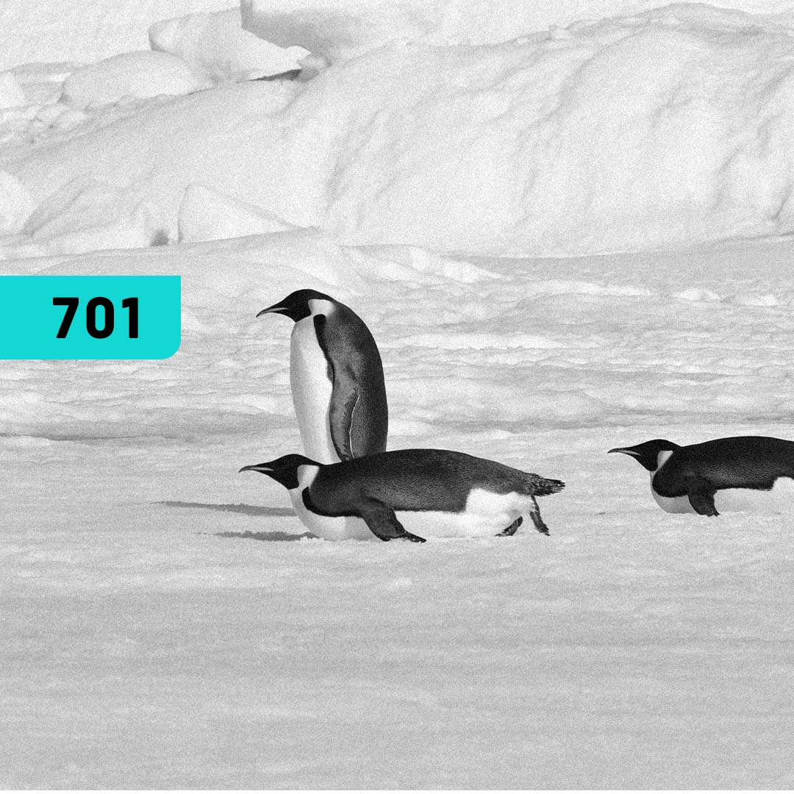

# Linux 

### Repository: [course](../../)
### Platform: <a href="./">4.Linux   </a>
### Software/Subject: <a href="./">linux   </a>

---

This folder refers to all the courses I took on the 4.Linux platform regarding the Linux software.

### Courses:
- <a href="./curso_077">curso_077 (Linux Fundamentals)   </a>
- <a href="./curso_083">curso_083 (Linux Essentials)   </a>