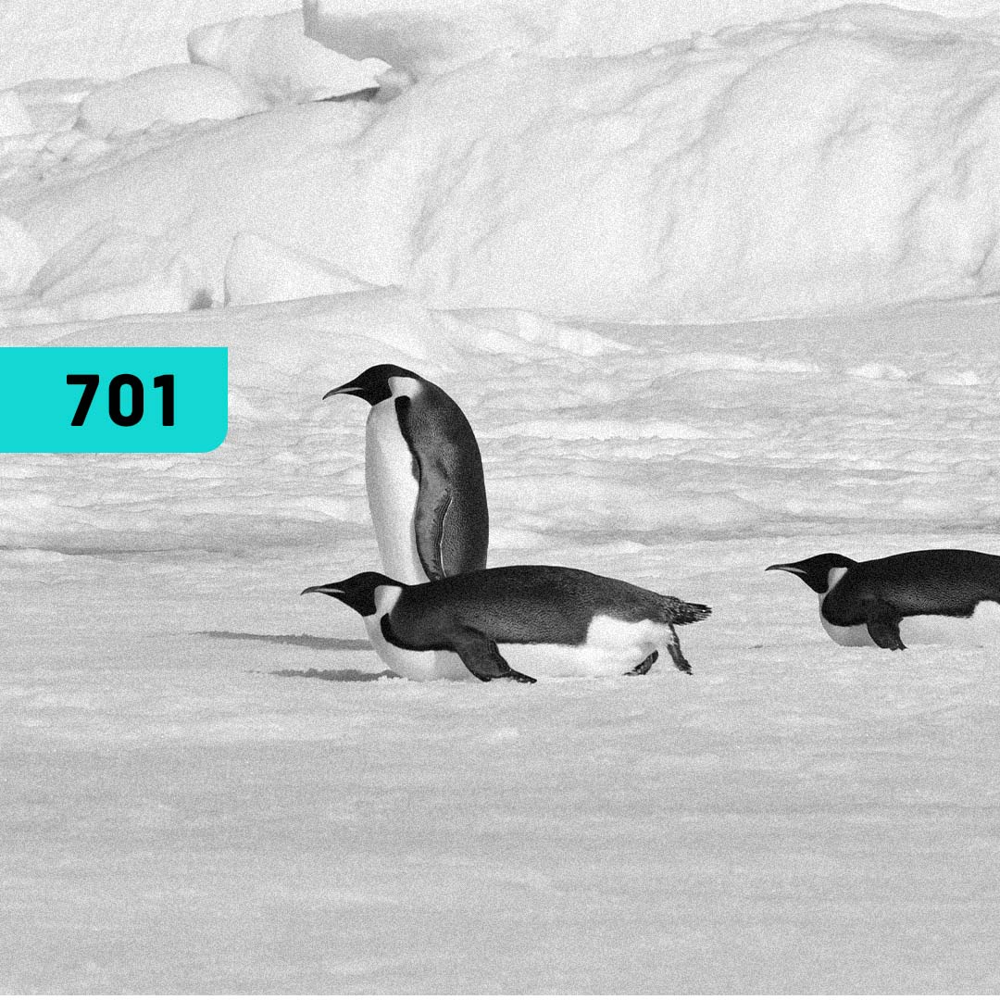

# Linux Fundamentals   

### Repository: [course](../../../)   
### Platform: <a href="../../">4.Linux   </a>   
### Software/Subject: <a href="../">linux   </a>
### Course: <a href="./">curso_077 (Linux Fundamentals)   </a>

#### <a href="https://github.com/PedroHeeger/main/blob/main/cert_ti/04-curso/os/linux/(23-08-22)%20Linux%20Fundamentals%20PH%204.Linux.pdf">Certificate</a>

---

### Theme:
- Operating System (OS)

### Used Tools:
- Operating System (OS): 
  - Linux 
  - Windows 11 
- Linux Distribution: 
  - Ubuntu 
- Virtualization: 
  - Oracle VM VirtualBox   
- Cloud Services:
  - Google Drive 
- Language:
  - HTML   
  - Markdown   
- Integrated Development Environment (IDE) and Text Editor:
  - Visual Studio Code (VS Code)   
- Versioning: 
  - Git   
- Repository:
  - GitHub   
- Command Line Interpreter (CLI):
  - Bash e Sh   

---

<a name="item0"><h3>Course Strcuture:</h3></a>
1. <a href="#item01">Aula 01: Bem-vindo ao Maravilhoso Mundo do Linux</a> 
2. <a href="#item02">Aula 02: Primeiros passos no Linux</a> 
3. <a href="#item03">Aula 03: Obtendo ajuda no Linux</a> 
4. <a href="#item04">Aula 04: Filesystem Hierarchy Standard e Comandos Indispensáveis</a> 
5. <a href="#item05">Laboratórios</a> 

---

### Objective:
Esse curso teve como objeto apresentar as ferramentas e comandos básicos do sistema operacional **GNU/Linux**.

### Structure:
A estrutura do curso é formada por:
- Este arquivo de README.md.
- A pasta `0-aux`, pasta auxiliar com imagens utilizadas na construção desse arquivo de README. 

### Development:
Este curso foi realizado em quatro aulas e três laboratórios, sendo estes últimos executados na maquina virtual da plataforma do curso. O acompanhamento do curso foi realizado em uma maquina virtual **Linux Ubuntu** com ambiente gráfico instanciada através do software **VM Virtual Box**. 

<a name="item01"><h4>Aula 01: Bem-vindo ao Maravilhoso Mundo do Linux</h4></a>[Back to summary](#item0)

Na primeira aula foram apresentados alguns assuntos teóricos inicias como: o mercado para o sistema Linux, os tipos de certificaçÕes Linux, a história do Linux, as licenças OpenSource, a evolução do sistema Linux e algumas distribuições existentes. Também foi apresentado o terminal e explicado superficialmente como funciona o sistema linux: representação por arquivos (tudo no Linux é arquivo), aspecto case-sensitive, permissões para executar arquivos, arquivos e diretórios ocultos, divisão em camadas, superusuário (root) e aspecto multitarefa / multiusuário.

<a name="item02"><h4>Aula 02: Primeiros passos no Linux</h4></a>[Back to summary](#item0)

A aula 2 foi inciada com uma explicação dos componentes básicos de uma rede (gateway, broadcast e máscara de rede) e a estrutura de um sistema operacional (Terminais Virtuas-TTY, Display Manager-DM, Sessões, Interface de Linha de Comando-CLI, etc.). Em seguida, foram introduzidos alguns comandos básicos (`shutdown`, `halt -p`, `poweroff`, `init 0`, `init 6`, `reboot`, `exit`, `logout`), foi explicado também como criar novas sessões no mesmo terminal e como sair delas, a diferença entre usuário comum e superusuário. Foi apresentado os conceitos de Shell, variáveis locais, variáveis globais e alias. Também foi ensinado sobre os arquivos de configuração do Shell. Por fim, o último tópico foi com relação aos caminhos e diretórios do Linux, utilizando comandos como `ls`, `cd`, `pwd`, entre outros.

<a name="item03"><h4>Aula 03: Obtendo ajuda no Linux</h4></a>[Back to summary](#item0)

Na terceira aula 3, o primeiro conteúdo apresentado foi as formas de documentação, que podem ser três: Howto's, Manuais e Documentação. No segundo conteúdo foi utilizado alguns comandos de ajuda como `help`, `apropos` e `whatis`. No assunto seguinte, foi explicado sobre o comando `man`, que guarda os manuais mais completos sobre determinados comandos, sendo divididos em nove pastas. O próximo conteúdo exibiu os comandos de informação `info`, `whereis` e `which`, além de apresentar outros programas como `yelp`, com ele é possível acessar manuais de forma gráfica, desde que esteja em uma distribuição Linux com ambiente gráfico. O software `xman`, que é um front-end para o comando `man`, que tenta facilitar o acesso as `man pages`, também através de uma interface gráfica.

<a name="item04"><h4>Aula 04: Filesystem Hierarchy Standard e Comandos Indispensáveis</h4></a>[Back to summary](#item0)

Na última aula, foi explicado sobre o **File Hierarchy Standard (FHS)** e a estrutura principal de diretórios do sistema, definindo cada diretório da raíz. Também foi mostrado alguns caracteres coringas que podem ser utilizados com os comandos, alguns deles são `*`, `!`, `?` e `[]`. No último conteúdo foi explorado o comando `find` com diversas flags existentes.

<a name="item05"><h4>Laboratórios</h4></a>[Back to summary](#item0)

##### Lab 1: (15:03)
Com a conclusão da primeira e segunda aula, foi realizado o laboratório 1, onde foram executados os seguintes comandos: `pwd`, `man ls`, `cd`, `cd -`, `apropos print`, `clear`, `ls /usr/share/man`, `fc -l -3`, `cd /`, `which halt` e `shutdown -r 15`.

##### Lab 2: (11:21)
Com a conclusão da terceira aula, foi realizado o laboratório 2, onde foram executados os seguintes comandos: `touch /tmp/auditoria.log`, `mkdir /etc/skel/Documentos`, `mkdir /etc/skel/Planilhas`, `mkdir /etc/skel/Lixeira`, `ls -R /etc/skel`, `ls -a /etc`, `cp /var/log/*.log /tmp`, `cp /etc/profile /tmp`, `mv /tmp/profile /tmp/perfil`, `find /etc/*.conf` e `rm -rf /tmp/*`.

##### Lab 3: (11:00)
Com a conclusão da quarta aula, foi realizado o último laboratório, onde foram executados os seguintes comandos: `cat /etc/passwd | wc -l`, `w`, `uname -r`, `df -h`, `file /etc/passwd`, `file /usr/bin/passwd`, `env`, `free -m` e `echo $HISTSIZE`.