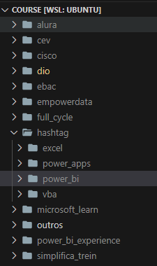

# COURSE

## EM CONSTRUÇÃO

#### Organização:
- Repositório: A organização dos arquivos de estudo são divididos em três repositórios no GitHub. O primeiro é o repositório **bootcamp**, que tem alguns arquivos de bootcamps que realizei. O segundo é o repositório **course**, contendo alguns arquivos de cursos que realizei. Já o terceiro cujo o nome do repositório é **video**, contém algumas aulas em vídeo que realizei.

- Primeiro Nível de Pastas: Cada um desses três repositórios possui pastas com o nome referente a plataforma em que realizei a aula (vídeo), o curso, ou o bootcamp.

<figure>
    
    <figcaption><small>Primeiro Nível de Pastas em um repositório.</small></figcaption>
</figure>

- Segundo Nível de Pastas: Um segundo nível de pastas é criado para pastas que contém muito material, sendo assim divididas por nome do software ou assunto (python, power_bi, mysql, javascript, analise_dados, etc.). 

<figure>
    
    <figcaption><small>Segundo Nível de Pastas em um repositório.</small></figcaption>
</figure>

- Terceiro Nível de Pastas: Por fim, o terceiro nível possui a pasta, indicada com um número de ordem para controle, onde terá todo material da aula (vídeo), curso ou bootcamp que realizei nos seus respectivos repositórios. Nessa pasta pode ter outras subpastas específicas, além de arquivos, todos referente a essa aula (vídeo), curso ou bootcamp específico.

<figure>
    
    <figcaption><small>Terceiro Nível de Pastas em um repositório.</small></figcaption>
</figure>

<figure>
     
    <figcaption><small>Pasta com todo material da aula (vídeo), curso ou bootcamp.</small></figcaption>
</figure>

Por enquanto, como este repositório e os outros dois estão em construção, só está disponível nesse repositório a pasta da plataforma **DIO** (Digital Innovation One), com o curso **curso_066** (Dev Week - Ifood Ciência de Dados com Python).

#### Plataformas:
- <a href="./dio">dio   </a>