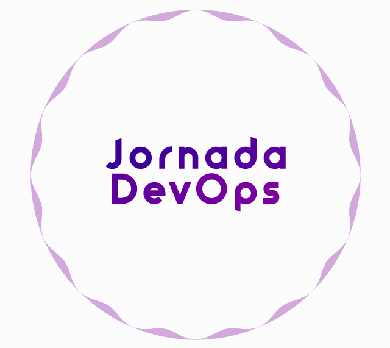

# Jornada DevOps   

### Repository: [course](../../../)   
### Platform: <a href="../../">Avanti   </a>  
### Software/Subject: <a href="../">devops   </a>
### Course: <a href="./">curso_089 (Jornada DevOps)   </a>

---

### Theme:
- DevOps

### Used Tools:
- Operating System (OS): 
  - Linux 
  - Windows 11 
- Cloud:
  - Amazon Web Services (AWS)   
- Cloud Services:
  - Amazon Elastic Compute Cloud (EC2)   
  - Amazon Elastic Container Registry (ECR)   
  - Amazon Elastic Kubernetes Service (EKS)   
  - AWS Identity and Access Management (IAM)   
  - Amazon Route 53   
  - Amazon Simple Storage Service (S3)   
  - Google Drive 
- Cluster Management Software:
  - Kubernetes   
- Configuration Management (CM):
  - Terraform   
  - Terraform Cloud   
- Language:
  - HTML   
  - Markdown   
  - YAML   
- Integrated Development Environment (IDE) and Text Editor:
  - Visual Studio Code (VS Code)   
- Versioning: 
  - Git   
- Repository:
  - GitHub   
- Command Line Interpreter (CLI):
  - AWS Command Line Interface (CLI)   
  - Bash e Sh   
  - Kubectl   
- Workflow Management System (WFMS):
  - GitHub Actions   
- Artificial Intelligence:
  - Brandmark   
  
---

<h3>Course Strcuture:</h3>
1. Jornada DevOps: Do projeto de provisionamento até a aplicação escalável - Dia 01
2. Jornada DevOps: Do projeto de provisionamento até a aplicação escalável - Dia 02
3. Jornada DevOps: Do projeto de provisionamento até a aplicação escalável - Dia 03

---

### Objective:
Esse curso teve como objeto exibir uma prática da cultural **DevOps** utilizando os seguintes softwares: **Terraform**, **AWS Cloud**, **GitHub Actions** e **Kubernetes**.

### Structure:
A estrutura do curso é formada por:
- Este arquivo de README.md.
- A pasta do projeto fornecida pela plataforma do curso, cujo nome é `avanti-masterclass-devops`.
- A pasta `0-aux`, pasta auxiliar com imagens utilizadas na construção desse arquivo de README. 

### Development:

Este cuso foi realizado em três aulas, porém todo o projeto já veio pronto. A pasta do projeto foi baixada do repositório da plataforma deste curso no **GitHub**, cujo nome é [avanti-masterclass-devops](https://github.com/rldourado/avanti-masterclass-devops.git). Esta pasta foi armazenada dentro do diretório deste curso `curso_089` e não foi versionada para o **GitHub**, pois decidi fazer esse curso apenas de forma teórica, sem executar a prática, sendo armazenado apenas no meu **Google Drive**.

O projeto consistiu em três etapas, sendo cada etapa executada em uma aula. Na primeira aula foi realizado a construção da infraestrutura na cloud da **AWS** através do software **Terraform**. Todos arquivos de código para o provisionamento da infraestrutura foi armazenado na sub-pasta do projeto de nome `iac`. Basicamente, os serviços utilizados na **AWS** foram: **Amazon ECR**, **Amazon EKS**, **Amazon Route53** e **Amazon S3**. Também foi utilizado a plataforma **Terraform Cloud** que é uma espécie de interface gráfica na internet para monitoramento e gerenciamento da infraestrutura construída pelo **Terraform**.

Na segunda aula com a sub-pasta do projeto de nome `pipelines_ci_cd` foram enviados dois arquivos de workflow para o **GitHub** para que os pipelines fossem executados através do **GitHub Actions**. Esses pipelines foram de teste de uma aplicação. Na última aula do curso, foi utilizado o CLI **Kubectl** para interagir da maquina local com o cluster criado na cloud da **AWS** e então criar o `volume`, o `deployment` da aplicação e o `service` a partir de arquivos de manifestos **YAML** elaborados previamente. O cluster pode ser monitorado tanto pelo serviço **Amazon EKS**, onde ele foi criado, como também pela plataforma do **Rancher**. A sub-pasta desta etapa foi a `kubernetes`.

