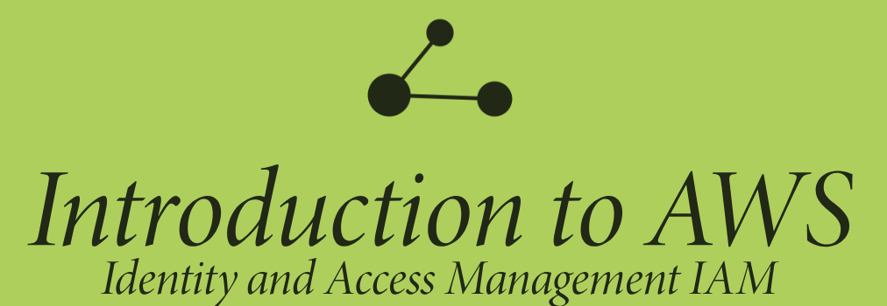

# AWS   

### Repository: [course](../../)
### Platform: <a href="../">aws_skill_builder   </a>
### Software/Subject: <a href="./">aws   </a>

---

This folder refers to all the courses I took on the AWS Skill Builder platform regarding AWS cloud.

### Courses:
- <a href="./curso_092">curso_092 (Introduction to Amazon Elastic Compute Cloud (EC2))   </a>
- <a href="./curso_094">curso_094 (Elementos essenciais do AWS Cloud Practitioner)   </a>
- <a href="./curso_096">curso_096 (Introduction to AWS Command Line Interface (CLI))   </a>
- <a href="./curso_098">curso_098 (AWS Identity and Access Management - Basics)   </a>
- <a href="./curso_099">curso_099 (Introduction to AWS Identity and Access Management (IAM))   </a>
- <a href="./curso_100">curso_100 (AWS Identity and Access Management - Architecture and Terminology)   </a>
- <a href="./curso_101">curso_101 (Authentication and Authorization with AWS Identity and Access Management)   </a>