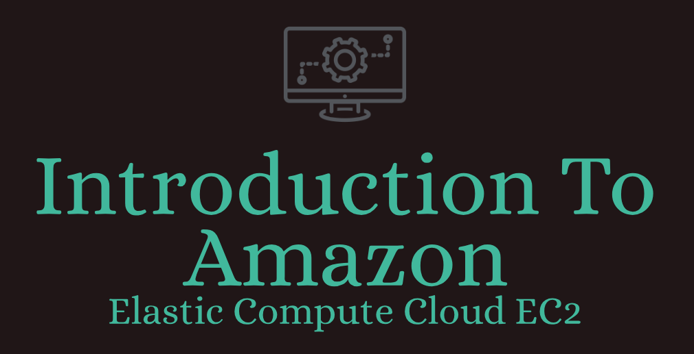

# Introduction to Amazon Elastic Compute Cloud (EC2)   

### Repository: [course](../../../)   
### Platform: <a href="../../">aws_skill_builder   </a>
### Software/Subject: <a href="../">aws   </a>
### Course: <a href="./">curso_092 (Introduction to Amazon Elastic Compute Cloud (EC2))   </a>

#### <a href="https://github.com/PedroHeeger/main/blob/main/cert_ti/04-curso/cloud/aws/(23-11-14)_Introduction...(EC2)_PH_AWSSB.pdf">Certificate</a>

---

### Theme:
- Cloud Computing

### Used Tools:
- Operating System (OS): 
  - Linux   
  - Windows 11   
  - Windows Server   
- Linux Distribution: 
  - Ubuntu   
- Cloud:
  - Amazon Web Services (AWS)   
- Cloud Services:
  - Amazon Elastic Compute Cloud (EC2)   
  - AWS Software Development Kit (SDK) - Boto3   
  - Google Drive   
- Language:
  - HTML   
  - Markdown   
  - Python   
- Integrated Development Environment (IDE) and Text Editor:
  - Visual Studio Code (VS Code)   
- Versioning: 
  - Git   
- Repository:
  - GitHub   
- Command Line Interpreter (CLI):
  - AWS Command Line Interface (CLI)   
  - Bash e Sh   
  - Windows PowerShell   
- Tools:
  - Windows Terminal   
- Network:
  - Filezilla   
  - OpenSSH   
  - PuTTY   
  - PuTTYgen   
  - PuTTY PSCP   
  - Telnet   
  - Windows Defender Firewall   
  - WinSCP   
- Remote Desktop Software:
  - Chrome Remote Desktop   
  - Remote Desktop Protocol Client (RDP Client)   
  - TeamViewer   
  - TeamViewer QuickSupport   
  - TeamViewer Universal Add-On   
  - Xrdp   

---

<a name="item0"><h3>Course Strcuture:</h3></a>
1. <a href="#item01">1.0 Introduction to Amazon Elastic Compute Cloud (EC2) (Portuguese)</a><br>
  1.1 <a href="#item01.01">1.1 Prática 1: Instanciando uma maquina na AWS</a><br>
2. <a href="#item02">2.0 Acesso Remoto Geral</a><br>
3. <a href="#item03">3.0 Acesso Remoto (OpenSSH)</a><br>
  3.1 <a href="#item03.01">Prática 2: OpenSSH - Acesso Remoto</a><br>
  3.2 <a href="#item03.02">Prática 3: OpenSSH - Execução Remota de Comandos</a><br>
  3.3 <a href="#item03.03">Prática 4: OpenSSH - Transferência de Arquivos</a><br>
  3.4 <a href="#item03.04">Prática 5: OpenSSH - Transferência de Pastas</a><br>
4. <a href="#item04">4.0 Acesso Remoto (PuTTY)</a><br>
  4.1 <a href="#item04.01">Prática 6: PuTTY (SSH) - Acesso Remoto</a><br>
  4.2 <a href="#item04.02">Prática 7: PuTTY (SSH) - Execução Remota de Comandos</a><br>
  4.3 <a href="#item04.03">Prática 8: PuTTY (SSH) - Transferência de Arquivos</a><br>
  4.4 <a href="#item04.04">Prática 9: PuTTY (SSH) - Transferência de Pastas</a><br>
  4.5 <a href="#item04.05">Prática 10: PuTTY (Telnet) - Acesso Remoto</a><br>
5. <a href="#item05">5.0 Acesso Remoto (PowerShell)</a><br>
  5.1 <a href="#item05.01">Prática 11: PowerShell - Acesso Remoto</a><br>
  5.2 <a href="#item05.02">Prática 12: PowerShell - Execução Remota de Comandos</a><br>
  5.3 <a href="#item05.03">Prática 13: PowerShell - Transferência de Arquivos</a><br>
  5.4 <a href="#item05.04">Prática 14: PowerShell - Transferência de Pastas</a><br>
6. <a href="#item06">6.0 Acesso Remoto (Outros)</a><br>
  6.1 <a href="#item06.01">Prática 15: VS Code - Acesso Remoto</a><br>
  6.2 <a href="#item06.02">Prática 16: WinScp - Transferência de Arquivos e Pastas</a><br>
  6.3 <a href="#item06.03">Prática 17: FileZilla - Transferência de Arquivos e Pastas</a><br>
7. <a href="#item07">7.0 Acesso Remoto Gráfico (RDP)</a><br>
  7.1 <a href="#item07.01">Prática 18: RDP Client - Windows-Windows Server</a><br>
  7.2 <a href="#item07.02">Prática 19: RDP Client - Windows-Linux</a><br>
  7.3 <a href="#item07.03">Prática 20: RDP Client - Windows-Windows</a><br>
8. <a href="#item08">8.0 Acesso Remoto Gráfico (Team Viewer)</a><br>
  8.1 <a href="#item08.01">Prática 18: RDP Client - Windows-Windows Server</a><br>
  8.2 <a href="#item08.02">Prática 19: RDP Client - Windows-Linux</a><br>
  8.3 <a href="#item08.03">Prática 20: RDP Client - Windows-Windows</a><br>
  8.4 <a href="#item08.04">Prática 20: RDP Client - Windows-Android</a><br>
9. <a href="#item09">9.0 Acesso Remoto Gráfico (Google Chrome Remote Dsktop)</a><br>
  9.1 <a href="#item09.01">Prática 18: RDP Client - Windows-Windows Server</a><br>
  9.2 <a href="#item09.02">Prática 19: RDP Client - Windows-Linux</a><br>
  9.3 <a href="#item09.03">Prática 20: RDP Client - Windows-Windows</a><br>
  9.4 <a href="#item08.04">Prática 20: RDP Client - Windows-Android</a><br>


 7.4 <a href="#item07.04">Prática 16: Server Manager (Windows Server-Windows Server) - Acesso Remoto</a><br>


  2.14 <a href="#item02.14">Prática 15: AnyDesk (Windows-Android) - Acesso Remoto</a><br>


---

### Objective:
O objetivo desse curso foi introduzir o serviço **Amazon Elastic Compute Cloud (Amazon EC2)**, um Web service que oferece capacidade computacional segura e redimensionável na nuvem. Neste curso, foi apresentado uma visão geral do serviço e demonstrado como criar e configurar uma instância do Amazon EC2. Também foi utilizado este curso para explicar sobre e como funciona diversas formas de acesso remoto entre maquinas com diferentes tipos de sistemas operacionais.

### Structure:
A estrutura do curso é formada por:
- Este arquivo de README.md.
- A pasta `resources` com os arquivos de teste de transferência, o arquivo de user data e o arquivo de script em **Python** para provisionamento da instância EC2.
- A pasta `0-aux`, pasta auxiliar com imagens utilizadas na construção desse arquivo de README. 

<div align="Center"><figure>
    <br>
    <figcaption>Imagem 01.</figcaption>
</figure></div><br>

### Development:

<a name="item01"><h4>1.0 Introduction to Amazon Elastic Compute Cloud (EC2) (Portuguese)</h4></a>[Back to summary](#item0)

O **Amazon EC2** significa Elastic Compute Cloud, onde *Compute* refere-se à capacidade computacional ou recursos do servidor. *Cloud* refere-se ao fato que esses são recursos de computação armazenados na nuvem e *Elastic* refere-se ao fato que propriamente configurado, é possível aumentar ou diminuir a quantidade de servidores necessários para uma aplicação de forma automática de acordo com as demandas atuais da aplicação. O **Amazon EC2** pode ser utilizado para diversos fins, sendo o principal o provisionamento de servidores. Um servidor é uma maquina ou um computador que é destinado para alguma finalidade específica. Existem vários tipos de servidores como: Application Server; Web Server; Database Server; Game Server; Mail Server; Media Server; Catalog Server; File Server; Computing Server; Proxy Server; Etc.

No **Amazon EC2** é utilizado o conceito de *Instâncias EC2*, as instâncias são virtualizações a nível de hardware em uma mesma maquina. Ou seja, em um computador através de um **Hyper Visor**, maquinas virtuais são criadas para serem utilizadas pelos usuários da cloud da **AWS**, essas maquinas virtuais que são chamadas de instâncias. Existe a possibilidade de provisionar uma maquina inteira como uma única instância, sem ter que dividir os recursos de uma mesma maquina em várias maquinas virtuais. Ao utilizar instâncias EC2 de uma mesma maquina, o isolamento entre elas impedem que uma possa acessar as informações da outra ou interagi-lás. Porém é possível permitir a comunicação de uma instância com outras instâncias da mesma maquina ou de outras maquinas e também com outros serviços da cloud.

Ao instanciar uma maquina virtual no EC2, algumas configurações devem ser determindas e, algumas delas influenciam na capacidade computacional e no custo, quanto maior a capacidade maior o custo da maquina. A primeira definição realizada é um valor para a tag padrão nome, outras tags podem ser criadas com suas chaves e valores específicas. Uma outra definição é qual sistema operacional será utilizado pela maquina virtual, para isso deve-se escolher uma *Amazon Machine Image (AMI)* que são imagens de sistemas operacionais já definidas para diversos tipos de sistemas operacionais. Também é possível escolher a arquitetura do processador (x86, ARM, etc.). Uma outra importante definição é o tipo de instância, onde é definido quantas CPUs e quantidade de memória ram serão utilizadas. Em seguida é definido um arquivo par de chaves que serve para conectar à instância.

Com relação as configurações de rede, deve-se definir qual **Virtual Private Cloud (VPC)** será utilizada, quais sub-redes dessa rede serão utilizadas, se será criado um novo grupo de segurança (Firewall) para esta rede ou será utilizado o padrão. Caso seja criado um novo grupo de segurança é necessário definir um nome e uma descrição para o grupo, além das regras que este contemplará. Também deve ser definido se o IP público será atribuído automaticamente ou não. Por padrão, cada região da **AWS** já possui uma VPC padrão com uma sub-rede para cada zona de disponibilidade desta região, além de um grupo de segurança padrão com uma única regra configurada que libera todas as portas de todos os protocolos para esta VPC, possibilitando a comunicação interna da rede, ou seja, comunicação entre as sub-redes da mesma VPC.

Na configuração de armazenamento é definido a quantidade de memória em gigas e qual tipo de volume de armazenamento que será associado às instâncias EC2. O tipo de volume de armazenamento é gerenciado pelo serviço **Amazon Elastic Block Store (EBS)**, onde cada tipo tem características e desempenho específicos. Também é possível fazer uma configuração avançada determinando outros parâmetros do volume que será criado associado à instância.

Já na parte de detalhes avançados, existem várias definições, porém a que mais utilizo é a opção *User data* onde é indicado um script ou um arquivo de script que é executado logo após a maquina virtual ser instanciada.

<a name="item01.01"><h4>1.1 Prática 1: Instanciando uma maquina na AWS</h4></a>[Back to summary](#item0)

Neste curso, foi utilizado o arquivo [ec2Instance.py](./resources/ec2Instance.py), armazenado no diretório [resources](./resources/), que era uma cópia deste mesmo arquivo do meu repositório privado de modelos. Neste arquivo existiam dois scripts em **Python**, um para criação e outro para exclusão de uma maquina virtual no serviço **Amazon Elastic Compute Cloud (EC2)** da **AWS**. O script utilizou o SDK **Boto3** para interagir a linguagem **Python** com as APIs dos serviços da **AWS**. Como na maquina física **Windows** onde o script era executado já possuía instalada a **AWS CLI** e configurada com o usuário do IAM administrador da minha conta da **AWS** (`PedroHeegerAdmin`), o **Boto3** utilizou as mesmas credenciais. Ao iniciar os scripts de criação e/ou exclusão, existiam estruturas de condição que verificavam uma entrada fornecida pelo usuário, se ela fosse positiva o comando era executado, caso contrário, não era executado. Também existiam outras condicionais que verificavam a existência ou não do elemeneto que deseja-se construir, no caso, uma instância do EC2. As variáveis utilizadas eram definidas antes desses comandos. 

Com relação as configurações da instância, a AMI utilizada foi `Ubuntu Server 22.04 LTS (HVM), SSD Volume Type` que era de um **Linux Ubuntu**, o tipo de instância foi a `t2.micro` para seguir no modo *free tier* e o arquivo de user data foi o [udFile.sh](./resources/udFile.sh). Este arquivo apenas atualizava os pacotes, o sistema, baixava e instalava os pacotes **Nano**, **Vim**, **Curl**, **Wget**, **Unzip**, **Zip** e **Git**. O par de chaves utilizado foi o `keyPairUniversal` que era um par de chaves já criado e que era utilizado na maioria dos meus projetos. Sobre a configuração de rede, foi utilizada a VPC padrão da região `us-east-1` (Norte da Virgínia), enquanto a sub-rede foi da zona de disponibilidade `us-east-1a`. O grupo de segurança foi o padrão desta VPC. Nas duas imagens (02 e 03) a seguir é exibido a execução do código em **Python** criando a instância e o dashboard das instâncias do EC2 no console da **AWS** mostrando a instância em execução.

<div align="Center"><figure>
    <br>
    <figcaption>Imagem 02.</figcaption>
</figure></div><br>

<div align="Center"><figure>
    <br>
    <figcaption>Imagem 03.</figcaption>
</figure></div><br>

Por fim, para mostrar que arquivo [udFile.sh](./resources/udFile.sh) foi executado e os pacotes foram instalados, a imagem 04 é exibida. Note que os software `Nano`, `Wget`, `Curl` e os demais foram instalados corretamente. Com o mesmo arquivo de **Python**, o segundo script foi executado para remover a instância quando ela não fosse mais necessária.

<div align="Center"><figure>
    <br>
    <figcaption>Imagem 04.</figcaption>
</figure></div><br>


<a name="item02"><h4>2.0 Acesso Remoto</h4></a>[Back to summary](#item0)

A partir desse tópico, os conteúdos foram elaborados para explicar como realizar procedimentos específicos de acesso remoto entre maquinas diferentes. O acesso remoto refere-se à capacidade de interagir com e controlar um sistema computacional, dispositivo ou rede a partir de um local diferente, permitindo a administração, transferência de arquivos ou execução de comandos à distância. Esse recurso é comumente utilizado para gerenciamento eficiente de servidores, máquinas virtuais ou dispositivos remotos. Dessa forma, foi apresentado como realizar acesso remoto, como executar um comando remotamente e como transferir arquivos entre maquinas diferentes com diferentes sistemas operacionais. 

Para fins de melhor compreensão, algumas considerações a serem feitas. A maquina física ou maquina local utilizada era minha maquina **Windows** principal que uso no dia a dia, quando estivesse utilizando outra maquina física que não seja essa, seria mencionado e esta seria uma maquina secundária. A cloud utilizada para criação de maquinas virtuais foi a **Amazon Web Services (AWS)** e foi explicado no item anterior como instanciar uma maquina no serviço **Amazon Elastic Compute Cloud (EC2)**. Foram instanciadas três maquinas, a primeira um **Linux Ubuntu**, cujo usuário dessa instância era `ubuntu`, a imagem de maquina (AMI) era `ami-0c7217cdde317cfec` e já tinha sido criada no item anterior. Esta não possuía interface gráfica. A segunda instância era um **Windows Server**, cujo usuário era `Administrator` e a AMI era `ami-0f9c44e98edf38a2b`. A terceira era um **Amazon Linux** com interface gráfica, cujo usuário era `ec2-user` e a AMI era `ami-02aead0a55359d6ec`. É importante confirmar as informações de login do sistema operacional escolhido. Os nomes dos dispositivos de armazenamento foram `/dev/xvda` para a instância **Ubuntu**, `/dev/sda1` para a instância **Amazon Linux** e qualquer um dos dois para a instância **Windows Server**.

Para instanciação dessas três maquinas foi utilizado o mesmo arquivo em **Python** [ec2Instance.py](./resources/ec2Instance.py), apenas alterando a variável que continha a imagem de maquina (AMI) dessas instâncias para a do sistema operacional correspondente, a variável do nome do dispositivo de armazenamento que a depender do sistema operacional escolhido, o nome desse dispositivo era diferente, e a variável de tag de nome. Essas instâncias eram do tipo `t2.micro` seguindo o modelo *free tier* e possuíram vinculado a elas, o arquivo par de chaves `keyPairUniversal` que é um par de chaves já criado e utilizado como padrão nos meus projetos. Esse par de chaves foi utilizado para autenticação do usuário durante acesso remoto quando necessário. O grupo de segurança padrão da VPC padrão da região e a sub-rede padrão da zona disponibilidade `us-east-1a` desta mesma VPC foram definidas como configuração de rede dessas maquinas. 

A depender da forma de acesso remoto escolhida, um protocolo de comunicação é utilizado e este funciona em uma porta padrão. Dessa forma, para que a conexão seja estabelecida de fato foi necessário criar uma regra de entrada neste grupo de segurança liberando a porta referente ao protocolo utilizado para acesso remoto. Na maioria dos exemplos foi utilizado o protocolo `SSH` que oferece comunicação criptografada e utiliza a porta `22`. Contudo em alguns casos foram utilizados protocolos `Telnet` para comunicação sem criptografia, cuja porta é a `23`, `RDP` para comunicação com interface gráfica, cuja porta é `3389`, entre outros.

Com relação as tranferências de arquivos, foram criados arquivos e pastas de testes para comprovar as execuções. O arquivo [fileTransfer.txt](./resources/fileTransfer.txt) foi elaborado para simular uma transferência de arquivos. Já pasta [folderTest](./resources/folderTest/) foi criada com dois arquivos, iguais o anterior, de nomes [fileTranfer1.txt](./resources/folderTest/fileTransfer1.txt) e [fileTranfer2.txt](./resources/folderTest/fileTransfer2.txt), para simular uma transferência de pasta recursivamente. A pasta [receiveTest] foi desenvolvida sem nenhum item dentro, apenas para receber as transferências quando o processo fosse inverso (instância para maquina física). Nesse caso, após cada execução os arquivos dentro desta pasta tinham que ser excluídos para executar o processo novamente, seja de uma outra forma ou da mesma forma. Eles também tinham que ser excluídos na maquina remota, caso fosse utilizado a mesma maquina em outro exemplo.

Durante boa parte deste tópico, o processo foi da maquina física principal **Windows** para maquina virtual **Linux Ubuntu**, a instância. Quando fosse utilizado outros sistemas operacionais seria informado.

<a name="item03"><h4>3.0 Acesso Remoto (OpenSSH)</h4></a>[Back to summary](#item0)

Uma forma bem simples de realizar o acesso remoto é com o software **OpenSSH** que se comunica através do protocolo SSH. O *Secure Shell (SSH)* é um protocolo de rede criptografado que permite o acesso remoto seguro a um computador ou servidor. Ele fornece uma maneira segura de autenticar e transmitir dados pela internet. O SSH é comumente usado para administração remota de sistemas, transferência segura de arquivos e execução de comandos remotamente. Ele criptografa todas as informações transmitidas, incluindo senhas, para proteger contra ataques e interceptações não autorizadas. O SSH opera na porta `22`, por tanto foi necessário criar uma regra de entrada permitindo acesso na porta `22` do protocolo `TCP` no grupo de segurança associado a essa instância.

##### Instalação em Windows

Na maquina física **Windows** para instalação do **OpenSSH** era possível realizar manualmente pela interface gráfica ou por um command line interface (CLI) como o **PowerShell**. Abrindo o **PowerShell** como administrador foi possível executar o comando `Get-WindowsCapability -Online | Where-Object Name -like 'OpenSSH*'` que listava as capacidades do **Windows** disponíveis online, ou seja, os recursos opcionais, filtrando apenas os recursos que começassem com `OpenSSH`. O **OpenSSH** é dividido em dois recursos o *OpenSSH.Client* e o *OpenSSH.Server*. Normalmente no **Windows**, o Client já vem instalado e o Server é necessário instalar. Esse comando mostrava exatamente o status dos dois recursos, conforme imagem 05 abaixo, que neste caso os dois já estavam instalados. Para instalação do Client o comando utilizado era o `Add-WindowsCapability -Online -Name OpenSSH.Client~~~~0.0.1.0`, já o comando do Server era `Add-WindowsCapability -Online -Name OpenSSH.Server~~~~0.0.1.0`.

<div align="Center"><figure>
    <br>
    <figcaption>Imagem 05.</figcaption>
</figure></div><br>

Também era possível instalar pela interface gráfica abrindo as `Configurações` em `Sistema` em `Recursos Opcionais`, o comando `start ms-settings:optionalfeatures` já abria direto nesta janela. Na opção `Adicionar recurso opcional` deve ser clicado em `Exibir recursos` e procurar por `OpenSSH`. Provavelmente vai aparecer `OpenSSH.Server`, pois o Client já vem instalado. Então é só clicar em instalar e aguardar a instalação ser concluída. Em `Recursos Instalados` dentro de `Recursos Opcionais` é possível pesquisar o **OpenSSH** e verificar se o Client e o Server foram instalados. A imamgem 06 ilustra essa execução.

<div align="Center"><figure>
    <br>
    <figcaption>Imagem 06.</figcaption>
</figure></div><br>

De volta ao **PowerShell** com o comando `Get-Service sshd` foi verificado se o serviço já estava em execução, caso não estivesse ele foi iniciado com `Start-Service sshd`. Agora o **OpenSSH** já estava funcionando na maquina física **Windows**. O **OpenSSH** pode ser utilizado pela interface de linha de comando (CLI), um shell como o **PowerShell** no **Windows** e o **Bash** no **Linux**, ou ainda através de software específicos que fazem uso do **OpenSSH** como é o caso do **Visual Studio Code (VS Code)**.

<a name="item03.01"><h4>3.1 Prática 2: OpenSSH - Acesso Remoto</h4></a>[Back to summary](#item0)

##### Windows -> Linux

Com o **OpenSSH** instalado na maquina física **Windows** e uma instância do EC2 de um **Linux Ubuntu** criada foi iniciado o acesso remoto. O comando `ssh username@host_name` é o comando básico utilizado para iniciar uma conexão SSH com uma maquina, onde `username` é o nome de usuário da maquina que deseja-se acessar e `host_name` é o nome do host, que pode ser o DNS ou IP público da instância. O parâmetro `-i` é adicionado quando é necessário informar um arquivo par de chaves privada, deve ser informado o caminho completo até o arquivo. Com os comandos `ssh -i G:/Meu Drive/4_PROJ/scripts/scripts_model/.default/secrets/awsKeyPair/keyPairUniversal.pem ubuntu@ec2-3-85-96-44.compute-1.amazonaws.com` e `ssh -i G:/Meu Drive/4_PROJ/scripts/scripts_model/.default/secrets/awsKeyPair/keyPairUniversal.pem ubuntu@3.85.96.44` executado no **PowerShell** aberto pelo software **Windows Terminal**, o acesso remoto a instância do EC2 pelo DNS e IP publico foi realizado. Na imagem 07 abaixo é exibido o acesso remoto sendo realizado da maquina física a instância do EC2 através do **OpenSSH** no **PowerShell**.

<div align="Center"><figure>
    <br>
    <figcaption>Imagem 07.</figcaption>
</figure></div><br>

Ao acessar remotamente instância, seja também com execução de comando ou transferência de arquivos, na primeira vez pode ser questionado se deseja continuar, pois a autenticidade da instância não foi estabelecida, neste caso, basta confirmar com `yes` que a maquina será marcada como confiável e adicionada ao arquivo `know_hosts` que fica no diretório do usuário na pasta `.ssh`. Esse arquivo contém todas as maquinas que já foram marcadas como confiáveis.

##### Windows -> Windows

Aqui o acesso remoto foi um pouco diferente, pois ao invés de instâncias foi utilizada outra maquina física **Windows**. Nela também foi instalado o Server do **OpenSSH** conforme explicação dita anteriormente. Duas formas eram possíveis para realizar esse acesso. A primeira era com as duas maquinas na mesma rede de internet, ou seja, conectadas ao mesmo Wi-Fi. Já a outra era com elas em duas redes diferentes. No **Windows** quando o **OpenSSH** é instalado e iniciado, geralmente uma regra no Firewall é criada automaticamente liberando o acesso de qualquer IP na porta `22` do protocolo `TCP`. Com o comando `Get-NetFirewallRule -Name '*OpenSSH*'` foi possível verificar essa regra no Firewall, conforme mostrado na imagem 10.

<div align="Center"><figure>
    <br>
    <figcaption>Imagem 10.</figcaption>
</figure></div><br>

Perceba que essa regra possuía um nome, um nome de display e uma descrição. Porém não foi possível visualizar detalhes específicos como porta, protocolo e IPs permitidos. Nessa caso, foi utilizado a interface gráfica do Firewall. O **Windows Defender Firewall** é uma ferramenta de segurança integrada ao sistema operacional **Windows** que monitora e controla o tráfego de rede, permitindo ou bloqueando a comunicação entre o computador e a internet com base em regras de segurança predefinidas ou personalizadas. Ele protege o computador contra ameaças externas, como ataques de rede e tentativas de acesso não autorizado. Ele é uma espécie de antivírus nativo do **Windows** e é nele que as regras de liberação de acesso são realizadas. Com o comando `wf.msc` executado no **PowerShell** foi possível abrir a janela do **Windows Defender Firewall** com segurança avançada e nela existia a opção `Regras de Entrada`. Ao clicar nesta opção, todas as regras de entrada foram listadas e era possível criar novas regras, alterar ou remover uma regra existente. Com isso, foi procurado a regra de nome `OpenSSH SSH Server (sshd)` que foi a regra criada automaticamente pelo **OpenSSH**. Ao dar um duplo clique nesta regra, as propriedades dela foram exibidas. Na aba `Geral`, note que a regra estava habilitada e a conexão estava permitida, conforme apresentado na imagem 11.

<div align="Center"><figure>
    <br>
    <figcaption>Imagem 11.</figcaption>
</figure></div><br>

Alterando para aba `Protocolos e Portas`, perceba que o tipo de protocolo foi definido como `TCP` e a porta local, ou seja, a porta nesta maquina onde o **OpenSSH** funcionaria era na própria porta padrão dele, a porta `22`. A porta remota estava definida como `Todas as portas`, pois poderia vim conexão de qualquer porta. Essas definições estavam bloqueadas, pois como essa regra foi gerada automaticamente não era possível alterar esses campos. Caso fosse preciso alterá-lo, uma nova regra deveria ser criada com as definições escolhidas. A imagem 12 exibe a aba `Protocolos e Portas`.

<div align="Center"><figure>
    <br>
    <figcaption>Imagem 12.</figcaption>
</figure></div><br>

Alterando novamente, agora para aba `Escopo`, observe que tanto o endereço de IP local e o remoto estavam liberados para qualquer endereço. Aqui era possível definir quais endereços de IP teriam acesso a essa maquina. A imagem 13 mostra essa aba.

<div align="Center"><figure>
    <br>
    <figcaption>Imagem 13.</figcaption>
</figure></div><br>

Dada essas informações, algumas configurações nesta regra do firewall foram feitas nas duas maquinas direto pela interface gráfica. Na maquina física principal, na aba `Geral` a ação foi alterada para `Bloquear a conexão`, pois estava maquina seria o Client, jamais o Server, já que ela era minha maquina principal. Na maquina física secundária, na aba `Escopo` em `Endereço de IP Local` foi adicionado o endereço de IP privado desta maquina secundária (`192.168.5.187`), o que significava que só aceitaria comunicação deste IP privado da rede, caso o IP desta maquina mudasse, não aceitaria comunicação. Neste mesma aba, em `Endereço de IP Remoto` foi definido os IPs de fora desta maquina que poderiam se comunicar com ela, no caso o IP privado da maquina principal era o único definido, pois só ela poderia se comunicar com esta maquina. Aqui tem que ter atenção para qual adaptador de rede a maquina está usando, pois pode existir um IP privado do adaptador de rede sem fio `Wi-Fi` e um IP privado para o adaptador `Ethernet Ethernet`. Então tem que verificar qual adaptador ela está utilizando para se conectar. Neste caso, foi adicionado logo os dois IPs que ela utilizava (`192.168.5.168` e `192.168.5.117`). Lembrando que esses IPs privados de ambos adptadores e ambas as maquinas podem modificar, pois o roteador ou modem do ISP provisiona IPs dinâmicos, a não ser que seja fixado um IP estático. A imagem 14 ilustra essa configuração na maquina física secudária **Windows**.

<div align="Center"><figure>
    <br>
    <figcaption>Imagem 14.</figcaption>
</figure></div><br>

Caso queira criar uma nova regra utilizando o **PowerShell**, o comando é o `New-NetFirewallRule -Name rule_name -DisplayName 'display_name' -Enabled True -Direction Inbound -Protocol TCP -Action Allow -LocalPort 22 -RemoteAddress 'ip'`, onde tem todas as definições necessárias para configurar a regra. Com relação a alteração de uma regra, isso pode ser feito com comando `Set-NetFirewallRule -Name 'rule_name' -RemoteAddress 'ip'`, indicando o nome da regra e o parâmetro que deseja alterar com a modificação. Já o comando `Remove-NetFirewallRule -Name 'name_rule'` remove uma regra de nome determinado.

O acesso remoto pela mesma rede foi realizado com o comando `ssh username@ip`, não sendo necessário informar um arquivo par de chaves, pois a senha do usuário acessado seria a senha da conta da **Microsoft** vinculada a maquina deste usuário. O username e IP foram substituídos pelo nome de usuário da maquina secundária e IP privado que esta maquina utilizava na rede interna. A imagem 15 exibe esse primeiro acesso remoto sendo realizado. Atenção aqui que o shell padrão do **Windows** é o **Prompt de Comando (Cmd)**, então os comandos a serem executados tem que ser do **Cmd** ou executar o comando `powershell` para iniciar uma sessão do **PowerShell** no **Cmd**.

<div align="Center"><figure>
    <br>
    <figcaption>Imagem 15.</figcaption>
</figure></div><br>

A segunda forma de acesso remoto foi com as duas maquinas em redes diferentes, utilizando o IP público ao invés de privado para realizar a conexão. No entanto, existem alguns empecilhos para essa execução. A conexão chegava na maquina remota, maquina secundária, pela internet que era fornecida por um provedor de serviço de internet (ISP). Esse provedor de serviço de internet pode bloquear algumas portas como forma de segurança e nessa situação, as soluções eram entrar em contato com o provedor para liberar a porta ou alterar a porta que o **OpenSSH** opera, modificando o arquivo de configuração `sshd_config`, que no **Windows** fica em `C:\ProgramData\ssh`, a linha que tem porta `22` para uma outra porta como a `2222`. Independentemente disso, também era necessário ir nas configurações do modem pelo navegador da maquina física e procurar a opção `Port-Fowarding` e criar uma regra redirecionando o que chega de todos os IPs em uma porta externa para o IP privado da maquina secundária em uma porta interna. Essas portas podem ser iguais ou diferentes. Assim o que chegaria de qualquer IP externo na porta `2222` iria para o IP privado desta segunda maquina na porta `2222`. Apesar de toda essa compreensão, ainda assim não conseguir realizar essa conexão através do IP público. Caso tenha alguma solução em mente, por favor entre em contato pelo meu **GitHub** ou **Linkedin**. As imagens 16 e 17 foram reservadas para essa execução.

<!-- <div align="Center"><figure>
    <br>
    <figcaption>Imagem 16.</figcaption>
</figure></div><br>

<div align="Center"><figure>
    <br>
    <figcaption>Imagem 17.</figcaption>
</figure></div><br> -->

##### Windows -> Windows Server

Agora o acesso remoto foi realizado da maquina física **Windows** em uma outra instância do EC2, um **Windows Server**. Como por padrão, o **OpenSSH** não vem instalado no **Windows Server**, foi preciso instalá-lo. Dessa forma, foi preciso realizar um outro tipo de acesso remoto, que era um acesso remoto gráfico com o **RDP Client**, ele vai ser explicado mais a frente. A instalação foi da mesma forma que foi executada na maquina física **Windows**. Com acesso remoto gráfico na instância, foi aberto o **PowerShell** como administrador e executado o comando `Get-WindowsCapability -Online | Where-Object Name -like 'OpenSSH*'` para verificar se o Client e o Server do **OpenSSH** estavam instalados. Normalmente no **Windows** ou **Windows Server**, o Client vem instalado, mas o Server tem que executar a instalação. A instalação pode ser feita pelo próprio **PowerShell** ou pela própria interface gráfica. Ambas as formas já foram explicadas anteriormente. Com o comando `Add-WindowsCapability -Online -Name OpenSSH.Server~~~~0.0.1.0` executado no **PowerShell** da instância, foi instalado o Server do **OpenSSH**. Após a instalação, o comando `Get-Service sshd` verificou se o serviço já estava em execução, caso não estivesse ele seria iniciado com `Start-Service sshd`. A imagem 08 ilustra todas esses comandos que foram executados no **PowerShell** da instância **Windows Server** para instalar o Server do **OpenSSH**.

<div align="Center"><figure>
    <br>
    <figcaption>Imagem 08.</figcaption>
</figure></div><br>

Assim o comando `ssh -i G:/Meu Drive/4_PROJ/scripts/scripts_model/.default/secrets/awsKeyPair/keyPairUniversal.pem administrator@3.85.96.44` pôde ser executado. Observe que o usuário foi alterado para `administrator` que era o usuário do **Windows Server**, o IP público era outro e o arquivo par de chaves continuou o mesmo, pois todas as instâncias foram construídas com mesmo arquivo par de chaves, o `keyPairUniversal`. Acontece que como o Server do **OpenSSH** não existia, a pasta padrão `.ssh` não foi gerada no diretório do usuário, e portanto o arquivo `authorized_keys` com a chave pública dessa chave privada não existia. Como o par de chaves era criado na **AWS**, só era possível ter acesso a chave privada, a pública era a **AWS** que gerenciava e como ela era necessária para o arquivo `authorized_key` para confirmar a autenticação, a autenticação não conseguiu ser efetuada. Duas soluções eram possíveis, uma era entrar com a senha do usuário `Administrator`, que era a senha originada da desencriptação do arquivo par de chaves `keyPairUniversal`. do arquivo par de chaves `keyPairUniversal` no console da **AWS**, ou gerar um arquivo par de chaves e fazer a configuração dele no server manualmente. Caso opte pela primeira forma, o comando foi simplificado para `ssh administrator@3.85.96.44`. Na imagem 09, o acesso remoto foi executado no **PowerShell** por uma outra aba do **Windows Terminal** conectando a instância do **Windows Server**.

<div align="Center"><figure>
    <br>
    <figcaption>Imagem 09.</figcaption>
</figure></div><br>

Tentei fazer da segunda forma, criando um novo arquivo par de chaves manualmente, mas acredito que isso não funciona muito bem de **Windows** para **Windows** ou para **Windows Server**. Também pesquisei a respeito e não vi materiais explicando como fazer essa conexão com uso de par de chaves, acredito que par de chaves seja mais utilizados para o sistema operacional **Linux**, enquanto no **Windows** a melhor forma é utilizando a senha do usuário. Logo a frente será explicado como criar esse arquivo par de chaves no **Windows** e configurá-lo no **Linux**.

##### Linux -> Windows Server

Pelo acesso remoto realizado no **Linux Ubuntu** da instância do EC2, foi executado um outro acesso remoto dentro deste conectando a maquina **Linux** a instância do **Windows Server**. Para isso, além de instalar o Server do **OpenSSH** no **Windows Server**, foi preciso instalá-lo também no **Linux** através dos comandos `sudo apt-get update` para atualizar os pacotes e `sudo apt-get install -y openssh-server` para instalar o Server de fato. A verificação se ele foi instalado corretamente foi feita com `ssh -V`. Com isso o comando utilizado para acesso remoto foi o mesmo anterior `ssh -i G:/Meu Drive/4_PROJ/scripts/scripts_model/.default/secrets/awsKeyPair/keyPairUniversal.pem administrator@3.85.96.44`, pois a conexão era na mesma instância, apenas partindo de uma maquina diferente. A imagem 10 evidencia essa etapa. 

<div align="Center"><figure>
    <br>
    <figcaption>Imagem 10.</figcaption>
</figure></div><br>

##### Criação de Arquivo Par de Chave

Ao invés de passar uma senha, poderia também ter sido construído um arquivo par de chaves privada com o **OpenSSH** através do comando `ssh-keygen -t rsa -b 2048 -N "" -f "keyPair"`. Isso poderia ser feito tanto no **Windows** como no **Linux**. O parâmetro `-t` define o tipo de chave como `RSA`, o parâmetro `b` define o número (quantidade) de bits em `2048`, o parâmetro `-N` define a uma senha vazia e o parâmetro `-f` define onde esse arquivo será salvo, sendo que ele deve ser de extensão `.pem`. Em alguns casos, a depender da versão do shell utilizado, o parâmetro `-N` pode não funcionar muito bem com uma senha vazia, contudo não há problema passar uma senha para essa chave. Esse comando gerou dois arquivos, um era a chave privada e o outro era a chave pública no formato `.pub`. Caso um nome não seja determinado para o arquivo, é definido o seguinte padrão `id_rsa` e `id_rsa.pub`, sendo que o `rsa` é o tipo de encriptação da chave, no qual outros tipos podem ser utilizados.

Normalmente este comando é executado na maquina local, onde o arquivo de chave privada é armazenado nele e o arquivo de chave pública é enviado para a maquina remota. O arquivo de chave privada é utilizado durante o acesso remoto para autenticar, e basicamente no server ele usa esse arquivo para achar o par dele que é a chave pública e então confirmar a autenticação. A imagem 15 evidencia a criação desse arquivo par de chaves na maquina principal. 

# MUDAR ESSA FOTO
<div align="Center"><figure>
    <br>
    <figcaption>Imagem 15.</figcaption>
</figure></div><br>

<a name="item03.02"><h4>3.2 Prática 3: OpenSSH - Execução Remota de Comandos</h4></a>[Back to summary](#item0)

##### Windows -> Linux

Como já foi explicado o acesso remoto entre várias maquinas diferentes, a execução de comandos remotamente foi explicado apenas da maquina física **Windows** para instância do EC2 **Linux Ubuntu** e o processo é exatamente o mesmo para as demais formas. Para executar um comando sem ter que fazer o acesso remoto, basta acrescentar um comando, no caso em **Bash** porque era um **Linux Ubuntu**, ao final do comando SSH e entre aspas. O comando `ssh -i "G:/Meu Drive/4_PROJ/scripts/scripts_model/.default/secrets/awsKeyPair/keyPairUniversal.pem" ubuntu@3.85.96.44 "ls /"` executou o comando `ls /` para listar tudo dentro da raíz do instância do EC2. Na imagem 18 é exibido o comando sendo executado na instância EC2 sem acessá-la remotamente.

<div align="Center"><figure>
    <br>
    <figcaption>Imagem 18.</figcaption>
</figure></div><br>

##### Linux -> Windows Server

Da instância **Linux** para a instância **Windows Server**, o comando foi `ssh -i "G:/Meu Drive/4_PROJ/scripts/scripts_model/.default/secrets/awsKeyPair/keyPairUniversal.pem" ubuntu@3.85.96.44 "ls /"` ... A imagem 19 mostra a execução desse comando.

<div align="Center"><figure>
    <br>
    <figcaption>Imagem 19.</figcaption>
</figure></div><br>

<a name="item02.03"><h4>2.3 Prática 4: OpenSSH - Transferência de Arquivos</h4></a>[Back to summary](#item0)

##### Windows -> Linux

Além do acesso remoto, uma outra execução importante é a transferência de arquivos entre as maquinas. Para transferir arquivos entre maquinas com o **OpenSSH**, o comando base é o `scp path_file username@host_name:path_destination` que é bastante parecido com o anterior. O *Secure Copy (SCP)* é um utilitário associado ao **OpenSSH** e é usado para transferir arquivos de forma segura entre máquinas remotas usando o protocolo SSH. Neste comando é indicado o arquivo que deseja-se transferir e sua extensão, a depender da pasta corrente pode ser necessário indicar o caminho completo para o arquivo, e também o caminho de destino, onde esse arquivo deverá ser armazenado na outra maquina. O processo inverso também é possível, ficando da seguinte maneira `scp username@host_name:path_file path_destination`. Caso seja necessário indicar um arquivo par de chaves, o parâmetro é o mesmo (`-i`). 

Com o comando `scp -i "G:/Meu Drive/4_PROJ/scripts/scripts_model/.default/secrets/awsKeyPair/keyPairUniversal.pem" fileTransfer.txt ubuntu@ec2-54-221-65-206.compute-1.amazonaws.com:/home/ubuntu`, o arquivo [fileTransfer.txt](./resources/fileTransfer.txt) foi transferido da maquina física para o diretório `/home/ubuntu` da instância EC2 **Linux Ubuntu**. O processo inverso foi executado com o comando `scp -i "G:/Meu Drive/4_PROJ/scripts/scripts_model/.default/secrets/awsKeyPair/keyPairUniversal.pem" ubuntu@ec2-54-221-65-206.compute-1.amazonaws.com:/home/ubuntu/fileTransfer.txt "G:/Meu Drive/4_PROJ/course/aws_skill_builder/aws/curso_092/resources/receiveTest/"` e esse mesmo arquivo foi transferido da instância para a pasta [receiveTest](./resources/receiveTest/) na maquina física. A imagem 20 evidencia esses dois processos.

<div align="Center"><figure>
    <br>
    <figcaption>Imagem 20.</figcaption>
</figure></div><br>

A atenção aqui é só com relação ao sistema de operacional escolhido, pois cada sistema possuí seu próprio sistema de arquivos e o caminho para o diretório ou arquivo tem que está correto, obedecendo o sistema de arquivos referente.

<a name="item03.04"><h4>3.4 Prática 5: OpenSSH - Transferência de Pastas</h4></a>[Back to summary](#item0)

##### Windows -> Linux

Com relação a transferência de pastas com arquivos, ou seja, recursivamente, o comando é o mesmo do anterior adicionando o parâmetro `-r "path_folder"` e informando o caminho da pasta. Com o comando `scp -i "G:/Meu Drive/4_PROJ/scripts/scripts_model/.default/secrets/awsKeyPair/keyPairUniversal.pem" -r "G:/Meu Drive/4_PROJ/course/aws_skill_builder/aws/curso_092/resources/folderTest" ubuntu@ec2-54-221-65-206.compute-1.amazonaws.com:/home/ubuntu`, a pasta `folderTest` foi enviada para o diretório do usuário `/home/ubuntu` da instância EC2. O processo inverso funcionou com o comando `scp -i "G:/Meu Drive/4_PROJ/scripts/scripts_model/.default/secrets/awsKeyPair/keyPairUniversal.pem" -r ubuntu@ec2-54-221-65-206.compute-1.amazonaws.com:/home/ubuntu/folderTest "G:/Meu Drive/4_PROJ/course/aws_skill_builder/aws/curso_092/resources/receiveTest"`. As imagens 21 e 22 mostram essa execução.

<div align="Center"><figure>
    <br>
    <figcaption>Imagem 21.</figcaption>
</figure></div><br>

<div align="Center"><figure>
    <br>
    <figcaption>Imagem 22.</figcaption>
</figure></div><br>

<a name="item04"><h4>4.0 Acesso Remoto (PuTTY)</h4></a>[Back to summary](#item0)

Uma outra forma de realizar acesso remoto é com o software **PuTTY**. O **PuTTY** é um cliente de código aberto usado para acessar remotamente computadores via SSH, Telnet, rlogin e outros protocolos de rede, permitindo a administração e o gerenciamento de sistemas **Linux** e outros sistemas operacionais Unix-like a partir de uma interface gráfica. Na realidade essa interface gráfica do **PuTTY** não permite acesso remoto gráfico, apenas fornece uma interface para configuração do acesso e ao concluir gera um interface de linha de comando própria do **PuTTY**.

Para instalar o **PuTTY** no **Windows** pode ser baixado o instalador do Microsoft Windows Installer (MSI) ou o arquivo binário pelo [site](https://www.chiark.greenend.org.uk/~sgtatham/putty/latest.html). Em ambos os casos, deve ser adicionado o executável ao path das variáveis de ambiente. O ideal é baixar o MSI pois já vem com todos os clients instalados, já o arquivo binário existem diversos, sendo cada um para um client específico. Também foi importante baixar o **PuTTYgen** que é um software utilizado para salvar o arquivo par de chaves privada no formato `.pem` em `.ppk`, formato utilizado pelo **PuTTY** para realização do acesso remoto. Este foi baixado através do [site](https://www.puttygen.com/).

##### Conversão de Chaves

Para converter o arquivo par de chaves formato `.pem` em `.ppk`, deve-se abrir o **PuTTYgen**, carregar o arquivo `.pem`, manter o parâmetro `Type of key to generate` em `RSA` e `Number of bits in a generated key` em `2048` e então clicar na opção `Save private key` e salvar com a extensão `.ppk`. Neste caso, não foi preciso criar uma senha, pois a autenticação seria feita por par de chaves. Então caso seja questionado sobre a não criação de senha, pode escolher a opção `Sim`. RSA é um algoritmo de criptografia de chave pública usado para a geração de pares de chaves, consistindo em uma chave pública e uma chave privada, permitindo a comunicação segura e autenticada entre duas partes em um ambiente de rede. A imagem 22 a seguir demonstra geração da chave privada no formato `.ppk`.

<div align="Center"><figure>
    <br>
    <figcaption>Imagem 22.</figcaption>
</figure></div><br>

<a name="item04.01"><h4>4.1 Prática 6: PuTTY - Acesso Remoto</h4></a>[Back to summary](#item0)

##### Windows -> Linux

Como dito anteriormente, o software **PuTTY** permite comunicação por vários protocolos, contudo nessa prática foi explicado como utilizar o **PuTTY** com o protocolo SSH. A conexão com o **PuTTY** pode ser feita tanto por uma interface gráfica que vai gerar a interface de linha de comando do **PuTTY** para executar os comandos na instância, ou também pelo próprio terminal da maquina física utilizando uma interface de linha de comando como o **PowerShell**. No primeiro caso deve-se abrir o software, no menu de opções a esquerda, em `Category` existe a opção `Session` que é a aberta por padrão. Nesta opção foi configurado o campo `Host Name`, que era o nome do host, que poderia ser o DNS ou IP público da instância do EC2 **Linux Ubuntu**. O campo `Port` foi mantido com `22`, pois é a porta padrão do SSH. No campo `Connection Type` foi mantida `SSH` já que era esse tipo de conexão. Em `Saved Sessions` era possível criar um nome para configuração da sessão que seria aberta e salvá-la para reutilizá-la em outra ocasião, ou também carregar ou deletar uma configuração já estabelecida. A imagem 23 mostra a configuração na opção inicial (`Session`). Dentro da opção `Connection` e em `SSH`, `Auth`, tinha a opção `Credentials` e no campo `Private key file for authentication` foi inserido o caminho até o arquivo par de chave no formato `.ppk`, a imagem 24 ilustra essa etapa. Já a imagem 25 mostra a interface de linha de comando fornecida pelo **PuTTY** para executar os comandos na instância. No **PuTTY**, igualmente ao **OpenSSH**, na primeira vez que um comando é executado ou um acesso remoto é realizado sempre aparece uma mensagem questionando se a maquina que está sendo acessada é confiável, como é uma maquina conhecida pode ser confirmado com `y`. Assim essa maquina vai ser adicionada ao arquivo `know_hosts`. Após isso, deve ser digitado o nome do usuário que neste caso era `ubuntu` já que a maquina instanciada era um **Linux Ubuntu**. A senha não foi exigida, porque a autenticação do usuário foi pelo arquivo par de chaves. Assim o acesso remoto pela interface gráfica do próprio **PuTTY** foi concretizada.

<div align="Center"><figure>
    <br>
    <figcaption>Imagem 23.</figcaption>
</figure></div><br>

<div align="Center"><figure>
    <br>
    <figcaption>Imagem 24.</figcaption>
</figure></div><br>

<div align="Center"><figure>
    <br>
    <figcaption>Imagem 25.</figcaption>
</figure></div><br>

Para executar o acesso remoto pelo **PuTTY** de uma interface de linha de comando da própria maquina, o comando básico é `plink -ssh ubuntu@host_name`, praticamente igual ao com o software **OpenSSH**. Lembrando que `ubuntu` é o nome de usuário da maquina instanciada e o `host_name` pode ser o DNS ou IP público da instância. O parâmetro `-i` pode ser adicionado com o caminho do arquivo par de chaves privada no formato `.ppk`. O comando `plink -i "G:/Meu Drive/4_PROJ/scripts/scripts_model/.default/secrets/awsKeyPair/keyPairUniversal.ppk" -ssh ubuntu@54.221.65.206` foi executado para realizar esse acesso remoto pelo **PuTTY** no **PowerShell** aberto com o **Windows Terminal**, conforme apresentado na imagem 26 a seguir.

<div align="Center"><figure>
    <br>
    <figcaption>Imagem 26.</figcaption>
</figure></div><br>

##### Windows -> Windows Server

Aqui foi executado o acesso remoto pela maquina física **Windows** na instância **Windows Server** e o processo foi o mesmo tanto usando a interface gráfica do **PuTTY** como executando por comando em uma CLI, como o **PowerShell**. O comando utilizado foi `plink -i "G:/Meu Drive/4_PROJ/scripts/scripts_model/.default/secrets/awsKeyPair/keyPairUniversal.ppk" -ssh ubuntu@54.221.65.206`, mas alterando o nome de usuário e o IP público da maquina que seria acessada. A imagem 27 mostra as duas formas de acesso, cada uma por uma interface de linha de comando diferente.

<div align="Center"><figure>
    <br>
    <figcaption>Imagem 27.</figcaption>
</figure></div><br>

##### Windows (Principal) -> Windows (Secundária)

Este exemplo foi idêntico ao executado com o **OpenSSH**, no qual a conexão poderia ser com as maquinas na mesma rede ou com elas em redes diferentes. Aqui foi abordado apenas com elas na mesma rede, pois como dito no tópico do **OpenSSH**, a conexão em redes diferentes tiveram alguns empecilhos que não foram sanados. Contudo, a conexão que funcionar com o **OpenSSH**, funcionará também com o **PuTTY**, pois ambos usam o protocolo SSH. No acesso remoto entre as maquinas físicas **Windows** não foi necessário passar um arquivo par de chaves, pois a autenticação foi realizada com a senha do usuário que fosse acessado. As mesmas configurações de Firewall realizadas no **Windows Defender Firewall** para o **OpenSSH** foram necessárias para o **PuTTY**. Neste caso, talvez fosse preciso criar a mesma regra de entrada só que para o **PuTTY**, pois a existente era vinculada ao **OpenSSH**. Assim de qualquer interface de linha de comando utilizada o acesso remoto seria atingido. O comando executado no **PowerShell** foi o ``plink -ssh username@ip`, indicando o nome de usuário da maquina física secundária e o IP privado desta maquina na rede. Quando é dito as maquinas na mesma rede, significa que elas precisam estar conectadas no mesmo modem do ISP, podendo haver um roteador local entre elas, o que importa é que o acesso final ao Gateway para comunicação com internet seja o mesmo para as duas. A imagem 28 evidencia o acesso remoto da maquina física principal a secundária com o **PuTTY** tanto pela sua interface como pelo **PowerShell** no **Windows Terminal**.

<div align="Center"><figure>
    <br>
    <figcaption>Imagem 28.</figcaption>
</figure></div><br>

##### Linux -> Windows Server

O **PuTTY** é comumente associado ao **Windows**, mas também possui uma versão para sistemas **Linux**. Para baixá-lo deve ser executado o comando `sudo apt-get update` para atualizar os pacotes e `sudo apt-get install -y putty` para instalar o **PuTTY**. Com o **PuTTY** instalado o comando é o mesmo para conexão, `plink -i "G:/Meu Drive/4_PROJ/scripts/scripts_model/.default/secrets/awsKeyPair/keyPairUniversal.ppk" -ssh ubuntu@54.221.65.206`. Como essa instância **Linux** não tem ambiente gráfico, a única forma de conectar na maquina remota foi com o comando sendo executado direto no shell, que no caso era o **Bash**. A imagem 29 exibe essa comunicação.

<div align="Center"><figure>
    <br>
    <figcaption>Imagem 29.</figcaption>
</figure></div><br>

<a name="item04.02"><h4>4.2 Prática 7: PuTTY (SSH) - Execução Remota de Comandos</h4></a>[Back to summary](#item0)

##### Windows -> Linux

Assim como no **OpenSSH**, no **PuTTY** é possível passar um comando ao final do comando `plink` para que ele seja executado dentro da instância, sem a necessidade de acessá-la. Isso foi feito com o comando `plink -i "G:/Meu Drive/4_PROJ/scripts/scripts_model/.default/secrets/awsKeyPair/keyPairUniversal.ppk" -ssh ubuntu@54.221.65.206 "ls /"` que executou o comando `ls /` dentro da instância do EC2 **Linux Ubuntu** para listar o diretório raíz. A imagem 30 exibe o resultado dessa execução. 

<div align="Center"><figure>
    <br>
    <figcaption>Imagem 30.</figcaption>
</figure></div><br>

##### Windows -> Windows Server

Aqui o comando é o mesmo, só alterando o comando que vai ser executado dentro da instância, que neste caso era o **Windows Server** para um comando do shell desse sistema, que no caso a interface de linha de comando padrão era o **Prompt de Comando (Cmd)**. A imagem 31 mostra a execução remota do comando na instância do **Windows Server** pelo **PowerShell** da maquina física **Windows**.

<div align="Center"><figure>
    <br>
    <figcaption>Imagem 31.</figcaption>
</figure></div><br>

<a name="item04.03"><h4>4.3 Prática 8: PuTTY - Transferência de Arquivos</h4></a>[Back to summary](#item0)

##### Windows -> Linux

Para transferir arquivos com o **PuTTY** utiliza-se o comando base `pscp "path_file" username@host_name:path_destination` que é bastante semelhante com o do **OpenSSH**. O processo inverso funciona também no **PuTTY** através do comando `pscp username@host_name:path_file "path_destination"`. Nestes comandos, além do nome de usuário e do nome de host, tem que ser fornecido o caminho do arquivo que deseja-se transferir e a pasta de destino na instância. No caso do processo inverso, o arquivo tem que ser informado na instância e a pasta destino é da maquina física. A adição do parâmetro `-i` pode ser utilizado se for necessária a autenticação do usuário através de arquivo par de chaves. Com o comando `pscp -i "G:/Meu Drive/4_PROJ/scripts/scripts_model/.default/secrets/awsKeyPair/keyPairUniversal.ppk" fileTransfer.txt ubuntu@ec2-54-221-65-206.compute-1.amazonaws.com:/home/ubuntu`, o arquivo [fileTransfer.txt](./resources/fileTransfer.txt) foi transferido da maquina física para o diretório `/home/ubuntu` da instância EC2. O processo inverso foi executado com o comando `pscp -i "G:/Meu Drive/4_PROJ/scripts/scripts_model/.default/secrets/awsKeyPair/keyPairUniversal.ppk" ubuntu@ec2-54-221-65-206.compute-1.amazonaws.com:/home/ubuntu/fileTransfer.txt "G:/Meu Drive/4_PROJ/course/aws_skill_builder/aws/curso_092/resources/receiveTest/"` e esse mesmo arquivo foi transferido da instância para a pasta [receiveTest](./resources/receiveTest/) na maquina física. A imagem 32 evidencia esses dois processos.

<div align="Center"><figure>
    <br>
    <figcaption>Imagem 32.</figcaption>
</figure></div><br>

Essa execução foi de **Windows** para **Linux**, mas poderia ser feita entre quaisquer sistemas operacionais, desde que seja informado o caminho correto, pois cada sistema operacional possui um sistema de arquivos próprio. Isso também vale para o próximo tópico que foi a transferência de pastas.

<a name="item04.04"><h4>4.4 Prática 9: PuTTY - Transferência de Pastas</h4></a>[Back to summary](#item0)

##### Windows -> Linux

Com relação a transferência de pastas com arquivos dentro, o comando é o mesmo anterior adicionando o parâmetro `-r` que significa recursivamente, similar ao comando do **OpenSSH**. Nesse caso, foi executado o comando `pscp -i "G:/Meu Drive/4_PROJ/scripts/scripts_model/.default/secrets/awsKeyPair/keyPairUniversal.ppk" -r "G:/Meu Drive/4_PROJ/course/aws_skill_builder/aws/curso_092/resources/folderTest" ubuntu@54.221.65.206:/home/ubuntu/` que transferiu a pasta [folderTest](./resources/folderTest/) com seus dois arquivos para o diretório do usuário `/home/ubuntu/` na instância EC2 **Linux Ubuntu**. O processo inverso funcionou com o comando `pscp -i "G:/Meu Drive/4_PROJ/scripts/scripts_model/.default/secrets/awsKeyPair/keyPairUniversal.ppk" -r ubuntu@54.221.65.206:/home/ubuntu/folderTest "G:/Meu Drive/4_PROJ/course/aws_skill_builder/aws/curso_092/resources/receiveTest/"`. Uma opção é acrescentar o parâmetro `-batch` após o `pscp` que faz com que seja aceita a conexão sem questionar ao usuário. Importante ressaltar que sempre que o envio for para uma pasta, esta pasta tem que existir na instância. A imagem 33 mostra essas duas transferências.

<div align="Center"><figure>
    <br>
    <figcaption>Imagem 33.</figcaption>
</figure></div><br>

<a name="item04.05"><h4>4.5 Prática 10: PuTTY (Telnet) - Acesso Remoto</h4></a>[Back to summary](#item0)

##### Windows -> Linux

O *Telnet* é um protocolo de rede que permite a comunicação remota entre dispositivos, permitindo que um computador se conecte e interaja com outro computador em uma rede através de uma conexão de terminal virtual. É amplamente utilizado para acesso remoto a sistemas, embora seja considerado inseguro devido à falta de criptografia, sendo substituído pelo *SSH* em muitos casos. Apesar de não ser recomendado, aqui foi realizado um exemplo de acesso remoto pelo **PuTTY** utilizando o protocolo Telnet. A conexão foi da maquina física **Windows** com a instância do EC2 **Linux Ubuntu** e foi realizada tanto pela interface gráfica do **PuTTY** como por comandos no **PowerShell**.

Na interface do **PuTTY**, algumas alterações foram necessárias, a primeira delas era remover o arquivo par de chaves, pois o Telnet não usava esse tipo de autenticação, a autenticação era por senha. Na opção inicial (`Session`) teve que ser alterado a porta para `23` que é a porta padrão do Telnet e o `Connection type` para `Telnet`. Por comandos, o comando executado foi `putty -telnet ip -l username`. Esses dois casos ainda não conseguiam se conectar por algumas razões. A primeira delas era que precisva ter uma regra de entrada no grupo de segurança vinculado a instância para liberar a porta `23`. A outra razão era a autenticação, a conexão iria ser feita, mas para autenticar o usuário seria necessário a senha dele. Por padrão em uma instância **Linux Ubuntu** do **Amazon Elastic Compute Cloud (EC2)**, o usuário `ubuntu` não possui uma senha, a autenticação é realizada por arquivo par de chaves. Então foi necessário acessar remotamente com protocolo SSH e alterar a senha do usuário `ubuntu` com o comando `sudo passwd ubuntu` e definir uma nova senha. Essa senha seria utilizada para autenticação durante a conexão pelo protocolo Telnet. A imagem 34 evidencia essa etapa executada.

<div align="Center"><figure>
    <br>
    <figcaption>Imagem 33.</figcaption>
</figure></div><br>


<a name="item05"><h4>5.0 Acesso Remoto (PowerShell)</h4></a>[Back to summary](#item0)

A realização do acesso remoto com o **PowerShell** é um pouco mais complicada, pois é preciso habilitar o recurso chamado *PowerShell Remoting*. O *PowerShell Remoting (PSRemoting)* é uma tecnologia que permite a execução de comandos e scripts do **PowerShell** em computadores remotos de forma eficiente e segura. Ele possibilita a administração e automação de tarefas em múltiplos computadores de maneira centralizada, facilitando a gestão de ambientes distribuídos. O *PowerShell Remoting* utiliza o protocolo *WS-Management* (*WinRM*) para comunicação entre computadores e oferece recursos como sessões de conexão remota, execução de comandos remotos e transferência de arquivos entre sistemas. O *Web Services Management (WS-Management)* é um protocolo padrão aberto de gerenciamento baseado em web, padronizado, utilizado para executar operações de gerenciamento em sistemas remotos de maneira interoperável e segura. Ele é frequentemente usado em conjunto com o *PowerShell Remoting* para permitir a execução remota de comandos **PowerShell**. Ele oferece uma abordagem padronizada para a administração e monitoramento de recursos em ambientes distribuídos. Já o *WinRM (Windows Remote Management)* é a implementação da **Microsoft** do protocolo *WS-Management (Web Services Management)* para sistemas **Windows**.

Para utilização do PSRemoting foi necessário habilitá-lo tanto no client, maquina física **Windows**, como no server, instância do EC2 **Windows Server**. Como no **Windows** da maquina física principal já estava tudo configurado, foi preciso configurar apenas na instância. Este processo necessitou da realização de algum acesso remoto com outra forma. A ideal é com o software **RDP Client** que é um acesso remoto gráfico e que vai ser explicado mais adiante. Porém, como o Server do **OpenSSH** já estava instalado, foi utilizado este software. 

No **PowerShell** da maquina física foi executado o comando `ssh username@ip` para se conectar a instância do EC2 **Windows Server**, informando a senha gerada no console da **AWS** com a desencriptação do arquivo par de chaves `keyPairUniversal` na opção `RDP client` do `Connect to instance`. Ao acessar a maquina, o shell padrão era o **Prompt de Comando (Cmd)**, então foi executado o comando `powershell` para iniciar uma sessão do **PowerShell** na instância. O comando `Enable-PSRemoting` foi utilizado para habilitar o acesso remoto. Várias configurações foram feitas após confirmar todas elas com o `A`. Primeiro, ele iniciava ou reiniciava o **WinRM**, depois definia esse serviço como automático, em seguida criava um listener para aceitar requisições de qualquer endereço IP, e por fim criava duas regras de entrada no firewall de mesmo nome (`Windows Remote Management (HTTP-In)`) permitindo acesso do tráfego na porta local `5985` do protocolo *WinRM*. Também foi questionado sobre uma operação do `Set-PSSessionConfiguration` que foi confirmada com `A`. Com o comando `Get-Item WSMan:\localhost\Service\AllowRemoteAccess` foi possível verificar o `PSRemoting` habilitado.

As diferenças entre essas duas regras era o `Profiles` que em uma era `Domain` e `Private` e o `Remote IP Address` em `Scope` era liberado para todos os IPs, enquanto na outra o `Profiles` era `Public` e o `Remote IP Address` era aberto apenas para sub-redes locais. Esta última configuração teve que ser alterada, modificando o `Remote IP Address` para qualquer IP, sendo executado com o comando `Get-NetFirewallRule -DisplayName "Windows Remote Management (HTTP-In)" | Where-Object { $_.Profile -contains "Public" } | Set-NetFirewallRule -RemoteAddress Any`.

Mesmo assim foi necessário verificar se existia uma regra no firewall do **Windows Server** da instância com o comando `Get-NetFirewallRule -DisplayName Windows Remote Management (HTTP-In)`. Caso não houvesse, era preciso criá-la com o comando `New-NetFirewallRule -Name winrm-http -DisplayName 'Allow WinRM HTTP' -Enabled True -Direction Inbound -Protocol TCP -Action Allow -LocalPort 5985`. Este comando definia a regra como habilitada, com um nome, um nome de display (nome visualizado na interface gráfica), uma direção, o protocolo como `TCP`, a ação como `permitir` e a porta local como `5985`, porta padrão do *WinRM* no protocolo `HTTP`. A porta padrão do *WinRM* para o protocolo `HTTPS` era a porta `5986`. A imagem 34 evidencia a criação da regra no firewall do **Windows Server** e o `PSRemoting` habilitado para acesso remoto, ambos na instância do EC2, sendo executado pelo acesso remoto da maquina física **Windows** via **OpenSSH** no **PowerShell**.

<div align="Center"><figure>
    <br>
    <figcaption>Imagem 34.</figcaption>
</figure></div><br>

Na maquina local **Windows** foi necessário adicionar a instância ao arquivos de hosts confiáveis e isso foi feito com o comando `Set-Item WSMan:\localhost\Client\TrustedHosts -Value "54.196.237.188"`, passando como valor o IP ou DNS público da instância, em outros casos poderia ser até o nome da maquina, mas como estava sendo realizada com instâncias EC2 tinha que ser o IP ou DNS público. Ao executar esse comando, o arquivo era sempre substituído, para que fosse adicionado, mantendo o que já existia no arquivo, tinha que ser acrescentado ao comando o parâmetro `-Concatenate`, ficando da seguinte forma `Set-Item WSMan:\localhost\Client\TrustedHosts -Value "54.196.237.188" -Concatenate`. Com o comando `Get-Item WSMan:\localhost\Client\TrustedHosts` os hosts confiáveis definidos no arquivo eram listados. Em seguida, foi realizado um teste de conexão para verificar se a maquina local conseguia se comunicar com a instância e isso foi feito com o comando `Test-NetConnection -ComputerName 54.196.237.188 -Port 5985` passando o IP público da instância e a porta `5985`, porta padrão do *WinRM* para o protocolo `HTTP`. Essa porta já estava liberada tanto no grupo de segurança da instância como no firewall do **Windows Server** dessa mesma instância, que era o **Windows Defender Firewall**. A imagem 35 lista as maquinas no arquivo de hosts confiáveis e mostra a conexão bem sucedida da maquina física com a instância.

<div align="Center"><figure>
    <br>
    <figcaption>Imagem 35.</figcaption>
</figure></div><br>


<a name="item05.01"><h4>5.1 Prática 11: PowerShell - Acesso Remoto</h4></a>[Back to summary](#item0)

##### Windows -> Windows Server

Com tudo configurado, o passo seguinte foi realizar o acesso remoto com o **PowerShell** da maquina física **Windows** na instância **Windows Server**. Isso foi realizado executando o comando `Enter-PSSession -ComputerName 54.196.237.188 -Credential administrator` que criou uma sessão interativa. O parâmetro `-Credential` era utilizado para autenticar o usuário na maquina e seu valor obedece o padrão `domain/username`. Caso a maquina não esteja em nenhum domínio, basta passar o `username`, que no caso era o `administrator`. Se as duas maquinas tivessem no mesmo domínio, esse parâmetro não era necessário. Também foi necessário informar a senha para credenciamento deste usuário que foi a mesma senha gerada no console da **AWS** em `RDP Client`. Na imagem 36 é exibido essa conexão da maquina física com a instância do EC2. Aqui neste caso, ao realizar o acesso o shell que é iniciado foi o **PowerShell** da instância.

<div align="Center"><figure>
    <br>
    <figcaption>Imagem 36.</figcaption>
</figure></div><br>

Ao executar um `Enter-PSSession` uma sessão foi criada e mesmo após sair dela, ela permanece aberta. Isso pode ser verificado com o comando `Get-PSSession` que lista todas sessões abertas. Para excluir essa sessão o comando foi o `Remove-PSSession -Id` informando o Id da sessão na lista. Também foi possível criar sessões sem entrar nelas, o que é muito útil quando deseja-se passar a sessão para uma variável ou vai reutilizá-la várias vezes, assim não é preciso digitar a senha toda vez que ela for usada. O comando utilizado foi o `New-PSSession -ComputerName 54.196.237.188 -Credential administrator` e os parâmetros utilizados foram os mesmos do `Enter-PSSession`. A imagem 37 evidencia a execução desses comandos.

<div align="Center"><figure>
    <br>
    <figcaption>Imagem 37.</figcaption>
</figure></div><br>

Após criar a sessão, foi possível executá-la com o comando `Enter-PSSession -Id 6`, informando seu Id da lista. Neste caso, não foi preciso passar o IP, nem o nome de usuário e a senha, pois tudo já estava configurado anteriormente. O comando `Exit-PSSession` era utilizado para sair de uma sessão. A imagem 38 mostra essas execuções.

<div align="Center"><figure>
    <br>
    <figcaption>Imagem 38.</figcaption>
</figure></div><br>

##### Windows -> Windows


##### Windows -> Linux


sudo iptables -L
sudo iptables -L -n


sudo iptables -A INPUT -p tcp --dport 5985 -j ACCEPT


`$credential = New-Object System.Management.Automation.PSCredential -ArgumentList "ec2-user", (Get-Content "G:/Meu Drive/4_PROJ/scripts/scripts_model/.default/secrets/awsKeyPair/keyPairUniversal.pem" | Out-String)`

`$Credential = New-Object -TypeName System.Management.Automation.PSCredential -ArgumentList @("ec2-user", (Get-Content "G:/Meu Drive/4_PROJ/scripts/scripts_model/.default/secrets/awsKeyPair/keyPairUniversal.pem" -Raw))`


`sudo yum install openssh-server`
Install-Module -Name OpenSSHUtils -Force
Install-Module SSHUtils -Scope CurrentUser -Force
Get-Module -ListAvailable SSHUtils

<a name="item05.02"><h4>5.2 Prática 12: PowerShell - Execução Remota de Comandos</h4></a>[Back to summary](#item0)

##### Windows -> Windows Server

Com relação a execução de comandos remotamente, o comando utilizado foi o `Invoke-Command -ComputerName 54.196.237.188 -Credential administrator -ScriptBlock { Get-HotFix -Id KB5012170 }`, basicamente ele utiliza os mesmos parâmetros do `PSSession` adicionando o parâmetro `ScriptBlock` com o comando que deve ser executado dentro da instância, que no caso foi `Get-HotFix -Id KB5012170`. É possível criar uma sessão e armazená-la em uma variável e utilizar como parâmetro para substituir `-ComputerName` e `-Credential`, já que a sessão já estaria totalmente configurada. Os comandos seriam `$session = New-PSSession -ComputerName 54.196.237.188 -Credential administrator` e `Invoke-Command -Session $session -ScriptBlock { Get-HotFix -Id KB5012170 }`. A imagem 39 abaixo evidencia essa etapa.

<div align="Center"><figure>
    <br>
    <figcaption>Imagem 39.</figcaption>
</figure></div><br>

<a name="item05.02"><h4>5.3 Prática 13: PowerShell - Transferência de Arquivos</h4></a>[Back to summary](#item0)

##### Windows -> Windows Server

Para transferir um arquivo da maquina física **Windows** para instância do EC2 **Windows Server** usando o **PowerShell** é bem simples. Deve utilizar o comando de cópia padrão que é o `Copy-Item` acrescentando o parâmetro `-ToSession` no final, indicando uma sessão do `PSSession`. Atenção para os caminhos das pastas e arquivos. Com o comando `Copy-Item -Path "G:\Meu Drive\4_PROJ\course\aws_skill_builder\aws\curso_092\resources\fileTransfer.txt" -Destination "C:\Users\Administrator\" -ToSession $Session` foi utilizado uma variável com sessão já criada para enviar o arquivo [fileTransfer.txt](./resources/fileTransfer.txt) da maquina física para a instância. Em seguida, com o comando `Invoke-Command -Session $session -ScriptBlock { Get-ChildItem "C:\Users\Administrator" | Format-Table }` foi executado um comando remoto pelo **PowerShell** da maquina física na instância, para listar o diretório onde o arquivo foi enviado. A imagem 40 mostra essa transferência.

<div align="Center"><figure>
    <br>
    <figcaption>Imagem 40.</figcaption>
</figure></div><br>

O processo inverso também funciona alterando a ordem dos caminhos e modificando o parâmetro `-ToSession` para `-FromSession` e informando a mesma variável da sessão. Com o comando `Copy-Item -Path "C:\Users\Administrator\fileTransfer.txt" -Destination "G:\Meu Drive\4_PROJ\course\aws_skill_builder\aws\curso_092\resources\receiveTest\" -FromSession $Session` essa transferência foi executada. Já com o comando `Get-ChildItem "G:\Meu Drive\4_PROJ\course\aws_skill_builder\aws\curso_092\resources\receiveTest" | Format-Table` foi listado o arquivo na pasta como mostrado na imagem 41 abaixo. Caso seja transferido mais de uma vez o mesmo arquivo, ele substitui o arquivo existente. 

<div align="Center"><figure>
    <br>
    <figcaption>Imagem 41.</figcaption>
</figure></div><br>

<a name="item05.04"><h4>5.4 Prática 14: PowerShell - Transferência de Pastas</h4></a>[Back to summary](#item0)

##### Windows -> Windows Server

Para transferir pasta com arquivos, ou seja, recursivamente, a ideia é a mesma. Bastava acrescentar aos comandos o parâmetro `-Recurse` no final. A pasta [folderTest](./resources/folderTest/) foi transferida para maquina remota, no caso a instância **Windows Server**, com o comando `Copy-Item -Path "G:\Meu Drive\4_PROJ\course\aws_skill_builder\aws\curso_092\resources\folderTest" -Destination "C:\Users\Administrator\" -ToSession $Session -Recurse` e foi os arquivos dessa pasta já na maquina remota foram listados com o comando `Invoke-Command -Session $session -ScriptBlock { Get-ChildItem "C:\Users\Administrator\folderTest" | Format-Table }`. A imagem 42 evidencia a transferência dessa pasta para a maquina remota.

<div align="Center"><figure>
    <br>
    <figcaption>Imagem 42.</figcaption>
</figure></div><br>

O processo inverso foi realizado com o comando `Copy-Item -Path "C:\Users\Administrator\folderTest" -Destination "G:\Meu Drive\4_PROJ\course\aws_skill_builder\aws\curso_092\resources\receiveTest\" -FromSession $Session -Recurse` que transferiu essa pasta da instância do EC2 **Windows Server** para a maquina física **Windows**. Os arquivos dessa pasta foram listado com o comando `Get-ChildItem "G:\Meu Drive\4_PROJ\course\aws_skill_builder\aws\curso_092\resources\receiveTest\folderTest" | Format-Table`, conforme mostrado na imagem 43.

<div align="Center"><figure>
    <br>
    <figcaption>Imagem 43.</figcaption>
</figure></div><br>


<a name="item06"><h4>6.0 Acesso Remoto (Outros)</h4></a>[Back to summary](#item0)

Neste item foi apresentado outras formas de realizar acesso remoto.

<a name="item06.01"><h4>6.1 Prática 15: VS Code (Windows-Linux) - Acesso Remoto</h4></a>[Back to summary](#item0)

##### Windows -> Linux

Uma outra forma de acesso remoto é através do ambiente de desenvolvimento integrado (IDE) **Visual Studio Code (VS Code)**. Com a utilização da extensão **Remote - SSH (Remote Explorer)** é possível abrir o **VS Code** na instância criada ou até em uma pasta específica desta instância através de uma conexão SSH. As configurações são armazenadas em um arquivo `config` dentro da pasta `.ssh` que fica no diretório do usuário. Através desse arquivo de configuração, a extensão **Remote Explorer** consegue listar as conexões existentes, e assim é possível executar o acesso remoto em uma nova janela ou na janela atual do **VS Code**. 

Para criar uma nova conexão SSH, dentro do **VS Code** foi necessário ir na extensão e na opção `SSH` clicar no `+` para abrir a paleta de comandos já na opção `Remote-SSH:Add New SSH Host...`, ou então pesquisar essa opção ao abrir a paleta de comandos com `Ctrl + Shift + P`. Em seguida, digitar o comando do **OpenSSH** (`ssh -i "G:/Meu Drive/4_PROJ/scripts/scripts_model/.default/secrets/awsKeyPair/keyPairUniversal.pem" ubuntu@54.221.65.206`) passando o arquivo par de chaves privada no formato `.pem`. Com isso, foi questionado onde seriam salvas as informações de configuração, que neste caso foram salvas em `.ssh/config` no diretório do usuário. Assim aparecereu como opção a nova instância configurada na barra lateral do **VS Code**. Em alguns casos, pode ser necessário atualizar as informações do **Remote - SSH** para as alterações serem realizadas. O arquivo de configuração armazena cada configuração SSH criada na seguinte estrutura abaixo.

```
Host 54.221.65.206
  HostName 54.221.65.206
  IdentityFile "G:\Meu Drive\4_PROJ\scripts\scripts_model\python\.default\secrets\keyPairTest.pem"
  User ubuntu
```

O `HostName` é o nome do host, ou seja, o IP ou DNS público da maquina, o `IdentityFile` é o caminho completo para o arquivo par de chaves privada no formato `.pem` e o `User` é o nome de usuário no qual deseja-se acessar, que no caso foi `ubuntu`, pois era a maquina **Linux Ubuntu**. Também é possível criar a conexão diretamente no arquivo passando as informações: `Host`, `HostName`, `IdentityFile` e `User`. Outras configurações adicionais podem ser realizadas. Após a configuração da instância, bastava ir nela e escolher se seria aberta na janela atual ou em uma nova janela do **VS Code**. Se fosse em uma nova janela, após abrir deveria ser escolhido qual era a pasta de trabalho. Vale lembrar que a instância é uma maquina **Linux Ubuntu**, logo o sistema de arquivos é diferente da maquina física **Windows**. Na imagem 36 é evidenciado uma janela do **VS Code** aberta no diretório `/home/ubuntu` da instância. Na imagem 37 é mostrada a lista de maquinas e diretórios de trabalhos configurados na extensão **Remote SSH**. Já na imagem 38 é exibido o arquivo de configuração `.ssh/config`.

<div align="Center"><figure>
    <br>
    <figcaption>Imagem 36.</figcaption>
</figure></div><br>

<div align="Center"><figure>
    <br>
    <figcaption>Imagem 37.</figcaption>
</figure></div><br>

<div align="Center"><figure>
    <br>
    <figcaption>Imagem 38.</figcaption>
</figure></div><br>

Isso foi executado de um **Windows** para **Linux**, mas poderia ser executado entre qualquer sistema operacional desde que o Client tivesse instalado o **Visual Studio Code (VS Code)**, a extensão **Remote - SSH (Remote Explorer)** e o software **OpenSSH**.

<a name="item06.02"><h4>6.2 Prática 16: WinScp (Windows-Linux) - Transferência de Arquivos e Pastas</h4></a>[Back to summary](#item0)

##### Windows -> Linux

Uma outra forma de transferir arquivos foi através do software **Winscp** que possui uma interface gráfica. Para utilizá-lo, foi necessário baixar e instalar esse software, que pode ser encontrado no [site](https://winscp.net/eng/download.php). Com ele na maquina, ao abri-lo, teve que ser escolhida a opção `Nova Aba` para configurar uma sessão. Na janela que abriu, os campos foram preenchidos da seguinte forma: o `Protocolo de arquivo` foi o `SFTP`, o `Host` foi o IP ou DNS público da instância, a porta foi `22`, o usuário foi `ubuntu` e a senha foi mantida em branco, pois ao clicar na opção `Avançado...` uma nova janela foi aberta. Nesta nova janela foi selecionada a opção `SSH` em `Autenticação` e no campo `Arquivo de Chave Privada` foi inserido o caminho até o arquivo par de chaves formato `.ppk`, as demais configurações foram mantidas como estavam e então pode ser feita a confirmação das duas janelas. As imagens 39 e 40 mostram as configurações dessas duas janelas.

<div align="Center"><figure>
    <br>
    <figcaption>Imagem 39.</figcaption>
</figure></div><br>

<div align="Center"><figure>
    <br>
    <figcaption>Imagem 40.</figcaption>
</figure></div><br>

Após confirmar em `Login` a conexão foi realizada e uma mensagem foi apresentada informando que o servidor era desconhecido e se queria adicionar a chave ao cache, que foi confirmado com `Sim`. Assim do lado direito era aberto no diretório do usuário (`/home/ubuntu`) da instância e do lado esquerdo no diretório que fosse escolhido na maquina física, neste caso foi selecionado o diretório `resources` deste curso, onde estavam os arquivos que deveriam ser transferidos. Para enviar os arquivos era só arrastá-los do lado esquerdo (maquina físca) para o lado direito (instância) e o envio era executado. As imagens 41 e 42 mostram o antes e o depois do envio dos arquivos. Ao enviar os arquivos, uma mensagem de confirmação aparecia e que podia ser confirmado no `ok`.

<div align="Center"><figure>
    <br>
    <figcaption>Imagem 41.</figcaption>
</figure></div><br>

<div align="Center"><figure>
    <br>
    <figcaption>Imagem 42.</figcaption>
</figure></div><br>

Aqui também foi realizado de **Windows** para **Linux**, sendo possível fazer o processo inverso que era arrastar um arquivo do **Linux** para o **Windows**. Entretanto essa execução funcionaria entre maquinas de qualquer sistema operacional desde que a maquina client tivesse ambiente gráfico para executar o **WinSCP**. Esse mesmo requisito era necessário para o software **FileZilla** que é o próximo tópico.

<a name="item06.03"><h4>6.3 Prática 17: FileZilla - Transferência de Arquivos e Pastas</h4></a>[Back to summary](#item0)

##### Windows -> Linux

A interface do outro softare, o **Filezilla** é parecida com o do **Winscp**. Também foi necessário baixar e instalar esse software através do [site](https://filezilla-project.org/). Com o **FileZilla** aberto, observe que a tela também era divida em esquerda (diretório da maquina física) e direita (diretório da instância). Para criar uma nova conexão, existia opção rápida que já era visível na tela, onde deveria ser informado o `Host`, `Nome de usuário`, `Senha` e `Porta`. Para configurar o arquivo par de chaves teve que ir em `Arquivos` e escolher a opção `Gerenciador de Sites...` para abrir a janela de configuração. O protocolo selecionado foi o `SFTP` que utiliza o `SSH` junto com o protocolo `FTP`, o `Host` era o IP ou DNS público da instância, a porta foi a `22`, já que também era uma conexão `SSH`. No campo `Tipo de logon` foi selecionado a opção `Arquivo chave`, o usuário foi o `ubuntu` e em `Arquivo com chave` foi inserido o caminho para o arquivo par de chaves `.pem` ou `.ppk`. Na imagem 43 logo abaixo é exibida a configuração de conexão com a instância.

<div align="Center"><figure>
    <br>
    <figcaption>Imagem 43.</figcaption>
</figure></div><br>

Um ponto legal do **FileZilla** é que em cada lado (esquerdo e direto), ele dividia em superior e inferior, onde em superior mostrava a estrutura de pastas e em inferior mostrava os arquivos da pasta selecionada em cima, isso nas duas maquinas. O processo de transferência era o mesmo, só arrastar o arquivo de um lado para o outro. Na imagem 44 é ilustrado após a transferência dos arquivos.

<div align="Center"><figure>
    <br>
    <figcaption>Imagem 44.</figcaption>
</figure></div><br>

<a name="item07"><h4>7.0 Acesso Remoto Gráfico (RDP)</h4></a>[Back to summary](#item0)

Nesse item foi abordado sobre como realizar acesso remoto gráfico, ou seja, como realizar o acesso remoto a uma maquina visualizando seu ambiente gráfico. Dessa forma, as maquinas remotas tinha que ter ambiente gráfico. Como a instância do EC2 **Linux Ubuntu** não tinha, ela não foi utilizada e em seu lugar foi instaciada uma outra maquina cujo sistema operacional era de um **Amazon Linux** com interface gráfica. 

O protocolo utilizado para esse tipo de acesso foi o Remote Desktop Protocol (RDP), ou Protocolo de Área de Trabalho Remota. O RDP é um protocolo proprietário desenvolvido pela **Microsoft** que permite aos usuários se conectar e interagir com um computador remotamente através de uma interface gráfica, fornecendo acesso a programas, arquivos e recursos como se estivessem fisicamente presentes na máquina remota. Este protocolo opera na porta `3389` do protocolo `TCP`. Por tanto, foi necessário criar uma regra de entrada no grupo de segurança vinculado as instâncias permitindo o acesso neste protocolo.

Para conexão via RDP foi utilizado um software nativo do **Windows** que é o **RDP Client** ou **Conexão de Área de Trabalho Remota (Remote Desktop Connection)**. O **Remote Desktop Protocol Client (RDP Client)** é uma aplicação que permite aos usuários acessar e controlar remotamente um computador **Windows**, possibilitando a visualização e interação com a área de trabalho do sistema remoto.

<a name="item07.01"><h4>07.1 Prática 18: RDP Client - Windows-Windows Server</h4></a>[Back to summary](#item0)

Nesta prática foi realizada o acesso remoto da maquina física **Windows** na instância do EC2 **Windows Server**. Para isso foi necessário ir no console de gerenciamento da **AWS** e ir no serviço **Amazon Elastic Compute Cloud (EC2)** para visualizar as instâncias. Em seguida, foi selecionada a instância que seria conectada que era a **Windows Server** e clicada na opção `Connect`. A página atual foi direcionando para a página `Connect to instance`. Nesta, existiam três abas, sendo cada uma com uma forma de conexão. As abas eram: `Session Manager` que é um recurso do serviço **AWS System Manager (SSM)**, `RDP client` que foi a forma utilizada, e `EC2 serial console`. 

Em `RDP client` as instruções eram fornecidas para conexão remota via qualquer software **RDP Client**. A única informação que não era fornecida de imediato era a senha. No campo `Password` tinha a opção `Get Password` que ao clicá-lo era redirecionado para a página `Get Windows password`, conforme mostrada na imagem 45 abaixo. A opção `Upload private key file` foi selecionada para escolher um arquivo par de chaves utilizado pela instância, que era o `keyPairUniversal`, um arquivo par de chaves já criado que é utilizado na maioria dos meus projetos. Ao selecioná-lo, as informações da chave são preenchidas no campo e ao clicar em `Descrypt password`, a senha é gerada retornando para a página anterior, conforme exibido na imagem 46.

<div align="Center"><figure>
    <br>
    <figcaption>Imagem 45.</figcaption>
</figure></div><br>

<div align="Center"><figure>
    <br>
    <figcaption>Imagem 46.</figcaption>
</figure></div><br>

Com as informações, o próximo passo foi abrir o software **RDP Client** na maquina física, ele pode ser encontrado como o nome `Conexão de Área de Trabalho Remota (Remote Desktop Connection)`, ou executando o comando `mstsc` no **PowerShell** ou **Prompt de Comando (Cmd)**. Então a janela desse software foi aberta na aba `Geral` e na opção `Configurações de logon` tinha os campos `Computador` que deveria ser preenchido com o DNS ou IP público da instância e o nome de usuário que era o mesmo exibido no console, nesse caso, `Administrator`. Diversas outras configurações poderiam ser realizadas, inclusive salvar uma configuração já estabelecida. A imagem 47 exibe a janela do **RDP Client** com as informações preenchidas. Ao clicar em `Conectar`, uma outra janela foi aberta solicitando a senha, conforme mostrado na imagem 48. A senha gerada lá no console deveria ser utilizada aqui. Após a confirmação da senha, a conexão foi realizada e uma outra janela exibiu uma mensagem de alerta questionando sobre a confiabilidade nesta maquina que desejava-se conectar, conforme imagem 49. Como era uma maquina conhecida, a instância EC2 no caso, foi clicado em `Sim` para indicar que era confiável. Após isso, uma a janela já com o acesso remoto gráfico foi aberta e era só esperar para acessar a área de trabalho dessa instância. Na imagem 50 é mostrada área de trabalho ao realizar o primeiro acesso. 

<div align="Center"><figure>
    <br>
    <figcaption>Imagem 47.</figcaption>
</figure></div><br>

<div align="Center"><figure>
    <br>
    <figcaption>Imagem 48.</figcaption>
</figure></div><br>

<div align="Center"><figure>
    <br>
    <figcaption>Imagem 49.</figcaption>
</figure></div><br>

<div align="Center"><figure>
    <br>
    <figcaption>Imagem 50.</figcaption>
</figure></div><br>

Perceba que um questionamento referente ao `Networks` é feito perguntando se gostaria de permitir que este PC, no caso a instância, fosse descoberto por outros computadores ou dispositivos nessa rede, como isso não ia ser utilizado foi selecionado `No`. Para finalizar o acesso remoto era só clicar no `X` e confirmar a desconexão.

<a name="item07.02"><h4>7.2 Prática 19: RDP Client - Windows-Linux</h4></a>[Back to summary](#item0)

Para executar a mesma conexão anterior só que em uma maquina **Linux** foi necessário primeiro ter uma instância do EC2 com ambiente gráfico, por isso foi construída a terceira instância cuja imagem era do **Amazon Linux** com desktop. Infelizmente, o **Linux** não suporta nativamente o RDP, mas é possível utilizar o software **xrdp** para habilitar essa funcionalidade. Nesse caso, primeiro foi necessário acessar remotamente essa instância **Amazon Linux** através do SSH e isso foi feito com **OpenSSH**. Dentro da instância foi executado o comando `sudo yum install -y xrdp` para instalar o **xrdp**. Para verificar se ele estava ativo foi executado o comando `sudo systemctl status xrdp`. Caso fosse preciso inicializá-lo, o comando utilizado seria o `sudo systemctl start xrdp`. As vezes pode ser necessário recarregar o daemon dele e isso foi feito com o comando `sudo systemctl daemon-reload`. Já para habilitá-lo o comando era o `sudo systemctl enable xrdp`.

Além disso, ao configurar o acesso no software **Conexão de Área de Trabalho Remota** seria necessário uma senha para autenticação do usuário, que no caso era o usuário `ec2-user`. Assim como a instância **Linux Ubuntu**, o **Amazon Linux** também não possui uma senha definida para o usuário, pois o acesso padrão é via arquivo par de chaves. Neste caso, foi preciso criar uma senha para o usuário com o comando `sudo passwd ec2-user` e informando a senha. 

Após isso foi realizado o preenchimento dos campos de configuração de logon no software **RDP Client**. O campo `Computador` era o DNS ou IP público da instância e o nome de usuário era o `ec2-user`. A imagem 51 mostra essa configuração. Em seguida, foi clicado em `Conectar` para iniciar o acesso remoto. A mesma mensagem de alerta que apareceu na execução com o **Windows Server** apareceu agora, informando que não foi possível autenticar o computador remoto devido a problemas com certificado, conforme visualizado na imagem 52. Essa opção foi confirmada em `Sim` e então foi exigido a senha deste usuário, senha essa que foi criada anteriormente no acesso com o **OpenSSH**.

<div align="Center"><figure>
    <br>
    <figcaption>Imagem 51.</figcaption>
</figure></div><br>

<div align="Center"><figure>
    <br>
    <figcaption>Imagem 52.</figcaption>
</figure></div><br>

A imagem 53 a seguir mostra a solicitação da senha do usuário `ec2-user`. Já a imagem 54 evidencia o acesso a maquina **Amazon Linux** que possuía interface gráfica.

<div align="Center"><figure>
    <br>
    <figcaption>Imagem 53.</figcaption>
</figure></div><br>

<div align="Center"><figure>
    <br>
    <figcaption>Imagem 54.</figcaption>
</figure></div><br>

<a name="item07.03"><h4>7.3 Prática 20: RDP Client - Windows-Windows</h4></a>[Back to summary](#item0)

Aqui foi explicado como realizar o acesso remoto da maquina física **Windows** principal na maquina física **Windows** secundária. Nesta prática, existem duas situações: maquinas na mesma rede de internet ou maquinas em redes diferentes. Na situação das maquinas na mesma rede, o processo é mais simples. Primeiro deve ser aberto o **Conexão de Área de Trabalho Remota (RDP Client)** e clicar em `Mostrar Opções` para configurar o acesso. Em computador foi definido o nome do host que era o IP privado maquina secundária, ou seja, maquina que foi acessada, e o nome de usuário. Caso o **Windows** seja uma versão inicial como o `Home` não será possível realizar esse acesso em nenhuma das duas situações, pois esta versão não oferece suporte à área de trabalho remota. Apenas possibilita se conectar a outra maquina, mas não permite conexões. Nesse caso, essa etapa ficou pendente devido ao meu **Windows** nas duas maquinas física ser `Home`.

<a name="item08"><h4>8.0 Acesso Remoto Gráfico (Team Viewer)</h4></a>[Back to summary](#item0)


<a name="item09"><h4>9.0 Acesso Remoto Gráfico (Google Chrome Remote Desktop)</h4></a>[Back to summary](#item0)

<a name="item09.01"><h4>09.1 Prática 21 RDP Client - Windows-Windows Server</h4></a>[Back to summary](#item0)

Para execução de acesso remoto gráfico com o software **Google Chrome Remote Desktop** foi preciso ter este software instalado nas duas maquinas e possuir a extensão desse software para o navegador. Também foi necessário logar em uma conta da **Google**. Na maquina física **Windows** e na instância do EC2 **Windows Server**, o software foi baixado e instalado, sendo logado em cada um com uma conta do **Google** diferente. Com este software foi configurado uma maquina para estar disponível para acesso remoto 

A área inicial desse software é apresentada na imagem 70 abaixo. Observe que no lado esquerdo existia um menu com as três seguintes opções: `Acesso remoto`, `Suporte remoto` e `Configurar po SSH`. A primeira opção (`Acesso remoto`) era para configurar o computador para possibilitar que ele fosse acessado remotamente. Esse computador configurado ficava vinculado a conta do **Google** e só o usuário dessa conta poderia acessar remotamente este computador. O acesso remoto era realizado pelo navegador web, por isso foi necessário ter a extensão instalada no navegador, e esse acesso poderia ser feito de qualquer lugar desde que a conta do usuário que foi configurado o computador fosse acessada. Já para que a configuração da maquina para acesso remoto fosse realizada, era preciso ter o software instalado nela. A instalação desse software, na verdade era a instalação do host que possibilitava o acesso remoto.

<div align="Center"><figure>
    <br>
    <figcaption>Imagem 70.</figcaption>
</figure></div><br>

Caso não tivesse instalado nenhum dos dois, primeiro iria ser direcionado para uma página do navegador para baixar a extensão desse software para este navegador, depois seria baixado o software na maquina e solicitado que aceitasse os termos para executar o instalador do o aplicativo **MSI**. Se por acaso, o software **Google Chrome Remote Desktop** não fosse instalado de imediato, era preciso localizar o instalador baixado no computador e executar ele. Para a maquina remota, ou seja, que seria acessada, só era necessário ter o software instalado, enquanto para a maquina que realizaria o acesso remoto era preciso apenas a extensão do navegador. A mesma maquina poderia ter os dois, pois o acesso remoto era realizado pelo navegador da web. Então a maquina remota poderia ser configurada para receber acesso remoto realizado pela própria maquina através de um navegador.

A segunda opção (`Suporte remoto`) possuía duas alternativas, `Compartilhar esta tela` e `Conectar-se a outro computador`. A alternativa `Compartilhar esta tela` permitia o compartilhamento de tela, sendo que a maquina remota, ou seja, que iria compartilhar a tela tinha que ter os mesmos recursos da opção anterior. Caso não tivesse, o mesmo processo seria feito, pois tanto para compartilhar e para configurar o acesso remoto, a maquina remota tinha que ter instalado o software **Google Chrome Remote Desktop**. Já a maquina que iria acessar só precisva da extensão do navegador. As duas opções foram instaladas tanto na instância do EC2 **Windows Server** como na maquina física **Windows**. A imagem 71 exibe o processo de instalação da extensão do navegador web, enquanto a imagem 72 mostra a instalação do software.

<div align="Center"><figure>
    <br>
    <figcaption>Imagem 71.</figcaption>
</figure></div><br>

<div align="Center"><figure>
    <br>
    <figcaption>Imagem 72.</figcaption>
</figure></div><br>

Após a instalação do software, nas duas opções surgiu um botão específico para cada uma. Em `Acesso remoto`, o botão foi o `Ativar` para ativar o acesso remoto desta maquina, conforme mostrado na imagem 73. Essa ativação configurava o acesso remoto nesta conta do **Google** deste usuário e para realizar a conexão era necessário entrar com a conta desse usuário pelo navegador da web de qualquer computador.

<div align="Center"><figure>
    <br>
    <figcaption>Imagem 73.</figcaption>
</figure></div><br>

Ao clicar em `Ativar`, apareceu a opção `Escolher um nome` para definir um nome para o computador, o hostname atual do computador já vinha preenchido e foi decidido manter este mesmo confirmando em `Próximo`, conforme imagem 74. Em seguida, apareceu a opção `Escolher um PIN` para definir um pin de acesso a esta maquina, que era a instância do EC2 **Windows Server**, conforme imagem 75. Após isso, esta maquina era configurada para acesso remota na conta deste usuário. Isso foi realizado apenas na instância do EC2, numa conta **Google** aleatória. 

<div align="Center"><figure>
    <br>
    <figcaption>Imagem 74.</figcaption>
</figure></div><br>

<div align="Center"><figure>
    <br>
    <figcaption>Imagem 75.</figcaption>
</figure></div><br>

Já em `Compartilhar esta tela`, o botão foi o `+ Gerar código` para geração do código de acesso que seria utilizado pela alternativa `Conectar-se a outro computador`. Neste caso, o usuário da maquina remota poderia compartilhar a tela com outro usuário em outra maquina, diferentemente da opção de acesso remoto, onde a configuração de acesso remota era criada vinculada a conta do usuário e só ele poderia acessar. Contudo, quando uma configuração de maquina para acesso remoto era feita, ao compartilhar a tela, também era compartilhado o acesso remoto. Isso facilitava, pois assim não era necessário entrar na conta do usuário com a configuração de acesso remoto construída, sendo possível realizar o acesso com outro usuário.

O código foi gerado na instância do EC2 e foi utilizado 

A alternativa `Conectar-se a outro computador` era sempre utilizada para se conectar com a maquina remota através do código de acesso gerado por ele. Então bastava copiar e colar esse código. Assim teria acesso ao compartilhamento de tela da maquina remota e também do acesso remoto se na maquina remota tivesse ativada a configuração de alguma maquina. A imagem 76 exibe duas janelas, uma do acesso remoto gráfico com **RDP Client** onde foi gerado o código de acesso no navegador web da instância do EC2 para executar essa outra forma de acesso remoto com o **Google Chrome Remoto Desktop** pela maquina **Windows**. Já a segunda janela era o software **Google Chrome Remoto Desktop** sendo acesso na maquina física **Windows**, onde foi digitado o código para acessar remotomente a instância. Neste momento, a maquina física **Windows** tinha a conta do **Google** logada na minha conta principal e a instância com a conta do **Google** logada em outra conta aleatória. Mas mesmo assim foi possível realizar o acesso remoto, pois a configuração da maquina já tinha sido feita na conta do **Google** aleatória.

<div align="Center"><figure>
    <br>
    <figcaption>Imagem 76.</figcaption>
</figure></div><br>

Após digitar o código e clicar em conectar, uma mensagem apareceu na maquina remota questionando sobre a permissão do acesso remoto e então foi confirmada a permissão para que a maquina física **Windows** tivesse acesso a instância **Windows Server**, conforme apresentado na imagem 77. Na imagem 78 é exibido no software **Google Chrome Remoto Desktop** da maquina física **Windows** o acesso remoto gráfico realizado, onde a instância do EC2 estava sendo controlada pela maquina física. Para encerrar foi só clicar em `Stop Sharing` em qualquer uma das maquinas para interromper o compartilhamento com acesso remoto.

<div align="Center"><figure>
    <br>
    <figcaption>Imagem 77.</figcaption>
</figure></div><br>

<div align="Center"><figure>
    <br>
    <figcaption>Imagem 78.</figcaption>
</figure></div><br>

A última opção era `Configurar por SSH` que basicamente executava o mesmo processo da opção `Acesso Remoto`, onde configurava a maquina para acesso remoto, só que isso era feito com comandos de shell. Então para executar isso, foi removido a configuração existente na instância. Na opção `Configurar por SSH` foi clicado em `Começar` e ele informa que deve ser baixado o host do software na maquina que seria configurado o acesso remoto, o que já tinha sido feito, portanto foi clicado em `Próximo`. Em seguida ele pede para autorizar antes de configurar um computador. Após isso, três comandos de script foram fornecidos, sendo eles para **Cmd**, **PowerShell** e **Linux Debian**. O comando do **PowerShell** foi copiado e colocado no **PowerShell**. Ao executar foi solicitado que informasse o pin duas vezes. A imagem 79 mostra essa execução no **PowerShell** da instância **Windows Server**.

<div align="Center"><figure>
    <br>
    <figcaption>Imagem 79.</figcaption>
</figure></div><br>

<a name="item09.02"><h4>09.2 Prática 21 RDP Client - Windows-Windows Server</h4></a>[Back to summary](#item0)