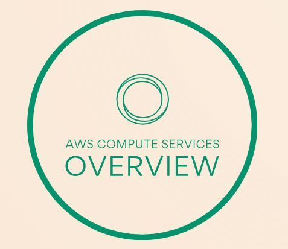

# AWS Compute Services Overview   

### Repository: [course](../../../)   
### Platform: <a href="../../">aws_skill_builder   </a>
### Software/Subject: <a href="../">aws   </a>
### Course: <a href="./">curso_093 (AWS Compute Services Overview)   </a>

#### <a href="https://github.com/PedroHeeger/main/blob/main/cert_ti/04-curso/cloud/aws/(23-11-18)_AWS_Compute_Services..._PH_AWSSB.pdf">Certificate</a>

---

### Theme:
- Cloud Computing

### Used Tools:
- Operating System (OS): 
  - Windows 11   
- Cloud:
  - Amazon Web Services (AWS)   
- Cloud Services:
  - Google Drive   
- Language:
  - HTML   
  - Markdown   
- Integrated Development Environment (IDE) and Text Editor:
  - Visual Studio Code (VS Code)   
- Versioning: 
  - Git   
- Repository:
  - GitHub   

---

<a name="item0"><h3>Course Strcuture:</h3></a>
1. <a href="#item01">AWS Compute Services Overview (Portuguese)</a> 

---

### Objective:
Este curso fornece uma visão geral dos serviços de computação da **Amazon Web Service (AWS)**. Esses serviços de computação em nuvem da AWS são fáceis de dimensionar, simples de gerenciar e permitem configurações e controle flexíveis.

### Structure:
A estrutura do curso é formada por:
- Este arquivo de README.md.
- A pasta `0-aux`, pasta auxiliar com imagens utilizadas na construção desse arquivo de README. 

### Development:

<a name="item01"><h4>AWS Compute Services Overview (Portuguese)</h4></a>[Back to summary](#item0)

A concepção e a execução da empresa começam com a computação, independentemente de estar criando aplicativos móveis ou executando clusters enormes para sequenciar o genoma humano. A **Amazon Web Service (AWS)** é um amplo catálogo de serviços de computação. Ela inclui tudo, serviços de aplicações simples, servidores virtuais flexíveis e até computação sem servidor.

A execução de servidores no local é uma tarefa cara. É preciso adquirir hardware com frequência, de acordo com os planos de projeto, não na realidade de uso. A criação, a equipe e a manutenção de datacenters são caras. É preciso provisionar recursos para o pior dos casos. Os servidores precisam ser capazes de lidar com picos de tráfego e eventos. Depois de tudo criado, muitas vezes, há item de linha de capacidade. A AWS oferece flexibilidade e economia. Com a AWS, é possível dimensionar as necessidades de computação conforme a carga de trabalho. A escalabilidade é incorporada aos serviços de computação para que seja fácil ampliar a escala conforme a demanda aumenta. Quando a demanda cai, por exemplo, à noite ou nos fins de semana, é possível reduzir a escala para economizar dinheiro e recursos. Não é preciso pagar pelo que não está usando.

As necessidades de computação podem mudar com o tempo. Por exemplo, o serviço do **Amazon Elastic Compute Cloud (EC2)** oferece uma ampla variedade de tipos de instância de servidor virtual apropriados para tudo, de servidores Web simples a grande clusters de machine learning. O cliente não fica preso às configurações específicas do hardware que comprou, portanto, pode alterar facilmente os tipos de instância. O Amazon EC2 permite total flexibilidade para executar aplicações em qualquer escala. O cliente mantém controle total sobre seu ambiente e, ao contrário do ambiente on-premises, com a definição de preço sob demanda, é possível ampliar e reduzir recursos de maneira econômica para atender às necessidades.

Muitas vezes, não é necessário executar um servidor. E se, em vez de executar servidores, fosse possível executar a aplicação quando necessário? O **AWS Lambda** permite executar código sem provisionar ou gerenciar servidores, onde só é pago pelo tempo de computação consumido. Não haverá cobranças quando o código não estiver em execução. Com o Lambda, o cliente pode executar código para praticamente qualquer tipo de aplicação ou serviço de back-end (móvel, IoT, serviço de streaming), tudo sem precisar de administração. Por exemplo, digamos que queira processar e fazer upload de uma imagem. Pode fazer upload da imagem para o **Amazon S3** e usar um trigger de evento para iniciar uma função do Lambda para processar essa imagem sem precisar ter um servidor ocioso em espera. Executar computação sem precisar provisionar e manter servidores.

Se é preciso executar um site simples ou aplicações de comércio eletrônico, a AWS oferece Lightsail. Com o **Amazon Lightsail**, o usuário pode iniciar um servidor privado virtual em alguns minutos e gerenciar facilmente servidores Web e aplicações simples. O Lightsail inclui tudo o que precisa para começar o projeto. Uma maquina virtual, armazenamento SS dBase, transferência de dados, gerenciamento de DNS e um endereço IP estático por um preço baixo previsível.

O usuário usa serviços de container no local? O **Amazon EC2 Container Service (ECS)** é um serviço de gerenciamento de containers de alta escalabilidade e performance que aceita containers de **Docker** e permite executar facilmente aplicações em um cluster gerenciado de instâncias do Amazon EC2. O Amazon ECS elimina a necessidade de instalar, operar e dimensionar sua própria infraestrutura de gerenciamento de clusters.

A AWS oferece vários produtos de computação que permitem implantar, executar e dimensionar aplicações, como servidores virtuais, containers ou código. Existem serviços para automatizar e dimensionar o processamento em lote, executar e gerenciar aplicações Web e criar redes virtuais.