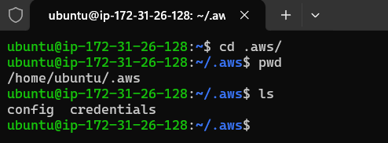

# Introduction to AWS Command Line Interface (CLI)   

### Repository: [course](../../../)   
### Platform: <a href="../../">aws_skill_builder   </a>
#### Software/Subject: <a href="../">aws   </a>
### Course: <a href="./">curso_096 (Introduction to AWS Command Line Interface (CLI))   </a>

#### <a href="https://github.com/PedroHeeger/main/blob/main/cert_ti/04-curso/cloud/aws/(23-11-23)%20Introduction...(CLI)%20PH%20AWSSB.pdf">Certificate</a>

---

### Theme:
- Cloud Computing

### Used Tools:
- Operating System (OS): 
  - Linux   
  - Windows 11   
- Linux Distribution: 
  - Ubuntu   
- Cloud:
  - Amazon Web Services (AWS)   
- Cloud Services:
  - Amazon Elastic Compute Cloud (EC2)   
  - Google Drive   
- Language:
  - HTML   
  - Markdown   
- Integrated Development Environment (IDE) and Text Editor:
  - Visual Studio Code (VS Code)   
- Versioning: 
  - Git   
- Repository:
  - GitHub   
- Command Line Interpreter (CLI):
  - AWS Command Line Interface (CLI)   
  - Bash e Sh   
  - Windows PowerShell   
- Network:
  - OpenSSH   

---

<a name="item0"><h3>Course Strcuture:</h3></a>
1. <a href="#item01">Introduction to AWS Command Line Interface (CLI)</a> 

---

### Objective:
O objetivo desse curso foi introduzir o serviço **AWS Command Line Interface (CLI)** que é uma das várias maneiras de acessar os recursos na cloud da **AWS**. Neste curso, foi abordado uma breve visão geral e casos de uso relacionados à **AWS CLI**, realizando uma demonstração para mostrar como a **AWS CLI** pode ser usada no seu funcionamento diário.

### Structure:
A estrutura do curso é formada por:
- Este arquivo de README.md.
- O arquivo de script modelo do **AWS CLI** para **Bash**.
- A pasta `0-aux`, pasta auxiliar com imagens utilizadas na construção desse arquivo de README. 

<figure>
     
    <figcaption>Imagem 01.</figcaption>
</figure>
 

### Development:

<a name="item01"><h4>Introduction to AWS Command Line Interface (CLI) (Portuguese)</h4></a>[Back to summary](#item0)

A interface de linha de comando, ou CLI, é uma ferramenta unificada para gerenciar os serviços da **AWS** onde é possível interagir com vários serviços da **AWS**, quase todos eles. Ela funciona em maquinas Windows, macOS e Linux. Um dos maiores própositos da **AWS Command Line Interface (CLI)** é permitir a automação por meio de scripts que ao serem executados são capazes de provisionar e interagir com os recursos da cloud, proporcionando maior agilidade ne execução e ganho de tempo.

Instalar a interface de linha de comando da AWS é muito simples. Basta acessar [aws.amazon.com/cli](https://aws.amazon.com/pt/cli/) para obter instruções sobre como fazer isso. Se estiver usando uma maquina **Windows** poderá fazer o download e executar o instalador de 64 bits ou 32 bits. Já se estiver usando **Mac** ou **Linux**, poderá instalar por meio do **Python Package Manager (Pip)** executando `pip install awscli`.

Após a instalação, deve ser configurado o usuário da **AWS** que executará os comandos da **AWS CLI**. Para isso deve-se utilizar o comando `aws configure` e definir as quatro configurações solicitadas que são: `Access Key Id`, `Secret Key Id`, `Region` e `Output Format`. A região e o formato de saída são opcionais, logo, quando não são respondidas (deixadas em branco), utilizam as configurações padrões que é `us-east-1` e `json`. Outros formatos de saída de dados são `text`, mas deve ser usado quando há pouca informação, pois os dados podem sair um pouco bagunçados, já que normalmente eles são configurados em `json`. Também tem o formato de `table` que é um saída mais organizada, com a utilização de linhas e colunas.

Ao criar uma conta na cloud da **AWS**, o usuário `root` é criado, este é o usuário principal da conta que tem acesso a tudo. Por conta disso, é bastante recomendado não utilizar o usuário `root` ao interagir com a **AWS**, este é um usuário mais apropriado para gerenciamento de conta e faturamento. Então é importante criar um segundo usuário para funcionar como usuário administrador, fornecendo a ele a permissão `AdministratorAccessFull`. Assim, ele terá permissão de execução de quase todos os serviços. Para isso é necessário ir no serviço **AWS Identity and Access Management (IAM)** e criar um usuário do IAM. É este serviço responsável por criar usuário, grupos e dar permissões. Ao criar um usuário do IAM, é importante também gerar uma chave de acesso para ele. A chave de acesso é uma forma criptografada de se conectar com a cloud **AWS** sem a utilização de senha, ao invés disso, é gerado um Id e um Secret. São essas informações da chave de acesso que são configuradas na **AWS CLI**.

Toda configuação realizada no comando `aws configure` é salva em dois arquivos, um de nome `credentials`, onde tem o `Access Key Id` e `Secret Key Id`, e o outro de nome `config` com as informações `Region` e `Output Format`. Esses dois arquivos são armazenados em uma pasta de nome `.aws` dentro do diretório do usuário. É possível modificar o usuário configurado ou as definições de região e formato de saída diretamente neste arquivos.

Como forma de evidenciar a configuração da **AWS CLI** com um usuário do IAM, foi utilizado uma maquina virtual instanciada na cloud da **AWS** para configurar um usuário nela. Para isso foi necessário baixar e instalar a **AWS CLI** nesta instância e isso foi feito através de um script modelo do meu repositório de modelos. Uma cópia do arquivo de script foi executada em [awsCli.sh](awsCli.sh). Este arquivo ainda contém um outro script que faz o mesmo processo de configuração da **AWS CLI** mas de forma automatizada. Porém, neste curso foi decidido que seria feito manualmente para mostrar como funciona. As imagens 02 e 03 ilustram a execução do script onde a **AWS CLI** é instalada de forma automática. Enquanto as imagens 04 e 05 mostram o usuário `Worker` da minha conta da **AWS** sendo configurado e os arquivos gerados na pasta `.aws`. É importante ter cuidado ao trabalhar com configurações de usuário na **AWS CLI**, pois as informações da chave de acesso são sensíveis e não devem ser fornecidas.

<figure>
     
    <figcaption>Imagem 02.</figcaption>
</figure>
 

<figure>
     
    <figcaption>Imagem 03.</figcaption>
</figure>
 

<figure>
     
    <figcaption>Imagem 04.</figcaption>
</figure>
 

<figure>
     
    <figcaption>Imagem 05.</figcaption>
</figure>
 

Com o comando `aws sts get-caller-identity` é exibido as informações do usuário configurado na **AWS CLI** e com o comando `aws sts get-session-token` é mostrado as informações de credenciais de acesso deste usuário. Já com o `aws configure list` as configurações do usuário de forma resumida.