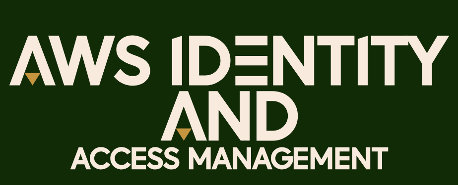

# AWS Identity and Access Management - Basics   

### Repository: [course](../../../)   
### Platform: <a href="../../">aws_skill_builder   </a>
#### Software/Subject: <a href="../">aws   </a>
### Course: <a href="./">curso_098 (AWS Identity and Access Management - Basics)   </a>

#### <a href="https://github.com/PedroHeeger/main/blob/main/cert_ti/04-curso/cloud/aws/(23-12-06)%20AWS%20IAM%20-%20Basics%20PH%20AWSSB.pdf">Certificate</a>

---

### Theme:
- Cloud Computing

### Used Tools:
- Operating System (OS): 
  - Windows 11   
- Cloud:
  - Amazon Web Services (AWS)   
- Cloud Services:
  - AWS Identity and Access Management (IAM)   
  - Google Drive   
- Language:
  - HTML   
  - Markdown   
- Integrated Development Environment (IDE) and Text Editor:
  - Visual Studio Code (VS Code)   
- Versioning: 
  - Git   
- Repository:
  - GitHub   
- Command Line Interpreter (CLI):
  - AWS Command Line Interface (CLI)   
  - Windows PowerShell   

---

<a name="item0"><h3>Course Strcuture:</h3></a>
1. <a href="#item01">AWS Identity and Access Management - Basics (Portuguese)</a> 

---

### Objective:
O objetivo desse curso foi introduzir conhecimentos básicos sobre o serviço **AWS Identity and Access Management (IAM)**, apresentando os seus conceitos básicos, as vantagens de utilizá-lo e a integração do IAM com outros serviços.

### Structure:
A estrutura do curso é formada por:
- Este arquivo de README.md.
- A pasta `0-aux`, pasta auxiliar com imagens utilizadas na construção desse arquivo de README. 

### Development:

<a name="item01"><h4>AWS Identity and Access Management - Basics (Portuguese)</h4></a>[Back to summary](#item0)

O **AWS Identity and Access Management (IAM)**, permite controlar acesso a serviços de computação, armazenamento, banco de dados e aplicativos na nuvem **AWS**. O IAM usa conceitos de controle de acesso, como usuários, grupos e permissões que são aplicados a chamadas de API individuais para que possam ser especificada permissões para controlar quais usuários podem acessar serviços específicos, os tipos de ações que podem executar e quais recursos estão disponíveis, desde maquinas virtuais, instâncias de banco de dados e até a capacidade de filtrar resultados de consulta de banco de dados.

Também é possivel integrar o sistema de identidade, como o **Microsoft Active Directory**, usando tecnologias de federação baseadas em padrões para que desenvolvedores e administradores de TI possam administrar a **AWS** sem precisar de credenciais adicionais. Usando um sistema central de gerenciamento de identidades, é possível diminuir o tempo e esforço administrando outro ambiente e, ao mesmo tempo, assegurar, que todos recebam o que precisam.

A segurança é muito importante para os clientes da **AWS**, por isso, ela é tratada como prioridade máxima. O IAM permite que os desenvolvedores se concretem nos recursos e na funcionalidade dos aplicativos deles, enquanto faz o trabalho pesado no quesito segurança. A autenticação lida principalmente com a identidade do usuário, ou seja, verifica quem é a pessoa e se ela é realmente quem diz ser. Este é um nível de ponto de verificação de gerenciamento de identidade e acesso. Os clientes usam autenticação única para gerenciar credenciais do usuário. Já a autorização é diferente, ele verifica se o usuário ou sistema tem a devida permissão para fazer ou acessar algo.

Ao criar uma conta da **Amazon Web Services (AWS)** pela primeira vez, é fornecida uma identidade de autenticação única (SSO) da **AWS** que tem acesso completo a todos os recursos e serviços da cloud na conta. Ela é chamada de usuário raiz e o login é feito através do endereço de e-mail e a senha utilizados para criar a conta como credenciais de SSO. Quando está conectado como usuário raiz, o acesso é irrestrito a todos os recursos da conta. Este também tem acesso às informações de faturamento e à capacidade de alterar a senha raiz, porém o recomendado é que não se utilizem as credenciais da conta raiz para acesso diário.

O IAM é um serviço da Web que ajuda a controlar com segurança o acesso dos usuários aos recursos da **AWS**. É possível configurar o IAM para controlar quem pode acessar os recursos da cloud e o que pode ser feito com eles. Os clientes podem usar o IAM para vários casos de uso. Com o IAM, o cliente pode conceder permissões a outras pessoas para administrar e usar recursos da sua conta da **AWS**, sem a necessidade de compartilhar sua senha raiz ou chaves de acesso. Os clientes podem conceder diferentes permissões a pessoas diferentes, permitindo controlar o acesso total ou parcial a serviços e recursos individuais da **AWS** na conta, o acesso somente leitura a recursos como um bucket do S3 e o acesso a informações de faturamento em uma conta.

O IAM pode ser utilizado também para adicionar dispositivos individuais de autenticação de multifator (MFA) para usuários. Isso significa que, quando um usuário faz login, ele deve fornecer uma senha ou uma chave de acesso e um código único de dispositivo especialmente configurado. Os clientes podem configurar MFAs para uso por meio do console ou configurá-los para uso programático, como por meio de APIs da AWS, SDKs ou da AWS CLI. Cada usuário pode ter apenas um dispositivo com MFA. O IAM permite que o cliente conceda aos aplicativos em execução na infraestrutura da **AWS** dele permissões para acessar outros recursos da cloud. Também existe a possibilidade de permitir que os usuários que já têm senhas em outro lugar, como na sua rede corporativa ou em um provedor de identidade de internet, obtenham acesso à sua conta da **AWS**.

O IAM não pode ser usado para chaves SSH do EC2 ou certificados RDP Windows. Os usuários devem compartilhar chaves SSH comuns em toda a conta da **AWS**. Os serviços da **AWS** têm dois endpoints: o console de gerenciamento da **AWS** e a API de consulta da **AWS**. Para se autenticar nesses endpoints é utilizado diferentes conjuntos de credenciais. Para o console de gerenciamento da **AWS**, o login é realizado usando um nome de usuário e a senha. Para acessar a API de consulta, é utilizado uma chave de acesso e uma chave de acesso secreta.