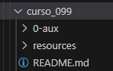
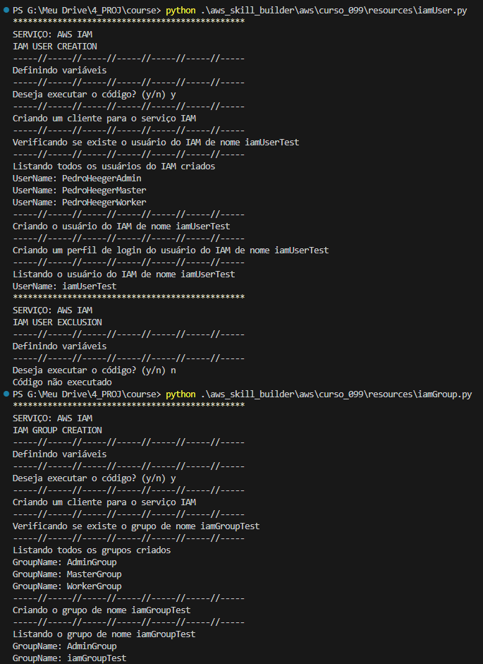
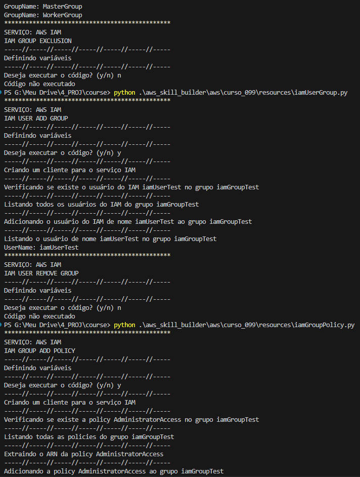
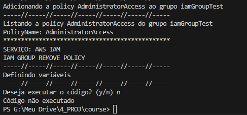
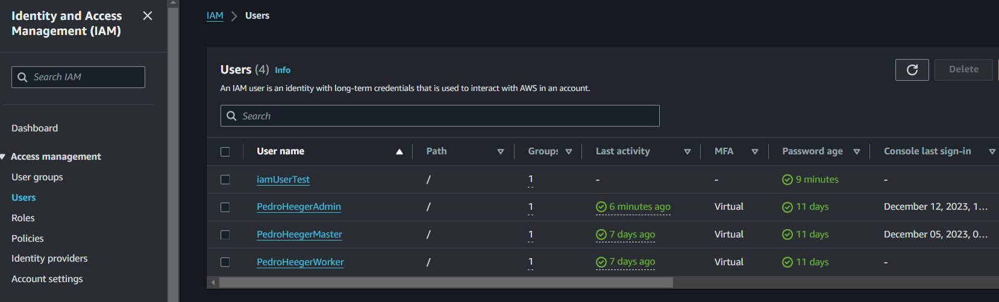
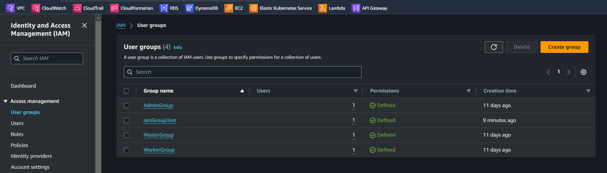
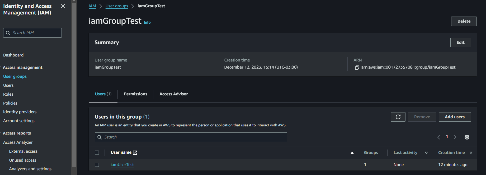
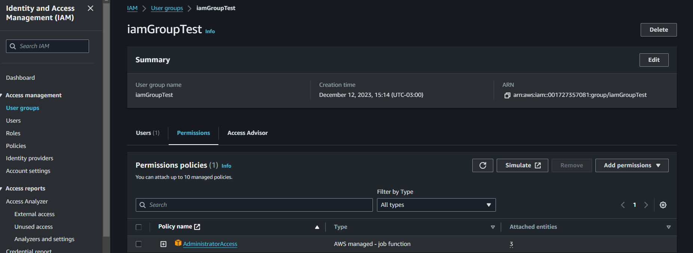
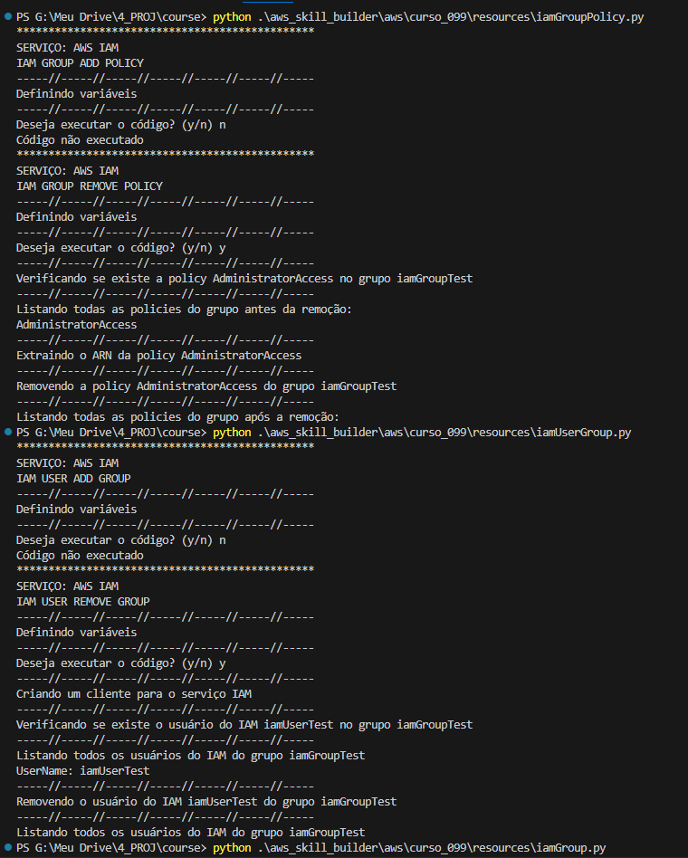
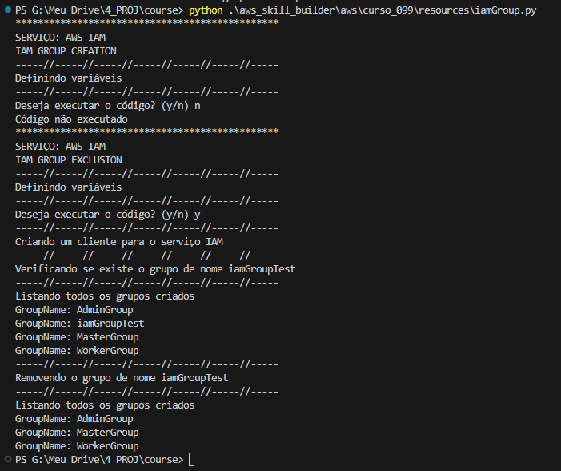

# Introduction to AWS Identity and Access Management (IAM)   

### Repository: [course](../../../)   
### Platform: <a href="../../">aws_skill_builder   </a>
### Software/Subject: <a href="../">aws   </a>
### Course: <a href="./">curso_099 (Introduction to AWS Identity and Access Management (IAM))   </a>

#### <a href="https://github.com/PedroHeeger/main/blob/main/cert_ti/04-curso/cloud/aws/(23-12-11)_Introduction_to_AWS_IAM_PH_AWSSB.pdf">Certificate</a>

---

### Theme:
- Cloud Computing

### Used Tools:
- Operating System (OS): 
  - Windows 11   
- Cloud:
  - Amazon Web Services (AWS)   
- Cloud Services:
  - AWS Identity and Access Management (IAM)   
  - AWS Software Development Kit (SDK) - Boto3   
  - Google Drive   
- Language:
  - HTML   
  - Markdown   
- Integrated Development Environment (IDE) and Text Editor:
  - Visual Studio Code (VS Code)   
- Versioning: 
  - Git   
- Repository:
  - GitHub   
- Command Line Interpreter (CLI):
  - AWS Command Line Interface (CLI)   
  - Windows PowerShell   

---

<a name="item0"><h3>Course Strcuture:</h3></a>
1. <a href="#item01">Introduction to AWS Identity and Access Management (IAM) (Portuguese)</a> 
  1.1 <a href="#item01.01">Prática</a> 

---

### Objective:
O objetivo desse curso foi introduzir conhecimentos básicos sobre o serviço **AWS Identity and Access Management (IAM)**, destacando como o IAM pode ser usado para autenticação e autorização nos serviços da **AWS**. Também foi explicado sobre as políticas e funções do IAM, bem como possíveis casos de uso para o serviço. Além de realizar uma demonstração sobre como criar um grupo e um usuário do IAM, associar uma política e adicionar um usuário a um grupo.

### Structure:
A estrutura do curso é formada por:
- Este arquivo de README.md.
- A pasta [resources](./resources/) contendo os arquivos de scripts em **Python** para interação com a **AWS**.
- A pasta `0-aux`, pasta auxiliar com imagens utilizadas na construção desse arquivo de README.

<figure>
     
    <figcaption>Imagem 01.</figcaption>
</figure>
 

### Development:

<a name="item01"><h4>Introduction to AWS Identity and Access Management (IAM) (Portuguese)</h4></a>[Back to summary](#item0)

O **AWS Identity and Access Management (IAM)** permite controlar com segurança o acesso individual e em grupo aos recursos da **AWS**, criando e gerenciado usuários, grupos e permissões de usuário para os produtos da **AWS**. O IAM oferece opções de controle fino e oferece suporte a usuários federados ou usuários fora da **AWS** por meio da integração deles com o **Microsoft Active Directory** de uma empresa ou com um provedor de identidade terceirizado como Facebook ou Google, fazendo com que os usuários autenticados assumam funções do IAM.

Os usuários precisam ser autenticados para que possam acessar os produtos e os recursos da **AWS**. Para isso, o acesso pode ser feito meio do Console de Gerenciamento da **AWS**, da interface de linha de comando da **AWS**, de SDKs e de APIs. É possível criar usuários individuais do IAM na conta da **AWS** que correspondam aos usuários de uma organização, sendo que cada usuário pode ter as próprias credenciais para autenticação na cloud. À medida que o número de usuários que gerenciam o ambiente da **AWS** aumenta, é útil gerenciar permissões para vários usuários do IAM usando grupos do IAM, que garantem que cada membro do grupo receberá a mesma política de permissões.

Depois que um usuário for autenticado, ele terá que ser autorizado a acessar os produtos da **AWS**. Por padrão, os usuários do IAM não podem acessar nada na conta. Para isso é necessário conceder permissões a um usuário criando uma política, que é um documento no formato JSON que lista explicitamente as permissões. Uma política do IAM é um documento que define o efeito, as ações, os recursos e as condições opcionais referentes às chamadas de API que uma entidade pode invocar. Por padrão, quaisquer ações ou recursos que não são explicitamente permitidos são negados. A primeira linha de uma política descreve quem ou o que está sendo autorizado, podendo ser um usuário, um grupo ou outro recurso dentro da **AWS**. Os valores de ação descrevem quais tarefas podem ser realizadas. Em seguida, é definida a condição para que esta autorização tenha êxito. Por fim, a política descreve os recursos nos quais as tarefas autorizadas devem ser executadas.

Também é importante mencionar que cada conta da AWS tem credenciais de nível raiz com acesso total a tudo na conta. É bastante recomendado que não se utilize as credenciais de nível raiz para nada que não seja a configuração inicial da conta e a criação de uma conta de usuário do IAM com permissões administrativas associadas por meio da política.

As políticas do IAM também podem ser atribuídas a uma função do IAM. Uma função do IAM é semelhante a um usuário, pois é uma identidade da **AWS** com permissões que determinam o que a identidade pode e não pode fazer na cloud. Uma função não tem nenhuma credencial definida de longo prazo, senha ou chave de acesso associada a ela. Em vez disso, se um usuário receber uma função, as chaves de acesso serão criadas de modo dinâmico e fornecidas temporariamente para o usuário. As funções do IAM podem ser utilizadas para delegar acesso a usuários, aplicações, ou serviços que normalmente não têm acesso aos recursos da **AWS**. Um usuário que assume uma função temporariamente desiste das próprias permissões e, em vez disso, assume as permissões da função, como se tivesse vários chapéus ao mesmo tempo para realizar tarefas diferentes. Com as funções do IAM, não é preciso modificar a política de um usuário sempre que uma alteração é necessária.

<a name="item01.01"><h4>Prática</h4></a>[Back to summary](#item0)

Como parte prática desse curso, foi criado o sub-diretório [resources](./resources/) com quatro arquivos de scripts em **Python** para criar e remover um usuário e um grupo e adicionar e remover o usuário criado e uma política gerenciada pela **AWS** ao grupo criado. Esses arquivos em **Python** são divididos em dois scripts em cada arquivo, sendo um script para criação e outro para exclusão. Para interagir com as APIs da **AWS** foi utilizado o SDK **Boto3**. A ordem de execução dos arquivos foi [iamUser.py](./resources/iamUser.py) para criar o usuário, [iamGroup.py](./resources/iamGroup.py) para criar o grupo, [iamUserGroup.py](./resources/iamUserGroup.py) para adicionar o usuário ao grupo e [iamGroupPolicy.py](./resources/iamGroupPolicy.py) para adicionar uma política ao grupo. A ordem de remoção é inversa a de criação. Cada script de criação e exclusão nos arquivos conta com uma estrutura de condição para decidir se o usuário quer ou não executar o bloco de código.

Nas imagens 02, 03 e 04 é exibido o output da execução dos scripts de criação dos quatro arquivos **Python**. Nas imagens 05 e 06 é ilustrado no console da **AWS** o usuário e grupo construído. Já nas imagens 07 e 08 é evidenciado a adição do usuário construído ao grupo criado e de uma política gerenciada pela **AWS** (`AdministratorAccess`).

<figure>
     
    <figcaption>Imagem 02.</figcaption>
</figure>
 

<figure>
     
    <figcaption>Imagem 03.</figcaption>
</figure>
 

<figure>
     
    <figcaption>Imagem 04.</figcaption>
</figure>
 

<figure>
     
    <figcaption>Imagem 05.</figcaption>
</figure>
 

<figure>
     
    <figcaption>Imagem 06.</figcaption>
</figure>
 

<figure>
     
    <figcaption>Imagem 07.</figcaption>
</figure>
 

<figure>
     
    <figcaption>Imagem 08.</figcaption>
</figure>
 

Por fim, é exibido nas imagens 09 e 10, o output da execução dos scripts de exclusão de três dos quatro arquivos **Python**. O usuário criado ainda não foi removido, pois ele foi aproveitado para ser utilizado no curso [curso_100](../curso_100/).

<figure>
     
    <figcaption>Imagem 09.</figcaption>
</figure>
 

<figure>
     
    <figcaption>Imagem 10.</figcaption>
</figure>
 