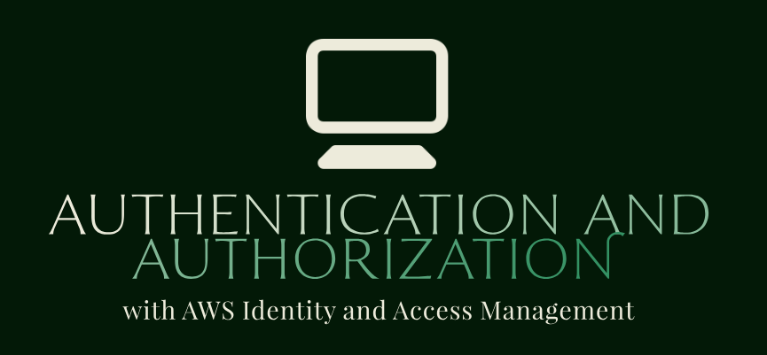

# Authentication and Authorization with AWS Identity and Access Management   

### Repository: [course](../../../)   
### Platform: <a href="../../">aws_skill_builder   </a>
### Software/Subject: <a href="../">aws   </a>
### Course: <a href="./">curso_101 (Authentication and Authorization with AWS Identity and Access Management)   </a>

#### <a href="https://github.com/PedroHeeger/main/blob/main/cert_ti/04-curso/cloud/aws/(23-12-12)_Authentication_and_Authorization..._PH_AWSSB.pdf">Certificate</a>

---

### Theme:
- Cloud Computing

### Used Tools:
- Operating System (OS): 
  - Windows 11   
- Cloud:
  - Amazon Web Services (AWS)   
- Cloud Services:
  - AWS Identity and Access Management (IAM)   
  - Google Drive   
- Language:
  - HTML   
  - Markdown   
- Integrated Development Environment (IDE) and Text Editor:
  - Visual Studio Code (VS Code)   
- Versioning: 
  - Git   
- Repository:
  - GitHub   
- Command Line Interpreter (CLI):
  - AWS Command Line Interface (CLI)   
  - Windows PowerShell   

---

<a name="item0"><h3>Course Strcuture:</h3></a>
1. <a href="#item01">Authentication and Authorization with AWS Identity and Access Management (Portuguese)</a> 

---

### Objective:
O objetivo desse curso foi introduzir o serviço **AWS Identity and Access Management (IAM)** explicando como funciona a autenticação e autorização. Estes conceitos utilizam o gerenciamento de permissões, os documentos de políticas e identidade do IAM.

### Structure:
A estrutura do curso é formada por:
- Este arquivo de README.md.
- A pasta `0-aux`, pasta auxiliar com imagens utilizadas na construção desse arquivo de README. 

### Development:

<a name="item01"><h4>Authentication and Authorization with AWS Identity and Access Management (Portuguese)</h4></a>[Back to summary](#item0)

Entender como as permissões funcionam na **AWS** significa entender como a gestão de identidade e acesso, IAM, opera internamente. O **AWS Identity and Access Management (IAM)** possui alguns elementos fundamentais para seu funcionamento. Um *IAM user* é um operador permanente, que pode ser humano ou maquina, não importa quem seja. O importante é que as credenciais são permanentes e permanecem com esse usuário até que haja uma rotatividade forçada, seja em um nome e senha, seja em uma access key, secret key ou combinação, o que for. Este é um método de autenticação para usuários nomeados no sistema. Já um *IAM group* é um conjunto de usuários do IAM. Os gruposs podem ter muitos usuários e os usuários podem pertencer a muitos grupos.

Uma *role* (função) é um método de autenticação, assim como o *IAM User*. Ela é um operador, que pode ser humano ou maquina, no qual se diferencia do *IAM User*, pois as suas credenciais são temporárias. Então, em ambos os casos, esses elementos são métodos de autenticação. 

Na cloud da **AWS** tudo é uma API e para executar uma API é necessário primeiro autenticar, para depois autorizar. A autenticação ocorre através do user ou role. Já a autorização é de responsabilidade da *Policy*. A *Policy* utiliza um objeto separado conhecido como *Policy Document*, que é um documento **JSON** que anexa diretamente a um usuário nomeado permanente ou a um grupo de usuários, ou a uma role. O *Policy Document* lista a API específica ou grupo wildcard de APIs que está sendo dado whitelist, ou seja, permissão.

Ao realizar uma chamada de API, o operador determina tudo que ele quer em uma declaração de execução da API que é apresentada ao mecanismo de API da **AWS** ao ser executada.
A primeira coisa que o mecanismo faz é com o serviço IAM validar que o operador é quem diz ser e identificar se ele é um operador permanente (*IAM user*) ou temporário (*IAM role*), conferindo as credenciais de autenticação. Após as credenciais serem aprovadas, segue para etapa de autorização, extraindo do operador identificado os *Policy Documents* associados a ele e avaliando todos *Policy Documents* de uma só vez, para verificar se a ação que está sendo realizada é autorizada por qualquer uma das políticas. Se for, será permitido a execução da API.

O *Policy Document* pode ter uma negação explícita (blacklist) que prevalece sobre qualquer declaração de permissão. Com uma blacklist, não importa se há uma declaração de permissão. Se não existe uma permissão há uma negação implícita (whitelist), e neste caso é necessário colocar pelo menos uma declaração permissão na whitelist. 

A blacklist pode ser utilizada quando for preciso impedir permanentemente que certas ações ocorram, como por exemplo, nunca permitir que alguém seja capaz de parar ou encerrar recursos em um ambiente de produção. Então é criada uma *Policy Document* que negue uma parada EC2, ou finalização diante de recursos de produção e anexar isso a todos os grupos, todos os usuários, todas as roles, exceto para o administrador do sistema autorizado, que seria o único autorizado a descontinuar uma instância. Dessa forma, caso um desenvolvedor que acidentalmente está no ambiente de produção e começa a encerrar instâncias, nada encerraria, porque a política de negação negaria a instrução encerrar fosse executada. Mesmo concordando que ele é o desenvolvedor que afirma ser.

Isso também resolve um problema adicional que é o caso de um conjunto comprometido de credenciais. Por exemplo, em uma conta da **AWS**, que não utiliza a autenticação multifator, acidentalmente, as credenciais de acesso de um usuário permanente foram expostas. Nessa caso, algum hacker mal-intencionado em algum lugar tem as credenciais desse usuário da conta da **AWS**, sendo que este usuário tem acesso a todos os documentos de política anexados a ele, pois é um usuário administrador. Se tiver usando documentos de política anexados aos usuários e não esitver usando credenciais no nível root, neste ponto, o gerente de segurança, que não sabe qual conta foi comprometida, pode executar uma única instrução de API que remove todos os *Policy Documents* de todos os usuários, grupos e roles em uma única ação, impedindo o acesso do hacker a conta. Quando o hacker tentar acessar o usuário hackeado, essa informação estará registrada no **AWS CloudTrail** e então será identificado qual usuário foi exposto.