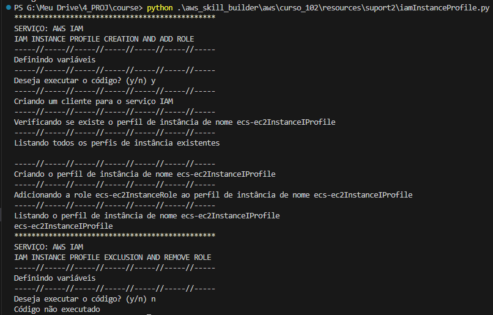

# Introduction to Amazon Elastic Container Service   

### Repository: [course](../../../)   
### Platform: <a href="../../">aws_skill_builder   </a>
### Software/Subject: <a href="../">aws   </a>
### Course: <a href="./">curso_102 (Introduction to Amazon Elastic Container Service)   </a>

#### <a href="https://github.com/PedroHeeger/main/blob/main/cert_ti/04-curso/cloud/aws/(23-12-13)_Introduction...(ECS)_PH_AWSSB.pdf">Certificate</a>

---

### Theme:
- Cloud Computing

### Used Tools:
- Operating System (OS): 
  - Windows 11   
- Cloud:
  - Amazon Web Services (AWS)   
- Cloud Services:
  - Amazon CloudWatch   
  - Amazon Elastic Compute Cloud (EC2)   
  - Amazon Elastic Container Service (ECS)   
  - AWS IAM Identity Center   
  - AWS Software Development Kit (SDK) - Boto3   
  - Google Drive   
- Containerization: 
  - Docker   
- Language:
  - HTML   
  - Markdown   
  - Python   
- Integrated Development Environment (IDE) and Text Editor:
  - Visual Studio Code (VS Code)   
- Versioning: 
  - Git   
- Repository:
  - Docker Hub   
  - GitHub   
- Command Line Interpreter (CLI):
  - AWS Command Line Interface (CLI)   
  - Windows PowerShell   

---

<a name="item0"><h3>Course Strcuture:</h3></a>
1. <a href="#item01">Introduction to Amazon Elastic Container Service (Portuguese)</a> 
  1.1 <a href="#item01.01">Prática</a> 

---

### Objective:
O objetivo desse curso foi introduzir o serviço **Amazon Elastic Container Service (ECS)** que ajuda a executar aplicativos conteinerizados em produção. Também foi detalhado os recursos e benefícios do uso do **Amazon ECS** e seus casos de uso. Uma breve análise dos contêineres foi realizada para melhor compreensão do serviço apresentado.

### Structure:
A estrutura do curso é formada por:
- Este arquivo de README.md.
- A pasta [resources](./resources/) contendo os arquivos de scripts em **Python** para interação com a **AWS**.
- A pasta `0-aux`, pasta auxiliar com imagens utilizadas na construção desse arquivo de README.

<figure>
     
    <figcaption>Imagem 01.</figcaption>
</figure>
 

### Development:

<a name="item01"><h4>Introduction to Amazon Elastic Container Service (Portuguese)</h4></a>[Back to summary](#item0)

Um contêiner é uma unidade de entrega de software, é um software independente, que é empacotado e executado com todas as suas dependências. Graças a esse empacotamento, os contêineres são muito rápidos em alcançar a velocidade de giro ideal, muito mais rápidos do que maquinas construídas, por exemplo. O processo de compilação do contêiner o permite ser extremamente flexível. É possível declarar personalizações quando eles são criados, para que não seja preciso modificar seus comportamentos em tempo de execução. Uma vez definido, não é preciso tocar em um contêiner novamente.

Graças ao **Docker** e à **Docker CLI**, é possível empacotar um aplicativo em um laptop e implantá-lo em produção usando exatamente a mesma imagem, sem configuração de infraestrutura complexa. Ter o mecanismo do Docker instalado permite abstrair a infraestrutura subjacente e ter contêineres em execução independentemente dela. Nesse sentido, a execução em contêineres é fácil. 

Alguns contêneres adicionais provavelemente ainda são gerenciáveis, mas e quanto a uma frota inteira? E se cada um dos contêineres for um aplicativo separado com diferentes ciclos de vida, necessidades e personalizações? E quanto à infraestrutura que está executando todos eles? Os contêineres são ótimos, mas será encontrarado desafios significativos ao executar e gerenciar clusters e infraestruturas. É necessário descobrir uma maneira de gerenciar aplicativos em contêineres em grande escala, enquanto é utilizado os mesmos níveis de flexibilidade que o contêiner fornece. Também é importante proteger a plataforma de computação garantindo que ainda tenha controle sobre os clientes e os operadores que consomem a plataforma. É aí que entra o Amazon ECS. O **Amazon ECS** facilita tudo isso gerenciando a execução de aplicativos em contêineres de forma altamente disponível. O serviço gerencia clusters de instâncias compatíveis com o contêineres do Docker, monitora o consumo de resultados e os requisitos de disponibilidade.

O **Amazon Elastic Container Service (ECS)** é um serviço de gerenciamento de containers altamente escalável e de alto desempenho, que oferece suporte a contêineres do **Docker** e permite que seja executado aplicativos facilmente em um cluster gerenciado de instâncias do **Amazon EC2**. O Amazon ECS elimina a necessidade de instalar, operar e escalar uma própria infraestrutura de gerenciamento de cluster.

O Amazon ECS é elástico, ele pode programar um único contêiner, bem como milhares. Os contêineres e as instâncias podem ser escalados de maneira elástica e o serviço se integra ao Elastic Load Balancing. O Amazon ECS também é gerenciável, sendo possível definir facilmente quais contêineres executar e como gostaria de executá-los. O serviço inclui APIs programáticas e CLI dedicada e está profundamente integrado ao **Amazon ECR** e a outros serviços da AWS. Por fim, o Amazon ECS é seguro, sendo viável implementar controle granular sobre políticas de isolamento, requisitos de disponibilidade e alocação de recursos. Também é possível configurar cada cluster em sua própria criação de nuvem privada e usar grupos de segurança para controlar o aceso a rede a suas instâncias de contêiner elásticas.

Os três componentes principais que compõem a infraestrutura básica do Amazon ECS são: cluster, tarefa e serviço. Um cluster do Amazon ECS é um grupo de instâncias do **Amazon EC2** distribuídas entre várias zonas de disponibilidade que executam o agente de contêiner do Amazon ECS. O próprio agente é um contêiner que permite às instâncias do Amazon EC2 conversar com a lógica de ativação do Amazon ECS, que permite o gerenciamento de recursos, coordenação de ciclo de vida e programação eficiente. 

Portanto, um cluster é onde os contêineres serão executados, mas os contêineres são agrupados no que é chamado de tarefas que, por sua vez, solicita ao Amazon ECS para executá-los no cluster. Dependendo das necessidades do aplicativo, é possível optar por ter um cluster com uma combinação de tipos de instâncias e atribuir as tarefas de acordo. Agora, há uma distinção importante a fazer, uma definição de tarefa é um arquivo que descreve um ou mais contêineres que devem ser executados juntos e são implantados como uma unidade única. Já uma tarefa, por outro lado, é uma instanciação de uma definição de tarefa que executa todos os contêineres juntos na mesma instância do Amazon EC2.

Um serviço do Amazon ECS é onde todas essas funcionalidades estão conectadas juntas. O Amazon ECS pode ser configurado para tarefas programadas com base em sua definição em um cluster, mas com a criação de um serviço, é possível fazer com que o Amazon ECS gerencie as disponibilidades, escalabilidade e ciclo de vida de seu aplicativo em contêineres. A criação de um serviço do Amazon ECS permite que seja definido o número mínimo e máximo desejado de tarefas a serem executadas no cluster. Se algo der errado e a tarefa falhar, o Amazon ECS detecta o erro e reinicia imediatamente. Além disso, a criação de um serviço permite que seja liderado o aplicativo com Elastic Load Balancers, bem como integrar uma lógica de Auto Scaling. Ao ultrapassar um limite, o Amazon ECS escalará o número de tarefas no cluster.

Para que é utilizado exatamente o Amazon ECS? Os contêineres em geral são perfeitos para microsserviços e o Amazon ECS simplifica ainda mais essa arquitetura. Os contêineres facilitam a modelagem do serviço em uma imagem atribuível com todas as suas dependências. Os contêineres podem usar qualquer aplicativo e linguagem de programação, e a imagem do contêiner é um artefato de versão, para que seja possível rastrear as imagens do contêiner até seus locais de origem. Os contêineres do Docker são particularmente adequados para cargas de trabalho em lote. Geralmente, os trabalhos em lote são de curta duração e executados em paralelo. Existe a possiblidade de empacotar o aplicativo de processamento em lote em uma imagem do Docker, para implatá-la em qualquer lugar, como na tarefa do Amazon ECS. Por fim, a integração e a implantação contínuas são processos comuns baseados em contêineres do Docker, onde pode ser criado um pipeline que executa as seguintes ações: monitorar alterações em um repositório de códigos-fonte, criar uma nova imagem do Docker a partir dessa fonte, enviar essa imagem para um repositório de imagens, como o aplicativo do Amazon ECR ou Docker e atualizar os serviços do Amazon ECS para utilizar a nova imagem no aplicativo.

<a name="item01.01"><h4>Prática</h4></a>[Back to summary](#item0)

Para a parte prática deste curso foi realizado um deployment no serviço **Amazon Elastic Container Service (ECS)**, utilizando das instâncias do **Amazon Elastic Compute Cloud (EC2)** como infraestrutura, de uma tarefa com dois contêiners **Docker**, sendo o primeiro com uma imagem do **Docker Hub** de uma aplicação realizada em outro curso e o segundo com a imagem do repositório de imagens **Amazon Elastic Container Registry (ECR)** de um servidor web **Nginx**. Para verificar o mesmo deployment utilizando como infraestrutura o **AWS Fargate** consulte o curso [curso_104](../curso_104/). Todos os arquivos utilizados para esse projeto estão armazenados no diretório [resources](./resources/) e foram desenvolvidos em linguagem **Python** utilizando o SDK **Boto3** para interagir com as APIs dos serviços da cloud **AWS**. Cada arquivo deste possui dois scripts, um para criação de algo e outro para a exclusão, sendo eles precedidos de estruturas de condição que aguarda uma entrada do usuário para verificar se executa ou não o script.

Diferente da execução com o **AWS Fargate**, neste curso, duas sub-pastas de suporte foram necessárias. Na sub-pasta [suport1](./resources/suport1) foram os arquivos relativos a permissões do ECS para interagir com outros serviços da AWS, liberação de portas do firewall e criação de grupo de logs. Já na sub-pasta [suport2](./resources/suport2) foram os arquivos referente a criação das instâncias EC2 e permissão para interação com o ECS.

Na sub-pasta `suport1`, o primeiro arquivo executado foi o [iamRoleService.py](./resources/suport1/iamRoleService.py) para criação de uma role que permitisse interação do **Amazon Elastic Container Service (ECS)** com outros serviços da AWS. Em seguida, foi adicionada a policy `AmazonECSTaskExecutionRolePolicy` a esta role com o arquivo [iamRolePolicy.py](./resources/suport1/iamRolePolicy.py) Esta política permitiu a criação de um log stream no serviço **Amazon CloudWatch**. Cada log stream é uma sequência de eventos de log que compartilham a mesma origem, como uma instância do Amazon EC2, um contêiner ou uma aplicação específica. A política também permitiu a inserção de eventos de log, além de baixar imagens do **Amazon Elastic Container Registry (ECR)**. Para completar esta etapa, com o arquivo [logGroup.py](./resources/suport1/logGroup.py) foi criado o log group que seria utilizado para armazenar os eventos de log, que neste caso eram dos contêineres das tarefas. Nas três primeiras imagens (02, 03 e 04) é evidenciada a criação da role, a anexação da policy na role e a construção do log group.

<figure>
     
    <figcaption>Imagem 02.</figcaption>
</figure>
 

<figure>
     
    <figcaption>Imagem 03.</figcaption>
</figure>
 

<figure>
     
    <figcaption>Imagem 04.</figcaption>
</figure>
 

Na sub-pasta `suport2`, o primeiro arquivo utilizado foi o [iamRoleService.py](./resources/suport2/iamRoleService.py) para construir uma outra role que concedesse permissão as instâncias EC2 que seriam criadas a interagir com o ECS. Com o arquivo [iamRolePolicy.py](./resources/suport2/iamRolePolicy.py), a política `AmazonECS_FullAccess` que concedia essa permissão foi adicionada a role. O arquivo [iamInstanceProfile.py](./resources/suport2/iamInstanceProfile.py) foi necessário para criar um perfil de instância para instâncias EC2 com essa role anexada. As próximas três imagens (05, 06 e 07) mostram a role desenvolvida, a anexação da policy na role e o output da criação do instance profile com esta role.

<figure>
     
    <figcaption>Imagem 05.</figcaption>
</figure>
 

<figure>
     
    <figcaption>Imagem 06.</figcaption>
</figure>
 

<figure>
     
    <figcaption>Imagem 07.</figcaption>
</figure>
 

Com a base dos recursos configurados foi iniciada a parte principal deste curso, começando com a criação de um cluster através do arquivo [ecsCusterEC2.py](./resources/ecsClusterEC2.py). Nesse código, em relação ao Fargate, foi removido o parâmetro `capacityProviders`, pois a infraestrutura será instâncias de contêineres, que são instâncias EC2 adicionadas ao cluster. A imagem 08 abaixo mostra o cluster criado, porém ainda sem instâncias de contêineres. Para criar essas instâncias foi utilizado o arquivo [ec2ContainerInstance.py](./resources/suport2/ec2ContainerInstance.py). Este arquivo contém um script para instanciação de maquinas no serviço **Amazon Elastic Compute Cloud (EC2)**, porém neste curso foi realizado alterações nesse script para criar duas instâncias simultâneas, sendo o nome de tag delas um nome padrão acrescido de um índice contador, resultando em: `ec2ContainerInstanceTest1` e `ec2ContainerInstanceTest2`. Uma outra alteração foi com relação ao parâmetro `UserData` que foi passado direto no código e não como um arquivo externo. Este foi um pequeno script em **Bash** para instalar o agente do ECS nas instâncias e vinculá-los ao cluster anteriormente construído. A imagem 09 ilustra as duas instâncias criadas com nome de tag padronizado. Já a imagem 10 evidencia elas dentro do cluster como infraestrutura deste.

<figure>
     
    <figcaption>Imagem 08.</figcaption>
</figure>
 

<figure>
     
    <figcaption>Imagem 09.</figcaption>
</figure>
 

<figure>
     
    <figcaption>Imagem 10.</figcaption>
</figure>
 

Com a etapa da infraestrutura do cluster pronta, chegou a hora criar a definição de tarefa (`task definition`) que seria implantada neste cluster. O arquivo utilizado foi o [ecsTaskEC2.py](./resources/ecsTaskEC2.py), onde alguns parâmetros foi necessário informar. O modo de rede foi definido como `bridge`, mas poderia ser `awsvpc`. A diferença prinicpal entre eles, quando utilizado como infraestrutura EC2, é o compartilhamento de IP de uma tarefa, no qual no modo `bridge` todos os contêineres em uma tarefa compartilham o mesmo espaço de endereços IP da instância EC2 subjacente. Já no modo `awsvpc` cada tarefa tem sua própria interface de rede elástica (`Elastic Network Interface-ENI`) e seu próprio endereço IP, separado das instâncias EC2. O `requiresCompatibilities` foi definido como `EC2`, pois foi a infraestrutura utilizada. O ARN da role elaborada, que foi `ecsTaskExecutionRole`, teve que ser informado no `executionRoleArn` que é uma role destinada para a permissão da interação do ECS com alguns outros serviços da AWS como o CloudWatch e o ECR. Já a task role que não foi utilizada, é uma role destinada para a permissão das tarefas. Os parâmetros de `cpu`, `memory`, `cpuArchitecture` e `operatingSystemFamily` são configurações de capacidade computacional e de sistema.

O último parâmetro é o `containerDefinitions` que é um arquivo **JSON** com toda a configuração dos contêineres que foram criados na tarefa. Dentro os mais relevantes, existe o `image` para definição da imagem do container, `cpu` e `memory` para limitar uma quantidade máxima de recursos que cada contêiner vai utilizar da tarefa, logo a soma desses parâmetros em todos os contêineres tem que ser menor ou igual ao valor definido na tarefa. Existe também o `portMappings` para realizar um bind de portas, onde foi definida o bind de portas `8080:8080` para o contêiner 1 que era a aplicação desenvolvida no outro curso e `80:80` para o contêiner 2 que possuia a imagem do servidor web Nginx. Ainda na definição dos contêineres, tem o `essential` para determinar se o contêiner é essencial para a tarefa, ou seja, se ele não subir, toda a tarefa falha, e a parte de `logConfiguration` que é justamente para enviar os logs para o grupo criado no CloudWatch. A imagem 11 mostram a definição de tarefa criada, a versão dela está neste número pois várias tarefas anteriores de teste foram criadas e excluídas, porém a AWS armazena essa contagem sequencial mesmo com a remoção das tarefas, sendo a única forma de zerar a contagem seria alterado para um novo nome não utilizado ainda.

<figure>
     
    <figcaption>Imagem 11.</figcaption>
</figure>
 

Agora foi a hora de realizar a implantação da tarefa através da definição de tarefa construída no cluster e para isso duas formas são possíveis. A primeira delas é implantar a tarefa diretamente no cluster e isso foi realizado com o arquivo [ecsClusterTaskEC2.py](./resources/ecsClusterTaskEC2.py). Nessa forma de implantação, ao executar a tarefa no cluster foi necessário informar a definição de tarefa e a versão dela que seria executada, em qual cluster seria feito o deploy, o tipo de infraestrutura utilizada que neste caso era o EC2. As configurações de rede não eram necessárias, pois o modo escolhido foi o `bridge` e como a tarefa era implantada em uma das instâncias, as configurações de rede seguiriam as das próprias instâncias. Na imagem 12 abaixo é visualizado a tarefa em execução no cluster com seus dois contêineres em operação.

<figure>
     
    <figcaption>Imagem 12.</figcaption>
</figure>
 

Para acessar os contêineres, bastava ter o IP público da tarefa com a porta em que esse contêiner estava rodando e então era possível acessar pelo navegador da maquina física **Windons**, já que no bind port determinado nas definições dos contêineres, a mesma porta que operava no contêiner seria a mesma que funcionaria para o host. Um ponto fundamental era garantir que as portas estabelecidas estavam abertas no securty group da VPC utilizada, que foi o grupo de segurança padrão da VPC da região. Assim, com o arquivo [vpcSgRule.py](./resources/suport1/vpcSgRule.py) era verificado se já existia uma regra permitindo o acesso a porta determinada. Na imagem 13 é exibido todas as regras deste grupo de segurança, mostrando que as portas `80` e `8080` estavam liberadas para qualquer IP que é representado por `0.0.0.0/0`. Já nas imagens 14 e 15 é realizado o acesso as aplicações dos contêineres através do navegador da maquina física. Na imagem 16 é exibido os logs gerado pelos contêineres no grupo criado no CloudWatch.

<figure>
     
    <figcaption>Imagem 13.</figcaption>
</figure>
 

<figure>
     
    <figcaption>Imagem 14.</figcaption>
</figure>
 

<figure>
     
    <figcaption>Imagem 15.</figcaption>
</figure>
 

<figure>
     
    <figcaption>Imagem 16.</figcaption>
</figure>
 

Esta foi a primeira forma de implantação, para a segunda forma ser realizada foi necessário remover essa tarefa do cluster com o mesmo arquivo de código que a implantou. Sem a tarefa em execução no cluster, a segunda forma pôde ser iniciada com o arquivo [ecsServiceEC2.py](./resources/ecsServiceEC2.py). Esta consistiu na implantação de um service, no qual era indicado o cluster onde ele seria implantado, o nome que ele receberia, a definição de tarefa e versão utilizada, a quantidade de tarefas desejadas, que neste caso foram 2, ou seja, duas tarefas idênticas com os mesmos contêineres seriam implantadas. Também foram definidos o tipo de implantação que era o EC2, a versão da plataforma do ECS não foi necessária, a estratégia de agendamento que foi `REPLICA`, ou seja, o ECS deve garantir que o número especificado de réplicas da tarefa seja executado nas instâncias. Além do conjunto de parâmetro `deploymentConfiguration` que é utilizado para configurar como as atualizações de serviço são implantadas no Amazon ECS, onde o parâmetro `minimumHealthyPercent` definiu a porcentagem mínima de tarefas em execução que devem permanecer saudáveis durante uma atualização, e o parâmetro `maximumPercent` definiu a porcentagem máxima de tarefas do serviço que podem ser interrompidas durante uma atualização. Por fim, o último parâmetro, o `networkConfiguration` também não foi necessário, pois o modo de rede definido foi o `bridge`. Nas imagens 17 e 18 é evidenciada a criação do service com duas tasks sendo cada uma delas com dois contêineres.

<figure>
     
    <figcaption>Imagem 17.</figcaption>
</figure>
 

<figure>
     
    <figcaption>Imagem 18.</figcaption>
</figure>
 

Como nesta forma de implantação duas tarefas foram executadas e o mode de rede foi definido como `bridge`, cada uma delas foi executada em uma instância e recebeu o IP público da instância, no qual seus dois contêineres foram executados nas portas estabelecidas. Para acessar a aplicação desses contêineres o processo é o mesmo da forma anterior, garantir que as portas do grupo de segurança estavam liberadas e acessar no navegador da maquina física o IP público de cada tarefa, que neste caso era o da instância, com a porta de cada contêiner, logo como foram duas tarefas e cada tarefa com dois contêineres, totalizando 4 contêineres, foram 4 acessos que são exibidos nas imagens 19 e 20 (contêiner 1), 21 e 22 (contêiner 2). Caso fosse solicitado a execução de três tasks pelo service, tendo apenas duas instâncias e com o modo `bridge` definido, a terceira tarefa não executaria pois ocasionaria conflito com a primeira já que são tarefas idênticas com contêineres idênticos que operam nas mesmas portas. Para que ela fosse executada seria necessário a adição de mais uma instância ao cluster.

<figure>
     
    <figcaption>Imagem 19.</figcaption>
</figure>
 

<figure>
     
    <figcaption>Imagem 20.</figcaption>
</figure>
 

<figure>
     
    <figcaption>Imagem 21.</figcaption>
</figure>
 

<figure>
     
    <figcaption>Imagem 22.</figcaption>
</figure>
 

A imagem 23 mostra os logs gerados pelos contêineres das tarefas do service no grupo de log construído no CloudWatch. Na imagem 24 é visualizado os eventos de log do segundo contêiner de uma das tarefas do serviço.

<figure>
     
    <figcaption>Imagem 23.</figcaption>
</figure>
 

<figure>
     
    <figcaption>Imagem 24.</figcaption>
</figure>
 