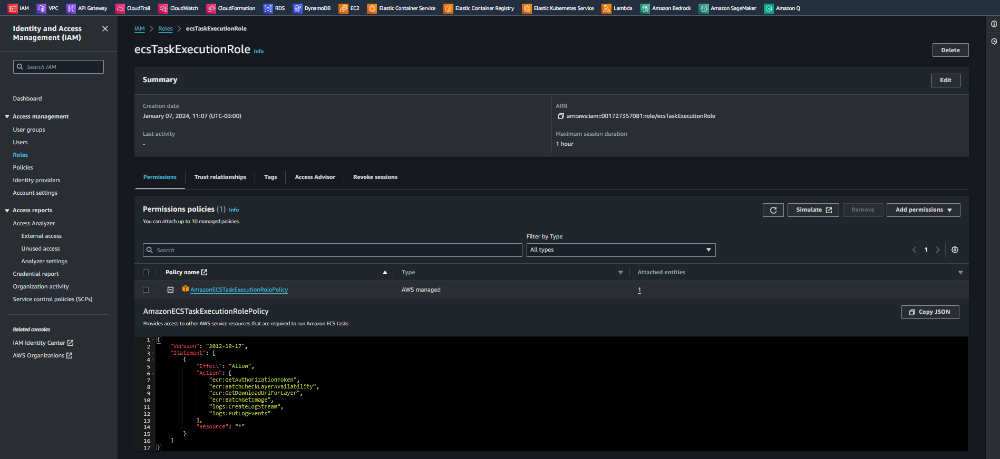

# Introduction to Amazon Elastic Container Service   

### Repository: [course](../../../)   
### Platform: <a href="../../">aws_skill_builder   </a>
### Software/Subject: <a href="../">aws   </a>
### Course: <a href="./">curso_102 (Introduction to Amazon Elastic Container Service)   </a>

#### <a href="https://github.com/PedroHeeger/main/blob/main/cert_ti/04-curso/cloud/aws/(23-12-13)%20Introduction...(ECS)%20PH%20AWSSB.pdf">Certificate</a>

---

### Theme:
- Cloud Computing

### Used Tools:
- Operating System (OS): 
  - Windows 11   
- Cloud:
  - Amazon Web Services (AWS)   
- Cloud Services:
  - Amazon Elastic Compute Cloud (EC2)   
  - Amazon Elastic Container Service (ECS)   
  - AWS Software Development Kit (SDK) - Boto3   
  - Google Drive   
- Containerization: 
  - Docker   
- Language:
  - HTML   
  - Markdown   
- Integrated Development Environment (IDE) and Text Editor:
  - Visual Studio Code (VS Code)   
- Versioning: 
  - Git   
- Repository:
  - Docker Hub   
  - GitHub   
- Command Line Interpreter (CLI):
  - AWS Command Line Interface (CLI)   
  - Windows PowerShell   

---

<a name="item0"><h3>Course Strcuture:</h3></a>
1. <a href="#item01">Introduction to Amazon Elastic Container Service (Portuguese)</a> 

---

### Objective:
O objetivo desse curso foi introduzir o serviço **Amazon Elastic Container Service (ECS)** que ajuda a executar aplicativos conteinerizados em produção. Também foi detalhado os recursos e benefícios do uso do **Amazon ECS** e seus casos de uso. Uma breve análise dos contêineres foi realizada para melhor compreensão do serviço apresentado.

### Structure:
A estrutura do curso é formada por:
- Este arquivo de README.md.
- A pasta [resources](./resources/) contendo os arquivos de scripts em **Python** para interação com a **AWS**.
- A pasta `0-aux`, pasta auxiliar com imagens utilizadas na construção desse arquivo de README.

<figure>
     
    <figcaption>Imagem 01.</figcaption>
</figure>
 

### Development:

<a name="item01"><h4>Introduction to Amazon Elastic Container Service (Portuguese)</h4></a>[Back to summary](#item0)

Um contêiner é uma unidade de entrega de software, é um software independente, que é empacotado e executado com todas as suas dependências. Graças a esse empacotamento, os contêineres são muito rápidos em alcançar a velocidade de giro ideal, muito mais rápidos do que maquinas construídas, por exemplo. O processo de compilação do contêiner o permite ser extremamente flexível. É possível declarar personalizações quando eles são criados, para que não seja preciso modificar seus comportamentos em tempo de execução. Uma vez definido, não é preciso tocar em um contêiner novamente.

Graças ao **Docker** e à **Docker CLI**, é possível empacotar um aplicativo em um laptop e implantá-lo em produção usando exatamente a mesma imagem, sem configuração de infraestrutura complexa. Ter o mecanismo do Docker instalado permite abstrair a infraestrutura subjacente e ter contêineres em execução independentemente dela. Nesse sentido, a execução em contêineres é fácil. 

Alguns contêneres adicionais provavelemente ainda são gerenciáveis, mas e quanto a uma frota inteira? E se cada um dos contêineres for um aplicativo separado com diferentes ciclos de vida, necessidades e personalizações? E quanto à infraestrutura que está executando todos eles? Os contêineres são ótimos, mas será encontrarado desafios significativos ao executar e gerenciar clusters e infraestruturas. É necessário descobrir uma maneira de gerenciar aplicativos em contêineres em grande escala, enquanto é utilizado os mesmos níveis de flexibilidade que o contêiner fornece. Também é importante proteger a plataforma de computação garantindo que ainda tenha controle sobre os clientes e os operadores que consomem a plataforma. É aí que entra o Amazon ECS. O **Amazon ECS** facilita tudo isso gerenciando a execução de aplicativos em contêineres de forma altamente disponível. O serviço gerencia clusters de instâncias compatíveis com o contêineres do Docker, monitora o consumo de resultados e os requisitos de disponibilidade.

O **Amazon Elastic Container Service (ECS)** é um serviço de gerenciamento de containers altamente escalável e de alto desempenho, que oferece suporte a contêineres do **Docker** e permite que seja executado aplicativos facilmente em um cluster gerenciado de instâncias do **Amazon EC2**. O Amazon ECS elimina a necessidade de instalar, operar e escalar uma própria infraestrutura de gerenciamento de cluster.

O Amazon ECS é elástico, ele pode programar um único contêiner, bem como milhares. Os contêineres e as instâncias podem ser escalados de maneira elástica e o serviço se integra ao Elastic Load Balancing. O Amazon ECS também é gerenciável, sendo possível definir facilmente quais contêineres executar e como gostaria de executá-los. O serviço inclui APIs programáticas e CLI dedicada e está profundamente integrado ao **Amazon ECR** e a outros serviços da AWS. Por fim, o Amazon ECS é seguro, sendo viável implementar controle granular sobre políticas de isolamento, requisitos de disponibilidade e alocação de recursos. Também é possível configurar cada cluster em sua própria criação de nuvem privada e usar grupos de segurança para controlar o aceso a rede a suas instâncias de contêiner elásticas.

Os três componentes principais que compõem a infraestrutura básica do Amazon ECS são: cluster, tarefa e serviço. Um cluster do Amazon ECS é um grupo de instâncias do **Amazon EC2** distribuídas entre várias zonas de disponibilidade que executam o agente de contêiner do Amazon ECS. O próprio agente é um contêiner que permite às instâncias do Amazon EC2 conversar com a lógica de ativação do Amazon ECS, que permite o gerenciamento de recursos, coordenação de ciclo de vida e programação eficiente. 

Portanto, um cluster é onde os contêineres serão executados, mas os contêineres são agrupados no que é chamado de tarefas que, por sua vez, solicita ao Amazon ECS para executá-los no cluster. Dependendo das necessidades do aplicativo, é possível optar por ter um cluster com uma combinação de tipos de instâncias e atribuir as tarefas de acordo. Agora, há uma distinção importante a fazer, uma definição de tarefa é um arquivo que descreve um ou mais contêineres que devem ser executados juntos e são implantados como uma unidade única. Já uma tarefa, por outro lado, é uma instanciação de uma definição de tarefa que executa todos os contêineres juntos na mesma instância do Amazon EC2.

Um serviço do Amazon ECS é onde todas essas funcionalidades estão conectadas juntas. O Amazon ECS pode ser configurado para tarefas programadas com base em sua definição em um cluster, mas com a criação de um serviço, é possível fazer com que o Amazon ECS gerencie as disponibilidades, escalabilidade e ciclo de vida de seu aplicativo em contêineres. A criação de um serviço do Amazon ECS permite que seja definido o número mínimo e máximo desejado de tarefas a serem executadas no cluster. Se algo der errado e a tarefa falhar, o Amazon ECS detecta o erro e reinicia imediatamente. Além disso, a criação de um serviço permite que seja liderado o aplicativo com Elastic Load Balancers, bem como integrar uma lógica de Auto Scaling. Ao ultrapassar um limite, o Amazon ECS escalará o número de tarefas no cluster.

Para que é utilizado exatamente o Amazon ECS? Os contêineres em geral são perfeitos para microsserviços e o Amazon ECS simplifica ainda mais essa arquitetura. Os contêineres facilitam a modelagem do serviço em uma imagem atribuível com todas as suas dependências. Os contêineres podem usar qualquer aplicativo e linguagem de programação, e a imagem do contêiner é um artefato de versão, para que seja possível rastrear as imagens do contêiner até seus locais de origem. Os contêineres do Docker são particularmente adequados para cargas de trabalho em lote. Geralmente, os trabalhos em lote são de curta duração e executados em paralelo. Existe a possiblidade de empacotar o aplicativo de processamento em lote em uma imagem do Docker, para implatá-la em qualquer lugar, como na tarefa do Amazon ECS. Por fim, a integração e a implantação contínuas são processos comuns baseados em contêineres do Docker, onde pode ser criado um pipeline que executa as seguintes ações: monitorar alterações em um repositório de códigos-fonte, criar uma nova imagem do Docker a partir dessa fonte, enviar essa imagem para um repositório de imagens, como o aplicativo do Amazon ECR ou Docker e atualizar os serviços do Amazon ECS para utilizar a nova imagem no aplicativo.

Como parte prática desse curso, foi criado o sub-diretório [resources](./resources/) com três arquivos de scripts em **Python** para criar uma role e uma policy, e anexar a policy criada a role desenvolvida. Essa role possuíu na sua política de confiança (*Trust Policy*), o usuário do IAM criado no curso [curso_099](../curso_099/). Esses arquivos em **Python** são divididos em dois scripts em cada arquivo, sendo um script para criação e outro para exclusão. Para interagir com as APIs da **AWS** foi utilizado o SDK **Boto3**. A ordem de execução dos arquivos foi [iamPolicy.py](./resources/iamPolicy.py) para criar a policy personalizada, [iamRole.py](./resources/iamRole.py) para criar a role e [iamRolePolicy.py](./resources/iamRolePolicy.py) para adicionar a policy criada à role. A ordem de remoção é inversa a de criação. Cada script de criação e exclusão nos arquivos conta com uma estrutura de condição para decidir se o usuário quer ou não executar o bloco de código. 

Tanto no arquivo da role como da policy, no script de criação, existem dois blocos de criação desses elementos, sendo um onde é passado o **JSON** direto no comando e outro onde é indicado um arquivo **JSON**. A primeira opção foi a executada, sendo a segunda opção comentada. Caso queira utilizá-la, é preciso comentar a primeira opção e descomentar a segunda, além de conferir a variável com o caminho correto para o arquivo **JSON** e verificar o próprio arquivo **JSON**.

Nas imagens 02 e 03 é exibido o output da execução dos scripts de criação dos três arquivos **Python**. Nas imagens 04, 05, 06 e 07 é evidenciado no console da **AWS** a policy e a role criada, além da anexação dessa policy a role e a política de confiança (*Trust Policy*), ou seja, a entidade que pode assumir essa role que no caso é o usuário do IAM criado no curso [curso_099](../curso_099/)

<figure>
     
    <figcaption>Imagem 02.</figcaption>
</figure>
 

<figure>
     
    <figcaption>Imagem 03.</figcaption>
</figure>
 

<figure>
     
    <figcaption>Imagem 04.</figcaption>
</figure>
 

<figure>
     
    <figcaption>Imagem 05.</figcaption>
</figure>
 

<figure>
     
    <figcaption>Imagem 06.</figcaption>
</figure>
 

<figure>
     
    <figcaption>Imagem 07.</figcaption>
</figure>
 

Por fim, as imagens 08 e 09 mostram a remoção desses recursos desenvolvidos.

<figure>
     
    <figcaption>Imagem 08.</figcaption>
</figure>
 

<figure>
     
    <figcaption>Imagem 09.</figcaption>
</figure>
 