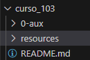
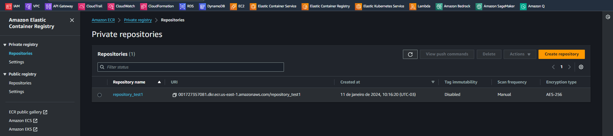
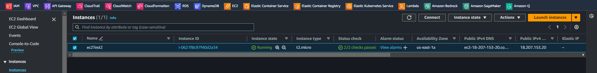
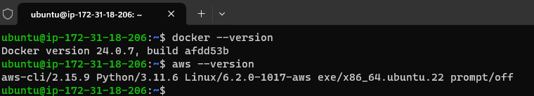
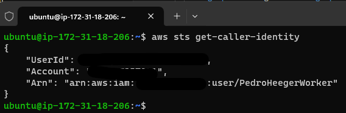
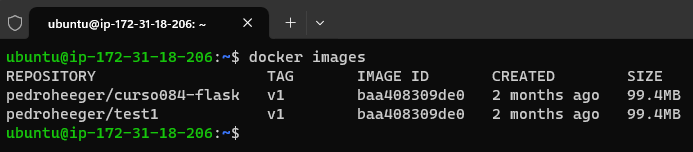
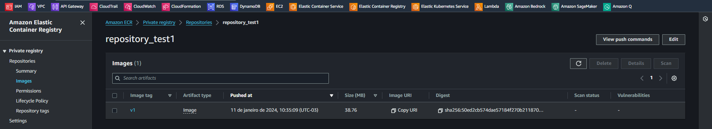
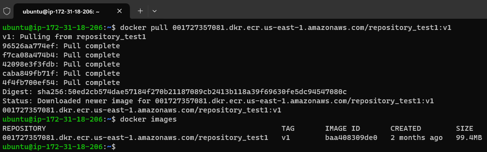

# Introduction to Amazon Elastic Container Registry   

### Repository: [course](../../../)   
### Platform: <a href="../../">aws_skill_builder   </a>
### Software/Subject: <a href="../">aws   </a>
### Course: <a href="./">curso_103 (Introduction to Amazon Elastic Container Registry)   </a>

#### <a href="https://github.com/PedroHeeger/main/blob/main/cert_ti/04-curso/cloud/aws/(23-12-17)_Introduction...(ECR)_PH_AWSSB.pdf">Certificate</a>

---

### Theme:
- Cloud Computing

### Used Tools:
- Operating System (OS): 
  - Linux   
  - Windows 11   
- Linux Distribution:
  - Ubuntu   
- Cloud:
  - Amazon Web Services (AWS)   
- Cloud Services:
  - Amazon Elastic Container Registry (ECR)   
  - AWS Software Development Kit (SDK) - Boto3   
  - Google Drive   
- Containerization: 
  - Docker   
- Language:
  - HTML   
  - Markdown   
  - Python   
- Integrated Development Environment (IDE) and Text Editor:
  - Visual Studio Code (VS Code)   
- Versioning: 
  - Git   
- Repository:
  - Docker Hub   
  - GitHub   
- Command Line Interpreter (CLI):
  - AWS Command Line Interface (CLI)   
  - Windows PowerShell   

---

<a name="item0"><h3>Course Strcuture:</h3></a>
1. <a href="#item01">Introduction to Amazon Elastic Container Registry (Portuguese)</a> 
  1.1 <a href="#item01.01">Prática</a> 

---

### Objective:
O objetivo desse curso foi apresentar o serviço **Amazon Elastic Container Registry (ECR)** que é um repositório de imagens **Docker** gerenciado pela **AWS**, e como ele se integra com o **Amazon Elastic Container Service**. Também foi feita uma breve explicação dos contêineres para melhor entendimento do serviço apresentado.

### Structure:
A estrutura do curso é formada por:
- Este arquivo de README.md.
- A pasta [resources](./resources/) contendo os arquivos de scripts em **Python** para interação com a **AWS**.
- A pasta `0-aux`, pasta auxiliar com imagens utilizadas na construção desse arquivo de README.

<figure>
     
    <figcaption>Imagem 01.</figcaption>
</figure>
 

### Development:

<a name="item01"><h4>Introduction to Amazon Elastic Container Registry (Portuguese)</h4></a>[Back to summary](#item0)

O que são contêineres? Um contêiner é uma unidade de entrega de software. É um software independente que é empacotado e executado com todas as suas dependências. Devido a esse pacote, os contêineres são extremamente rápidos. Há alguns anos, o **Docker** entrou em cena e simplificou muito a utilização dos recursos do kernel **Linux** que habilitaram contêineres. O Docker agora é frequentemente a principal referência de software ao criar pacotes e gerenciar a execução de contêineres.

Quando uma aplicação é criada, provavelmente precisa implantá-la em vários ambientes para desenvolvimento, testes e produção. Por exemplo, pode ser realizado alguns testes de unidade em um laptop de desenvolvimento e, em seguida, executar os servidores virtualizados no local. Depois, convém que ele seja executado em um ambiente de nuvem ou em um cluster de maquinas. Agora imagine que, em vez de apenas uma aplicação, existam muitas aplicações. Todas essas pilhas diferentes precisam ser executadas em diferentes ambientes de implantação e todos esses aplicativos podem ter dependências diferentes, tornando a interoperabilidade um padrão difícil de manter. Nos contêineres, eles isolam software de seus arredores, ajudando a reduzir conflitos da execução desse software em diferentes infraestruturas. Isso permite que o usuário se concentre na implantação, em vez de se preocupar com a preparação dos ambientes.

É importante observar que os contêineres não são o mesmo que maquinas virtuais. Eles não executam um sistema operacional completo, apenas um processo isolado. O ambiente de contêiner inicia um processo e faz o sistema operacional acreditar ser o único processo em execução no servidor. Para contêineres Docker em particular, é preciso ter o software Docker instalado no sistema operacional, o que permite executar contêineres. 

O *Daemon do Docker*, responsável pela execução de contêineres, pode ser gerenciado por diferentes ferramentas, como a CLI do Docker ou suas APIs. Um dos elementos-chave do Docker é a capacidade de criar imagens, que podem ser consideradas esquemas dos contêineres que serão executados. Uma imagem do Docker contém o sistema de arquivos base que o contêiner verá quando for executado. 

Para decidir utilizar os contêineres como plataforma de implatanção, é preciso responder algumas perguntas antes de começar. Como gerenciar uma infinidade de imagens de contêiner? Como se certificar de que o repositório de todas essas imagens está altamente disponível, que uma falha de infraestrutura não vai jogar fora todo o trabalho? E como gerenciar o controle de acesso ao repositório de imagens de contêiner? É aqui que o Amazon ECR entra.

O **Amazon Elastic Container Registry (ECR)** é um registro de imagens do **Docker** totalmente gerenciado que se integra ao **Amazon Elastic Container Service (ECS)**, facilitando o armazenamento, o gerenciamento e a implantação de imagens do Docker. Com apenas algumas ferramentas básicas, os desenvolvedores podem fazer download e upload de imagens do Docker de/para o Amazon ECR. O serviço elimina a necessidade de operar seus próprios repositórios de contêiner e atenua suas preocupações sobre escalabilidade, a infraestrutura subjacente necessária para o gerenciamento de contêineres.

O Amazon ECR usa o **Amazon S3** para armazenar essas imagens, garantindo alta disponibilidade. Como um serviço da AWS, as políticas do IAM controlarão o acesso ao Amazon ECR, permitindo que o usuário gerencie granularmente o acesso às imagens de contêiner armazenadas. O Amazon ECR também está totalmente integrado a uma CLI do Docker. Portanto, para obter ou enviar uma imagem de contêiner de ou para um repositório, não é preciso alterar nada no fluxo de trabalho. A CLI do Docker aceita a coleta da imagem no endpoint do Amazon ECR.

<a name="item01.01"><h4>Prática</h4></a>[Back to summary](#item0)

Como parte prática deste curso, foi instanciado uma maquina virtual no **Amazon Elastic Compute Cloud (EC2)** com **Docker** e **AWS CLI** para interagir com os repositórios de imagens Docker, o **Docker Hub** e o **Amazon Elastic Container Registry (ECR)**. Todos os arquivos de código foram escritos em **Python** utilizando o SDK **Boto3** para interagir com as APIs dos serviços da **AWS**. Os arquivos foram armazenados no diretório [resources](./resources/) e praticamente todos eles possuiam dois scripts, sendo um para criação de algum elemento e outro para exclusão. Somente alguns arquivos específicos possuíram apenas um script. Cada script era envolvido em uma estrutura de condição que aguardava uma entrada do usuário no console para determinar se seria executado ou não.

O projeto iniciou com a criação de um repositório no **Amazon Elastic Container Registry (ECR)** com o arquivo [ecrRepoitory.py](./resources/ecrRepository.py). Em seguida, na sub-pasta [suport](./resources/suport/), foi executado o arquivo [ec2Instance.py](./resources/suport/ec2Instace.py) que instanciou uma maquina virtual **Linux Ubuntu** no serviço **Amazon Elastic Compute Cloud (EC2)**, passando o arquivo [udFile.sh](./resources/suport/udFile.sh) como user data. Este foi um arquivo em **Bash** que instalou os softwares **AWS Command Line Interface (CLI)** e **Docker**, além de algumas ferramentas básicas do **Linux**. O arquivo par de chaves utilizado foi o `keyPairUniversal`, um par de chaves elaborado para ser universal para os cursos, para que não seja necessário criá-lo toda hora. Na imagem 02 abaixo é exibido o repositório criado no ECR. Já na imagem 03 é mostrada a instância executada. Enquanto na imagem 04 é evidenciado, através de um acesso remoto realizado da maquina física **Windows** para a instância com o **OpenSSH** (`ssh -i "G:\Meu Drive\4_PROJ\scripts\scripts_model\.default\secrets\awsKeyPair\keyPairUniversal.pem" ubuntu@18.207.153.20`), os dois softwares instalados com sucesso. Observe que para realizar o acesso remoto via SSH a porta `22` do grupo de segurança da instância teve que estar aberta.

<figure>
     
    <figcaption>Imagem 02.</figcaption>
</figure>
 

<figure>
     
    <figcaption>Imagem 03.</figcaption>
</figure>
 

<figure>
     
    <figcaption>Imagem 04.</figcaption>
</figure>
 

A próxima etapa foi a execução do arquivo [ec2TransFile.py](./resources/suport/ec2TransFile.py) que com o nome de tag da instância criada, verificou a existência das pastas de configuração `.aws` e `.docker` no diretório `/home/ubuntu` da instância. Caso não fossem encontradas, essas pastas com seus respectivos arquivos eram transferidas para a instância. A pasta `.aws` continha dois arquivos `.credential`, com as credenciais (`Access Key Id` e `Secret Access Key`) de um usuário do IAM da minha conta da AWS que neste caso foi o usuário Worker, e o arquivo `.config`, com as configurações de `region` e `output` utilizadas por este usuário. Já a pasta `.docker` continha apenas o arquivo `config.json` que era um **JSON** com autenticação do **Docker** para minha conta no **Docker Hub** e para o serviço do ECR na conta do usuário Worker. Assim era possível enviar e receber imagens dos dois repositórios. Na imagem 05 é mostrado o usuário Worker da minha conta da AWS conectado ao **AWS CLI** da instância.

<figure>
     
    <figcaption>Imagem 05.</figcaption>
</figure>
 

Agora foi o momento de testar se tudo estava funcionando, o objetivo aqui não foi executar contêineres, isso pode ser visto no [curso_106](../curso_106/), a ideia aqui era apenas enviar e baixar imagens dos dois repositórios. Então, para começar um acesso remoto foi realizado novamente na instância, pois era de onde o **Docker** seria executado. Um ponto importante também foi além de garantir que a porta `22` estava aberta para realizar a conexão SSH, liberar a porta `80` ou `443` para conexão `HTTP` e `HTTPS`, porque o **Docker** utiliza essas portas para baixar as imagens do repositório. Para isso, estava a disposição o arquivo [vpcSgRule.py](./resources/suport/vpcSgRule.py) para criar e excluir uma regra de liberação de portas no grupo de segurança padrão, que era o grupo utilizado pela instância.

Dando sequência, foi escolhida qualquer imagem do **Docker Hub** desde que seja confiável, no caso a escolhida foi do meu próprio repositório, possa ser que futuramente essa imagem não esteja mais lá, então é importante conferir se ainda ela existe. Com o comando `docker pull pedroheeger/curso084-flask:v1` foi baixada a imagem para o **Docker** na instância, com o comando `docker tag pedroheeger/curso084-flask:v1 pedroheeger/test1:v1` a imagem baixada foi tagueada para uma nova tag e com o comando `docker push pedroheeger/test1:v1` esta imagem de nova tag foi enviada para o **Docker Hub** criando um novo repositório já que esse nome de tag não existia lá. Na imagem 06 é mostrado o repositório com a imagem de nova tag no **Docker Hub**. Já na imagem 07 o output do comando `docker images`, que lista todas as imagens, é exibido mostrando as duas imagens, a baixada e a enviada.

<figure>
     
    <figcaption>Imagem 06.</figcaption>
</figure>
 

<figure>
     
    <figcaption>Imagem 07.</figcaption>
</figure>
 

A próxima etapa foi fazer esse mesmo procedimento, mas agora para o repositório do ECR. Para enviar para o ECR, era necessário ter o repositório da imagem já criado e isso foi feito no início desse projeto. A imagem de nova tag foi tagueda novamente com o comando `docker tag pedroheeger/test1:v1 001727357081.dkr.ecr.us-east-1.amazonaws.com/repository_test1:v1`. Observe que a estrutura de um nome de imagem no ECR é diferente, começa com número da conta da AWS, depois é informada a região, após a barra vem o nome do repositório (nome da imagem) e em seguida a versão (a tag). Com essa imagem de nova tag foi utilizado o comando `docker push 001727357081.dkr.ecr.us-east-1.amazonaws.com/repository_test1:v1` que enviou a imagem para o repositório criado. Caso haja algum problema com o token de conexão com o ECR, basta utilizar esse comando `aws ecr get-login-password --region us-east-1 | docker login --username AWS --password-stdin 001727357081.dkr.ecr.us-east-1.amazonaws.com` que ele renova o token. Na imagem 08 é evidenciada a imagem no repositório. 

<figure>
     
    <figcaption>Imagem 08.</figcaption>
</figure>
 

Antes de baixar essa imagem de nova tag, todas as imagens existentes foram excluída com o comando `docker image rm`. Em seguida, com o comando `docker pull 001727357081.dkr.ecr.us-east-1.amazonaws.com/repository_test1:v1` a imagem do repositório do ECR foi baixada e visualizada com o comando `docker images`, conforme imagem 09. Para excluir a imagem foi utilizado o arquivo [ecrImage.py](./resources/ecrImage.py) na maquina física **Windows**. Este só possuía o script de exclusão, pois a criação da imagem no repositório foi realizada com o envio da imagem pelo **Docker**.

<figure>
     
    <figcaption>Imagem 09.</figcaption>
</figure>
 