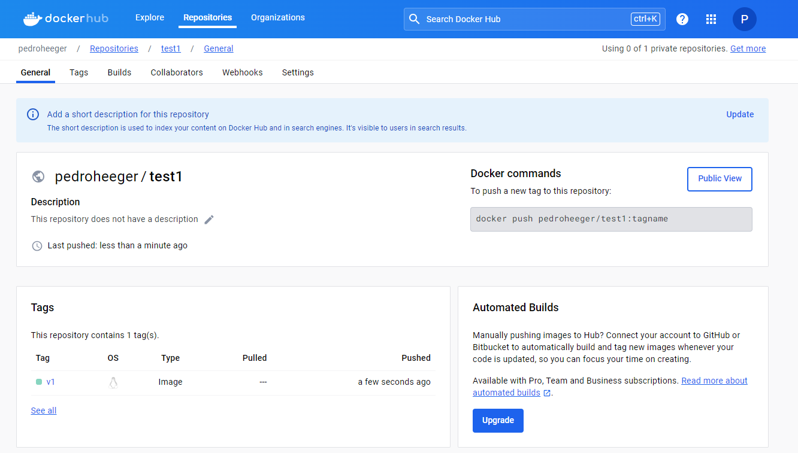

# Introduction to Amazon Elastic Container Registry   

### Repository: [course](../../../)   
### Platform: <a href="../../">aws_skill_builder   </a>
### Software/Subject: <a href="../">aws   </a>
### Course: <a href="./">curso_103 (Introduction to Amazon Elastic Container Registry)   </a>

#### <a href="https://github.com/PedroHeeger/main/blob/main/cert_ti/04-curso/cloud/aws/(23-12-17)%20Introduction...(ECR)%20PH%20AWSSB.pdf">Certificate</a>

---

### Theme:
- Cloud Computing

### Used Tools:
- Operating System (OS): 
  - Windows 11   
- Cloud:
  - Amazon Web Services (AWS)   
- Cloud Services:
  - Amazon Elastic Container Registry (ECR)   
  - Amazon Elastic Container Service (ECS)   
  <!-- - AWS Fargate    -->
  - AWS Software Development Kit (SDK) - Boto3   
  - Google Drive   
- Containerization: 
  - Docker   
- Language:
  - HTML   
  - Markdown   
- Integrated Development Environment (IDE) and Text Editor:
  - Visual Studio Code (VS Code)   
- Versioning: 
  - Git   
- Repository:
  - Docker Hub   
  - GitHub   
- Command Line Interpreter (CLI):
  - AWS Command Line Interface (CLI)   
  - Windows PowerShell   

---

<a name="item0"><h3>Course Strcuture:</h3></a>
1. <a href="#item01">Introduction to Amazon Elastic Container Registry (Portuguese)</a> 

---

### Objective:
O objetivo desse curso foi apresentar o serviço **Amazon Elastic Container Registry (ECR)** que é um repositório de imagens **Docker** gerenciado pela **AWS**, e como ele se integra com o **Amazon Elastic Container Service**. Também foi feita uma breve explicação dos contêineres para melhor entendimento do serviço apresentado.

### Structure:
A estrutura do curso é formada por:
- Este arquivo de README.md.
- A pasta [resources](./resources/) contendo os arquivos de scripts em **Python** para interação com a **AWS**.
- A pasta `0-aux`, pasta auxiliar com imagens utilizadas na construção desse arquivo de README.

<figure>
     
    <figcaption>Imagem 01.</figcaption>
</figure>
 

### Development:

<a name="item01"><h4>Introduction to Amazon Elastic Container Registry (Portuguese)</h4></a>[Back to summary](#item0)

O que são contêineres? Um contêiner é uma unidade de entrega de software. É um software independente que é empacotado e executado com todas as suas dependências. Devido a esse pacote, os contêineres são extremamente rápidos. Há alguns anos, o **Docker** entrou em cena e simplificou muito a utilização dos recursos do kernel **Linux** que habilitaram contêineres. O Docker agora é frequentemente a principal referência de software ao criar pacotes e gerenciar a execução de contêineres.

Quando uma aplicação é criada, provavelmente precisa implantá-la em vários ambientes para desenvolvimento, testes e produção. Por exemplo, pode ser realizado alguns testes de unidade em um laptop de desenvolvimento e, em seguida, executar os servidores virtualizados no local. Depois, convém que ele seja executado em um ambiente de nuvem ou em um cluster de maquinas. Agora imagine que, em vez de apenas uma aplicação, existam muitas aplicações. Todas essas pilhas diferentes precisam ser executadas em diferentes ambientes de implantação e todos esses aplicativos podem ter dependências diferentes, tornando a interoperabilidade um padrão difícil de manter. Nos contêineres, eles isolam software de seus arredores, ajudando a reduzir conflitos da execução desse software em diferentes infraestruturas. Isso permite que o usuário se concentre na implantação, em vez de se preocupar com a preparação dos ambientes.

É importante observar que os contêineres não são o mesmo que maquinas virtuais. Eles não executam um sistema operacional completo, apenas um processo isolado. O ambiente de contêiner inicia um processo e faz o sistema operacional acreditar ser o único processo em execução no servidor. Para contêineres Docker em particular, é preciso ter o software Docker instalado no sistema operacional, o que permite executar contêineres. 

O *Daemon do Docker*, responsável pela execução de contêineres, pode ser gerenciado por diferentes ferramentas, como a CLI do Docker ou suas APIs. Um dos elementos-chave do Docker é a capacidade de criar imagens, que podem ser consideradas esquemas dos contêineres que serão executados. Uma imagem do Docker contém o sistema de arquivos base que o contêiner verá quando for executado. 

Para decidir utilizar os contêineres como plataforma de implatanção, é preciso responder algumas perguntas antes de começar. Como gerenciar uma infinidade de imagens de contêiner? Como se certificar de que o repositório de todas essas imagens está altamente disponível, que uma falha de infraestrutura não vai jogar fora todo o trabalho? E como gerenciar o controle de acesso ao repositório de imagens de contêiner? É aqui que o Amazon ECR entra.

O **Amazon Elastic Container Registry (ECR)** é um registro de imagens do **Docker** totalmente gerenciado que se integra ao **Amazon Elastic Container Service (ECS)**, facilitando o armazenamento, o gerenciamento e a implantação de imagens do Docker. Com apenas algumas ferramentas básicas, os desenvolvedores podem fazer download e upload de imagens do Docker de/para o Amazon ECR. O serviço elimina a necessidade de operar seus próprios repositórios de contêiner e atenua suas preocupações sobre escalabilidade, a infraestrutura subjacente necessária para o gerenciamento de contêineres.

O Amazon ECR usa o **Amazon S3** para armazenar essas imagens, garantindo alta disponibilidade. Como um serviço da AWS, as políticas do IAM controlarão o acesso ao Amazon ECR, permitindo que o usuário gerencie granularmente o acesso às imagens de contêiner armazenadas. O Amazon ECR também está totalmente integrado a uma CLI do Docker. Portanto, para obter ou enviar uma imagem de contêiner de ou para um repositório, não é preciso alterar nada no fluxo de trabalho. A CLI do Docker aceita a coleta da imagem no endpoint do Amazon ECR.

Como parte prática desse curso, foi criado o sub-diretório [resources](./resources/) com três arquivos de scripts em **Python** para criar uma role e uma policy, e anexar a policy criada a role desenvolvida. Essa role possuíu na sua política de confiança (*Trust Policy*), o usuário do IAM criado no curso [curso_099](../curso_099/). Esses arquivos em **Python** são divididos em dois scripts em cada arquivo, sendo um script para criação e outro para exclusão. Para interagir com as APIs da **AWS** foi utilizado o SDK **Boto3**. A ordem de execução dos arquivos foi [iamPolicy.py](./resources/iamPolicy.py) para criar a policy personalizada, [iamRole.py](./resources/iamRole.py) para criar a role e [iamRolePolicy.py](./resources/iamRolePolicy.py) para adicionar a policy criada à role. A ordem de remoção é inversa a de criação. Cada script de criação e exclusão nos arquivos conta com uma estrutura de condição para decidir se o usuário quer ou não executar o bloco de código. 

Tanto no arquivo da role como da policy, no script de criação, existem dois blocos de criação desses elementos, sendo um onde é passado o **JSON** direto no comando e outro onde é indicado um arquivo **JSON**. A primeira opção foi a executada, sendo a segunda opção comentada. Caso queira utilizá-la, é preciso comentar a primeira opção e descomentar a segunda, além de conferir a variável com o caminho correto para o arquivo **JSON** e verificar o próprio arquivo **JSON**.

Nas imagens 02 e 03 é exibido o output da execução dos scripts de criação dos três arquivos **Python**. Nas imagens 04, 05, 06 e 07 é evidenciado no console da **AWS** a policy e a role criada, além da anexação dessa policy a role e a política de confiança (*Trust Policy*), ou seja, a entidade que pode assumir essa role que no caso é o usuário do IAM criado no curso [curso_099](../curso_099/)

<figure>
     
    <figcaption>Imagem 02.</figcaption>
</figure>
 

<figure>
     
    <figcaption>Imagem 03.</figcaption>
</figure>
 

<figure>
     
    <figcaption>Imagem 04.</figcaption>
</figure>
 

<figure>
     
    <figcaption>Imagem 05.</figcaption>
</figure>
 

<figure>
     
    <figcaption>Imagem 06.</figcaption>
</figure>
 

<figure>
     
    <figcaption>Imagem 07.</figcaption>
</figure>
 

Por fim, as imagens 08 e 09 mostram a remoção desses recursos desenvolvidos.

<figure>
     
    <figcaption>Imagem 08.</figcaption>
</figure>
 

<figure>
     
    <figcaption>Imagem 09.</figcaption>
</figure>
 