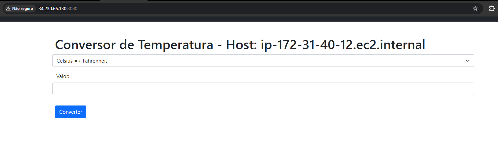

# Introduction to AWS Fargate   

### Repository: [course](../../../)   
### Platform: <a href="../../">aws_skill_builder   </a>
### Software/Subject: <a href="../">aws   </a>
### Course: <a href="./">curso_104 (Introduction to AWS Fargate)   </a>

#### <a href="https://github.com/PedroHeeger/main/blob/main/cert_ti/04-curso/cloud/aws/(23-12-15)%20Introduction...Fargate%20PH%20AWSSB.pdf">Certificate</a>

---

### Theme:
- Cloud Computing

### Used Tools:
- Operating System (OS): 
  - Windows 11   
- Cloud:
  - Amazon Web Services (AWS)   
- Cloud Services:
  - Amazon Elastic Container Service (ECS)   
  - AWS Fargate   
  - AWS Software Development Kit (SDK) - Boto3   
  - Google Drive   
- Containerization: 
  - Docker   
- Language:
  - HTML   
  - Markdown   
- Integrated Development Environment (IDE) and Text Editor:
  - Visual Studio Code (VS Code)   
- Versioning: 
  - Git   
- Repository:
  - Docker Hub   
  - GitHub   
- Command Line Interpreter (CLI):
  - AWS Command Line Interface (CLI)   
  - Windows PowerShell   

---

<a name="item0"><h3>Course Strcuture:</h3></a>
1. <a href="#item01">Introduction to AWS Fargate (Portuguese)</a> 

---

### Objective:
O objetivo desse curso foi introduzir o serviço **AWS Fargate** que serve para implantar e gerenciar contêineres. Neste curso, foi explicado como o **AWS Fargate** facilita a execução de aplicações usando contêineres no serviço **Amazon Elastic Container Service (ECS)**, pois, assim como o **Amazon Elastic Compute Cloud (EC2)**, ele serve como infraestrutura para o **Amazon ECS**.

### Structure:
A estrutura do curso é formada por:
- Este arquivo de README.md.
- A pasta [resources](./resources/) contendo os arquivos de scripts em **Python** para interação com a **AWS**.
- A pasta `0-aux`, pasta auxiliar com imagens utilizadas na construção desse arquivo de README.

<figure>
     
    <figcaption>Imagem 01.</figcaption>
</figure>
 

### Development:

<a name="item01"><h4>Introduction to AWS Fargate (Portuguese)</h4></a>[Back to summary](#item0)

Os contêineres são uma forma de empacotamento e implantação de aplicações cada vez mais importante para os desenvolvedores. Eles são leves e oferecem um ambiente de software consistente e portátil para que as aplicações possam executar e escalar com facilidade em qualquer lugar. Os contêineres podem ser usados para criar e implantar microsserviços, executar trabalhos em lote para aplicações de machine learning e mover aplicações existentes para a nuvem.

O serviço **AWS Fargate** é uma tecnologia para implantar e gerenciar contêineres, no qual é possivel executar tarefas com o Fargate sem ter que gerenciar qualquer uma das infraestruturas subjacentes. O Fargate apresenta uma nova computação primitiva que permite operar no nível da tarefa, permitindo que o foco seja nas coisas diferenciadoras para os negócios e não nas coisas indiferenciadas, como provisionamento e escalabilidade de clusters de servidores, ou patch e atualização desses servidores. 

Existem algumas maneiras pelas quais o Fargate facilita a execução de aplicações usando contêineres. Em primeiro lugar, o Fargate torna a execução de contêineres o foco para desenvolvedores. Antes, era necessário se preocupar com o provisionamento e escalabilidade de um cluster de servidores para atender às necessidades das aplicações e gerenciar as atualizações de software e patches para os servidores. Com o Fargate, não é mais preciso provisionar e escalar clusters de servidores ou aplicar patch e atualizar cada servidor. Em segundo lugar, o Fargate oferecerá suporte ao **Amazon Elastic Container Service (ECS)** e **Amazon Elastic Container Service for Kubernetes (EKS)**. Assim, existe a possibilidade de escolher a solução de orquestração que for melhor para gerenciar e executar os contêineres. Com o Fargate, a aplicação é definada, como faz hoje para ECS ou EKS, e os recursos de que ela precisa, e o Fargate lida perfeitamente com a infraestrutura subjacente. Terceiro, com o Fargate só é pago pelos recursos utilizados. Como contêiner em execução em uma definição de tarefa consome CPU e memória, só é pago por esses recursos em uma base de uso por segundo.

O funcionamento do **AWS Fargate** no **Amazon ECS** começa com a definição da tarefa. O cliente usa a definição de tarefa para definir a imagem de memória da CPU do contêiner e outros detalhes importantes que definem como os contêineres devem ser executados. Dentro da **AWS**, uma tarefa representa um agrupamento de um ou mais contêineres que compõem a aplicação de um cliente. Para executar a tarefa, basta usar a API de tarefa inicial e especificar o tipo de execução como EC2 para executar em uma instância criada, ou o Fargate para executar essa tarefa em um ambiente gerenciado. Ao executar tarefas no Fargate, não é necessário mais pensar em nenhuma infraestrutura subjacente, pois todas elas são operadas e gerenciadas pela **AWS**. Com o Fargate, só é preciso pensar sobre a aplicação e nas APIs que são expostas para ajudá-lo a executá-las na **AWS**.

O Fargate é fácil de usar e familiar para os usuários existentes do ECS, usuários existentes da AWS e novos usuários da AWS que estão apenas aprendendo o básico. Para esse fim, é possível usar o Fargate por meio do Console AWS, da CLI da AWS e da CLI do ECS. Além de especificar Fargate como uma opção nas definições de tarefa. Existem apenas alguns novos comandos e funções para invocar o Fargate como uma opção nessas ferramentas familiares. Antes disso, uma vez que havia apenas um tipo de execução EC2, não era possível especificar nenhuma opção adicional. Hoje, iniciar essa tarefa no Fargate é tão fácil quanto utilizar o argumento do tipo de execução e especificar o Fargate. Não é preciso aprender uma nova CLI e nova definição de tarefa, o conhecimento anterior e investimentos é o suficiente.

Ao usar o Fargate, algumas coisas serão diferentes comparado ao EC2. O primeiro detalhe é como o Fargate se integra à nuvem privada virtual. Todas as tarefas iniciadas usando o Fargate são executadas dentro de uma VPC definida, determinando quais sub-redes e grupos de segurança se aplicam a essa tarefa e à definição da tarefa ou em tempo de execução. O Fargate impõe a configuração especificada quando as tarefas são iniciadas. O segundo é o suporte de balanceamento de carga. O Fargate suporta balanceamento de carga de aplicações, ou ALB, e balanceamento de carga de rede (NLB). O **Elastic Load Balancing (ELB)** não é compatível atualmente com o Fargate. Por fim, o Fargate suporta redes avançadas em nível de tarefa. Isso permite que as interfaces de rede elástica sejam atribuidas diretamente às tarefas em execução do **Amazon ECS** das sub-redes da VPC designadas pelo usuário. Essa interface de rede elástica no nível da tarefa possibilita atribuir grupos de segurança do EC2 e usar as ferramentas de monitoramento de rede padrão no nível do contêiner. Isso simplifica o gerenciamento das configurações de redes, permitindo que seja tratado cada contêiner como uma instância do EC2, com os recursos de rede completos na VPC.

Com o Fargate, existe uma maneira segura de executar contêineres. Aqui estão algumas das coisas que tornam isso possível. Primeiro, com o Fargate, a AWS gerencia a segurança da plataforma subjacente e o gerenciamento de patches de host, o que mantém o tempo de execução do **Docker** e os pacotes de SO associados. Em segundo lugar, a AWS protege cuidadosamente como as tarefas em execução podem ser acessadas, removendo a capacidade de qualquer pessoa se conectar remotamente à tarefa que não possui. Ao contrário do ECS hoje, é oferecido garantias de isolamento de tarefas e contêineres no nível do cluster.

Do ponto de vista do caso de uso, o Fargate se aplica ao amplo espectro de casos de uso de contêineres, como serviços de longa duração, cargas de trabalho altamente disponíveis e contêineres de aplicações monolíticas para permitir portabilidade e trabalhos de microsserviços e em lote. Os recursos de agendamento de serviços do ECS permitem que sejam executadas as aplicações usando o Fargate de uma forma multi-agência altamente disponível. Por exemplo, uma aplicação que seja preciso dividir em várias funções principais diferentes para que torne possível gerenciar, implantar e escalar de forma independente. Com base no tráfego, uma interface de usuário ou servidor de API com um armazenamento de dados de back-end. Esses componentes podem ser executados como tarefas separadas do Fargate ou como um serviço no Fargate e o desenvolvedor pode se concentrar inteiramente na criação da aplicação e não precisa pensar em nenhuma infraestrutura. Em segundo lugar, quando é necessário migrar para a AWS e mover rapidamente os aplicativos monolíticos para a nuvem. A conteinerização é uma maneira ótima e rápida de fazer isso, mas e o design da infraestrutura subjacente para oferecer suporte a esse aplicativo na nuvem? Ao conteinerizar os aplicativos e iniciar com o Fargate, o usuário pode se preocupar menos com o cluster e se concentrar na própria aplicação.

Há alguns casos de uso em que a implantação da tarefa usando o tipo de execução do **Amazon EC2** faz mais sentido do que usar o Fargate hoje. Se o cliente for um usuário frequente do EC2 Spot ou tiver pago por instâncias reservadas, poderá optar por usar o tipo de execução EC2 para as suas tarefas do ECS. Já que o Fargate está gerenciando toda a infraestrutura em seu nome e cobrando pelo consumo de CPU e memória por segundo. Hoje não existe uma maneira de converter isso para Spot ou instâncias reservadas. Em segundo lugar, se os serviços e aplicativos que está sendp implantado são executados em contêineres baseados no **Microsoft Windows**. O tipo de execução EC2 ainda é a melhor opção para implantação, pois permite que seja utilizado AMIs baseados no **Windows** e configurações no cluster, que atualmente não é compatível com o Fargate.

Como parte prática desse curso, foi criado o sub-diretório [resources](./resources/) com três arquivos de scripts em **Python** para criar uma role e uma policy, e anexar a policy criada a role desenvolvida. Essa role possuíu na sua política de confiança (*Trust Policy*), o usuário do IAM criado no curso [curso_099](../curso_099/). Esses arquivos em **Python** são divididos em dois scripts em cada arquivo, sendo um script para criação e outro para exclusão. Para interagir com as APIs da **AWS** foi utilizado o SDK **Boto3**. A ordem de execução dos arquivos foi [iamPolicy.py](./resources/iamPolicy.py) para criar a policy personalizada, [iamRole.py](./resources/iamRole.py) para criar a role e [iamRolePolicy.py](./resources/iamRolePolicy.py) para adicionar a policy criada à role. A ordem de remoção é inversa a de criação. Cada script de criação e exclusão nos arquivos conta com uma estrutura de condição para decidir se o usuário quer ou não executar o bloco de código. 

Tanto no arquivo da role como da policy, no script de criação, existem dois blocos de criação desses elementos, sendo um onde é passado o **JSON** direto no comando e outro onde é indicado um arquivo **JSON**. A primeira opção foi a executada, sendo a segunda opção comentada. Caso queira utilizá-la, é preciso comentar a primeira opção e descomentar a segunda, além de conferir a variável com o caminho correto para o arquivo **JSON** e verificar o próprio arquivo **JSON**.

Nas imagens 02 e 03 é exibido o output da execução dos scripts de criação dos três arquivos **Python**. Nas imagens 04, 05, 06 e 07 é evidenciado no console da **AWS** a policy e a role criada, além da anexação dessa policy a role e a política de confiança (*Trust Policy*), ou seja, a entidade que pode assumir essa role que no caso é o usuário do IAM criado no curso [curso_099](../curso_099/)

<figure>
     
    <figcaption>Imagem 02.</figcaption>
</figure>
 

<figure>
     
    <figcaption>Imagem 03.</figcaption>
</figure>
 

<figure>
     
    <figcaption>Imagem 04.</figcaption>
</figure>
 

<figure>
     
    <figcaption>Imagem 05.</figcaption>
</figure>
 

<figure>
     
    <figcaption>Imagem 06.</figcaption>
</figure>
 

<figure>
     
    <figcaption>Imagem 07.</figcaption>
</figure>
 

Por fim, as imagens 08 e 09 mostram a remoção desses recursos desenvolvidos.

<figure>
     
    <figcaption>Imagem 08.</figcaption>
</figure>
 

<figure>
     
    <figcaption>Imagem 09.</figcaption>
</figure>
 