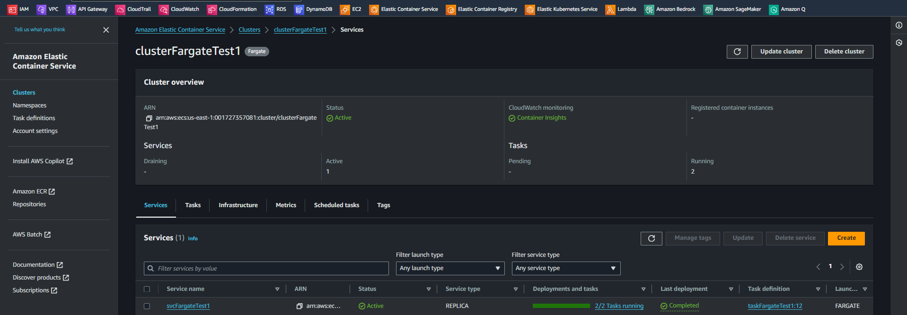

# Introduction to AWS Fargate   

### Repository: [course](../../../)   
### Platform: <a href="../../">aws_skill_builder   </a>
### Software/Subject: <a href="../">aws   </a>
### Course: <a href="./">curso_104 (Introduction to AWS Fargate)   </a>

#### <a href="https://github.com/PedroHeeger/main/blob/main/cert_ti/04-curso/cloud/aws/(23-12-15)_Introduction...Fargate_PH_AWSSB.pdf">Certificate</a>

---

### Theme:
- Cloud Computing

### Used Tools:
- Operating System (OS): 
  - Windows 11   
- Cloud:
  - Amazon Web Services (AWS)   
- Cloud Services:
  - Amazon CloudWatch   
  - Amazon Elastic Container Service (ECS)   
  - AWS IAM Identity Center   
  - AWS Fargate   
  - AWS Software Development Kit (SDK) - Boto3   
  - Google Drive   
- Containerization: 
  - Docker   
- Language:
  - HTML   
  - Markdown   
  - Python   
- Integrated Development Environment (IDE) and Text Editor:
  - Visual Studio Code (VS Code)   
- Versioning: 
  - Git   
- Repository:
  - Docker Hub   
  - GitHub   
- Command Line Interpreter (CLI):
  - AWS Command Line Interface (CLI)   
  - Windows PowerShell   

---

<a name="item0"><h3>Course Strcuture:</h3></a>
1. <a href="#item01">Introduction to AWS Fargate (Portuguese)</a> 
  1.1 <a href="#item01.01">Prática</a> 

---

### Objective:
O objetivo desse curso foi introduzir o serviço **AWS Fargate** que serve para implantar e gerenciar contêineres. Neste curso, foi explicado como o **AWS Fargate** facilita a execução de aplicações usando contêineres no serviço **Amazon Elastic Container Service (ECS)**, pois, assim como o **Amazon Elastic Compute Cloud (EC2)**, ele serve como infraestrutura para o **Amazon ECS**.

### Structure:
A estrutura do curso é formada por:
- Este arquivo de README.md.
- A pasta [resources](./resources/) contendo os arquivos de scripts em **Python** para interação com a **AWS**.
- A pasta `0-aux`, pasta auxiliar com imagens utilizadas na construção desse arquivo de README.

<figure>
     
    <figcaption>Imagem 01.</figcaption>
</figure>
 

### Development:

<a name="item01"><h4>Introduction to AWS Fargate (Portuguese)</h4></a>[Back to summary](#item0)

Os contêineres são uma forma de empacotamento e implantação de aplicações cada vez mais importante para os desenvolvedores. Eles são leves e oferecem um ambiente de software consistente e portátil para que as aplicações possam executar e escalar com facilidade em qualquer lugar. Os contêineres podem ser usados para criar e implantar microsserviços, executar trabalhos em lote para aplicações de machine learning e mover aplicações existentes para a nuvem.

O serviço **AWS Fargate** é uma tecnologia para implantar e gerenciar contêineres, no qual é possivel executar tarefas com o Fargate sem ter que gerenciar qualquer uma das infraestruturas subjacentes. O Fargate apresenta uma nova computação primitiva que permite operar no nível da tarefa, permitindo que o foco seja nas coisas diferenciadoras para os negócios e não nas coisas indiferenciadas, como provisionamento e escalabilidade de clusters de servidores, ou patch e atualização desses servidores. 

Existem algumas maneiras pelas quais o Fargate facilita a execução de aplicações usando contêineres. Em primeiro lugar, o Fargate torna a execução de contêineres o foco para desenvolvedores. Antes, era necessário se preocupar com o provisionamento e escalabilidade de um cluster de servidores para atender às necessidades das aplicações e gerenciar as atualizações de software e patches para os servidores. Com o Fargate, não é mais preciso provisionar e escalar clusters de servidores ou aplicar patch e atualizar cada servidor. Em segundo lugar, o Fargate oferecerá suporte ao **Amazon Elastic Container Service (ECS)** e **Amazon Elastic Container Service for Kubernetes (EKS)**. Assim, existe a possibilidade de escolher a solução de orquestração que for melhor para gerenciar e executar os contêineres. Com o Fargate, a aplicação é definada, como faz hoje para ECS ou EKS, e os recursos de que ela precisa, e o Fargate lida perfeitamente com a infraestrutura subjacente. Terceiro, com o Fargate só é pago pelos recursos utilizados. Como contêiner em execução em uma definição de tarefa consome CPU e memória, só é pago por esses recursos em uma base de uso por segundo.

O funcionamento do **AWS Fargate** no **Amazon ECS** começa com a definição da tarefa. O cliente usa a definição de tarefa para definir a imagem de memória da CPU do contêiner e outros detalhes importantes que definem como os contêineres devem ser executados. Dentro da **AWS**, uma tarefa representa um agrupamento de um ou mais contêineres que compõem a aplicação de um cliente. Para executar a tarefa, basta usar a API de tarefa inicial e especificar o tipo de execução como EC2 para executar em uma instância criada, ou o Fargate para executar essa tarefa em um ambiente gerenciado. Ao executar tarefas no Fargate, não é necessário mais pensar em nenhuma infraestrutura subjacente, pois todas elas são operadas e gerenciadas pela **AWS**. Com o Fargate, só é preciso pensar sobre a aplicação e nas APIs que são expostas para ajudá-lo a executá-las na **AWS**.

O Fargate é fácil de usar e familiar para os usuários existentes do ECS, usuários existentes da AWS e novos usuários da AWS que estão apenas aprendendo o básico. Para esse fim, é possível usar o Fargate por meio do Console AWS, da CLI da AWS e da CLI do ECS. Além de especificar Fargate como uma opção nas definições de tarefa. Existem apenas alguns novos comandos e funções para invocar o Fargate como uma opção nessas ferramentas familiares. Antes disso, uma vez que havia apenas um tipo de execução EC2, não era possível especificar nenhuma opção adicional. Hoje, iniciar essa tarefa no Fargate é tão fácil quanto utilizar o argumento do tipo de execução e especificar o Fargate. Não é preciso aprender uma nova CLI e nova definição de tarefa, o conhecimento anterior e investimentos é o suficiente.

Ao usar o Fargate, algumas coisas serão diferentes comparado ao EC2. O primeiro detalhe é como o Fargate se integra à nuvem privada virtual. Todas as tarefas iniciadas usando o Fargate são executadas dentro de uma VPC definida, determinando quais sub-redes e grupos de segurança se aplicam a essa tarefa e à definição da tarefa ou em tempo de execução. O Fargate impõe a configuração especificada quando as tarefas são iniciadas. O segundo é o suporte de balanceamento de carga. O Fargate suporta balanceamento de carga de aplicações, ou ALB, e balanceamento de carga de rede (NLB). O **Elastic Load Balancing (ELB)** não é compatível atualmente com o Fargate. Por fim, o Fargate suporta redes avançadas em nível de tarefa. Isso permite que as interfaces de rede elástica sejam atribuidas diretamente às tarefas em execução do **Amazon ECS** das sub-redes da VPC designadas pelo usuário. Essa interface de rede elástica no nível da tarefa possibilita atribuir grupos de segurança do EC2 e usar as ferramentas de monitoramento de rede padrão no nível do contêiner. Isso simplifica o gerenciamento das configurações de redes, permitindo que seja tratado cada contêiner como uma instância do EC2, com os recursos de rede completos na VPC.

Com o Fargate, existe uma maneira segura de executar contêineres. Aqui estão algumas das coisas que tornam isso possível. Primeiro, com o Fargate, a AWS gerencia a segurança da plataforma subjacente e o gerenciamento de patches de host, o que mantém o tempo de execução do **Docker** e os pacotes de SO associados. Em segundo lugar, a AWS protege cuidadosamente como as tarefas em execução podem ser acessadas, removendo a capacidade de qualquer pessoa se conectar remotamente à tarefa que não possui. Ao contrário do ECS hoje, é oferecido garantias de isolamento de tarefas e contêineres no nível do cluster.

Do ponto de vista do caso de uso, o Fargate se aplica ao amplo espectro de casos de uso de contêineres, como serviços de longa duração, cargas de trabalho altamente disponíveis e contêineres de aplicações monolíticas para permitir portabilidade e trabalhos de microsserviços e em lote. Os recursos de agendamento de serviços do ECS permitem que sejam executadas as aplicações usando o Fargate de uma forma multi-agência altamente disponível. Por exemplo, uma aplicação que seja preciso dividir em várias funções principais diferentes para que torne possível gerenciar, implantar e escalar de forma independente. Com base no tráfego, uma interface de usuário ou servidor de API com um armazenamento de dados de back-end. Esses componentes podem ser executados como tarefas separadas do Fargate ou como um serviço no Fargate e o desenvolvedor pode se concentrar inteiramente na criação da aplicação e não precisa pensar em nenhuma infraestrutura. Em segundo lugar, quando é necessário migrar para a AWS e mover rapidamente os aplicativos monolíticos para a nuvem. A conteinerização é uma maneira ótima e rápida de fazer isso, mas e o design da infraestrutura subjacente para oferecer suporte a esse aplicativo na nuvem? Ao conteinerizar os aplicativos e iniciar com o Fargate, o usuário pode se preocupar menos com o cluster e se concentrar na própria aplicação.

Há alguns casos de uso em que a implantação da tarefa usando o tipo de execução do **Amazon EC2** faz mais sentido do que usar o Fargate hoje. Se o cliente for um usuário frequente do EC2 Spot ou tiver pago por instâncias reservadas, poderá optar por usar o tipo de execução EC2 para as suas tarefas do ECS. Já que o Fargate está gerenciando toda a infraestrutura em seu nome e cobrando pelo consumo de CPU e memória por segundo. Hoje não existe uma maneira de converter isso para Spot ou instâncias reservadas. Em segundo lugar, se os serviços e aplicativos que está sendp implantado são executados em contêineres baseados no **Microsoft Windows**. O tipo de execução EC2 ainda é a melhor opção para implantação, pois permite que seja utilizado AMIs baseados no **Windows** e configurações no cluster, que atualmente não é compatível com o Fargate.

<a name="item01.01"><h4>Prática</h4></a>[Back to summary](#item0)

Com relação a parte prática deste curso foi realizado um deployment no serviço **Amazon Elastic Container Service (ECS)**, utilizando o **AWS Fargate** como infraestrutura, de uma tarefa com dois contêiners sendo cada um com um imagem do **Docker Hub**, o primeiro container com uma imagem de uma aplicação realizada em outro curso e o segundo com a imagem do servidor web **Apache HTTP (Httpd)**. Todos os arquivos utilizados para esse projeto estão armazenados no diretório [resources](./resources/) e foram desenvolvidos em linguagem **Python** utilizando o SDK **Boto3** para interagir com as APIs dos serviços da cloud **AWS**. Cada arquivo deste possui dois scripts, um para criação de algo e outro para a exclusão, sendo eles precedidos de estruturas de condição que aguarda uma entrada do usuário para verificar se executa ou não o script.

O projeto inicia com a execução dos arquivos da sub-pasta [suport](./resources/suport/), o primeiro deles a ser executado foi o [iamRoleService.py](./resources/suport/iamRoleService.py) que criou uma role para as tasks do ECS. Logo em seguida, com o arquivo [iamRolePolicy.py](./resources/suport/iamRolePolicy.py) a política `AmazonECSTaskExecutionRolePolicy` foi adicionada a essa role. Esta política permitiu a criação de um log stream no serviço **Amazon CloudWatch**. Cada log stream é uma sequência de eventos de log que compartilham a mesma origem, como uma instância do Amazon EC2, um contêiner ou uma aplicação específica. A política também permitiu a inserção de eventos de log, além de baixar imagens do **Amazon Elastic Container Registry (ECR)**. Para completar esta etapa, com o arquivo [logGroup.py](./resources/suport/logGroup.py) foi criado o log group que seria utilizado para armazenar os eventos de log, que neste caso eram dos contêineres das tarefas. Nas três primeiras imagens (02, 03 e 04) é evidenciada a criação da role, a anexação da policy na role e a construção do log group.

<figure>
     
    <figcaption>Imagem 02.</figcaption>
</figure>
 

<figure>
     
    <figcaption>Imagem 03.</figcaption>
</figure>
 

<figure>
     
    <figcaption>Imagem 04.</figcaption>
</figure>
 

A próxima etapa foi executar os arquivos do diretório principal (`resources`). O primeiro deles foi o [ecsClusterFargate.py](./resources/ecsClusterFargate.py) que criou um cluster que utilizava como infraestrutura o Fargate. Por conta disso, o tipo de rede teve que ser definida como `awsvpc`, pois assim o Fargate consegue criar uma interface de rede elástica (*Elastic Network Interface-ENI*) para cada tarefa que for implantada possibilitando a comunicação com a VPC que for definida. Também foi habilitado o `containerInsights` que é um recurso da AWS que permite a observação e monitoramento avançado de contêineres em serviços gerenciados, como o **Amazon Elastic Container Service (ECS)** e o **Amazon Elastic Kubernetes Service (EKS)**. Ele oferece insights detalhados sobre o desempenho, uso de recursos e comportamento dos contêineres em sua infraestrutura. Na imagem 05 é mostrado o cluster criado.

<figure>
     
    <figcaption>Imagem 05.</figcaption>
</figure>
 

Com o arquivo [ecsTaskFargate.py](./resources/ecsTaskFargate.py) é construída a definição de tarefa ou *task definition*, sendo necessário informar alguns parâmetros. O modo de rede teve que ser definido como `awsvpc` e `requiresCompatibilities` como `FARGATE`, pois foi o configurado no cluster e é o que seria usado. O ARN da role elaborada teve que ser informado no `executionRoleArn` que é uma role destinada para a permissão da interação do ECS com alguns outros serviços da AWS como o CloudWatch e o ECR. Já a task role que não foi utilizada, é uma role destinada para a permissão das tarefas. Os parâmetros de `cpu`, `memory`, `cpuArchitecture` e `operatingSystemFamily` são configurações de capacidade computacional e de sistema. 

O último parâmetro é o `containerDefinitions` que é um arquivo **JSON** com toda a configuração dos contêineres que foram criados na tarefa. Dentro os mais relevantes, existe o `image` para definição da imagem do container, `cpu` e `memory` para limitar uma quantidade máxima de recursos que cada contêiner vai utilizar da tarefa, logo a soma desses parâmetros em todos os contêineres tem que ser menor ou igual ao valor definido na tarefa. Existe também o `portMappings` para realizar um bind de portas, onde foi definida o bind de portas `8080:8080` para o contêiner 1 que era a aplicação desenvolvida no outro curso e `80:80` para o contêiner 2 que possuia a imagem do servidor web Apache. Com o Fargate, quando a porta do host não é definida, ele aloca uma porta aleatoriamente. Ainda na definição dos contêineres, tem o `essential` para determinar se o contêiner é essencial para a tarefa, ou seja, se ele não subir, toda a tarefa falha, e a parte de `logConfiguration` que é justamente para enviar os logs para o grupo criado no CloudWatch. A imagem 06 mostram a definição de tarefa criada, a versão dela está neste número pois várias tarefas anteriores de teste foram criadas e excluídas, porém a AWS armazena essa contagem sequencial mesmo com a remoção das tarefas, sendo a única forma de zerar a contagem seria alterado para um novo nome não utilizado ainda.

<figure>
     
    <figcaption>Imagem 06.</figcaption>
</figure>
 

Agora foi a hora de realizar a implantação da tarefa através da definição de tarefa construída no cluster e para isso duas formas são possíveis. A primeira delas é implantar a tarefa diretamente no cluster e isso foi realizado com o arquivo [ecsClusterTaskFargate.py](./resources/ecsClusterTaskFargate.py). Nessa forma de implantação, ao executar a tarefa no cluster foi necessário informar a definição de tarefa e a versão dela que seria executada, em qual cluster seria feito o deploy, o tipo de infraestrutura utilizada que neste caso era o Fargate e as configurações de rede do modo escolhido que foi o `awsvpc`. Então foi preciso informar quais sub-redes seriam utilizadas que no caso foi as sub-redes das zonas `us-east-1a` e `us-east-1b` da VPC padrão da região, o grupo de segurança que também foi o padrão da VPC da região, e por fim habilitar a atribuição de IP público, para que a tarefa tivesse um IP público para acessar os containers. Na imagem 07 abaixo é visualizado a tarefa em execução no cluster com seus dois contêineres em operação.

<figure>
     
    <figcaption>Imagem 07.</figcaption>
</figure>
 

Para acessar os contêineres, bastava ter o IP público da tarefa com a porta em que esse contêiner estava rodando e então era possível acessar pelo navegador da maquina física **Windons**, já que no bind port determinado nas definições dos contêineres, a mesma porta que operava no contêiner seria a mesma que funcionaria para o host. Um ponto fundamental era garantir que as portas estabelecidas estavam abertas no securty group da VPC utilizada, que foi o grupo de segurança padrão da VPC da região. Assim, com o arquivo [vpcSgRule.py](./resources/suport/vpcSgRule.py) era verificado se já existia uma regra permitindo o acesso a porta determinada. Na imagem 08 é exibido todas as regras deste grupo de segurança, mostrando que as portas `80` e `8080` estavam liberadas para qualquer IP que é representado por `0.0.0.0/0`. Já nas imagens 09 e 10 é realizado o acesso as aplicações dos contêineres através do navegador da maquina física. Na imagem 11 é exibido os logs gerado pelos contêineres no grupo criado no CloudWatch.

<figure>
     
    <figcaption>Imagem 08.</figcaption>
</figure>
 

<figure>
     
    <figcaption>Imagem 09.</figcaption>
</figure>
 

<figure>
     
    <figcaption>Imagem 10.</figcaption>
</figure>
 

<figure>
     
    <figcaption>Imagem 11.</figcaption>
</figure>
 

Esta foi a primeira forma de implantação, para a segunda forma ser realizada foi necessário remover essa tarefa do cluster com o mesmo arquivo de código que a implantou. Sem a tarefa em execução no cluster, a segunda forma pôde ser iniciada com o arquivo [ecsServiceFargate.py](./resources/ecsServiceFargate.py). Esta consistiu na implantação de um service, no qual era indicado o cluster onde ele seria implantado, o nome que ele receberia, a definição de tarefa e versão utilizada, a quantidade de tarefas desejadas, que neste caso foram 2, ou seja, duas tarefas idênticas com os mesmos contêineres seriam implantadas. Também foram definidos o tipo de implantação que era o Fargate, a versão da plataforma do ECS que o serviço vai utilizar, a estratégia de agendamento que foi `REPLICA`, ou seja, o ECS deve garantir que o número especificado de réplicas da tarefa seja executado nas instâncias. Além do conjunto de parâmetro `deploymentConfiguration` que é utilizado para configurar como as atualizações de serviço são implantadas no Amazon ECS, onde o parâmetro `minimumHealthyPercent` definiu a porcentagem mínima de tarefas em execução que devem permanecer saudáveis durante uma atualização, e o parâmetro `maximumPercent` definiu a porcentagem máxima de tarefas do serviço que podem ser interrompidas durante uma atualização. Por fim, o último parâmetro foi o `networkConfiguration` que são as configurações de rede, onde é definido as sub-redes utilizadas, o grupo de segurança e a atribuição de IP público, sendo todos eles os mesmos utilizados na forma de implantação anterior. Nas imagens 12 e 13 é evidenciada a criação do service com duas tasks sendo cada uma delas com dois contêineres.

<figure>
     
    <figcaption>Imagem 12.</figcaption>
</figure>
 

<figure>
     
    <figcaption>Imagem 13.</figcaption>
</figure>
 

Como nesta forma de implantação duas tarefas foram executadas, cada uma delas terá seu IP público com seus dois contêineres rodando nas portas estabelecidas. Para acessar a aplicação desses contêineres o processo é o mesmo da forma anterior, garantir que as portas do grupo de segurança estavam liberadas e acessar no navegador da maquina física o IP público de cada tarefa com a porta de cada contêiner, logo como foram duas tarefas e cada tarefa com dois contêineres, totalizando 4 contêineres, foram 4 acessos que são exibidos nas imagens 14 e 15 (contêiner 1), 16 e 17 (contêiner 2).

<figure>
     
    <figcaption>Imagem 14.</figcaption>
</figure>
 

<figure>
     
    <figcaption>Imagem 15.</figcaption>
</figure>
 

<figure>
     
    <figcaption>Imagem 16.</figcaption>
</figure>
 

<figure>
     
    <figcaption>Imagem 17.</figcaption>
</figure>
 

A imagem 18 mostra os logs gerados pelos contêineres das tarefas do service no grupo de log construído no CloudWatch. Na imagem 19 é visualizado os eventos de log do segundo contêiner de uma das tarefas do serviço.

<figure>
     
    <figcaption>Imagem 18.</figcaption>
</figure>
 

<figure>
     
    <figcaption>Imagem 19.</figcaption>
</figure>
 