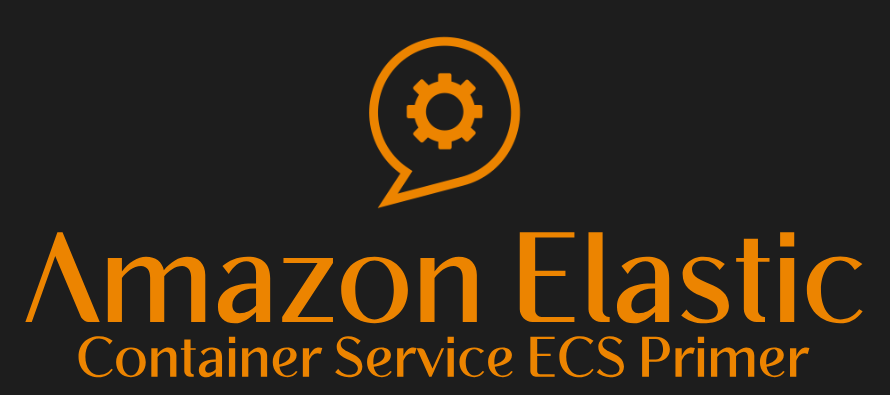
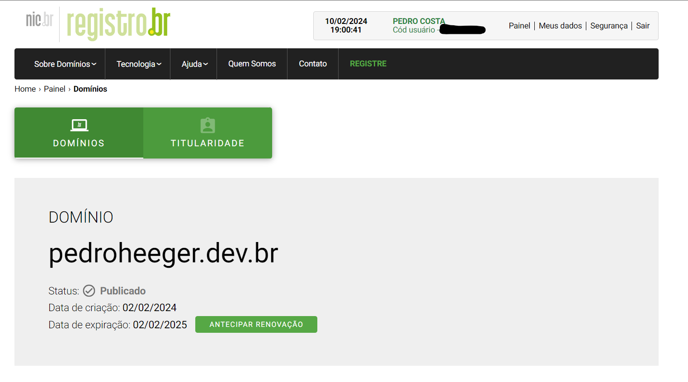
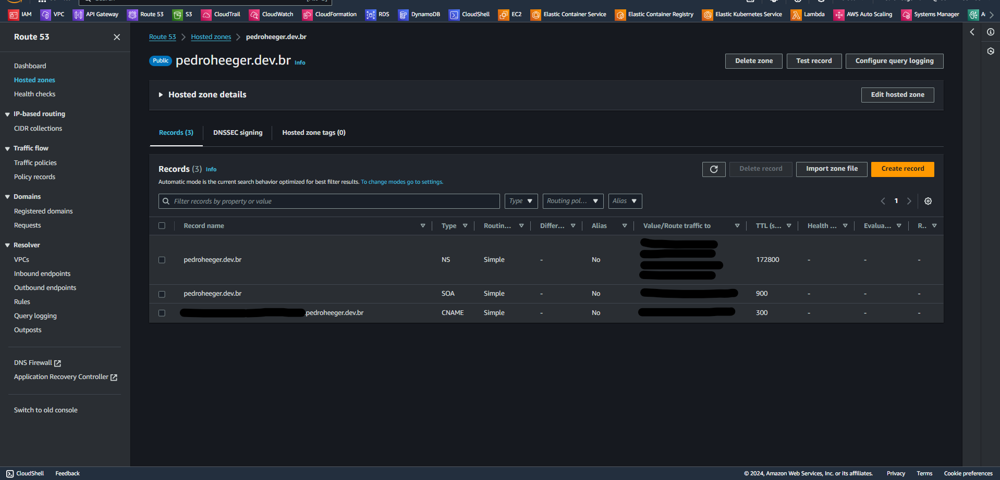
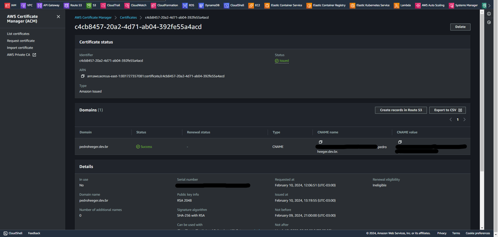

# Amazon Elastic Container Service (ECS) Primer   

### Repository: [course](../../../)   
### Platform: <a href="../../">aws_skill_builder   </a>
### Software/Subject: <a href="../">aws   </a>
### Course: <a href="./">curso_105 (Amazon Elastic Container Service (ECS) Primer)   </a>

#### <a href="https://github.com/PedroHeeger/main/blob/main/cert_ti/04-curso/cloud/aws/(23-12-17)%20Amazon...(ECS)%20Primer%20PH%20AWSSB.pdf">Certificate</a>

---

### Theme:
- Cloud Computing

### Used Tools:
- Operating System (OS): 
  - Windows 11   
- Cloud:
  - Amazon Web Services (AWS)   
- Cloud Services:
  - Amazon Elastic Compute Cloud (EC2)   
  - Amazon Elastic Container Service (ECS)   
  - AWS Fargate   
  - AWS Software Development Kit (SDK) - Boto3   
  - Google Drive   
- Containerization: 
  - Docker   
- Language:
  - HTML   
  - Markdown   
- Integrated Development Environment (IDE) and Text Editor:
  - Visual Studio Code (VS Code)   
- Versioning: 
  - Git   
- Repository:
  - Docker Hub   
  - GitHub   
- Command Line Interpreter (CLI):
  - AWS Command Line Interface (CLI)   
  - Windows PowerShell   

---

<a name="item0"><h3>Course Strcuture:</h3></a>
1. <a href="#item01">Amazon Elastic Container Service (ECS) Primer (Portuguese)</a> 

---

### Objective:
O objetivo desse curs vai além dos conceitos e benefícios básicos da conteinerização e ensina mais sobre o **Amazon Elastic Container Service (ECS)**. Nele é explicado sobre a implementação de contêineres na **AWS** usando o ECS e serviços complementares, como o **Amazon Elastic Container Registry (ECR)** e também sobre cenários comuns de microsserviços. Descreve a importância da programação para workloads baseadas em contêiner e os padrões de integração com workloads comuns baseadas em contêiner na AWS. O curso ainda explica sobre os componentes básicos que compõem o ECS, as diferenças entre os tipos de execução do **AWS Fargate** e do **Amazon Elastic Compute Cloud (EC2)**, como selecionar as estratégias apropriadas de posicionamento de tarefas e como aplicar segurança em tarefas do ECS.

### Structure:
A estrutura do curso é formada por:
- Este arquivo de README.md.
- A pasta [resources](./resources/) contendo os arquivos de scripts em **Python** para interação com a **AWS**.
- A pasta `0-aux`, pasta auxiliar com imagens utilizadas na construção desse arquivo de README.

<figure>
     
    <figcaption>Imagem 01.</figcaption>
</figure>
 

### Development:

<a name="item01"><h4>Amazon Elastic Container Service (ECS) Primer (Portuguese)</h4></a>[Back to summary](#item0)

No mundo digital, contêineres são uma forma de virtualização que acontece no nível do sistema operacional. Eles são semelhantes a maquinas virtuais, porém muito mais leves, apenas com o código da aplicação e as bibliotecas para executar esse código. Cada contêiner em execução é uma instância de uma imagem de contêiner, um objeto imutável que pode ser armazenado em registro público ou privado e personalizado conforme necessário. Contêineres estão firmemente associados a arquiteturas de microsserviços e os benefícios de alavancar ambas as tecnologias são enormes. Arquiteturas de microsserviços decompõem arquiteturas monolíticas tradicionais em componentes independentes que são executados como serviços e se comunicam usando APIs leves. Os ambientes de microsserviços possibilitem uma iteração mais rápida e aumentam a resiliência, a eficiência e a agilidade geral. 

A escalabilidade é um fator importante para considerar com microsserviços. A execução de um ou dois contêineres em um único host é simples. O que acontece ao mudar para um ambiente de preparação e teste em que há dezenas de hosts, possivelmente com centenas de contêineres? Imagine um ambiente de produção completo com centenas de hosts e talvez milhares de contêineres. Este é um ambiente clusterizado de escala empresarial, e o gerenciamento dos clusters é difícil. Para isso é preciso de um modo inteligente de posicionar contêineres em instâncias para maximizar a disponibilidade, a resiliência e a performance. Isso significa que é necessário conhecer o estado de tudo no sistema. Quais instâncias têm recursos disponíveis, como memória e portas? Como saber quando um contêiner tornou-se inoperante? Como conectar-se com load balancers? Como facilitar práticas de integração e entrega contínuas? Em outras palavras, como gerenciar contêineres em alta escala? 

É aqui que entram as plataformas de gerenciamento de contêineres. Elas lidam com a programação e o posicionamento de contêineres com base na infraestrutura de hardware subjacente e necessidades das aplicações. Elas fornecem integração com serviços como rede, armazenamento persistente, segurança, monitoramento e registro em log. Existem várias opções, como o **Amazon ECS**, ferramentas nativas, como o modo **Docker Swarm**, ou plataformas de código aberto, como o **Kubernetes**. A plataforma de gerenciamento é sem dúvida a escolha mais importante a ser feita ao arquitetar uma workload com base em contêiner.

O ECS é um serviço de orquestração de contêineres escalável e de alta performance que oferece suporte a contêineres **Docker**. O serviço permite executar e dimensionar aplicações em contêiner facilmente na **AWS**. É possível usar o ECS para programar o posicionamento de contêineres ao longo de um cluster gerenciado de instâncias do **Amazon EC2**. O ECS fornece seus próprios programadores, mas também pode se integrar a programadores de terceiros para atender a requisitos de negócios ou aplicações. O ECS também está estreitamente integrado a outros serviços da AWS, como o **AWS Identity and Access Management (IAM)**, o **Amazon CloudWatch** e o **Amazon Route 53**.

Em primeiro lugar, imagens de contêiner são extraídas de um registro. Essas imagens de contêiner podem ser do **Amazon Elastic Container Registry (ECR)**, que é um dos muitos serviços da AWS que se integram ao ECS. Ou podem ser extraídas de um registro privado ou de terceiros. Em seguida, a aplicação é definida, personalizando as imagens de contêiner com o código e os recursos necessários e depois criando os arquivos de configuração apropriados para agrupar e definir os contêineres como tarefas de curta execução ou serviços de longa execução no ECS. Na hora de colocar os serviços online, selecione um dos dois tipos de execução. O tipo de execução do **AWS Fargate** proporciona uma experiência quase sem servidor, em que a infraestrutura que oferece suporte aos contêineres é completamente gerenciada pela AWS como um serviço. A AWS gerencia o posicionamento das tarefas em instâncias e garante que cada tarefa tenha a quantidade apropriada de CPU e memória. Com o Fargate, o usuário pode se concentrar nas tarefas e na arquitetura da aplicação, em vez de se preocupar com a infraestrutura.

O tipo de execução do **Amazon Elastic Compute Cloud (EC2)** é útil quando é desejado ter mais controle sobre a infraestrutura que oferece suporte às tarefas. Ao usar o tipo de inicialização EC2, o usuário cria e gerencia clusters de instâncias EC2 para oferecer suporte a contêineres, definindo a colocação de contêineres no cluster com base em suas necessidades de recursos, políticas de isolamente e requisitos de disponibilidade. Dessa forma, há um controle mais granular sobre o ambiente, sem precisar operar os próprios sistemas de gerenciamento de clusters e gerenciamento de configuração ou se preocupar com a escalabilidade da infraestrutura de gerenciamento.

Também é possível misturar e combinar os tipos de execução conforme necessário na aplicação. Por exemplo, executar serviços com requisitos de recursos mais previsíveis usando o EC2 e executar outros serviços sujeitos a maiores oscilações de demanda usando o Fargate. Seja qual for a execução usada, o ECS gerencia a disponibilidade dos contêineres e pode escalar a aplicação para atender à demanda.

##### Componentes do ECS

*Tarefas (tasks)* são a unidade atômica de implantação no ECS e são compostas por um ou mais contêineres firmemente acoplados. Uma tarefa pode ser executada de maneira autônoma ou pode fazer parte de um serviço. Um *serviço (service)* é uma abstração sobre uma tarefa. Um serviço executa um número especificado de tarefas e pode incluir um load balancer para distribuir o tráfego entre as tarefas associadas ao serviço. Se alguma das tarefas falhar ou for interrompida, o programador de serviços iniciará outra instância dessa tarefa para substituí-la e manterá a contagem especificada de tarefas. 

Como é determinado se implantará tarefas ou serviços? Tarefas são gerenciadas pelo programador do ECS e são ideais em workloads sob demanda. Tarefas podem ser executadas uma vez ou em intervalos, são ótimas para trabalhos em lote, e pode ser utilizada a API Executar tarefa ou até um comando iniciar teste. Para aplicações de longa execução, convém usar o programador de serviços do ECS. Ele realiza automaticamente o gerenciamento da integridade, faz dimensionamentos por ampliação e redução, reconhece zonas de disponibilidade e permite grupos de contêineres.

Tarefas, sejam executadas de maneira autônoma ou como parte de um serviço, são definidas em uma definição de tarefa. A definição de tarefa (task definition) é um arquivo de texto no formato JSON, que descreve um ou mais contêineres que, juntos, formam uma aplicação. *Definições de tarefas* podem ser consideradas um esquema da aplicação. Elas definem o nome e a imagem usados para contêineres, requisitos de CPU e memória, repositórios de imagens de contêiner, portas de rede, armazenamento e outros metadados sobre os contêineres e a tarefa propriamente dita. Cada tarefa é uma instância de definição de tarefa, criada em tempo de execução e hospedada por um cluster do EC2 ou pelo AWS Fargate. O tipo de execução padrão é o EC2, então quando não é definido o tipo de execução, o EC2 que é o utilizado. Utilizando o Fargate como tipo de execução, não é necessário definir a memória e cpu para cada contêiner, apenas para tarefa em geral e o Fargate se responsabilizará por distribuir o poder computacional.

Com o tipo de execução do EC2, as tarefas são hospedadas por instâncias do EC2, sejam elas tarefas autônomas ou serviços de longa execução. As instâncias do EC2 são agrupadas em clusters, que são específicos de cada região, mas podem cobrir zonas de disponibilidade para maior resiliência. Cada instância do EC2 no cluster executa o Docker para oferecer suporte aos contêineres que compõem suas tarefas e também executa o agente do ECS. O agente do ECS é instalado automaticamente quando é utilizado uma AMI otimizada para ECS. O agente inicia e interrompe tarefas com base em solicitações provenientes do ECS e envia dados de telemetria sobre tarefas da instância e uso de recursos ao Backplane do Amazon ECS. O *Backplane* é o plano do controle singular para todo o ECS. Ele é bem escalado, robusto e tolerante a falhas. Uma instância do EC2 que executa o agente do ECS esteja registrada em um cluster é chamada de instância de contêiner do ECS. Ao executar tarefas com o Amazon ECS, as tarefas que usam o tipo de execução do EC2 são postas em instâncias de contêiner ativas. As estratégias certas de posicionamento são fundamentais para maximizar a eficiência e disponibilidade.

Ao usar o tipo de execução do Fargate, não é preciso gerenciar clusters de instâncias do EC2 ou o posicionamento de tarefas. O Fargate gerencia a infraestrutura como um serviço, permitindo que o usuário se concentre nas suas tarefas e serviços.

##### Estratégias de Posicionamento

Em um cenário com dez instâncias de contêiner, o usuário está fazendo uma solicitação para executar tarefas ou criar um serviço. Como parte dessa solicitação, ele define os requisitos de CPU, memória e rede, e também fornece outras restrições, como uma zona de disponibilidade, AMI ou um tipo de instância específico. Por fim, ele especifica a estratégia preferida para o ECS usar ao inicar as tarefas. Por exemplo, distribuição entre várias instâncias de contêiner para maximizar a disponibilidade ou consolidação em um número menor de instâncias para melhorar a utilização. No final desse processo, o ECS identifica um conjunto de instâncias que atende aos requisitos da tarefa que o usuário deseja executar e posiciona essas tarefas ao longo do seu cluster com base nos critérios especificados. 

Lembre-se de que cada tarefa é uma instância de uma definição de tarefa. A definição de tarefa especifica os recursos necessários, além das informações de posicionamento de tarefas, como estratégias de posicionamento e restrições de posicionamento. As estratégias de posicionamento têm como base o melhor esforço. O ECS tenta posicionar tarefas, mesmo quando a opção de posicionamento ideal está indisponível. Os tipos de estratégia de posicionamento aceitos são *Random*, que posiciona tarefas aleatoriamente entre instâncias de contêiner, *Binpack* posiciona tarefas com base na menor quantidade disponível de CPU ou memória, minimizando o número de instâncias em uso e aproveitando ao máximo a utilização de cada instância ou *Spread*, que posiciona as tarefas uniformemente com base em um valor especificado, como zona de disponibilidade.

As tarefas de serviço são distribuídas com base nas tarefas desse serviço. Restrições são vinculativas e podem impedir o posicionamento. Há suporte para `distinctInstance`, que posiciona cada tarefa em uma instância de contêiner diferente e `memberOf`, que posicia tarefas com base em uma expressão, como a associação a um grupo. A estratégia Binpack recebe seu nome do termo "problema de bin packing" (ou problema de empacotamento) no mundo físico, em que contêineres de diferentes tamanhos devem ser empacotados em compartimentos usando o menor número possível de compartimentos.

Serviços podem tirar proveito das mesmas estratégias e restrições de posicionamento e, ao mesmo tempo, manter o número desejado de tarefas. Serviços também podem usar a restrição de posicionamento `distinctInstance` para garantir aterrissagem em tipos de instâncias específicos, como instâncias aceleradas por GPU ou instâncias com requisitos específicos de CPU e memória.

##### Integração a outros serviços da AWS

Um dos pontos fortes da execução de workloads baseados em contêineres com o ECS é a estreita integração com outros serviços da AWS. No início do curso, foi mencionado brevemente o **Amazon Elastic Container Registry (ECR)**. Lembre-se de que, depois de construídas, as imagens são imutáveis. Ao executar um contêiner, o ECS extrai imagens de um registro de imagens público ou privado. O ECR é um registro de imagens do Docker totalmente gerenciado e baseado na nuvem que está totalmente integrado ao Amazon ECS e à CLI do Docker. O ECR é escalável, altamente disponível e seguro. As imagens são criptografadas em repouso, com controle de acesso e autorização baseados no IAM.

Use o **Amazon Simple Notification** e o **Amazon Simple Queue Services** para desacoplamento. Classic, Application e Network Load Balancers. **Amazon Route 53** para DNS e descoberta de serviços. **AWS Identity and Access Management (IAM)** para autenticação e autorização. Secrets Manager para gerenciar senhas criptografadas, credenciais, tokens e outros segredos. **Amazon API Gateway** para expor os serviços ao mundo exterior. Ferramentas de desenvolvedor da AWS, como o **AWS CodePipeline** para integração contínua e desenvolvimento contínuo. **Amazon CloudWatch** para monitoramento, registro em log e alertas.

Implantações azul/verde são usadas para implantar atualizações de software com menos riscos por meio da criação de dois ambientes separados: azul e verde. Azul é a versão em execução atual da aplicação, enquanto verde é a nova versão que será implantada. Esse tipo de implantação oferece a chance de testar recursos no ambiente verde sem afetar a versão atual em execução da aplicação. Quando estiver satisfeito com a versão verde, poderá redirecionar o tráfego do ambiente azul antigo ao novo ambiente verde. Seguindo este método, é possível atualizar e reverter recursos com tempo de inatividade quase nulo.

É possível configurar o ECS para usar o Auto Scaling de serviços para ajustar a contagem desejada para cima ou para baixo em resposta a alarmes do CloudWatch. O ECS publica métricas do CloudWatch com o uso médio de CPU e memória pelo serviço. Use essas métricas de utilização de serviço para dimensionar o serviço por ampliação para lidar com alta demanda em horários de pico e dimesioná-lo por redução a fim de diminuir os custos durante períodos de baixa utilização.

##### Segurança em tarefas do ECS

Cada tarefa pode ter sua própria função do IAM, fornecendo permissões granulares para acesso a serviços. Em um exemplo, a Tarefa A recebeu acesso aos dados em uma tabela do **Amazon DynamoDB**. Uma nova tarefa, a Tarefa B, precisa acessar dados em um bucket do **Amazon S3**. Para permitir isso, crie uma política no IAM que conceda permissão para recuperar objetos de um bucket específico do S3. Em seguida, crie uma função no IAM com essa política associada. A função do IAM criada é adicionada à definição de tarefa da Tarefa B, permitindo que qualquer instância dessa tarefa recupere objetos do bucket do S3. A Tarefa B não tem permissão para acessar dados no Amazon DynamoDB. Enquanto a Tarefa A não tem permissão para acessar o bucket do S3, a menos que seja associada a política apropriada à função atribuída à Tarefa A.

Tarefas também podem recuperar segredos do Repositório de parâmetros, que está integrado ao *Secrets Manager*. O Secrets Manager ajuda a organizar e gerenciar dados de configuração importantes, como credenciais, senha e chaves de licença. Usando o Repositório de parâmetros para referenciar segredos do Secrets Manager, é possível cria um processo consistente e seguro para chamar e usar segredos e fazer referência a dados no código e em script de configuração. O Repositório de parâmetros funciona como um serviço de passagem para referências a segredos do Secrets Manager. Dados ou metadados sobre segredos não são mantidos no repositório de parâmetros: a referência é stateless. O Secrets Manager criptografa o texto protegido de um segredo usnado o **AWS Key Management Service (KMS)**, um serviço de criptografia e armazenamento de chaves usado por muitos serviços da AWS. Isso ajuda a garantir que o segredo seja criptografado com segurança em repouso. É viável associar políticas do IAM a uma função que dá ou nega acesso a segredos específicos e restringir o que pode ser feito com esses segredos.

##### Prática

Como parte prática desse curso, foi criado o sub-diretório [resources](./resources/) com três arquivos de scripts em **Python** para criar uma role e uma policy, e anexar a policy criada a role desenvolvida. Essa role possuíu na sua política de confiança (*Trust Policy*), o usuário do IAM criado no curso [curso_099](../curso_099/). Esses arquivos em **Python** são divididos em dois scripts em cada arquivo, sendo um script para criação e outro para exclusão. Para interagir com as APIs da **AWS** foi utilizado o SDK **Boto3**. A ordem de execução dos arquivos foi [iamPolicy.py](./resources/iamPolicy.py) para criar a policy personalizada, [iamRole.py](./resources/iamRole.py) para criar a role e [iamRolePolicy.py](./resources/iamRolePolicy.py) para adicionar a policy criada à role. A ordem de remoção é inversa a de criação. Cada script de criação e exclusão nos arquivos conta com uma estrutura de condição para decidir se o usuário quer ou não executar o bloco de código. 

Tanto no arquivo da role como da policy, no script de criação, existem dois blocos de criação desses elementos, sendo um onde é passado o **JSON** direto no comando e outro onde é indicado um arquivo **JSON**. A primeira opção foi a executada, sendo a segunda opção comentada. Caso queira utilizá-la, é preciso comentar a primeira opção e descomentar a segunda, além de conferir a variável com o caminho correto para o arquivo **JSON** e verificar o próprio arquivo **JSON**.

Nas imagens 02 e 03 é exibido o output da execução dos scripts de criação dos três arquivos **Python**. Nas imagens 04, 05, 06 e 07 é evidenciado no console da **AWS** a policy e a role criada, além da anexação dessa policy a role e a política de confiança (*Trust Policy*), ou seja, a entidade que pode assumir essa role que no caso é o usuário do IAM criado no curso [curso_099](../curso_099/)

<figure>
     
    <figcaption>Imagem 02.</figcaption>
</figure>
 

<figure>
     
    <figcaption>Imagem 03.</figcaption>
</figure>
 

<figure>
     
    <figcaption>Imagem 04.</figcaption>
</figure>
 

<figure>
     
    <figcaption>Imagem 05.</figcaption>
</figure>
 

<figure>
     
    <figcaption>Imagem 06.</figcaption>
</figure>
 

<figure>
     
    <figcaption>Imagem 07.</figcaption>
</figure>
 

Por fim, as imagens 08 e 09 mostram a remoção desses recursos desenvolvidos.

<figure>
     
    <figcaption>Imagem 08.</figcaption>
</figure>
 

<figure>
     
    <figcaption>Imagem 09.</figcaption>
</figure>
 