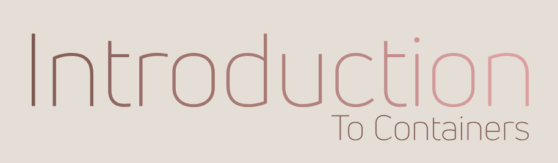
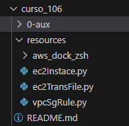
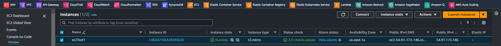
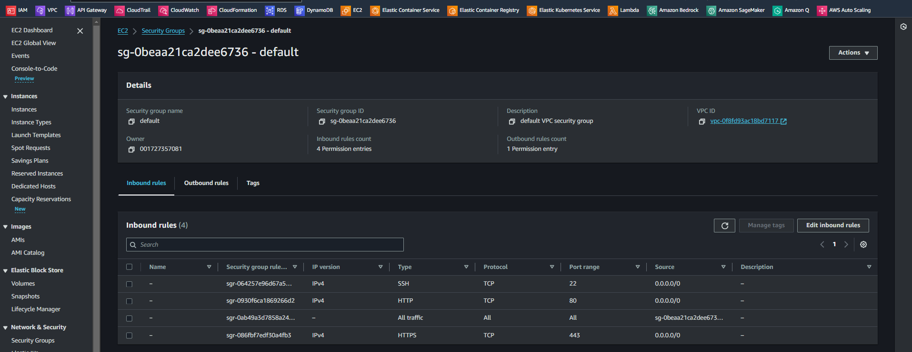
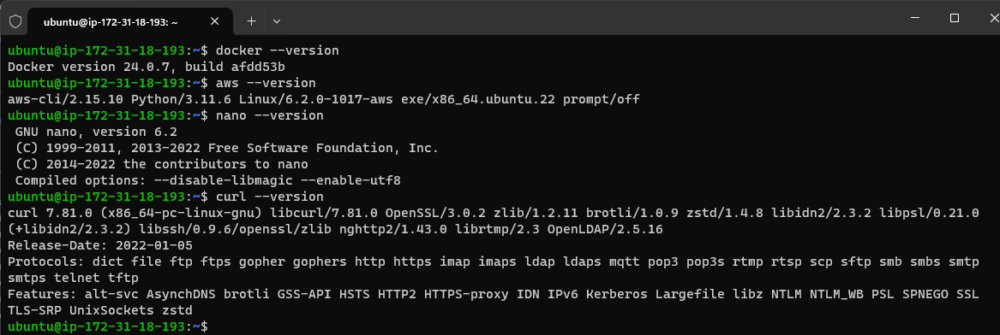
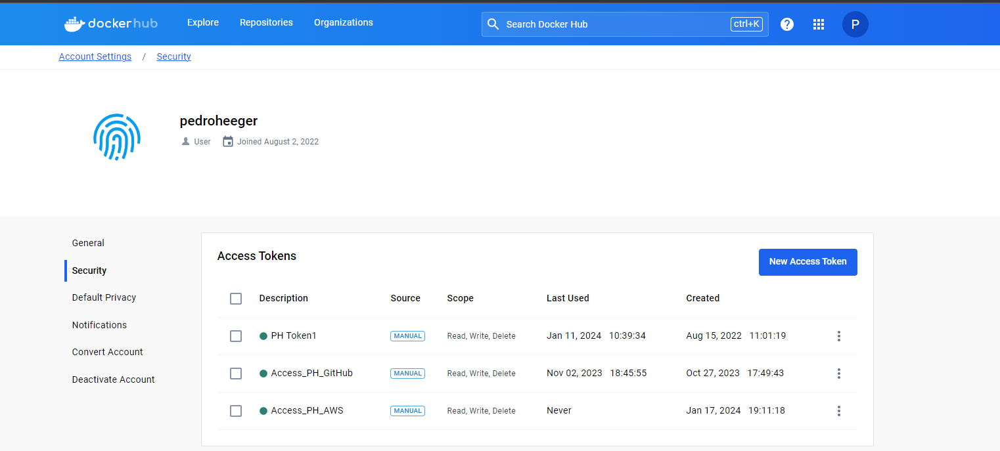

# Introduction to Containers   

### Repository: [course](../../../)   
### Platform: <a href="../../">aws_skill_builder   </a>
### Software/Subject: <a href="../">aws   </a>
### Course: <a href="./">curso_106 (Introduction to Containers)   </a>

#### <a href="https://github.com/PedroHeeger/main/blob/main/cert_ti/04-curso/cloud/aws/(23-12-31)_Introduction_to_Containers_PH_AWSSB.pdf">Certificate</a>

---

### Theme:
- Cloud Computing

### Used Tools:
- Operating System (OS): 
  - Linux   
  - Windows 11   
- Linux Distribution:
  - Ubuntu   
- Cloud:
  - Amazon Web Services (AWS)   
- Cloud Services:
  - Amazon Elastic Compute Cloud (EC2)   
  - AWS Software Development Kit (SDK) - Boto3   
  - Google Drive   
- Containerization: 
  - Docker   
- Language:
  - HTML   
  - Markdown   
  - Python   
- Integrated Development Environment (IDE) and Text Editor:
  - Visual Studio Code (VS Code)   
- Versioning: 
  - Git   
- Repository:
  - Docker Hub   
  - GitHub   
- Command Line Interpreter (CLI):
  - AWS Command Line Interface (CLI)   
  - Windows PowerShell   
- Network:
  - OpenSSH   

---

<a name="item0"><h3>Course Strcuture:</h3></a>
1. <a href="#item01">Introduction to Containers (Portuguese)</a> 
  1.1 <a href="#item01.01">O que é contêineres?</a> 
  1.2 <a href="#item01.02">Qual é a diferença entre os contêineres e outras formas de virtualização?</a> 
  1.3 <a href="#item01.03">Quais são as vantagens de um ambiente de microsserviços?</a> 
  1.4 <a href="#item01.04">Prática</a> 

---

### Objective:
O objetivo desse curso é introduzir sobre o assunto contêineres, explicando um pouco da sua história, os conceitos que envolvem a conteinerização, a diferença dos contêineres de outras formas de virtualização, a importância dos contêineres em arquiteturas de microsserviços e como reconhecer os determinantes atuais para usar workloads baseadas em contêiner.

### Structure:
A estrutura do curso é formada por:
- Este arquivo de README.md.
- A pasta [resources](./resources/) contendo os arquivos de scripts em **Python** para interação com a **AWS**.
- A pasta `0-aux`, pasta auxiliar com imagens utilizadas na construção desse arquivo de README.

<figure>
     
    <figcaption>Imagem 01.</figcaption>
</figure>
 

### Development:

<a name="item01"><h4>Introduction to Containers (Portuguese)</h4></a>[Back to summary](#item0)

<a name="item01.01"><h4>O que é contêineres?</h4></a>[Back to summary](#item0)

No mundo físico, um contêiner é uma unidade padronizada de armazenamento. Isso parece um termo genérico, mas é importante compreender o enorme impacto que o contêiner exerceu no setor de remessa. Não muito tempo atrás, era um desafio enviar objetos físicos do ponto A ao ponto B. Os objetos podiam ter formatos peculiares, alguns eram seguros, outros não. Muitas vezes, era necessário carregá-los manualmente até a embarcação que fazia o transporte. Não se sabia quanta carga a embarcação transportaria até que tudo fosse carregado. O transporte de objetos era lento, ineficiente e caro.

A padronização de contêineres começou no século 18 e continuou pelos próximos 200 anos até que 1958, Malcom McLean e Keith Tantlinger patentearam o contêiner de remessa internacional atual. Os contêineres padronizados facilitaram o manuseio da carga no navio. Eles também ofereceram uma unidade consistente e previsível de armazenamento que pode ser facilmente transferida para transporte por caminhão ou trem. Se pensar nos contêineres, e não nas cargas individuais, constatará uma melhoria na eficiência, um aumento na produtividade e uma redução nos custos para os consumidores. Este é um ótimo exemplo de uso de abstração para aumentar a agilidade.

No mundo virtual, nas plataformas de computação, um contêiner é uma unidade padronizada de software desenvolvida para execução rápida e confiável em qualquer ambiente de computação que exerce a plataforma de conteinerização. Os contêineres são uma forma de virtualização que implementa no nível do sistema operacional. Os contêineres são pacotes leves e autônomos que incluem tudo o que é necessário para executar uma aplicação, como código, ambiente de execução, ferramentas do sistema, bibliotecas do sistema e configurações.

Um único servidor pode hospedar vários contêineres que compartilham o kernel do sistema host subjacente. Esses contêineres podem ser serviços que fazem parte de uma aplicação empresarial maior ou podem ser aplicações separadas executadas no ambiente isolado delas.

<a name="item01.02"><h4>Qual é a diferença entre os contêineres e outras formas de virtualização?</h4></a>[Back to summary](#item0)

Geralmente, a maturidade técnica está associada a níveis elevados de abstração. Com os servidores bare-metal, as camadas de arquitetura, como as camadas de infraestrutura e de software de aplicação, são criadas. Por exemplo: instala-se um sistema operacional no hardware do servidor, instala todas as bibliotecas compartilhadas nesse sistema operacional e, em seguida, instala as aplicações que usam essas bibliotecas. É assim que as coisas têm funcionado há muito tempo. O problema com essa arquitetura é que ela é ineficiente. Os custos de hardware são os mesmos, independentemente de executar com 0% de utilização ou 100% de utilização. Todas as aplicações disputam os mesmos recursos, e é preciso manter as versões das bibliotecas sincronizadas com todas as aplicações. Se uma aplicação exigir uma versão atualizada de uma biblioteca que seja incompatível com as outras aplicações em execução nesse host, haverá problemas.

É possível implementar uma plataforma de virtualização no sistema operacional para aumentar a agilidade. Agora, foi isolado as aplicações e suas bibliotecas com seu próprio sistema operacional completo em uma maquina virtual. Isso melhora a utilização, pois pode ser adicionada várias VMs para execução no hardware existente, o que reduz significativamente o tamanho da infraestrutura. A desvantagem das VMs é que a camada de virtualização é pesada. Neste exemplo, agora existe quatro sistemas operacionais no host físico, em vez de um. Isso significa mais aplicações de patches, mais atualizações e muito mais espaço ocupado no host físico. Também há uma redundância significativa, possivelmente, foi instalado o mesmo SO quatro vezes e a mesma biblioteca três vezes. Existe uma opção melhor: inserir contêineres.

O ambiente de execução do contêiner compartilha o kernel dos sistemas operacionais, o que permite criar imagens de contêiner usando camadas do sistema de arquivos. Os contêineres são leves, eficientes e rápidos. Eles podem ser ativados e desativados mais rapidamente do que as maquinas virtuais, o que melhora a utilização do hardware subjacente. É possível compartilhar as bibliotecas quando necessário, mas também pode ter isolamento de bibliotecas para as aplicações. Os contêineres também são altamente portáteis. Como os contêineres isolam o software das outras camadas, o código deles é executado de forma idêntica em ambiente diferentes, desde o desenvolvimento e staging até a produção.

A conteinerização não é uma ideia recente. A virtualização no nível do sistema operacional é uma ideia bem consolidade: das Zonas do Solaris em 2004, dos FreeBSD jails em 2000 até o conceito de "alteração de raiz (Chroot)" do Unix no início de 1982. Então, por que os contêineres são tão populares agora? Uma das razões é o surgimento do **Docker** como uma plataforma de virtualização. O **Docker** foi lançado em março de 2013. Trata-se de uma plataforma de virtualização de contêineres leve que oferece ferramentas para criar, armazenar, gerenciar e executar contêineres, e é fácil de integrar a pipelines automatizados de compilação, teste e implantação.

Para resumir alguns dos benefícios mais importantes do **Docker**: O **Docker** é um ambiente de aplicação portátil, onde é possível empacotar uma aplicação e suas dependências em um único objeto imutável chamado de imagem. Depois de criar uma imagem de contêiner, é possível usá-la em qualquer ambiente que seja compatível com o **Docker**. Com ele, pode ser executado versões diferentes da aplicação com dependências e bibliotecas distintas simultaneamente. Isso acelera muito mais os ciclos de desenvolvimento e de implantação, além de melhorar a utilização e a eficiência de recursos. Essas são muitas das habilidades que os desenvolvedores desejam, e tudo acaba girando em torno da agilidade.

Grande parte do trabalho que envolve os contêineres vem deste conceito de imagem de contêiner. Uma *imagem* é um modelo somente leitura com instruções para criar um contêiner. Um contêiner é uma instância de uma imagem. Podem ser criadas imagens do zero ou usar imagens que outras pessoas criaram e publicaram em um registro público ou privado. Geralmente, uma imagem é baseada em outra, com alguma personalização. Por exemplo, pode-se criar uma imagem baseada na imagem do **Ubuntu Linux** no registro. No entanto, ela instala um servidor Web e sua aplicação, além dos detalhes de configuração essenciais para executar a aplicação.

Para compilar sua própria imagem, crie um *Dockerfile* usando uma sintaxe simples para definir como criar e executar a imagem. Cada instrução em um Dockefile cria uma camada somente leitura na imagem. Por as camadas da imagem serem somente leitura, tornam a imagem de contêiner um objeto imutável. Se for alterado o Dockerfile e recompilar a imagem, somente as camadas que foram alteradas serão recompiladas. É por isso que as imagens de contêiner são tão leves, pequenas e rápidas, em comparação com outras tecnologias de virtualização. Como uma imagem de contêiner é um modelo somente leitura e imutável altamente portátil, ela pode ser transportada para qualquer ambiente compatível com o **Docker** e pode ser armazenado em um registro para facilitar a reutilização.

Um contêiner é uma instância de uma imagem, no qual podem ser criados um ou vários contêineres com base nessa imagem. Cada contêiner tem uma camada fina de leitura/escrita sobre a parte superior da imagem existente quando ele é instanciado. É isso que de fato acelera a criação de contêineres. A maior parte do trabalho real é somente leitura por causa das camadas do sistema de arquivos. O **Docker** usa um sistema de *copy-on-write*, onde os arquivos alterados são escritos na camada de leitura/escrita do contêiner. A imagem subjacente permanece inalterada. É por isso que vários contêineres podem compartilhar o acesso à mesma imagem subjacente, mas ainda têm seu próprio estado de dados. Quando o contêiner é excluído, essa camada gravável também é excluída.

A camada de leitura/escrita do contêiner permite que os aplicativos funcionem corretamente durante a execução, mas não foi projetada para armazenamento de dados de longo prazo. Os dados persistentes devem ser armazenados em algum volume. Considere um contêiner como uma unidade de computação distinta, não uma unidade de armazenamento.
 
<a name="item01.03"><h4>Quais são as vantagens de um ambiente de microsserviços?</h4></a>[Back to summary](#item0)

Um dos fatores determinantes do crescimento dos contêineres é o aumento das arquiteturas de microsserviços. Os microsserviços são uma abordagem arquitetônica e organizacional de desenvolvimento de software projetada para acelerar os ciclos de implantação. A abordagem promove a inovação, além de aprimorar a capacidade de manuteção e o escalonamento das aplicações de software.

Considere o exemplo de uma arquitetura tradicional. Todos os processos para uma das aplicações são totalmente acoplados e executados como um único serviço. Isso significa que, se um processo de aplicação apresentar um pico de demanda, toda a arquitetura deverá ser escalonada. Adicionar ou melhorar elementos da aplicação torna-se mais complexo à medida que a base de código cresce, o que limita a experimentação e dificulta a implementação de novas ideias. As arquiteturas monolíticas também aumentam o risco à disponibilidade das aplicações, porque muitos processos dependentes e altamente acoplados aumentam o impacto de uma única falha de processo e é possível ver onde há redundância de função nas diferentes aplicações.

Agora, considere as três mesmas aplicações executadas em uma arquitetura de microsserviços. Cada aplicação é criada como um componente independente, que é executado como um serviço e se comunica por meio de operações de API leves. Cada serviço executa uma única função que pode sustentar várias aplicações. Como são executados de modo independente, os serviços podem ser atualizados, implantados e escalonados conforme à demanda de funções específicas de uma aplicação.

Também é visualizado uma migração longe de servidores dedicados para uma camada de hardware abstraída, em que os microsserviços podem ser implementados de forma inteligente de acordo com as necessidades como performance e resiliência. Toda essa decomposição permite iteração muito mais rápida, automação e agilidade geral. É possível experimentar, falhar e recuperar com muito mais rapidez.

Ao considerar as características de uma arquitetura de microsserviços bem projetada, é possível ver o por que os contêineres e os microsserviços funcionam muito bem juntos.
 - Um design descentralizado e evolucionário: cada contêiner usa a linguagem e a tecnologia mais adequada para o funcionamento do serviço em vez de exigir que os usuários usem uma linguagem ou tecnologia específica; cada componente ou sistema na arquitetura é desenvolvido separadamente, em vez de atualizar o sistema em um estilo monolítico.
 - Endpoints inteligentes e pipes simples: não há barramento de serviço empresarial; os dados não são transformados quando estão entre serviços; o serviço que recebe os dados deve ser inteligente o suficiente para processar tudo o que é enviado.
 - Produtos indepentes, não projetos: Ao contrário do modelo de projeto tradicional em cascata, considere o microsserviço como um projeto separado com as próprias entradas e saídas. Nenhuma suposição é feita sobre o ambiente de execução. Os contêineres ajudam com isso, permitindo que seja empacotada todas as suas dependências e bibliotecas em um único objeto imutável.
 - Design à prova de falhas: Falhas acontecem o tempo todo. Os serviços foram projetados para ser resilientes e redundantes, para processar entradas inválidas ou para lidar com casos em que o serviço com o qual o microsserviço deseja se comunicar não existe.
 - Descatável: Se algo der errado, simplesmente é encerrada a instância com falha e ativada uma nova. É possível experimentar e falhar rápido e libertar de qualquer manipulador de arquivos. O padrão de desenvolvimento é como de um disjuntor. Nas arquiteturas tradicionais, os servidores são nomeados, implantados, avaliados e permanecem muito estáveis. Por outro lado, a arquitetura de nuvem é descartável e transitória. Os contêineres são adicionados e removidos, as workloads mudam e os recursos são temporários porque mudam constantemente.
 - Paridade de desenvolvimento e produção: Os ambientes de desenvolvimento, teste e produção podem ser consistentes por meio dos contêineres. Isso facilita as práticas do DevOps: uma aplicação em contêiner que funciona no sistema de um desenvolvedor funcionará da mesma forma em um sistema de produção.

Para resumir, os microsserviços e os contêineres funcionam bem juntos. Os contêineres são a tecnologia subjacente que possibilita a criação dos microsserviços modernos e, com as arquiteturas de microsserviços, os desenvolvedores podem aproveitar os contêineres ao máximo.

<a name="item01.04"><h4>Prática</h4></a>[Back to summary](#item0)

Como parte prática desse curso, foi instanciada uma maquina no serviço **Amazon Elastic Compute Cloud (EC2)** onde já veio pré-instalados alguns softwares básicos (**Nano**, **Vim**, **Curl**, **Wget**, **Unzip** e **Zip**), a command line interface (CLI) da **AWS** (**AWS CLI**) e o **Docker**. Essa maquina foi construída através do arquivo [ec2Instance.py](./resources/ec2Instace.py) em linguagem **Python** com SDK **Boto3** para interagir com as APIs dos serviços da **AWS**. A instância utilizou como security group o padrão da VPC padrão da região que foi `us-east-1`. Foi necessário criar algumas regras no security group, liberando algumas portas como a porta `22` para realização de acesso remoto com o software **OpenSSH**, portas `80` e `443` para tráfegos do protoclo `HTTP` e `HTTPS`. A imagem 02 a seguir mostra a instância criada, enquanto a imagem 03 exibe as regras elaboradas no grupo de segurança.

<figure>
     
    <figcaption>Imagem 02.</figcaption>
</figure>
 

<figure>
     
    <figcaption>Imagem 03.</figcaption>
</figure>
 

Dando sequência foi realizado o acesso remoto na instância pela maquina física **Windows** com o software **OpenSSH**. Para execução do acesso remoto, a instância teve que ser criada com um par de chaves vinculado a ela. O par de chaves utilizado foi o `keyPairUniversal` que é um par de chaves universal que uso nos meus projetos. O par de chaves foi armazenado no arquivo `keyPairUniversal.pem`. Um arquivo *Privacy Enhanced Mail (PEM)* é um formato de arquivo que pode conter diferentes tipos de dados codificados em Base64 para representar os dados binários de forma segura e eficiente em formato de texto ASCII. Inicialmente, foi desenvolvido para armazenar mensagens de e-mail de forma segura, mas agora é amplamente utilizado para armazenar certificados X.509 e chaves privadas. Esses certificados e chaves são comumente usados em sistemas que implementam SSL/TLS para garantir a segurança na comunicação pela internet. Toda vez que fosse realizado um acesso remoto tinha que informar o arquivo de chave privada. Com o comando `ssh -i "G:\Meu Drive\4_PROJ\scripts\scripts_model\.default\secrets\awsKeyPair\keyPairUniversal.pem" ubuntu@54.91.173.146` foi realizado o acesso remoto a instância. Caso queira saber mais sobre acesso remoto em instâncias EC2 da **AWS**, consulte o [curso_092](../curso_092/).

Após acesso, conforme imagem 04, foi possível visualizar os softwares instalados. Por enquanto, nem o **Docker** e nem o **AWS CLI** estavam configurados com nenhuma conta de usuário. A conta configurada no **Docker** foi para acesso ao repositório do **Docker**, o **Docker Hub**, para conseguir enviar as imagens criadas. Portanto, para isso, foi necessário ter uma conta no **Docker Hub** e então fazer o login do **Docker** da instância no repositório pelo terminal. O comando utilizado para o login foi o `docker login` que ao executá-lo, pediu o `Username` que podia ser o `Docker ID` ou endereço de e-mail e em seguida a senha, que poderia ser também um token de acesso pessoal (PAT). O uso de um *Personal Access Token (PAT)* garante melhor segurança, pois ele pode e deve ser configurado no **Docker Hub** através do navegador da web, determinando permissões específicas de leitura, escrita e exclusão. Neste caso, foi criado o PAT `Access_PH_AWS` para ser utilizado dentro da **AWS** e concedida todas as permissões (read, write e delete), conforme mostrado na imagem 05. Com o email e o PAT foi realizado o login no **Docker Hub** pelo **Docker** da instância EC2. Assim que o login foi bem sucedido, foi gerado o arquivo `config.json` dentro da pasta `.docker` também criada dentro do diretório do usuário `/home/ubuntu`. Este arquivo continha todas contas que o **Docker** da instância estava autorizado a acessar, que por enquanto só era o da minha conta do **Docker Hub**, mas outras contas tanto do **Docker Hub** como de outros repositórios poderiam ser adicionadas. 

<figure>
     
    <figcaption>Imagem 04.</figcaption>
</figure>
 

<figure>
     
    <figcaption>Imagem 05.</figcaption>
</figure>
 

Uma outra forma de autenticação, seria transferir este a pasta `.docker` com o arquivo `config.json` com a autorização já cadastrada na maquina física direto para instância, assim não seria necessário executar o comando `docker login`. O arquivo [ec2TransFile.py](./resources/ec2TransFile.py) faz justamente isso, ele transfere tanto a pasta `.docker`, como também a pasta `.aws`, no qual a primeira é configurada no **Docker** da instância o acesso a minha conta no **Docker Hub**, enquanto a segunda a configuração do **AWS CLI** da instância no usuário do IAM worker da minha conta da **AWS** (`PedroHeegerWorker`). Ambas as pastas são enviadas pelo software **OpenSSH** da maquina física **Windows** a instância, sempre verificando se aquela pasta já existe no diretório padrão do usuário na instância (`/home/ubuntu`).

Com o **Docker** instalado e acessando remotamente a instância, qualquer comando podia ser executado. Assim, seria possível desenvolver aplicações containerizadas. Mas como este não é o foco da parte prática deste curso, nenhuma aplicação foi desenvolvida. Para ilustrar apenas a execução de um container foi utilizado o comando `docker container run --name app -d -p 80:8080 nginx` para criar um container do servidor web **Nginx** a partir de uma imagem baixada do **Docker Hub**. Um mapeamento de porta foi feito para a porta `80` do host, ou seja, da instância. Logo uma regra de entrada liberando a porta `80` do grupo de segurança padrão que era o grupo utilizado por essa instância teve que ser criado com o arquivo [vpcSgRule.py](./resources/vpcSgRule.py). Assim, o servidor web **Nginx** pode ser acessado pelo navegador da maquina física **Windows**, conforme mostrado na imagem 06 abaixo.

<figure>
     
    <figcaption>Imagem 06.</figcaption>
</figure>
 

docker run -d -p 3306:3306 -e MYSQL_ROOT_PASSWORD=xpto1234 --name banco --mount source=banco_vol,destination=/var/lib/mysql mysql
