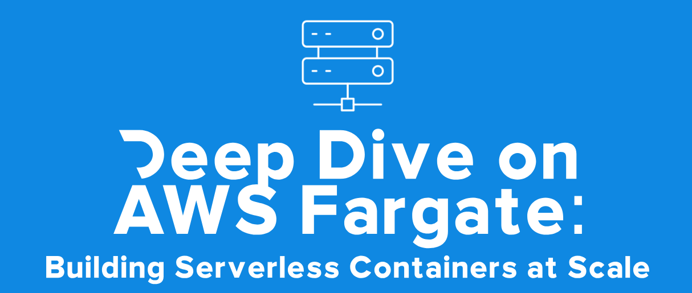

# Deep Dive on AWS Fargate: Building Serverless Containers at Scale (Portuguese)   

### Repository: [course](../../../)   
### Platform: <a href="../../">aws_skill_builder   </a>
### Software/Subject: <a href="../">aws   </a>
### Course: <a href="./">curso_107 (Deep Dive on AWS Fargate: Building Serverless Containers at Scale (Portuguese))   </a>

#### <a href="https://github.com/PedroHeeger/main/blob/main/cert_ti/04-curso/cloud/aws/(23-12-17)_Amazon...(ECS)_Primer_PH_AWSSB.pdf">Certificate</a>

---

### Theme:
- Cloud Computing

### Used Tools:
- Operating System (OS): 
  - Windows 11   
- Cloud:
  - Amazon Web Services (AWS)   
- Cloud Services:
  - Amazon Elastic Compute Cloud (EC2)   
  - Amazon Elastic Container Service (ECS)   
  - AWS Software Development Kit (SDK) - Boto3   
  - Google Drive   
- Containerization: 
  - Docker   
- Language:
  - HTML   
  - Markdown   
  - Python   
- Integrated Development Environment (IDE) and Text Editor:
  - Visual Studio Code (VS Code)   
- Versioning: 
  - Git   
- Repository:
  - Docker Hub   
  - GitHub   
- Command Line Interpreter (CLI):
  - AWS Command Line Interface (CLI)   
  - Windows PowerShell   

---

<a name="item0"><h3>Course Strcuture:</h3></a>
1. <a href="#item01">Deep Dive on AWS Fargate: Building Serverless Containers at Scale (Portuguese)</a> 
  1.1 <a href="#item01.01">Prática</a> 

---

### Objective:
O objetivo desse curso vai além dos conceitos e benefícios básicos da conteinerização e ensina mais sobre o **Amazon Elastic Container Service (ECS)**. Nele é explicado sobre a implementação de contêineres na **AWS** usando o ECS e serviços complementares, como o **Amazon Elastic Container Registry (ECR)** e também sobre cenários comuns de microsserviços. Descreve a importância da programação para workloads baseadas em contêiner e os padrões de integração com workloads comuns baseadas em contêiner na AWS. O curso ainda explica sobre os componentes básicos que compõem o ECS, as diferenças entre os tipos de execução do **AWS Fargate** e do **Amazon Elastic Compute Cloud (EC2)**, como selecionar as estratégias apropriadas de posicionamento de tarefas e como aplicar segurança em tarefas do ECS.

### Structure:
A estrutura do curso é formada por:
- Este arquivo de README.md.
- A pasta [resources](./resources/) contendo os arquivos de scripts em **Python** para interação com a **AWS**.
- A pasta `0-aux`, pasta auxiliar com imagens utilizadas na construção desse arquivo de README.

<figure>
     
    <figcaption>Imagem 01.</figcaption>
</figure>
 

### Development:

<a name="item01"><h4>Deep Dive on AWS Fargate: Building Serverless Containers at Scale (Portuguese)</h4></a>[Back to summary](#item0)

<a name="item01.01"><h4>Prática</h4></a>[Back to summary](#item0)

<figure>
     
    <figcaption>Imagem 02.</figcaption>
</figure>
 

<figure>
     
    <figcaption>Imagem 03.</figcaption>
</figure>
 

<figure>
     
    <figcaption>Imagem 04.</figcaption>
</figure>
 

<figure>
     
    <figcaption>Imagem 05.</figcaption>
</figure>
 

<figure>
     
    <figcaption>Imagem 06.</figcaption>
</figure>
 

<figure>
     
    <figcaption>Imagem 07.</figcaption>
</figure>
 

Por fim, as imagens 08 e 09 mostram a remoção desses recursos desenvolvidos.

<figure>
     
    <figcaption>Imagem 08.</figcaption>
</figure>
 

<figure>
     
    <figcaption>Imagem 09.</figcaption>
</figure>
 