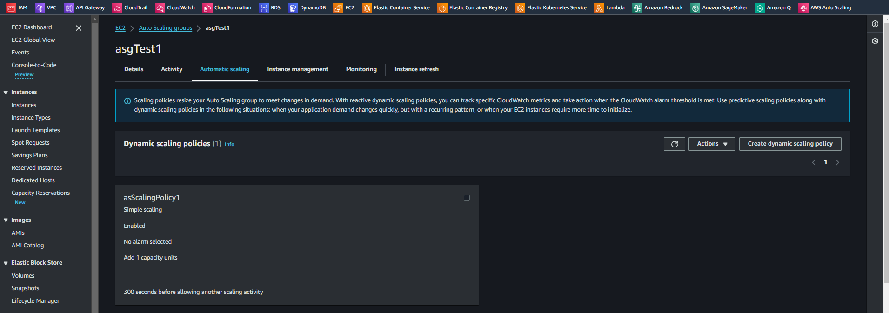
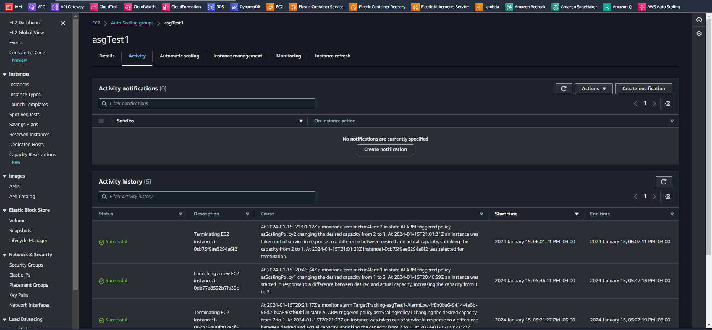

# Introduction to AWS Auto Scaling   

### Repository: [course](../../../)   
### Platform: <a href="../../">aws_skill_builder   </a>
### Software/Subject: <a href="../">aws   </a>
### Course: <a href="./">curso_109 (Introduction to AWS Auto Scaling)   </a>

#### <a href="https://github.com/PedroHeeger/main/blob/main/cert_ti/04-curso/cloud/aws/(24-01-11)_Introduction_to_AWS_Auto_Scaling_PH_AWSSB.pdf">Certificate</a>

---

### Theme:
- Cloud Computing

### Used Tools:
- Operating System (OS): 
  - Linux   
  - Windows 11   
- Linux Distribution:
  - Ubuntu   
- Cloud:
  - Amazon Web Services (AWS)   
- Cloud Services:
  - Amazon Application Load Balancer (ALB)   
  - Amazon Classic Load Balancer (CLB)   
  - Amazon CloudWatch   
  - Amazon EC2 Auto Scaling   
  - Amazon Elastic Compute Cloud (EC2)   
  - Amazon Elastic Load Balancing (ELB)   
  - AWS Auto Scaling   
  - AWS Software Development Kit (SDK) - Boto3   
  - Google Drive   
- Containerization: 
  - Docker   
- Language:
  - HTML   
  - Markdown   
  - Python   
- Integrated Development Environment (IDE) and Text Editor:
  - Visual Studio Code (VS Code)   
- Versioning: 
  - Git   
- Repository:
  - GitHub   
- Command Line Interpreter (CLI):
  - AWS Command Line Interface (CLI)   
  - Bash e Sh   
  - Windows PowerShell   
- Network:
  - OpenSSH   

---

<a name="item0"><h3>Course Strcuture:</h3></a>
1. <a href="#item01">Introduction to AWS Auto Scaling (Portuguese)</a> 
  1.1 <a href="#item01.01">Prática 1: Amazon EC2 Auto Scaling - Parte 1</a> 
  1.2 <a href="#item01.02">Prática 2: Amazon EC2 Auto Scaling - Parte 2</a> 

---

### Objective:
O objetivo deste curso foi apresentar o serviço **AWS Auto Scaling**, mostrando seus principais benefícios e funcionalidades. Também foi explicado sobre os recursos que compõem o **AWS Auto Scaling**, além do serviço de auto scaling do **Amazon Elastic Compute Cloud (EC2)** que é o **Amazon EC2 Auto Scaling**.

### Structure:
A estrutura do curso é formada por:
- Este arquivo de README.md.
- A pasta [resources](./resources/) contendo os arquivos de scripts em **Python** para interação com a **AWS**.
- A pasta `0-aux`, pasta auxiliar com imagens utilizadas na construção desse arquivo de README.

<figure>
     
    <figcaption>Imagem 01.</figcaption>
</figure>
 

### Development:

<a name="item01"><h4>Introduction to AWS Auto Scaling (Portuguese)</h4></a>[Back to summary](#item0)

Em uma infraestrutura mal projetada, a escalabilidade para alta disponibilidade deve ser feita de forma reativa e manual. Por exemplo, em um cenário em que se tem usuários acessando servidores de aplicações durante um determinado período. Os servidores de aplicações atingem sua capacidade total e, com espaço normal, os usuários estão sendo impedidos de acessar a aplicação. O administrador descobre que os servidores estão em sua capacidade total e prepara-se para iniciar uma nova instância para lidar com a carga. Infelizmente, esse processo manual não é escalável e sustentável. Além disso, a capacidade total pode ser alcançada mais uma vez pouco depois de iniciar todo o ciclo mais uma vez. Para enfrentar esse desafio, a **AWS** oferece uma solução de escalabilidade automática para Amazon EC2, EC2 Spot Fleet, ECS, DynamoDB, Aurora, EMR e AppStream 2.0.

Para escalar automaticamente as instâncias do Amazon EC2, por exemplo, a primeira etapa é criar um grupo de Auto Scaling, que é uma coleção de instâncias do EC2 que compartilham características semelhantes. O grupo de Auto Scaling permite que seja aproveitado os recursos de gerenciamento de frota para substituir automaticamente instâncias não íntegras e equilibrar as instâncias em diferentes zonas de disponibilidade imediatamente. Em seguida, pode ser criada e configurada a escalabilidade agendada para aumentar ou diminuir a capacidade em horários predefinidos, ou criada políticas de escalabilidade dinâmica que aumentem ou diminuam automaticamente a capacidade em resposta a mudanças na demanda. O Auto Scaling para outros serviços compatíveis funciona da mesma maneira.

Em um exemplo, tem-se uma infraestrutura com políticas de escalabilidade dinâmica no EC2, ECS, DynamoDB e Aurora. Implantar e gerenciar todas essas políticas separadamente em cada serviço pode ser demorado e tem o potencial de introduzir inconsistências nas políticas. Isso também significa duplicação de esforço se tiver que fazer alterações semelhantes em vários serviços. Para simplificar e aprimorar a experiênciade escalabilidade dinâmica na nuvem **AWS**, pode ser utilizado o **AWS Auto Scaling**. O **AWS Auto Scaling** permite configurar políticas de escalabilidade automática para vários recursos de escalabilidade usados pela aplicação a partir de uma interface unificada, onde é apenas fornecido o **AWS Auto Scaling** com a aplicação e, em seguida, criado um plano de escalabilidade para todas as aplicações em apenas algumas etapas.

O **AWS Auto Scaling** funciona com grupos de Auto Scaling do EC2, frotas spot do EC2, serviços do ECS, tabelas do DynamoDB e índices secundários globais e clusters de banco de dados do Aurora. O **AWS Auto Scaling** usa os serviços do **Amazon EC2 Auto Scaling** e **Application Auto Scaling** atualmente disponíveis para configurar planos de escalabilidade que contêm métricas e limites para aumentar e diminuir os recursos a partir de um único console. Então, é selecionada uma aplicação no **AWS Auto Scaling** conforme definido por uma pilha do **AWS CloudFormation** ou em um ambiente do **AWS Elastic Beanstalk**. Para configurar o **AWS Auto Scaling**, primeiro é preciso selecionar a pilha do **AWS CloudFormation** usada para a aplicação. O **AWS Auto Scaling** verifica a pilha selecionada para identificar os tipos de recurso da **AWS** que podem ser escalados. Criar e revisar o plano de escalabilidade é a última etapa na configuração do **AWS Auto Scaling**.

Um *plano de escalabilidade* consiste em vários itens para configurar a escalabilidade de todas as aplicações. É possível adicionar ou remover cada tipo de recurso escalável disponível ao plano de escalabilidade. Em seguida, é selecionada a estratégia de escalabilidade. Existe a possibilidade de escalar pensando na disponibilidade, na economia de custos ou nas duas coisas. O **AWS Auto Scaling** é capaz de gerar automaticamente políticas de escalabilidade de rastreamento de metas para seus recursos.

Alguns do benefícios do **AWS Auto Scaling** são:
  - Dimensione de forma eficiente com uma interface: Com o **AWS Auto Scaling**, tem-se uma única interface para ver a utilização média de todos os recursos escaláveis sem precisar navegar para os outros consoles. Por exemplo, se uma aplicação usar o Amazon EC2 e o Amazon DynamoDB, poderá ser usado o **AWS Auto Scaling** para gerenciar a escalabilidade dinâmica de todos os grupos do Auto Scaling do EC2 e todas as tabelas do DynamoDB em sua aplicação.
  - Escale de forma inteligente com planos de escalabilidade: O **AWS Auto Scaling** permite criar planos de escalabilidade que automatizam a forma como os grupos de diferentes recursos respondem às mudanças na demanda. O **AWS Auto Scaling** monitora sua aplicação e adiciona ou remove automaticamente a capacidade em tempo real à medida que as demandas mudam.
  - Mantenha o desempenho com monitoramento contínuo: Usando o **AWS Auto Scaling**, a performance e a disponibilidade das aplicações são mantidas de forma consistente, mesmo quando as cargas de trabalho são periódicas, imprevisíveis ou estão mudando continuamente. O **AWS Auto Scaling** monitora continuamente as aplicações para garantir que eles estejam operando nos níveis de perfomance desejados.
  - Serviço Gratuito - Pague apenas pelos recursos que precisa: O **AWS Auto Scaling** é um serviço gratuito que pode ajudar a otimizar a utilização e a eficiência de custos ao consumir serviços da **AWS**. Com ele, só é pago pelos recursos de que realmente precisa, incluindo todos os alarmes do CloudWatch que possam ser criados pelo **AWS Auto Scaling**. Quando a demanda cai, o **AWS Auto Scaling** remove automaticamente qualquer excesso de capacidade do recurso para que seja evitado gastos excessivos.

Como mencionado anteriormente, um dos benefícios do **AWS Auto Scaling** é a capacidade de configurar a escalabilidade automática para todos os recursos escaláveis compatíveis que alimentam a aplicação a partir de uma única interface unificada. O **AWS Auto Scaling** verifica o ambiente e descobre automaticamente os recursos de nuvem escaláveis básicos da aplicação, para que não precise identificar manualmente esses recursos um a um por meio de interfaces de serviço individuais.
  - Amazon EC2: Um dos tipos de recursos compatíveis com AWS Auto Scaling é o grupo do **Amazon EC2 Auto Scaling**. As instâncias do Amazon EC2 podem ser executadas ou encerradas em grupo do Auto Scaling.
  - Amazon EC2: Outro recurso escalável do Amazon EC2 é a frota spot (*Spot Fleet*), em que a meta de capacidade pode ser aumentada ou diminuída com base na demanda.
  - Amazon ECS: O Amazon ECS é outro recurso escalável da AWS. A contagem desejada dos serviços ECS pode ser ajustada para cima ou para baixo para responder às variações de carga.
  - Amazon DynamoDB: O próximo recurso escalável compatível com o **AWS Auto Scaling** é o DynamoDB. Com o **AWS Auto Scaling**, é possível habilitar uma tabela do DynamoDB ou um índice secundário global para aumentar a capacidade de taxa de transferência de provisionamento para lidar com aumentos no tráfego sem limitação.
  - Amazon Aurora: O último recurso escalável é o Amazon Aurora. O **AWS Auto Scaling** é capaz de ajustar dinamicamente o número de réplicas do Aurora provisionadas para um cluster de banco de dados do Aurora para lidar com aumentos na carga de trabalho.

O **AWS Auto Scaling** baseia as recomendações de escalabilidade nas métricas e limites de escalabilidade mais comuns usados para Auto Scaling. Ele também calcula os limites mínimo e máximo entre os quais os recursos serão escalados. Isso significa que, a qualquer momento, pode ser avaliado rapidamente a performance mínima e o custo máximo do ambiente.

Com o **AWS Auto Scaling**, é possível selecionar uma das três estratégias de escalabilidade predefinidas projetadas para otimizar a disponibilidade, otimizar custos ou equilibrar as duas coisas. Se optar por otimizar para disponibilidade, uma meta de baixa utilização de recursos será usado para fornecer a melhor disponibilidade e garantir a capacidade de absorver picos na demanda. Com uma estratégia equilibrada, uma meta moderada de utilização de recursos é usada para fornecer alta disponibilidade e reduzir custos. A estratégia de otimização para custo usa uma meta de alta utilização de recursos para garantir um custo mais baixo. Se preferir, também pode ser definida a própria meta de utilização de recursos criando uma estratégia personalizada para definir seus próprios valores. Com base na estratégia de escalabilidade selecionada, o **AWS Auto Scaling** criará as políticas de escalabilidade para cada um dos recursos selecionados.

Anteriormente, foi discutido que como parte do plano de escalabilidade, o **AWS Auto Scaling** cria políticas de escalabilidade de rastreamento de metas. As *políticas de escalabilidade de rastreamento de metas* funcionam como um termostato. Com um termostato, é definido a temperatura e ele faz o trabalho para manter essa temperatura. Com as políticas de escalabilidade de rastreamento de metas, é selecionada uma métrica e definida uma meta de valor. Essas políticas criam e gerenciam os alarmes do CloudWatch que acionam a política de escalabilidade e calculam o ajuste de escala com base na métrica e na meta de valor. A política de escalabilidade adiciona ou remove capacidade conforme necessário para manter a métrica na meta de valor especificada ou próxima a ela. Além de manter a métrica próxima da meta de valor, uma política de escalabilidade de rastreamento de metas se otimiza automaticamente para ajustar às alterações na métrica devido a um padrão de carga em alteração e, por sua vez, minimiza as flutuações na capacidade da meta escalável.

E qual é a diferença entre o **AWS Auto Scaling** e os serviços nativos de escalabilidade da **AWS** discutidos no início deste curso, como o **Amazon EC2 Auto Scaling**. Um dos principais recursos que separa o **AWS Auto Scaling** dos recursos de escalabilidade automática herdados é que é possível configurar com eficiência o Auto Scaling para vários recursos a partir de uma interface unificada. O processo de várias etapas na configuração da escalabilidade automática é reduzido a apenas algumas etapas usando a interface do **AWS Auto Scaling**. Não é preciso criar manualmente políticas de escalabilidade para cada serviço separadamente, tudo isso é feito automaticamente.

Quando se deve considerar o **AWS Auto Scaling** para o ambiente? O **AWS Auto Scaling** deve ser utilizado se tiver uma aplicação que usa um ou mais recursos escaláveis e está sujeita a uma carga variável. Um bom exemplo seria uma aplicação web de comércio eletrônico que usa o Amazon EC2 para a camada de computação e o DynamoDB para a camada de dados. Neste caso, o **AWS Auto Scaling** escalará um ou mais grupos do EC2 Auto Scaling e tabelas do DynamoDB usados pela aplicação para responder à curva de demanda. Também deve ser usado o **AWS Auto Scaling** se quiser obter mais orientações sobre a definição de um plano de escalabilidade de aplicações. Mas, se quiser apenas manter a integridade da frota do EC2, escalar recursos individuais separadamente, criar ações de escalabilidade agendadas ou configurar políticas de escalabilidade por etapas, pode usar o **Amazon EC2 Auto Scaling** ou **Application Auto Scaling**.

<a name="item01.01"><h4>Prática 1: Amazon EC2 Auto Scaling - Parte 1</h4></a>[Back to summary](#item0)

Na primeira prática deste curso, o objetivo foi desenvovler grupos de auto scaling de instâncias do serviço **Amazon Elastic Compute Cloud (EC2)** através do serviço **Amazon EC2 Auto Scaling** que é o serviço de scaling específico para o EC2. Esses grupos receberam políticas de escalabilidade de tipos diferentes na prática 2, onde foi testado de fato o escalonamento das instâncias tanto para cima como para baixo.

Para criar um grupo de auto scaling para o EC2, foi necessário desenvolver uma forma de implantação, ou seja, como as instâncias seriam configuradas. Antigamente para construir a implantação utilizava-se o *launch configuration (Configuração de Implantação)*, que é um elemento que faz parte do serviço **Amazon EC2 Auto Scaling**. Apesar dele ainda existir e funcionar, ele já é considerado depreciado, sendo substituído pelo *launch template (Modelo de Implantação)* que é um recurso do **Amazon Elastic Compute Cloud (EC2)**. Nesta prática foi explicado como criar o auto scaling group para instâncias EC2 utilizando as duas formas de implantação. Além disso, com a utilização do *launch template* foi apresentada duas formas de execução diferentes, onde em uma forma, algumas definições foram realizadas no próprio launch template e na outra, essas definições foram configuradas no auto scaling group. Toda a execução foi desenvolvida através de arquivos em linguagem **Python** com a utilização do SDK **Boto3** para interagir com as APIs dos serviços da **AWS**. Cada arquivo possuíu dois scripts, sendo um para criação de algum elemento e outro para exclusão do mesmo, sempre precedidos por uma estrutura de condição que aguardava uma entrada do usuário para determinar se iria executar ou não o bloco de código. Todos os arquivos foram armazenados no diretório [resources](./resources/) em suas respectivas sub-pastas.

Para deixar bem claro antes de iniciar, foi executado o arquivo [asLaunchConfig.py](./resources/as/group/asLaunchConfig.py), primeira forma, e o arquivo [launchTemp1.py](./resources/launchTemp/launchTemp1.py), segunda forma, com o arquivo [asGroup1.py](./resources/as/group/asGroup1.py), modificando neste último o launch configuration para launch template. Essas duas primeiras formas (`asLaunchConfig.py` e `launchTemp1.py`) cujo arquivo de auto scaling group era o `asGroup1.py` teve como load balancer o *Application Load Balancer (ALB)* que necessitou de três arquivos para construí-lo, sendo um para o *target group* ([elbTg.py](./resources/elb/elbTg.py)), outro para o *Application Load Balancer (ALB)* ([elbAlb.py](./resources/elb/elbAlb.py)) e o último para o *listener* ([elbListener.py](./resources/elb/elbListener.py)). A terceira forma de execução, foi parecida com a segunda que utilizou o arquivo `launchTemp1.py`. Nesta forma foi executado o arquivo [launchTemp2.py](./resources/launchTemp/launchTemp2.py) com o arquivo [asGroup2.py](./resources/as/group/asGroup2.py) e utilizou como load balancer o *Classic Load Balancer (CLB)* através do arquivo [elbClb.py](./resources/elb/elbClb.py). A diferença entre as formas 2 e 3 que utilizaram o *launch template*, foi que na segunda forma (`launchTemp1.py`), as definições de sub-redes e nome de tag das instâncias foram realizadas no arquivo de auto scaling group respectivo (`asGroup1`) e o load balancer foi o ALB. Já na terceira forma (`launchTemp2.py`) as definições de sub-redes e nome de tag das instâncias foram efetuadas no próprio `launchTemp2.py`. 

O ponto negativo da terceira forma (`launchTemp2.py`) era que para definir as sub-redes utilizadas pelo modelo era necessário criar interfaces de rede, sendo cada interface apontando para uma sub-rede. Logo, quando criava-se mais de uma interface para estabelecer sub-redes de zonas de disponibilidades diferentes, a possibilidade de associar IPs públicos as instâncias não era permitido. Então, nesta situação foi prosseguido apenas com uma interface de rede para conseguir associar IPs públicos as instâncias. A segunda forma (`launchTemp1.py`) foi a melhor desenvolvida, pois utilizou modelo de implantação ao invés da configuração de implantação e as sub-redes foram definidas no grupo de auto scaling, podendo ser passada mais de uma sub-rede sem ter problemas com a associação de IPs públicos pelas instâncias. Esta forma ofereceu alta disponibilizada, pois instâncias em diferentes zonas poderiam ser criadas e possibilidade de acessar remotamente as maquinas.

A primeira forma realizada iniciou com a execução do arquivo [asLaunchConfig.py](./resources/as/group/asLaunchConfig.py) que criou uma configuração de implantação para ser utilizada no auto scaling group. Lembrando que esse recurso já estava depreciado e foi substituído pelo *launch template*. Neste arquivo foram definidos o tipo de instância que seria utilizada (`t2.micro`), a imagem do sistema operacional que ela usuaria (**Linux Ubuntu**), o grupo de segurança como o padrão da VPC padrão da região, e o par de chaves utilizado para acessar as instâncias remotamente que foi definido como `keyPairUniversal`, sendo este um par de chaves já criado e utilizado como universal para os meus projetos. Também foi definido um arquivo de user data que foi [httpd_stress/udFile.sh](./resources/launchTemp/suport/httpd_stress/udFile.sh), este instalava nas instâncias escaladas algumas ferramentas do **Linux**, o software **Stress** para estressar as maquinas e o servidor web **Apache Http (Httpd)**. Essas cinco definições também foram realizadas nas duas formas de implantação com o *launch template*. Foi importante garantir que a porta `80` do protocolo `TCP` estava liberada neste grupo para todas as faixas de IP, pois esta foi utilizado em outros recursos desta prática. Caso fosse necessário criar a regra, o arquivo [vpcSgRule.py](./resources/elb/suport/vpcSgRule.py) desempenhava esse papel. Para verificar o launch configuration criado, a imagem 02 é apresentada abaixo. Já na imagem 03 mostra todas as regras definidas no grupo de segurança padrão da VPC padrão, onde é possível visualizar uma regra com a porta `80` liberada.

<figure>
     
    <figcaption>Imagem 02.</figcaption>
</figure>
 

<figure>
     
    <figcaption>Imagem 03.</figcaption>
</figure>
 

Com a configuração de implantação pronta, antes de criar o grupo de auto scaling foi necessário construir o load balancer que ele usaria. Nas duas primeiras formas (`asLaunchConfig.py` e `launchTemp1.py`), como já dito anteriormente, o load balancer utilizado foi o *Application Load Balancer (ALB)*. Para criar o ALB, primeiro executou-se o arquivo [elbTg.py](./resources/elb/elbTg.py) para desenvolver o grupo de destino (*target group*). Depois, com o arquivo [elbAlb.py](./resources/elb/elbAlb.py) foi construído o *Application Load Balancer (ALB)*. Já com o arquivo [elbListener.py](./resources/elb/elbListener.py) foi elaborado listener que vinculava o ALB com o target group, que por enquanto estava vazio. Caso queira entender um pouco mais sobre o *Application Load Balancer (ALB)*, recomendo o [curso_110](../curso_110/) que explica mais detalhadamente sobre como criá-lo. Nas próximas três imagens (04, 05 e 06) é exibido esses três elementos criados: target group, ALB e listener.

<figure>
     
    <figcaption>Imagem 04.</figcaption>
</figure>
 

<figure>
     
    <figcaption>Imagem 05.</figcaption>
</figure>
 

<figure>
     
    <figcaption>Imagem 06.</figcaption>
</figure>
 

Dando sequência, foi executado o arquivo [asGroup1.py](./resources/as/group/asGroup1.py). Nele, existiam dois comandos de criação do auto scaling group, um utilizando o launch configuration e outro com o launch template. Ao escolher qual das formas seria executada, foi preciso comentar o comando de criação da outra forma. Como a primeira forma foi com o launch configuration, o comando do launch template estava comentado. Os dois comandos eram praticamente iguais, a única diferença entre eles era exatamente que um utilizava o launch configuration e outro o launch template. No comando do launch configuration foi necessário passar o nome dele, enquanto no launch template teve que ser informado o nome e a versão que seria utilizada. Em ambos os comandos foram definidos as seguintes configurações: o nome do grupo de auto scaling que seria criado, a quantidade mínima, máxima e desejada de instâncias, o tempo de espera padrão (`DefaultCoolDown`) que é um parâmetro que define o período de tempo padrão (em segundos) que o grupo de instâncias espera antes de iniciar novas operações de escalabilidade após uma operação de escalabilidade ter sido concluída. Também foram definidos o tipo e o tempo de verificação de integridade das instâncias, as sub-redes que seriam utilizadas pelas instâncias, o nome de tag que as instâncias teriam e o ARN do target group do *Application Load Balancer (ALB)* criado para que toda nova maquina instanciada estivesse nesse grupo de destino. Um outro comando habilitou as métricas do auto scaling group para que fossem acessadas pelo **Amazon CloudWatch**. Na imagem 07 é visualizado o auto scaling group desenvolvido com o *launch configuration*. Na imagem 08 é listada a única instância criada deste grupo de auto scaling, pois a quantidade desejada estabelecida foi 1.

<figure>
     
    <figcaption>Imagem 07.</figcaption>
</figure>
 

<figure>
     
    <figcaption>Imagem 08.</figcaption>
</figure>
 

A partir desse momento, foi só aplicar os tipos de políticas e testar o auto scaling funcionando. Essa parte foi igual para as três formas de execução do auto scaling group e foi explicada na prática 2 em apenas uma das três formas. Para executação da segunda forma, foi removido o auto scaling group e o launch configuration, mantendo apenas o *Application Load Balancer (ALB)*.

A segunda forma se inicia com a execução do arquivo [launchTemp1.py](./resources/launchTemp/launchTemp1.py) para o construção do modelo de implantação. Este código foi um pouco mais complexo em relação ao launch configuration, porque teva dois comandos de criação idênticos, só que um era para criar versões do modelo de implantação já existente e outro para criar o modelo de implatanção na primeira versão. Neste não há nada comentado, pois o próprio código identificou se o modelo já existia ou não, caso existisse, ele descobria a última versão existente e criava uma nova versão após esta. Com relação as configurações no comando foram definidos o nome e a descrição da versão do launch template e os dados do modelo. Foi nesse ponto que o `launchTemp1.py` se diferenciou do `launchTemp2.py`. Em ambos foram definidos: o tipo de instância que seria utilizada (`t2.micro`), a imagem do sistema operacional que ela usuaria (**Linux Ubuntu**), o par de chaves utilizado para acessar as instâncias remotamente que também foi definido como `keyPairUniversal`, a configuração de armazenamento, sendo utilizado o **Amazon Elastic Block Storage (EBS)** com tamanho de volume de `8` do tipo `gp2`, e um arquivo de user data que foi o [httpd_stress/udFile.sh](./resources/launchTemp/suport/httpd_stress/udFile.sh). No `launchTemp2.py` ainda era definido o nome de tag que as instâncias teriam e as interfaces de rede. Cada interface de rede era vinculada a uma sub-rede da VPC, contendo também um índice de identificação e grupo de segurança utilizado, que neste caso foi o padrão da VPC da região. Como já explicado anteriormente, mais de uma interface de rede com sub-redes diferentes poderiam ser construída, porém não era possível habilitar a associação de IP público pelas instâncias, com várias sub-redes diferentes. Só funcionava com apenas uma sub-rede. Já no modelo `launchTemp1.py` não houve construção de interface de rede, pois as sub-redes, assim como o nome de tag das instâncias, foi determinado no arquivo `asGroup1.py` e o security group foi definido no `launchTemp1.py`. Na imagem 09 abaixo é evidenciado a criação do modelo de implantação da segunda forma.

<figure>
     
    <figcaption>Imagem 09.</figcaption>
</figure>
 

Agora, no arquivo `asGroup1.py` teve que descomentar o comando de criação do auto scaling group com utilização do launch template e comentar o que utilizava o launch configuration.
Após executá-lo, o auto scaling group estava criado usando como base o modelo de implantação e não mais o modelo de configuração. Na imagem 10 é exibido o grupo de auto scaling construído. Enquanto na imagem 11 é listada a única instância deste grupo, pois foi o estabelecido na quantidade desejada.

<figure>
     
    <figcaption>Imagem 10.</figcaption>
</figure>
 

<figure>
     
    <figcaption>Imagem 11.</figcaption>
</figure>
 

Para iniciar a terceira forma foi necessário remover o auto scaling group, o launch template e também o load balancer utilizado que até agora era o ALB, pois nesta forma o load balancer utilizado foi o *Classic Load Balancer (CLB)* que era um load balancer mais antigo e que estava sendo substituído pelo *Application Load Balancer (ALB)*. Para criá-lo foi executado o arquivo [elbClb.py](./resources/elb/elbClb.py) que já criava um listener junto ao load balancer. Foi necessário fornecer as configurações do listener que eram protocolo e porta do load balancer e da instância, além das sub-redes utilizadas e o grupo de segurança, sendo esses todos, o padrão da VPC padrão da região. Ressaltando novamente a importância da liberação da porta `80` neste grupo de segurança, pois foi a porta que aplicação, no caso o servidor web Apache, rodou. A imagem 12 ilustra o CLB desenvolvido. 

<figure>
     
    <figcaption>Imagem 12.</figcaption>
</figure>
 

Com o load balancer pronto, foi elaborado um novo modelo de implantação através do arquivo [launchTemp2.py](./resources/launchTemp/launchTemp2.py), que já foi explicado anteriormente a diferença dele para o `launchTemp1.py`. Mas para relembrar, as definições de rede e de nome de tag da instância foram determinadas nele ao invés de no auto scaling group como foi o caso do `launchTemp1.py`. Após criá-lo, o arquivo [asGroup2.py](./resources/as/group/asGroup2.py) construiu o auto scaling group utilizando esse modelo de implantação como base e o CLB como load balancer, onde ao invés de informar o ARN do target group, foi informado o nome do CLB criado. Nas imagens 13 e 14 é evidenciado a criação do novo modelo de implatanção e do novo auto scaling group, iniciando apenas com uma instância. Observe que no modelo de implantação agora, houve a construção de uma interface de rede de nome `eth0` com uma sub-rede e um grupo de segurança, ambos padrão da VPC padrão da região.

<figure>
     
    <figcaption>Imagem 13.</figcaption>
</figure>
 

<figure>
     
    <figcaption>Imagem 14.</figcaption>
</figure>
 

Assim, essa prática se encerra aqui. Qualquer um dessas três formas de criação do grupo de auto scaling podem ser utilizadas para executar a prática 2, no qual foi aplicado alguns tipos de políticas nesse grupo e testado para verificar o funcionamento da escalabilidade. O recomendado é que se utilize a forma 2, como anteriormente falado, esta forma utilizou modelo de implantação e não configuração de implantação, não foi necessário criar interfaces de rede, sendo as sub-redes definidas na própria criação do auto scaling group. Isso possibilitou tanto alta disponibilidade, por trabalhar com mais de uma sub-rede, como também a possibilidade das instâncias obterem IPs públicos.

<a name="item01.02"><h4>Prática 2: Amazon EC2 Auto Scaling - Parte 2</h4></a>[Back to summary](#item0)

Nesta segunda prática, foi utilizado o útlimo grupo de auto scaling construído, com o ALB como seu load balancer para aplicar as policies, testar o auto scaling e o load balancer. No serviço de auto scaling tanto do EC2 como de outro serviços escaláveis, existem quatro tipos de policies. A *SimpleScaling Policy* é o tipo padrão, ela permite ajustes de capacidade fixos em resposta a alarmes. A *StepScaling Policy* é um tipo de política que permite definir ajustes de capacidade específicos em resposta a alarmes em diferentes pontos de ajuste. A *TargetTrackingScaling Policy* é o tipo de política que ajusta automaticamente a capacidade do grupo de Auto Scaling para manter uma métrica específica próxima ao valor desejado. A *PredictiveScaling Policy* é o tipo de política que usa aprendizado de máquina para fazer previsões sobre a carga futura e ajustar a capacidade com base nessas previsões. A única que não foi utilizada aqui foi a política preditiva. Todas as outras três foram apresentadas, sendo a política simples executada de duas formas, uma com a criação de uma única política e outra com criação de duas políticas de vez, sendo uma para aumento de instâncias e outra para redução.

Todas essas políticas utilizaram alarmes de métricas do **Amazon CloudWatch** para serem acionadas. Para a simple e a step foi necessário criar os alarmes, enquanto com a target tracking eles foram criados automaticamente junto com a política. A target tracking foi também a único tipo de policy que conseguiu controlar tanto o escalonamento para cima como para baixo com uma única policy. A primeira policy a ser executada foi ela.

Com o arquivo [asttScalingPolicy.py](./resources/as/policy/asttScalingPolicy.py) foi adicionada a política ao grupo de auto scaling. No comando para inserção da policy foi definido o nome do grupo de auto scaling, o tipo da política e o nome dela, o tempo de espera que o grupo de auto scaling tinha que aguardar para escalar as maquinas, e as configurações da política, onde foi determinado o tipo de métrica como média da porcentagem de utilização de cpu do auto scaling group, o valor de meta em 70% e o parâmetro `DisableScaleIn` como falso, o que quer dizer que a escala para baixo estava habilitada, ou seja, a redução de maquinas. Na imagem 15 é mostrada a política no auto scaling group. Já na imagem 16 é visualizada os dois alarmes de métricas que ela mesmo criou no **Amazon CloudWatch**. Perceba que um alarme teve com condição porcentagem de utlização de cpu maior que 70% em três pontos de dados em três minutos, se isso ocorresse, uma nova instância era criada. O outro alarme dizia porcentagem de utilização de cpu menor que 63% em quinze pontos de dados em quinze minutos, ou seja, uma instância seria removida.

<figure>
     
    <figcaption>Imagem 15.</figcaption>
</figure>
 

<figure>
     
    <figcaption>Imagem 16.</figcaption>
</figure>
 

Para testar o auto scaling funcionando, foi necessário realizar o acesso remoto na única instância do grupo existente neste momento. Para executar o acesso remoto foi utilizado o software **OpenSSH** e a porta `22` do grupo de segurança também teve que ser liberada. Dentro da instância, dois software tinham sido instalados pelo arquivo user data, um era o **Stress** e o outro era o servidor web **Apache HTTP (Httpd)**. Com o comando `stress --cpu 32 --timeout 1000` foi realizado um stress na única maquina fazendo com que ela consumisse muita cpu e passasse dos 70% estabelecido na policy. Como neste momento, o grupo de auto scaling só tinha uma instância, logo o valor de uma representava a média do grupo. Então, após alguns minutos, uma nova instância foi escalada para atender a regra e fazer com que a porcentagem de utilização de cpu descesse para baixo dos 70%. Caso, a outra maquina fosse estressada também, a porcentagem de utilização de cpu subiria passando dos 70% e o alerta do CloudWatch acionaria novamente a política que criaria uma outra instância. Na imagem 17 é mostrado o alarme do CloudWatch acionado, na imagem 18 é exibido as atividades do auto scaling group e na imagem 19 é listada as instâncias. Observe que uma nova instância foi criada pelo auto scaling group.

<figure>
     
    <figcaption>Imagem 17.</figcaption>
</figure>
 

<figure>
     
    <figcaption>Imagem 18.</figcaption>
</figure>
 

<figure>
     
    <figcaption>Imagem 19.</figcaption>
</figure>
 

Com duas instâncias execução, o estresse da maquina foi interrompido e enquanto a porcentagem de cpu era recalculada, foi acessado o IP de cada instância no navegador da maquina física **Windows** na porta `80` no protocolo `HTTP` para visualizar o servidor web, conforme imagens 20 e 21. Agora, na imagem 22, é mostrado o acesso a este mesmo servidor só que pelo DNS do load balancer criado. Este, estava distribuindo as cargas entre as duas instâncias.

<figure>
     
    <figcaption>Imagem 20.</figcaption>
</figure>
 

<figure>
     
    <figcaption>Imagem 21.</figcaption>
</figure>
 

<figure>
     
    <figcaption>Imagem 22.</figcaption>
</figure>
 

Após algum tempo com o estresse interrompido e com a nova instância criada, a porcentagem de cpu caiu bastante, pois agora a média da utilização de cpu era sobre as duas instâncias e o estresse não estava mais atuando em uma delas. Como política target tracking tanto aumenta quando reduz, ela tinha uma regra que após cair abaixo de uma porcentagem específica, removia uma instância, sendo acionada pelo CloudWatch. Nas imagens (23, 24 e 25) é mostrada o outro alerta do CloudWatch acionado, as atividas do grupo de auto scaling e as instâncias. Observe que uma instância foi removida.

<figure>
     
    <figcaption>Imagem 23.</figcaption>
</figure>
 

<figure>
     
    <figcaption>Imagem 24.</figcaption>
</figure>
 

<figure>
     
    <figcaption>Imagem 25.</figcaption>
</figure>
 

Dando sequência, foi removida do grupo de auto scaling essa política para testar agora uma outra política. Com o arquivo [asScalingPolicy.py](./resources/as/policy/asScalingPolicy.py) foi inserida no grupo de auto scaling a policy do tipo simple que é a padrão quando não é especificada o tipo de política utilizada. Para inserção desta, além de seu nome e tipo, que pode ser omitido, e o nome do auto scaling group que foi inserido, também foi definido o tipo de ajuste como mudança de capacidade (`ChangeInCapacity`), a escala de ajuste como 1, ou seja, iria aumentar uma instância quando fosse acionada e o tempo de espera para calcular a métrica de 300 segundos. Existem outros tipos de ajustes como o `ExactCapacity` que permite definir a capacidade exata que o grupo de auto scaling deve ter quando a condição da métrica for atendida, o `ScalingAdjustment` neste caso representa a nova capacidade desejada. Também tem o `PercentChangeInCapacity` que especifica uma alteração percentual na capacidade. Se `ScalingAdjustment` for -10, significa que a capacidade será reduzida em 10% quando as condições da métrica forem atendidas. Esse percentual é sobre o total de instâncias, se há 10 instâncias e reduz 10%, logo uma instância é reduzida, ficando 9 instâncias. Na imagem 26 é ilustrado essa policy inserida no auto scaling group, porém ela precisava de um alerta ainda.

<figure>
     
    <figcaption>Imagem 26.</figcaption>
</figure>
 

Para que essa policy fosse acionada foi criado um alarme de métrica no **Amazon CloudWatch** com o arquivo [metricAlarm.py](./resources/cloudwatch/metricAlarm.py). Nele foi definido seu nome, a descrição, o tipo de alarme (`CPUUtilization`), um namespace, a estatística que seria calculada (`Average`), a meta (`70`) e o tipo de comparador (`GreaterThanThreshold`). Também foi informado o nome do auto scaling group e a ARN da policy que seria acionada por este alarme, que no caso foi a simple scaling policy. Na imagem 27 é exibido o alarme configurado.

<figure>
     
    <figcaption>Imagem 27.</figcaption>
</figure>
 

Para acessar, o processo foi o mesmo da política anterior, acessar a instância do grupo e utilizar o comando `stress --cpu 32 --timeout 1000` para estressar a maquina, fazendo com que a porcentagem de utilização de cpu média do grupo, que no momento só tinha uma instância, subisse até passar do limite configurado no alarme que foi de 70%. Assim, o CloudWatch acionou a política que instanciou uma segunda maquina. Nas imagens 28, 29 e 30 é evidenciado o alarme ativado no CloudWatch, as atividades do auto scaling group e as instâncias criadas.

<figure>
     
    <figcaption>Imagem 28.</figcaption>
</figure>
 

<figure>
     
    <figcaption>Imagem 29.</figcaption>
</figure>
 

<figure>
     
    <figcaption>Imagem 30.</figcaption>
</figure>
 

Como esta foi uma policy do tipo simple e foi definida como incrementação de instância, mesmo que a porcentagem de utilização de cpu baixasse não seria reduzida o número de instâncias. Para este caso, precisou de uma segunda policy do mesmo tipo, só que definida como redução de instância. Então, o alarme e a política em execução foram removidos, para criá-los novamente só que agora duas políticas e dois alarmes de vez, sendo um para escalar para cima e outro para escalar para baixo. Com o arquivo [asScalingPolicyDouble.py](./resources/as/policy/asScalingPolicyDouble.py) foram criadas as duas políticas do tipo simple, conforme imagem 31. Observe que elas não possuem ainda um alarme vinculado, para isso, foi necessário executar o arquivo [metricAlarmDouble.py](./resources/cloudwatch/metricAlarmDouble.py) para criar dois alarmes no **Amazon CloudWatch** para cada uma das políticas. Os dois alarmes eram práticamente idênticos, o que mudava era apenas o valor de meta e o tipo de comparador, que no primeiro era 70% e o comparador era `GreaterThanThreshold`, já no segundo era 40% com o comparador `LessThanThreshold`. Na imagem 32 é mostrado os dois alarmes criados no CloudWatch cada um para uma das policies inseridas no grupo de auto scaling.

<figure>
     
    <figcaption>Imagem 31.</figcaption>
</figure>
 

<figure>
     
    <figcaption>Imagem 32.</figcaption>
</figure>
 

Nesse momento, a quantidade de instâncias do auto scaling group eram duas, pois na política anterior aumentou uma instância e não teve nenhuma policy de redução. Então aqui agora, o processo foi inverso, foi interrompido o estresse que estava sendo executado em uma das maquinas, e também por ter duas maquinas a porcentagem de utilização de cpu caiu para baixo de 40% que foi o estabelecido em das policies. Assim, foi só aguardar até que o alarme do CloudWatch acionasse a política e ela reduzisse o número de instâncias em execução no grupo. Nas imagens 33, 34 e 35 é evidenciado o alarme ativado no CloudWatch, as atividades do auto scaling group e a instância removida. Aqui foi optado por não fazer o teste para escalonamento para cima, pois seria o mesmo realizado na política anterior, no qual a política para incrementação de instâncias foi a mesma que a utilizada neste exemplo onde há duas políticas.

<figure>
     
    <figcaption>Imagem 33.</figcaption>
</figure>
 

<figure>
     
    <figcaption>Imagem 34.</figcaption>
</figure>
 

<figure>
     
    <figcaption>Imagem 35.</figcaption>
</figure>
 

Recapitulando o que foi realizado até o momento nesta prática 2, com o auto scaling group criado na prática 1 com load balancer do tipo ALB foi inserida no grupo cada tipo de política e testada para verificar a escalabilidade para cima e para baixo. A ideia foi estressar a utilização de cpu das maquinas do auto scaling group para representar como se fosse uma grande quantidade de acesso a aplicação pelo DNS do load balancer ao ponto da demanda ser tão grande ou tão pequena que o auto scaling group através das políticas e dos alarmes configurados no CloudWatch instaciariam ou removeriam maquinas no grupo. Até o momento, foram testadas as políticas do tipo *TargetTracking*, *Simple* com uma política de incrementação e *Simple* com duas políticas, uma para escalar para cima e outra para baixo.

A próxima policy foi do tipo *Step*, para executá-la foi necessário remover as anteriores e seus respectivos alarmes. Então o arquivo [assScalingPolicy.py](./resources/as/policy/assScalingPolicy.py) foi executado. No comando para inseri a policy no grupo de auto scaling foi definido o nome e o tipo da política `StepScaling`, o nome do auto scaling group, o tipo de ajuste como alteração de capacidade (`ChangeInCapacity`), o tempo de espera para calcular a métrica de 300 segundos e ajuste em intervalos, onde foi determinado intervalos e em cada intervalo qual seria a quantidade de instâncias a ser acrescida. Na imagem 36 é exibida essa política inserida no grupo de auto scaling.

<figure>
     
    <figcaption>Imagem 36.</figcaption>
</figure>
 

Na sequencia, foi necessário criar um alarme de métrica no CloudWatch para acionar essa policy e isso foi feito com o arquivo [metricAlarm.py](./resources/cloudwatch/metricAlarm.py), já utilizado para a policy do tipo simple. A única coisa que foi necessária alterar no arquivo era nome da variável da política, pois existiam duas, uma para policy do tipo simple que foi a utilizada antes e outra para a policy step que foi esta atual, sempre mantendo a policy que não desejava executar como comentada. Na imagem 37 é ilustrado o alarme criado para esta política.

<figure>
     
    <figcaption>Imagem 37.</figcaption>
</figure>
 

Infelizmente, não consegui executar de fato ela e verificar o auto scaling funcionando por um problema que não consegui entender. Toda vez que eu criava o alerta, a meta determinada no alerta era acrescida aos intervalos do ajuste, modificando intervalos de 0 a 40, por exemplo, para 70 a 110, e basicamente todos meus intervalos passavam de 100. Não consegui entender o porque isso ocorreu, pois no meu entendimento a meta definida no **Amazon CloudWatch** era só um valor para quando a porcentagem de utilização de cpu ultrapassasse esse valor acionasse a policy e então os intervalos de ajuste da policy iriam determinar em que intervalo estava essa meta e assim adicionava a quantidade de instâncias estabelecida. Na imagem 38 é mostrado como a policy ficava após criar o alarme de métria para ela. Por favor, se tiver qualquer contribuição a fazer para que eu consiga resolver essa situação e de fato testar essa policy, entre em contato pelo meu Linkedin ou GitHub.

<figure>
     
    <figcaption>Imagem 38.</figcaption>
</figure>
 

Futuramente farei o outro tipo de policy que ficou faltando que a *PredictiveScaling Policy*.