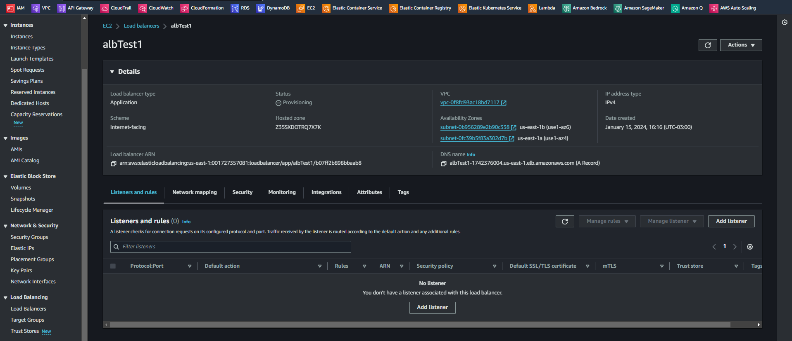

# Introduction to AWS Auto Scaling   

### Repository: [course](../../../)   
### Platform: <a href="../../">aws_skill_builder   </a>
### Software/Subject: <a href="../">aws   </a>
### Course: <a href="./">curso_109 (Introduction to AWS Auto Scaling)   </a>

#### <a href="">Certificate</a>

---

### Theme:
- Cloud Computing

### Used Tools:
- Operating System (OS): 
  - Windows 11   
- Cloud:
  - Amazon Web Services (AWS)   
- Cloud Services:
  - Amazon Application Load Balancer (ALB)   
  - Amazon EC2 Auto Scaling   
  - Amazon Elastic Compute Cloud (EC2)   
  - Amazon Elastic Load Balancing (ELB)   
  - AWS Auto Scaling   
  - AWS Software Development Kit (SDK) - Boto3   
  - Google Drive   
- Containerization: 
  - Docker   
- Language:
  - HTML   
  - Markdown   
  - Python   
- Integrated Development Environment (IDE) and Text Editor:
  - Visual Studio Code (VS Code)   
- Versioning: 
  - Git   
- Repository:
  - Docker Hub   
  - GitHub   
- Command Line Interpreter (CLI):
  - AWS Command Line Interface (CLI)   
  - Windows PowerShell   

---

<a name="item0"><h3>Course Strcuture:</h3></a>
1. <a href="#item01">Introduction to AWS Auto Scaling (Portuguese)</a> 
  1.1 <a href="#item01.01">Prática</a> 

---

### Objective:
O objetivo deste curso foi apresentar o serviço **AWS Auto Scaling**, mostrando seus principais benefícios e funcionalidades. Também foi explicado sobre os recursos que fazem parte deste serviço.

### Structure:
A estrutura do curso é formada por:
- Este arquivo de README.md.
- A pasta [resources](./resources/) contendo os arquivos de scripts em **Python** para interação com a **AWS**.
- A pasta `0-aux`, pasta auxiliar com imagens utilizadas na construção desse arquivo de README.

<figure>
     
    <figcaption>Imagem 01.</figcaption>
</figure>
 

### Development:

<a name="item01"><h4>Introduction to AWS Auto Scaling (Portuguese)</h4></a>[Back to summary](#item0)

Em uma infraestrutura mal projetada, a escalabilidade para alta disponibilidade deve ser feita de forma reativa e manual. Por exemplo, em um cenário em que se tem usuários acessando servidores de aplicações durante um determinado período. Os servidores de aplicações atingem sua capacidade total e, com espaço normal, os usuários estão sendo impedidos de acessar a aplicação. O administrador descobre que os servidores estão em sua capacidade total e prepara-se para iniciar uma nova instância para lidar com a carga. Infelizmente, esse processo manual não é escalável e sustentável. Além disso, a capacidade total pode ser alcançada mais uma vez pouco depois de iniciar todo o ciclo mais uma vez. Para enfrentar esse desafio, a **AWS** oferece uma solução de escalabilidade automática para Amazon EC2, EC2 Spot Fleet, ECS, DynamoDB, Aurora, EMR e AppStream 2.0.

Para escalar automaticamente as instâncias do Amazon EC2, por exemplo, a primeira etapa é criar um grupo de Auto Scaling, que é uma coleção de instâncias do EC2 que compartilham características semelhantes. O grupo de Auto Scaling permite que seja aproveitado os recursos de gerenciamento de frota para substituir automaticamente instâncias não íntegras e equilibrar as instâncias em diferentes zonas de disponibilidade imediatamente. Em seguida, pode ser criado e configurado a escalabilidade agendada para aumentar ou diminuir a capacidade em horários predefinidos, ou criada políticas de escalabilidade dinâmica que aumentem ou diminuam automaticamente a capacidade em resposta a mudanças na demanda. O Auto Scaling para outros serviços compatíveis funciona da mesma maneira.

Neste exemplo, tem-se uma infraestrutura com políticas de escalabilidade dinâmica no EC2, ECS, DynamoDB e Aurora. Implantar e gerenciar todas essas políticas separadamente em cada serviço pode ser demorado e tem o potencial de introduzir inconsistências nas políticas. Isso também significa duplicação de esforço se tiver que fazer alterações semelhantes em vários serviços. Para simplificar e aprimorar a experiênciade escalabilidade dinâmica na nuvem **AWS**, pode ser utilizado o **AWS Auto Scaling**. O **AWS Auto Scaling** permite configurar políticas de escalabilidade automática para vários recursos de escalabilidade usados pela aplicação a partir de uma interface unificada, onde é apenas fornecido o **AWS Auto Scaling** com a aplicação e, em seguida, criado um plano de escalabilidade para todas as aplicações em apenas algumas etapas.

O **AWS Auto Scaling** funciona com grupos de Auto Scaling do EC2, frotas spot do EC2, serviços do ECS, tabelas do DynamoDB e índices secundários globais e clusters de banco de dados do Aurora. O **AWS Auto Scaling** usa os serviços do **Amazon EC2 Auto Scaling** e **Application Auto Scaling** atualmente disponíveis para configurar planos de escalabilidade que contêm métricas e limites para aumentar e diminuir os recursos a partir de um único console. Então, é selecionada uma aplicação no **AWS Auto Scaling** conforme definido por uma pilha do **AWS CloudFormation** ou em um ambiente do **AWS Elastic Beansaltk**. Para configurar o **AWS Auto Scaling**, primeiro você precisa selecionar a pilha do **AWS CloudFormation** usada para sua aplicação. O **AWS Auto Scaling** verifica a pilha selecionada para identificar os tipos de recurso da **AWS** que podem ser escalados. Criar e revisar o plano de escalabilidade é a última etapa na configuração do **AWS Auto Scaling**.

Um *plano de escalabilidade* consiste em vários itens para configurar a escalabilidade de todas as aplicações. É possível adicionar ou remover cada tipo de recurso escalável disponível ao plano de escalabilidade. Em seguida, é selecionada a estratégia de escalabilidade. Existe a possibilidade de escalar pensando na disponibilidade, na economia de custos ou nas duas coisas. O **AWS Auto Scaling** é capaz de gerar automaticamente políticas de escalabilidade de rastreamento de metas para seus recursos.

Alguns do benefícios do **AWS Auto Scaling** são:
  - Dimensione de forma eficiente com uma interface: Com o **AWS Auto Scaling**, tem-se uma única interface para ver a utilização média de todos os recursos escaláveis sem precisar navegar para os outros consoles. Por exemplo, se uma aplicação usar o Amazon EC2 e o Amazon DynamoDB, poderá ser usado o **AWS Auto Scaling** para gerenciar a escalabilidade dinâmica de todos os grupos do Auto Scaling do EC2 e todas as tabelas do DynamoDB em sua aplicação.
  - Escale de forma inteligente com planos de escalabilidade: O **AWS Auto Scaling** permite criar planos de escalabilidade que automatizam a forma como os grupos de diferentes recursos respondem às mudanças na demanda. O **AWS Auto Scaling** monitora sua aplicação e adiciona ou remove automaticamente a capacidade em tempo real à medida que as demandas mudam.
  - Mantenha o desempenho com monitoramento contínuo: Usando o **AWS Auto Scaling**, a performance e a disponibilidade das aplicações são mantidas de forma consistente, mesmo quando as cargas de trabalho são periódicas, imprevisíveis ou estão mudando continuamente. O **AWS Auto Scaling** monitora continuamente as aplicações para garantir que eles estejam operando nos níveis de perfomance desejados.
  - Serviço Gratuito - Pague apenas pelos recursos que precisa: O **AWS Auto Scaling** é um serviço gratuito que pode ajudar a otimizar a utilização e a eficiência de custos ao consumir serviços da **AWS**. Com ele, só é pago pelos recursos de que realmente precisa, incluindo todos os alarmes do CloudWatch que possam ser criados pelo **AWS Auto Scaling**. Quando a demanda cai, o **AWS Auto Scaling** remove automaticamente qualquer excesso de capacidade do recurso para que seja evitado gastos excessivos.

Como mencionado anteriormente, um dos benefícios do **AWS Auto Scaling** é a capacidade de configurar a escalabilidade automática para todos os recursos escaláveis compatíveis que alimentam sua aplicação a partir de uma única interface unificada. O **AWS Auto Scaling** verifica o ambiente e descobre automaticamente os recursos de nuvem escaláveis básicos da aplicação, para que não precise identificar manualmente esses recursos um a um por meio de interfaces de serviço individuais.
  - Amazon EC2: Um dos tipos de recursos compatíveis com AWS Auto Scaling é o grupo do **Amazon EC2 Auto Scaling**. As instâncias do Amazon EC2 podem ser executadas ou encerradas em grupo do Auto Scaling.
  - Amazon EC2: Outro recurso escalável do Amazon EC2 é a frota spot (*Spot Fleet*), em que a meta de capacidade pode ser aumentada ou diminuída com base na demanda.
  - Amazon ECS: O Amazon ECS é outro recurso escalável da AWS. A contagem desejada dos serviços ECS pode ser ajustada para cima ou para baixo para responder às variações de carga.
  - Amazon DynamoDB: O próximo recurso escalável compatível com o **AWS Auto Scaling** é o DynamoDB. Com o **AWS Auto Scaling**, é possível habilitar uma tabela do DynamoDB ou um índice secundário global para aumentar a capacidade de taxa de transferência de provisionamento para lidar com aumentos no tráfego sem limitação.
  - Amazon Aurora: O último recurso escalável é o Amazon Aurora. O **AWS Auto Scaling** é capaz de ajustar dinamicamente o número de réplicas do Aurora provisionadas para um cluster de banco de dados do Aurora para lidar com aumentos na carga de trabalho.

O **AWS Auto Scaling** baseia as recomendações de escalabilidade nas métricas e limites de escalabilidade mais comuns usados para Auto Scaling. Ele também calcula os limites mínimo e máximo entre os quais os recursos serão escalados. Isso significa que, a qualquer momento, pode ser avaliado rapidamente a performance mínima e o custo máximo do ambiente.

Com o **AWS Auto Scaling**, é possível selecionar uma das três estratégias de escalabilidade predefinidas projetadas para otimizar a disponibilidade, otimizar custos ou equilibrar as duas coisas. Se optar por otimizar para disponibilidade, uma meta de baixa utilização de recursos será usado para fornecer a melhor disponibilidade e garantir a capacidade de absorver picos na demanda. Com uma estratégia equilibrada, uma meta moderada de utilização de recursos é usada para fornecer alta disponibilidade e reduzir custos. A estratégia de otimização para custo usa uma meta de alta utilização de recursos para garantir um custo mais baixo. Se preferir, também pode ser definida a própria meta de utilização de recursos criando uma estratégia personalizada para definir seus próprios valores. Com base na estratégia de escalabilidade selecionada, o **AWS Auto Scaling** criará as políticas de escalabilidade para cada um dos recursos selecionados.

Anteriormente, foi discutido que, como parte do plano de escalabilidade, o **AWS Auto Scaling** cria políticas de escalabilidade de rastreamento de metas. As *políticas de escalabilidade de rastreamento de metas* funcionam como um termostato. Com um termostato, é definido a temperatura e ele faz o trabalho para manter essa temperatura. Com as políticas de escalabilidade de rastreamento de metas, é selecionada uma métrica e definida uma meta de valor. Essas políticas criam e gerenciam os alarmes do CloudWatch que acionam a política de escalabilidade e calculam o ajuste de escala com base na métrica e na meta de valor. A política de escalabilidade adiciona ou remove capacidade conforme necessário para manter a métrica na meta de valor especificada ou próxima a ela. Além de manter a métrica próxima da meta de valor, uma política de escalabilidade de rastreamento de metas se otimiza automaticamente para ajustar às alterações na métrica devido a um padrão de carga em alteração e, por sua vez, minimiza as flutuações na capacidade da meta escalável.

E qual é a diferença entre o **AWS Auto Scaling** e os serviços nativos de escalabilidade da **AWS** discutidos no início deste curso, como o **Amazon EC2 Auto Scaling**. Um dos principais recursos que separa o **AWS Auto Scaling** dos recursos de escalabilidade automática herdados é que é possível configurar com eficiência o Auto Scaling para vários recursos a partir de uma interface unificada. O processo de várias etapas na configuração da escalabilidade automática é reduzido a apenas algumas etapas usando a interface do **AWS Auto Scaling**. Não é preciso criar manualmente políticas de escalabilidade para cada serviço separadamente, tudo isso é feito automaticamente.

Quando se deve considerar o **AWS Auto Scaling** para o ambiente? O **AWS Auto Scaling** deve ser utilizado se tiver uma aplicação que usa um ou mais recursos escaláveis e está sujeita a uma carga variável. Um bom exemplo seria uma aplicação Web de comércio eletrônico que usa o Amazon EC2 para a camada de computação e o DynamoDB para a camada de dados. Neste caso, o **AWS Auto Scaling** escalará um ou mais grupos do EC2 Auto Scaling e tabelas do DynamoDB usados pela aplicação para responder à curva de demanda. Também deve ser usado o **AWS Auto Scaling** se quiser obter mais orientações sobre a definição de um plano de escalabilidade de aplicações. Ou, se quiser apenas manter a integridade da frota do EC2, escalar recursos individuais separadamente, criar ações de escalabilidade agendadas ou configurar políticas de escalabilidade por etapas, pode usar o **Amazon EC2 Auto Scaling** ou **Application Auto Scaling**.

<a name="item01.01"><h4>Prática</h4></a>[Back to summary](#item0)

Como parte prática desse curso foram utilizados códigos em **Python** com o SDK do **Boto3** para interagir com a **AWS** e construir um load balancer do tipo Application, criando duas instâncias no serviço **Amazon Elastic Compute Cloud (EC2)** e as adicionando ao target group vinculado a esse load balancer. Esses arquivos de código foram armazenados no sub-diretório [resources](./resources/), sendo os referente as instâncias EC2 na sub-pasta [suport](./resources/suport/) dentro de `resources`. Na sub-pasta `suport`, o arquivo [ec2DoubleInstance.py](./resources/suport/ec2DoubleInstance.py) instanciou duas maquinas **Linux Ubuntu** idênticas no EC2, sendo a única diferença entre eles apenas o nome da tag das instâncias que obedecia um padrão ordenado. Ambas utilizavam o arquivo em **Bash** [udFile.sh](./resources/suport/udFile.sh) como user data, ou seja, após a instanciação da maquina, esse arquivo era executado. O arquivo instalava o servidor web **Apache HTTP (HTTPD)**, habilitava e iniciava. Como esse servidor opera na porta `80` era necessário liberá-la no grupo de segurança e isso foi feito com o arquivo [vpcSgRule.py](./resources/suport/vpcSgRule.py). O grupo de segurança e sub-redes utilizados tanto pelas instâncias como pelo load balancer foram os padrões da região utilizada. Nas imagens 02 e 03 é exibido o acesso ao servidor do Apache através do IP público das instâncias no navegador da maquina física **Windows**. Já na imagem 04 é mostrada as instâncias criadas.

<figure>
     
    <figcaption>Imagem 02.</figcaption>
</figure>
 

<figure>
     
    <figcaption>Imagem 03.</figcaption>
</figure>
 

<figure>
     
    <figcaption>Imagem 04.</figcaption>
</figure>
 

Observe que para acessar o servidor em uma instância é utilizado o IP público dela e para acessar a outra tem que alterar o IP para a instância correspondente, sendo em ambas operando na porta `80`. O objetivo aqui foi acessar o servidor do Apache por um único IP, no caso DNS, que era fornecido pelo load balancer, através do serviço **Amazon Elastic Load Balancing (ELB)**, e ele se responsabilizaria por distribuir as cargas, originadas do acesso ao servidor, às instâncias EC2. Para isso, o primeiro arquivo criado foi o [elbTg.py](./resources/elbTg.py) que construía um target group, conforme imagem 05 abaixo. Em seguida com o arquivo [elbLb.py](./resources/elbLb.py) foi criado o load balancer do tipo **Application Load Balancer**, visualizado na imagem 06. Já na imagem 07, é mostrada a criação do listener através do arquivo [elbListener.py](./resources/elbListener.py), no qual este escuta por conexões de clientes entrantes na porta `80` do DNS do load balancer e direciona essas conexões para grupos de destinos, onde estarão as instâncias EC2.

<figure>
     
    <figcaption>Imagem 05.</figcaption>
</figure>
 

<figure>
     
    <figcaption>Imagem 06.</figcaption>
</figure>
 

<figure>
     
    <figcaption>Imagem 07.</figcaption>
</figure>
 

Para adicionar as instâncias EC2 ao grupo de destino (target group) foi utilizado o arquivo [elbTgInstance.py], neste, como era só um arquivo, foi necessário alterar a variável `tag_name_instance` de nome `ec2Test1` para `ecTest2` para inserir a segunda instância. A imagem 08 mostra as duas instânicias inseridas no target group. Perceba que o `Health status` está como `Healthy`, ou seja, a verificação de integridade está saudável. Isso acontece da seguinte maneira, no target group foram determinados alguns parâmetros, o `health_check_path` como `/`, ou seja, significa o diretório raiz que neste caso não é o diretório raiz da instância e sim a pasta do servidor Apache que é `/var/www/html`, onde está o arquivo principal do servidor, o `index.html`. O parâmetro `health_check_protocol` define o protocolo utilizado como `HTTP` e o parâmetro `health_check_port` define a porta utilizada como `traffic-port`, a porta de tráfego que neste caso é a porta `80`. Assim, o load balancer envia solicitações do tipo `GET` utilizando o protocolo `HTTP` para o ip público das instâncias do target group para a pasta raiz da seguinte maneira `http://3.90.226.127/` logo ele encontra o arquivo `index.html` que devolve uma resposta para o load balancer confirmando a integridade da instância, tudo isso operando na porta `80`. Note que a porta `80` pode ser omitida do endereço da instância, pois é a porta padrão quando nenhuma porta é mencionada, mas o endereço funcionaria da seguinte maneira também `http://3.90.226.127:80/`. Caso seja optado por criar um diretório específico para verificação de integridade, neste caso ele teria que está dentro do diretório do Apache (`/var/www/html`) e conter um arquivo **HTML** com qualquer conteúdo apenas para o load balancer conseguir acessar e ter uma resposta. Um exemplo seria o diretório `health` que ficaria dentro da raiz `/`, na instância ficaria em `/var/www/html/health`, portanto seria definido o `health_check_path` como `/health/` contendo um arquivo **HTML** dentro dele, que poderia ser um `index.html`

<figure>
     
    <figcaption>Imagem 08.</figcaption>
</figure>
 

Na imagem 09 o acesso ao servidor web do Apache é realizado pelo DNS do load balancer na porta `80`.

<figure>
     
    <figcaption>Imagem 09.</figcaption>
</figure>
 