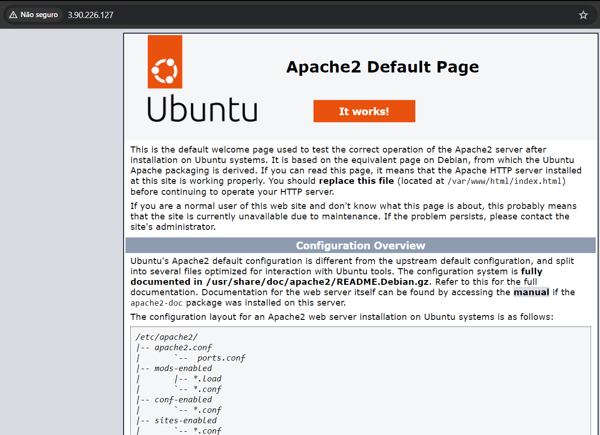
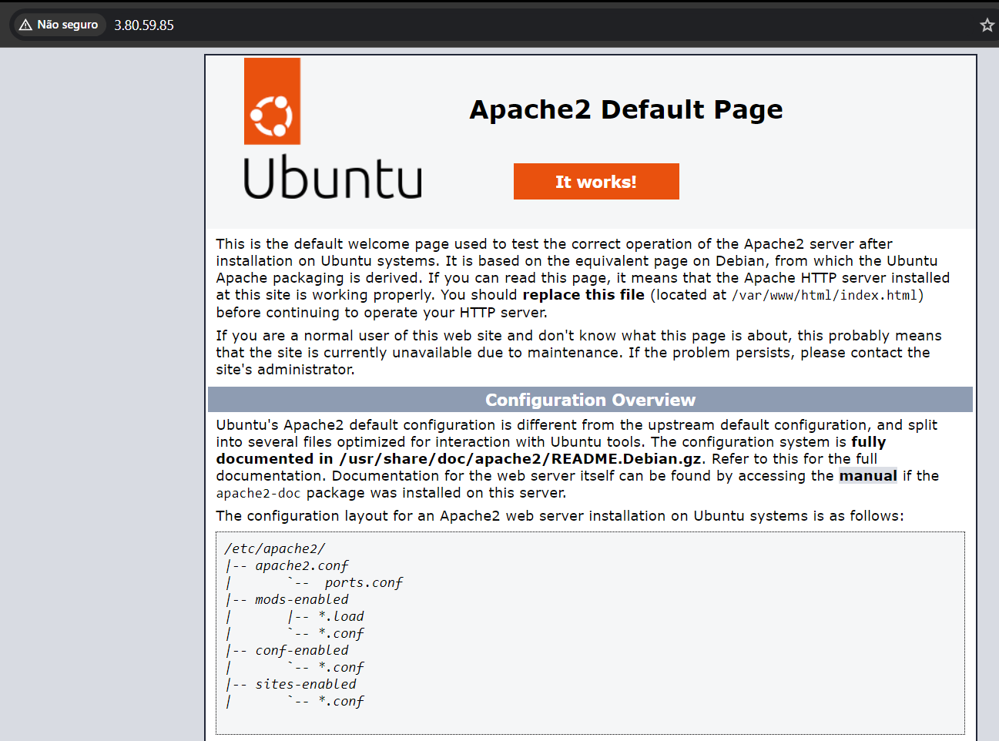
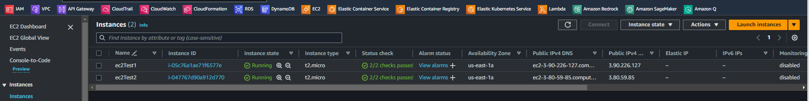
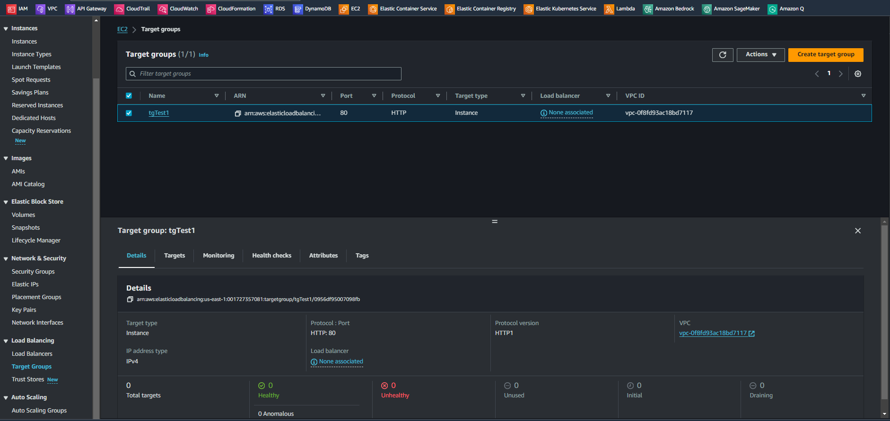
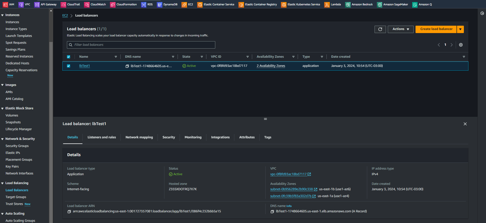
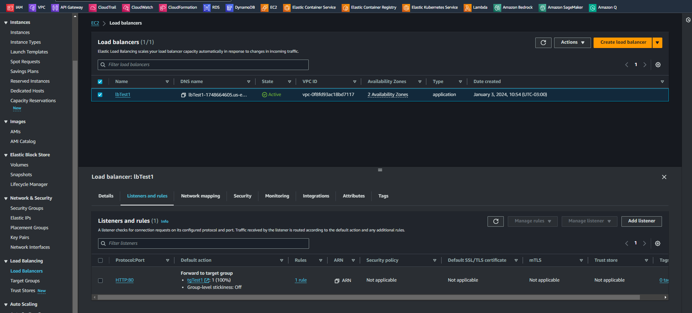
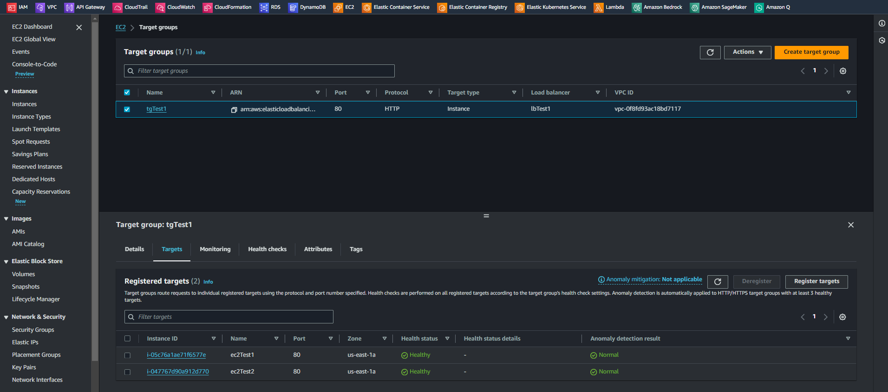
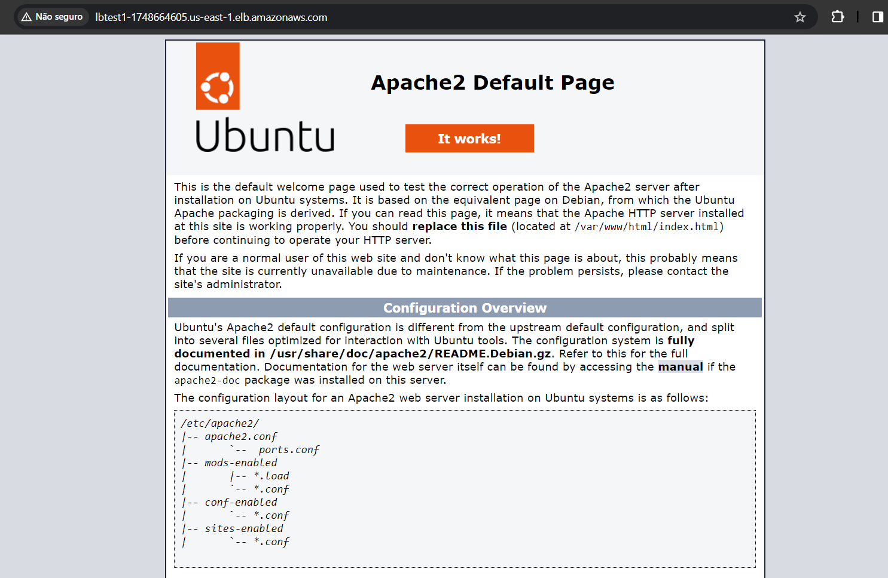

# Introduction to Amazon Elastic Load Balancer - Application   

### Repository: [course](../../../)   
### Platform: <a href="../../">aws_skill_builder   </a>
### Software/Subject: <a href="../">aws   </a>
### Course: <a href="./">curso_110 (Introduction to Amazon Elastic Load Balancer - Application)   </a>

#### <a href="https://github.com/PedroHeeger/main/blob/main/cert_ti/04-curso/cloud/aws/(24-01-02)_Introduction_to_Amazon_ELB_PH_AWSSB.pdf">Certificate</a>

---

### Theme:
- Cloud Computing

### Used Tools:
- Operating System (OS): 
  - Windows 11   
- Cloud:
  - Amazon Web Services (AWS)   
- Cloud Services:
  - Amazon Application Load Balancer (ALB)   
  - Amazon Elastic Compute Cloud (EC2)   
  - Amazon Elastic Load Balancing (ELB)   
  - AWS Software Development Kit (SDK) - Boto3   
  - Google Drive   
- Containerization: 
  - Docker   
- Language:
  - HTML   
  - Markdown   
  - Python   
- Integrated Development Environment (IDE) and Text Editor:
  - Visual Studio Code (VS Code)   
- Versioning: 
  - Git   
- Repository:
  - Docker Hub   
  - GitHub   
- Command Line Interpreter (CLI):
  - AWS Command Line Interface (CLI)   
  - Windows PowerShell   

---

<a name="item0"><h3>Course Strcuture:</h3></a>
1. <a href="#item01">Introduction to Amazon Elastic Load Balancer - Application (Portuguese)</a> 

---

### Objective:
Este curso aborda uma introdução ao **Application Load Balancer (ALB)**, um dos três balanceadores de carga do serviço **Amazon Elastic Load Balancing (ELB)**. O curso também explica sobre o seu funcionamento, os recursos que ajudam a definir o serviço, além de uma visão geral de alguns casos de uso do serviço e uma demonstração da execução e configuração de um Application Load Balancer.

### Structure:
A estrutura do curso é formada por:
- Este arquivo de README.md.
- A pasta [resources](./resources/) contendo os arquivos de scripts em **Python** para interação com a **AWS**.
- A pasta `0-aux`, pasta auxiliar com imagens utilizadas na construção desse arquivo de README.

<figure>
     
    <figcaption>Imagem 01.</figcaption>
</figure>
 

### Development:

<a name="item01"><h4>Introduction to Amazon Elastic Load Balancer - Application (Portuguese)</h4></a>[Back to summary](#item0)

O **Application Load Balancer (ALB)** é o segundo tipo de balanceador de carga introduzido como parte do serviço do **Amazon Elastic Load Balancing (ELB)**, que oferece ainda a maioria dos recursos fornecidos pelo **Classic Load Balancer (CLB)**. Ele adiciona alguns recursos e aprimoramentos importantes que são empregados em casos de uso singulares. Em resumo, alguns dos recursos recém-aprimorados incluem protocolos de solicitação adicionais compatíveis, métricas aprimoradas e logs de acesso, além de verificações de integridade mais direcionadas. Alguns dos recursos adicionais do Application Load Balancer são: a capacidade de habilitar mecanismos de roteamento adicionais para as solicitações usando roteamento baseado em caminho ou host, suporte nativo a IPv6 em uma VPC, integração do **AWS Web Application Firewall (WAF)** e muito mais.

É possível utilizar o Application Load Balancer em um grande número de cenários. Um deles é a capacidade de usar contêineres para hospedar seus microsserviços e rotear para essas aplicações de um único balanceador de carga. O Application Load Balancer permite rotear solicitações diferentes para a mesma instância, porém diferencia o caminho com base na porta. Se houver contêineres diferentes escutando em várias portas, poderá configurar regras de roteamento para distribuir o tráfego apenas para a aplicação de back-end desejada.

Há alguns novos termos a serem aprendidos ao analisar o Application Load Balancer. Apesar de os ouvintes (*Listeners*) serem essencialmente os mesmos, agora há a possibilidade de agrupar os destinos (*Target*) em grupos de destino (*Target Group*), porque o Application Load Balancer registra destinos em vez de instâncias. Um grupo de destino (Target Group) é como os destinos são registrados no balanceador de carga. Ao configurar os ouvintes para o balanceador de carga, são criadas regras para direcionar como as solicitações recebidas pelo balanceador de carga serão roteadas para os destinos de back-end. Para registrar esses destinos no balanceador de carga e configurar a verificação de integridade, o balanceador de carga será usado para os destinos que for criado nos grupos de destino. Os destinos também podem ser membros de vários grupos de destino.

O Application Load Balancer inclui recursos aprimorados e agregados. Ele aprimorou os protocolos compatíveis adicionando suporte a HTTP/2 e WebSocket. Além disso, os recursos de monitoramento foram aumentados adicionando dimensões de métricas, executando verificações de integridade mais granulares e detalhes adicionais nos logs de acesso. 

Alguns dos recursos adicionados agora com suporte são o roteamento baseado em caminho e em host. O roteamento baseado em caminho permite que sejam criadas regras para rotear para grupos de destino, com base no URL na solicitação. O roteamento baseado em host permite ter vários domínios compatíveis, com o mesmo balanceador de carga, além de rotear a solicitação para os grupos de destino com base no domínio solicitado. Além disso, é possível usar o recurso de monitoramento das solicitações para monitorar as solicitações dos clientes para os destinos e a poderá habilitar as protas de host dinâmicas quando estiver usando os contêineres programados do EC2 Container Services.

##### Prática

Como parte prática desse curso foram utilizados códigos em **Python** com o SDK do **Boto3** para interagir com a **AWS** e construir um load balancer do tipo Application, criando duas instâncias no serviço **Amazon Elastic Compute Cloud (EC2)** e as adicionando ao target group vinculado a esse load balancer. Esses arquivos de código foram armazenados no sub-diretório [resources](./resources/), sendo os referente as instâncias EC2 na sub-pasta [suport](./resources/suport/) dentro de `resources`. Na sub-pasta `suport`, dois arquivos idênticos foram criados para instânciação de maquinas **Linux Ubuntu** no EC2 ([ec2Instance1.py](./resources/suport/ec2Instance1.py) e [ec2Instance2.py](./resources/suport/ec2Instance2.py)), sendo a única diferença entre eles apenas o nome das instâncias. Ambos utilizavam o arquivo em **Bash** [udFileTest.sh](./resources/suport/udFileTest.sh) como user data, ou seja, após a instanciação da maquina, esse arquivo era executado. O arquivo instalava o servidor web **Apache HTTP (HTTPD)**, habilitava e iniciava. Como esse servidor opera na porta `80` era necessário liberá-la no grupo de segurança e isso foi feito com o arquivo [vpcSgRule.py](./resources/suport/vpcSgRule.py). O grupo de segurança e sub-redes utilizados tanto pelas instâncias como pelo load balancer foram os padrões da região utilizada. Nas imagens 02 e 03 é exibido o acesso ao servidor do Apache através do IP público das instâncias no navegador da maquina física **Windows**. Já na imagem 04 é mostrada as instâncias criadas.

<figure>
     
    <figcaption>Imagem 02.</figcaption>
</figure>
 

<figure>
     
    <figcaption>Imagem 03.</figcaption>
</figure>
 

<figure>
     
    <figcaption>Imagem 04.</figcaption>
</figure>
 

Observe que para acessar o servidor em uma instância é utilizado o IP público dela e para acessar a outra tem que alterar o IP para a instância correspondente, sendo em ambas operando na porta `80`. O objetivo aqui foi acessar o servidor do Apache por um único IP, no caso DNS, que era fornecido pelo load balancer, através do serviço **Amazon Elastic Load Balancing (ELB)**, e ele se responsabilizaria por distribuir as cargas, originadas do acesso ao servidor, às instâncias EC2. Para isso, o primeiro arquivo criado foi o [elbTg.py](./resources/elbTg.py) que construía um target group, conforme imagem 05 abaixo. Em seguida com o arquivo [elbLb.py](./resources/elbLb.py) foi criado o load balancer do tipo **Application Load Balancer**, visualizado na imagem 06. Já na imagem 07, é mostrada a criação do listener através do arquivo [elbListener.py](./resources/elbListener.py), no qual este escuta por conexões de clientes entrantes na porta `80` do DNS do load balancer e direciona essas conexões para grupos de destinos, onde estarão as instâncias EC2.

<figure>
     
    <figcaption>Imagem 05.</figcaption>
</figure>
 

<figure>
     
    <figcaption>Imagem 06.</figcaption>
</figure>
 

<figure>
     
    <figcaption>Imagem 07.</figcaption>
</figure>
 

Para adicionar as instâncias EC2 ao grupo de destino (target group) foi utilizado o arquivo [elbTgInstance.py], neste, como era só um arquivo, foi necessário alterar a variável `tag_name_instance` de nome `ec2Test1` para `ecTest2` para inserir a segunda instância. A imagem 08 mostra as duas instânicias inseridas no target group. Perceba que o `Health status` está como `Healthy`, ou seja, a verificação de integridade está saudável. Isso acontece da seguinte maneira, no target group foram determinados alguns parâmetros, o `health_check_path` como `/`, ou seja, significa o diretório raiz que neste caso não é o diretório raiz da instância e sim a pasta do servidor Apache que é `/var/www/html`, onde está o arquivo principal do servidor, o `index.html`. O parâmetro `health_check_protocol` define o protocolo utilizado como `HTTP` e o parâmetro `health_check_port` define a porta utilizada como `traffic-port`, a porta de tráfego que neste caso é a porta `80`. Assim, o load balancer envia solicitações do tipo `GET` utilizando o protocolo `HTTP` para o ip público das instâncias do target group para a pasta raiz da seguinte maneira `http://3.90.226.127/` logo ele encontra o arquivo `index.html` que devolve uma resposta para o load balancer confirmando a integridade da instância, tudo isso operando na porta `80`. Note que a porta `80` pode ser omitida do endereço da instância, pois é a porta padrão quando nenhuma porta é mencionada, mas o endereço funcionaria da seguinte maneira também `http://3.90.226.127:80/`. Caso seja optado por criar um diretório específico para verificação de integridade, neste caso ele teria que está dentro do diretório do Apache (`/var/www/html`) e conter um arquivo **HTML** com qualquer conteúdo apenas para o load balancer conseguir acessar e ter uma resposta. Um exemplo seria o diretório `health` que ficaria dentro da raiz `/`, na instância ficaria em `/var/www/html/health`, portanto seria definido o `health_check_path` como `/health/` contendo um arquivo **HTML** dentro dele, que poderia ser um `index.html`

<figure>
     
    <figcaption>Imagem 08.</figcaption>
</figure>
 

Na imagem 09 o acesso ao servidor web do Apache é realizado pelo DNS do load balancer na porta `80`.

<figure>
     
    <figcaption>Imagem 09.</figcaption>
</figure>
 