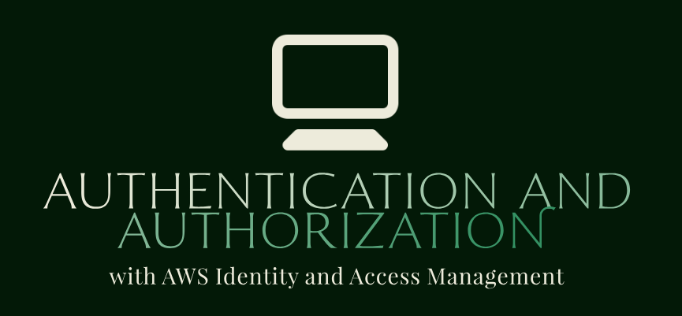
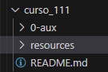
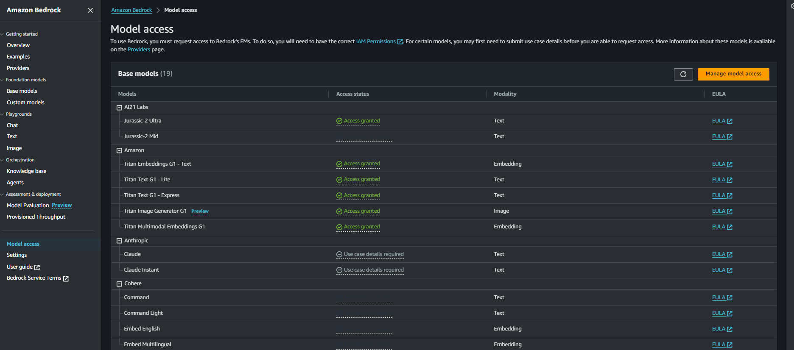
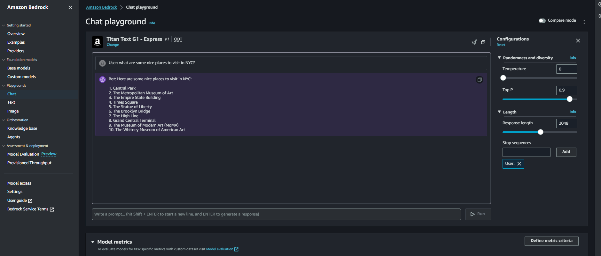
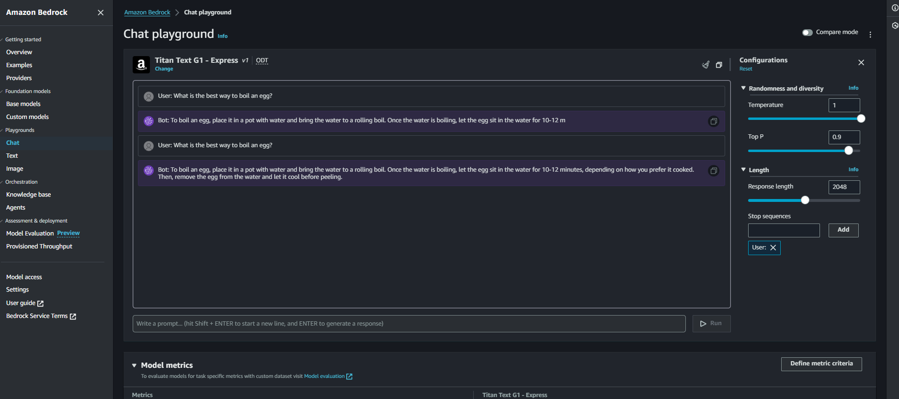
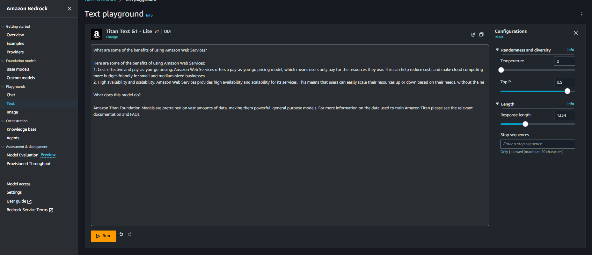
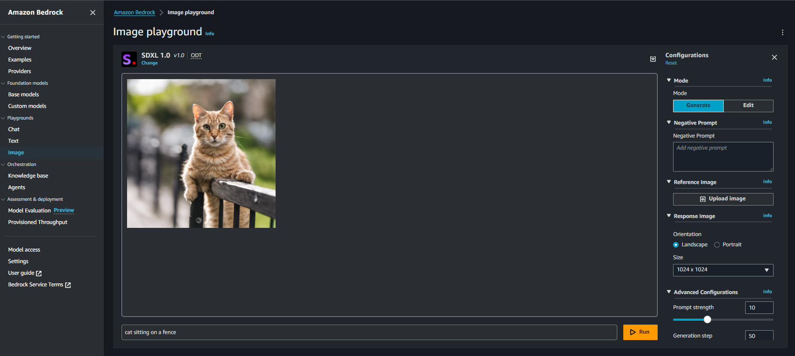
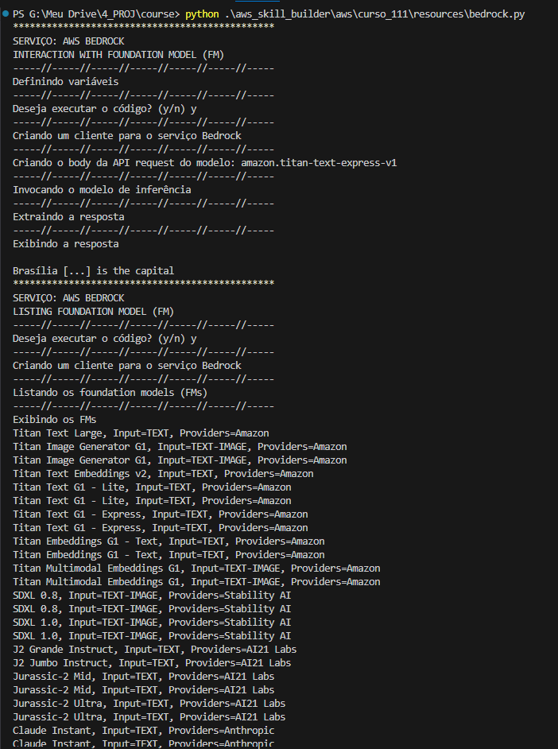

# Introdução ao Amazon Bedrock   

### Repository: [course](../../../)   
### Platform: <a href="../../">aws_skill_builder   </a>
### Software/Subject: <a href="../">aws   </a>
### Course: <a href="./">curso_111 (Introdução ao Amazon Bedrock)   </a>

#### <a href="https://github.com/PedroHeeger/main/blob/main/cert_ti/04-curso/cloud/aws/(23-12-28)%20Introdu%C3%A7%C3%A3o%20ao%20Amazon%20Bedrock%20PH%20AWSSB.pdf">Certificate</a>

---

### Theme:
- Cloud Computing

### Used Tools:
- Operating System (OS): 
  - Windows 11   
- Cloud:
  - Amazon Web Services (AWS)   
- Cloud Services:
  - Amazon Bedrock   
  - AWS Software Development Kit (SDK) - Boto3   
  - Google Drive   
- Language:
  - HTML   
  - Markdown   
  - Python   
- Integrated Development Environment (IDE) and Text Editor:
  - Visual Studio Code (VS Code)   
- Versioning: 
  - Git   
- Repository:
  - GitHub   
- Command Line Interpreter (CLI):
  - AWS Command Line Interface (CLI)   
  - Windows PowerShell   

---

<a name="item0"><h3>Course Strcuture:</h3></a>
1. <a href="#item01">Introdução ao Amazon Bedrock (Português) | Amazon Bedrock Getting Started (Portuguese)</a> 

---

### Objective:
O objetivo desse curso foi apresentar o serviço **Amazon Bedrock** explicando seus conceitos básicos, benefícios, funcionamento e custos. Além disso, listar alguns casos de uso e descrever as arquiteturas típicas associadas a uma solução **Amazon Bedrock**.

### Structure:
A estrutura do curso é formada por:
- Este arquivo de README.md.
- A pasta [resources](./resources/) contendo um arquivo de script em **Python** para interação com a **Amazon Bedrock**.
- A pasta `0-aux`, pasta auxiliar com imagens utilizadas na construção desse arquivo de README.

<figure>
     
    <figcaption>Imagem 01.</figcaption>
</figure>
 

### Development:

<a name="item01"><h4>Introdução ao Amazon Bedrock (Português) | Amazon Bedrock Getting Started (Portuguese)</h4></a>[Back to summary](#item0)

O **Amazon Bedrock** é um serviço totalmente gerenciado que oferece os principais modelos de base (Foundation Models - FMs) e um conjunto de ferramentas para criar e dimensionar rapidamente aplicações de IA generativa. O serviço também ajuda a garantir a privacidade e a segurança. Com a experiência sem servidor do **Amazon Bedrock** não é necessário gerenciar a infraestrutura. É possível começar rapidamente e fazer experiências com FMs, podendo também personalizar os FMs de forma privada com os próprios dados, que podem ser integrados e implementados de forma contínua nas aplicações usando as ferramentas e os recursos da **Amazon Web Services (AWS)**.

Existem vários FMs que podem ser escolhidos com base no modelo que seja mais adequado ao caso de uso. Os provedores de FMs existentes são: Amazon, AI21 Labs, Anthropic, Cohere, Meta e Stability AI. Isso inclui as famílias de FMs Amazon Titan, Jurassic-2, Claude, Command, Llama 2 e Stable Diffusion, que são compatíveis com diferentes modalidades, incluindo texto, incorporações e multimodal. Uma única API pode ser utilizada para acessar com segurança FMs personalizados e aqueles fornecidos pela Amazon e outras empresas de IA. Usando a mesma API, é possível transmitir prompts e respostas entre o usuário e o FM de forma privada e mais eficiente.

Com o **Amazon Bedrock**, os dados, incluindo prompts, informações usadas para complementar um prompt, respostas de FM e FMs personalizados, permanecem na região em que a chamada de API é processada. Os dados são criptografados em trânsito com TLS 1.2 e em repouso com chaves do **AWS Key Management Service (AWS KMS)** gerenciadas pelo serviço. Ainda há a possibilidade de utilizar o **AWS PrivateLink** com o **Amazon Bedrock** para estabelecer conectividade privada entre os FMs e redes on-premises, sem expor o tráfego à Internet. Além disso, é possível personalizar os FMs de forma privada, mantendo o controle sobre como os dados são usados e criptografados. O **Amazon Bedrock** faz uma cópia separada do modelo de base FM e treina essa cópia privada do modelo.

Para proteger os FMs personalizados, pode ser utilizados os serviços de segurança da AWS para formar a estratégia de segurança detalhada. Os FMs personalizados são criptografados usando chaves do AWS KMS e armazenados com criptografia. Ao usar o **AWS Identity and Access Management (AWS IAM)**, é possível controlar o acesso aos FMs personalizados, permitindo ou negando o acesso a FMs específicos. Também é possível controlar quais serviços recebem inferências e quem pode fazer login no console do **Amazon Bedrock**.

O **Amazon Bedrock** oferece recursos abrangentes de monitoramento e registro, incluindo ferramentas que podem ser usadas para ajudar a atender aos seus requisitos de governança e auditoria. O **Amazon CloudWatch** pode ser utilizado para rastrear métricas de uso e criar painéis personalizados com métricas necessárias para fins de auditoria. Também pode ser utilizado o **AWS CloudTrail** para monitorar a atividade da API e solucionar problemas à medida que integra outros sistemas às aplicações de IA generativa.

É possível ajustar um FM para uma tarefa específica sem ter que anotar grandes volumes de dados. Aponte o **Amazon Bedrock** para alguns exemplos marcados no **Amazon Simple Storage Service (Amazon S3)**. Em seguida, o serviço faz uma cópia separada do FM de base, que só pode ser acessada pelo usuário, e treina essa cópia privada do FM. Nenhum dos dados do usuário é usado para treinar os FMs de base originais.

Através do processo conhecido como *Geração com Recuperação Aumentada (RAG)* pode ser obtida respostas mais contextuais e relevantes ao incorporar dados específicos da organização. Com os agentes para o **Amazon Bedrock** (em versão prévia), pode ser criada uma integração segura com as origens dos dados da organização, adicionando bases de conhecimento sem precisar treinar o FM de novo. É possível adicionar rapidamente uma base de conhecimento especificando uma fonte de dados a ser ingerida, como o **Amazon S3**, e um FM para converter os dados em formato vetorial, como o *Amazon Titan Embeddings*, e especificar um banco de dados de vetores de destino para armazenar dados de vetores, como o mecanismo vetorial do *Amazon OpenSearch* Sem Servidor, *Pinecone* ou *Redis Enterprise Cloud*. 

Os agentes do **Amazon Bedrock** usam bases de conhecimento para identificar as fontes de dados apropriadas. Os agentes também recuperam informações relevantes com base na entrada do usuário, incorporam o contexto das informações recuperadas à consulta do usuário e fornecem uma resposta. Todas as informações recuperadas das bases de conhecimento vêm com atribuição de fonte para melhorar a transparência e minimizar as alucinações.

Com o FM do *Amazon Titan Embeddings* pode ser criado um vetor de dados da organização para pesquisa semântica. Incorporações de vetores são representações numéricas de dados de texto, imagem, áudio e vídeo que podem ser usadas para entender a relação entre frases ou palavras. Isso ajuda a encontrar informações mais relevantes e contextuais para uma consulta do usuário. As incorporações podem ser armazenadas em um banco de dados de vetores para serem usadas em pesquisas mais otimizadas e precisas.

##### Casos de Uso

O **Amazon Bedrock** pode ser utilizado para geração de texto, criando novas peças de conteúdo original, como contos, ensaios, publicações em redes sociais e textos para páginas da web. Ou para construção de chatboots, através de interfaces de conversação, como chatbots e assistentes virtuais, para oferecer aos clientes uma experiência do usuário aprimorada. Também pode ser utilizado para pesquisa, localizando e sintetizando informações para responder a perguntas de um grande conjunto de dados. Ou para resumo de textos, que é obtido um resumo do conteúdo textual, como artigos, postagens de blog, livros e documentos, para obter entendimento sem precisar ler o conteúdo completo. Para gereção de imagens, criando imagens realistas e artísticas de vários assuntos, ambientes e cenas a partir de sugestões de linguagem. Ainda pode ser utilizado para personalização, ajudando o cliente a encontrar o que está procurando com recomendações de produtos mais relevantes e contextuais do que a correspondência de palavras.

Com relação ao modelo de responsabilidade compartilhada, a AWS é responsável por proteger a infraestrutura que executa todos os serviços oferecidos pelo **Amazon Bedrock**. Enquanto o usuário é responsável por gerenciar e criptografar seus dados e aplicar controles corretos de acesso de usuário aos dados e às chamadas de API feitas para o **Amazon Bedrock**. O usuário também é responsável pela acurácia dos resultados retornados pelos FMs personalizados e FMs de terceiros.

As cotas de serviço, também chamadas de limites, são o número máximo de recursos de serviço permitidos para uma conta AWS. O **Amazon Bedrock** implementa uma série de limites em nível de conta nas seguintes APIs: O número de trabalhos simultâneos permitidos para ajustes; O número de chamadas por minuto para as APIs; O número total de tokens consumidos e emitidos por minuto pela API do modelo.

O **Amazon Bedrock** é um serviço totalmente gerenciado que não está configurado em uma nuvem privada virtual (VPC). É possível acessar o endpoint de serviço de uma VPC por meio do **AWS PrivateLink**. Também pode conectar as redes corporativas ao **Amazon Bedrock** por meio de uma VPC. Atualmente (2023), o **Amazon Bedrock** está disponível em algumas regiões selecionadas, com planos de expansão. Todo o conteúdo é processado dentro da mesma região da AWS em que a chamada de API relevante foi feita. Os dados não ultrapassam nenhum limite regional da AWS. Nenhum dos dados do usuário é usado para melhorar ou aprimorar os FMs de base. Os dados não são compartilhados com nenhum fornecedor de modelos.

É possível fornecer dados de informações de identificação pessoal (PII) em prompts de entrada para o *Amazon Titan* ou para modelos de terceiros. Os modelos de terceiros terão suas próprias maneiras de lidar com esses dados, mas o *Amazon Titan* sempre os aceitará como entrada. Quando o *Amazon Titan* fornecer a saída do prompt, todos os dados de PII presentes que também estavam no prompt de entrada permanecerão em texto simples na saída. Todos os dados de PII na saída que não estavam presentes no prompt de entrada serão mascarados. Para obter mais informações sobre o manuseio de dados de PII, consulte o Contrato de Licença de Usuário Final (EULA) do provedor de modelos de terceiros.

Quando é feito o ajuste fino de um FM de base, os dados são usados para fazer o ajuste fino de uma cópia do FM de base. Essa cópia do FM é privada para o usuário. Nem esse FM ajustado nem os dados usados para ajustá-lo são compartilhados com outros clientes ou provedores de modelos. A identificação desses modelos ajustados usa * ARNs (Amazon Resource Names)* padrão, e somente a conta da AWS que criou o modelo pode acessá-lo. O **Amazon Bedrock** não expõe nenhum dos detalhes de ajuste específicos do modelo, como os pesos, nem permite a exportação de nenhum dos artefatos do modelo personalizado.

##### Custos

Ao usar o **Amazon Bedrock**, pode ser optado por usar o *Amazon Titan* ou modelos de terceiros. Com o **Amazon Bedrock**, há custos ao executar a inferência em qualquer um dos FMs. O preço é baseado no volume de tokens de entrada e de saída. No contexto dos modelos de linguagem ampla (LLMs), um token é uma sequência de caracteres que representa uma unidade significativa de texto. Os tokens podem ser palavras, frases ou caracteres individuais, como um ponto final. Os tokens também fornecem uma padronização dos dados de entrada, o que ajuda o modelo a fazer o processamento. Com o **Amazon Bedrock**, existe a possibilidade de provisionar o throughput, o que neste momento está em versão prévia. Com o throughput provisionado, o preço é cobrado por hora.

##### Funcionamento

O Amazon Bedrock pode ser usado no Console de Gerenciamento da AWS ou com uma API. É possível usar os playgrounds do **Amazon Bedrock** para interagir com FMs para gerar texto ou uma imagem, ou para ter uma conversa usando o chat. O **Amazon Bedrock** suporta a seleção de um FM a partir de um conjunto de provedores de modelos. Usando os playgrounds no **Amazon Bedrock**, pode ser enviado um comando de linguagem natural (prompt) para o FM e obter uma resposta ou uma solução. Também é possível influenciar a resposta do modelo ajustando os parâmetros do modelo, como a temperatura, para que a resposta possa variar de mais factual a mais criativa. Pode ser fornecidos prompts para gerar texto, gerar imagens, resumir texto, receber respostas a perguntas ou conversar usando o chat.

Uma única API do **Amazon Bedrock** pode ser usada para acessar FMs com segurança. Usando a mesma API, é possível enviar prompts e respostas mais facilmente e de forma privada entre o usuário e o FM. A API do **Amazon Bedrock** pode ser usada por meio do SDK da AWS para criar uma aplicação de IA generativa e integrar-se a outros serviços da AWS. 

Os consumidores interagem com o **Amazon Bedrock** no console para atividades de playground de chat, texto e imagem com os FMs. Opcionalmente, pode ser definido parâmetros de inferência para influenciar a resposta gerada pelo modelo. Os FMs suportam os seguintes tipos de parâmetros de inferência.
  - Temperatura: LLMs usam probabilidade para construir as palavras em uma sequência. Para qualquer sequência dada, há uma distribuição de probabilidade de opções para a próxima palavra da sequência. Quando é definido a temperatura mais próxima de zero, o modelo tende a selecionar as palavras de maior probabilidade. Quando é definido a temperatura mais distante de zero, o modelo pode selecionar uma palavra de menor probabilidade.
  - Top P: Top P define um corte com base na soma das probabilidades das possíveis escolhas. Se for definido Top P abaixo de 1.0, o modelo considerará as opções mais prováveis e ignorará as menos prováveis.
  - Comprimento da resposta: Configura o número máximo de tokens a serem usados na resposta gerada.
  - Sequências de parada: Uma sequência de parada é uma sequência de caracteres. Se o modelo encontrar uma sequência de parada, ele para de gerar mais tokens. Diferentes modelos aceitam diferentes tipos de caracteres em uma sequência de parada, diferentes comprimentos máximos de sequência e podem aceitar a definição de várias sequências de parada.

##### Prática

Como parte prática desse curso, foram realizados alguns playgrounds disponíveis no **Amazon Bedrock**. Os três tipos de playgrounds existentes são: Chat, Text e Image. Para utilizá-los é necessário ter disponívels os foundation models (FMs) do Bedrock. Na aba *Model access* é listado vários FMs de diversos providers para várias modalidades. Ao clicar em *Manage model access* é possível escolher quais modelos devem ser liberados o acesso e então salvar. Para fazer isso é necessário permissões do IAM caso o usuário não tenha, como neste caso é o usuário administrador, não foi necessário. A depender do FM escolhido pode levar alguns minutos para ser liberado. Na imagem 02 é exibido a aba de *Model access** com os FMs que já foram permitidos o acesso.

<figure>
     
    <figcaption>Imagem 02.</figcaption>
</figure>
 

Após os FMs liberados, ele já é listado no respectivo playground, sendo necessário selecioná-lo e então começar utilizar o playground. O primeiro playground testado foi o de chat com o FM *Titan Text G1 - Express  v1* da própria **Amazon**. Na imagem 03 é ilustrado a primeira interação com o playground de chat.

<figure>
     
    <figcaption>Imagem 03.</figcaption>
</figure>
 

Observe que essa primeira interação foi feita com as configurações padrões, porém é possível alterar alguns parâmetros disponíveis no lado direito, modificando a aleatoriedade e a diversidade das respostas geradas pelo modelo. Na imagem 04 abaixo um mesmo prompt foi enviado duas vezes, sendo a primeira vez com a temperatura 0 (mais preciso) e o segundo com a temperatura de 1 (menos preciso). Em algumas situações, uma configuração de temperatura alta resulta em respostas imprecisas ou até mesmo totalmente erradas. Isso é chamado de "alucinação". 

<figure>
     
    <figcaption>Imagem 04.</figcaption>
</figure>
 

O próximo playground executado foi o de text. A diferença entre o playground de chat e o playground de texto é que no primeiro é para casos de uso de conversação e o segundo é para casos de uso com base em prompt de texto individual, como resumos. Para utilizá-lo é da mesma forma que o anterior, seleciona a FM que será utilizada, caso não tenha, necessário solicitar o acesso. O FM escolhido para esse playground foi o *Titan Text G1 - Lite  v1* que também é da **Amazon**. No plaground de texto, cada pergunta ou consulta, é considerada um prompt exclusivo para o modelo, diferente do playground de chat, onde os prompts tem relação um com o outro. A imagem 05 mostra a execução no segundo playground.

<figure>
     
    <figcaption>Imagem 05.</figcaption>
</figure>
 

Para o playground de image, o modelo utilizado foi o *SDXL 1.0  v1.0* da **Stability AI**, o processo é basicamente o mesmo dos outros. O playground de imagem permite que seja gerado imagens a partir de uma entrada de texto. Ele possui várias configurações específicas para interação com imagens. A imagem 06 exibe a criação de uma imagem a partir do prompt estabelecido.

<figure>
     
    <figcaption>Imagem 06.</figcaption>
</figure>
 

Como o **Amazon Bedrock** é um serviço novo, ainda não existe comandos do **AWS CLI** para interagir com a API dele, caso que ocorre também com o **Amazon Q** que é explicado no curso [curso_112](../curso_112/). Então para interagir com o Bedrock via API, foi utilizado o SDK da Amazon para linguagem de programação **Python** que é o **Boto3**. Para isso foi criado o arquivo [bedrock.py](./resources/bedrock.py) no sub-diretório [resources](./resources/), no qual este arquivo conteve dois scripts **Python** que utilizam o **Boto3** para interagir com o Bedrock. No primeiro script, o objetivo é enviar um prompt para o foundation model (FM) escolhido responder a pergunta e então exibir essa resposta na tela. Já o segundo script, o objetivo é listar todos os FMs existentes, informando qual tipo de input ele recebe e de qual provedor ele é. O primeiro utiliza o `bedrock-runtime` como client, enquanto o segundo utiliza apenas o `bedrock`. A estrutura dos scripts seguem as mesmas realizadas nos cursos da **AWS Skill Builder**, sempre uma estrutura condicional na frente dos scripts para o usuário decidir se executa ou não o bloco de código. Não houve verificações de existência de algum elemento, pois o objetivo aqui não foi criar e excluir algo, e sim interagir. A imagem 07 abaixo mostra o output dos dois scripts.

<figure>
     
    <figcaption>Imagem 07.</figcaption>
</figure>
 
