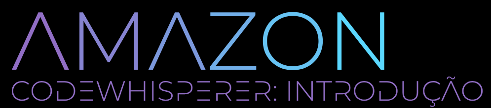
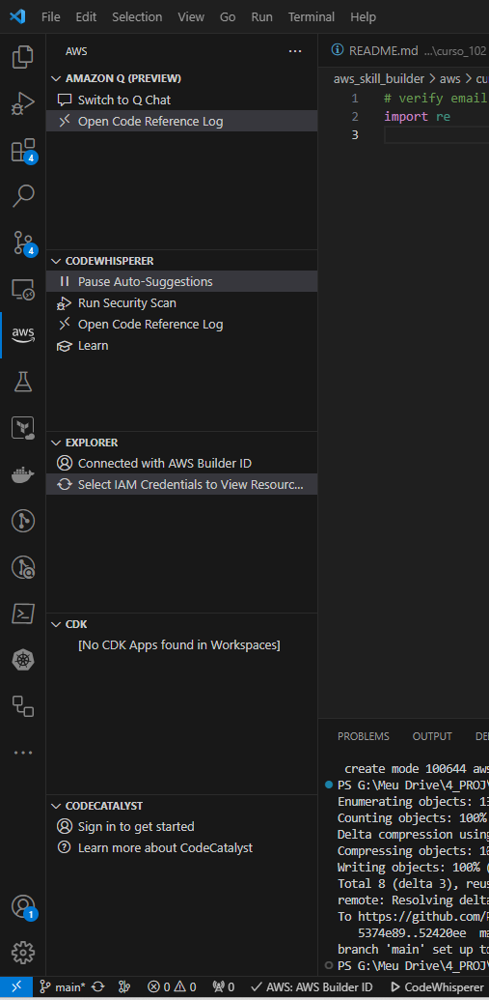
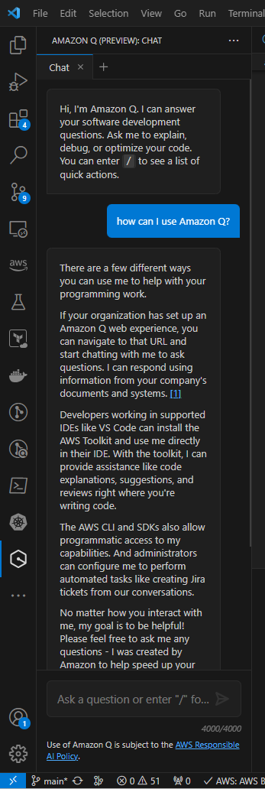

# Amazon CodeWhisperer: Introdução   

### Repository: [course](../../../)   
### Platform: <a href="../../">aws_skill_builder   </a>
### Software/Subject: <a href="../">aws   </a>
### Course: <a href="./">curso_112 (Amazon CodeWhisperer: Introdução)   </a>

#### <a href="https://github.com/PedroHeeger/main/blob/main/cert_ti/04-curso/cloud/aws/(23-12-28)%20Amazon%20CodeWhisperer...%20PH%20AWSSB.pdf">Certificate</a>

---

### Theme:
- Cloud Computing

### Used Tools:
- Operating System (OS): 
  - Windows 11   
- Cloud:
  - Amazon Web Services (AWS)   
- Cloud Services:
  - Amazon CodeWhisperer   
  - Google Drive   
- Language:
  - HTML   
  - Markdown   
- Integrated Development Environment (IDE) and Text Editor:
  - Visual Studio Code (VS Code)   
- Versioning: 
  - Git   
- Repository:
  - GitHub   

---

<a name="item0"><h3>Course Strcuture:</h3></a>
1. <a href="#item01">Amazon CodeWhisperer: Introdução (Português) | Amazon CodeWhisperer - Getting Started (Portuguese)</a><br>

---

### Objective:
O objetivo desse curso foi apresentar o serviço **Amazon CodeWhisperer** explicando como instalar, configurar e utilizar no ambiente de desenvolvimento integrado (IDE) ou editor de código compatível. Também foi ensinado sobre os principais recursos, como conclusão de código, descoberta e atribuição de código aberto, verificações de segurança e solicitação para gerar sugestões úteis de código. Por fim, foi apresentado as opções de assinatura, incluindo recursos e custos.

### Structure:
A estrutura do curso é formada por:
- Este arquivo de README.md.
- A pasta [resources](./resources/) contendo os arquivos de scripts em **Python** para interação com a **Amazon CodeWhisperer**.
- A pasta `0-aux`, pasta auxiliar com imagens utilizadas na construção desse arquivo de README. 

### Development:

<a name="item01"><h4>Amazon CodeWhisperer: Introdução (Português) | Amazon CodeWhisperer - Getting Started (Portuguese)</h4></a>[Back to summary](#item0)

O **Amazon CodeWhisperer** é um complemento de codificação com inteligência artificial (IA) que pode gerar sugestões de código em tempo real com base em comentários e codet existente. O CodeWhisperer, que funciona em vários ambientes de desenvolvimento integrado (IDEs), ajuda a reduzir o tempo necessário para concluir tarefas de codificação e produzir códigos mais seguros. Além disso, o CodeWhisperer ajuda a criar mais rapidamente ao usar as APIs da **Amazon Web Services (AWS)**. Com a tecnologia de IA, o CodeWhisperer é um complemento de codificação projetado para aprimorar a eficiência e a produtividade do desenvolvedor. As recomendações de código são baseadas nos comentários de linguagem natural e no código-fonte existente.

Com o CodeWhisperer, os desenvolvedores podem simplificar o fluxo de trabalho de codificação e reduzir a necessidade de troca frequente de contexto entre o IDE, a documentação e os fóruns de desenvolvedores. Com as recomendações de código em tempo real do CodeWhisperer, os desenvolvedores podem manter o foco no IDE e concluir as tarefas de codificação com mais eficiência.

Quando é adicionado um comentário escrito em linguagem natural descrevendo uma tarefa específica, como sincronizar pasta local com o bucket do S3, o CodeWhisperer recomendará trechos de código que podem realizar a tarefa diretamente no IDE. Depois de revisar as sugestões de código geradas, será aceita aquela que é mais apropriada para a tarefa e estilo de codificação. Também pode ser optado por ignorar o código sugerido e continuar codificando por conta própria. O CodeWhisperer aprende com as escolhas e começará a adaptar as sugestões para o usuário.

O CodeWhisperer aceita 15 linguagens de programação e pode ser usado em vários IDEs e editores de código. A qualidade e a precisão do código gerado pelo CodeWhisperer dependem da qualidade e do volume dos dados de treinamento que ele usa. O CodeWhisperer oferece o melhor suporte para as seguintes linguagens de programação: **Java**; **Python**; **JavaScript**; **TypeScript**; **C#**. Além disso, o CodeWhisperer oferece suporte à geração de código para: **Ruby**; **Go**; **PHP**; **C++**; **C**; **Shell**; **Scala**; **Rust**; **Kotlin**; **SQL**. O CodeWhisperer oferece suporte aos seguintes IDEs e editores de código: **Amazon SageMaker Studio**; **JupyterLab**; **Visual Studio Code**; **AWS Cloud9**; Console do **AWS Lambda**. O JetBrains produz vários IDEs especializados para diferentes idiomas: **CLion** (desenvolvimento em **C** & **C++**); **GoLand** (desenvolvimento em **Go**); **IntelliJ** (desenvolvimento em **Java**); **WebStorm** (desenvolvimento em **Node.js**); **Rider** (desenvolvimento em **.NET**); **PhpStorm** (desenvolvimento em **PHP**); **PyCharm** (desenvolvimento em **Python**); **RubyMine** (desenvolvimento em **Ruby**).

##### Vantagens

O CodeWhisperer foi treinado em bilhões de linhas de código. O serviço pode gerar sugestões de código em tempo real, desde trechos de código até funções completas. Essas sugestões são adaptadas aos comentários e código existente, ajudando a reduzir o número de tarefas de codificação demoradas. Com o CodeWhisperer, é possível agilizar o processo de desenvolvimento, principalmente ao trabalhar com APIs desconhecidas. Isso permite que o usuário se concentre na criação de aplicações com mais eficiência. Examine o código para detectar vulnerabilidades difíceis de encontrar e obtenha sugestões de código para corrigi-las imediatamente antes de enviar o código para o repositório da equipe.

As sugestões de código geradas por IA ajudam o usuário com menor sobrecarga cognitiva devido a uma menor necessidade de passar horas examinando a documentação. É possível agilizar as tarefas de codificação e ganhar tempo para se concentrar na criação de valor diferenciado. Os benefícios incluem: Realizar rapidamente tarefas de codificação demoradas, mas diretas, como processar e armazenar strings de um arquivo de entrada em um banco de dados. Realizar tarefas de codificação complexas com frameworks, APIs ou SDKs desconhecidos e aumentar rapidamente a produtividade durante o uso deles. Os desenvolvedores dedicam mais tempo à criação de um software excepcional, em vez de criar padrões de código repetitivos. Além disso, o CodeWhisperer pode ajudar a facilitar a integração de desenvolvedores novatos ou aqueles que trabalham com uma base de código desconhecida, o que auxilia na aceleração do aprendizado. Além de ser um complemento de codificação de uso geral que pode sugerir código para tarefas de codificação arbitrárias, o CodeWhisperer foi otimizado para as APIs da AWS mais usadas, como **Amazon EC2**, **Amazon S3** ou **AWS Lambda**. Ele sugere um código mais preciso e atende às práticas recomendadas da AWS para uso de seus serviços. 

Ele atende facilmente às expectativas de direitos autorais e atribuição de licença de software com rastreamento de referências inteligente. O CodeWhisperer ajuda a garantir que o usuário esteja codificando com responsabilidade, gerando primeiro o código original. Na sequência, ele identifica se esse código é semelhante ao código-fonte aberto conhecido. Então pode ser decidido se deseja incluí-lo no projeto e fornecer uma atribuição adequada e a conformidade de licença. Também pode ser optado por não permitir que o CodeWhisperer forneça essas sugestões. O CodeWhisperer examina o código em busca de vulnerabilidades difíceis de encontrar, como as dos 10 principais do Open Web Application Security Project (OWASP) ou aquelas que não atendem às práticas recomendadas de bibliotecas de criptografia, práticas recomendadas de segurança interna da AWS e outras, e então recebe sugestões para corrigir vulnerabilidades de código detectadas.

Ele melhora a qualidade do código e gera funções completas e blocos lógicos de código. Não sendo preciso procurar e personalizar trechos de código de fontes externas na web. O usuário pode aceitar rapidamente a sugestão principal (tecla tab), visualizar mais sugestões (teclas de seta) ou continuar compondo seu próprio código. Os programadores experientes aderem à prática de usar nomes claros e descritivos para as funções e os parâmetros. Usando a mesma estratégia e fornecendo prompts completos e precisos, até mesmo desenvolvedores novatos podem se beneficiar ao receber sugestões melhores de código do CodeWhisperer. Além disso, o CodeWhisperer pode compreender comentários escritos em linguagem natural e oferece geração em tempo real de várias sugestões de código. Esse recurso pode aumentar significativamente a produtividade do desenvolvedor, fornecendo rapidamente recomendações valiosas de código. Com a adoção dessa abordagem na programação, o CodeWhisperer pode entender o contexto com mais eficiência e ajudar na implementação de uma ampla variedade de funções.

O CodeWhisperer agiliza a implementação de testes unitários. Ele incorpora de forma eficiente a lógica para a maioria dos testes unitários explícitos solicitados e também oferece sugestões para casos extremos que podem não ter sido considerados. Esse recurso aumenta a cobertura do teste e garante testes abrangentes além do inicialmente previsto.

##### Responsabilidade

O CodeWhisperer ajuda os desenvolvedores a codificar com responsabilidade, fornecendo o recurso rastreador de referência que identifica sugestões de código semelhantes a dados de treinamento de código aberto e as sinaliza. Essas sugestões sinalizadas contêm anotações com o URL do repositório do projeto de código aberto, referência de arquivo e informações de licença. Essas informações ajudam o usuário a revisar minuciosamente as sugestões antes de decidir incorporá-las ao código. Todas as sugestões sinalizadas que o usuário usar são registradas, para que ele possa revisitá-las posteriormente e adicionar a atribuição de licença conforme desejado. Como alternativa, é possível usar o CodeWhisperer para filtrar todas as sugestões que se assemelham ao código-fonte aberto licenciado. Com isso, o usuário tem mais controle sobre as sugestões recebidas.

##### Funcionamento

Durante a composição do código, o CodeWhisperer usa comentários em linguagem natural e o código já presente para analisar e inferir o código necessário para concluir a tarefa atual. Ele sugere até cinco trechos de código diretamente no editor de código, o que agiliza significativamente o processo de codificação. Para manter a produtividade, é possível usar atalhos do teclado para interagir com o CodeWhisperer. Se não deseja sugestões de código para a tarefa em que está trabalhando, pode pausar as sugestões automáticas no IDE. No painel Ferramentas do desenvolvedor do **AWS Toolkit**, selecione Pause *Auto-Suggestions* (Pausar sugestões automáticas). Se desejar recebê-las novamente, selecione *Resume Auto-Suggestion* (Retomar sugestões automáticas).

As sugestões do CodeWhisperer são geradas por meio de modelos de linguagem de grande escala (large language models, LLMs) treinados em bilhões de linhas de código, incluindo códigos da Amazon e códigos disponíveis publicamente. O usuário pode aceitar a sugestão principal usando a tecla tab, explorar sugestões adicionais com as teclas de seta ou continuar compondo seu próprio código. É importante revisar cada sugestão de código antes de aceitá-la e fazer as edições necessárias para assegurar que esteja alinhada com a funcionalidade pretendida. Ao criar prompts cuidadosamente, os usuários podem comunicar com eficiência a tarefa ou pergunta que desejam que o modelo aborde, definir restrições e orientar as respostas do modelo. Prompts bem elaborados melhoram a qualidade das sugestões, assegurando que sejam coerentes e relevantes. A engenharia do prompt é crucial para obter saídas precisas e desejadas provenientes dos modelos de linguagem de IA.

Para utilizar o CodeWhisperer no **AWS Lambda** não é necessário se autenticar por meio do ID do builder AWS ou do **AWS IAM Identity Center**. Isso ocorre porque o acesso é controlado por uma função ou permissões de usuário do **AWS Identity and Access Management (IAM)**.

Ao codificar com CodeWhisperer, use prompts para descrever o que precisa que a próxima seção do código faça. Quanto mais descritivos forem os prompts, mais relevantes serão as sugestões de código recebidas do CodeWhisperer. Os prompts são como o usuário se comunica com o CodeWhisperer. Ele os adiciona ao seu arquivo como comentários que explicam o que a próxima seção do código deverá fazer. Os prompts podem ter uma única linha ou várias. Na linguagem **Python**, por exemplo, um comentário de uma única linha é precedido por um símbolo de hash (#). Um comentário de várias linhas é precedido e seguido por três aspas duplas ("""). Outras linguagens usam outros indicadores de comentários.

À medida que uma linha de código é digitada, o CodeWhisperer sugere o código de conclusão para essa linha. Para aceitar a sugestão, basta pressionar a tecla Tab. Para percorrer o outro código gerado, use as teclas de seta. O CodeWhisperer pode criar uma função inteira com base em um comentário que é adicionado ao código em linguagens compatíveis. O serviço adiciona a função ao código linha por linha e é possível revisar cada linha antes de aceitá-la. À medida que a função está sendo criada, pode ser modificado os recursos adicionando prompts. O resultado é que as sugestões do CodeWhisperer incorporarão o que o usuário especificou no prompt.

O rastreador de referência do CodeWhisperer detecta se uma sugestão de código é semelhante aos dados usados para treinar o CodeWhisperer, que inclui código-fonte aberto. O rastreador de referência pode sinalizar essas sugestões com um URL de repositório e informações de licença do projeto ou, opcionalmente, filtrá-las. É possível localizar e revisar o código referenciado e ver como ele é usado no contexto de outro projeto antes de decidir usá-lo. Todas as referências são registradas para o usuário revisar mais tarde para garantir que o fluxo de código não seja perturbado e o usuário possa continuar codificando sem interrupção.

##### Segurança

O CodeWhisperer pode ser utilizado para examinar o código em busca de problemas de segurança e possíveis vulnerabilidades. Na guia Ferramentas de desenvolvedor do AWS, selecione *Run Security Scan* (Executar verificação de segurança). Ele examinará o arquivo ativo no IDE, com todos os arquivos dependentes no mesmo projeto. Qualquer problema de segurança encontrado no **Visual Studio Code** será exibido no painel *Problems* (Problemas). No **PyCharm**, os problemas de segurança são mostrados no painel *Problems* (Problemas) em *CodeWhisperer Security Issues* (Questões de segurança do CodeWhisperer). O CodeWhisperer executa verificações de segurança integradas ao **Amazon CodeGuru**, que realiza testes de segurança de aplicações estáticas (SAST) combinando Machine Learning com raciocínio automatizado.

##### Custo

O nível individual ajuda desenvolvedores individuais a explorar rapidamente o CodeWhisperer, inscrevendo-se com um endereço de e-mail e um ID do builder AWS. Ele fornece sugestões de código, rastreamento de referência e verificações de segurança. Não é preciso ter uma conta da AWS para usar o nível individual. Além disso, não há cobrança pelo uso do CodeWhisperer por meio de um ID do builder AWS. Por outro lado, o nível profissional oferece recursos expandidos para organizações. Além dos recursos do nível individual, ele oferece funcionalidades administrativas. Isso inclui gerenciamento de licença organizacional para que os administradores controlem o acesso dos desenvolvedores ao CodeWhisperer na organização de forma centralizada. O nível profissional também oferece gerenciamento da política organizacional. Os administradores podem definir políticas de serviço no nível organizacional, como determinar se os desenvolvedores podem receber sugestões de código semelhantes a dados de treinamento de determinado código aberto. Esse nível foi projetado para atender às organizações que precisam de recursos avançados de gerenciamento para o CodeWhisperer.

##### Prática

Como parte prática deste curso, foi realizado a instalação e configuração da extensão do VS Code, **AWS Toolkit - Amazon Q, CodeWhisperer, and more**. Essa extensão permite trabalhar com alguns serviços da **AWS**, como o **Amazon Q** que é um assistente de IA generativa, o **AWS Application Composer** que é um serviço de desenvolvimento de aplicações sem servidor por representação visual, o **Amazon CodeCatalyst** que é um serviço unificado de desenvolvimento de software e o **Amazon Code Whisperer** uma ferramenta de sugestão de código e produtividade alimentada por IA para IDE. 

Após instalada a extensão, para configurar foi necessário escolher um método de conexão entre os três possíveis: **AWS Builder ID**, **AWS IAM Identity Center** ou com as credenciais de um usuário do **AWS Identity and Access Management (IAM)**. O escolhido foi o **AWS Builder ID** que é um perfil pessoal que fornece acesso a ferramentas e serviços selecionados, incluindo a **AWS Training and Certification** que contém o **AWS Skill Builder**, local onde realizo esses cursos da **AWS**. O **AWS Builder ID** não tem relação com a conta da cloud da **AWS**, são contas separadas. Esse método de conexão foi escolhido para os serviços **Amazon Q** e **Amazon Code Whisperer**. Para acessar o **AWS Explorer** e **Amazon CodeCatalyst** um outro método de conexão tem que ser escolhido para cada um.

Após a escolha do método, será preciso autenticar para confirmar a conexão. Com a conexão concluída, ao acessar a aba da extensão no menu lateral do VS Code, cujo símbolo é a logo da AWS, terá essa visualização da imagem 02. Observe que existe um campo, com suas respectivas opções, para cada serviço disponibilizado pela extensão **AWS Toolkit**, sendo uma delas o **Amazon CodeWhisperer**. É possível trocar tanto a forma de conexão como o perfil ou usuário que foi vinculado a extensão.

<div align="Center"><figure>
    <br>
    <figcaption>Imagem 02.</figcaption>
</figure></div><br>

A primeira opção da ferramenta **Amazon CodeWhisperer** é *Auto-Suggestions* onde pode ser pausado ou iniciado a sugestão automática de código. A segunda opção é *Run Security Scan* que realiza a verificação de segurança do código, informando caso encontre algum problema. A terceira opção é *Open Code Reference Log* que vai alterar a aba do painel inferior para *Code Reference Log*, onde será mostrado os logs do CodeWhisperer. A quarta opção é *Learn*, que é um tutorial para aprender a utilizar o CodeWhisperer.

Para usar o **Amazon CodeWhisperer**, alguns arquivos em **Python** foram criado para teste e foram armazenados no sub-diretório [resources](./resources/). No primeiro arquivo de nome [test1.py](./resources/test1.py) foi utilizado o comentário `# verify email address` como prompt e iniciado com o comando `import` e então o CodeWhisperer começa a completar o código. Caso não queira uma opção, pode colocar seta para o lado direito para ver a próxima opção e para voltar seta para a esquerda. Se nenhuma opção atender, pode dar um `ESC` ou continuar digitando o código e ele vai modificando as sugestões. O script em **Python** deste primeiro arquivo é exibido abaixo.

```python
# verify email address
import re

email = input("Enter your email address: ")

if re.search("^[a-zA-Z0-9_.+-]+@[a-zA-Z0-9-]+\\.[a-zA-Z0-9-.]+$", email):
    print("Valid email address")
    print(email)
    print(re.search("^[a-zA-Z0-9_.+-]+@[a-zA-Z0-9-]+\\.[a-zA-Z0-9-.]+$", email))
else:
    print("Invalid email address")
    print(email)
    print(re.search("^[a-zA-Z0-9_.+-]+@[a-zA-Z0-9-]+\\.[a-zA-Z0-9-.]+$", email))
```

No segundo exemplo, no arquivo [test2.py](./resources/test2.py), a biblioteca de expressões regulares é importada antes do primeiro prompt. Isso informa ao CodeWhisperer que o usuário deseja sugestões de código criadas usando expressões regulares. Em seguida o prompt é construído com o comentário `# write function to verify email address` e ao iniciar a função digitando `def` ele já completa a linha e em seguida, sugere a função inteira, dando outras opções caso não queira a primeira. O script do segundo arquivo ficou assim:

```python
import re
# write function to verify email address
def verify_email(email):
    # regular expression to match email address
    regex = '^[a-zA-Z0-9_.+-]+@[a-zA-Z0-9-]+\\.[a-zA-Z0-9-.]+$'
    # check if email matches regex
    if re.match(regex, email):
        return True
    else:
        return False

print(verify_email("test@example.com"))
```

No exemplo três, é incorporado serviços da AWS utilizando o SDK **Boto3** do **Python** com o comando `import boto3`. Após a importação, o primeiro prompt é criado solicitando que seja criado um cliente SES e então é confirmada a sugestão. No segundo prompt é solicitado que crie uma função para verificar endereço de email. Caso, nenhuma sugestão seja dada automaticamente, pode ser utilizado o atalho `Alt + C` para solicitar sugestões de códigos. O terceiro script é visualizado abaixo.

```python
import boto3

# Criar cliente SES
ses = boto3.client('ses')

# function to verify email address
def verify_email(email):
    response = ses.verify_email_address(EmailAddress=email)
    print(response)
    return response

verify_email("test@example.com")
```

##### Amazon Q

Como ainda não existe um curso específico no **AWS SKill Builder** do serviço **Amazon Q**, decidi fazer um pequeno resumo sobre essa ferramenta que também faz parte da extensão **AWS Toolkit** do VS Code. O **Amazon Q** é um assistente de IA generativa que auxilia o usuário em diversos serviços e ferramentas tanto da **AWS** como de terceiras. Ele pode ser utilizado na extensão do VS Code ou dentro da console de gerenciamento da AWS. Ele funciona como um chatboot similar ao **ChatGPT** onde é possível conversar com a inteligência passando prompts para ela e ela consegue resolver dúvidas ou responder questões sobre a própria cloud da AWS e outros assuntos.

No VS Code ao instalar e configurar a extensão, um ícone próprio do **Amazon Q** é criado e com ele é possível criar chats e conversar com a inteligência. Ele também é presente no outro ícone da logo da AWS em um campo específico junto com os outros serviços da extensão **AWS Toolkit**, mas lá ele só direcionará para o ícone principal próprio dele através da opção *Switch to Q Chat*. Na imagem 03 é exibida uma interação com **Amazon Q** pelo VS Code.

<div align="Center"><figure>
    <br>
    <figcaption>Imagem 03.</figcaption>
</figure></div><br>