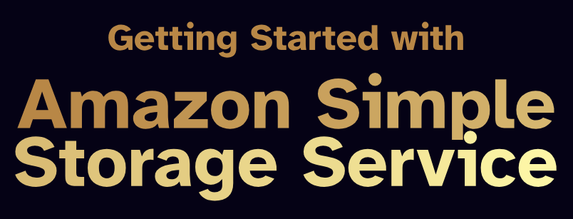

# Getting Started with Amazon Simple Storage Service   

### Repository: [course](../../../)   
### Platform: <a href="../../">aws_skill_builder   </a>
### Software/Subject: <a href="../">aws   </a>
### Course: <a href="./">curso_125 (Getting Started with Amazon Simple Storage Service)   </a>

#### <a href="https://github.com/PedroHeeger/main/blob/main/cert_ti/04-curso/cloud/aws/(24-10-14)_Getting_Started...Amazon_S3_PH_AWSSB.pdf">Certificate</a>

---

### Theme:
- Cloud Computing

### Used Tools:
- Operating System (OS): 
  - Windows 11   
- Cloud:
  - Amazon Web Services (AWS)   
- Cloud Services:
  - Amazon Simple Storage Service (S3)   
  - Google Drive   
- Language:
  - HTML   
  - Markdown   
- Integrated Development Environment (IDE) and Text Editor:
  - Visual Studio Code (VS Code)   
- Versioning: 
  - Git   
- Repository:
  - GitHub   

---

<a name="item0"><h3>Course Strcuture:</h3></a>
1. Getting Started with Amazon Simple Storage Service (Amazon S3) (Portuguese) 
1.1 <a href="#item01.1">Fundamentos do Amazon S3</a> 
1.2 <a href="#item01.2">Segurança e Gerenciamento de Dados</a> 

---

### Objective:
Este curso oferece o conhecimento essencial para iniciar o uso do **Amazon Simple Storage Service (Amazon S3)**. Foram abordados os principais componentes do serviço e a configuração adequada dos mesmos. O conteúdo também incluiu o processo de upload de dados no **Amazon S3** e a utilização de outros serviços da **Amazon Web Services (AWS)** para transferências em grande escala. Além disso, foram explorados os fundamentos de segurança no **Amazon S3**. Por fim, foi analisada a integração do **Amazon S3** com outros serviços, em diferentes cenários de aplicação. Os objetivos específicos incluíram:
- Descrever os componentes essenciais de uma implementação do **Amazon S3**;
- Detalhar as ferramentas e operações disponíveis para interação com o **Amazon S3**;
- Explicar os requisitos e limitações envolvidos no upload de dados para o **Amazon S3**;
- Criar um bucket no **Amazon S3** e realizar o upload de objetos;
- Apresentar os principais mecanismos de controle de acesso e segurança no **Amazon S3**;
- Implementar o bloqueio de acesso público a um bucket do S3;
- Descrever as integrações mais importantes do **Amazon S3** com outros serviços em cenários de uso específicos.

### Structure:
A estrutura do curso é formada por:
- Este arquivo de README.
- A pasta `0-aux`, pasta auxiliar com imagens utilizadas na construção desse arquivo de README. 

### Development:

<a name="item01.1"><h4>Fundamentos do Amazon S3</h4></a>[Back to summary](#item0)

O **Amazon S3** é uma solução de armazenamento na Internet projetada para facilitar a computação em escala na Web, atendendo tanto desenvolvedores quanto usuários. Trata-se de uma plataforma de armazenamento de objetos que permite armazenar e recuperar qualquer quantidade de dados, em qualquer momento e lugar da Web. Embora o conceito de armazenamento seja familiar, é importante destacar que existem diferentes tipos de armazenamento. O **Amazon S3** se baseia no modelo de armazenamento de objetos. Para compreender melhor esse modelo e suas diferenças em relação a outros tipos, é essencial explorar os distintos métodos de armazenamento:
- Armazenamento em bloco: Refere-se a um conjunto de bytes ou bits em um dispositivo de armazenamento. Os arquivos são divididos em blocos, que recebem identificadores únicos e são gravados em espaços vazios no disco. Esses blocos podem ser distribuídos entre vários discos ou ambientes, permitindo que blocos específicos sejam recuperados sem a necessidade de acessar o arquivo completo. Esse modelo é ideal para bancos de dados relacionais, nos quais, muitas vezes, é necessário acessar apenas uma parte específica de um arquivo, como um número de rastreamento de inventário ou um ID de funcionário.
- Armazenamento de arquivos: Historicamente, os sistemas operacionais organizam dados em sistemas de arquivos hierárquicos, compostos por diretórios, subdiretórios e arquivos (ou pastas e subpastas, dependendo do sistema). Por exemplo, em uma distribuição **Linux**, pode ser necessário procurar arquivos em diretórios como /var/log ou /etc/config. Nesse tipo de armazenamento, é preciso conhecer o caminho exato dos arquivos ou dispor de uma forma eficiente de pesquisa para localizá-los.
- Armazenamento de objetos: Diferentemente da estrutura hierárquica do armazenamento de arquivos, o armazenamento de objetos utiliza uma estrutura simples, onde os dados (objetos) são armazenados em um repositório único chamado bucket. Embora seja possível organizar os dados de maneira visual com o uso de prefixos e delimitadores de nomes de chave, dando a aparência de uma estrutura de pastas e subpastas na interface do usuário, a estrutura subjacente continua sendo simples e plana.

O **Amazon S3** é um serviço de armazenamento de objetos que oferece escalabilidade líder no mercado, alta disponibilidade de dados, segurança e desempenho. Foi projetado de forma intencional com um conjunto mínimo de funcionalidades, focando na simplicidade e robustez. A mesma infraestrutura de armazenamento de dados extremamente escalável, confiável, segura, rápida e econômica utilizada pela **Amazon** em sua rede global de sites está disponível para os usuários. O objetivo do serviço é maximizar os benefícios da escala e repassar essas vantagens aos clientes.

O armazenamento de objetos utiliza uma estrutura simples em que os dados, chamados objetos, são armazenados em buckets. Todos os dados dentro de um bucket são considerados objetos. No **Amazon S3**, é possível criar uma pseudoestrutura de pastas utilizando prefixos e delimitadores de nomes de chave, permitindo organizar e agrupar objetos de forma semelhante a uma hierarquia. Isso facilita a visualização e a recuperação dos dados na interface do usuário, onde os prefixos criam a aparência de uma estrutura de pastas e subpastas, embora o armazenamento em si permaneça simples e sem hierarquia real.

Buckets são contêineres permanentes que armazenam objetos no **Amazon S3**. Cada conta da **AWS** pode criar entre 1 e 100 buckets, com a possibilidade de solicitar um aumento desse limite para até 1.000 buckets. O tamanho dos buckets é virtualmente ilimitado, não sendo necessário definir um tamanho específico ao criá-los, como ocorre com volumes ou partições. Um bucket do **Amazon S3** é uma opção de armazenamento versátil, capaz de hospedar sites estáticos, manter o controle de versões dos objetos e aplicar políticas de ciclo de vida para equilibrar a retenção de dados com o tamanho e o custo do armazenamento. Antes de criar um bucket, é importante considerar algumas restrições e limitações:
- Propriedade do Bucket: O bucket pertence à conta **AWS** que o cria e não pode ser transferido para outra conta.
- Nomes de Buckets: Os nomes precisam ser globalmente únicos em toda a infraestrutura do S3, sem duplicatas.
- Renomear Buckets: Após a criação, o nome de um bucket não pode ser alterado.
- Entidades Permanentes: Buckets são permanentes e só podem ser removidos quando estiverem vazios. Após a exclusão, o nome do bucket se torna disponível para reutilização por qualquer conta depois de 24 horas, caso não seja utilizado por outra conta.
- Limites de Armazenamento de Objetos: Não há limite para o número de objetos que podem ser armazenados em um bucket. É possível armazenar todos os objetos em um único bucket ou distribuí-los em vários, mas não é permitido criar buckets dentro de outros buckets (aninhamento de buckets).
- Limite de Criação de Buckets: O limite padrão é de 100 buckets por conta, podendo ser ampliado para até 1.000 mediante solicitação de aumento de limite.

Ao nomear buckets no **Amazon S3**, é importante planejar cuidadosamente a estrutura dos nomes e seu uso. O bucket será utilizado apenas para armazenamento de dados ou também para hospedar um site estático? Os nomes dos buckets são essenciais no S3 e variam de acordo com sua finalidade. Como os nomes de bucket são globalmente visíveis, eles precisam estar em conformidade com o padrão DNS. Isso influencia o formato da URL do bucket, que segue o padrão: nome-do-bucket/endpoint da região, como em `https://my-s3bucket.s3.amazonaws.com/` Algumas regras devem ser observadas ao definir os nomes dos buckets:
- Devem ser exclusivos em toda a infraestrutura do **Amazon S3**;
- O comprimento deve variar entre 3 e 63 caracteres;
- Devem conter apenas letras minúsculas, números, pontos (.) e hífens (-);
- Precisam começar com uma letra minúscula ou um número;
- Não podem começar com o prefixo "xn--" (desde fevereiro de 2020);
- Não podem estar formatados como endereços IP (exemplo: 198.68.10.2);
- O uso de pontos (.) no nome do bucket deve ser restrito a buckets destinados à hospedagem de sites estáticos no **Amazon S3**; caso contrário, o ponto não deve ser utilizado.

O **Amazon S3** é um sistema de armazenamento de objetos que utiliza chaves exclusivas para armazenar qualquer quantidade de objetos. Esses objetos são organizados em buckets, e cada objeto pode ter até 5 TB de tamanho. Um objeto no S3 é composto pelos seguintes elementos: chave, ID da versão, valor, metadados e informações de controle de acesso.
- Objeto: Refere-se ao arquivo armazenado no S3, junto com todos os metadados que o descrevem. Ao armazenar um arquivo, é possível definir permissões tanto no arquivo quanto nos metadados associados.
- Chave: A chave é o identificador exclusivo de um objeto dentro de um bucket. No **Amazon S3**, não existe uma hierarquia de diretórios real, mas prefixos e delimitadores podem ser usados para simular uma estrutura de pastas ao visualizar os objetos pelo console do S3. Na prática, trata-se apenas de um nome de chave longo.
- ID da versão: O versionamento no S3 permite manter múltiplas versões de um objeto. Quando habilitado, o S3 gera automaticamente um ID exclusivo para cada versão de um objeto. Isso é útil para preservar, recuperar e restaurar versões anteriores de arquivos e proteger contra operações acidentais.
- Valor: Refere-se ao conteúdo real do objeto, que pode ser qualquer sequência de bytes, variando de 0 a 5 TB de tamanho.
- Metadados: São informações adicionais associadas a um objeto. Existem dois tipos de metadados no S3:
  - Metadados de sistema, controlados pelo S3, como a data de criação e o tamanho do objeto.
  - Metadados controlados pelo usuário, como a classe de armazenamento e configurações de criptografia.
- Controle de acesso: O S3 permite o controle detalhado de quem pode acessar os objetos por meio de políticas baseadas em recursos (como ACLs e políticas de bucket) e políticas baseadas em usuário (IAM Policies).

Uma tag é um rótulo que é atribuído a um recurso da **AWS**, composto por uma chave e um valor opcional, definidos para atender às necessidades da sua empresa. No **Amazon S3**, as tags são pares de chave-valor aplicáveis a um bucket ou a objetos individuais, facilitando a identificação, pesquisa e categorização de dados. O uso de tags para os objetos permite gerenciar efetivamente o armazenamento e fornecer insights sobre como os dados são usados. As tags recém-criadas atribuídas a um bucket não são aplicadas retroativamente aos objetos filhos existentes. Existem dois tipos de tags:
- Tags de Bucket: São usadas para rastrear o custo de armazenamento e outras métricas ao associar tags de alocação de custos a buckets do S3. Essas tags ajudam a segmentar os custos no relatório de alocação de custos da **AWS**, mas são aplicáveis apenas a buckets, e não a objetos individuais.
- Conjunto de Tags de Bucket: Cada bucket pode ter um conjunto de até 50 tags. As chaves dentro desse conjunto precisam ser únicas, mas os valores podem se repetir. Por exemplo, o valor "ocean-life" pode aparecer em chaves diferentes, como project/ocean-life e topic/ocean-life. No entanto, uma chave duplicada resultaria em erro.
- Tags de Objetos: Permitem categorizar e consultar objetos no **Amazon S3**. As tags podem ser adicionadas durante ou após o upload de um objeto, com até 10 tags por objeto. As chaves podem ter até 128 caracteres e os valores, até 255. As tags diferenciam maiúsculas de minúsculas e seguem as regras de exclusividade de chave para o mesmo objeto.

A **AWS** oferece dois tipos de tags de alocação de custos:
- Tag gerada pela **AWS**: A **AWS** cria e aplica automaticamente a tag `createdBy` após um evento de criação de bucket (CreateBucket) no **Amazon S3**. Essa tag é gerada e gerida pela própria **AWS**.
- Tag definida pelo usuário: Essas tags são definidas, criadas e aplicadas ao bucket do S3 conforme as necessidades específicas de alocação de custos.

Após a criação das tags definidas pelo usuário, é necessário ativá-las no console de Billing and Cost Management. Elas aparecem no **AWS Cost Explorer**, **AWS Budgets**, **AWS Cost and Usage Reports** ou nos relatórios legados, permitindo o acompanhamento da alocação de custos dos recursos da **AWS** com base nas tags associadas. Essas tags são úteis para monitorar o uso e os custos dos serviços da **AWS**, oferecendo maior transparência e controle sobre os gastos.

Dentre os benefícios do uso das tags, destacam-se:
- Controle de Acesso Refinado: As tags de objeto permitem um controle de acesso detalhado sobre as permissões. Por exemplo, é possível conceder a um usuário do IAM permissão de somente leitura para objetos que possuam tags específicas.
- Gerenciamento do Ciclo de Vida: As tags de objeto possibilitam um gerenciamento mais preciso do ciclo de vida dos objetos. É viável especificar um filtro baseado em tag, além de um prefixo de nome de chave, em uma regra de ciclo de vida.
- Análise do **Amazon S3**: Ao utilizar a análise do **Amazon S3**, é possível configurar filtros para agrupar objetos para análise com base em tags de objeto, prefixo de nome de chave ou uma combinação de ambos.
- Personalização de Métricas no CloudWatch: As métricas do **Amazon CloudWatch** podem ser personalizadas para exibir informações utilizando filtros de tags específicos.

Operações de API de Objeto para Marcação: Com a marcação do **Amazon S3**, para adicionar ou substituir uma tag em um conjunto de tags (todas as tags associadas a um objeto ou bucket), é necessário fazer o download de todas as tags, modificar as tags desejadas e, em seguida, substituir todas as tags de uma só vez.

O **Amazon S3** é um serviço visível globalmente. Isso significa que, no Console de Gerenciamento da **AWS**, não é necessário especificar uma região para exibir os buckets. No entanto, ao criar um bucket inicialmente, é necessário escolher uma região para indicar onde os dados do bucket devem residir. A região escolhida deve ser local em relação aos usuários ou consumidores para otimizar a latência, minimizar custos ou atender aos requisitos regulatórios. Por exemplo, se houver residência na Europa, é recomendado criar buckets nas regiões Europa (Irlanda) ou Europa (Frankfurt), em vez de criar buckets na Ásia-Pacífico (Sydney) ou na América do Sul (São Paulo). Dessa forma, os dados estarão mais próximos dos usuários e consumidores, reduzindo a latência, garantindo regulamentação e atendendo aos requisitos legais do país.
- Replicação entre regiões (CRR — Cross-Region Replication): Se for necessário ter dados armazenados em várias regiões, é possível replicar o bucket para outras regiões usando a replicação entre regiões. Isso permite copiar automaticamente objetos de um bucket em uma região para um bucket diferente em outra região separada. É possível replicar todo o bucket ou usar tags para replicar somente os objetos com as tags escolhidas.
- Replicação para a mesma região (SRR — Same-Region Replication): O **Amazon S3** aceita a replicação automática e assíncrona de objetos do S3 carregados recentemente em um bucket de destino na mesma região da **AWS**. A SRR cria outra cópia dos objetos do S3 dentro da mesma região da **AWS**, mantendo a mesma redundância da categoria de armazenamento de destino. Isso permite agregar automaticamente logs de buckets diferentes do S3 para processamento na região ou configurar a replicação em tempo real entre ambientes de teste e desenvolvimento. A SRR ajuda a cumprir requisitos de soberania e conformidade de dados ao manter uma cópia dos objetos na mesma região da **AWS** que o original.

O **Amazon S3** pode ser utilizado para hospedar um site estático. Em um site estático, as páginas da Web individuais contêm apenas conteúdo que não muda com frequência, ao contrário de um site dinâmico, onde o conteúdo é atualizado constantemente. No Console de Gerenciamento da **AWS**, a configuração do bucket para hospedagem de sites estáticos pode ser realizada facilmente, sem a necessidade de escrever código. Para hospedar um site estático no **Amazon S3**, é necessário configurar um bucket para essa finalidade e fazer upload do conteúdo. Ao configurar um bucket como um site estático, é importante habilitar a hospedagem de sites, definir permissões de leitura pública e criar um documento de índice. Dependendo das necessidades do site, também é possível configurar redirecionamentos, registro em log do tráfego da web e um documento de erro personalizado. Para aqueles que preferem não usar o Console de Gerenciamento da **AWS**, a configuração do site pode ser criada, atualizada e excluída programaticamente utilizando os SDKs da **AWS**.

Para garantir a melhor compatibilidade, recomenda-se evitar o uso de pontos (.) em nomes de bucket, exceto ao usar buckets para hospedagem de sites estáticos. Incluir pontos em um nome de bucket que não seja para um site estático impede o uso do endereçamento no estilo host virtual por HTTPS, a menos que a validação de certificado própria seja realizada. Isso se deve ao fato de que os certificados de segurança utilizados para hospedagem virtual de buckets não funcionam para buckets com pontos nos nomes. A hospedagem virtual é a prática de atender a vários sites a partir de um único servidor web.

Após a criação de um bucket, existem várias maneiras de adicionar, substituir ou recuperar objetos no bucket do **Amazon S3**. As três principais ferramentas para interagir com buckets são o Console da **AWS**, a Interface de Linha de Comando (CLI) da **AWS** e o Kit de Desenvolvimento de Software (SDK) da **AWS**. Cada uma dessas ferramentas permite trabalhar com os dados de acordo com as preferências e necessidades do usuário.
- **AWS Management Console**: O Console de Gerenciamento da **AWS** oferece uma interface web simples para interagir com os serviços da **AWS**. É necessário fazer login utilizando o nome da conta e a senha da **AWS**. Se a autenticação multifatorial estiver habilitada, será solicitado o código de autenticação do dispositivo. Com o Console de Gerenciamento da **AWS** para **Amazon S3**, é possível visualizar buckets e objetos, realizar uploads e downloads de dados, além de gerenciar permissões e segurança por meio da interface gráfica. Quase todas as operações de bucket podem ser executadas sem necessidade de escrever código. Ao fazer upload de dados pelo Console, o arquivo máximo permitido é de 160 GB. Para arquivos maiores que esse limite, é recomendado utilizar a **AWS CLI**, o SDK da **AWS** ou a API REST do **Amazon S3**.
- **AWS Command Line Interface (AWS CLI)**: A CLI da **AWS** é uma ferramenta unificada para gerenciar os serviços da **AWS**. É ideal para gerenciar dados, buckets e objetos do **Amazon S3**, especialmente para usuários que preferem ou precisam da funcionalidade da linha de comando. É possível fazer upload, download e gerenciar objetos manualmente utilizando os comandos da **AWS CLI** ou automatizar processos através de scripts.
- **AWS Software Development Kit (AWS SDK)**: O SDK da **AWS** simplifica a codificação ao fornecer bibliotecas específicas para diferentes linguagens de programação, facilitando a criação de aplicações na **AWS**. O uso do **Amazon S3** pode ser simplificado nas aplicações através da API adequada para a linguagem de programação ou plataforma escolhida. É possível enviar solicitações autenticadas ao **Amazon S3** utilizando o SDK da **AWS** ou realizando chamadas de API REST diretamente nas aplicações. Diversos SDKs estão disponíveis, permitindo desenvolver soluções conforme necessário para o **Amazon S3**.

A API REST é uma interface HTTP para o **Amazon S3**. Com essa API, é possível utilizar solicitações HTTP padrão para criar, buscar e excluir buckets e objetos. Qualquer toolkit que suporte HTTP pode ser utilizado com a API REST, inclusive navegadores, desde que os objetos possam ser lidos anonimamente. O **Amazon S3** disponibiliza a API REST, permitindo que objetos e buckets sejam considerados recursos, cada um identificado por um URL único. Os modelos de endereçamento são URLs que definem a forma de localizar dados em um bucket do S3, e o **Amazon S3** oferece suporte a dois tipos: URLs de caminho e URLs de hospedagem virtual.
- URLs de caminho: Nesses URLs, o nome do bucket é colocado após o endpoint global ou específico da região. A formatação do URL segue o padrão: `https://region-specific-endpoint/bucket/object`. O bucket é sempre um subdomínio de `s3.amazonaws.com`, e quando o DNS resolve esse URL, o endpoint será um subdomínio de s3.amazonaws.com. Importante ressaltar que, com URLs de caminho, várias contas de diferentes empresas e proprietários mapeiam para este único subdomínio, `s3.amazonaws.com`. Para um URL personalizado, recomenda-se optar por URLs hospedadas virtualmente. Vale mencionar que existe um plano de descontinuação para URLs de caminho em buckets recém-criados. Embora o suporte continue para URLs de caminho criadas anteriormente, uma vez que esse recurso seja obsoleto, a criação de novas URLs de caminho não será mais possível. Essas informações devem ser consideradas ao planejar o futuro do ambiente.
- Hospedagem virtual: é a prática de atender vários sites a partir de um único servidor web. Uma forma de diferenciar sites é através do nome do host (nome do bucket) da solicitação. Em um URL de hospedagem virtual, o nome do bucket faz parte do nome de domínio, o que o torna mais legível e amigável ao usuário final, no qual a formatação segue o padrão: `https://bucket.region-specific-endpoint/object`. Além disso, a hospedagem virtual apresenta outros benefícios. É possível personalizar completamente a URL dos recursos do **Amazon S3** nomeando o bucket após o nome de domínio registrado, tornando esse nome um alias DNS para o **Amazon S3**. Por exemplo, um URL personalizado para um curso de introdução poderia ser: `http://getting-started-with-s3.net/`. A hospedagem virtual também permite a publicação no “diretório raiz” do servidor virtual do bucket, um recurso importante que possibilita que aplicativos pesquisem arquivos em um local padronizado do diretório raiz. Ao utilizar buckets no estilo de hospedagem virtual com SSL, o certificado curinga SSL apenas corresponde a buckets que não contêm pontos (.). Para contornar essa limitação, recomenda-se não utilizar pontos (.) em nomes de buckets ou utilizar HTTP para implementar uma lógica própria de verificação de certificado.

O **Amazon S3** usa o Sistema de Nomes de Domínio (DNS — Domain Name System) para rotear solicitações para instalações capazes de processá-las. Esse sistema funciona com eficiência, mas podem ocorrer erros de roteamento temporários. Se uma solicitação chega na localização errada do **Amazon S3**, ele responde com um redirecionamento temporário pedindo que o solicitante reenvie a solicitação para um novo endpoint. Se uma solicitação é formada de maneira incorreta, o **Amazon S3** usa redirecionamentos constantes para fornecer direções sobre como executar a solicitação corretamente. Observe o passo a passo o roteamento de uma solicitação DNS hipotética:
- O cliente está fazendo uma solicitação para recuperar o objeto dolphins.jpg.
- O cliente deseja visualizar o objeto dolphins.jpg armazenado no **Amazon S3**. O cliente faz uma solicitação de DNS para obter o endereço de s3.amazonaws.com (`https://getting-started-with-s3.s3.amazonaws.com/dolphins.jpg`); 
- O cliente recebe um ou mais endereços IP para instalações capazes de processar a solicitação. Neste exemplo, o endereço IP é para o Servidor B; 
- O cliente faz uma solicitação para a Instalação B do **Amazon S3**; 
- O Servidor B retorna uma cópia do objeto dolphin.jpg para o cliente.

Um dos requisitos de design do **Amazon S3** é garantir uma disponibilidade extremamente alta. Uma das formas de atender a esse requisito é atualizando os endereços IP associados ao endpoint do **Amazon S3** no DNS, conforme necessário. Devido à natureza distribuída do **Amazon S3**, as solicitações podem, em alguns casos, ser temporariamente direcionadas para a região errada, especialmente logo após a criação ou exclusão de buckets. Um redirecionamento temporário é um tipo de resposta de erro que indica que o solicitante deve reenviar a solicitação para um endpoint diferente. Por exemplo, se um bucket recém-criado for acessado imediatamente após sua criação, pode ocorrer um redirecionamento temporário, dependendo da localização do bucket. Se o bucket foi criado na região Leste dos EUA (Norte da Virgínia), não haverá redirecionamento, pois essa é também o endpoint padrão do **Amazon S3**. No entanto, se o bucket foi criado em qualquer outra região da **AWS**, todas as solicitações para esse bucket serão encaminhadas para o endpoint padrão até que a entrada DNS do bucket seja totalmente propagada. O endpoint padrão, nesse caso, redireciona a solicitação para o endpoint correto, retornando uma resposta HTTP 302. Esses redirecionamentos temporários incluem um URI que aponta para a região correta, permitindo que a solicitação seja reenviada imediatamente. Aqui está um exemplo do passo a passo de um redirecionamento temporário de DNS hipotético:
- O cliente faz uma solicitação de DNS para obter o objeto dolphin.jpg armazenado no **Amazon S3**;
- O cliente recebe um endereço IP de uma região que pode processar a solicitação. Neste exemplo, o IP retornado é 192.168.7.52; 
- O cliente faz uma solicitação para a Região B do **Amazon S3**, localizada em 192.168.7.52; 
- A Região B retorna um redirecionamento indicando que o objeto está disponível no Local D, em 192.168.7.54;
- O cliente reenvia a solicitação para a Região D, em 192.168.7.54;
- A Região D retorna uma cópia do objeto solicitado.

<a name="item01.2"><h4>Segurança e Gerenciamento de Dados</h4></a>[Back to summary](#item0)

O **Amazon S3** oferece consistência forte de leitura após gravação para todas as solicitações de armazenamento, sem comprometer o desempenho, a disponibilidade ou o isolamento regional dos aplicativos, e sem custo adicional. Isso significa que, após uma gravação bem-sucedida de um novo objeto ou a substituição de um objeto existente, qualquer solicitação de leitura subsequente acessará imediatamente a versão mais recente do objeto. Além disso, o **Amazon S3** também proporciona consistência forte para operações de listagem, permitindo que as alterações nos objetos sejam refletidas imediatamente após a gravação ao realizar listagens no bucket.

Anteriormente, o modelo de consistência do **Amazon S3** era fortemente consistente para novos objetos, mas apenas eventualmente consistente para objetos modificados ou consultados recentemente. Com o aumento do uso de data lakes e processos de análise que exigem acesso rápido a dados atualizados, o modelo de consistência forte de leitura após gravação foi implementado para atender essas demandas. Esse recurso está disponível para solicitações como GET, PUT, LIST, HEAD, além de Listas de Controle de Acesso, tags de objeto e outros metadados, sem custos adicionais. No entanto, para operações de bucket, como leitura de políticas de bucket ou metadados, o modelo de consistência permanece eventualmente consistente.

O Console de Gerenciamento da **AWS** é uma interface gráfica que permite ativar ou desativar o versionamento, visualizar logs de acesso, gerenciar permissões e criptografia, além de controlar todos os aspectos de buckets e objetos por meio de uma interface amigável. Oferece recursos seguros de login e gerenciamento com as credenciais da conta **AWS** ou do **AWS Identity and Access Management (AWS IAM)**, e possibilita a habilitação da *AWS Multi-Factor Authentication* para segurança adicional. A experiência no Console pode ser personalizada criando atalhos para os serviços mais utilizados, como o **Amazon S3**, por meio de uma função de arrastar e soltar na barra de ferramentas superior. Sessões de login não encerradas expiram automaticamente após 12 horas. O console é compatível com as três versões mais recentes dos navegadores **Google Chrome**, **Mozilla Firefox**, **Microsoft Edge**, **Apple Safari** e com o *Microsoft Internet Explorer 11*. Além disso, o Console de Gerenciamento da **AWS** conta com um aplicativo móvel, que permite visualizar facilmente buckets e objetos existentes, bem como realizar tarefas operacionais.

Explorar o **Amazon S3** através do console oferece a oportunidade de visualizar buckets e objetos, além de acessar as opções de configuração disponíveis. A maior parte da administração e do armazenamento do **Amazon S3** pode ser realizada pelo console, embora haja algumas limitações. Por exemplo, o tamanho máximo de arquivo que pode ser carregado por meio do Console de Gerenciamento da **AWS** é de 160 GB. Arquivos maiores que esse valor precisam ser carregados programaticamente via linha de comando ou a partir de aplicativos. O console também possibilita a gestão de propriedades de dados, como a habilitação do versionamento em buckets.

O versionamento é uma funcionalidade que permite manter múltiplas versões de um objeto dentro do mesmo bucket. Ele pode ser utilizado para preservar, recuperar e restaurar todas as versões de cada objeto armazenado no bucket do **Amazon S3**. Com o versionamento, é possível se recuperar de ações não intencionais de usuários e de falhas em aplicações. Caso o **Amazon S3** receba várias solicitações simultâneas de gravação para o mesmo objeto e o versionamento esteja habilitado, ele armazenará todas essas versões. Ao ativar o versionamento em um bucket, o **Amazon S3** gera automaticamente um ID de versão exclusivo para cada objeto armazenado. Por exemplo, dois objetos com a mesma chave, como dolphins.jpg, podem ter IDs de versão diferentes, como dolphins.jpg (versão 111111) e dolphins.jpg (versão 222222).

Em buckets com versionamento habilitado, é possível recuperar objetos após exclusão ou substituição acidental. Se um objeto for excluído, em vez de ser removido permanentemente, o **Amazon S3** criará um marcador de exclusão, que se tornará a versão atual do objeto, permitindo a restauração de uma versão anterior. Caso um objeto seja substituído, uma nova versão será criada no bucket, e também será possível restaurar versões anteriores conforme necessário.

No **Amazon S3**, os comandos disponíveis na CLI são classificados em dois tipos: comandos de alto nível e de baixo nível.
- Comandos de alto nível: Simplificam o gerenciamento de objetos no **Amazon S3** a partir da linha de comando, permitindo a manipulação tanto de objetos dentro do S3 quanto de diretórios locais. Esses comandos são identificados pelo prefixo `aws s3`.
- Comandos de baixo nível: Usam o conjunto de comandos s3api, fornecendo acesso direto às APIs do **Amazon S3**. Eles permitem a execução de operações que não estão disponíveis nos comandos de alto nível s3. A maioria dos comandos s3api é gerada a partir de modelos JSON, refletindo diretamente as APIs de outros serviços da **AWS** que oferecem acesso ao nível da API.

A operação de solicitação PUT é utilizada para adicionar um objeto a um bucket no **Amazon S3**. Para isso, é necessário ter permissões de gravação (WRITE) no bucket. O **Amazon S3** garante que nunca adiciona objetos parcialmente; uma resposta bem-sucedida indica que o objeto foi armazenado de forma durável. Caso o objeto já exista no bucket, ele será substituído pelo novo. O **Amazon S3** processa todas as solicitações recebidas, mas se duas solicitações forem enviadas quase simultaneamente, elas podem ser processadas em uma ordem diferente daquela em que foram enviadas. A última solicitação processada é a que prevalece. Isso significa que, em cenários onde várias partes estão escrevendo para o mesmo objeto ao mesmo tempo, todas podem receber respostas bem-sucedidas, mas apenas a última gravação será mantida. Isso ocorre devido à natureza distribuída do **Amazon S3**, onde pode haver um pequeno atraso para que o sistema informe uma atualização de objeto recebida.

Para fazer upload ou copiar objetos de até 5 GB, uma única operação PUT pode ser utilizada. No entanto, para objetos maiores, com até 5 TB, é necessário usar a API de carregamento fracionado (Multipart Upload). Essa API permite que um único objeto seja carregado em várias partes, que são segmentos contínuos de dados do objeto. Essas partes podem ser enviadas de maneira independente e em qualquer ordem. O uso de carregamentos fracionados facilita a transmissão de objetos grandes ao dividir o objeto em partes menores, o que melhora a taxa de transferência. Caso a transmissão de alguma parte falhe, apenas essa parte precisa ser retransmitida, sem a necessidade de reenviar o objeto inteiro. Após o envio de todas as partes, o **Amazon S3** as monta para criar o objeto final. O uso de carregamento fracionado é recomendado quando o objeto atinge ou ultrapassa 100 MB. As principais vantagens incluem:
- Melhora na taxa de transferência: partes podem ser enviadas em paralelo, aumentando a eficiência.
- Recuperação rápida de falhas: partes menores minimizam o impacto de falhas na rede, permitindo a retransmissão apenas das partes afetadas.
- Pausar e retomar uploads: o upload de partes pode ser distribuído ao longo do tempo, sem expiração automática, desde que o upload seja concluído ou cancelado explicitamente.
- Iniciar o upload sem saber o tamanho final do objeto: é possível iniciar o upload enquanto o objeto ainda está sendo criado.

Ao utilizar uploads fracionados, o **Amazon S3** armazena todas as partes do upload no servidor até que o processo seja concluído ou interrompido. Para evitar custos desnecessários com o armazenamento de uploads incompletos, é importante garantir que esses processos sejam finalizados ou abortados. Uma maneira eficaz de gerenciar isso é por meio de regras de ciclo de vida do **Amazon S3**. Essas regras são definidas em um arquivo XML que especifica ações predefinidas que o **Amazon S3** deve executar em objetos ao longo de sua vida útil. Recomenda-se a configuração de uma regra de ciclo de vida utilizando a ação `AbortIncompleteMultipartUpload`, o que ajuda a minimizar os custos de armazenamento ao limpar automaticamente uploads fracionados incompletos. Essa prática é importante, mesmo que não esteja certo se serão realizados uploads fracionados, pois alguns aplicativos podem, por padrão, usar essa funcionalidade ao fazer upload de arquivos maiores. Além disso, uploads interrompidos ou falhados podem gerar custos de armazenamento elevados se não forem devidamente gerenciados.

A operação GET permite a recuperação de um objeto completo ou de partes específicas de um objeto diretamente do **Amazon S3**. Para recuperar um objeto em partes, é possível utilizar o cabeçalho HTTP Range em uma solicitação GET, o que possibilita acessar um intervalo específico de bytes de um objeto armazenado. Essa abordagem facilita a continuação do download de outras partes do objeto conforme necessário, sendo especialmente útil em situações de conectividade de rede instável ou quando o aplicativo requer o processamento apenas de subconjuntos dos dados do objeto.

A operação de exclusão permite excluir um único objeto ou vários objetos em uma única solicitação. O resultado da solicitação DELETE varia dependendo do estado de versionamento do bucket:
- Versionamento não habilitado: Quando um bucket não possui o versionamento ativado, a exclusão de um objeto ocorre permanentemente ao especificar o nome da chave do objeto. Nesse caso, o objeto é removido do bucket, tornando-se irrecuperável.
- Versionamento habilitado - Exclusões permanentes: Se o bucket estiver habilitado para versionamento, é possível excluir permanentemente um objeto ou criar um marcador de exclusão para torná-lo recuperável. Para excluir permanentemente uma versão específica de um objeto, é necessário invocar a solicitação DELETE com a chave e o ID da versão do objeto. Para remover completamente um objeto do bucket, todas as versões individuais devem ser excluídas.
- Versionamento habilitado - Exclusões recuperáveis: Se a solicitação DELETE especificar apenas o nome da chave do objeto, o **Amazon S3** insere um marcador de exclusão, que se torna a versão atual do objeto. Caso seja feita uma tentativa de recuperar um objeto com um marcador de exclusão, o **Amazon S3** retornará um erro 404 (NOT FOUND). Para recuperar o objeto, é necessário remover o marcador de exclusão da versão atual, tornando o objeto disponível novamente.

Os dados constituem a base para implantações bem-sucedidas de aplicativos, fluxos de trabalho analíticos e inovações em machine learning. Ao transferir dados para a nuvem, é essencial compreender os diferentes casos de uso, os tipos de dados a serem movidos e os recursos de rede disponíveis. A **AWS** oferece uma ampla gama de serviços e ferramentas de parceiros que auxiliam na migração de conjuntos de dados, incluindo arquivos, bancos de dados, imagens de máquinas, volumes de blocos e backups em fita. O portfólio de serviços de transferência de dados proporciona soluções ideais para qualquer projeto de migração. O nível de conectividade online é um fator crucial nesse processo, e a **AWS** disponibiliza produtos que atendem às necessidades de armazenamento em nuvem híbrida, transferência de dados online e offline.

Os serviços de transferência de dados online formam um conjunto de soluções que permitem mover dados para dentro e para fora da Nuvem **AWS** e do **Amazon S3** por meio de conexões online baseadas na Internet.
- **AWS DataSync**: O **AWS DataSync** simplifica e acelera a transferência de grandes volumes de dados entre o armazenamento on-premises e o **Amazon S3**. Ele gerencia tarefas relacionadas a transferências que podem retardar as migrações, como execução de instâncias, manipulação de criptografia, gerenciamento de scripts e validação da integridade dos dados. O DataSync pode transferir centenas de terabytes e milhões de arquivos a velocidades até 10 vezes mais rápidas do que ferramentas de código aberto, permitindo a migração de conjuntos de dados ativos para a **AWS**, transferência para análises e processamento ou replicação para arquivamento e continuidade dos negócios.
- **AWS Transfer Family**: A **AWS Transfer Family** oferece compatibilidade gerenciada para transferências de arquivos diretas (exportação/importação) no **Amazon S3**. Esse serviço facilita a migração de fluxos de trabalho de transferência de arquivos para a **AWS**, integrando-se a sistemas de autenticação existentes e fornecendo roteamento de DNS com o **Amazon Route 53**, mantendo a experiência inalterada para clientes e parceiros. Com os dados no **Amazon S3**, eles podem ser utilizados com serviços da **AWS** para processamento, análise, machine learning e arquivamento.
- **Amazon S3 Transfer Acceleration**: O **Amazon S3 Transfer Acceleration** permite transferências rápidas, fáceis e seguras de arquivos em longas distâncias. Utilizando os pontos de presença globalmente distribuídos do **Amazon CloudFront**, ele roteia dados para o **Amazon S3** através de um caminho de rede otimizado. É especialmente útil para transferências para um local centralizado ao redor do mundo ou para transferências regulares de grandes volumes de dados entre continentes, ajudando a maximizar a largura de banda disponível durante uploads para o **Amazon S3**.
- **Amazon Kinesis Data Firehose**: O **Amazon Kinesis Data Firehose** possibilita a transmissão de dados para o **Amazon S3** como um serviço de streaming totalmente gerenciado. Ele captura e carrega automaticamente dados de streaming no **Amazon S3** e no **Amazon Redshift**, permitindo análises quase em tempo real com as ferramentas de business intelligence já em uso.
- **Amazon Kinesis Data Streams (Amazon KDS)**: O **Amazon Kinesis Data Streams (Amazon KDS)** permite a criação de aplicativos personalizados para processar ou analisar dados de streaming conforme necessidades específicas. O Kinesis Data Streams pode capturar e armazenar continuamente terabytes de dados por hora de diversas fontes, como clickstreams de websites, transações financeiras, feeds de mídia social e logs de TI. Os dados podem ser enviados do Kinesis Data Streams para outros serviços da **AWS**, como **Amazon S3**, **Amazon Redshift**, **Amazon EMR** e **AWS Lambda**.
- Rede de Parceiros da Amazon, ou **AWS Partner Network (APN)**: Conectores de terceiros da Rede de Parceiros da Amazon oferecem suporte adicional para o serviço de transferência da Amazon. Esses parceiros podem ajudar a mover dados para a nuvem, frequentemente através de uma conexão integrada em software de backup. Isso garante que o catálogo de backup permaneça consistente, mantendo visibilidade e controle em todas as operações que abrangem disco, fita e nuvem.

Os serviços de transferência de dados offline utilizam métodos de armazenamento físico alternativos para mover dados de locais remotos para a **AWS**. As soluções **AWS Snowcone**, **AWS Snowball** e **AWS Snowmobile** foram projetadas para transferências offline de diferentes volumes de dados, adaptando-se às necessidades específicas de cada empresa.
- **AWS Snowcone**: O **AWS Snowcone** é o menor dispositivo da família **AWS Snow**, pesando 2,1 kg (4,5 libras) e oferecendo 8 terabytes de armazenamento utilizável. Ele permite a execução de aplicativos de computação na borda e o envio de dados para a **AWS** para transferência offline ou online através do **AWS DataSync**. O Snowcone possui várias camadas de segurança e criptografia, sendo ideal para coletar, processar e transferir dados para o **Amazon S3**. É projetado para migrações de até dezenas de terabytes, especialmente em ambientes com restrição de espaço onde dispositivos maiores, como o **AWS Snowball**, não se encaixam.
- **AWS Snowball**: O **AWS Snowball** é um dispositivo de computação de borda, migração de dados e armazenamento, disponível em duas versões: *Snowball Edge otimizado para armazenamento* e *Snowball Edge otimizado para computação*. A versão de armazenamento fornece armazenamento de blocos e objetos compatível com o **Amazon S3**, além de 40 vCPUs. A versão otimizada para computação oferece 52 vCPUs, armazenamento em blocos e de objetos, e uma GPU opcional para casos de uso como machine learning e análise de vídeos em ambientes desconectados. Esses dispositivos são úteis em cenários com conectividade intermitente (como manufatura, industrial e transporte) ou em locais extremamente remotos (como operações militares ou marítimas), permitindo a coleta de dados antes do envio de volta para a **AWS**. Eles podem ser montados em rack e agrupados para formar instalações temporárias maiores.
- **AWS Snowmobile**: O **AWS Snowmobile** é uma solução de transferência em escala de exabytes, projetada para mover volumes de dados imensos para a **AWS**. Um único Snowmobile pode transferir até 100 PB, sendo um contêiner de transporte de 45 pés puxado por um caminhão semirreboque. O Snowmobile garante várias camadas de segurança para proteger os dados, incluindo pessoal de segurança dedicado, rastreamento via GPS, monitoramento de alarmes e vigilância por vídeo 24/7. Todos os dados são criptografados com chaves de 256 bits gerenciadas pelo **AWS Key Management Service (AWS KMS)**, assegurando a segurança e a cadeia de custódia dos dados durante o transporte.

Se a intenção é aproveitar os benefícios do armazenamento em nuvem enquanto mantém aplicativos em execução on-premises que exigem acesso de baixa latência aos dados ou a necessidade de transferências rápidas para a nuvem, as arquiteturas de armazenamento híbrido da **AWS** se tornam uma solução viável. Essa estratégia permite conectar aplicativos e sistemas locais ao armazenamento em nuvem, resultando em redução de custos, minimização da carga de gerenciamento e inovação no uso dos dados.
- **AWS Direct Connect**: O **AWS Direct Connect** oferece uma conexão de rede dedicada entre o data center on-premises e a **AWS**. Essa conexão proporciona maior taxa de transferência e segurança na transferência de dados, sem passar pela Internet. Utilizando VLANs 802.1q, padrão na indústria, é possível particionar essa conexão dedicada em várias interfaces virtuais, permitindo um gerenciamento mais eficiente e flexível da rede.
- **AWS Storage Gateway**: O **AWS Storage Gateway**, em modo File Gateway, possibilita o armazenamento de dados on-premises em um bucket existente do **Amazon S3**. Ele pode ser implantado como um dispositivo virtual ou adquirido em formato de hardware. Configurado como um File Gateway, o **AWS Storage Gateway** permite a conexão ao bucket do **Amazon S3** através dos protocolos Network File System (NFS) ou Server Message Block (SMB), com suporte a cache local. A transferência de dados pode ser realizada pela Internet ou por meio de uma conexão do **AWS Direct Connect**, facilitando o acesso e a integração entre os ambientes local e na nuvem.

A **AWS** disponibiliza ferramentas de linha de comando (CLI) e scripts facilitados para a transferência de dados do seu site para o armazenamento na nuvem **AWS**.
- Ferramentas **rsync** e de terceiros: Com base nas suas necessidades, é possível utilizar o **rsync**, uma ferramenta de código aberto, juntamente com outras ferramentas de sistema de arquivos de terceiros, para copiar dados diretamente para os buckets do **Amazon S3**. Essa abordagem permite sincronizar arquivos e diretórios de maneira eficiente, garantindo que as transferências sejam rápidas e seguras.
- **Amazon S3** e **AWS CLI**: A combinação do **Amazon S3** com a **AWS CLI** permite que escrever comandos e scripts personalizados, auxiliando na movimentação direta de dados para os buckets do **Amazon S3**. A **AWS CLI** oferece um conjunto robusto de comandos que simplificam a interação com os serviços da **AWS**, facilitando operações como upload, download e gerenciamento de objetos armazenados.

Assim como em todos os serviços da **AWS**, a segurança está presente em todas as camadas do **Amazon S3**. Por padrão, todos os recursos do **Amazon S3** são privados e acessíveis apenas pelo proprietário do recurso ou administrador da conta. Ao implementar uma postura de segurança rigorosa, o **Amazon S3** permite que se trabalhe de forma retroativa, configurando e ajustando políticas de acesso. Isso auxilia no alinhamento com os requisitos organizacionais, de governança, segurança e conformidade. Uma das melhores práticas de segurança na **AWS** é projetar o ambiente com base no princípio do menor privilégio.

O menor privilégio é uma estratégia de design de segurança em que as permissões concedidas permitem apenas os direitos mínimos necessários para a execução de uma tarefa. Com o privilégio mínimo, o ponto de partida é um conjunto estrito de permissões mínimas, concedendo permissões adicionais somente quando necessário. Iniciar com restrições rigorosas e adicioná-las conforme necessário é mais seguro do que começar com permissões amplas e flexíveis e, depois, tentar torná-las mais restritivas. Ao trabalhar com o **Amazon S3**, é importante identificar o que cada usuário, função ou aplicativo precisa realizar em seus buckets e, em seguida, criar políticas que permitam a execução apenas dessas tarefas específicas. Ao conceder permissões, deve-se decidir quem recebe as permissões e para quais recursos do **Amazon S3**. A habilitação de ações específicas sobre esses recursos deve ser limitada às permissões necessárias para a tarefa. Implementar o acesso com o menor privilégio é essencial para reduzir vulnerabilidades de segurança.

Um bucket recém-criado é acessível apenas ao usuário que o criou ou ao proprietário da conta. Para permitir o acesso a outros usuários, é necessário usar um ou mais dos seguintes mecanismos de gerenciamento de acesso:
- AWS Identity and Access Management (IAM): O IAM permite a criação de usuários e a definição de permissões de acesso aos recursos, como buckets e objetos.
- Políticas de Bucket: As políticas de bucket configuram permissões para todos os objetos ou para um subconjunto específico, utilizando tags ou prefixos.
- URLs Pré-assinadas: URLs pré-assinadas fornecem acesso temporário, permitindo que outros usuários tenham permissão limitada por um período específico.
- Listas de Controle de Acesso (ACLs): ACLs podem ser utilizadas para conceder permissões a objetos individuais, permitindo o acesso a usuários autorizados. Observação: as ACLs do **Amazon S3** são uma forma de controle de acesso mais antiga, anterior à implementação do IAM. A **AWS** recomenda preferir políticas de bucket do **Amazon S3** ou políticas do IAM para gerenciar permissões de forma mais eficiente.

A **AWS** introduziu o recurso Block Public Access (BPA) no **Amazon S3** para ajudar a evitar a exposição acidental de dados. O BPA permite gerenciar o acesso público tanto no nível da conta quanto no nível de buckets, garantindo que os dados não sejam tornados públicos de forma inadvertida. Quando um bucket é criado, o acesso público é bloqueado por padrão. Para permitir o acesso público, é necessário ajustar as configurações do BPA. A seguir, estão as opções de bloqueio disponíveis:
- Bloquear Todo o Acesso Público (`Block All Public Access`): Esta opção garante que nenhum bucket ou objeto permita acesso público, independentemente de políticas ou ACLs configuradas. Ela é ativada por padrão em novos buckets e deve ser desativada caso seja necessário conceder acesso público.
- Bloquear o Acesso Público concedido por Novas ACLs: Impede que novas ACLs públicas sejam criadas, mas não altera ACLs ou políticas de acesso já existentes. Esta opção deve ser usada para impedir que novas permissões públicas sejam adicionadas sem afetar as atuais.
- Bloquear o Acesso Público concedido por Qualquer ACL: Ao ativar esta opção, todas as ACLs públicas existentes são ignoradas, sem removê-las. Novas ACLs podem ser criadas, mas não terão efeito. Isso garante que os recursos protegidos por ACLs públicas antigas não fiquem acessíveis ao público.
- Bloquear o Acesso Público por Políticas Públicas de Bucket: Evita a criação de novas políticas de bucket que concedem acesso público, enquanto as políticas existentes permanecem em vigor. Para maior controle, é recomendado habilitar essa configuração no nível da conta.
- Bloquear Acesso Público e Entre Contas por Políticas Públicas de Bucket: Restringe o acesso entre contas, permitindo apenas que usuários e serviços autorizados dentro da conta acessem o bucket. As políticas de bucket que concedem acesso público são ignoradas, mas não removidas.

Essas opções fornecem uma camada adicional de segurança ao impedir acessos públicos não autorizados, minimizando o risco de exposição de dados sensíveis. Caso não seja necessário tornar o bucket ou os objetos acessíveis publicamente, é altamente recomendado ativar a opção de bloqueio total de acesso público.

Uma política de acesso define quem pode acessar determinados recursos. Esses tipos de políticas são anexados diretamente a recursos, como buckets e objetos, e por isso são chamadas de políticas baseadas em recursos. Exemplos incluem políticas de bucket e listas de controle de acesso. Já as políticas de usuário, ou políticas do IAM, são políticas de acesso aplicadas a identidades dentro da conta **AWS**, como usuários, grupos ou funções. É possível utilizar um ou ambos os tipos de políticas para gerenciar permissões de acesso a recursos do **Amazon S3**.

Para permitir que outras contas da **AWS** ou usuários do IAM acessem buckets ou objetos, é necessário anexar uma política de bucket, que especifica uma entidade Principal (usuário, conta, função ou serviço) na declaração da política. Políticas de bucket gerenciam a segurança diretamente no **Amazon S3** e frequentemente substituem as ACLs. O **Amazon S3** permite políticas de bucket com até 20 KB de tamanho. As políticas de bucket são adequadas quando:
- É necessário conceder permissões entre contas, sem o uso de funções do IAM;
- Políticas do IAM atingem seus limites de tamanho;
- Prefere-se gerenciar políticas de controle de acesso diretamente no ambiente do **Amazon S3**.

Também é possível usar o IAM para gerenciar acesso a recursos do **Amazon S3**. Usuários, grupos e funções do IAM podem ter políticas de acesso que garantem permissões sobre recursos da **AWS**, inclusive o **Amazon S3**. As políticas do IAM possuem limites de tamanho: 2 KB para usuários, 5 KB para grupos e 10 KB para funções. Diferente das políticas de bucket, não há um principal especificado em políticas do IAM, pois são aplicadas diretamente a usuários, grupos ou funções. As políticas do IAM são indicadas quando:
- É necessário gerenciar permissões de outros serviços da **AWS** além do S3;
- Existem diversos buckets do **Amazon S3** com requisitos de permissão distintos, onde as políticas do IAM facilitam o gerenciamento centralizado;
- Prefere-se controlar o acesso dentro do IAM, em vez de no próprio S3.

É possível usar uma cadeia de consulta para expressar uma solicitação diretamente em um URL, utilizando parâmetros para fornecer informações de solicitação e autenticação. Quando a assinatura da solicitação é incorporada ao URL, ele é chamado de URL pré-assinado. Por padrão, todos os objetos e buckets são privados, acessíveis apenas pelo proprietário. No entanto, o proprietário pode compartilhar o acesso temporário ao objeto com terceiros que não possuem credenciais da **AWS**, gerando um URL pré-assinado.

O objetivo principal de um URL pré-assinado é fornecer acesso temporário ao objeto. Ao criar esse URL, é necessário especificar as credenciais de segurança, o nome do bucket, a chave do objeto, o método HTTP (como PUT para upload) e uma data e hora de expiração. Qualquer pessoa com o URL pré-assinado poderá acessar o objeto. Por exemplo, no caso de um vídeo armazenado em um bucket privado, o acesso pode ser compartilhado gerando um URL pré-assinado, válido por um período específico, configurado no momento da criação. URLs pré-assinados podem ser incorporados em links clicáveis, com validade de até sete dias.

Cenários de uso incluem a concessão de acesso temporário aos recursos do **Amazon S3**, como a incorporação de um URL pré-assinado em um site ou sua utilização em comandos de linha de comando para download de objetos. Também é possível gerar URLs pré-assinados de forma programática para permitir que terceiros façam o upload de objetos em um bucket. Outros detalhes sobre URLs pré-assinados:
- Permissões do objeto: Qualquer pessoa com credenciais válidas pode gerar um URL pré-assinado, mas apenas aqueles com permissão para realizar a operação podem acessar o objeto com sucesso.
- Credenciais para gerar um URL pré-assinado podem incluir:
  - Perfil de instância do IAM: válido por até 6 horas;
  - AWS Security Token Service (STS): válido por até 36 horas, quando assinado com credenciais permanentes, como as de um usuário IAM ou do usuário raiz;
  - Usuário do IAM: válido por até 7 dias usando a AWS Signature versão 4.
- Validade do token: Caso um URL pré-assinado seja criado com um token temporário, ele expirará quando o token expirar, mesmo que o URL tenha uma validade posterior definida.

Antes da introdução do `Amazon S3 Object Ownership`, os objetos do S3 pertenciam à conta da **AWS** que realizava o upload. Se o proprietário do bucket realizasse o upload de um objeto, esse objeto continuava sob a propriedade do proprietário do bucket. No entanto, se outra conta da **AWS** fizesse o upload, o objeto permanecia de propriedade dessa conta. Com o lançamento do novo recurso `Amazon S3 Object Ownership`, todos os objetos gravados em um bucket podem ser de propriedade do proprietário do bucket. Esse recurso permite que o proprietário do bucket tenha controle total sobre os objetos, transferindo automaticamente a propriedade de qualquer novo objeto carregado por outras contas. O `Amazon S3 Object Ownership` possui dois modos:
- Gravador de objetos (`Object Writer`): A conta que grava o objeto é a proprietária.
- Proprietário do bucket preferido (`Bucket Owner Preferred`): O proprietário do bucket passa a ser dono do objeto se ele for carregado com a ACL padrão `bucket-owner-full-control`. Sem essa configuração e a ACL padrão, o objeto permanece sob a propriedade da conta que fez o upload.

Após configurar a Propriedade de Objetos do S3 com a preferência do proprietário do bucket, é possível adicionar uma política de bucket para exigir que todas as operações PUT no **Amazon S3** incluam a ACL padrão `bucket-owner-full-control`. Essa ACL concede ao proprietário do bucket controle total sobre os novos objetos, e, com a configuração de Propriedade de Objetos do S3, a propriedade do objeto é transferida para o proprietário do bucket. Se a ACL obrigatória não for incluída no upload, a solicitação falhará. Isso garante que o proprietário do bucket possa impor a uniformidade da propriedade sobre todos os novos objetos carregados em seus buckets.

No console do **Amazon S3**, é possível utilizar o Analisador de Acesso para S3 para revisar todos os buckets com listas de controle de acesso (ACLs) de bucket, políticas de bucket ou políticas de ponto de acesso que concedem acesso público ou compartilhado. O Analisador de Acesso para **Amazon S3** alerta sobre buckets configurados para permitir acesso a qualquer pessoa na internet ou a outras contas da **AWS**, inclusive contas fora da organização. Para cada bucket público ou compartilhado, são fornecidas descobertas que relatam a origem e o nível de acesso público ou compartilhado.

Há várias maneiras de evitar o acesso público acidental aos dados:
- O que fazer:
  - Utilizar o recurso de Bloqueio de Acesso Público do **Amazon S3** no nível da conta para impedir o acesso público aos buckets;
  - Auditar as ACLs e políticas de bucket existentes;
  - Configurar funções e permissões apropriadas para limitar a capacidade de alterar as configurações de bloqueio de acesso público.
- O que não fazer:
  - Não permitir acesso público, a menos que exista um motivo claro, como a hospedagem de sites estáticos no **Amazon S3**;
  - Evitar o uso de acesso público como forma de solucionar problemas. É importante reservar o tempo necessário e analisar as políticas de permissão/acesso de forma incremental para identificar problemas de acesso.

A proteção de dados garante a segurança dos dados em trânsito (durante a transferência para e do **Amazon S3**) e em repouso (enquanto estão armazenados em discos nos datacenters do **Amazon S3**). Para proteger dados em trânsito, é possível utilizar SSL/TLS (Secure Socket Layer/Transport Layer Security) ou criptografia no lado do cliente. Ao fornecer o nível adequado de proteção para os dados em trânsito, garante-se a confidencialidade e a integridade dos dados da workload contra possíveis interceptações mal-intencionadas. A API da **AWS**, sendo um serviço REST, oferece suporte a conexões SSL/TLS, e todos os SDKs e ferramentas de CLI oficiais da **AWS** se conectam à API da **AWS** utilizando SSL/TLS por padrão. Para dados em repouso (dados já armazenados em disco), o **Amazon S3** disponibiliza duas opções: criptografia no lado do servidor e criptografia no lado do cliente.

Ao utilizar a criptografia no lado do servidor, o **Amazon S3** criptografa um objeto antes de salvá-lo no disco e o descriptografa no momento do download. Desde que haja autenticação e permissões de acesso, não haverá diferença no acesso a objetos criptografados ou não criptografados. Por exemplo, ao compartilhar objetos usando um URL pré-assinado, esse URL funcionará da mesma forma para objetos criptografados e não criptografados. Ao listar objetos no bucket, a API de listagem retornará todos os objetos, independentemente da criptografia. Existem três opções mutuamente exclusivas, dependendo da gestão das chaves de criptografia:
- Criptografia no lado do servidor com chaves gerenciadas do **Amazon S3** (SSE-S3): Nesta opção, cada objeto é criptografado com uma chave exclusiva, sendo que a chave é criptografada com uma chave mestra que é alterada regularmente. O **Amazon S3** utiliza uma das cifras de bloco mais fortes disponíveis, o padrão de criptografia avançada de 256 bits (AES-256), para criptografar os dados.
- Criptografia no lado do servidor com chaves mestras do cliente (CMKs) armazenadas no **AWS Key Management Service** (SSE-KMS): Essa opção é semelhante ao SSE-S3, mas com benefícios e cobranças adicionais pelo uso deste serviço. Existem permissões adicionais para o uso de uma CMK, oferecendo maior proteção contra acesso não autorizado aos objetos no **Amazon S3**. O SSE-KMS também proporciona uma trilha de auditoria mostrando quando e quem usou a CMK. Além disso, é possível optar por criar e gerenciar CMKs gerenciadas pelo cliente ou utilizar CMKs gerenciadas pela **AWS**, que são exclusivas para cada serviço e região.
- Criptografia no lado do servidor com chaves fornecidas pelo cliente (SSE-C): Nesta opção, as chaves de criptografia são gerenciadas pelo cliente, enquanto o **Amazon S3** gerencia a criptografia (ao gravar em discos) e a descriptografia ao acessar os objetos. Com essa abordagem, a responsabilidade pela gestão e rotação das chaves recai sobre o cliente; sem acesso a essas chaves, os dados do **Amazon S3** não poderão ser descriptografados.

Não é possível aplicar diferentes tipos de criptografia de servidor ao mesmo objeto simultaneamente.

A criptografia no lado do cliente refere-se ao ato de criptografar dados sigilosos antes de enviá-los para o **Amazon S3**. Com a criptografia no lado do cliente, a criptografia é realizada localmente, e os dados nunca deixam o ambiente de execução sem estarem criptografados. A posse das chaves de criptografia mestre permanece com o usuário, e elas nunca são enviadas para a **AWS**, sendo crucial armazená-las com segurança (por exemplo, como um arquivo ou utilizando um sistema de gerenciamento de chaves separado) e carregá-las ao fazer o upload ou download de objetos. Isso garante que ninguém fora do ambiente tenha acesso às chaves mestras; sem acesso a essas chaves, os dados não podem ser descriptografados. Se as chaves de criptografia mestre forem perdidas, a descriptografia dos dados se torna impossível, tornando essencial o armazenamento seguro dessas chaves.

Para habilitar a criptografia no lado do cliente, existem as seguintes opções:
- Utilizar uma chave mestra do cliente (CMK) armazenada no **AWS Key Management Service (AWS KMS)**. Nesta opção, uma CMK do **AWS KMS** é utilizada para a criptografia no lado do cliente ao fazer upload ou download de dados no **Amazon S3**.
- Utilizar uma chave mestra que é armazenada na aplicação. Nessa abordagem, uma chave mestra do lado do cliente é fornecida ao cliente de criptografia do **Amazon S3**, que utiliza essa chave mestra apenas para criptografar a chave de criptografia de dados gerada aleatoriamente.

As chaves mestras no lado do cliente e os dados não criptografados não são enviados para a **AWS**. É importante gerenciar as chaves de criptografia com segurança; caso sejam perdidas, a descriptografia dos dados não será possível.

À medida que as organizações coletam e analisam quantidades crescentes de dados, as soluções on-premises tradicionais para armazenamento, gerenciamento e análise de dados se tornam insuficientes para acompanhar o crescimento. Silos de dados, que não foram projetados para funcionar de maneira integrada, dificultam a consolidação do armazenamento, o que impede a realização de análises amplas e eficientes. Isso limita a agilidade e a capacidade de extrair mais valor e insights dos dados, além de dificultar a adoção de ferramentas e processos analíticos mais avançados à medida que as necessidades evoluem.

Um data lake é um repositório centralizado que permite a migração, o armazenamento e o gerenciamento de dados estruturados e não estruturados em uma escala ilimitada. Com os dados centralizados, torna-se possível extrair valor e insights por meio de análises e machine learning. Um data lake disponibiliza os dados e as ferramentas de análise para mais usuários, em diferentes áreas de negócios, permitindo que obtenham os insights necessários para a tomada de decisões, sempre que precisarem.

A solução de data lake baseada no **Amazon S3** utiliza o **Amazon S3** como a principal plataforma de armazenamento. O **Amazon S3** é ideal para data lakes devido à sua escalabilidade praticamente ilimitada, permitindo aumentar o armazenamento de gigabytes para petabytes sem interrupções. O serviço foi projetado para oferecer uma durabilidade de 99,999999999% (onze noves). Ele combina performance escalável, facilidade de uso, criptografia nativa e controle de acesso, além de se integrar a uma ampla gama de ferramentas de processamento de dados da **AWS** e de terceiros. A **AWS** desenvolveu uma arquitetura de data lake econômica, utilizando o **Amazon S3** e outros serviços. Algumas características do **Amazon S3** como base para um data lake incluem:
- Desacoplamento do armazenamento da computação: Em soluções tradicionais de Hadoop e data warehouse, o armazenamento e a computação são acoplados, dificultando a otimização de custos e fluxos de trabalho. O **Amazon S3** permite armazenar diferentes tipos de dados em seus formatos nativos de forma econômica, enquanto o **Amazon EC2** fornece a capacidade computacional necessária para processá-los, com a possibilidade de otimizar instâncias para obter a melhor performance.
- Arquitetura de dados centralizada: O **Amazon S3** facilita a criação de um ambiente multi-tenant, no qual diversos usuários podem aplicar suas ferramentas de análise de dados em um conjunto comum de dados. Isso melhora a governança e os custos, evitando a necessidade de distribuir cópias de dados em várias plataformas de processamento.
- Integração com serviços sem servidor da **AWS**: O **Amazon S3** integra-se com serviços como **Amazon Athena**, *Amazon Redshift Spectrum*, **Amazon Rekognition** e **AWS Glue** para consultar e processar dados. Além disso, integra-se com a computação sem servidor do **AWS Lambda**, permitindo a execução de código sem necessidade de gerenciar servidores, cobrando apenas pelos dados processados e pelo tempo de computação consumido.
- APIs padronizadas: As APIs REST do **Amazon S3** são compatíveis com a maioria dos principais fornecedores independentes de software (ISV), como os fornecedores de ferramentas de análise e **Apache Hadoop**, facilitando a análise dos dados no **Amazon S3** com ferramentas já conhecidas.

Os desafios iniciais na construção de um data lake incluíam a dificuldade de gerenciar todos os ativos de dados brutos à medida que são adicionados ao repositório, além de rastrear novos ativos e versões geradas por processos como transformação, processamento e análise de dados. Para resolver essas questões, um componente fundamental de um data lake baseado no **Amazon S3** é o catálogo de dados. Esse catálogo atua como um ponto central de referência que permite consultar todos os ativos armazenados nos buckets S3, garantindo uma visão unificada e precisa do conteúdo do data lake. A criação de um catálogo de dados completo pode ser realizada utilizando serviços da **AWS** como **AWS Lambda**, **Amazon DynamoDB** e **Amazon Elasticsearch Service (Amazon ES)**. De maneira geral, o Lambda pode ser configurado para acionar eventos que automaticamente atualizam tabelas no DynamoDB com informações sobre os objetos e seus metadados à medida que são adicionados ao **Amazon S3**. Para localizar ativos específicos, o **Amazon ES** permite realizar buscas por metadados e categorizações associadas aos dados armazenados.

O **AWS Glue** é um serviço ETL (extração, transformação e carregamento) completamente gerenciado, projetado para facilitar e reduzir o custo da organização e processamento de dados. Ele permite organizar, limpar, validar e preparar os dados para armazenamento em um data warehouse ou data lake. O *AWS Glue Data Catalog* atua como um índice que contém informações sobre a localização, esquema e outras métricas relacionadas aos dados. Para estruturar um data lake ou data warehouse, é essencial catalogar esses dados.

Um dos principais benefícios de usar um data lake na **AWS** é a capacidade de processar e consultar dados diretamente, sem precisar provisionar clusters ou mover grandes volumes de dados para outra plataforma. Isso torna possível realizar análises avançadas diretamente nos dados armazenados no **Amazon S3**, evitando a duplicação de dados em plataformas analíticas ou data warehouses separados. Essa abordagem reduz os custos e amplia o acesso a análises de grandes volumes de dados, inclusive não estruturados, para qualquer usuário com conhecimentos em SQL. Ferramentas como o **Amazon Athena** e o *Amazon Redshift Spectrum* permitem que essas consultas sejam realizadas de maneira eficiente:
- **Amazon Athena**: O Athena é um serviço sem servidor que possibilita a execução de consultas interativas diretamente sobre os dados no **Amazon S3**, utilizando SQL padrão. Ele oferece resultados rápidos, sem a necessidade de gerenciar infraestrutura, e a cobrança é baseada no volume de dados analisados. O Athena suporta dados estruturados, semiestruturados e não estruturados e pode ser integrado ao **Amazon QuickSight** para visualização de dados ou a ferramentas de BI de terceiros via conexão JDBC.
- *Amazon Redshift Spectrum*: Outra opção é o Redshift Spectrum, que permite executar consultas SQL no **Amazon S3** diretamente a partir de um cluster do Redshift. Embora o Redshift exija o carregamento de dados para consultas internas, o Spectrum permite que as consultas sejam realizadas sobre os dados no próprio data lake. Ele oferece otimização avançada de consultas e escalabilidade para processar grandes volumes de dados, suportando uma variedade de formatos como CSV, TSV, Parquet, Sequence RCFile, entre outros.

Como o **Amazon Athena** e o **Amazon Redshift** compartilham o mesmo catálogo de dados e formatos de armazenamento, ambos podem ser utilizados nos mesmos conjuntos de dados. O Athena é ideal para consultas ad hoc e descobertas rápidas por meio de SQL, enquanto o Redshift Spectrum se destaca em cenários mais complexos, onde múltiplos usuários precisam executar cargas simultâneas de trabalho relacionadas a BI e relatórios. Dessa forma, é possível combinar a flexibilidade do Athena com o desempenho do Redshift Spectrum para atender a diferentes necessidades analíticas em um data lake.

O **Amazon FSx for Lustre** é um sistema de arquivos totalmente gerenciado, projetado para otimizar cargas de trabalho intensivas em computação, como aquelas voltadas para computação de alta performance, machine learning e processamento de mídia. Ele permite iniciar e operar um sistema de arquivos Lustre capaz de lidar com grandes volumes de dados, alcançando taxas de transferência de centenas de gigabytes por segundo, milhões de IOPS e latências inferiores a milissegundos. O **Amazon FSx for Lustre** pode ser integrado a buckets do **Amazon S3**, permitindo acessar e processar dados de um sistema de arquivos de alta performance ao mesmo tempo. Esse sistema pode utilizar o **Amazon S3** tanto como repositório de dados brutos quanto para dados processados, facilitando o processamento de grandes volumes de dados armazenados no S3. Quando conectado a um bucket S3, o FSx for Lustre exibe os objetos como arquivos, possibilitando a execução de workloads sem a necessidade de gerenciar transferências de dados. À medida que os dados no bucket S3 são alterados, o FSx for Lustre atualiza automaticamente o sistema de arquivos com as informações mais recentes, garantindo que os workloads utilizem os dados atualizados.