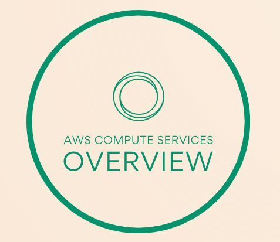

# Getting Started with AWS Systems Manager   

### Repository: [course](../../../)   
### Platform: <a href="../../">aws_skill_builder   </a>
### Software/Subject: <a href="../">aws   </a>
### Course: <a href="./">curso_127 (Getting Started with AWS Systems Manager)   </a>

#### <a href="">Certificate</a>

---

### Theme:
- Cloud Computing

### Used Tools:
- Operating System (OS): 
  - Windows 11   
- Cloud:
  - Amazon Web Services (AWS)   
- Cloud Services:
  - Amazon Simple Storage Service (S3)   
  - Google Drive   
- Language:
  - HTML   
  - Markdown   
- Integrated Development Environment (IDE) and Text Editor:
  - Visual Studio Code (VS Code)   
- Versioning: 
  - Git   
- Repository:
  - GitHub   

---

<a name="item0"><h3>Course Strcuture:</h3></a>
1. Getting Started with AWS Systems Manager 
1.1 <a href="#item01.1">AWS Systems Manager (SSM)</a> 
1.2 <a href="#item01.2">Usando o AWS Systems Manager</a> 

---

### Objective:
Este curso apresentou uma visão geral dos principais recursos e funcionalidades do **AWS Systems Manager (SSM)**, com o objetivo de fornecer uma compreensão introdutória dos recursos oferecidos pela ferramenta. Os objetivos específicos incluíram:
- Explicar o funcionamento do Systems Manager;
- Descrever os conceitos técnicos relacionados ao Systems Manager;
- Listar os casos de uso mais comuns do Systems Manager;
- Explicar os requisitos para implementar o Systems Manager em cenários reais;
- Reconhecer os benefícios proporcionados pelo Systems Manager;
- Resumir a estrutura de custos associada ao Systems Manager;
- Demonstrar o uso do Systems Manager no **AWS Management Console** e por meio da **AWS Command Line Interface (AWS CLI)**.

### Structure:
A estrutura do curso é formada por:
- Este arquivo de README.
- A pasta `0-aux`, pasta auxiliar com imagens utilizadas na construção desse arquivo de README. 

### Development:

<a name="item01.1"><h4>AWS Systems Manager (SSM)</h4></a>[Back to summary](#item0)

O **AWS Systems Manager (SSM)** é uma solução segura de gerenciamento completo para ambientes de nuvem híbrida, facilitando o gerenciamento de recursos e aplicativos e reduzindo o tempo necessário para detectar e resolver problemas operacionais. Ele também oferece suporte na operação e gerenciamento seguro da infraestrutura da **Amazon Web Services (AWS)** em grande escala. O Systems Manager mantém a segurança e a conformidade ao examinar instâncias gerenciadas e relatar (ou tomar ações corretivas) sobre violações de políticas detectadas. Por meio do console do Systems Manager, é possível visualizar dados operacionais de vários serviços da **AWS** e automatizar tarefas operacionais em recursos da **AWS**, como instâncias de serviços como **Amazon Elastic Compute Cloud (Amazon EC2)**, **Amazon Relational Database Service (Amazon RDS)**, **Amazon Elastic Container Service (Amazon ECS)** e **Amazon Elastic Kubernetes Service (Amazon EKS)**.

Com o Systems Manager, é possível centralizar dados operacionais de diversos serviços da **AWS** e automatizar tarefas em todos os recursos da **AWS**. Grupos lógicos de recursos podem ser criados, como aplicativos, diferentes camadas de uma pilha de aplicativos ou ambientes de produção e desenvolvimento. O Systems Manager permite a seleção de um grupo de recursos para visualizar atividades recentes de API, alterações na configuração dos recursos, notificações, alertas operacionais, inventário de software e status de conformidade de patches. Além disso, oferece a possibilidade de agir sobre cada grupo de recursos conforme as necessidades operacionais. O Systems Manager centraliza a visualização e o gerenciamento dos recursos da **AWS**, proporcionando visibilidade e controle completo sobre as operações.

O **AWS Systems Manager** é uma coleção de recursos projetada para auxiliar no gerenciamento de aplicativos e infraestrutura em execução na nuvem da **AWS**. Gerenciar múltiplos serviços individualmente pode ser complexo e demorado. O Systems Manager oferece uma forma centralizada e consistente de coletar informações operacionais e realizar tarefas de gerenciamento rotineiras. Esse serviço poderoso é dividido em quatro grupos principais, cada um com um conjunto específico de funcionalidades, que podem ser usados independentemente. Assim, é possível adotar o Systems Manager conforme os casos de uso mais adequados às necessidades da empresa. Os quatro grupos principais são:
- Gestão de operações (`Operations Management`): Facilita o gerenciamento dos recursos da **AWS**.
- Gerenciamento de aplicativos: Auxilia na gestão de aplicativos em execução na **AWS**.
- Gerenciamento de mudanças (`Configuration Management`): Permite realizar ações ou alterar recursos da **AWS** de maneira segura e auditável.
- Gerenciamento de nós (`Node Management`): Proporciona o gerenciamento de instâncias EC2, servidores locais, máquinas virtuais (VMs) em ambientes híbridos e outros recursos da **AWS**.

Esse conjunto de ferramentas e recursos do **AWS Systems Manager** oferece diversos benefícios. Alguns exemplos de casos de uso incluem:
- Agrupamento de recursos da **AWS**: Organize os recursos da **AWS** conforme objetivos específicos, como aplicação, ambiente, região da **AWS**, projeto, campanha, unidade de negócios ou ciclo de vida do software.
- Administração centralizada: Defina e gerencie centralmente as opções e políticas de configuração das instâncias gerenciadas. Visualize, investigue e resolva problemas operacionais relacionados aos recursos da **AWS**.
- Automação: Automatize ou agende tarefas de manutenção e implantação. Utilize e crie documentos do Systems Manager (SSM), no formato de runbooks, que definem as ações a serem executadas nas instâncias gerenciadas.
- Integração de serviços gerenciados: Execute comandos com controle de taxa e erro em toda uma frota de instâncias gerenciadas. Conecte-se de maneira segura a uma instância sem abrir portas de entrada ou gerenciar chaves SSH.
- Privacidade de dados: Mantenha segredos e dados de configuração separados do código usando parâmetros, com ou sem criptografia, e faça referência a esses parâmetros em outros serviços da **AWS**.
- Coleta de metadados: Automatize a coleta de metadados das instâncias gerenciadas, tanto no EC2 quanto on-premises, incluindo informações sobre aplicativos e configurações de rede.
- Consolidação de inventário: Visualize dados de inventário de várias regiões e contas da **AWS** em um único local.
- Relatórios de conformidade: Monitore recursos fora de conformidade e tome ações corretivas por meio de um painel centralizado, além de visualizar resumos ativos de métricas e alarmes para seus recursos da **AWS**.

Esses recursos funcionam de forma independente, permitindo a adoção gradual conforme as necessidades da empresa.

Com relação aos benefícios do **AWS Systems Manager**, destacam-se:
- Redução do tempo para detectar problemas: O Systems Manager permite visualizar dados operacionais de grupos de recursos, facilitando a rápida identificação de problemas que possam afetar os aplicativos. Os recursos podem ser agrupados de diversas formas (por aplicativos, camadas, ambientes, etc.), e as informações são exibidas em um painel único, eliminando a necessidade de alternar entre consoles. Por exemplo, é possível monitorar um aplicativo que usa EC2, S3 e RDS em um único grupo e detectar alterações ou interrupções nesses serviços.
- Automação eficiente: O Systems Manager possibilita a automação de tarefas operacionais, aumentando a eficiência das equipes. Usando playbooks automatizados (predefinidos ou customizados), minimizam-se erros humanos e simplificam-se processos, como manutenção e implantação. O serviço também conta com controles de segurança que permitem interromper implantações automaticamente em caso de falhas.
- Melhoria na visibilidade e controle: O Systems Manager oferece uma visão detalhada do estado atual dos recursos, incluindo configurações do sistema, níveis de patch, instalações de software e mais. Por meio de painéis como o *Systems Manager Explorer* e *Inventory*, é possível acompanhar essas informações em tempo real e visualizar alterações ao longo do tempo, graças à integração com o **AWS Config**.
- Gerenciamento de ambientes híbridos: O Systems Manager permite o gerenciamento de instâncias EC2, dispositivos de borda e servidores locais ou VMs em ambientes híbridos, incluindo outras nuvens. Ele se comunica com segurança por meio de um agente leve instalado em seus servidores, possibilitando a execução de tarefas de gerenciamento em grande escala para sistemas operacionais **Windows** e **Linux**, tanto na nuvem quanto on-premises.
- Manutenção de segurança e conformidade: O Systems Manager ajuda a garantir a conformidade e a segurança ao monitorar patches, configurações e políticas personalizadas nas instâncias gerenciadas. Ele também oferece recursos para definir políticas de firewall, manter definições de antivírus atualizadas e gerenciar servidores remotamente, sem a necessidade de login manual. Além disso, oferece um armazenamento centralizado para gerenciar dados de configuração e segredos de maneira segura, separando-os do código.

Lembre-se de que o Systems Manager possui preços específicos para cada recurso. É possível começar gratuitamente com os recursos incluídos no nível gratuito da **AWS**. Não há taxas mínimas ou compromissos iniciais, sendo cobrado apenas pelo que for utilizado. Também é possível calcular os custos do Systems Manager e da arquitetura através da Calculadora de Preços da **AWS**.

O Systems Manager oferece diversos recursos para acessar, gerenciar e configurar nós gerenciados. Um nó gerenciado é qualquer máquina configurada para o Systems Manager, incluindo instâncias do **Amazon EC2**, dispositivos de borda, servidores locais e VMs, inclusive em outros ambientes de nuvem. Os principais recursos incluem:
- Gerenciador de Patches (`Patch Manager`): Automatiza o processo de correção de nós gerenciados com atualizações de segurança e outros tipos de patches. Oferece opções para escanear nós gerenciados, relatar conformidade, instalar patches em um cronograma e realizar correções sob demanda.
- Gerente Estadual (`State Manager`): Um serviço de gerenciamento de configuração que automatiza o processo de manter a infraestrutura EC2 e híbrida em um estado definido.
- Automação: Simplifica tarefas comuns de manutenção e implantação de instâncias EC2 e outros recursos da **AWS**, como gerenciar estados de nós ou alterar estados com automação de aprovação.
- Gerenciador de Sessão (`Session Manager`): Permite estabelecer conexões seguras com instâncias EC2, dispositivos periféricos, servidores e VMs locais, sem a necessidade de abrir portas, manter bastion hosts ou gerenciar chaves SSH.
- Executar Comando (`Run Command`): Facilita o gerenciamento remoto e seguro da configuração dos nós gerenciados, automatizando tarefas administrativas comuns, como instalação de aplicativos, criação de pipelines de implantação e captura de arquivos de log.

O gerenciamento de operações e configurações pode ser utilizado para solucionar problemas, gerando itens de trabalho operacionais (OpsItems) no OpsCenter com base em eventos do **Amazon EventBridge** ou alarmes do **Amazon CloudWatch**. Runbooks de automação podem ser executados, ou ações de emergência podem ser tomadas para resolver o problema. O Systems Manager também pode iniciar um processo de controle de alterações e até mesmo acionar um plano completo de resposta a incidentes, notificando a equipe de plantão e exibindo todos os dados relevantes dos recursos subjacentes. A equipe pode colaborar para resolver o incidente e fornecer dados para uma análise pós-incidente. Alguns dos principais recursos incluem:
- Gerente de Mudanças (`Change Manager`): Uma estrutura corporativa de gerenciamento de mudanças para solicitar, aprovar, implementar e relatar mudanças operacionais na configuração e infraestrutura dos aplicativos. O Change Manager permite gerenciar mudanças em recursos locais e da **AWS**.
- Centro de Operações (`OpsCenter`): Fornece um local central onde engenheiros de operações e profissionais de TI podem visualizar, investigar e resolver itens de OpsIt relacionados aos recursos da **AWS**. O OpsCenter foi projetado para reduzir o tempo médio de resolução de problemas que afetam os recursos da **AWS**.
- Gerente de Incidentes (`Incident Manager`): Um recurso do Systems Manager para gerenciar incidentes em aplicativos hospedados na **AWS**. O Incident Manager combina engajamento, escalonamento, runbooks, planos de resposta, canais de comunicação e análise pós-incidente para ajudar na triagem de incidentes e restaurar rapidamente a normalidade dos aplicativos.

O Systems Manager centraliza dados de serviços como **AWS Config**, EventBridge, **AWS CloudTrail** e outros, utilizando o **AWS Identity and Access Management (AWS IAM)** para controle de acesso unificado. Com essa integração, elimina-se a necessidade de sobrecarga manual ou de engenharia para integrar várias fontes de dados. Usando o **AWS Config**, junto com o Systems Manager e o **AWS Audit Manager**, é possível estabelecer regras de conformidade, monitorá-las e aplicá-las, além de produzir relatórios detalhados e consolidados para auditorias. O **AWS Resilience Hub**, assim como o **AWS Fault Injection Simulator**, também estão integrados, facilitando a definição de metas de tempo de recuperação (RTO) e ponto de recuperação (RPO), com rastreamento, avaliação e validação contínuos dessas metas. Runbooks do Systems Manager podem ser criados para aplicativos e recomendações de monitores e alarmes do CloudWatch podem ser geradas. O Systems Manager se integra perfeitamente aos processos e sistemas já existentes.

O **AWS Service Management Connector** permite integração bidirecional com o **ServiceNow** e o **Jira Service Desk**. Utilizando APIs abertas no Systems Manager, é possível integrá-lo a outras soluções de terceiros ou a sistemas personalizados internos, proporcionando flexibilidade para manter essas ferramentas conforme necessário.

Alguns conceitos básicos do SSM que vale a pena destacar incluem:
- Nós gerenciados: Um nó gerenciado é qualquer máquina configurada para o Systems Manager. Instâncias do EC2, dispositivos de borda, servidores locais e VMs, incluindo VMs em outros ambientes de nuvem, podem ser configurados como nós gerenciados.
- OpsCenter OpsItems: Engenheiros de operações e profissionais de TI utilizam o Systems Manager OpsCenter para visualizar, investigar e corrigir OpsItems que afetam o desempenho e a integridade dos recursos da **AWS**. Cada OpsItem inclui informações contextuais relevantes, como nome e ID do recurso da **AWS**, detalhes de alarme ou evento, histórico de alarmes e um gráfico de cronograma de alarmes, auxiliando no diagnóstico.
- Linhas de base de patches: As linhas de base de patches contêm regras para aprovação automática de patches, levando em conta o sistema operacional, o produto, a classificação e a severidade, além de listas de patches aprovados ou rejeitados. É possível configurar atrasos na aprovação automática ou definir datas limites. A **AWS** oferece linhas de base predefinidas para sistemas operacionais compatíveis com o Patch Manager, além da opção de criar linhas de base personalizadas.
- Associações do State Manager: As associações do State Manager são configurações seguras e escaláveis que automatizam o processo de manter nós gerenciados e outros recursos da **AWS** em um estado definido. As associações especificam estados desejados, como a instalação de software antivírus ou o fechamento de portas específicas, e são aplicadas de acordo com um cronograma.
- Agente do Systems Manager (`SSM Agent`): O SSM Agent é um software da **AWS** executado em instâncias EC2, dispositivos periféricos, servidores e VMs locais, bem como em ambientes de nuvem híbrida. Ele permite que o Systems Manager atualize, gerencie e configure esses recursos. O código-fonte do agente está disponível no **GitHub** para personalizações conforme as necessidades.
- Documentos do Systems Manager: O Systems Manager permite interagir com documentos como runbooks de automação, documentos de comando e de sessão. São oferecidos mais de 450 documentos pré-configurados para ações em instâncias gerenciadas ou execução de scripts em **Python** e **PowerShell**. Por exemplo, o documento `AWS-RunPatchBaseline` aplica patches a nós gerenciados, enquanto o runbook `AWS-CreaterDSSnapshot` cria snapshots do **Amazon RDS**.
- Parâmetros do Systems Manager (`Parameter Store`): O Parameter Store permite o armazenamento de dados como senhas, cadeias de caracteres, AMIs e códigos de licença, tanto em texto simples quanto criptografados. Os parâmetros podem ser referenciados em scripts, comandos, documentos SSM e fluxos de trabalho de automação, utilizando o nome exclusivo atribuído no momento da criação.

Entre os principais casos de uso do **AWS Systems Manager**, destacam-se:
- Gerenciamento de Patches: O Patch Manager automatiza o processo de aplicação de correções em instâncias gerenciadas com atualizações de segurança e outras atualizações. Ele pode ser utilizado para aplicar patches tanto em sistemas operacionais quanto em aplicativos. No **Windows Server**, o suporte a aplicativos é limitado às atualizações lançadas pela **Microsoft**. O Patch Manager permite instalar Service Packs em instâncias **Windows** e realizar pequenas atualizações de versão em instâncias **Linux**. É possível corrigir frotas de instâncias do EC2 ou servidores e VMs locais, com suporte para sistemas em ambientes de nuvem híbrida. Ele também oferece a possibilidade de escanear instâncias para verificar patches ausentes ou escanear e instalar automaticamente todos os patches faltantes.
- Gerenciamento de Sessões: O Session Manager é um recurso gerenciado que permite controlar instâncias do EC2, servidores locais e VMs, incluindo em ambientes híbridos, por meio de um shell interativo baseado em navegador ou pela **AWS CLI**. O Session Manager elimina a necessidade de abrir portas de entrada, manter bastion hosts ou gerenciar chaves SSH. Ele fornece um gerenciamento seguro e auditável de instâncias, atendendo a políticas corporativas de segurança com acesso controlado e registros detalhados de auditoria.
- Gestão de Operações: O Systems Manager oferece diversas funcionalidades operacionais integradas com outros serviços da **AWS** para dar visibilidade e automatizar a resolução de problemas.
  - O Explorer funciona como um painel operacional, proporcionando insights sobre contas e regiões da **AWS** a partir de diversas fontes, como **AWS Config**, Trusted Advisor, Compute Optimizer e outros.
  - O OpsCenter permite que operadores visualizem e investiguem OpsItems gerados automaticamente a partir de dados do CloudWatch, **AWS Config** e CloudTrail. A resolução desses itens pode ser feita usando documentos de automação, e há integração com sistemas de gerenciamento de serviços de TI, como **Jira** e **ServiceNow**.
  - O Incident Manager acelera a resolução de incidentes críticos com planos de resposta automatizados. Ele permite declarar, rastrear incidentes, notificar respondentes, resolver com documentos de automação e realizar análises pós-incidentes para prevenir recorrências.
  - O Change Manager é uma estrutura para gerenciamento de mudanças corporativas, usada para solicitar, aprovar, implementar e relatar mudanças operacionais na infraestrutura e configuração dos aplicativos.
- Gerenciamento de Configuração: O State Manager é uma solução de gerenciamento de configuração segura e escalável que automatiza a manutenção dos nós gerenciados e outros recursos da **AWS** em um estado definido. Alguns benefícios incluem:
  - Inicializar instâncias com software ou configurações específicas;
  - Vincular instâncias a um domínio do **Microsoft Active Directory**;
  - Garantir conformidade de configuração com ferramentas como **Ansible**, **Chef InSpec**, **Chef Recipes** e **PowerShell DSC**;
  - Iniciar, reiniciar ou interromper nós gerenciados e instâncias do **Amazon RDS**;
  - Desabilitar permissões de leitura e gravação em buckets do **Amazon S3**.

<a name="item01.2"><h4>Usando o AWS Systems Manager</h4></a>[Back to summary](#item0)

Nesta primeira etapa, foi

AmazonSSMManagedInstanceCore: Esta política é necessária para que uma instância EC2 se torne uma instância gerenciada pelo Systems Manager. Ela inclui as permissões necessárias para comunicação entre a instância e o Systems Manager, além de permitir a atualização do SSM Agent e a execução de comandos.

AmazonSSMPatchAssociation: Esta política é usada especificamente para gerenciar associações de patches. Ela permite que o Systems Manager aplique patches às instâncias gerenciadas. Isso inclui permissões para criar e atualizar associações de patches.

/var/log/amazon/ssm

Vault:

Essa pasta normalmente armazena dados relacionados a operações de gerenciamento e execuções anteriores de documentos. É possível que ela contenha informações sobre as execuções dos documentos que ainda estão registradas.

ipc (Inter-Process Communication):
Esta pasta pode ser usada pelo SSM Agent para comunicação entre processos. Se houver informações residuais, isso pode afetar o comportamento do agente e suas operações.

runtimeconfig:
Esta pasta é utilizada para armazenar a configuração de tempo de execução do agente. Pode conter dados que instruem o agente sobre qual documento executar.

AWS-QuickSetup-SSMHostMgmt-AttachIAMToInstance-8a1a2
Documento: AWSQuickSetup-CreateAndAttachIAMToInstanceV2-8a1a2
Função: Cria e anexa uma política de IAM (Identity and Access Management) à instância, garantindo que a instância tenha as permissões necessárias para realizar operações específicas.

AWS-QuickSetup-SSMHostMgmt-EnableExplorer-8a1a2
Documento: AWS-EnableExplorer
Função: Habilita o Systems Manager Explorer, que fornece uma visão geral da saúde e estado de instâncias gerenciadas, facilitando o monitoramento e a análise. Esse monitoramento é realizado pelo AWS Resource Explorer.

AWS-QuickSetup-SSMHostMgmt-UpdateSSMAgent-8a1a2
Documento: AWS-UpdateSSMAgent
Função: Atualiza o agente do AWS Systems Manager nas instâncias, garantindo que as últimas melhorias e correções de segurança estejam aplicadas.

AWS-QuickSetup-SSMHostMgmt-CollectInventory-8a1a2
Documento: AWS-GatherSoftwareInventory
Função: Coleta informações sobre o software instalado nas instâncias gerenciadas, permitindo que os administradores tenham visibilidade sobre as versões de software e aplicativos em uso.

AWS-QuickSetup-SSMHostMgmt-ScanForPatches-8a1a2
Documento: AWS-RunPatchBaselineAssociation
Função: Realiza a varredura nas instâncias para identificar patches ausentes, ajudando a garantir que o software esteja sempre atualizado e seguro.
- Operation String (Required) The update or configuration to perform on the instance. The system checks if patches specified in the patch baseline are installed on the instance. The install operation installs patches missing from the baseline.
- AssociationId String (Required) The Association ID of the State Manager Association executing the document.

AWS-QuickSetup-SSMHostMgmt-ManageCloudWatchAgent-8a1a2
Documento: AWSQuickSetup-InstallAndManageCloudWatchDocument-8a1a2
Função: Instala e gerencia o agente do Amazon CloudWatch nas instâncias, permitindo o monitoramento de métricas e logs de forma centralizada.

AWS-QuickSetup-SSMHostMgmt-UpdateCloudWatchAgent-8a1a2
Documento: AWSQuickSetup-SSMHostMgmt-UpdateCloudWatchDocument-8a1a2
Função: Atualiza o agente do Amazon CloudWatch nas instâncias gerenciadas, garantindo que as últimas versões estejam instaladas para monitoramento adequado.

aws ssm create-association --name AWS-RunPatchBaselineAssociation --targets "[{`"Key`":`"InstanceIds`",`"Values`":[`"i-01e08160c579163ef`"]}]" --association-name ssmAssociationTest2 --schedule-expression "rate(1 day)" --parameters "AssociationId=4420fb91-4288-438b-91ca-74295cf6e124,Operation=Install" --tags Key=Name,Value='ssmAssociationTest2' --no-cli-pager

aws ssm create-association --name "AWS-RunPatchBaselineAssociation" --targets "[{`"Key`":`"InstanceIds`",`"Values`":[`"i-01e08160c579163ef`"]}]" --association-name "ssmAssociationTest2" --schedule-expression "rate(1 day)" --parameters "AssociationId=4420fb91-4288-438b-91ca-74295cf6e124,Operation=Install" --tags "Key=Name,Value='ssmAssociationTest2'" --no-cli-pager