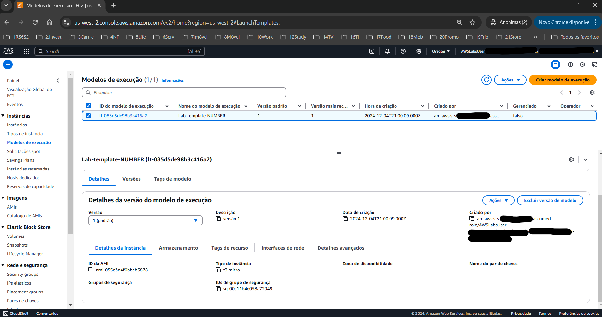
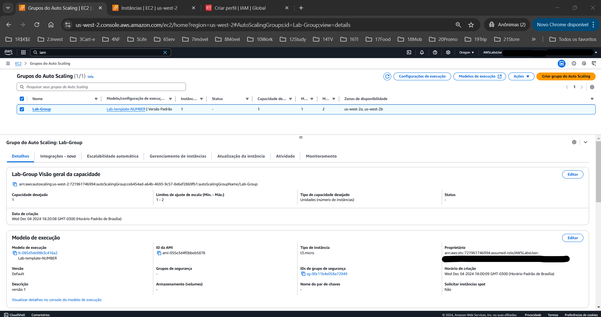
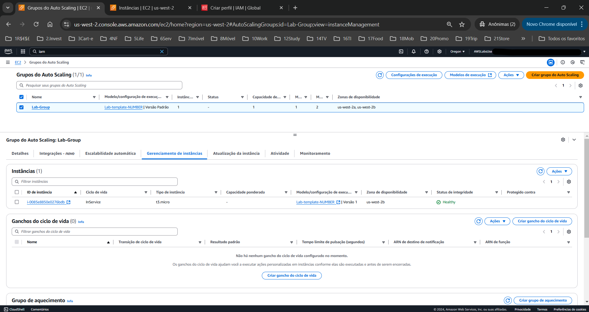
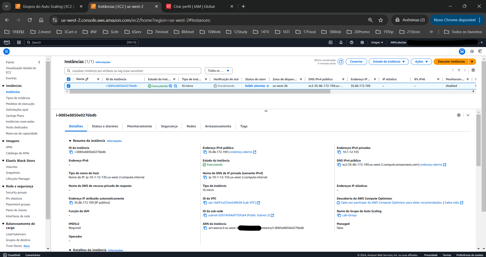
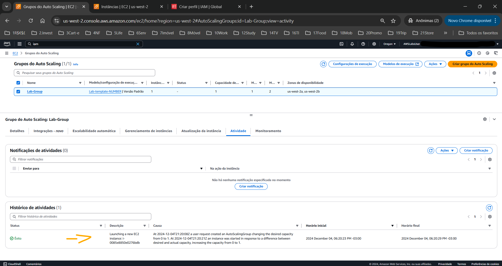
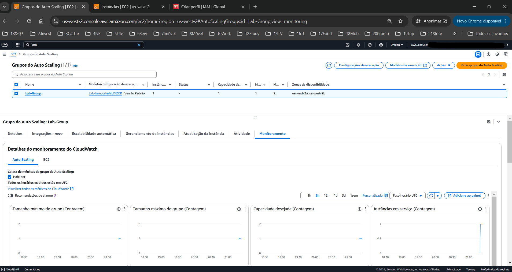
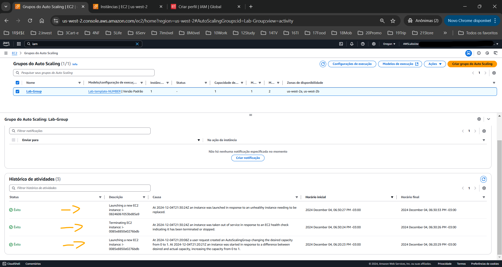
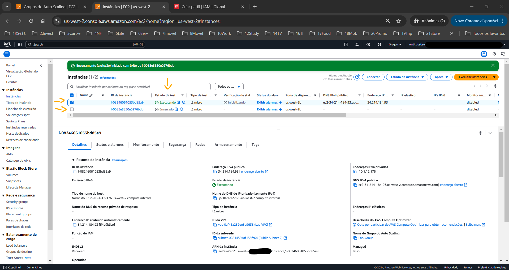

# Introduction to Amazon EC2 Auto Scaling   

### Repository: [course](../../../)   
### Platform: <a href="../../">aws_skill_builder   </a> Parceria da AWS com a <a href="../../">edn   </a> 
### Software/Subject: <a href="../">aws   </a>
### Course: <a href="./">curso_128 (Introduction to Amazon EC2 Auto Scaling)   </a>

---

### Theme:
- Cloud Computing

### Used Tools:
- Operating System (OS): 
  - Linux   
  - Windows 11   
- Linux Distribution:
  - Amazon Linux   
- Cloud:
  - Amazon Web Services (AWS)   
- Cloud Services:
  - Amazon Elastic Compute Cloud (EC2)   
  - Amazon EC2 Auto Scaling   
  - Google Drive   
- Language:
  - HTML   
  - Markdown   
- Integrated Development Environment (IDE) and Text Editor:
  - Visual Studio Code (VS Code)   
- Versioning: 
  - Git   
- Repository:
  - GitHub   

---

<a name="item0"><h3>Course Strcuture:</h3></a>
1. Introduction to Amazon EC2 Auto Scaling 
1.1 <a href="#item01.1">Tarefa 1: Criar um modelo de execução</a> 
1.2 <a href="#item01.2">Tarefa 2: Criar um grupo de Auto Scaling</a> 
1.3 <a href="#item01.3">Tarefa 3: verificar seu grupo de Auto Scaling</a> 
1.4 <a href="#item01.4">Tarefa 4: Testar o Auto Scaling</a> 

---

### Objective:
O objetivo deste laboratório prático foi criar e testar um grupo de auto scaling de instâncias EC2 utilizando os serviços **Amazon EC2** e **Amazon EC2 Auto Scaling**.

### Structure:
A estrutura do curso é formada por:
- Este arquivo de README.
- A pasta `0-aux`, pasta auxiliar com imagens utilizadas na construção desse arquivo de README. 

### Development:
Este curso foi um laboratório prático realizado na plataforma **AWS Skill Builder**, cuja subscrição foi devida a uma parceria entre a **AWS** e a **Escola da Nuvem**. A infraestrutura de cloud utilizada foi fornecida através de um sandbox do **AWS Skill Builder** que possibilitava acesso ao console da **AWS**. Contudo foi necessário seguir estritamente as orientações determinadas no laboratório. Dessa maneira, a forma de interação com os recursos da cloud foram sempre através do console fornecido pelo sandbox, a não ser em casos em que o próprio laboratório instruiu para utilização de outras ferramentas de interação como **AWS CLI** ou **AWS SDK**.

O laboratório do **AWS Skill Builder** tem o foco em executar apenas o que é orientado no escopo, todos os recursos ou serviços que podem ser requisitados adicionalmente já vêm provisionados por padrão pelo laboratório. Ao iniciar o laboratório, o sandbox do **AWS Skill Builder** provisiona diversos recursos e serviços para o funcionamento através de uma ou mais pilhas do **AWS CloudFormation** de forma automática. 

O acesso ao console no sandbox do **AWS Skill Builder** é realizado por meio de uma identidade federada. O Skill Builder funciona como um provedor de identidade (IdP), autenticando o usuário e vinculando-o a uma role do **AWS IAM** provisionada automaticamente por uma das pilhas do CloudFormation. Essa role concede permissões temporárias e mínimas necessárias para a execução do laboratório, garantindo segurança e controle sobre os recursos utilizados.

<a name="item01.1"><h4>Tarefa 1: Criar um modelo de execução</h4></a>[Back to summary](#item0)

Para provisionar um grupo de auto scaling de instâncias EC2 é necessário criar primeiro um modelo de execução (`launch template`). Este modelo serve como forma de padronizar algumas configurações que as instâncias desse grupo vão ter. Algumas dessas configurações podem ser definidas nesse modelo ou diretamente na criação do grupo de auto scaling. As configurações estabelecidas nesse modelo foram as seguintes:
- Launch template name (Nome do modelo de execução): `Lab-template-NUMBER`
- Descrição da versão do modelo: `versão 1`
- Amazon Machine Image (AMI) (Imagem de máquina da Amazon): Primeira opção definida para sistema operacional **Amazon Linux** (`ami-055e3d4f0bbeb5878` (Amazon Linux 2023 AMI 2023.6.20241121.0 x86_64 HVM kernel-6.1))
- Instance type (Tipo de instância): `t3.micro`
- Grupos de segurança: `MySecurityGroup`

Algumas observações importantes:
- A AMI é um modelo para o volume raiz da instância e pode conter um sistema operacional, um servidor de aplicações e aplicações. É necessário utilizar uma AMI para iniciar uma instância, que é a cópia da AMI em execução como um servidor virtual na nuvem.
- As AMIs são atualizadas frequentemente e são diferentes de região para região. Portanto, o Id da AMI pode mudar com frequência. A ideia do laboratório foi escolher um sistema operacional **Amazon Linux** e uma imagem free tier mais rescente que geralmente são as opções que já vem selecionadas quando o sistema operacional é definido.
- Toda parte de rede como VPC, Sub-redes e Grupo de Segurança já foram criados automaticamente ao iniciar o laboratório.

A imagem 01 abaixo evidencia o launch template construído com sucesso.

<figure>
     
    <figcaption>Imagem 01.</figcaption>
</figure>
 

<a name="item01.2"><h4>Tarefa 2: Criar um grupo de Auto Scaling</h4></a>[Back to summary](#item0)

Nesta tarefa foi provisionado o Auto Scaling Group a partir do launch template criado na tarefa anterior. Algumas configurações foram necessárias conforme exibidas abaixo:
- Auto Scaling group name (Nome do grupo do Auto Scaling): `Lab-Group`
- Launch template (Modelo de execução): `Lab-template-NUMBER` (Modelo já criado na tarefa anterior)
- Network (Rede):
  - VPC: `Lab VPC`
  - Sub-redes: as duas sub-redes foram selecionadas (`us-west-2a` e `us-west-2b`).
- Configure advanced options (Configurar opções avançadas):
  - Health check grace period (Período de carência da verificação de integridade): `60`
  - Monitoring (Monitoramento): `Habilitar coleta de métricas de grupo no CloudWatch`
- Configure group size and scaling policies (Configurar tamanho do grupo e políticas de escalabilidade):
  - Capacidade mínima: `1`
  - Maximum capacity (Capacidade máxima): `2`
  - Capacidade desejada: `1`.

Algumas observações importantes:
- O Health Check é um recurso que verifica a integridade das instâncias, ou seja, se elas estão saudáveis (funcionando) ou não. Existem algumas formas de funcionamento do health check, neste caso, o funcionamento do health check do grupo de auto scaling ocorre com a leitura individual do health check de cada instância em um período de tempo e a partir dos resultados obtido executa as configurações estabelecidas.
- Por default, o período de carência da verificação de integridade é definido como 300 segundos. Como este era um laboratório, esse perído de carência foi alterado esse para 60 segundos para evitar esperar muito tempo para que a verificação de integridade fosse realizada. O período de carência é o tempo em que o health check do auto scaling group vai aguardar para fazer a leitura.
- O health check das instâncias avalia o estado da instância com base nos dois critérios abaixo e a partir disso emite um status da instância:
  - System Reachability (Acessibilidade do sistema): Verifica problemas no hardware subjacente (ex.: disco, rede, host físico).
  - Instance Reachability (Acessibilidade da instância): Avalia se a instância pode ser acessada e está operacional (ex.: falhas de kernel ou de rede interna).

As imagens 02 e 03 exibem o grupo de auto scaling e sua única instância, pois a capacidade mínima foi definida como 1. Já a imagem 04 exibe essa mesma instância no console do **Amazon EC2**

<figure>
     
    <figcaption>Imagem 02.</figcaption>
</figure>
 

<figure>
     
    <figcaption>Imagem 03.</figcaption>
</figure>
 

<figure>
     
    <figcaption>Imagem 04.</figcaption>
</figure>
 

<a name="item01.3"><h4>Tarefa 3: verificar seu grupo de Auto Scaling</h4></a>[Back to summary](#item0)

Na imagem 05 são mostradas as atividades no grupo de auto scaling, que até o momento só tinha provisionado uma única instância. Enquanto na imagem 06 é exibido a aba de monitoramento do grupo de auto scaling, mostrando que foram habilitadas as métricas do grupo de auto scaling para o **Amazon CloudWatch**. 

<figure>
     
    <figcaption>Imagem 05.</figcaption>
</figure>
 

<figure>
     
    <figcaption>Imagem 06.</figcaption>
</figure>
 

<a name="item01.4"><h4>Tarefa 4: Testar o Auto Scaling</h4></a>[Back to summary](#item0)

Na última tarefa o objetivo foi testar o grupo de auto scaling removendo a única instância existente. Como a quantidade mínima era 1, uma nova instância foi provisionada imediatamente após o health check verificar que a instância anterior não era mais saudável. As imagens 07 e 08 evidenciam as novas atividades sendo executadas pelo auto scaling grupo e o provisionamento da nova instância.

<figure>
     
    <figcaption>Imagem 07.</figcaption>
</figure>
 

<figure>
     
    <figcaption>Imagem 08.</figcaption>
</figure>
 