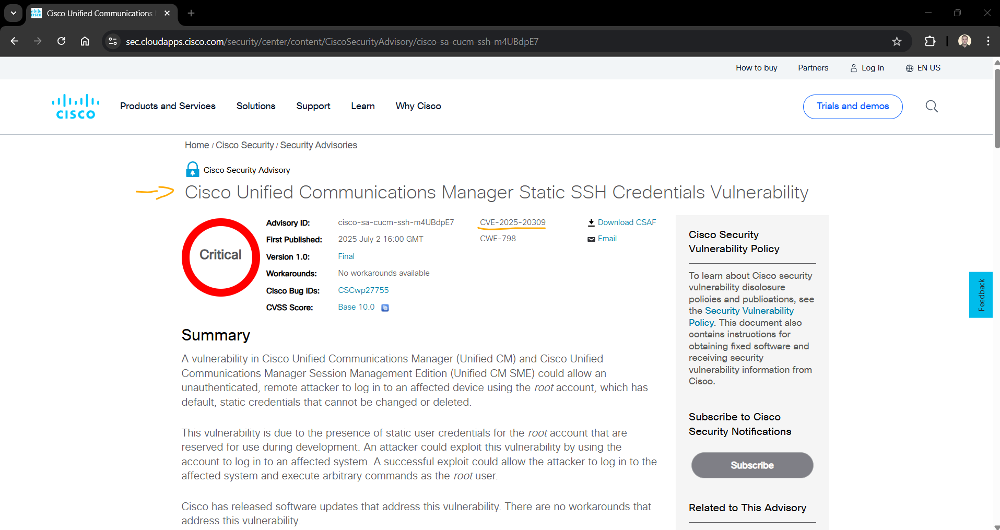
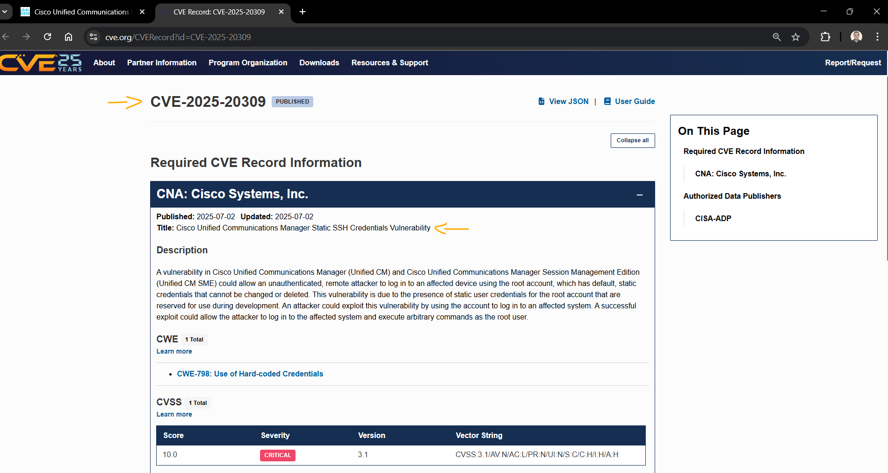
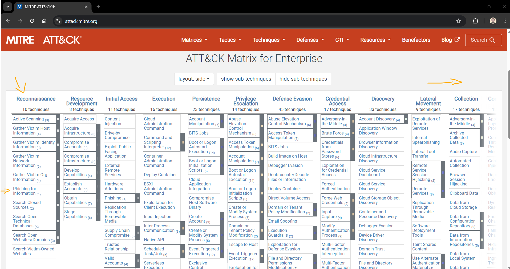
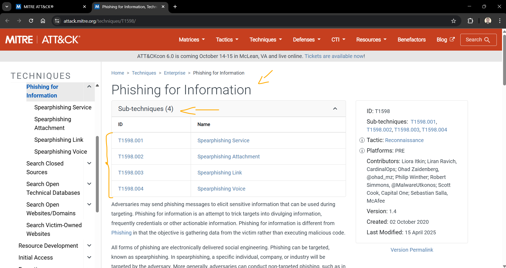
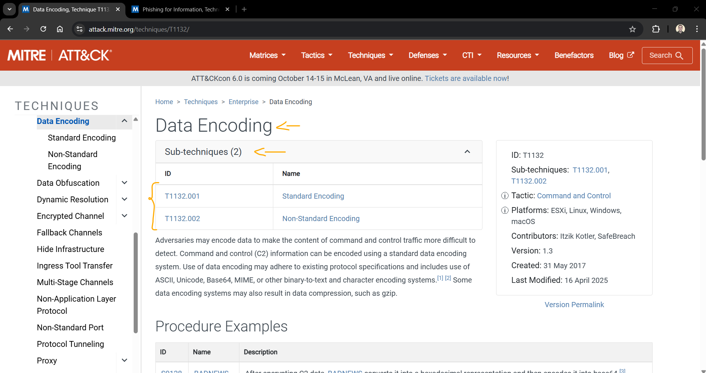
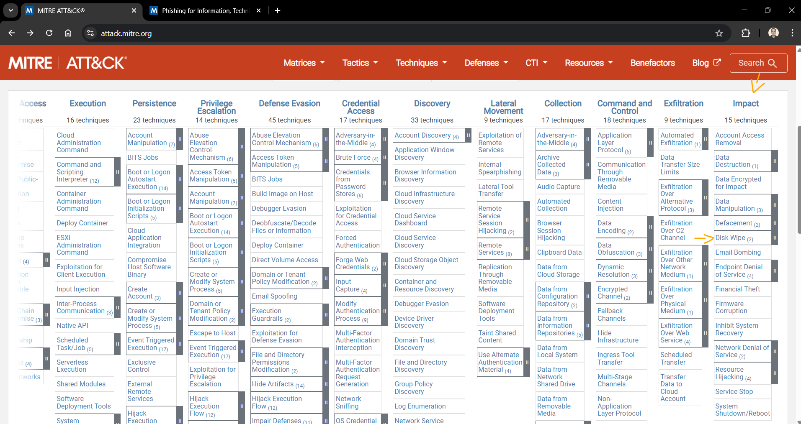
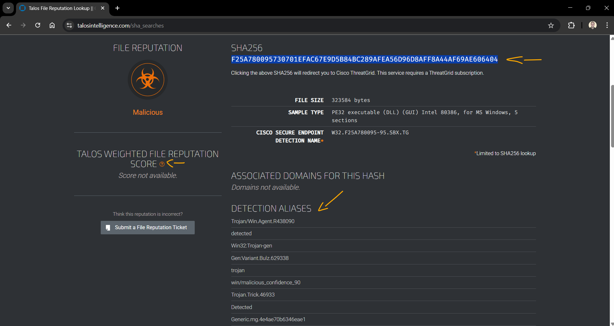
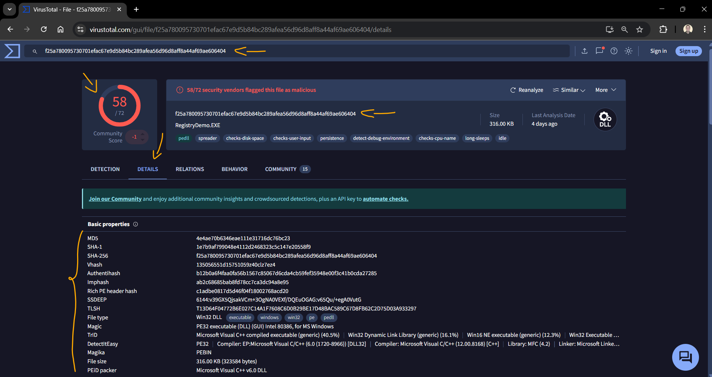

# Gerenciamento de Ameaças Cibernéticas - Módulo 3   

### Repository: [course](../../../../)
### Platform: <a href="../../../">cisco   </a>
### Software/Subject: <a href="../../">cybersecurity   </a>
### Course: <a href="../">curso_150 (Gerenciamento de Ameaças Cibernéticas)   </a>
### Module: 3. Inteligência de Ameaças

---

### Theme:
- Cybersecurity

### Used Tools:
- Operating System (OS): 
  - Windows 11 
- Cloud:
  - Amazon Web Services (AWS)   
- Cloud Services:
  - Amazon Elastic Compute Cloud (EC2)   
  - Google Drive 
- Language:
  - HTML   
  - Markdown   
- Integrated Development Environment (IDE) and Text Editor:
  - Visual Studio Code (VS Code)   
- Versioning: 
  - Git   
- Repository:
  - GitHub   
- Cibersecurity:
  - MITRE Adversarial Tactics, Techniques & Common Knowledge Framework (MITRE ATT&CK)   
  - Cisco Talos Threat Intelligence Group   
  - vírusTotal   

---

### Course Module 3 Structure:
3. <a name="item03">Inteligência de Ameaças</a> 
  3.1 <a href="#item03.01">Introdução</a> 
  3.2 <a href="#item03.02">Fontes de informação</a> 
&nbsp;&nbsp;&nbsp;&nbsp;3.2.1 <a href="#item03.02.01">Laboratório - Avaliar relatórios de segurança digital</a> 
  3.3 <a href="#item03.03">Serviços de inteligência de ameaças</a> 
&nbsp;&nbsp;&nbsp;&nbsp;3.3.1 <a href="#item03.03.01">Laboratório - identifique inteligência relevante de ameaças</a> 
  3.4 <a href="#item03.04">Resumo de Inteligência de Ameaças</a> 

---

### Objective:
O objetivo deste módulo foi apresentar conceitos e práticas de inteligência contra ameaças, destacando a importância de identificar, avaliar e utilizar fontes confiáveis de informações sobre riscos cibernéticos emergentes. Foram exploradas organizações e serviços especializados, como SANS, MITRE, FIRST, Cisco Talos, FireEye e DHS AIS, além de plataformas e padrões abertos para compartilhamento de dados, como STIX, TAXII, CybOX e MISP, que permitem automatizar a distribuição de indicadores de comprometimento, vulnerabilidades e técnicas de mitigação. Também foram abordadas estratégias para coletar, centralizar e analisar informações de múltiplas fontes, incluindo honeypots e TIPs (Threat Intelligence Platforms), com o objetivo de antecipar ataques, fortalecer defesas de rede e apoiar a criação de regras de segurança em tempo real, garantindo uma postura proativa frente às ameaças cibernéticas.

### Folder Structure:
- [README.md](./README.md): Este documento de README, escrito em **Markdown**, descrevendo todo conteúdo realizado neste módulo.
- [0-aux](../0-aux/): Pasta auxiliar com imagens utilizadas na construção dos arquivos de README desse curso.

### Development:

<a name="item03.01"><h4>3.1 Introdução</h4></a>[Back to summary](#item03)

🌐 Inteligência contra Ameaças   
A segurança cibernética exige atualização constante, já que novas ameaças surgem diariamente. Este módulo apresenta como identificar e avaliar fontes de inteligência que ajudam a antecipar riscos e fortalecer as defesas da rede.

Objetivos de aprendizado:
- Avaliar as principais fontes de informações sobre ameaças emergentes.
- Conhecer os serviços de inteligência usados para comunicar riscos à segurança da rede.

<a name="item03.02"><h4>3.2 Fontes de informação</h4></a>[Back to summary](#item03)

📡 Fontes de Inteligência de Ameaças   
Para se manter à frente de ataques cibernéticos, é essencial conhecer e utilizar fontes confiáveis de informações sobre ameaças. Elas fornecem alertas, análises e relatórios que ajudam profissionais de segurança a antecipar e mitigar riscos.

🔹 Principais fontes e serviços de inteligência:
- SANS (SysAdmin, Audit, Network, Security Institute): oferece diversos recursos gratuitos mediante solicitação, incluindo:
    - Internet Storm Center: sistema de alerta antecipado sobre ameaças online.
    - NewsBites: resumo semanal com notícias de segurança.
    - ORISK: resumo de vulnerabilidades recém-descobertas, ataques ativos e análises de exploração.
    - Alertas de Segurança Flash.
    - Sala de Leitura com mais de 1.200 pesquisas premiadas.
    - Desenvolvimento de cursos de capacitação em segurança.
- Mitre: mantém a base de vulnerabilidades CVE (Common Vulnerabilities and Exposures), amplamente utilizada por profissionais e empresas de segurança.
- FIRST (Forum of Incident Response and Security Teams): reúne equipes de resposta a incidentes de diferentes setores, promovendo cooperação e compartilhamento de informações para prevenção e resposta rápida a incidentes.
- SecurityNewsWire: portal de notícias que agrega alertas, vulnerabilidades e explorações recentes.
- (ISC)² (International Information Systems Security Certification Consortium): oferece produtos educacionais e serviços de carreira neutros, atendendo mais de 75.000 profissionais em mais de 135 países.
- CIS (Center for Internet Security): oferece padrões de segurança, controles essenciais e recursos para ajudar organizações a prevenir, detectar e mitigar ameaças de forma estruturada.  
- MS-ISAC (Multi-State Information Sharing and Analysis Center): fornece monitoramento contínuo, alertas de vulnerabilidades e suporte para prevenção e resposta a incidentes para governos estaduais, locais e tribais.

📌 Práticas para se manter atualizado:   
- Acompanhar ameaças recentes: assinar feeds em tempo real, consultar sites especializados, seguir blogs e podcasts de segurança.
- Atualização constante de habilidades: participar de treinamentos, workshops e conferências da área.

📊 Relatórios e publicações importantes:
- Cisco Annual Cybersecurity Report e Mid-Year Cybersecurity Report: oferecem análises sobre vulnerabilidades críticas, tendências de ataques e estratégias de mitigação.

🎙️ Blogs e podcasts especializados   
Fornecem atualizações contínuas sobre ameaças e técnicas de defesa. Exemplos incluem os blogs de especialistas da Cisco e os podcasts do Cisco Talos Group, disponíveis para streaming ou download.

📌 Conclusão   
Manter-se informado e atualizado exige disciplina e compromisso contínuo, mas é fundamental para que profissionais de segurança possam antecipar ataques e proteger redes de forma eficiente.

<a name="item03.02.01"><h4>3.2.1 Laboratório - Avaliar relatórios de segurança digital</h4></a>[Back to summary](#item03)

Este laboratório foi desenvolvido em três partes, cada uma composta por várias etapas. Algumas etapas foram documentadas diretamente neste arquivo README, enquanto outras exigiram a criação de arquivos específicos. O objetivo do laboratório foi investigar relatórios de inteligência de segurança digital disponíveis gratuitamente, compreender como esses relatórios podem ajudar empresas e instituições educacionais a identificar e se proteger contra ameaças digitais, analisar diferentes fontes de informação de ameaças, e avaliar a relevância e a confiabilidade desses dados para a tomada de decisões em segurança digital. Além disso, foi explorado o conceito de Open Source Intelligence (OSINT) e seu papel no monitoramento de ameaças em tempo real.

##### Parte 1: Pesquisar relatórios de inteligência de segurança cibernética

A primeira parte deste laboratório consistiu em pesquisar o relatório de ameaças da Webroot de 2020, utilizado como fonte de inteligência de segurança cibernética. O documento foi encontrado neste [link](https://www.prnewswire.com/news-releases/2020-webroot-threat-report-phishing-attempts-grew-by-640-last-year-301006574.html) e ele foi utilizado para analisar as principais descobertas e responder as questões abaixo:
- Com base nas descobertas, onde o malware normalmente se esconde em um PC com Windows?
  - 85% das ameaças se escondem em um dos quatro locais: %temp%, %appdata%, %cache% e %windir%, com mais da metade das ameaças (54,4%) em PCs corporativos se escondendo em pastas %temp%. Esse risco pode ser facilmente mitigado definindo uma política do Windows para impedir a execução de programas a partir do diretório temporário.
- Com base nas descobertas, quais são algumas tendências em ransomware?
  - Algumas tendências em ransomware incluem:
    - Crescimento significativo no número de URLs maliciosos e tentativas de phishing, que frequentemente servem como vetor de distribuição de ransomware.  
    - Foco em sistemas desatualizados, como Windows 7, que são mais vulneráveis a exploits usados por ransomware.  
    - Uso de técnicas de cryptojacking, com scripts maliciosos que sequestram recursos do computador para mineração de criptomoedas, frequentemente relacionados a ataques de ransomware.  
    - Aumento da sofisticação nos ataques, combinando malware, phishing e engenharia social para maximizar a eficácia.  
    - Preferência por dispositivos de consumidores e conexões corporativas via dispositivos pessoais, explorando a menor proteção e vigilância desses endpoints.  
  - Em resumo, o ransomware está cada vez mais direcionado, sofisticado e explorando vulnerabilidades conhecidas em sistemas desatualizados e redes corporativas com dispositivos pessoais conectados.
- Com base nas descobertas, quais são as tendências atuais de ataques de phishing?
  - As tendências atuais de ataques de phishing incluem:
    - **Aumento expressivo de URLs maliciosos**: as tentativas de phishing cresceram 640% em 2019.  
    - **Sites legítimos sendo usados como fachada**: 1 em cada 4 URLs maliciosos foi hospedado em domínios normalmente não maliciosos.  
    - **Foco em plataformas populares**: os sites mais frequentemente imitados incluem Facebook, Microsoft, Apple, Google, PayPal e Dropbox.  
    - **Diversidade de setores-alvo**: phishing direciona-se a exchanges de criptomoedas (55%), jogos (50%), webmail (40%), instituições financeiras (40%) e serviços de pagamento (32%).  
    - **Exploração de comportamento do usuário**: os ataques aproveitam a confiança do usuário em sites conhecidos e serviços amplamente utilizados.  
  - Em resumo, os ataques de phishing estão se tornando mais sofisticados, explorando a reputação de sites legítimos e mirando setores estratégicos para maximizar impacto e engano.
- Com base nas descobertas, por que os dispositivos Android são mais suscetíveis a problemas de segurança?
  - Os dispositivos Android são mais suscetíveis a problemas de segurança devido a:
    - **Alta incidência de trojans e malware**: 91,8% das ameaças observadas em dispositivos móveis afetaram Android.  
    - **Fragmentação do sistema operacional**: diferentes versões do Android e a lenta atualização de dispositivos criam vulnerabilidades exploráveis.  
    - **Uso extensivo de apps de terceiros**: a instalação de aplicativos fora da Google Play Store aumenta o risco de malware.  
    - **Maior exposição a ataques de engenharia social**: os usuários frequentemente concedem permissões excessivas a apps, facilitando a exploração.  
  - Esses fatores combinados tornam o ecossistema Android mais vulnerável a ataques cibernéticos e ameaças móveis em comparação com outras plataformas.
- Investigue a empresa que criou o relatório. Descreva a empresa.
  - A empresa que criou o *2020 Webroot Threat Report* é a **Webroot, Inc.**, uma fornecedora de soluções de cibersegurança especializada em proteção de endpoints, redes e inteligência de ameaças. Fundada em 1997 e atualmente parte da **OpenText**, a Webroot utiliza uma arquitetura avançada baseada em nuvem e aprendizado de máquina para fornecer proteção proativa contra ameaças conhecidas e desconhecidas. Seus serviços incluem proteção de dispositivos, monitoramento de rede, treinamento em conscientização de segurança e **Webroot BrightCloud® Threat Intelligence Services**, utilizados por empresas líderes como Cisco, Citrix e Aruba.  
  - A Webroot é reconhecida por sua abordagem de inteligência em tempo real, análise de grandes volumes de dados de ameaças e foco em prevenção de malware e phishing, ajudando empresas e usuários a se protegerem contra ataques digitais avançados.

##### Parte 2: Pesquisa de inteligência de segurança cibernética baseada no setor

Algumas empresas produzem relatórios de inteligência de ameaças com base no setor. Nesta parte do laboratório, foi investigado um relatório orientado para um setor, pesquisando o site da empresa **FireEye**. Embora o portfólio de produtos da **FireEye** tenha sido combinado com o da **McAfee Enterprise**, e essa combinação tenha sido adquirida pela **Symphony Technology Group (STG)** para formar a marca **Trellix**, a **FireEye** ainda opera de forma independente por meio do [site](https://fireeye.dev/), enquanto o portfólio corporativo da antiga **McAfee Enterprise** agora integra a marca **Trellix**.

Dessa forma, nenhum dos dois sites ofereceu acesso direto a relatórios de inteligência de ameaças por setor, e as perguntas seguintes foram respondidas com base em pesquisas na Internet e em relatórios de referência disponíveis publicamente:
- Com base no FIreeYE, as descobertas identificam as duas famílias de malware mais usadas pelos agentes de ameaças nesse setor. Descreva resumidamente o malware:
  - Com base nas informações do setor de **Serviços de Saúde**, as duas famílias de malware mais usadas pelos agentes de ameaças são **Emotet** e **TrickBot**.
    - **Emotet**: originalmente um trojan bancário, evoluiu para um malware modular que distribui outros malwares, rouba credenciais e se espalha por e-mails de phishing. É altamente sofisticado e usado para comprometer redes corporativas.  
    - **TrickBot**: malware modular que rouba informações financeiras e credenciais de usuários, frequentemente distribuído por meio de Emotet. Também pode instalar backdoors e fornecer acesso remoto para ataques adicionais.  
  - Ambos são altamente prevalentes no setor de saúde devido à sensibilidade dos dados e à possibilidade de extorsão financeira via ransomware ou fraude.
- Com base no FIreeYE, as descobertas identificam as duas famílias de malware mais usadas pelos agentes de ameaças nesse setor. Descreva resumidamente o malware:
  - Com base nas informações do setor de **Energia**, as duas famílias de malware mais usadas pelos agentes de ameaças são **Ryuk** e **Cobalt Strike**.
    - **Ryuk**: ransomware sofisticado que criptografa arquivos e sistemas, geralmente usado em ataques direcionados a grandes organizações. Frequentemente combinado com malwares pré-existentes, como TrickBot ou Emotet, para maximizar o impacto.
    - **Cobalt Strike**: framework legítimo de simulação de ataques, mas amplamente explorado por agentes de ameaças para criar backdoors, executar comandos remotos e facilitar movimentos laterais dentro de redes corporativas.
  - Ambos são prevalentes no setor de energia devido à criticidade dos sistemas e à sensibilidade operacional, tornando-os alvos lucrativos para ataques cibernéticos.

##### Parte 3: Pesquisa em inteligência de ameaças de segurança cibernética em tempo real

Atualmente, o compartilhamento de informações sobre ameaças digitais tem se tornado cada vez mais relevante, contribuindo para o fortalecimento da segurança cibernética de organizações e do setor público. Diversas empresas e órgãos governamentais disponibilizam plataformas que permitem tanto o envio quanto o recebimento de dados sobre atividades e alertas de segurança. Na terceira parte deste laboratório, foi utilizado o site da Cybersecurity and Infrastructure Security Agency (CISA), vinculada ao Department of Homeland Security (DHS), com o objetivo de acessar informações sobre ameaças cibernéticas no contexto nacional. Devido a uma reorganização do site, não foi possível localizar a seção específica indicada, e as perguntas foram respondidas com base em pesquisas complementares na internet.

Hoje, o compartilhamento de dados de inteligência de ameaças está se tornando cada vez mais popular. O compartilhamento de dados de ameaças digitais melhora a segurança para todos. Empresas e agências governamentais têm sites que podem ser usados para enviar dados de segurança digital, bem como receber as atividades e alertas de segurança digital mais recentes. Na parte 3 desse laboratório foi acessado o site Cybersecurity and Infrastructure Security Agency (CISA) no Department of Homeland Security (DHS) para localizar a seção ameaças cibernéticas no estado nacional. Como o site foi reorganizado não possível encontrar a seção especificada e as perguntas foram respondidas com base em pesquisas na internet.
- Identifique as quatro ameaças cibernéticas do estado nacional.
  - China: conduz ataques cibernéticos focados em espionagem econômica e roubo de propriedade intelectual, visando empresas e infraestrutura crítica para ganho estratégico e econômico.
  - Rússia: realiza ataques cibernéticos voltados para interferência política, desinformação e sabotagem, incluindo operações contra governos e infraestrutura crítica.
  - Coreia do Norte: foca em ataques financeiros e cibernéticos criminais, como roubo de fundos e ransomware, para sustentar suas atividades estatais.
  - Irã: realiza ataques cibernéticos com objetivo de coletar inteligência, influenciar operações políticas e atacar infraestrutura crítica, muitas vezes visando adversários regionais.
- Selecione um dos Estados Nacionais acusados e descreva um comunicado emitido.
  - China:
    - A Cybersecurity and Infrastructure Security Agency (CISA), em conjunto com a National Security Agency (NSA) e o Federal Bureau of Investigation (FBI), emitiu um comunicado em 27 de agosto de 2025, alertando sobre uma campanha cibernética patrocinada pelo Estado chinês. O relatório detalha atividades de Advanced Persistent Threats (APTs) associadas ao governo da República Popular da China, visando redes de infraestrutura crítica em diversos setores, incluindo telecomunicações, governo, transporte, hospedagem e infraestrutura militar.
    
Na etapa 2 deste lab, foi solicitado acessar o site de CYBERSECURITY da CISA, localizar o catálogo de serviços e baixá-lo. Em seguida, foi necessário consultar a página 18, na seção de serviços para o governo federal, identificar a Atividade de segurança digital atual e, por meio do link disponível, registrar duas atualizações recentes sobre produtos de software.
- Qual é o nome e o "carimbo de hora" da empresa de software? Descreva resumidamente a atualização.
  - A CISA adicionou a CVE-2025-5086 ao seu catálogo de vulnerabilidades exploradas, identificando uma falha de desserialização de dados não confiáveis no software DELMIA Apriso da Dassault Systèmes. Essa vulnerabilidade pode permitir a execução remota de código por um atacante não autenticado. A CISA recomenda que as organizações apliquem as mitigações fornecidas pelo fornecedor ou descontinuem o uso do produto caso as correções não estejam disponíveis.

##### Questões para Reflexão

Para finalizar o laboratório as três seguintes questões sobre conformidade foram respondidas:
- 1-Quais são alguns dos desafios de segurança digital com escolas e empresas caminhando em direção à aprendizagem e ao trabalho remotos?
  - **Aumento da superfície de ataque**: O uso de dispositivos pessoais, redes domésticas e acesso remoto expande os pontos vulneráveis que podem ser explorados por cibercriminosos.
  - **Proteção de dados sensíveis**: Informações acadêmicas, registros de alunos, dados financeiros e propriedade intelectual corporativa precisam de proteção rigorosa contra vazamentos e acessos não autorizados.
  - **Gestão de dispositivos e identidades**: Controlar autenticação, permissões e atualizações de segurança em múltiplos dispositivos remotos é mais complexo do que em um ambiente corporativo centralizado.
  - **Phishing e ataques baseados em e-mail**: O aumento da comunicação online cria oportunidades para golpes, malware e campanhas de engenharia social.
  - **Segurança de plataformas e ferramentas de colaboração**: Aplicativos de videoconferência, sistemas de gestão de aprendizado (LMS) e serviços em nuvem precisam ser configurados corretamente para evitar exposições.
  - **Conscientização e treinamento**: Usuários remotos podem não estar cientes das melhores práticas de segurança, aumentando o risco de erros humanos.
- 2-Quais são os dois termos usados para descrever o malware ADDTEMP e como ele é disponibilizado?
  - Dois termos usados para descrever o malware ADDTEMP: Desert Falcon e Arid Viper.
  - Método de entrega: O malware ADDTEMP é comumente distribuído por meio de spear phishing, uma técnica de engenharia social que utiliza e-mails direcionados e personalizados para enganar vítimas específicas e induzi-las a abrir anexos maliciosos ou clicar em links comprometidos. 
- 3-Pesquise na Web e localize outros relatórios anuais de segurança digital para 2020. Quais empresas criaram os relatórios?
  - Algumas empresas que publicaram relatórios anuais de segurança digital para 2020:
    - **Trend Micro**: Relatório sobre principais preocupações e tendências de segurança cibernética. [Link](https://www.trendmicro.com/vinfo/us/security/research-and-analysis/threat-reports/roundup/a-constant-state-of-flux-trend-micro-2020-annual-cybersecurity-report)
    - **Equifax**: Relatório anual destacando automação de verificações de segurança e iniciativas de cibersegurança. [Link](https://assets.equifax.com/newsroom/2020-security-annual-report.pdf)
    - **Microsoft**: Microsoft Digital Defense Report 2020, sobre o aumento da sofisticação das ameaças cibernéticas. [Link](https://www.microsoft.com/en-us/security/blog/2020/09/29/microsoft-digital-defense-report-2020-cyber-threat-sophistication-rise/)
    - **Trustwave**: 2020 Trustwave Global Security Report, análise do cibercrime e tendências de segurança. [Link](https://www.trustwave.com/en-us/resources/library/documents/2020-trustwave-global-security-report/)
    - **KPMG**: (CS)2AI-KPMG Control Systems Cyber Security Annual Report, análise de segurança em sistemas de controle. [Link](https://assets.kpmg.com/content/dam/kpmg/xx/pdf/2020/10/kpmg-control-system-cyber-security-annual-report.pdf)
    - **Cisco**: Cisco Cybersecurity Report Series 2020, baseado em pesquisa com tomadores de decisão de TI. [Link](https://www.cisco.com/c/dam/m/en_hk/ciscolive/2020-ciso-benchmark-cybersecurity-series.pdf)
    - **SIX Group**: SIX Cyber Security Report 2020, focado na indústria financeira suíça. [Link](https://www.six-group.com/dam/download/cyber-security/six-cyber-security-report-2020-en.pdf)
    - **Kaspersky Lab**: Relatórios detalhando descobertas e análises de ameaças cibernéticas. [Link](https://en.wikipedia.org/wiki/Kaspersky_Lab)
    - **Amazon**: Relatório anual de 2020 com iniciativas de segurança e investimentos tecnológicos. [Link](https://s2.q4cdn.com/299287126/files/doc_financials/2021/ar/Amazon-2020-Annual-Report.pdf)
    - **Cyber Security 1 AB (CYBER1)**: Relatório anual destacando atividades e desenvolvimentos em segurança cibernética. [Link](https://www.cyber1.com/investor-relations/results-reports/)
- 4-Localize um relatório de segurança digital por mais um ano. Qual foi o tipo mais comum de exploração nesse ano?
  - Em 2024, o tipo de exploração mais comum foi a exploração de vulnerabilidades conhecidas (N-Day). Essas vulnerabilidades são aquelas já divulgadas ao público, mas que muitas organizações ainda não corrigiram. Alguns exemplos notáveis incluem:  
    - **CVE-2017-0147**: Vulnerabilidade crítica no protocolo SMBv1 do Windows, responsável por 26,7% das tentativas de exploração no segundo semestre de 2024.  
    - **CVE-2021-44228 (Log4Shell)**: Vulnerabilidade amplamente explorada em sistemas que utilizam a biblioteca Apache Log4j.  
    - **CVE-2019-18935**: Outra vulnerabilidade frequentemente explorada no ano.  
  - Esses dados destacam a importância de manter sistemas atualizados e aplicar patches de segurança de forma proativa. [Fonte](https://www.fortinet.com/blog/threat-research/key-takeaways-from-the-2025-global-threat-landscape-report)
- 5-Qual é o valor desses relatórios e do que você precisa ter cuidado ao aceitar as informações apresentadas neles?
  - Os relatórios de segurança digital são valiosos porque fornecem uma visão geral das ameaças e tendências, indicam sinais de comprometimento que ajudam na detecção de ataques, oferecem boas práticas e recomendações para fortalecer defesas e permitem comparar a postura de segurança de uma organização com padrões do setor. No entanto, é preciso ter cuidado ao aceitar essas informações, pois alguns relatórios podem apresentar viés em favor do próprio autor, conter dados desatualizados, generalizar tendências que não se aplicam a todos os contextos e fornecer informações sem detalhar plenamente métodos de mitigação ou impactos reais.

<a name="item03.03"><h4>3.3 Serviços de inteligência de ameaças</h4></a>[Back to summary](#item03)

🛡️ Serviços de Inteligência contra Ameaças   
Os serviços de inteligência contra ameaças permitem o compartilhamento de informações sobre vulnerabilidades, indicadores de comprometimento (IOCs) e técnicas de mitigação. Essas informações são distribuídas tanto para profissionais quanto para sistemas de segurança, criando regras de firewall e IOCs em tempo real para os dispositivos assinantes.

🕵️ Cisco Talos Threat Intelligence   
O Cisco Talos é uma das maiores equipes comerciais de inteligência de ameaças do mundo, composta por pesquisadores, analistas e engenheiros. O objetivo do Talos é proteger usuários, dados e infraestrutura de adversários ativos, coletando informações sobre ameaças ativas, existentes e emergentes. Seus produtos de segurança utilizam essa inteligência em tempo real para fornecer proteção rápida e eficaz. Talos também mantém regras de detecção para ferramentas como Snort.org, ClamAV e SpamCop, além de disponibilizar software, serviços e dados gratuitos.

🔥 FireEye   
A FireEye combina inteligência, experiência e tecnologia para proteger redes corporativas. Sua plataforma Helix Security Platform é baseada em nuvem e integra SIEM, SOAR e ferramentas de segurança com análise comportamental e detecção avançada de ameaças, apoiada pela rede global de inteligência Mandiant. O sistema FireEye bloqueia ataques em e-mails, web e arquivos, incluindo malware avançado que ignora soluções tradicionais baseadas em assinaturas. Ele atua em todas as fases do ciclo de vida do ataque usando análise stateful sem assinatura, detectando ameaças de dia zero.

🏛️ DHS – AIS   
O Departamento de Segurança Interna dos EUA oferece o serviço gratuito Automated Indicator Sharing (AIS), que permite a troca em tempo real de indicadores de ameaças cibernéticas entre o governo federal e o setor privado. O AIS cria um ecossistema de proteção imediata, compartilhando ameaças reconhecidas para fortalecer redes contra ataques específicos.

📝 MITRE e CVE   
A MITRE Corporation mantém o catálogo CVE (Common Vulnerabilities and Exposures), que fornece identificadores únicos para vulnerabilidades de segurança cibernética publicamente conhecidas. Isso facilita o compartilhamento de informações entre organizações e padroniza a identificação de vulnerabilidades.

🌐 Padrões Abertos de Compartilhamento de Inteligência   
Vários padrões abertos permitem a comunicação automatizada de inteligência contra ameaças em formatos consistentes e legíveis por máquina:
- STIX: especificações para troca de informações de ameaças cibernéticas; inclui CybOX.
- TAXII: protocolo de camada de aplicação que permite comunicação de CTI via HTTPS e suporta STIX.
- CybOX: define eventos e propriedades de operações de rede para segurança cibernética.

🤝 MISP – Malware Information Sharing Platform   
O MISP é uma plataforma open-source apoiada pela União Europeia para compartilhar indicadores de comprometimento (IOCs) de ameaças recém-descobertas. Ele permite o compartilhamento automatizado entre pessoas e máquinas, utilizando STIX e outros formatos de exportação.

🧠 Plataformas de Inteligência de Ameaças (TIP)   
Plataformas de inteligência de ameaças centralizam dados de múltiplas fontes e formatos para facilitar a análise. Existem três tipos principais de dados:
- IOCs (Indicadores de Comprometimento)
- TTPs (Ferramentas, Técnicas e Procedimentos)
- Informações de reputação sobre domínios e destinos da internet

Essas plataformas agregam informações para apresentá-las de forma compreensível e utilizável, permitindo que organizações façam uso eficiente da inteligência de ameaças.

🐝 Honeypots   
Honeypots são redes ou servidores simulados que atraem atacantes, permitindo a coleta de informações sobre ataques. Os dados obtidos podem ser compartilhados com assinantes de plataformas de inteligência de ameaças. Honeypots hospedados na nuvem isolam os ataques da rede de produção, oferecendo uma alternativa segura para a coleta de informações de ameaças.

<a name="item03.03.01"><h4>3.3.1 Laboratório - identifique inteligência relevante de ameaças</h4></a>[Back to summary](#item03)

Este laboratório foi desenvolvido em três partes, cada uma composta por várias etapas. Algumas etapas foram documentadas diretamente neste arquivo README, enquanto outras exigiram o acesso a sites e bases de dados externas. O objetivo do laboratório foi compreender e aplicar técnicas de inteligência contra ameaças digitais, realizando pesquisas sobre vulnerabilidades (CVEs), explorando a Base de Conhecimento MITRE ATT&CK e investigando possíveis malwares. A partir dessas atividades, foi obtido habilidades para analisar cenários de ameaças e propor respostas adequadas no contexto de uma equipe de segurança digital.

**Histórico/Cenário**  
Você foi contratado como analista de segurança digital de **Tier 1** pela XYZ, Inc. Os analistas de Tier 1 são responsáveis por responder a tickets de entrada e alertas de segurança. Neste laboratório, você realizará pesquisas de inteligência de ameaças em diversos cenários que afetaram a XYZ, Inc., acessando sites especializados e respondendo a perguntas sobre as ameaças encontradas.

##### Parte 1: Pesquisa MITRE CVEs

A MITRE desenvolveu, em 1999, o banco de dados **Common Vulnerabilities and Exposures (CVE)** com o objetivo de identificar, definir e catalogar vulnerabilidades de segurança digital divulgadas publicamente. Em 2002, o projeto recebeu o endosso do **National Institute of Standards and Technology (NIST)**, consolidando-se como o método padrão para registro e referência de vulnerabilidades.  

Com base nesse recurso, a Parte 1 deste laboratório envolveu a consulta à base CVE no site da MITRE, incluindo a análise da seção de **Terminologia** para responder às perguntas da Etapa 1. Em seguida, na Etapa 2, foi realizada uma pesquisa no **Cisco Security Advisories**, aplicando o filtro `Impacto` para listar apenas os CVEs classificados como críticos e escolher um, conforme imagem 01. Por fim, o CVE selecionado foi consultado diretamente no programa da MITRE na Etapa 3, permitindo uma análise detalhada da vulnerabilidade.

<figure>
     
    <figcaption>Imagem 01.</figcaption>
</figure>
 

<figure>
     
    <figcaption>Imagem 02.</figcaption>
</figure>
 

Etapa 1: Pesquisar o site do CVE.
- O que é o Programa CVE?
  - O Programa CVE (Common Vulnerabilities and Exposures) é uma iniciativa que padroniza a identificação e catalogação pública de vulnerabilidades de segurança em softwares e sistemas. Ele fornece identificadores únicos (CVE IDs) que facilitam o compartilhamento de informações entre pesquisadores, empresas e ferramentas de segurança.
- O que é uma CVE Numbering Authority (CNA)?
  - Uma CVE Numbering Authority (CNA) é uma organização autorizada pelo programa CVE a atribuir identificadores CVE (CVE IDs) a vulnerabilidades descobertas em seus próprios produtos ou em um escopo específico. Ela também é responsável por publicar descrições dessas vulnerabilidades de forma padronizada e acessível.
- O que é um Publicador de dados autorizado (ADP)?
  - Um Publicador de Dados Autorizado (ADP – Authorized Data Publisher) é uma organização aprovada pelo programa CVE para publicar informações adicionais ou enriquecidas sobre vulnerabilidades já registradas. Ele complementa os dados fornecidos pelas CNAs, ampliando a utilidade do catálogo CVE.
- O que é a lista de CVE?
  - A lista de CVE é um catálogo público que reúne identificadores únicos e descrições padronizadas de vulnerabilidades de segurança conhecidas em softwares, hardwares e serviços. Ela serve como referência central para pesquisadores, empresas e ferramentas de segurança ao rastrear e compartilhar informações sobre falhas.
- O que é um registro CVE?
  - Um registro CVE é a entrada individual dentro da lista CVE, contendo o identificador único (CVE ID) e as informações básicas sobre uma vulnerabilidade específica. Ele funciona como um ponto de referência padronizado para que diferentes partes possam discutir e tratar a mesma falha de segurança. Esses dados são fornecidos em vários formatos humanos e legíveis por máquina. Um registro CVE está associado a um dos seguintes estados: Reservado, Publicado e Rejeitado.
- O que é um ID de CVE?
  - Um ID de CVE é um identificador único atribuído a uma vulnerabilidade registrada no programa CVE. Ele segue um formato padrão, como CVE-2025-12345, permitindo que a falha seja reconhecida e rastreada de forma consistente em diferentes sistemas e relatórios de segurança.

Etapa 2: Pesquise CVEs no site do Cisco Security Advisories.
- Qual é o nome do comunicado que você escolheu?
  - Cisco Unified Communications Manager Static SSH Credentials Vulnerability
- O que é a ID de CVE? Você usará essa ID na próxima etapa.
  - CVE-2025-20309
- Há uma solução alternativa para o comunicado que você escolheu?
  - Em Workarounds (Soluções alternativas) diz: No workarounds available, ou seja, não há.

Etapa 3: retornar ao site do CVE e pesquisar mais sobre o Cisco CVE escolhido.
- Descreva resumidamente a vulnerabilidade.
  - Uma vulnerabilidade no Cisco Unified Communications Manager (Unified CM) e no Cisco Unified Communications Manager Session Management Edition (Unified CM SME) pode permitir que um invasor remoto não autenticado efetue login em um dispositivo afetado usando a conta root, que possui credenciais estáticas padrão que não podem ser alteradas ou excluídas. Essa vulnerabilidade se deve à presença de credenciais de usuário estáticas para a conta root, reservadas para uso durante o desenvolvimento. Um invasor pode explorar essa vulnerabilidade usando a conta para efetuar login em um sistema afetado. Uma exploração bem-sucedida pode permitir que o invasor efetue login no sistema afetado e execute comandos arbitrários como usuário root.

##### Parte 2: Acesse a Base de Conhecimento MITRE ATT&CK

A Parte 2 deste laboratório teve como foco a investigação do **MITRE ATT&CK**. O **MITRE Adversarial Tactics, Techniques & Common Knowledge Framework (MITRE ATT&CK)** é uma base de conhecimento global que documenta os comportamentos de agentes de ameaça, descrevendo táticas e técnicas observadas em ataques reais. Esse recurso é amplamente utilizado por profissionais de segurança para fins de detecção, análise e mitigação de ameaças.  

Na primeira etapa, foi acessado o site oficial do **MITRE ATT&CK** conforme mostrado na imagem 03, e, em seguida, na etapa 2, foram analisadas a tática de *Reconnaissance* (Reconhecimento) e a técnica de *Phishing for Information*, conforme imagem 04. O portal apresentava uma matriz de ataque voltada para empresas, em que cada coluna correspondia a uma tática (como reconhecimento ou desenvolvimento de recursos) e, abaixo delas, eram listadas as técnicas empregadas pelos agentes maliciosos. Cada técnica era acompanhada de uma breve descrição sobre como podia ser utilizada em um ataque, e, ao clicar no link associado, era possível acessar informações detalhadas, incluindo métodos de execução e formas de mitigação.

<figure>
     
    <figcaption>Imagem 03.</figcaption>
</figure>
 

<figure>
     
    <figcaption>Imagem 04.</figcaption>
</figure>
 

Com base na pesquisa, foram respondidas as seguintes perguntas:
- Quantas técnicas são atribuídas à tática de reconhecimento?
  - 10
- Em Reconhecimento, clique em Phishing para obter informações e leia a descrição. Descreva resumidamente como um agente de ameaças pode coletar informações de reconhecimento usando técnicas de phishing?
  - Adversários podem enviar mensagens de phishing para obter informações confidenciais que podem ser usadas durante o direcionamento. O phishing para obter informações é uma tentativa de induzir os alvos a divulgar informações, frequentemente credenciais ou outras informações úteis. O phishing para obter informações difere do phishing , pois o objetivo é coletar dados da vítima em vez de executar código malicioso.
- Expanda o menu suspenso sob o cabeçalho Phishing para informações ou consulte o menu à esquerda. Quais são as sub-técnicas usadas quando esta usando phishing para obter informações?
  - T1598.001 - Spearphishing Service (Serviço de spearphishing)
  - T1598.002 - Spearphishing Attachment  (Anexo de Spearphishing)
  - T1598.003 - Spearphishing Link (Link de spearphishing)
  - T1598.004 - Voz de Spearphishing
- Que medidas você poderia tomar para atenuar essas técnicas?
  - Configuração de software: Utilize mecanismos anti-spoofing e de autenticação de e-mail para filtrar mensagens com base em verificações de validade do domínio do remetente (usando SPF) e da integridade das mensagens (usando DKIM). Habilitar esses mecanismos dentro de uma organização (por meio de políticas como DMARC) pode permitir que destinatários (dentro da organização e entre domínios) realizem filtragem e validação de mensagens semelhantes.
  - Treinamento do usuário: Os usuários podem ser treinados para identificar técnicas de engenharia social e tentativas de spearphishing.

Na etapa 3 a tática foi alterada para *Command and Control* (Comando e Controle) e a técnica escolhida foi *Data Enconding* (Codificação de Dados), conforme imagem 05.
- Quantas técnicas são atribuídas à tática de comando e controle?
  - 18
- Em Comando e controle, clique em Codificação de dados e leia a descrição. Descreva resumidamente como um agente de ameaças pode usar a codificação de dados para comando e controle?
  - Adversários podem codificar dados para dificultar a detecção do conteúdo do tráfego de comando e controle. As informações de comando e controle (C2) podem ser codificadas usando um sistema de codificação de dados padrão. O uso da codificação de dados pode estar de acordo com as especificações de protocolo existentes e inclui o uso de ASCII, Unicode, Base64, MIME ou outros sistemas de codificação de caracteres e binário para texto. [1] [2] Alguns sistemas de codificação de dados também podem resultar em compactação de dados, como o gzip.
- O que você poderia fazer para atenuar essa técnica?
  - Prevenção de intrusão de rede: Sistemas de detecção e prevenção de intrusão de rede que utilizam assinaturas de rede para identificar tráfego de malware adversário específico podem ser usados ​​para mitigar a atividade no nível da rede. As assinaturas geralmente representam indicadores únicos dentro de protocolos e podem ser baseadas na técnica de ofuscação específica usada por um adversário ou ferramenta específica, e provavelmente serão diferentes entre as diferentes famílias e versões de malware. Os adversários provavelmente alterarão as assinaturas C2 da ferramenta ao longo do tempo ou construirão protocolos de forma a evitar a detecção por ferramentas defensivas comuns.

<figure>
     
    <figcaption>Imagem 05.</figcaption>
</figure>
 

A quarta e última etapa consistiu em investigar a tática *Impact* (Impacto) e a técnica *Disk Wipe* (Limpeza de Disco), conforme imagem 06.
- Quantas técnicas são atribuídas à tática Impact?
  - 15
- Em Impacto, clique em Limpeza de disco e leia a descrição. Descreva resumidamente o impacto se um agente de ameaça limpar um disco?
  - Os invasores podem apagar ou corromper dados brutos do disco em sistemas específicos ou em grande número em uma rede para interromper a disponibilidade dos recursos do sistema e da rede. Com acesso direto de gravação a um disco, os invasores podem tentar sobrescrever partes dos dados do disco. Os invasores podem optar por apagar partes arbitrárias dos dados do disco e/ou apagar estruturas do disco, como o registro mestre de inicialização (MBR). Uma limpeza completa de todos os setores do disco pode ser tentada.
- O que você poderia fazer para atenuar essa técnica?
  - Backup de dados: Considere implementar planos de recuperação de desastres de TI que contenham procedimentos para fazer backups regulares de dados que podem ser usados ​​para restaurar dados organizacionais. Certifique-se de que os backups sejam armazenados fora do sistema e protegidos de métodos comuns que os adversários podem usar para obter acesso e destruir os backups para evitar a recuperação.

<figure>
     
    <figcaption>Imagem 06.</figcaption>
</figure>
 

##### Parte 3: Investigar o possível malware

Na Parte 3 deste laboratório, o foco foi a investigação de um possível software malicioso a partir de um alerta de IPS. O cenário apresentado consistia em um alerta de IPS enviado por um **SIEM** da empresa, que referenciava o endereço IP local `10.8.19.101`. A análise do tráfego desse IP no **Wireshark** revelou um pacote correspondente ao download de um arquivo chamado `ooiwy.pdf`. Diante disso, a Etapa 1 consistiu em gerar o hash SHA256 desse arquivo (`f25a780095730701efac67e9d5b84bc289afea56d96d8aff8a44af69ae606404`).  

Na Etapa 2, o hash foi utilizado em diferentes ferramentas de reputação de arquivos para verificar se se tratava de malware. No **Cisco Talos Intelligence Group**, o valor foi inserido no campo de busca do centro de reputação em `Intelligence Center`, `Intelligence Search`, retornando informações detalhadas sobre o arquivo (imagem 07). Em seguida, foi feita a mesma verificação no [VirusTotal](https://www.virustotal.com/gui/home/upload), que apresentou resultados adicionais sobre a natureza do arquivo (imagem 08). Com base nessas consultas, foi possível responder às questões propostas:
- O que é a pontuação de reputação de arquivo ponderado do Talos? Isso é bom ou ruim?
  - Você pode passar o mouse sobre o ? para descobrir que a pontuação é uma escala de 1 a 100. A pontuação do arquivo é 100, que identifica este arquivo como extremamente mal-intencionado.
- Quando esse arquivo foi criado?
  - 2021-07-06 13:28:40 UTC
- Que outros nomes o arquivo é conhecido além de ooiwy.pdf?
  - f25a780095730701efac67e9d5b84bc289afea56d96d8aff8a44af69ae606404.dll
  - RegistryDemo
  - RegistryDemo.EXE
  - ooiwy(infected).pdf
  - ooiwy.Nopdf
  - ooiwy
  - malware.pdf
  - virus
  - sus.pdf
  - ooiwy.pdf.defang
  - vários outros.
- Qual é a máquina de destino?
  - Target Machine: Intel 386 or later processors and compatible processors.

<figure>
     
    <figcaption>Imagem 07.</figcaption>
</figure>
 

<figure>
     
    <figcaption>Imagem 08.</figcaption>
</figure>
 

<a name="item03.04"><h4>3.4 Resumo de Inteligência de Ameaças</h4></a>[Back to summary](#item03)

🌐 Organizações de Inteligência de Rede   
Existem diversas organizações que fornecem inteligência de rede, como SANS, MITRE, FIRST, SecurityNewsWire, (ISC)² e CIS. Manter-se atualizado sobre ameaças e continuar aprimorando habilidades é essencial. Recursos recomendados incluem o Cisco Annual Cybersecurity Report, o Mid-Year Cybersecurity Report, blogs especializados e podcasts sobre segurança.

🛡️ Serviços de Inteligência contra Ameaças   
Esses serviços permitem o compartilhamento de informações sobre vulnerabilidades, indicadores de comprometimento (IOCs) e técnicas de mitigação. As informações são distribuídas tanto para profissionais quanto para sistemas de segurança. À medida que novas ameaças surgem, regras de firewall e IOCs são criadas e enviadas automaticamente para os dispositivos assinantes.

Principais Serviços
- Cisco Talos Threat Intelligence Group: coleta informações sobre ameaças ativas, existentes e emergentes para proteger usuários, dados e infraestrutura.
- FireEye: usa uma abordagem de três frentes (inteligência, experiência e tecnologia) e oferece SIEM e SOAR via Helix Security Platform, que combina análise comportamental, detecção avançada de ameaças e suporte da rede mundial Mandiant.
- DHS – AIS (Automated Indicator Sharing): serviço gratuito do Departamento de Segurança Interna dos EUA que permite a troca em tempo real de indicadores de ameaças cibernéticas entre governo e setor privado.

📝 MITRE e CVE   
A MITRE Corporation mantém o catálogo CVE (Common Vulnerabilities and Exposures), que fornece identificadores únicos para vulnerabilidades de segurança conhecidas, facilitando o compartilhamento de informações entre organizações.

🌐 Padrões de Compartilhamento de Inteligência   
Existem padrões abertos que padronizam a troca de informações de inteligência de ameaças:
- STIX (Structured Threat Information Expression): especificações para troca de informações sobre ameaças cibernéticas.
- TAXII (Trusted Automated Exchange of Indicator Information): protocolo que permite comunicação de CTI via HTTPS, suportando STIX.
- CybOX: define esquemas para capturar e comunicar eventos e propriedades de operações de rede.

Esses padrões ajudam a automatizar a troca de informações de inteligência de ameaças em formatos consistentes e legíveis por máquina.