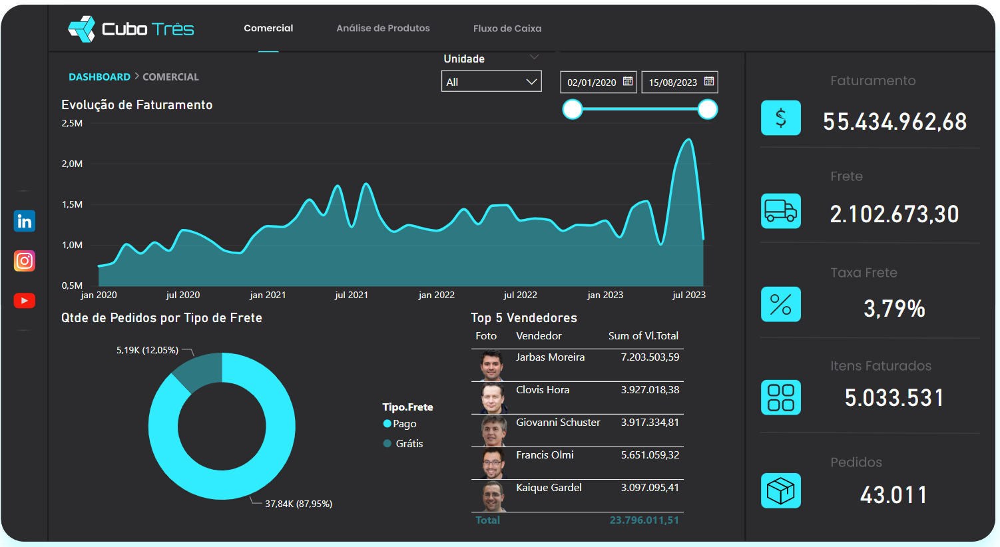
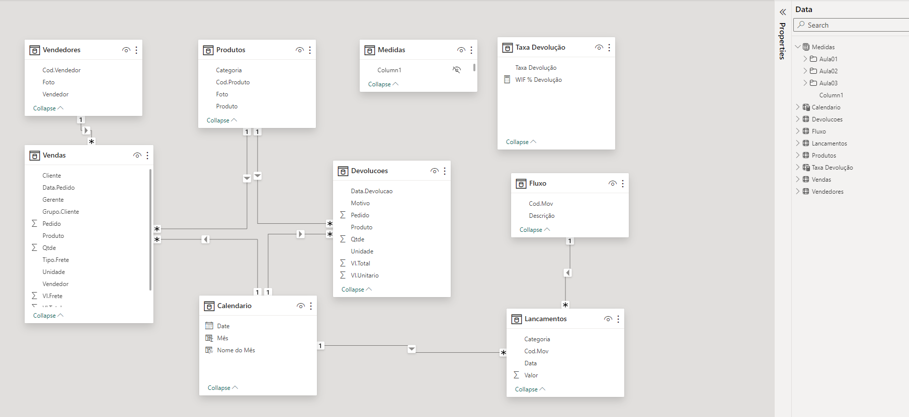

# Semana Power BI   

### Repository: [course](../../../)
### Platform: <a href="../../">cubo_tres   </a>
### Software/Subject: <a href="../">power_bi   </a>
### Course: <a href="./">curso_091 (Semana Power BI)   </a>

#### <a href="https://github.com/PedroHeeger/main/blob/main/cert_ti/05-particip/data/power_bi/(23-05-22)%20Cert%20Power%20BI%20e%20Excel%20PH%20Simplifica%20Trein.pdf">Certificate</a>
#### <a href="https://app.powerbi.com/view?r=eyJrIjoiNDlhMDYxZjktZGQ1OS00M2E4LThmYTUtNzlkMzY1Zjc0NGRkIiwidCI6ImI1NTJmZWJlLWFkMjgtNGI4Ny1iZjI5LTFlODhiYmZkY2I4ZiJ9">Power BI Report Aula 1, 2 e 3</a>
##### Para conferir outros reports e dashboards de outros projetos consulte meu repositório principal na sub-pasta de report clicando [aqui](https://github.com/PedroHeeger/main/tree/main/report).

---

### Theme:
- Data Analysis
- Business Intelligence (BI)

### Used Tools:
- Operating System (OS): 
  - Windows 11 
- Cloud Services:
  - Google Drive 
- Language:
  - HTML   
  - Linguagem M e Expressões DAX
  - Markdown   
- BI Tool: 
  - Excel 
  - Power BI   
  - Power Query 
- Integrated Development Environment (IDE) and Text Editor:
  - Visual Studio Code (VS Code)   
- Versioning: 
  - Git   
- Repository:
  - GitHub   

---

<a name="item0"><h3>Course Strcuture:</h3></a>
1. <a href="#item01">SEMANA POWER BI - Aula 1: O Poder dos Dados + Dashboard Comercial</a><br>
2. <a href="#item02">SEMANA POWER BI - Aula 2: Simulação de Cenários + Dashboard de Análise de Produtos</a><br>
3. <a href="#item03">SEMANA POWER BI - Aula 3: Recursos Interativos + Dashboard de Fluxo de Caixa</a><br>
4. SEMANA POWER BI - Programa Detalhado de Desenvolvimento em Power BI

---

### Objective:
O objetivo deste curso foi introduzir sobre o software **Power BI**, apresentando suas funcionalidades e executar a construção de três reports a partir de arquivos de base de dados sobre as seguintes temáticas: comercial, análise de produtos e fluxo de caixa.

### Structure:
A estrutura (Imagem 01) deste curso é composta por:
- Este arquivo de README.md.
- A pasta `base_dados` com os três arquivos em **Excel** de base de dados para construção dos reports.
- A pasta `resources` com alguns arquivos de recursos utilizados como backgrounds.
- A pasta **0-aux**, pasta auxiliar com imagens utilizadas na construção desse arquivo de README. 
- Obs.: A logomarca do curso foi criada apenas para fins didáticos com o uso do site de inteligência artificial **Brandmark**.

<div align="Center"><figure>
    <br>
    <figcaption>Imagem 01.</figcaption>
</figure></div><br>

### Development:
Este projeto foi desenvolvido em quatro aulas, sendo a última aula apenas informações sobre o curso completo da plataforma.

<a name="item01"><h4>SEMANA POWER BI - Aula 1: O Poder dos Dados + Dashboard Comercial</h4></a>[Back to summary](#item0)

Na primeira aula deste curso foi desenvolvido um report comercial no software **Power BI** através da base de dados `Comercial` fornecida pela plataforma do curso em **Excel**. Os dados dessa base foram carregados para o **Power BI Desktop**, onde foram selecionadas as três tabelas desse arquivo (`Vendas`, `Vendedores` e `Produtos`). A tabela `Vendas` era formada pelas seguintes colunas: `Data.Pedido`, `Vendedor`, `Gerente`, `Unidade`, `Cliente`, `Grupo.Cliente`, `Produto`, `Qtde`, `Vl.Unit` e `Vl.Frete`. A tabela `Vendedores`era composta por: `Cod.Vendedor`, `Vendedor`, `Foto`. Já a tabela `Produtos` tinha as colunas: `Cod.Produto`, `Produto`, `Categoria`, `Foto`. Essas tabelas selecionadas tornaram-se queries no **Power Query** e o processo de **ETL (Extract, Transform e Load)** foi iniciado.

A primeira consulta que foram realizadas alterações foi a de `Vendas`. Nas colunas `Vendedor` e `Produto` foi extraído o texto antes do delimitador, cujo delimitador era `-`, para manter na coluna apenas os códigos e remover os nomes, pois esses códigos seriam utilizados para relacionar com as outras duas queries. Em seguida, foi criada uma nova coluna de nome `Vl.Total` que realizou a multiplicação das colunas `Qtde` e `VI.Unitario`. A próxima coluna criada foi uma coluna condicional de nome `Tipo.Frete` que criou uma condicional referenciando a coluna `VI.Frete` que caso os valores fossem maiores do que zero, o resultado seria `Pago`, caso constrário, seria `Grátis`. Após isso, foi verificado em todas as queries se em todas as colunas o tipo de dados tinha sido identificado, caso não fosse, seria feito a definição do tipo de dado da coluna. Por fim, as consultas foram carregadas no **Power BI** na forma de tabelas.

Caso o relacionamento não fosse identificado automaticamente, seria necessário relacionar as colunas `Cod.Produto` da tabela dimensão `Produto` e `Cod.Vendedor` da tabela dimensão `Vendedor` com as colunas `Produto` e `Vendedor` da tabela fato `Vendas`. Antes de iniciar a montagem do report, foi definido o background utilizado para esse report, sendo este elaborado no software **Figma** e fornecido pela plataforma do curso. Após isso foi realizada a construção do report contendo os seguintes visuais: gráfico de área (análise da evolução de faturamento), gráfico de rosca (análise da quantidade de pedidos por tipo de frete), visual de tabela (análise do top 5 vendedores), duas segmentações de dados (análise por unidade e por período), e cinco visuais de cartão (análises de faturamento total, custo total de frete, taxa de frete, total de itens faturados e total de pedidos).

Para utilização nos cartões foram desenvolvidas algumas medidas, com a utilização das **Expressões DAX**, que foram armazenadas em uma tabela vazia criada. A primeira medida foi faturamento total das vendas cuja fórmula foi `Faturamento = SUM(Vendas[Vl.Total])`. A segunda medida foi o cálculo do custo total de frete com a fórmula `Frete = sum(Vendas[Vl.Frete])`. Já a terceira medida foi cálculo da taxa de frente para analisar quanto por cento o custo com frete representava do faturamento (`Taxa Frete = [Frete]/[Faturamento]`). As duas próximas medidas foram a quantidade total de itens faturados e a quantidade total de pedidos, cujas fórmulas foram `Itens Faturados = sum(Vendas[Qtde])` e `Itens Pedidos = DISTINCTCOUNT(Vendas[Pedido])`. O resultado final do report é exibido na imagem 02 abaixo, sendo que neste curso cada report resultou em uma página em um mesmo arquivo **Power BI**.

<div align="Center"><figure>
    <br>
    <figcaption>Imagem 02: Report Comercial.</figcaption>
</figure></div><br>

<a name="item02"><h4>SEMANA POWER BI - Aula 2: Simulação de Cenários + Dashboard de Análise de Produtos</h4></a>[Back to summary](#item0)

Na segunda aula foi dado continuidade ao projeto realizado no arquivo de **Power BI** na aula 1, construindo uma segunda página para o report cuja temática agora foi sobre análise de produtos. Para esse report foi necessário importar para o **Power BI** o arquivo de base de dados em **Excel** de nome `Devolucoes`. Neste arquivo, a única tabela existente foi a selecionada e importada para o **Power Query** para iniciar o processo de **ETL**. A tabela de nome `Devolucoes` continha as seguintes colunas: `Pedido`, `Data.Devolucao`, `Unidade`, `Produto`, `Qtde`, `Vl.Unitário`, `Vl.Total` e `Motivo`. O único tratamento foi verificar se em todas as colunas o tipo de dado foi identificado, caso não fosse, era necessário definí-lo. Após isso, a query foi importada para o **Power BI**.

A próxima etapa foi conferir se o relacionamento da tabela dimensão `Produtos` com essa nova tabela fato foi realizado automaticamente. Na tabela de medidas foi organizada todas as medidas criadas na aula 1 para a pasta `Aula01`. Em seguida, foi gerada uma nova tabela vazia e inserido a **Expressão DAX** `Calendario = CALENDARAUTO()` para construção de uma tabela calendário de forma automática. A coluna `Date` desta tabela foi relacionada com as colunas `Data.Pedido` e `Data.Devolucao` das tabelas fato `Vendas` e `Devolucoes` respectivamente. Por causa desta nova tabela foi necessário ir no report comercial, no gráfico de área e alterar a data para a da tabela `Calendario`.

Dando continuidade foi copiado a segmentação de dados de período da página 1 e colada na página 2, alterando a data para tabela `Calendario`, pois a data desta tabela englobava tanto as datas de vendas como de devolução. Também foi criado um parâmetro do tipo intervalo numérico e tipo de dado número decimal, cujos valores mínimo e máximo era 0 e 1, ou seja, 0 a 100%, e o incremento era de 0.01. Esse parâmetro tinha que está vinculado a segmentação de dados desta página. O parâmetro quando criado gerou uma nova tabela com uma coluna e uma medida, sendo possível realizar alterações nesses elementos da mesma forma que uma tabela é alterada. A coluna e a tabela possuía o mesmo nome e mesma fórmula que no caso foi `Parameter = GENERATESERIES(0, 1, 0.01)`, enquanto a medida possuía a fórmula `Parameter Value = SELECTEDVALUE('Taxa Devolução'[Taxa Devolução])`. Na ocasião, tanto o nome da tabela como da coluna foi modificado para `Taxa Devolução`. Já o nome da medida foi alterado para `WIF % Devolução`. Também foi necessário modificar o valor de `1` para `1.01`, para que o valor alcançasse os 100%.

Após isso, algumas medidas foram elaboradas, sendo a primeira delas a quantidade total de devoluções cuja fórmula foi `Devoluções = DISTINCTCOUNT(Devolucoes[Pedido])`. A próxima medida foi a quantidade de pedidos extras (`Pedidos Extras = ([Devoluções]*[WIF % Devolução])`), ou seja, a quantidade de pedidos necessários devido a devoluções realizadas. A terceira medida calculou o valor em reais do total de devoluções com a fórmula `Devolução R$ = SUM(Devolucoes[Vl.Total])`. A medida seguinte `Faturamento Extra = ([Devolução R$] * [WIF % Devolução])` calculou quanto seria o faturamento extra devido a devoluções. As medidas `Pedidos Extras` e `Faturamento Extra` foram inseridas em um visual de cartão cada uma.

Um gráfico de colunas foi inserido para realizar uma simulação do faturamento extra por período. Neste gráfico tanto o `Faturamento` como `Faturamento Extra` foram adicionados ao eixo X. Perceba que as medidas `Faturamento Extra` e `Pedidos Extras` utilizam as medidas `Devolução R$` e `Devoluções`, que calculam o somatório do `Vl.Total` e `Pedidos` distintos, e multiplicam pelo valor da medida `WIF % Devolução` do parâmetro a partir da decisão de uma taxa de devolução de 0 a 100% determinada em uma segmentação de dados. Uma segmentação de dados foi adicionada para filtragem por nome do produto, sendo filtrado apenas os elementos que fossem maiores que 0, ou seja, exibindo apenas produtos que tivessem devoluções. Também foi inserido um visual de `Simple Image`, onde no seu único campo foi adicionada a coluna `Foto` da tabela `Produtos`. Por fim, foi inserido um gráfico de linha para análise da previsão de faturamento, adicionando a medida `Faturamento` da aula 1 e data da tabela calendário, e habilitando a previsão de 12 meses. A imagem 03 a seguir ilustra a página 2 do report concluída.

<div align="Center"><figure>
    <br>
    <figcaption>Imagem 03: Report Análise de Produtos.</figcaption>
</figure></div><br>

<a name="item03"><h4>SEMANA POWER BI - Aula 3: Recursos Interativos + Dashboard de Fluxo de Caixa</h4></a>[Back to summary](#item0)

Na terceira aula foi desenvolvido a terceira página do report cuja temática foi sobre fluxo de caixa. Para isso o processo inicial foi o mesmo, definição do arquivo de background fornecido pela plataforma do curso, e importação para o **Power BI** o arquivo de excel de base de dados de nome `Fluxo`. Neste arquivo não existiam tabelas, existia duas abas, sendo a primeira de nome `Lançamentos` e a segunda de nome `Fluxo`, portanto teve que selecionar essas duas opções. Essas duas estruturas originaram duas queries, de mesmo nome das abas da planilha, no **Power Query**. A consulta `Lançamentos` possuía as seguintes colunas: `Data`, `Categoria`, `Cod.Mov` e `Valor`. Já a query `Fluxo` apenas as colunas: `Cod.Mov` e `Descrição`. Assim inicia o processo de **ETL**.

Na etapa de transformação, a única ação a ser executada foi verificar se os tipos de dados tinham sido definidos automaticamente. Após isso, os dados foram carregados no **Power BI** resultando em duas novas tabelas (`Lançamentos` e `Fluxo`). Em seguida, foi conferido se o relacionamento entre estas duas tabelas foi identificado automaticamente através da coluna `Cod.Mov` e relacionado a coluna `Data` da tabela fato `Lancamentos` com a coluna `Date` da tabela `Calendario`. Também foi organizado as medidas construídas na aula 2 na pasta `Aula02` criada dentro da tabela de `Medidas`, para que não fosse misturadas com as medidas que seriam criadas nesta aula.

A primeira medida elaborada foi soma de todos os lançamentos através da expressão `Soma Lançamentos = sum(Lancamentos[Valor])`. As duas medidas seguintes utilizou a expressão `CALCULATE` para executar a medida anterior, se uma condição fosse atendida, ou seja, para somar todos os lançamentos que atendessem a condição estabelecida. A medida `Entradas` somou todos os lançamentos que fossem maiores que zero, ou seja, as entradas (`Entradas = CALCULATE([Soma Lançamentos], Lancamentos[Valor]>0)`). Já a medida `Saída` fez o contrário, somou todos os lançamentos menores que zero (`Saídas = CALCULATE([Soma Lançamentos], Lancamentos[Valor]<0)`) e para não ficar com sinal negativo multiplicou-se por `-1`. Com essas três medidas, três visuais de cartão foram construídos.

Após isso, foi desenvolvida uma segmentação de dados para filtragem por ano e então foi criada uma coluna na tabela `Calendario` de nome `Nome do Mês` com a seguinte **Expressão DAX** `Nome do Mês = FORMAT(Calendario[Date], "mmm")`. Esta expressão formatou para essa nova coluna o nome do mês com três letras a partir da coluna de data. Uma segunda coluna foi construída também, cuja fórmula foi `Mês = MONTH([Date])`, apenas para extrair o número do mês da coluna de data e utilizá-la para classificar a nova coluna `Nome do Mês` a partir dela. Com as medidas de `Entradas` e `Saída` foi desenvolvido um gráfico de colunas clusterizadas para análise comparativa entre ambas por mês.

Agora na tabela `Fluxo`, a coluna `Descrição` foi classificada com base na coluna `Cod.Mov` para manter a ordem atual da tabela. Em seguida algumas medidas um pouco mais complexas foram elaboradas com as **Expressões DAX**. A primeira delas foi a medida `Saldo Operacional` que calculou a soma dos lançamentos cujo código de movimentação era 1 ou 2, ou seja, a soma de todos os lançamentos de entradas e saídas. Esta medida utilizou a expressão `ALL(Fluxo)` para remover todos os filtros e então filtrar apenas os códigos 1 e 2, excluindo os códigos 3, 4 e 5, pois o saldo operacional era só a soma das entradas e saídas. A segunda medida foi `Saldo Inicial` que calculou a soma de todos os lançamentos, removendo todos os filtros do calendário com a expressão `ALL(Calendario)` e filtrando apenas as datas inferiores a data atual, ou seja, somou todos os lançamentos até o mês atual. Já a medida `Saldo Final` foi a soma das duas medidas.

```
Saldo Operacional = CALCULATE([Soma Lançamentos], ALL(Fluxo), Lancamentos[Cod.Mov] = 1 || Lancamentos[Cod.Mov] = 2)
Saldo Inicial = CALCULATE([Soma Lançamentos], ALL(Calendario), Calendario[Date] < MIN(Calendario[Date]))
Saldo Final = [Saldo Inicial] + [Saldo Operacional]
```

Uma outra medida de nome `Fluxo` foi desenvolvida para determinar para cada opção de descrição um resultado específico, sendo utilizada as três medidas anteriores para as opções 3, 4 e 5 da tabela `Fluxo`, pois as opções 1 e 2 seriam calculadas através do resultado padrão já que os códigos delas duas estavam na tabela `Lançamentos`, as demais não existiam lá.

```
Fluxo = 
SWITCH(
    SELECTEDVALUE(Fluxo[Descrição]),
    "SALDO OPERACIONAL", [Saldo Operacional],
    "SALDO INICIAL", [Saldo Inicial],
    "SALDO FINAL", [Saldo Final],
    [Soma Lançamentos]
)
```

Todas essas medidas elaboradas foram utilizadas para montar um visual de matriz para análise do fluxo de caixa por mês. Um outro gráfico foi inserido para análise da evolução do caixa, ou seja, utlizou a medida `Saldo Final`, sendo este um gráfico de linha. Após isso, as medidas criadas nesta aula foram armazenadas em uma nova pasta de nome `Aula03`. A última etapa foi a inserção de seis botões em cada página, sendo três para direcionar para as redes sociais (Linkedin, Instagram e Youtube, no meu caso, coloquei o link do GitHub no lugar do Youtube), e os outros três para navegar entre as páginas do report. A imagem 04 abaixo evidencia a conclusão da página 3 do report. Já a imagem 05 mostra como ficou a modelagem das tabelas.

<div align="Center"><figure>
    <br>
    <figcaption>Imagem 04: Report Fluxo de Caixa.</figcaption>
</figure></div><br>

<div align="Center"><figure>
    <br>
    <figcaption>Imagem 05.</figcaption>
</figure></div><br>