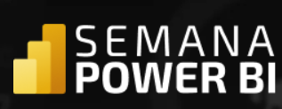

# Semana Power BI   

### Repository: [course](../../../../)
### Platform: <a href="../../">cubo_tres   </a>
### Software/Subject: <a href="../">power_bi   </a>
### Course: <a href="./">curso_091 (Semana Power BI)   </a>

#### <a href="https://github.com/PedroHeeger/main/blob/main/cert_ti/05-particip/data/power_bi/(23-05-22)%20Cert%20Power%20BI%20e%20Excel%20PH%20Simplifica%20Trein.pdf">Certificate</a>
#### <a href="https://app.powerbi.com/view?r=eyJrIjoiYTYyZmZlNjctYjhkYS00MGFmLWIyZWMtMjgxODM2YTdiNTE5IiwidCI6ImI1NTJmZWJlLWFkMjgtNGI4Ny1iZjI5LTFlODhiYmZkY2I4ZiJ9">Power BI Report Aula 1</a>
#### <a href="https://app.powerbi.com/view?r=eyJrIjoiNDRlNmU5NTMtYjk0ZC00NGI2LTkyYTMtZTdmOWQ2NjhiNDRkIiwidCI6ImI1NTJmZWJlLWFkMjgtNGI4Ny1iZjI5LTFlODhiYmZkY2I4ZiJ9">Power BI Report Aula 2</a>
#### <a href="https://app.powerbi.com/view?r=eyJrIjoiNDRlNmU5NTMtYjk0ZC00NGI2LTkyYTMtZTdmOWQ2NjhiNDRkIiwidCI6ImI1NTJmZWJlLWFkMjgtNGI4Ny1iZjI5LTFlODhiYmZkY2I4ZiJ9">Power BI Report Aula 3</a>
##### Para conferir outros reports e dashboards de outros projetos consulte meu repositório principal na sub-pasta de report clicando [aqui](https://github.com/PedroHeeger/main/tree/main/report).

---

### Theme:
- Data Analysis
- Business Intelligence (BI)

### Used Tools:
- Operating System (OS): 
  - Windows 11 
- Cloud Services:
  - Google Drive 
- Language:
  - HTML   
  - Linguagem M e Expressões DAX
  - Markdown   
- BI Tool: 
  - Excel 
  - Power BI   
  - Power Query 
- Integrated Development Environment (IDE) and Text Editor:
  - Visual Studio Code (VS Code)   
- Versioning: 
  - Git   
- Repository:
  - GitHub   

---

<a name="item0"><h3>Course Strcuture:</h3></a>
1. <a href="#item01">SEMANA POWER BI - Aula 1: O Poder dos Dados + Dashboard Comercial</a> 
2. <a href="#item02">SEMANA POWER BI - Aula 2: Simulação de Cenários + Dashboard de Análise de Produtos</a> 
3. <a href="#item03">SEMANA POWER BI - Aula 3: Recursos Interativos + Dashboard de Fluxo de Caixa</a> 
4. <a href="#item04">SEMANA POWER BI - Programa Detalhado de Desenvolvimento em Power BI</a> 

---

### Objective:
O objetivo desse projeto prático foi introduzir as principais ferramentas e fórmulas dos softwares **Microsoft Excel** e **Microsoft Power BI**, desenvolvendo três reports, um para **Excel** e outros dois para **Power BI**, sendo um do mesmo tema do **Excel**. A temática do report igual para os dois, consistiu em um cenário hipotético de **atendimentos de uma clínica de saúde** nos anos de 2020 e 2021. Já o tema do segundo report de **Power BI** foi referente a um cenário hipotético de **vendas**.

### Structure:
A estrutura (Imagem 01) é composta por três sub-pastas, cada pasta para uma das quatro aulas, sendo que as aulas 1 e 2 foram realizadas no mesmo arquivo, ou seja, na mesma sub-pasta.
- A pasta **aula_01_02** possui arquivos de **Excel** (base de dados, arquivos de construção do report), um arquivo em **Word** com o roteiro do projeto e uma sub-pasta com as imagens que foram utilizadas como ícones no desenvolvimento do report.
- A pasta **aula_03** contém apenas um arquivo em **Excel** com a base de dados, um arquivo em **Power BI** com o report construído e também uma sub-pasta com os arquivos de criação do plano de fundo do report (arquivos de imagens e **Power Point**).
- A pasta **aula_04** tem duas bases de dados em **Excel**, um arquivo de imagem e um de **Power Point** para construção do plano de fundo, e o arquivo de **Power BI** com o report desenvolvido.
- A pasta **0-aux**, pasta auxiliar com imagens utilizadas na construção desse arquivo de README. 
- Obs.: A logomarca do curso foi criada apenas para fins didáticos com o uso do site de inteligência artificial **Brandmark**.

<figure>
     
    <figcaption>Imagem 01.</figcaption>
</figure>
 

### Development:
Este projeto foi desenvolvido em quatro aulas. 

<a name="item01"><h4>SEMANA POWER BI - Aula 1: O Poder dos Dados + Dashboard Comercial</h4></a>[Back to summary](#item0)

<figure>
     
    <figcaption>Imagem 02: Report Atendimentos.</figcaption>
</figure>
 

<a name="item02"><h4>SEMANA POWER BI - Aula 2: Simulação de Cenários + Dashboard de Análise de Produtos</h4></a>[Back to summary](#item0)

<a name="item03"><h4>SEMANA POWER BI - Aula 3: Recursos Interativos + Dashboard de Fluxo de Caixa</h4></a>[Back to summary](#item0)

<a name="item04"><h4>SEMANA POWER BI - Programa Detalhado de Desenvolvimento em Power BI</h4></a>[Back to summary](#item0)
