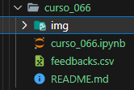
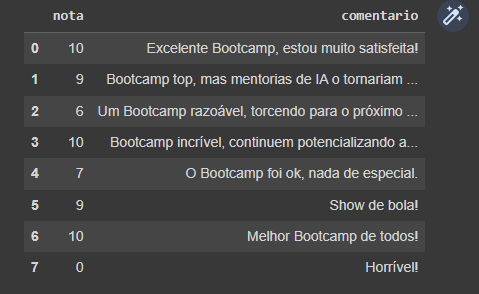
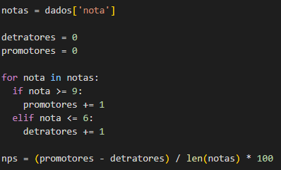
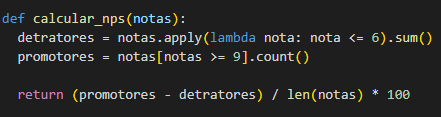
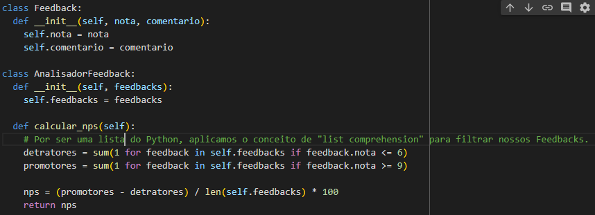
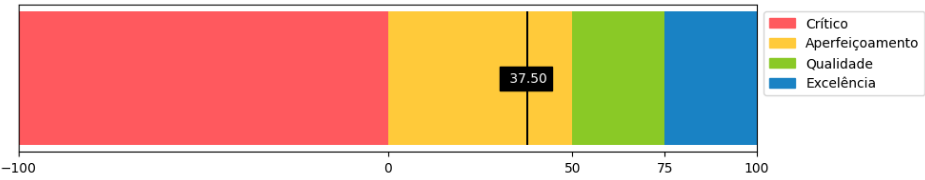

# Dev Week - Ifood Ciência de Dados com Python   

#### Repositório: [course](../../../)   
#### Plataforma: <a href="../../">dio   </a>   
#### Software/Assunto: <a href="../">python   </a>
#### Curso: <a href="./">curso_066 (Dev Week - Ifood Ciência de Dados com Python)   </a>

#### Tema:
- Ciência de Dados
- Inteligência Artificial (AI)

#### Ferramentas Utilizadas:
- Linguagem de Programação: 
  - Python   
- Ambiente de Desenvolvimento (IDE):
  - Google Colab   
  - VS Code   
- Versionamento: 
  - Git   
- Repositório:
  - GitHub   
- Bibliotecas: 
  - Gdown   
  - Matplotlib   
  - Pandas   
  - Openai   
- Outros:
  - Google Drive 
  - Excel 
  - ChatGPT 

---

#### Objetivo:
- O objetivo desse projeto prático é analisar a satisfação dos feedbacks dos talentos da DIO em relação a um Bootcamp qualquer (cujo os dados foram gerados hipoteticamente apenas para fins didáticos). Essa análise é feita através do o cálculo do Net Promoter Score (NPS), uma métrica utilizada para medir a experiência do cliente e prever o crescimento dos negócios, para notas dada para esse Bootcamp. Sendo utilizado também as técnicas de Natural Language Processing (NLP) para analisar os sentimentos expressos nos comentários associados às notas.

#### Estrutura:
- A estrutura é composta por apenas um arquivo de script em Jupyter Notebook (**curso_066.ipynb**), utilizado para executar os códigos; um arquivo de Excel em CSV (**feedbacks.csv**), que é a base de dados; este arquivo de README e uma pasta contendo algumas imagens auxilares utilizadas nesse arquivo de README. A estrutura é exibida na imagem 01.

#### Desenvolvimento:
Este projeto foi realizado em três aulas. 

  ##### Aula 01:
  Na aula 1, foi criado um arquivo de Excel no formato CSV com apenas uma planilha contendo duas colunas para ser nossa base de dados e salvamos no **Google Drive**. A primeira coluna referente a **nota**, com as notas que, hipoteticamente, os alunos deram para um Bootcamp qualquer da DIO, e a segunda coluna nomeada de **comentario** com os comentários que os alunos deram para esse mesmo Bootcamp.

  Utilizei a linguagem de programação **Python** no nosso ambiente de desenvolvimento **Google Colab** para escrever nosso arquivo de script em Jupyter Notebook. Iniciei o código utilizando a biblioteca **gdown** para baixar a base de dados para a pasta **/content** do sistema de arquivos no **Google Colab**. Através da biblioteca Pandas foi realizado a leitura do arquivo em CSV para um Dataframe e o output é mostrado na imagem 02.

  

  A partir da criação do Dataframe realizei o cálculo do **Net Promoter Score (NPS)**. O NPS é uma métrica utilizada para medir a experiência do cliente e prever o crescimento dos negócios. Ela fornece uma escala de 0 a 10 para determinar quem são os clientes Detratores (pontuação de 0 a 6), os Passivos (pontuação de 7 a 8), e os Promotores (pontuação de 9 a 10). Feito a determinação, a métrica utiliza a fórmula **NPS = % Promotores - % Detratores** para cálculo do NPS, descartando os clientes Passivos.

  Construí três blocos de códigos com o mesmo processo, para cada bloco foi utilizando três paradigmas de programação diferentes. O primeiro paradigma utilizado, como apresentado na imagem 03, é o **Paradigma Imperativo**, onde a implementação é realizada de uma maneira imperativa, ou seja, os comandos são executados sequencialmente. 

   

  O segundo paradigma (imagem 04) utilizado é o **Paradigma Funcional**, no qual criamos uma função para encapsular a lógica de cálculo do NPS apresentando uma separação de responsabilidades mais claras do que a versão imperativa, além de melhorias de código pontuais. 

   

  Já o terceiro paradigma (imagem 05) é o **Paradigma Orientado a Objetos (POO)**, neste, duas classes são definidas, onde **Feedback** representa um único feedback de usuário e **AnalisadorFeedback** é utilizado para o cálculo do NPS a partir de uma lista de Feedbacks. A POO fornece uma abstração mais clara dos dados e comportamentos envolvidos no cálculo do NPS.

  

  ##### Aula 02:
  Nesta aula com o uso do módulo **pyplot** da biblioteca **matplotlib** foi construído um gráfico de colunas para determinar as zonas do NPS. Dividi o gráfico em quatro zonas: Crítico, Aperfeiçoamento, Qualidade e Excelência, cada zona com uma cor e uma faixa de valores no eixo X. Em seguida, inseri o valor calculado do NPS no gráfico e configurei o layout. Com o uso do módulo **patches** construí e inseri a legenda no gráfico. O resultado é exibido na imagem 06.

  

  ##### Aula 03:
  Na última aula, utilizei a biblioteca **openai** e configurei uma API Key na minha conta do site da [OpenAI](https://platform.openai.com/account/api-keys) para integrar com o ChatGPT. Criei uma função que utiliza os feedbacks da base de dados formatando as duas colunas para um padrão (nota-comentario). Em seguida construí uma variável para armazenar o prompt que o GPT irá executar. Com os feedbacks formatados e o prompt estabelecido, criei uma consulta e passei essas informações para o ChatGPT realizar uma análise de sentimento com base nessas informações, e pedi para ele classificar o feedback formatado em Positivo, Neutro ou Negativo. Realizei esse mesmo processo, retirando as notas do feedback, mantendo apenas o comentário.

