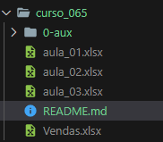

# Semana do Excel na Prática   

### Repository: [course](../../../)
### Platform: <a href="../../">empowerdata   </a>
### Software/Subject: <a href="../">excel   </a>
### Course: <a href="./curso_065">curso_065 (Semana do Excel na Prática)   </a>

#### <a href="https://github.com/PedroHeeger/main/blob/main/cert_ti/05-particip/data/excel/(23-06-22)%20Cert%20Excel%20PH%20Empowerdata%20(Semana).pdf">Certificate</a>
##### Para conferir outros reports e dashboards de outros projetos consulte meu repositório principal na sub-pasta de report clicando [aqui](https://github.com/PedroHeeger/main/tree/main/report).

---

### Theme:
- Data Analysis

### Used Tools:
- BI Tool: 
  - Excel 
- Integrated Development Environment (IDE):
  - VS Code   
- Versioning: 
  - Git   
- Repository:
  - GitHub   
- Others:
  - Google Drive 
  - Looka 

---

### Objective:
O objetivo desse projeto prático foi introduzir as principais ferramentas e fórmulas do software **Microsoft Excel**. Além de desenvolver um report do zero sobre a temática **gestão logística**.

### Structure:
A estrutura (Imagem 01) do projeto é formada por:
- Três arquivos em **Excel** um para cada aula, a quarta aula não teve parte prática.
- A pasta **0-aux**, pasta auxiliar com imagens utilizadas na construção desse arquivo de README. 
- Obs.: A logomarca do curso foi criada apenas para fins didáticos, utilizando o site de inteligência artificial **Looka**.

<figure>
     
    <figcaption>Imagem 01.</figcaption>
</figure>
 

### Development:
Este projeto foi desenvolvido em quatro aulas. Sendo a parte prática desenvolvida em três aulas.

#### Class 1
Na primeira aula, foi feita apenas uma introdução às ferramentas e fórmulas do **Excel**. Nela, foi desenvolvida, a partir de uma aba com a base de dados, outra aba contendo uma tabela com esses dados organizados e formatados. Além disso, nesta mesma aba, foram criadas duas segmentações de dados e uma tabela auxiliar com alguns cálculos de quantidade e custo utilizando as fórmulas `COUNTIF` e `SUMIF`.

#### Class 2
Na aula 2 foi utilizado o **Power Query** em um novo arquivo para realizar um processo de ETL (Extração, Transformação e Carregamento) de uma base de dados, que agora, estava em outro arquivo de **Excel** separado. Os dados foram tratados e carregados no novo arquivo em um formato de tabela. Uma segunda aba foi gerada para construção de três tabelas dinâmicas e seus respectivos gráficos.

#### Class 3
Já na terceira aula, a partir de uma aba com a base de dados já tratada e em formato de tabela foi criado cinco tabelas dinâmicas que serviram de base para construção dos gráficos dinâmicos, parte fundamental da elaboração do report. Os gráficos construídos foram: **Top 3 Tranportadoras** (Gráfico de Coluna), **Análise por Status** (Gráfico de Rosca), **Faturamento por Período** (Gráfico de Coluna) e **Quantidade de Pedidos por Transportadora** (Gráfico de Barras). Além dos gráficos, esse report possui três visuais de cartões que foram construídos com as formas do **Excel** para as seguintes métricas: **Faturamento Total**, **Quantidade de Pedidos** e o **Percentual dos Pedidos Atrasados**. Uma segmentação de dados foi inserida para filtragem por transportadora. A imagem 02 a seguir exibe o report. 

<figure>
     
    <figcaption>Imagem 02: Report.</a></figcaption>
</figure>
 

#### Class 4
A última aula foi apenas aula teórica sobre dicas e design de dashboards e reports.