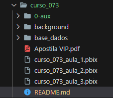
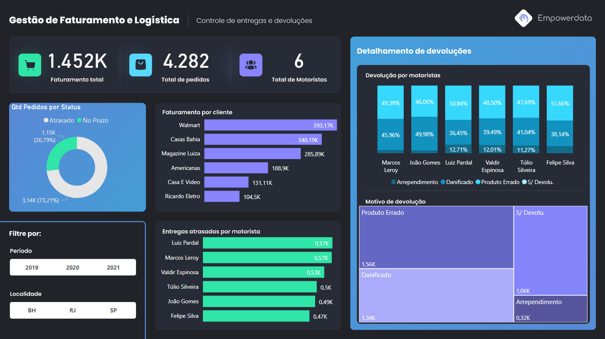
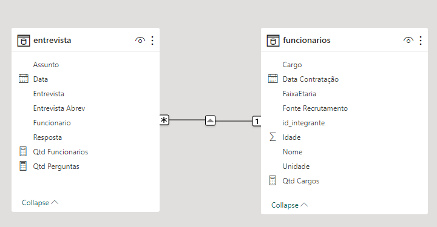

# Acelerador de Carreira com Power BI  

### Repository: [course](../../../)
### Platform: <a href="../../">empowerdata   </a>
### Software/Subject: <a href="../">power_bi   </a>
### Course: <a href="./">curso_073 (Acelerador de Carreira com Power BI)   </a>

#### <a href="https://app.powerbi.com/view?r=eyJrIjoiYmE4OWI5ZDYtNmNkYi00OGQyLWIxMzctYWVlNmJkYWUyZGMyIiwidCI6ImI1NTJmZWJlLWFkMjgtNGI4Ny1iZjI5LTFlODhiYmZkY2I4ZiJ9">Power BI Report Aula 1</a>
#### <a href="https://app.powerbi.com/view?r=eyJrIjoiOTNiZTQ2YjYtODg3Mi00OGE2LTllMDEtYzE2MmMwOGI0Y2E3IiwidCI6ImI1NTJmZWJlLWFkMjgtNGI4Ny1iZjI5LTFlODhiYmZkY2I4ZiJ9">Power BI Report Aula 2</a>
#### <a href="https://app.powerbi.com/view?r=eyJrIjoiMTRlOGVjY2QtNGEyMy00ZjY0LThkMTAtN2RjMTdhMTNmMzExIiwidCI6ImI1NTJmZWJlLWFkMjgtNGI4Ny1iZjI5LTFlODhiYmZkY2I4ZiJ9">Power BI Report Aula 3</a>
#### <a href="https://app.powerbi.com/view?r=eyJrIjoiYWUzN2Y1ZWItNWE2Yy00NGQzLWFjNjMtZWEwODI3YTNhNzlhIiwidCI6ImI1NTJmZWJlLWFkMjgtNGI4Ny1iZjI5LTFlODhiYmZkY2I4ZiJ9">Power BI Report Aula 4</a>
##### Para conferir outros reports e dashboards de outros projetos consulte meu repositório principal na sub-pasta de report clicando [aqui](https://github.com/PedroHeeger/main/tree/main/report).

---

### Theme:
- Data Analysis
- Business Intelligence (BI)

### Used Tools:
- BI Tool: 
  - Power BI   
  - Power Query 
- Integrated Development Environment (IDE):
  - VS Code   
- Versioning: 
  - Git   
- Repository:
  - GitHub   
- Others:
  - Google Drive 
  - Excel 
  - PowerPoint 
  - Brandmark 
  - Linguagem M e Expressões DAX

---

### Objective:
O objetivo desse projeto prático foi construir três reports com as seguintes temáticas respectivamente: **logístico**, **recursos humanos (RH)** e **vendas**. Durante a construção foram apresetadas as ferramentas e funções do **Power BI** e também do **Power Query**.

### Structure:
A estrutura (Imagem 01) do projeto é formada por:
- Quatro arquivos em **Power BI**, um para cada aula, com a construção dos reports.
- Uma apostila em **PDF** com o resumo das aulas.
- Uma pasta (**base_dados**) com quatro arquivos em **Excel** utilizado para alimentar os relatórios.
- Uma pasta (**background**) com quatro imagens para utilização como plano de fundo no **Power BI**. 
- A pasta **0-aux**, pasta auxiliar com imagens utilizadas na construção desse arquivo de README.
- Obs.: A logomarca do curso foi criado apenas para fins didáticos utilizando o site de inteligência artificial **Brandmark**.

<div align="Center"><figure>
    <br>
    <figcaption>Imagem 01.</figcaption>
</figure></div><br>

### Development:
Este projeto foi desenvolvido em quatro aulas.

#### Class 1
Na primeira aula, foi realizada a construção de um report sobre o tema **logística**. A partir do arquivo de base de dados em **Excel** (**BD_Logistica**), foi executado o prcesso de **ETL** (Extração, Transformação e Carregamento) no **Power Query**, gerando um única consulta. O arquivo de **Excel** possuía uma única planilha com as seguintes colunas: **Nº Pedido**, **Cliente-Motorista**, **Data Emissão Pedido**, **Data Entrega Prevista**, **Destino**, **Itens**, **R$ Faturados**, **Saída para Entrega**, **Data Entrega Real**, **Qtd Devolução**, **Mot. Devolução**, **Dias Para Entrega** e **Status**. Na etapa de transformação do ETL, as primeiras alterações foram promoção da primeira linha para cabeçalho e definição dos tipos de dados das colunas. A coluna **Cliente-Motorista** foi dividida em duas outras colunas (**Cliente** e **Motorista**) e o formato dos dados foi alterado de tudo maiúsculo para primeira letra maiúscula. Com isso, os dados foram carregados em uma tabela no **Power BI**.

Para construção do report, não foi necessária a criação de medidas. Foram adicionados três visuais de cartão apresentando as informações de **Faturamento Total**, **Total de Pedidos** e **Total de Motoristas**. Os gráficos desenvolvidos realizaram as seguintes análises: **Quantidade de Pedidos por Status** (Gráfico de Rosca), **Análise de Faturamento por Cliente** (Gráfico de Barra), **Análise de Entregas Atrasadas por Motorista** (Gráfico de Barra) e **Análise de Devolução por Motorista** (Gráfico de Colunas Empilhadas). Também foi inserido um visual de mapa de árvore para uma **Análise da Quantidade por Motivo de Devolução**, além de duas segmentações de dados para filtragem por **Ano** e **Destino**. O plano de fundo foi construído no **PowerPoint**, pela plataforma do curso, e exportado para imagem. A imagem foi adicionada ao report e a visualização final pode ser analisada na imagem 02 a seguir.

<div align="Center"><figure>
    <a href="https://app.powerbi.com/view?r=eyJrIjoiYTAxY2YwMmEtZGIwZi00Y2EzLThmN2UtYTVlMmRjODEzY2QyIiwidCI6ImI1NTJmZWJlLWFkMjgtNGI4Ny1iZjI5LTFlODhiYmZkY2I4ZiJ9"><br>
    <figcaption>Imagem 02: Report Logístico.</figcaption></a>
</figure></div><br>

#### Class 2
O segundo report construído foi referente ao tema **recursos humanos (RH)**. O processo inicial é o mesmo da aula anterior, sendo que a base de dados agora, eram dois arquivos de **Excel** (**BD-RH** e **bd_integrantes**, sendo este segundo em formato **CSV**). Um arquivo tornou-se a **tabela fato** e o outro **tabela dimensão**, criando um relacionamento entre elas. No arquivo da tabela fato existiam duas abas com a mesma estrura de dados, formadas pelas colunas: **Entrevista**, **Data**, **Resposta**, **Funcionario** e **Assunto**. Já no outro arquivo, a única aba existente possuía a seguinte estrutura: **id_integrante**, **Unidade**, **Cargo / Nome**, **Data Contratação**, **Idade**, **Status do Integrante**, **Fonte de Recrutamento** e **Ano Contratacao**. Ambos foram extraídos para o **Power Query**, originando três Queries (**2019**, **2020** e **bd_integrantes**) que foram submetidos a um processo de **ETL**. 

Automaticamente o **Power Query** realizou duas alterações inicias, promoveu a primeira linha para cabeçalho e definiu os tipos de dados das colunas. A consulta **bd_integrantes** foi renomeada para **funcionarios** e outras transformações foram realizadas. Foi dividido a coluna **Cargo / Nome** em duas colunas **Cargo** e **Nome**. As colunas **Status do Integrante** e **Ano Contratacao** foram excluídas. Foi criada uma coluna de exemplo (**FaixaEtaria**) em relação a coluna **Idade**, onde foi escrita nas três primeiras linhas o exemplo (36-40, 41-45 e 46-50) e foi identificado as outras linhas da coluna. As Queries da tabela fato foram mescladas dando origem a uma nova Query nomeada de **entrevista** e desabilatadas para carregamento, já que a nova Query possuía as informações. Nesta nova consulta, foi criada uma coluna de exemplo (**Entrevista Abrev**) referente a coluna **Entrevista**, só para abreviar o texto dos dados.

Dando seguimento, os dados foram carregados em duas tabelas no **Power BI** com o mesmo nome das consultas. A coluna **id_integrante** da tabela dimensão **funcionarios** foi relacionada com a coluna **funcionarios** da tabela fato **entrevista**. Três medidas foram criadas para a construção do report. A medida **Qtd Perguntas** contabilizou a quantidade de linhas de entrevista, ou seja, quantidade de perguntas. A medida **Qtd Cargos** contou a quantidade de cargos diferentes, enquanto a medida **Qtd Funcionarios** countou a quantidade de funcionários. A modelagem dos dados é exibida na imagem 03.

```
Qtd Perguntas = COUNTROWS(entrevista)
```

```
Qtd Cargos = DISTINCTCOUNT(funcionarios[Cargo])
```

```
Qtd Funcionarios = COUNTROWS(funcionarios)
```

<div align="Center"><figure>
    <br>
    <figcaption>Imagem 03.</figcaption>
</figure></div><br>

Essas três medidas foram utilizadas em três visuais de cartão. Na composição do report foram criados outros visuais que realizaram as seguintes análises: **Análise da Quantidade de Funcionários por Faixa Etária** (Gráfico de Funil), **Análise da Quantidade de Funcionários pela Fonte de Recrutamento** (Visual Treemap), **Análise da Quantidade de Funcionários por Ano de Contratação** (Gráfico de Coluna), **Análise das Repostas por Entrevista** (Gráfico de Coluna) e três gráficos de colunas empilhadas idênticos **Análise Percentual de Pergunta por Tipo de Reposta e Entrevista**, sendo que em cada um foi realizado um filtro para os seguintes assuntos: **Saúde**, **Carga Horária** e **Salário**. Além disso, foi inserido uma segmentação de dados para filtragem por **Unidade**. O plano de fundo foi construído no **PowerPoint**, pela plataforma do curso, exportado para imagem e adcionada ao projeto. A seguir, é ilustrado o resultado do projeto na imagem 04.

<div align="Center"><figure>
    <a href="https://app.powerbi.com/view?r=eyJrIjoiYmE4OWI5ZDYtNmNkYi00OGQyLWIxMzctYWVlNmJkYWUyZGMyIiwidCI6ImI1NTJmZWJlLWFkMjgtNGI4Ny1iZjI5LTFlODhiYmZkY2I4ZiJ9"><br>
    <figcaption>Imagem 04: Report Recursos Humanos (RH).</figcaption></a>
</figure></div><br>

#### Class 3


Na segunda aula, foi criado um novo report, desta vez, sobre a temática **logística**. O desenvolvimento teve início também com a extração dos dados pelo **Power Query**, porém o arquivo de base de dados foi **Base Logistica**, que criou uma única Query nomeada para **Frete**. A estrutura dos dados era formada pelas colunas: **Viagem**, **Data Pedido**, **Data Entrega**, **Prazo Entrega**, **UF**, **Marca**, **Tipo de Veículo**, **Valor do Frete Líquido**, **Km**, **Combustível**, **Manutenção** e **Custos Fixos**.

O primeiro tratamento realizado no **Power Query** foi a utilização da primeira linha como cabeçalho. Na sequência, foi definido os tipos de dados das colunas, pois estavam em aberto e é importante sempre definir de quais tipos são os dados. Foi criada uma nova coluna que foi renomeada para **Custos Totais** e que calculava o somatório de todos os custos, ou seja, as colunas **Combustível**, **Manutenção** e **Custos Fixos**. Essas três colunas não foram mais necessárias e portanto, foram excluídas, já que a coluna **Custos Totais** contemplava a soma delas. Uma nova coluna foi inserida e renomeada para **Tempo Entrega** que calculava o tempo de entrega em dias entre a coluna **Data Entrega** e **Data Pedido**. Para finalizar, foi inserida uma coluna condicional (**Status Entrega**) que comparava a coluna **Tempo Entrega** com **Prazo Entrega** para verificar se o tempo de entrega estava dentro do prazo estabelecido, determinando as condições **No Prazo** (Verdadeiro) e **Atrasado** (Falso).

Os dados foram carregados em única tabela no **Power BI** com o mesmo nome da consulta (**Frete**). Com as **Expressões DAX** foi criado sete medidas. A primeira pedida elaborada foi a de **Receita** que somava a coluna **Valor do Frete Líquido**. A medida **Total Custos** somava a coluna **Custos Fixos** para obter o total de custos. Com a receita e o total de custos, foi obtido o lucro através da medida **Lucro**. A medida **Km Rodados** somou todas as distâncias em Km da coluna **Km** para descobrir o total de quilômetros rodados. Para calcular a quantidade de viagens realizadas (**Qtd Viagens**) foi necessário a contagem da quantidade de linhas da tabela. Abaixo estão as **Expressões DAX** dessas cinco medidas criadas.

```
Receita = SUM(Frete[Valor do Frete Líquido])
```

```
Total Custos = SUM(Frete[Custos Totais])
```

```
Lucro = [Receita] - [Total Custos]
```

```
Km Rodados = SUM(Frete[Km])
```

```
Qtd Viagens = COUNTROWS(Frete)
```

As últimas duas medidas foram utilizadas para a construção de um gráfico de velocímetro. A primeira delas foi a medida **Viagens No Prazo** que contabilizava a quantidade de linhas da tabela quando na coluna **Status Entrega** fosse **No Prazo**, ou seja, o total de viagens que foi realizada dentro do prazo. A medida **% Entrega no Prazo** realizava o cálculo do percentual das **Viagens No Prazo** sobre o total de viagens (**Qtd Viagens**). Esse valor percentual foi indicado no gráfico, onde uma linha de meta de 60% foi inserida para avaliar se estavam acima ou abaixo da meta.

```
Viagens No Prazo = CALCULATE(COUNTROWS(Frete),Frete[Status Entrega]="No Prazo")
```

```
% Entrega no Prazo = [Viagens No Prazo] / [Qtd Viagens]
```

Além do gráfico de velocímetro que realizou uma **Análise do Percentual de Entregas no Prazo**, outros seis visuais foram construídos, um gráfico de coluna para a **Análise da Quantidade de Viagens por Mês**, um visual de matriz com uma **Análise da Receita e Quantidade de Viagens por Tipo de Veículo e Marca**, e quatro visuais de cartões exibindo: **Receita**, **Lucro**, **Km Rodado** e **Qtd Viagens**. Uma segmentação de dados de **ano e mês** foi adicionada para a filtragem dos dados. A seguir, a visualização do report logístico é apresentada na imagem 03.

<div align="Center"><figure>
    <a href="https://app.powerbi.com/view?r=eyJrIjoiOTNiZTQ2YjYtODg3Mi00OGE2LTllMDEtYzE2MmMwOGI0Y2E3IiwidCI6ImI1NTJmZWJlLWFkMjgtNGI4Ny1iZjI5LTFlODhiYmZkY2I4ZiJ9"><br>
    <figcaption>Imagem 03: Report Logístico.</figcaption></a>
</figure></div><br>

#### Class 3
A aula, cuja temática de construção do report foi **vendas**, foi iniciada através do **Power Query** com a criação de duas Queries extraídas da base de dados **Base Vendas**. Cada consulta veio de uma aba desse arquivo em **Excel**. A consulta **CadastroProdutos** veio da segunda aba e posteriormente seria carregada em uma **tabela dimensão**. A primeira aba originou a consulta **Vendas** que foi carregada em uma **tabela fato**, e em sua estrutura de dados possuía as seguintes colunas: **SKU Vendido**, **Qtd Vendida**, **Preco Unitario**, **Faturamento**, **Loja**, **Data da Venda** e **Codigo Cliente**. As únicas alterações realizadas nas consultas foram: promover a primeira linha para cabeçalho e definir os tipos de dados das colunas. 

Após o tratamento no **Power Query**, as Queries foram carregadas para tabelas dentro do **Power BI**. O relacionamento entre elas não foi reconhecido automaticamente, logo, foi necessário relacionar a coluna **SKU** da tabela dimensão com a coluna **SKU Vendido** da tabela fato. O relacionamento é ilustrado na imagem 04 abaixo.

<div align="Center"><figure>
    <br>
    <figcaption>Imagem 04.</figcaption>
</figure></div><br>

No **Power BI** foi criado quatro medidas dentro da tabela **Vendas** e cada uma delas originou um visual de cartão com um gráfico de **Sparkline** dentro de cada cartão. As medidas **Faturamento Total** e **Unidades Vendidas** realizaram a soma das colunas **Faturamento** e **Qtd Vendida**, respectivamente. A medida **Ticket Medio** calculou a média da coluna **Faturamento** para obter o preço médio de vendas. Já a medida **Qtd Clientes** fez a contagem das linhas com **Codigo Cliente** diferente para determinar a quantidade de clientes.

```
Faturamento Total = Sum(Vendas[Faturamento])
```

```
Unidades Vendidas = Sum(Vendas[Qtd Vendida])
```

```
Ticket Medio = AVERAGE(Vendas[Faturamento])
```

```
Qtd Clientes = DISTINCTCOUNT(Vendas[Codigo Cliente])
```

Na construção do report, além dos cartões com **Sparkline**, foi construído outros dois visuais. Um gráfico de barras para a **Análise do Faturamento Total por Marca** e um visual de **Imagem Grid**, ou seja, imagens dos produtos comercializados, no qual é possível selecioná-los para filtrar os demais visuais. Para este visual foi necessário a coluna **Imagem** da tabela dimensão **CadastroProdutos**, pois nesta coluna tinha os links para utilização das imagens. O projeto do report de **vendas** é apresentado abaixo (Imagem 05).

<div align="Center"><figure>
    <a href="https://app.powerbi.com/view?r=eyJrIjoiMTRlOGVjY2QtNGEyMy00ZjY0LThkMTAtN2RjMTdhMTNmMzExIiwidCI6ImI1NTJmZWJlLWFkMjgtNGI4Ny1iZjI5LTFlODhiYmZkY2I4ZiJ9"><br>
    <figcaption>Imagem 05: Report Vendas.</figcaption></a>
</figure></div><br>

Nesta aula, foi criada também uma segunda página, só para apresentação do visual **Decomposition Tree** (Árvore de Decomposição), mas esta página foi ocultada do relatório.

#### Class 4
Para última aula, o tema do report foi **projetos**. O procedimento inicial é sempre parecido, sendo feito um processo de **ETL** (Extração, Transformação e Carregamento), começando com a obtenção dos dados pelo **Power Query** para criação de uma consulta (**Projetos**). Nesta ocasião, o arquivo em **Excel** de base de dados foi **Base Projetos** composta apenas por uma aba com a seguinte estrutura: **Código Projeto**, **Setor**, Valor Orçado**, **Valor Negociado**, **Desconto Concedido**, **Data Ativação Lead**, **Data Início**, **Data Termino**, **Responsável** e **Status**. No **Power Query** os dados foram tratados (promoção da primeira linha como cabeçalho, definação dos tipos de dados das colunas e exclusão de linhas em branco) e carregados em uma tabela no **Power BI**, com o mesmo nome da consulta.

Todas as sete medidas criadas foram armazenadas dentro da única tabela. A primeira medida elaborada foi **Oportunidades** que contava a quantidade de linhas da tabela para conhecer o total de oportunidades de projetos. A medida **Projetos Fechados** também realiza uma contagem, porém quando uma condição é atendida, que no caso, é quando na coluna **Data Início** é diferente de em branco (vazio), ou seja, quando existe uma data de início do projeto, passando a ser considerado com um projeto fechado. Já a medida **Total Leads** subtrai as medidas anteriores uma pela outra, para calcular quantos projetos não foram fechados. Essas três medidas são demonstradas a seguir.

```
Oportunidades = COUNTROWS(Projetos)
```

```
Projetos Fechados = CALCULATE(COUNTROWS(Projetos),Projetos[Data Início]<>BLANK())
```

```
Total Leads = [Oportunidades]-Projetos[Projetos Fechados]
```

Para a medida **Total Orçado** é semelhante a medida **Projetos Fechados**, porém ao invés de contabilizar as linhas, vai somar a coluna **Valor Orçado** para obter o orçamento dos projetos fechados. A medida **Total Negociado** é parecida com esta anterior, pórem soma a coluna **Valor Negociado** para calcular o faturamento, de fato, dos projetos fechados. Então com essas duas medidas, é subtraída uma da outra na medida **Desconto Negociado** para calcular quanto de desconto foi dado nos projetos fechados.

```
Total Orçado = CALCULATE(
    Sum(Projetos[Valor Orçado]), 
    Projetos[Data Início]<>BLANK()
    )
    // Aqui estou somando o orçamento dos projetos fechados
```

```
Total Negociado = CALCULATE(
    Sum(Projetos[Valor Negociado]),
    Projetos[Data Início]<>BLANK()
)
```

```
Desconto Negociado = [Total Orçado] - [Total Negociado]
```

Uma última medida foi criada, porém não foi utilizada na construção do report. A medida **Total Orçado Geral** é quase a mesma que **Total Orçado**, a diferença é que está aplica para todos os projetos, fechados ou não.

```
Total Orçado Geral = Sum(Projetos[Valor Orçado])
```

Todas as medidas, excluindo essa última, foram utilizada para construção dos visuais de cartão. Além dos cartões, o relatório contou com outros quatro visuais: um gráfico de coluna agrupada (**Análise do Orçado x Negociado por Ano**), um gráfico de área (**Análise dos Projetos Fechados por Ano e Trimestre**), um gráfico de funil (**Análise de Oportunidades por Status**), sendo este, com uso do **Tooltip** construído em outra página, e por último, um visual de **Play Axis**, que executa, em um loop, uma filtragem dos dados por **Setor**, em um determinado tempo. A imagem 06 apresentam o último report, sobre a temática **projetos**.  

<div align="Center"><figure>
    <a href="https://app.powerbi.com/view?r=eyJrIjoiYWUzN2Y1ZWItNWE2Yy00NGQzLWFjNjMtZWEwODI3YTNhNzlhIiwidCI6ImI1NTJmZWJlLWFkMjgtNGI4Ny1iZjI5LTFlODhiYmZkY2I4ZiJ9"><br>
    <figcaption>Imagem 06: Report Projetos.</figcaption></a>
</figure></div><br>

A **Tooltip** foi desenvolvida em outra página, com um gráfico de colunas que realiza uma **Análise de Oportunidades por Setor**, além de dois cartões exibindo o **Valor Orçado** e o **Melhor Setor**. O **Tooltip** é exibido na imagem 07, a seguir.

<div align="Center"><figure>
    <br>
    <figcaption>Imagem 07: Tooltip.</figcaption>
</figure></div><br>