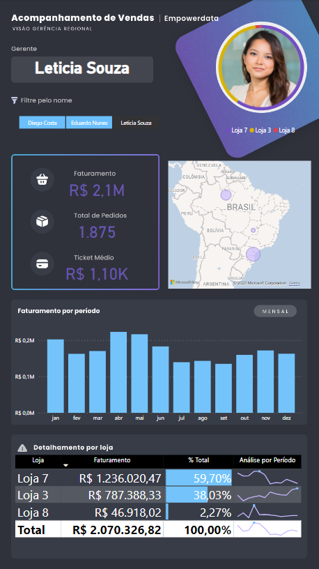

# Acelerador de Carreira com Power BI  

### Repository: [course](../../../)
### Platform: <a href="../../">empowerdata   </a>
### Software/Subject: <a href="../">power_bi   </a>
### Course: <a href="./">curso_073 (Acelerador de Carreira com Power BI)   </a>

#### <a href="https://github.com/PedroHeeger/main/blob/main/cert_ti/05-particip/data/power_bi/(23-07-16)%20Cert%20Power%20BI%20PH%20Empowerdata%20(Acelerador%20de%20Carreiras).pdf">Certificate</a>
#### <a href="https://app.powerbi.com/view?r=eyJrIjoiYTAxY2YwMmEtZGIwZi00Y2EzLThmN2UtYTVlMmRjODEzY2QyIiwidCI6ImI1NTJmZWJlLWFkMjgtNGI4Ny1iZjI5LTFlODhiYmZkY2I4ZiJ9">Power BI Report Aula 1</a>
#### <a href="https://app.powerbi.com/view?r=eyJrIjoiYjcxODVmNzEtMmU3MS00YTc4LTk0ZDUtZjc2YmI4NjdlYzEzIiwidCI6ImI1NTJmZWJlLWFkMjgtNGI4Ny1iZjI5LTFlODhiYmZkY2I4ZiJ9">Power BI Report Aula 2</a>
#### <a href="https://app.powerbi.com/view?r=eyJrIjoiZGQ5Nzg0NzItODE3MC00NGI1LWI1NWUtMzI1ZDRmNzkwNjhkIiwidCI6ImI1NTJmZWJlLWFkMjgtNGI4Ny1iZjI5LTFlODhiYmZkY2I4ZiJ9">Power BI Report Aula 3</a>
##### Para conferir outros reports e dashboards de outros projetos consulte meu repositório principal na sub-pasta de report clicando [aqui](https://github.com/PedroHeeger/main/tree/main/report).

---

### Theme:
- Data Analysis
- Business Intelligence (BI)

### Used Tools:
- BI Tool: 
  - Power BI   
  - Power Query 
- Integrated Development Environment (IDE):
  - VS Code   
- Versioning: 
  - Git   
- Repository:
  - GitHub   
- Others:
  - Google Drive 
  - Excel 
  - PowerPoint 
  - Brandmark 
  - Linguagem M e Expressões DAX

---

### Objective:
O objetivo desse projeto prático foi construir três reports com as seguintes temáticas respectivamente: **logístico**, **recursos humanos (RH)** e **vendas**. Durante a construção foram apresentadas as ferramentas e funções do **Power BI** e também do **Power Query**.

### Structure:
A estrutura (Imagem 01) do projeto é formada por:
- Três arquivos em **Power BI**, um para cada aula, com a construção dos reports.
- Uma apostila em **PDF** com o resumo das aulas.
- Uma pasta (**base_dados**) com quatro arquivos em **Excel** utilizados para alimentar os relatórios.
- Uma pasta (**background**) com quatro imagens para utilização como plano de fundo no **Power BI**. 
- A pasta **0-aux**, pasta auxiliar com imagens utilizadas na construção desse arquivo de README.
- Obs.: A logomarca do curso foi criada apenas para fins didáticos utilizando o site de inteligência artificial **Brandmark**.

<div align="Center"><figure>
    <br>
    <figcaption>Imagem 01.</figcaption>
</figure></div><br>

### Development:
Este projeto foi desenvolvido em quatro aulas.

#### Class 1
Na primeira aula, foi realizada a construção de um report sobre o tema **logística**. A partir do arquivo de base de dados em **Excel** (**BD_Logistica**), foi executado o prcesso de **ETL** (Extração, Transformação e Carregamento) no **Power Query**, gerando um única consulta. O arquivo de **Excel** possuía uma única planilha com as seguintes colunas: **Nº Pedido**, **Cliente-Motorista**, **Data Emissão Pedido**, **Data Entrega Prevista**, **Destino**, **Itens**, **R$ Faturados**, **Saída para Entrega**, **Data Entrega Real**, **Qtd Devolução**, **Mot. Devolução**, **Dias Para Entrega** e **Status**. Na etapa de transformação do ETL, as primeiras alterações foram promoção da primeira linha para cabeçalho e definição dos tipos de dados das colunas. A coluna **Cliente-Motorista** foi dividida em duas outras colunas (**Cliente** e **Motorista**) e o formato dos dados foi alterado de tudo maiúsculo para primeira letra maiúscula. Com isso, os dados foram carregados em uma tabela no **Power BI**.

Para construção do report, não foi necessária a criação de medidas. Foram adicionados três visuais de cartão apresentando as informações de **Faturamento Total**, **Total de Pedidos** e **Total de Motoristas**. Os gráficos desenvolvidos realizaram as seguintes análises: **Quantidade de Pedidos por Status** (Gráfico de Rosca), **Análise de Faturamento por Cliente** (Gráfico de Barra), **Análise de Entregas Atrasadas por Motorista** (Gráfico de Barra) e **Análise de Devolução por Motorista** (Gráfico de Colunas Empilhadas). Também foi inserido um visual de mapa de árvore para uma **Análise da Quantidade por Motivo de Devolução**, além de duas segmentações de dados para filtragem por **Ano** e **Destino**. O plano de fundo foi construído no **PowerPoint**, pela plataforma do curso, e exportado para imagem. A imagem foi adicionada ao report e a visualização final pode ser analisada na imagem 02 a seguir.

<div align="Center"><figure>
    <a href="https://app.powerbi.com/view?r=eyJrIjoiYTAxY2YwMmEtZGIwZi00Y2EzLThmN2UtYTVlMmRjODEzY2QyIiwidCI6ImI1NTJmZWJlLWFkMjgtNGI4Ny1iZjI5LTFlODhiYmZkY2I4ZiJ9"><br>
    <figcaption>Imagem 02: Report Logístico.</figcaption></a>
</figure></div><br>

#### Class 2
O segundo report construído foi referente ao tema **recursos humanos (RH)**. O processo inicial é o mesmo da aula anterior, sendo que a base de dados agora, eram dois arquivos de **Excel** (**BD-RH** e **bd_integrantes**, sendo este segundo em formato **CSV**). Um arquivo tornou-se a **tabela fato** e o outro **tabela dimensão**, criando um relacionamento entre elas. No arquivo da tabela fato existiam duas abas com a mesma estrura de dados, formadas pelas colunas: **Entrevista**, **Data**, **Resposta**, **Funcionario** e **Assunto**. Já no outro arquivo, a única planilha existente possuía a seguinte estrutura: **id_integrante**, **Unidade**, **Cargo / Nome**, **Data Contratação**, **Idade**, **Status do Integrante**, **Fonte de Recrutamento** e **Ano Contratacao**. Ambos foram extraídos para o **Power Query**, originando três Queries (**2019**, **2020** e **bd_integrantes**) que foram submetidos a um processo de **ETL**. 

Automaticamente o **Power Query** realizou duas alterações iniciais, promoveu a primeira linha para cabeçalho e definiu os tipos de dados das colunas. A consulta **bd_integrantes** foi renomeada para **funcionarios** e outras transformações foram realizadas. Foi dividido a coluna **Cargo / Nome** em duas colunas **Cargo** e **Nome**. As colunas **Status do Integrante** e **Ano Contratacao** foram excluídas. Foi criada uma coluna de exemplo (**FaixaEtaria**) em relação a coluna **Idade**, onde foram escritas nas três primeiras linhas o exemplo (36-40, 41-45 e 46-50), e foi identificado automaticamente as outras linhas da coluna. As Queries da tabela fato foram mescladas dando origem a uma nova Query nomeada de **entrevista** e desabilatadas para carregamento, já que a nova Query possuía as informações. Nesta nova consulta, foi criada uma coluna de exemplo (**Entrevista Abrev**) referente a coluna **Entrevista**, só para abreviar o texto dos dados.

Dando continuidade, os dados foram carregados em duas tabelas no **Power BI** com o mesmo nome das consultas. A coluna **id_integrante** da tabela dimensão **funcionarios** foi relacionada com a coluna **funcionarios** da tabela fato **entrevista**. Três medidas foram criadas para a construção do report. A medida **Qtd Perguntas** contabilizou a quantidade de linhas da tabela entrevista, ou seja, quantidade de perguntas. A medida **Qtd Cargos** contou a quantidade de cargos diferentes, enquanto a medida **Qtd Funcionarios** countou a quantidade de funcionários. A modelagem dos dados é exibida na imagem 03.

```
Qtd Perguntas = COUNTROWS(entrevista)
```

```
Qtd Cargos = DISTINCTCOUNT(funcionarios[Cargo])
```

```
Qtd Funcionarios = COUNTROWS(funcionarios)
```

<div align="Center"><figure>
    <br>
    <figcaption>Imagem 03.</figcaption>
</figure></div><br>

Essas três medidas foram utilizadas em três visuais de cartão. Na composição do report foram criados outros visuais que realizaram as seguintes análises: **Análise da Quantidade de Funcionários por Faixa Etária** (Gráfico de Funil), **Análise da Quantidade de Funcionários pela Fonte de Recrutamento** (Visual Treemap), **Análise da Quantidade de Funcionários por Ano de Contratação** (Gráfico de Coluna), **Análise das Repostas por Entrevista** (Gráfico de Coluna) e três gráficos de colunas empilhadas idênticos **Análise Percentual de Pergunta por Tipo de Reposta e Entrevista**, sendo que em cada um foi realizado um filtro para os seguintes assuntos: **Saúde**, **Carga Horária** e **Salário**. Além disso, foi inserido uma segmentação de dados para filtragem por **Unidade**. O plano de fundo foi construído no **PowerPoint**, pela plataforma do curso, exportado para imagem e adicionada ao projeto. A seguir, é ilustrado o resultado do projeto na imagem 04.

<div align="Center"><figure>
    <a href="https://app.powerbi.com/view?r=eyJrIjoiYjcxODVmNzEtMmU3MS00YTc4LTk0ZDUtZjc2YmI4NjdlYzEzIiwidCI6ImI1NTJmZWJlLWFkMjgtNGI4Ny1iZjI5LTFlODhiYmZkY2I4ZiJ9"><br>
    <figcaption>Imagem 04: Report Recursos Humanos (RH).</figcaption></a>
</figure></div><br>

#### Class 3
Na última aula, foi desenvolvido um report do tema **vendas** de outra base de dados em **Excel** com três planilhas (**pedidos**, **lojas**, **calendario**). A estrutura dos dados da aba **pedidos** era formada pelas colunas: **numero_pedido**, **data_pedido**, **cod_loja**, **Produto**, **qtde / preco_unitario** e **valor_venda**. Já da aba **lojas** era composta por: **codigo_loja**, **nome_loja**, **Cidade**, **nome_estado**, **silga_estado**, **latitude**, **longitude**, **Gerente** e **Imagem**. A última planilha possuía as seguintes colunas: **data**, **mes**, **mes_num** e **semana**. A planilha **pedidos** originou a tabela **fato**, enquanto as outras duas deram origem as tabelas **dimensão**.

Os dados foram extraídos via **Power Query**, criando três consultas de mesmo nome, que foram submetidas ao processo de **ETL**. Na etapa de transformação, todas as Queries determinaram seus cabeçalhos e definiram os tipos de dados das colunas. Na Query **produtos**, foi dividido a coluna **qtde / preco_unitario** em duas colunas (**qtd** e **preco_unitario**). Nas colunas **preco_unitario** e **valor_venda**, foi definido o tipo de dados para número decimal fixo. Já na consulta **loja**, foi realizado a exclusão das linhas vazias e corrigido o nome da coluna **silga_estado** para **sigla_estado**. Na consulta **calendario**, nennhuma transformação foi necessária.

Os dados foram carregados no **Power BI**, cada Query em uma tabela. As colunas **cod_loja** e **data_pedido** da tabela **fato** foram relacionadas com as colunas **codigo_loja** e **data** das tabelas **dimensão** (**lojas** e **data**), respectivamente. Na imagem 05 a seguir, é ilustrado como ficou os relacionamentos.

<div align="Center"><figure>
    <br>
    <figcaption>Imagem 05.</figcaption>
</figure></div><br>

Três medidas foram criadas para construção dos visuais de cartão. A medida **Faturamento** calculava o faturamento total das vendas. A medida **Total Pedidos** contabilizava o total de pedidos realizados. Já a medida **Ticket Medio** calculava o valor médio de venda dos pedidos.

```
Faturamento = sum(pedidos[valor_venda])
```

```
Total Pedidos = COUNTROWS(pedidos)
```

```
Ticket Medio = DIVIDE([Faturamento], [Total Pedidos],"Erro")
```

Além dos cartões, foram adicionados mais três visuais, sendo: um gráfico de coluna (**Análise do Faturamento por Período**), um visual de mapa (**Análise do Faturamento por Cidade**) e um visual de tabela (**Análise do Faturamento e Percentual do Faturamento por Loja**), neste foi realizado uma formatação condicional do tipo barra de dados e também a inserção de minigráficos (**Análise de Faturamento por Período**). Um visual de Image Grid também foi adicionado para exibição da foto do gerente, junto com um gráfico de rosca ao redor com a **Análise do Faturamento por Loja**. Uma segmentação de dados foi inserida para filtragem por **Gerente** e um visual de cartão foi adicionado para exibir o nome do gerente selecionado no filtro. O plano de fundo, desenvolvido em **PowerPoint** e exportado como imagem, foi fornecido pela plataforma do curso, sendo utilizado como background desse report que é apresentado na imagem 06 abaixo.

<div align="Center"><figure>
    <a href="https://app.powerbi.com/view?r=eyJrIjoiZGQ5Nzg0NzItODE3MC00NGI1LWI1NWUtMzI1ZDRmNzkwNjhkIiwidCI6ImI1NTJmZWJlLWFkMjgtNGI4Ny1iZjI5LTFlODhiYmZkY2I4ZiJ9"><br>
    <figcaption>Imagem 06: Report Vendas.</figcaption></a>
</figure></div><br>

Na imagem 07 a seguir, é exibido o mesmo report, porém com layout para dispositivos móveis.

<div align="Center"><figure>
    <a href="https://app.powerbi.com/view?r=eyJrIjoiZGQ5Nzg0NzItODE3MC00NGI1LWI1NWUtMzI1ZDRmNzkwNjhkIiwidCI6ImI1NTJmZWJlLWFkMjgtNGI4Ny1iZjI5LTFlODhiYmZkY2I4ZiJ9"><br>
    <figcaption>Imagem 07: Report Vendas (Mobile).</figcaption></a>
</figure></div><br>