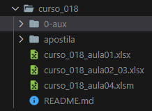
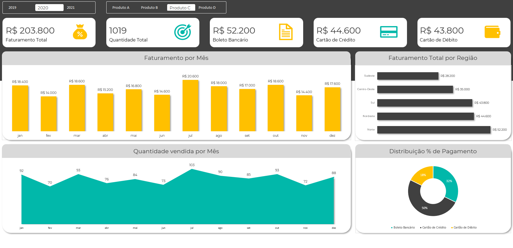

# Jornada do Excel 2023   

### Repository: [course](../../../)
### Platform: <a href="../../">hashtag   </a>
### Software/Subject: <a href="../">excel   </a>
### Course: <a href="./">curso_018 (Jornada do Excel 2023)   </a>

##### Para conferir outros reports e dashboards de outros projetos, consulte meu repositório principal na sub-pasta de report clicando [aqui](https://github.com/PedroHeeger/main/tree/main/report).

---

### Theme:
- Data Analysis

### Used Tools:
- BI Tool: 
  - Excel 
- Integrated Development Environment (IDE):
  - VS Code   
- Versioning: 
  - Git   
- Repository:
  - GitHub   
- Others:
  - Google Drive 
  - Brandmark 

---

### Objective:
- O objetivo desse projeto prático foi introduzir as principais ferramentas e fórmulas do software **Microsoft Excel**. Além de desenvolver um report do zero sobre a temática **vendas**.

### Structure:
- A estrutura (Imagem 01) do projeto é formada por quatro arquivos em **Excel** um para cada aula, além da pasta **0-aux**, pasta auxiliar com imagens utilizadas na construção desse arquivo de README. A logomarca do curso foi criado apenas para fins didáticos utilizando o site de inteligência artificial **Brandmark**.

<figure>
     
    <figcaption>Imagem 01.</figcaption>
</figure>
 

### Development:
Este projeto foi desenvolvido em quatro aulas.

#### Class 1
O curso foi iniciado utilizado a ferramenta **Texto para Colunas** para separar os dados da primeira aba de um arquivo em **Excel**, em que se encontravam no formato **CSV** (arquivo separado por vírgula). A estrutura dos dados era formada por: **Nome**, **Sobrenome**, **Registro**, **Nascimento**, **Setor**, **Salário** e **Filial**.

Na segunda aba esses dados foram formatados e foi inserido três novas colunas. A coluna **Nome Completo** foi criada utilizando o preenchimento relâmpago a partir das colunas **Nome** e **Sobrenome**. A coluna **Idade** foi gerada com a utilização da fórmula `DATEDIF` para calcular a idade a partir da coluna **Nascimento** em relação a data corrente durante o desenvolvimento do projeto. Para a terceira coluna foi necessário utilizar a ferramenta **Data Types** para que o **Excel** reconhecesse todos os estados (coluna **Filial**) e assim fosse possível inserir uma nova coluna (**Pop. Filial**) com as informações da população de cada estado de forma automática.

Nas abas 3 e 4 foi utilizado os mesmos dados, porém sem a coluna de **Pop Filial**, para a realização de operações com as fórmulas `COUNTIF`, `VLOOKUP`, `HLOOKUP` e `XLOOKUP`. Também foi criado validações de dados do tipo lista para selecionar as opções de forma mais precisa.

Na quinta aba foi utilizado apenas duas colunas da aba de dados formatados (**Nome Completo** e **Filial**) e uma nova coluna (**Região**) foi inserida com a fórmula `VLOOKUP` para encontrar em um conjuntos de células a região dos estados das filiais.

Na sexta aba com as colunas **Nome Completo** e **Salário** foi utilizado a fórmula `IF`, em uma nova coluna (**Categoria**), para determinar qual categoria cada salário estava. Enquanto na última aba foi executado o mesmo procedimento da aba 6, mas agora com o conceito de If composto.

#### Class 2 e 3
Nessas duas aulas, em um novo arquivo, a partir de uma aba com uma base de dados foi criado uma nova aba com esses dados formatados como tabela que foram utilizado para alimentar quatro tabelas dinâmicas em uma nova aba. Essas tabelas dinâmicas formaram a base para construção dos gráficos dinâmicos na última aba.

Os gráficos utilizados foram para **análise de faturamento mensal** (Gráfico de Coluna), **análise de faturamento por região** (Gráfico de Barra), **análise de quantidade vendida por mês** (Gráfico de Área) e **análise percentual por tipo de pagamento** (Gráfico de Rosca). Além dos gráficos, cinco visuais de cartões foram construídos com as formas do **Excel** mostrando: **Faturamento Total**, **Quantidade Total**, **Faturamento por Boleto Bancário**, **Faturamento por Cartão de Crédito** e **Faturamento por Cartão de Débito**. Duas segmentações de dados foram inseridas, uma para os anos (2019, 2020, 2021) e outra para os tipos de produtos (A, B, C e D).

O layout do report foi todo montado no **Excel** com uso das formas de retângulos, além dos ícones que também foram do próprio **Excel**. O desenvolvimento final do report é apresentado na imagem 02 logo abaixo.

<figure>
     
    <figcaption>Imagem 02: Report.</a></figcaption>
</figure>
 

#### Class 4
Na quarta e última aula deste curso foi realizado duas atividades diferentes. A primeira delas foi a utilização da ferramenta **Macro** para criar um painel com vários botões, feitos com as formas do **Excel**. Esses botões tinham a função de adicionar uma linha de cadastro em uma tabela, classificar a tabela, filtrar por feminino e masculino e remover o filtro.

A outra atividade foi a realização de uma automação web (**Web Scrapping**), no qual foi copiado uma tabela de criptomoedas de um site na web com as cotações das moedas. Em uma outra aba, uma tabela de carteira de clientes era calculada com a cotação de duas criptomoedas (**Bitcoin** e **Ethereum**, isto não é uma recomendação de compra, apenas para fins didáticos). Com a utilização de uma **Macro** a tabela de cripto era atualizada direto do site e, consequentemente, as novas cotações das duas moedas eram atualizadas, atualizando toda a tabela de carteira de clientes.