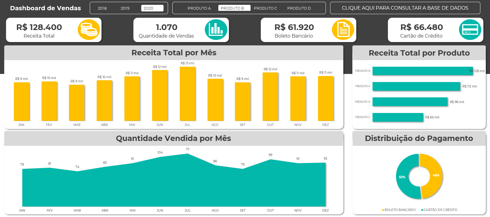

# Jornada do Excel 2022   

### Repository: [course](../../../)
### Platform: <a href="../../">hashtag   </a>
### Software/Subject: <a href="../">excel   </a>
### Course: <a href="./">curso_019 (Jornada do Excel 2022)   </a>

##### Para conferir outros reports e dashboards de outros projetos consulte meu repositório principal na sub-pasta de report clicando [aqui](https://github.com/PedroHeeger/main/tree/main/report).

---

### Theme:
- Data Analysis

### Used Tools:
- BI Tool: 
  - Excel 
- Integrated Development Environment (IDE):
  - VS Code   
- Versioning: 
  - Git   
- Repository:
  - GitHub   
- Others:
  - Google Drive 
  - Brandmark 

---

### Objective:
O objetivo desse projeto prático foi introduzir as principais ferramentas e fórmulas do software **Microsoft Excel**, além da construção de um report do zero sobre a temática **vendas**.

### Structure:
A estrutura (Imagem 01) do projeto é formada por:
- Quatro arquivos em **Excel** um para cada aula, sendo que as aulas 1 e 2 foram desenvolvidas no mesmo arquivo.
- A pasta **0-aux**, pasta auxiliar com imagens utilizadas na construção desse arquivo de README.
- Obs.: A logomarca do curso foi criada apenas para fins didáticos, utilizando o site de inteligência artificial **Brandmark**. 

<figure>
     
    <figcaption>Imagem 01.</figcaption>
</figure>
 

### Development:
Este projeto foi desenvolvido em quatro aulas.

#### Class 1 e 2
Nessas duas aulas, em um arquivo em branco, a partir de uma aba com uma base de dados em formato **CSV** (valores separados por vírgula), foi criada uma nova aba com esses dados formatados como tabela com o auxilio da ferramenta **Texto para Colunas**, distribuindo as informações separadas por vírgula em cada coluna. Com essa tabela de dados, foram gerados cinco tabelas dinâmicas em uma nova aba que serviram de base para a construção dos gráficos dinâmicos do report na última aba.

Os gráficos utilizados realizaram as seguintes análises: **análise de receita total por mês** (Gráfico de Coluna), **análise de receita total por produto** (Gráfico de Barra), **análise de quantidade vendida mensal** (Gráfico de Área) e **análise percentual por tipo de pagamento** (Gráfico de Rosca). Além dos gráficos, quatro visuais de cartões foram construídos com as formas do **Excel**, exibindo as informações (**Receita Total**, **Quantidade de Vendas**, **Receita por Boleto Bancário** e **Receita por Cartão de Crédito**). Duas segmentações de dados foram inseridas, uma para os **anos** (2019, 2020, 2021) e outra para os **tipos de produtos** (A, B, C e D).

O layout do report foi todo montado no **Excel** com uso das formas de retângulo e dos ícones do próprio **Excel**. Também foi inserido um botão para consultar a base de dados, direcionando para outra aba do arquivo. O desenvolvimento final do report é apresentado na imagem 02 logo abaixo.

<figure>
     
    <figcaption>Imagem 02: Report.</a></figcaption>
</figure>
 

#### Class 3
Nesta aula foram exercitados algumas fórmulas básicas (`VLOOKUP`, `COUNTIFS`, `SUMIFS` e `IF`), cada uma em uma aba diferente com uma pequena base de dados para desenvolvimento para cada uma. Em uma quinta aba, foi desenvolvido o conceito de If aninhado através da fórmula `IF`.

#### Class 4
Na última aula diversas ferramentas foram apresentadas, uma para cada aba, com uma base de dados específica para uso em cada uma delas. Foram executadas operações como: **Tabela Dinâmica**, **Texto para Colunas**, **Preenchimento Relâmpago** (em duas abas), **Validação de Dados** e **Formatação Condicional** (em duas abas).