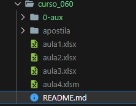

# Semana do Excel   

### Repository: [course](../../../)
### Platform: <a href="../../">hashtag   </a>
### Software/Subject: <a href="../">excel   </a>
### Course: <a href="./">curso_060 (Semana do Excel)   </a>

#### <a href="https://github.com/PedroHeeger/main/blob/main/cert_ti/05-particip/data/excel/(23-06-20)%20Cert%20Excel%20PH%20Hashtag%20Trein%20(Semana).pdf">Certificate</a>
##### Para conferir outros reports e dashboards de outros projetos consulte meu repositório principal na sub-pasta de report clicando [aqui](https://github.com/PedroHeeger/main/tree/main/report).

---

### Theme:
- Data Analysis

### Used Tools:
- BI Tool: 
  - Excel 
- Integrated Development Environment (IDE):
  - VS Code   
- Versioning: 
  - Git   
- Repository:
  - GitHub   
- Others:
  - Google Drive 
  - Looka 

---

### Objective:
O objetivo desse projeto prático foi introduzir as principais ferramentas e fórmulas do software **Microsoft Excel**, além da construção de um report do zero sobre a temática **vendas**.

### Structure:
A estrutura (Imagem 01) do projeto é formada por:
- Quatro arquivos em **Excel**, um para cada aula.
- Uma pasta com quatro apostilas em **PDF**, uma para cada aula.
- A pasta **0-aux**, pasta auxiliar com imagens utilizadas na construção desse arquivo de README.
- Obs.: A logomarca do curso foi criado apenas para fins didáticos utilizando o site de inteligência artificial **Looka**.

<figure>
     
    <figcaption>Imagem 01.</figcaption>
</figure>
 

### Development:
Este projeto foi desenvolvido em quatro aulas.

#### Class 1
Em um arquivo de **Excel** com uma aba de base de dados em formato **CSV** (valores separados por vírgulas), foi utilizado a ferramenta **Texto para Colunas** para separar os dados em colunas. A estrutura dos dados era formada por: **Produto**, **Marca**, **Última Compra**, **Estoque**, e **Origem**. Foram inseridas três novas colunas (**Código Etiqueta**, **Dias Última Compra** e **População**). A coluna **Dias Última Compra** foi inserida com a aplicação da fórmula `DATEDIF` para calcular quantos dias se passaram desde a última compra (coluna **Última Compra**). Para criar a coluna **População**, tornou-se necessário utilizar a ferramenta **Data Types** para que o **Excel** reconhecesse todos os estados (coluna **Origem**), e assim fosse possível inserir, nessa coluna, as informações da população de cada estado de forma automática. Por último, a coluna **Código Etiqueta** fez uso da ferramenta preenchimento relâmpago, na qual, a partir de algumas linhas de exemplo, a ferramenta entendia o padrão e replicava para as demais linhas desta coluna.

Em outras cinco abas, foram utilizadas algumas colunas da aba de base de dados com as seguintes fórmulas do **Excel**: `SUM`, `AVERAGE`, `VLOOKUP` e `IF`. Além da ferramenta **Validação de Dados** que foi aplicada para criação de uma validação do tipo lista. A fórmula condicional `IF` foi executada em duas abas: na primeira para criar uma condicional simples e na segunda aba para criar uma condicional composta. A fórmula `VLOOKUP` também foi utilizada em duas abas, a diferença é que em uma delas foi usada para encontrar determinadas informações na base de dados, e no outro caso, para alimentar uma nova coluna da base de dados, trazendo as informações de um conjunto de células auxiliares.

#### Class 2
Nesta aula, em um novo arquivo de **Excel**, a partir de uma aba com uma base de dados em formatado **CSV**, os dados foram organizados e formatados como tabela com a seguinte estrutura: **Consultor** (Vendedor), **Produto**, **Valor**, **Data** e **UF Cliente**. Foi realizado a inserção de três novas colunas (**Ano**, **Mês** e **Região**). As duas primeiras fizeram uso das informações da coluna **Data**, enquanto a coluna **Região** utilizou a fórmula `VLOOKUP` para encontrar, em uma outra aba, a região para cada estado da coluna **UF Cliente**.

A partir desses dados foram gerados cinco tabelas dinâmicas, em uma quarta aba, realizando algumas análises de dados. Essas tabelas foram usadas na construção dos gráficos e report na aula 3. Também foi criado uma nova aba com apenas duas colunas (**Nome** e **Imagem**) com as informações dos cinco vendedores existentes. Essas informações foram utéis para construção de gerenciadores de nomes, que são nomes criados no **Excel** com alguma função específica, neste caso, com uma fórmula específica. Foram cinco gerenciadores de nomes criados, um para cada vendedor, que utilizam as fórmulas `Index` e `Match` para localizar, a partir de uma tabela dinâmica que ordenava esses vendedores por maior receita, a imagem do vendedor na ordem estabelecida. Esses gerenciadores foram utilizados na montagem do report em uma forma do **Excel**, exibindo as imagens dos vendedores em ordem de maior receita. Quando ocorre uma filtragem dos dados, a ordem é alterada e, consequentemente, as imagens são modificadas.

#### Class 3
Na aula 3, foi realizada toda a construção do report, desde a montagem do layout com as formas de retângulo do **Excel**, até a inserção dos ícones, configurações dos gráficos e criação da segmentação de dados de **ano**. Foram gerados quatro gráficos que apresentaram as seguintes análises: **receita por mês** (Gráfico de Coluna), **receita por unidade federativa** (Gráfico de Barra), **receita por região** (Gráfico de Barra) e **receita por produto** (Gráfico de Rosca). Foram construídos cinco visuais, um para cada vendedor, com seus nomes, imagens e receitas obtidas. A imagem foi criada por uma forma do **Excel**, onde foi passada os gerenciadores de nomes criados na aula 2, para que as imagens fossem buscadas e alteradas conforme filtragem nos gráficos. A ilustração (Imagem 02), em seguida, retrata o report construído.

<figure>
     
    <figcaption>Imagem 02: Report Vendas.</figcaption>
</figure>
 

#### Class 4
Na última aula, foi apresentada a ferramenta **Macro** para criação de botões, com as formas do **Excel**, de inserir e excluir linhas em um conjunto de dados. Já em uma outra aba, um outro botão com uma **Macro** para criar uma nova aba de **Excel**, configurada como uma ficha cadastral com os seguintes campos: Nome, Idade, Sexo e UF. Também foi utilizado a ferramenta **Subtotal** para realizar cálculos rápidos (Soma, Média, Contagem, etc.) de um conjunto de dados.