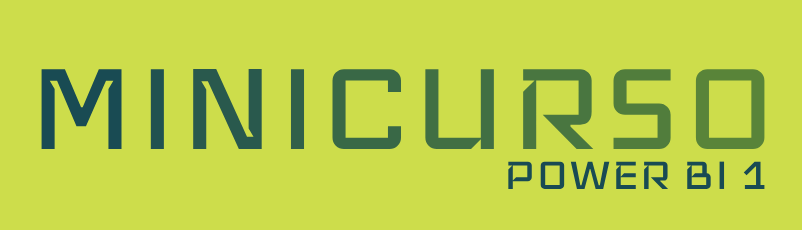

# Power BI   

### Repository: [course](../../)
### Platform: <a href="../">hashtag   </a>
### Software/Subject: <a href="./">power_bi   </a>
---

This folder refers to all the courses I took on the Hashtag platform regarding the Power BI software.

### Courses:
- <a href="./curso_040">curso_040 (Intensivão de Power BI 2022)   </a>
- <a href="./curso_041">curso_041 (Intensivão de Power BI 2023)   </a>
- <a href="./curso_045">curso_045 (Minicurso Power BI 1)   </a>