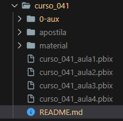
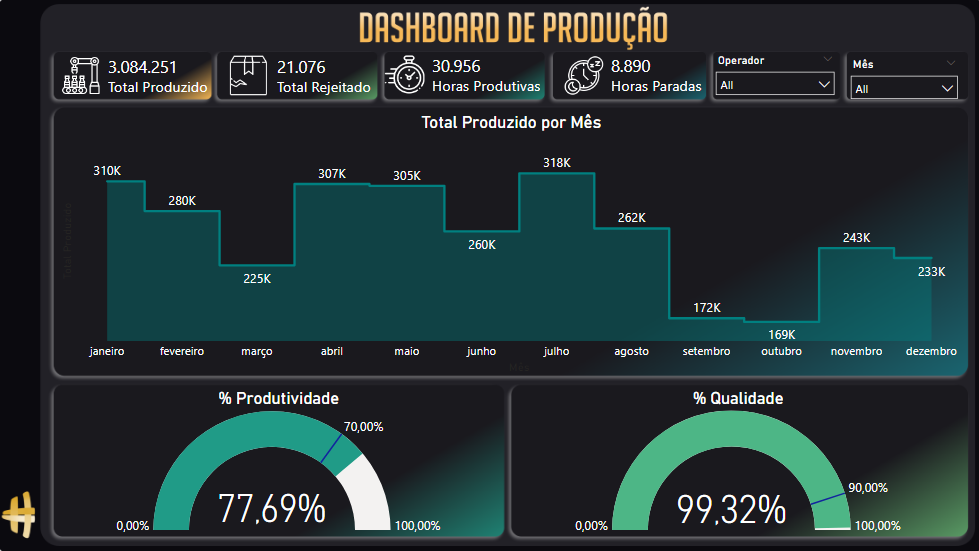
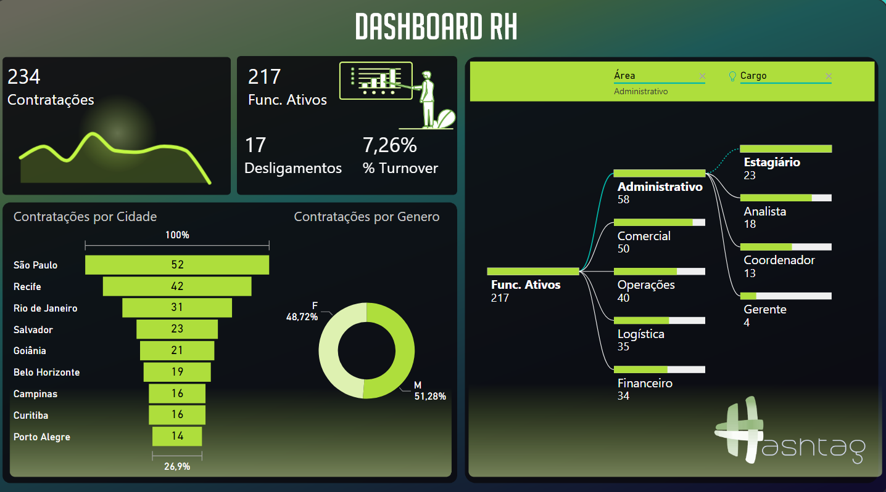

# Intensivão de Power BI 2023   

### Repository: [course](../../../)
### Platform: <a href="../../">hashtag   </a>
### Software/Subject: <a href="../">power_bi   </a>
### Course: <a href="./">curso_041 (Intensivão de Power BI 2023)   </a>

#### <a href="https://github.com/PedroHeeger/main/blob/main/cert_ti/05-particip/data/power_bi/(23-05-11)%20Cert%20Power%20BI%20PH%20Hashtag%20(Intensivão).pdf">Certificate</a>

#### <a href="https://app.powerbi.com/view?r=eyJrIjoiYzJjMWQwZDgtODE3Yi00Y2YwLTk3M2ItM2QxNzNjY2FhMzc5IiwidCI6ImI1NTJmZWJlLWFkMjgtNGI4Ny1iZjI5LTFlODhiYmZkY2I4ZiJ9">Power BI Report Aula 1</a>
#### <a href="https://app.powerbi.com/view?r=eyJrIjoiNGIxOWMyNTAtNzQxMS00MzA2LTg3ODgtM2NkNzVlMzEwM2NlIiwidCI6ImI1NTJmZWJlLWFkMjgtNGI4Ny1iZjI5LTFlODhiYmZkY2I4ZiJ9">Power BI Report Aula 2</a>
#### <a href="https://app.powerbi.com/view?r=eyJrIjoiNTQyOWRkYWUtMjc5YS00ZjgzLTk2ZDMtNWUwN2RhZWU4YzdlIiwidCI6ImI1NTJmZWJlLWFkMjgtNGI4Ny1iZjI5LTFlODhiYmZkY2I4ZiJ9">Power BI Report Aula 3</a>
#### <a href="https://app.powerbi.com/view?r=eyJrIjoiZDhkNDAwZTgtMjNlMS00MTJlLWJmMzQtMDI0MDUxZDgyMTA1IiwidCI6ImI1NTJmZWJlLWFkMjgtNGI4Ny1iZjI5LTFlODhiYmZkY2I4ZiJ9">Power BI Report Aula 4</a>
##### Para conferir outros reports e dashboards de outros projetos consulte meu repositório principal na sub-pasta de report clicando [aqui](https://github.com/PedroHeeger/main/tree/main/report).

---

### Theme:
- Data Analysis
- Business Intelligence (BI)

### Used Tools:
- BI Tool: 
  - Power BI   
  - Power Query 
- Integrated Development Environment (IDE):
  - VS Code   
- Versioning: 
  - Git   
- Repository:
  - GitHub   
- Others:
  - Google Drive 
  - Excel 
  - Brandmark 
  - PowerPoint 
  - Linguagem M e Expressões DAX

---

### Objective:
O objetivo desse projeto prático foi construir quatro reports, um para cada aula, com as seguintes temáticas respectivamente: **vendas**, **produção**, **recursos humanos** e **financeiro**. Durante a construção foram apresetadas as ferramentas e funções do **Power BI** e também do **Power Query**.

### Structure:
A estrutura (Imagem 01) do projeto é formada por:
- Quatro arquivos em **Power BI**, um para cada aula, com a construção dos reports.
- Uma pasta com quatro apostilas em **PDF**, uma para cada aula.
- Uma pasta (**material**) com todo material de apoio para construção dos reports, como: quatro bases de dados em **Excel** para cada projeto em **Power BI**, arquivos de imagens para construção do plano de fundo dos reports, incluindo plano de fundo dos **Tooltips**, dois arquivos em **PowerPoint** para montagem do plano de fundo, duas sub-pastas (**Ícones** e **Imagens**) com os arquivos de imagens e de ícones utilizados na construção dos relatórios.
- A pasta **0-aux**, pasta auxiliar com imagens utilizadas na construção desse arquivo de README.
- Obs.: A logomarca do curso foi criado apenas para fins didáticos utilizando o site de inteligência artificial **Brandmark**.

<div align="Center"><figure>
    <br>
    <figcaption>Imagem 01.</figcaption>
</figure></div><br>

### Development:
Este projeto foi desenvolvido em quatro aulas.

#### Class 1
Na primeira aula, foi criado um report com o tema **vendas**. O projeto iniciou no **Power Query** com um processo de **ETL** (Extração, Transformação e Carregamento), onde foi realizado a extração da base de dados em **Excel**, sendo criado uma Query de nome **Base Vendas**. A estrutura do arquivo era formada por apenas uma aba com as seguintes colunas: **Data da Venda**, **Produto**, **Categoria**, **PrecoUnitario**, **Custo Unitário**, **Marca**, **Qtd. Vendida**, **Nome Cliente** e **Localidade**. As primeiras transformações realizadas foram a promoção da primeira linha como cabeçalho, a definição do tipo de dados das colunas e exclusão de linhas e colunas em branco. Em seguida, foi dividido a coluna **Localidade** em duas e renomeadas para **País** e **Continente**. Foi inserida uma coluna calculada (**Faturamento**) que multiplicava a coluna **PrecoUnitario** por **Qtd. Vendida** para obtenção do faturamento de cada venda. Também foi criada uma coluna personalizada que alterava a forma da escrita dos nomes na coluna **Nome Cliente**, logo, a coluna **Nome Cliente** foi excluída e a coluna personalizada foi renomeada para o mesmo nome.

Os dados foram carregados em uma tabela do **Power BI** com o mesmo nome da consulta. Nesta aula 1, não houve criação de medidas. O report foi construído com cinco visuais, sendo dois cartões que apresetavam o **Faturamento Total** e o **Produto Mais Vendido**, além de três gráficos para as seguintes análises: **Análise Faturamento e Quantidade Vendida por Mês e Ano** (Gráfico Coluna e Linha), **Análise da Quantidade Vendida por Marca** (Gráfico de Barra) e **Análise de Faturamento por Continente** (Gráfico de Mapa). A seguir é exposto o primeiro report construído (imagem 02).

<div align="Center"><figure>
    <a href="https://app.powerbi.com/view?r=eyJrIjoiYzJjMWQwZDgtODE3Yi00Y2YwLTk3M2ItM2QxNzNjY2FhMzc5IiwidCI6ImI1NTJmZWJlLWFkMjgtNGI4Ny1iZjI5LTFlODhiYmZkY2I4ZiJ9"><br>
    <figcaption>Imagem 02: Vendas.</a></figcaption>
</figure></div><br>

#### Class 2
O segundo report foi sobre a temática **produção** e começou também com um processo de **ETL** no **Power Query** criando a consulta **BaseProdução**. Foram realizadas apenas quatro transformações: promoção da primeira linha como linha de cabeçalho, definição dos tipos de dados das colunas e a exclusão das linhas e colunas em branco. O arquivo em **Excel** de base de dados tinha a seguinte estrutura: **Numero Ordem**, **Operador**, **Produto**, **Ocorrência**, **Data Inicio**, **Hora Inicio**, **Data Fim**, **Hora Fim**, **Total Horas**, **Qtd Produzida** e **Qtd Rejeitada**.

A consulta foi carregada em uma tabela com o mesmo nome já no **Power BI**. Foram criadas sete medidas dentro desta tabela. As duas primeiras (**Total Produzido** e **Total Rejeitado**) deram origem a dois visuais de cartão. Elas simplesmente calculavam a soma das colunas **Qtd Produzida** e **Qtd Rejeitada** respectivamente.

```
Total Produzido = Sum('BaseProdução'[Qtd Produzida])
```

```
Total Rejeitado = Sum('BaseProdução'[Qtd Rejeitada])
```

Outras três medidas serviram para construção de mais dois visuais de cartão. A medida **Horas Trabalhadas** somava a coluna **Total Horas** para obter o total de horas de trabalho. Enquanto a medida **Horas Produtivas** somava a mesma coluna, porém quando na coluna **Ocorrência** fosse igual a vazia, significando que não houve ocorrência, logo, foram horas produtivas. O cálculo das **Horas Paradas** foi feito da subtrção de uma medida pela outra, obtendo a quantidade de horas que não houve produção. 

```
Horas Trabalhadas = Sum('BaseProdução'[Total Horas])
```

```
Horas Produtivas = CALCULATE(Sum('BaseProdução'[Total Horas]), 'BaseProdução'[Ocorrência]=BLANK())
```

```
Horas Paradas = [Horas Trabalhadas]-[Horas Produtivas]
```

Além dos cartões, esse report contou com dois gráficos de velocímetro que para sua construção precisou de uma medida para cada. A medida **% Produtividade** calculava o percentual de produtividade, ou seja, quantos porcento foi de horas produtivas em relação ao total de horas trabalhadas. Já a medida **% Qualidade** determinou o percentual de itens produtivos do total de itens produzidos (produtivos + improdutivos).

```
% Produtividade = [Horas Produtivas]/[Horas Trabalhadas]
```

```
% Qualidade = 'BaseProdução'[Total Produzido]/([Total Produzido]+[Total Rejeitado])
```

Um outro gráfico foi inserido nesse report, realizando uma **Análise do Total Produzido por Mês** (Gráfico de Área), além de duas segmentações de dados, uma para filtragem do **Operador** e outra para filtragem por **Mês**. O plano de fundo foi desenvolvido no **PowerPoint** e exportado como imagem para ser utilizado na construção desse relatório. A visualização do report é apresentada na imagem 03.


<div align="Center"><figure>
    <a href="https://app.powerbi.com/view?r=eyJrIjoiNGIxOWMyNTAtNzQxMS00MzA2LTg3ODgtM2NkNzVlMzEwM2NlIiwidCI6ImI1NTJmZWJlLWFkMjgtNGI4Ny1iZjI5LTFlODhiYmZkY2I4ZiJ9"><br>
    <figcaption>Imagem 03: Produção.</a></figcaption>
</figure></div><br>

#### Class 3
Na aula 3 foi desenvolvido um report de **recursos humanos (RH)**. O arquivo em **Excel** de base dados, cuja sua estrutura de dados era composta pelas seguintes colunas: **ID RH**, **Nome Completo**, **Estado Civil**, **Genero**, **Data de Nascimento**, **Endereço**, **Data de Contratacao**, **Data de Demissao**, **Salario**, **Cargo**, **Área**, **Horas Extras** e **Avaliação do Funcionário**, foi exportado para o **Power Query** gerado a consulta **BaseFuncionarios**. O tratamento dos dados foi iniciado com a promoção da primeira linha como cabeçalho, a definição dos tipos de dados das colunas e a exclusão de linhas em branco. Na sequência, foi inserida a coluna de **Ano de Contratação** que extraía o ano da coluna **Data de Contratacao**. A coluna **Cidade** foi criada a partir da extração da cidade da coluna **Endereço**.

O carregamento foi feito em uma tabela de mesmo nome no **Power BI**, onde foram criadas quatro medidas. A medida **Contratações** contabilizou o número de linhas da tabela que correspondiam ao número total de contratações. A medida **Func. Ativos** realizava o mesmo cálculo, mas apenas quando a coluna **Data de Demissao** estivesse vazia, ou seja, o funcionário não tinha sido demitido e ainda era um funcionário ativo. Já a medida **Desligamentos** foi o aposto desta que antecedeu, só que ao invés da condição ser quando **Data de Demissao** estivesse vazia, seria quando estivesse preenchida, para descobrir o número de desligamentos. Por último, a medida **% Turnover** calculava o percentual do total de desligamentos sobre o total de contratações.

```
Contratações = COUNTROWS(BaseFuncionarios)
```

```
Func. Ativos = CALCULATE(COUNTROWS(BaseFuncionarios), BaseFuncionarios[Data de Demissao]=BLANK())
```

```
Desligamentos = CALCULATE(
                COUNTROWS(BaseFuncionarios),
                BaseFuncionarios[Data de Demissao]<>BLANK()
)
```

```
% Turnover = [Desligamentos]/[Contratações]
```

A medida **Contratações** foi apresentada em um visual de cartão com um gráfico de **Sparkline**, enquanto as outras três, apesar de serem três visuais de cartões, fizeram parte de um mesmo elemento. O report contou também com uma **Análise de Contratações por Cidade** (Gráfico de Funil), **Análise de Contratações por Gênero** (Gráfico de Rosca), e um visual de **Decomposition Tree** (Árvore de Decomposição) com uma **Análise da Quantidade de Funcionários Ativos por Área e Cargo**. O gráfico de funil, ainda fez uso de um **Tooltip**, construído em outra página, apresentando um gráfico de barras para uma **Análise da Quantidade de Horas Extras por Cargo** e dois visuais de cartão (**Total de Funcionários Ativos** e **Valor da Folha Salarial**). O plano de fundo foi elaborado no **PowerPoint**, sendo exportado como imagem para ser utilizado na montagem desse report. A imagem 04 a seguir, ilustra o desenvolvimento do projeto.

<div align="Center"><figure>
    <a href="https://app.powerbi.com/view?r=eyJrIjoiNTQyOWRkYWUtMjc5YS00ZjgzLTk2ZDMtNWUwN2RhZWU4YzdlIiwidCI6ImI1NTJmZWJlLWFkMjgtNGI4Ny1iZjI5LTFlODhiYmZkY2I4ZiJ9"><br>
    <figcaption>Imagem 04: Report Recursos Humanos (RH).</a></figcaption>
</figure></div><br>

#### Class 4
O último report foi construído com a temática de **financeiro**. Através do **Power Query** foi realizada a extração do arquivo em **Excel** de base de dados para criação da Query **Movimentações**. A estrutura original do arquivo era composta pelas colunas: **Numero Movimentacao**, **Nome**, **Tipo Pessoa**, **Município**, **Data da Movimentacao**, **Valor da Movimentacao**, **Tipo**, **Banco**, **Imagem** e **Forma Pagamento**. Em relação ao tratamento de dados realizado só foi feito a promoção da primeira linha como cabeçalho e a definição dos tipos de dados das colunas.

O **Power BI** recebeu os dados em uma tabela de mesmo nome da Query. Nesta tabela, foram criadas dez medidas que serviram de base para construção do report. As medidas de **Receita** e **Despesa** calcularam a soma da coluna **Tipo**, quando fosse igual a **Recebimento** e **Pagamento**, respectivamente, sendo que **Despesa** foi criada com um sinal negativo na frente. A medida **Imposto** foi a multiplicação da medida **Receita** por 15%. Já o **Lucro** foi uma operação de subtração da medida de **Receita** por **Despesa** e **Imposto**. Essas quatro medidas geraram, cada uma, um visual de cartão.

```
Receita = CALCULATE(sum('Movimentações'[Valor da Movimentação]), 'Movimentações'[Tipo]="Recebimento")
```

```
Despesa = -CALCULATE(sum('Movimentações'[Valor da Movimentação]), 'Movimentações'[Tipo]="Pagamento")
```

```
Imposto = [Receita]*0.15
```

```
Lucro = [Receita]-[Despesa]-[Imposto]
```

A medida **Numero Movimentações** contou a quantidade de linhas da tabela. A **Movimentações PIX** fez a mesma coisa, porém quando na coluna *Forma Pagamento** fosse igual a PIX. Foi calculado o percentual de movimentações PIX sobre o número total de movimentações na medida **% PIX**. Essas medidas foram utilizadas na elaboração do visual **Enlighten Data Story**, é um pequeno texto que conta um pouco da história do report.

```
Numero Movimentações = COUNTROWS('Movimentações')
```

```
Movimentações PIX = CALCULATE(COUNTROWS('Movimentações'), 'Movimentações'[Forma Pagamento]="PIX")
```

```
% PIX = 'Movimentações'[Movimentações PIX]/[Numero Movimentações]
```

Para a construção do gráfico de rosca foram utilizadas as medidas de **Margem** e **Margem Auxiliar**. A primeira calcula a margem bruta, ou seja, quanto do lucro corresponde da receita. Já a **Margem Auxiliar** foi criada para dividir o gráfico de rosca. Na parte superior do report, foi utilizado um visual de **Scroller**, é uma espécie de barra animada, onde fica passando as informações. Nesta visual, era informado os municípios, a margem de lucro deles e o desvio em relação a meta. O **Desvio de Meta** foi estabelecido em 30% e foi calculado com a subtração da **Margem** por esse valor.

```
Margem = [Lucro]/[Receita]
```

```
Margem Auxiliar = 1 - [Margem]
```

```
Desvio da Meta = [Margem] - 0.3
```

Finalziando o relatório, mais dois visuais foram adicionadas, um gráfico de cascata para **Análise do Lucro Mensal** e um visual de **Imagem Grid** com as imagens dos bancos fornecidas na coluna **Imagem** através da URL. O plano de fundo foi construído no **PowerPoint**, exportado e aplicado neste report. Abaixo é exibido o desfecho final do projeto desta aula.

<div align="Center"><figure>
    <a href="https://app.powerbi.com/view?r=eyJrIjoiZDhkNDAwZTgtMjNlMS00MTJlLWJmMzQtMDI0MDUxZDgyMTA1IiwidCI6ImI1NTJmZWJlLWFkMjgtNGI4Ny1iZjI5LTFlODhiYmZkY2I4ZiJ9"><br>
    <figcaption>Imagem 05: Report Financeiro.</a></figcaption>
</figure></div><br>