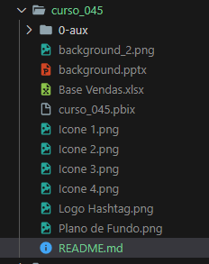
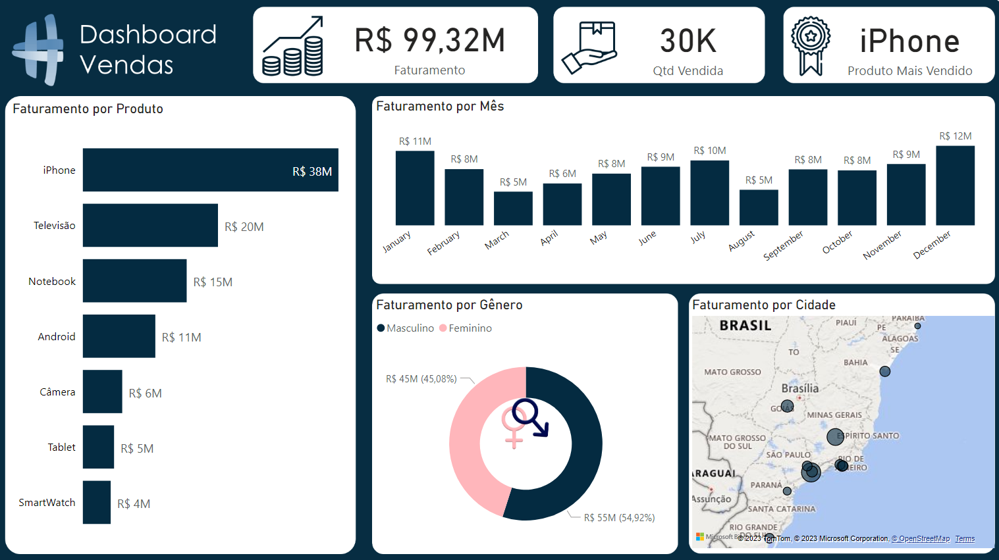

# Minicurso Power BI 1   

### Repository: [course](../../../)
### Platform: <a href="../../">hashtag   </a>
### Software/Subject: <a href="../">power_bi   </a>
### Course: <a href="./">curso_045 (Minicurso Power BI 1)   </a>

##### Para conferir outros reports e dashboards de outros projetos consulte meu repositório principal na sub-pasta de report clicando [aqui](https://github.com/PedroHeeger/main/tree/main/report).

---

### Theme:
- Data Analysis
- Business Intelligence (BI)

### Used Tools:
- BI Tool: 
  - Power BI   
  - Power Query 
- Integrated Development Environment (IDE):
  - VS Code   
- Versioning: 
  - Git   
- Repository:
  - GitHub   
- Others:
  - Google Drive 
  - Excel 
  - PowerPoint 
  - Brandmark 
  - Linguagem M e Expressões DAX

---

### Objective:
O objetivo desse projeto foi introdução do software **Power BI** e o desenvolvimento de um report do zero com o tema **vendas**. Durante a construção foram apresentadas as ferramentas e funções do **Power BI** e também do **Power Query**.

### Structure:
A estrutura (Imagem 01) do projeto é formada por:
- Um arquivo em **Power BI** para a construção do report.
- Um arquivo em **Excel** com a base de dados utilizada.
- Uma arquivo de **PowerPoint** para a elaboração do layout do report.
- Arquivos de imagens e de ícones utilizados na construção do relatório.
- A pasta **0-aux**, pasta auxiliar com imagens utilizadas na construção desse arquivo de README.
- Obs.: A logomarca do curso foi criado apenas para fins didáticos utilizando o site de inteligência artificial **Brandmark**.

<figure>
     
    <figcaption>Imagem 01.</figcaption>
</figure>
 

### Development:
O projeto foi iniciado no **Power Query** com a extração do arquivo de base de dados e criação de uma Query de nome **BaseVendas**. A estrutura da base de dados era composta pelas colunas: **SKU**, **Produto**, **Qtd Vendida**, **Data**, **Loja**, **Preço Unitário**, **Nome**, **Sobrenome** e **Gênero**. Foi realizado um processo de **ETL** (Extração, Transformação e Carregamento) antes de enviar os dados para o **Power BI**. O tratamento de dados inicio com a promoção da primeira linha como cabeçalho, definição dos tipos de dados das colunas e remoção de linhas e colunas vazias. Em seguida, as colunas **Nome** e **Sobrenome** foram mescladas se transformando em uma única coluna **Nome Completo**. Já a coluna **Loja** foi dividida em duas outras colunas **Cidade** e **Estado**. Na coluna **Gênero** foi alterado as informações de **Masculino** e **Feminino** para **M** e **F** respectivamente. Foi adicionada a coluna **Faturamento** que multiplicou a coluna **Preço Unitário** por **Qtd Vendida**.

Com o tratamento finalizado, a consulta foi carregada para uma tabela de mesmo nome no **Power BI**. Nesta tabela, não foi criada nenhuma medida. O plano de fundo do report foi construído no **PowerPoint**, sendo o material fornecido pela plataforma do curso. Três visuais de cartão foram inseridos para mostrar as métricas de **Faturamento**, **Qtd Vendida** e **Produto Mais Vendido**. Este último foi necessário realizar um filtro de Top 1 para encontrar o produto mais vendido. Os gráficos que fizeram parte desse relatório apresentaram as seguintes análises: **Análise Faturamento por Produto** (Gráfico de Barra), **Análise de Faturamento por Mês** (Gráfico de Coluna), **Análise de Faturamento por Gênero** (Gráfico de Rosca) e **Análise de Faturamento por Cidade** (Gráfico de Mapa). O report pode ser visualizado na imagem 02 abaixo.

<figure>
     
    <figcaption>Imagem 02: Report Vendas.</figcaption>
</figure>
 