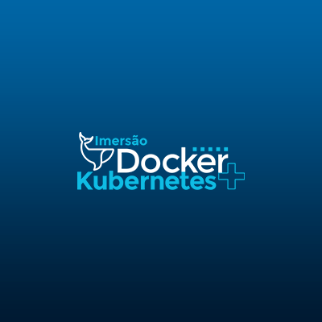

# DevOps   

### Repository: [course](../../../)
### Platform: <a href="../">fabricio_veronez   </a>
### Software/Subject: <a href="./">devops   </a>

---

This folder refers to all the courses I took on the Fabrício Veronez platform (DevOps teacher) regarding the DevOps content.

### Courses:
- <a href="./curso_081">curso_081 (Imersão DevOps & Cloud 1)   </a>
- <a href="./curso_116">curso_116 (Imersão Docker e Kubernetes 1)   </a>