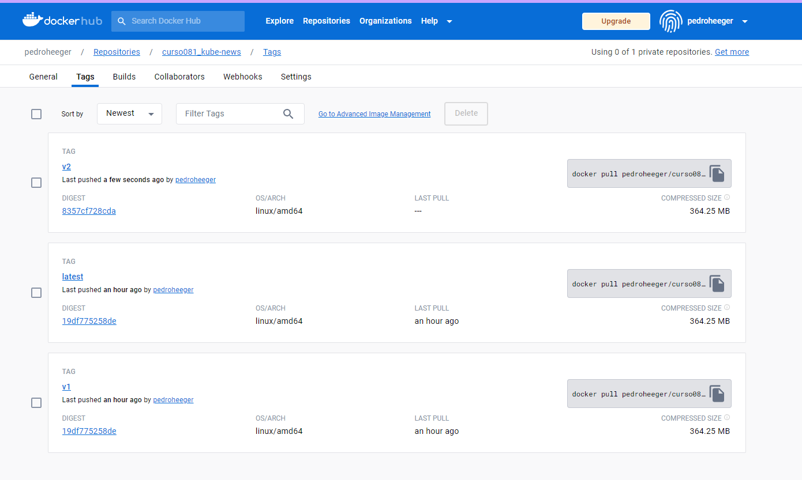
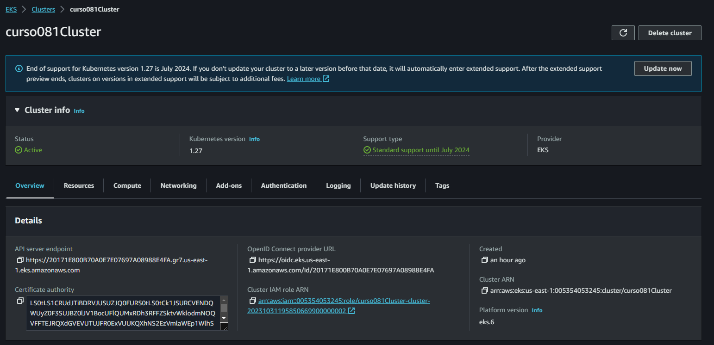
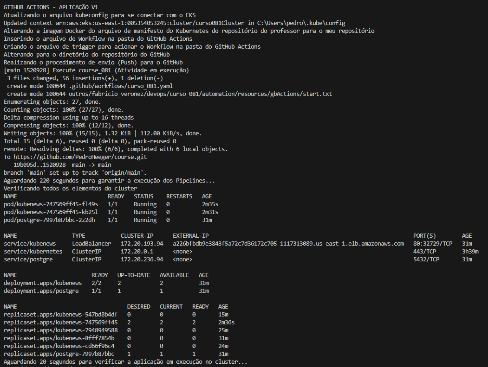
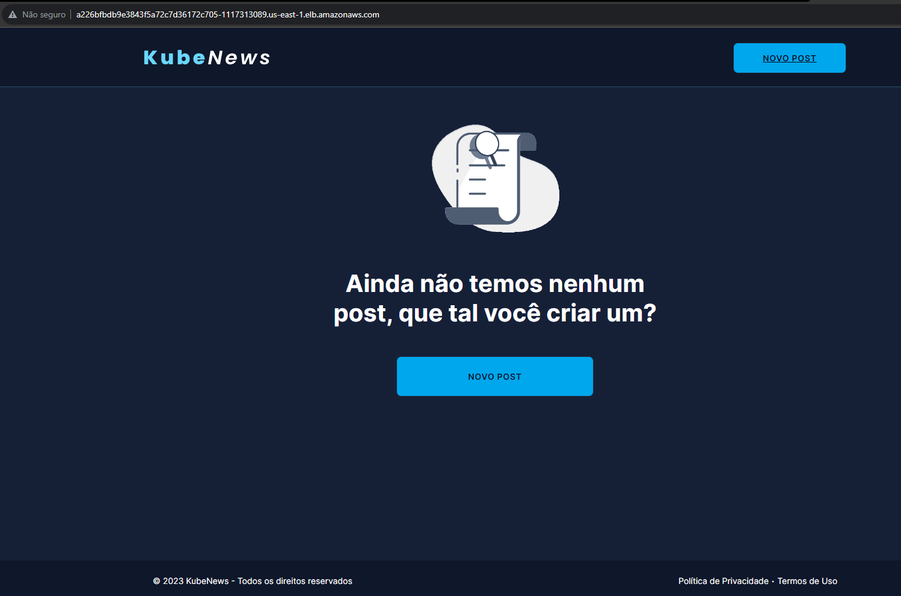
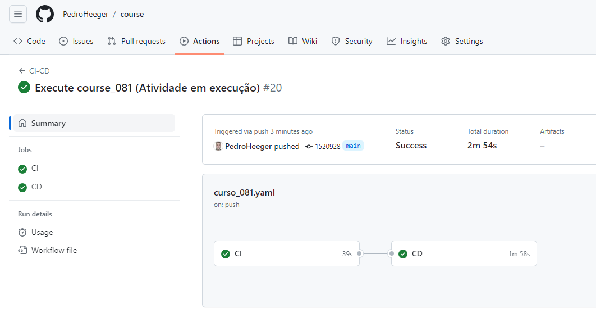

# Imersão DevOps & Cloud 1   

### Repository: [course](../../../../)
### Platform: <a href="../../">fabricio_veronez   </a>
### Software/Subject: <a href="../">devops   </a>
### Course: <a href="./">curso_081 (Imersão DevOps & Cloud 1)   </a>

---

### Theme:
- Cloud Computing
- DevOps

### Used Tools:
- Operating System (OS): 
  - Linux   
  - Windows 11   
- Linux Distribution: 
  - Ubuntu   
- Cloud:
  - Amazon Web Services (AWS)   
- Cloud Services:
  - Amazon Elastic Compute Cloud (EC2)   
  - Amazon Elastic Container Registry (ECR)   
  - Amazon Elastic Kubernetes Service (EKS)   
  - Amazon Virtual Private Cloud (VPC)   
  - AWS Budgets  
  - AWS Identity and Access Management (IAM)   
  - Google Drive 
- Containerization: 
  - Docker   
- Cluster Management Software:
  - Kubernetes   
  - K3D   
- Configuration Management (CM):
  - Terraform   
- Language:
  - HTML   
  - Markdown   
  - Node.js   
  - YAML   
- Integrated Development Environment (IDE) and Text Editor:
  - Nano   
  - Visual Studio Code (VS Code)   
- Versioning: 
  - Git   
- Repository:
  - Docker Hub   
  - Docker Registry   
  - GitHub   
  - Terraform Registry   
- Command Line Interpreter (CLI):
  - AWS Command Line Interface (CLI)   
  - Bash e Sh   
  - Eksctl   
  - Oh My Zshell (Oh My ZSh)   
  - Systemctl   
  - Windows PowerShell   
  - ZShell   
- Server and Databases:
  - Nginx   
- Workflow Management System (WFMS):
  - GitHub Actions   
- Tools:
  - Advanced Package Tool (Apt)   
  - Advanced Package Tool (Apt-Get)   
  - Curl   
  - Node Package Manager (npm)   
  - Unrar   
  - Wget   
  
---

<a name="item0"><h3>Course Strcuture:</h3></a>
1. <a href="#item01">Aula 1 - Revolução Digital com DevOps e Cloud</a><br>
2. <a href="#item02">Aula 2 - Kubernetes do zero ao deploy</a><br>
3. <a href="#item03">Aula 3 - AWS: Potencialize sua aplicação com o poder da Cloud Computing</a><br>
4. <a href="#item04">Aula 4 - Github Actions - Eficiência em entregas automatizadas</a><br>
5. <a href="#item05">Aula 5 - Terraform: Produtividade com automações Infra as Code</a><br>

---

### Objective:
O objetivo desse curso foi introduzir algumas das principais ferramentas da área de **DevOps** que são elas: **Docker**, **Kubernetes**, **AWS**, **GitHub Actions** e **Terraform**. Neste curso o projeto principal foi o desenvolvimento uma aplicação web containerizada de um microblog (portal de notícias) escrito em **Node.js** que tem como persistência dos dados em um container com imagem do banco **PostgreSQL**. Também foi desenvolvido um pipeline de entrega e integração contínua deste projeto utilizando os softwares **GitHub Actions**, **Kubernetes** como ambiente de execução da aplicação e o **Docker** como tecnologia para empacotar a imagem de container para rodar essa aplicação.

Este curso conteve quatro lives, três desafios e cinco aulas, sendo o objetivo delas listadas abaixo.
- Empacotar a aplicação em imagens **Docker** para executar em containers.
- Rodar a aplicação em ambiente **Kubernetes** local usando **K3D** e ambiente de nuvem com o **Amazon Elastic Kubernetes Service (EKS)** da **AWS**.
- Automatizar a entrega das aplicações usando pipeline CI/CD com **GitHub Actions**.
- Utilizar infraestrutura como código com o **Terraform** para criar a infraestrutura pra conseguir agilidade, reaproveitamento e confiabilidade.
- Monitorar a aplicação e a infraestrutura para saber o que está acontencendo e se antecipar aos problemas.

### Structure:
A estrutura do projeto (Imagem 01) é formada por:
- A pasta `automation` com os arquivos de scripts em **PowerShell** de automação (`criacao`, `exclusao` e `variaveis`) .
- A pasta [project](./project/) armazenando a pasta do repositório do **GitHub** do professor do curso que foi baixada para a maquina física.
- A pasta [resources](./resources/) que continha os arquivos de recursos necessários para execução dos projetos do curso. Esta pasta foi sub-dividido nos seguintes diretórios para uma melhor organização dos arquivos: 
    - A sub-pasta [bash](./automation/resources/bash/) contendo os arquivos em **Bash** utilizados no decorrero do curso;
    - A sub-pasta [docker](./automation/resources/docker/) contendo o arquivo `Dockerfile` utilizado na aula 2; 
    - A sub-pasta [gbActions](./automation/resources/gbActions/) contendo o arquivo de manifesto referente ao **GitHub Actions**; 
    - A sub-pasta [iac1](./automation/resources/iac1/) contendo o arquivo de manifesto YAML do **Terraform** da primeira etapa da aula cinco; 
    - A sub-pasta [iac2](./automation/resources/iac2/) contendo o arquivo de manifesto e o arquivo de variáveis do projeto **Terraform** da segunda etapa da aula cinco; 
    - A sub-pasta [others](./automation/resources/others/) contendo outros arquivos.
- A pasta [secrets](./secrets/) era onde estavam os dados pessoais sensíveis e por isso não foi versionada para o **GitHub**. Ela foi ramificada nos seguintes diretórios:
    - A sub-pasta `.aws` armazenando os arquivos de credenciais e configuração do usuário do IAM `PedroHeegerAdmin` na **AWS CLI**.
    - A sub-pasta `.docker` que armazenava o arquivo configuração com a autenticação no usuário da minha conta no **Docker Hub**
    - A sub-pasta `keyPair` contendo arquivos par de chaves `.pem` gerado para realização de acesso remoto em maquinas virtuais instanciadas na cloud da **AWS** durante o curso.
- A pasta `0-aux`, pasta auxiliar com imagens utilizadas na construção desse arquivo de README. 

<div align="Center"><figure>
    <br>
    <figcaption>Imagem 01.</figcaption>
</figure></div><br>

### Development:
O curso teve a maior parte do seu desenvolvimento executado na cloud da **AWS** no intuito de evitar instalações na maquina física **Windows**. Para isso, a maquina física já possuia instalada a interface de linha de comando da AWS (**AWS CLI**), configurada com acesso do usuário do IAM (`PedroHeegerAdmin`) que era o administrador da conta, sendo utilizada através do **PowerShell** para interagir com os serviços da **AWS**. O desenvolvimento do curso foi fragmentado em etapas, sendo que em uma etapa poderia ter mais de uma aula e uma aula poderia ter mais de uma etapa. Como forma de automatizar o máximo do curso, cada etapa correspondia a um script **PowerShell** elaborado no arquivo de criação de nome [criacao](./automation/criacao.ps1). Em cada script, era utilizado uma estrutura de condicional que aguardava uma entrada do usuário para determinar se a etapa referente ao script seria executada ou não. A seguir são listadas as etapas deste arquivo:

- ETAPA 1 (AULAS 1 E 2): Nesta etapa foi criada uma instância **Linux Ubuntu** no serviço **Amazon Elastic Compute Cloud (EC2)** para funcionar como ambiente de execução, pois o que fosse realizado localmente pelo curso, seria realizado nesta maquina na cloud **AWS**. Essa instância precisou ainda da criação de um arquivo par de chaves vinculado a ela, para possibilitar a realização de acesso remoto. A liberação da porta `8080` do grupo de segurança vinculado a esta instância, pois seria a porta onde as aplicações iriam rodar. A transferência de arquivos e pastas da maquina física para a instância, para configuração dos softwares que seriam instalados **AWS CLI** e **Docker** e os arquivos referente a execução dos projetos. Também foi vinculado a instância um outro arquivo de script que automatizava os processos, sendo esse em **Bash** de nome [udCurso081-1.sh](./resources/bash/udCurso081-1.sh) e que foi passado como o parâmetro `user data` da instância. Neste arquivo também foi feito uma divisão dos scripts em etapas, sendo neste caso em sete etapas que são listadas abaixo.
    - ETAPA 1: INSTALACOES BASICAS: Nesta primeira etapa foram realizadas instalações básicas de alguns softwares na instância para configuração do ambiente que seriam utilizados nas aulas 1 e 2.
    - ETAPA 2: BAIXANDO OS ARQUIVOS DOS PROJETOS DO GITHUB: Na etapa dois, a pasta do repositório do **GitHub** do professor do curso foi baixada e sub-pastas necessárias para os projetos da aula 1 e 2 foram criadas.
    - ETAPA 3: INSTALACAO DOCKER: Aqui foi realizado a instalação e configuração do software **Docker** utilizado na aula 1 e 2 do curso.
    - ETAPA 4: DOCKER PROJETO 1 (AULA 1): Nesta etapa foi realizado o projeto número 1 do curso que era referente a aula 1 sobre o software **Docker**.
    - ETAPA 5: INSTALACAO KUBERNETES: Na etapa cinco foi efetuado a instalação do software **Kubernetes** utilizado na aula 2 do curso.
    - ETAPA 6: KUBERNETES PROJETO 2 (AULA 2): Na etapa de número 6 foi executado o segundo projeto do curso, cujo software em questão foi o **Kubernetes**.
    - ETAPA 7: KUBERNETES PROJETO 3 (AULA 2): Na última etapa deste arquivo em **Bash** na instância do EC2 da **AWS** foi realizado o projeto de número 3 que era o projeto principal, utilizando os dois softwares **Docker** e **Kubernetes**. A partir daí, a instância pôde ser encerrada, concluindo as aulas 1 e 2 (projetos 1, 2 e 3) e retornado para o arquivo de script em **PowerShell** na maquina física para seguir para etapa 2 dele.
- ETAPA 2 (AULA 3): 
- ETAPA 3 (AULA 3): 


Adicionalmente ao arquivo de criação, em **PowerShell** também existia o arquivo de [exclusion.ps1](./automation/exclusion.ps1) que fazia o processo inverso, removendo o que tinha sido construído nas etapas e o arquivo [variable.ps1](./automation/variable.ps1) que continha todas as variáveis utilizadas por este dois arquivos. Para o arquivo de variáveis ser utilizado neste dois arquivos foi necessário declará-los em cada um deles. Além das estruturas de condição `if else` presentes nesses dois arquivos (`creation.ps1` e `exclusion.ps1`), a maior parte dos comandos executados durante as etapas foram precedidos por comandos de verificação, também através de estruturas de condicionais, determinando se o serviço ou recurso já havia sido criado ou excluído na cloud **AWS**. Todos os três arquivos foram armazenados no diretório [automation](./automation/).

Alguns etapas desenvolvidas nas aulas deste curso gerariam custos na **AWS**, principalmente a partir da aula 3 que o desenvolvimento foi em ambiente de cloud. Então foi necessário acessar o console da **AWS** com o usuário root e configurar um alerta através do serviço **AWS Budget** para receber uma notificação por email quando os custos dos serviços atingissem 50% do valor determinado. No meu caso, como já tinha dois alertas configurados anteriormente não foi necessário.

<a name="item01"><h4>Aula 1 - Revolução Digital com DevOps e Cloud</h4></a>[Back to summary](#item0)

Na primeira aula desse curso, foi realizada uma introdução sobre o software **Docker**, mostrando alguns comandos básicos e então realizando o primeiro projeto do curso. Este projeto consistiu na criação de uma aplicação containerizada, no qual ela era executada dentro de um container **Docker** que foi gerado por uma imagem elaborada. A aplicação era um conversor de temperaturas que convertia as temperaturas em Fahrenheit para Celsius e Celsius para Fahrenheit. Para criação da aplicação, foi necessário instalar o **Docker** na maquina física **Windows**, porém como o **Docker** é uma tecnologia que foi desenvolvida por recursos do kernel do **Linux**, foi optado por utilizar uma maquina virtual **Linux Ubuntu** para trabalhar com **Docker**. Então foi utilizado o serviço **Amazon Elastic Compute Cloud (EC2)** da **AWS** para instanciar essa maquina. Essa maquina ainda conteve outros softwares como o **Kubernetes** para realização dos outros projetos das demais aulas, bem como o projeto principal.

Antes de criar a instância, foi preciso construir o par de chaves que seria utilizado por ela para que fosse possível realizar o acesso remoto da maquina física **Windows** a instância da cloud via software **OpenSSH**. Então o primeiro script executado no arquivo **PowerShell** [creation.ps1](./automation/creation.ps1) foi para gerar o par de chaves, indicando que a codificação que ele gerasse fosse armazenada em um arquivo par de chaves de nome `keyPairCurso081.pem` que ficava no sub-diretório `secrets`. Após isso, foi instanciada a maquina virtual **Linux Ubuntu** do tipo `t3.medium` no serviço **Amazon Elastic Compute Cloud (EC2)** que funcionaria como ambiente de execução, indicando como user data um arquivo de script **Bash** ([udCurso081-1.sh](./automation/resources/bash/udCurso081-1.sh)), armazenado na sub-pasta `resources/bash`, que seria responsável por realizar as instalações dos softwares, download dos arquivos dos projetos e execução de alguns comandos dentro da instância. O tipo escolhido para essa maquina, que foi o `t3.medium`, gerou custos, pois não estava dentro do plano `free tier` da **AWS**, mas tornou-se necessário porcausa do poder computacional que ela possuía, já que seria necessário executar um cluster **Kubernetes** nos projetos seguintes.

Nessa instância, as sub-redes e o grupo de segurança escolhidos foram os padrões da VPC padrão da região. Então o terceiro script executado foi a criação de uma regra de entrada liberando comunicação na porta `8080` do protocolo `TCP` para todas as faixas de IP, para que posteriormente fosse possível acessar a aplicação em execução em um container **Docker**, por um navegador da web na maquina física. No arquivo de criação não tinha uma regra liberando a porta `22` para permitir comunicação `SSH` para acesso remoto a instância, pois essa porta já estava liberada. Caso ela não estivesse, era fundamental garantir que uma regra liberando essa porta fosse criada. Com relação as regras no grupo de segurança, deve-se ter o máximo de cuidado com abertura de portas para todas faixas de IP ou IPs desconhecidos, como esse curso teve apenas fim didático, isso não foi levado em consideração.

Enquanto arquivo de scripts de criação estava em execução, após a instaciação de uma maquina virtual no EC2, o arquivo de scripts em **Bash** originado na criação da instância estava em execução paralela só que dentro da instância, realizando as instalações necessárias e executando comandos. Assim dois processos de automação estavam ocorrendo, um pelo arquivo de `creation.ps1` e outro pelo arquivo `udCurso081-1.sh`. No arquivo `creation.ps1`, antes de executar o quarto script, foram aguardados alguns segundos para que uma parte do arquivo de script em **Bash** fosse executado, o que incluia o download de alguns softwares e também o clone do repositório do projeto do **GitHub** do professor para a instância, pois alguns arquivos que seriam transferidos da maquina física para a instância iriam para sub-pastas do diretório desse projeto e portanto era necessário que esse diretório já estivesse na instância. 

Após esses segundos, o script de transferência de arquivos para instância do arquivo de criação foi executado. Esse exibiu primeiro o endereço para acesso a aplicação que seria executada no container **Docker**, no qual era formado pelo o IP público da maquina virtual concatenado com `:` e o número da porta, que no caso foi a `8080`. Em seguida, foi exibido o comando ```ssh -i `"$keyPairPath\$keyPairName.pem`" ubuntu@$ipEc2``` para acesso remoto da maquina física a instância via software **OpenSSH**. Observe que neste comando foi necessário informar o arquivo par de chaves `.pem` para autenticar o acesso a maquina e endereço da instância, formado por nome do usuário que no caso era o `ubuntu` já que a instância era um **Linux Ubuntu**, concatenado com `@` e o número de IP público da instância. Este comando de acesso remoto poderia ser utilizada no **PowerShell** da maquina física para acessar a instância da cloud de forma manual se houvesse necessidade.

Ainda nesse quarto script, foram realizados cinco blocos de códigos parecidos que continha uma estrutura condicional, no qual a partir de uma condição verifica se o arquivo ou pasta que desejava-se transferir da maquina física para instância já existia na instância. Caso existisse nada era enviado, mas se não houvesse os arquivos eram transferidos para instância através também do software **OpenSSH** com o comando ```scp -i "$keyPairPath\$keyPairName.pem" -o StrictHostKeyChecking=no -r "$awsCliPath\$awsCliFolder" ubuntu@${ipEc2}:${vmPath}```. Observe que também foi informado o arquivo de par de chaves `.pem`, o endereço da maquina virtual da cloud acrescentando na concatenação a pasta de destino onde o arquivo deve ser armazenado, e a pasta ou arquivo de origem como parâmetro. Os arquivos transferidos foram: a pasta `.aws` contendo os arquivos `credentials` e `config` para configuração do usuário administrador `PedroHeegerAdmin` na **AWS CLI** da maquina virtual; a pasta `.docker` contendo o arquivo `config.json` que configurava o acesso do **Docker** da instância a minha conta do repositório do Docker (**Docker Hub**); o arquivo `deployment1.yaml` para execução do projeto 2 referente a aula 2; o arquivo `deployment2.yaml` para execução do projeto principal; e também o arquivo `Dockerfile` para construção da imagem do projeto principal. As pastas `.aws` e `.docker` estavam armazenadas no sub-diretório `secrets` por conter conteúdos sensíveis, já os demais estavam armazenados no sub-diretório `resources`.

##### Script Bash

Com relação ao arquivo de script **Bash** `udCurso-081-1.sh` executado na instância, ele também foi dividido em etapas e todos os comandos e etapas executados precederam por um comando de `echo` para exibir a ação que foi realizada e em que parte do projeto estava. A execução desses comandos puderam ser visualizadas através do arquivo `/var/log/cloud-init-output.log` dentro da maquina virtual através de um acesso remoto. Como no arquivo de criação, neste arquivo em **Bash**, uma aula poderia envolver mais de uma etapa.

As etapas 1, 3 e 5 eram referentes a configuração do ambiente dentro da instância criada no serviço **Amazon Elastic Compute Cloud (EC2)** na cloud **AWS**. A etapa 2 consistiu no download da pasta do repositório do **GitHub** do professor do curso, a criação de sub-pastas dentro das pastas de cada projeto e alteração de proprietário e grupo dessas pastas para o usuário `ubuntu`. A etapa 4 correspondeu ao projeto 1 realizado na aula 1 deste curso. A etapa 6 referente ao projeto 2 desenvolvido na aula 2 do curso. Já a sétima e última etapa correspondeu ao projeto 3 ou projeto principal, desenvolvido na aula 3, 4 e 5. 

A primeira etapa realizou algumas instalações de alguns softwares básicos do **Linux** (**Nano** **Wget** e **Curl**), instalação do **Git**, instalação e configuração da interface de linha de comando (CLI) **ZShell** com os três seguintes plugins: **powerlevel10k**, **zsh-autosuggestions** e **zsh-syntax-highlighting**, e definição do **ZShell** como shell padrão do usuário `ubuntu` desta maquina, no caso a instância EC2. O software de CLI da **AWS** também foi baixado e instalado, onde não foi necessário fazer o login com um usuário da minha conta, pois a pasta `.aws` com os arquivos de configuração do usuário do IAM `PedroHeegerWorker` da minha conta da **AWS** foram enviados da maquina física **Windows** para instância com o **OpenSSH** no arquivo de criação. Logo, o usuário utilizado pelo **AWS CLI** dessa instância foi o usuário `PedroHeegerWorker`.

Na segunda etapa desse arquivo foi feito o clone do repositório do projeto do **GitHub** fornecido pelo professor cujo nome da pasta do projeto foi [imersao-devops-cloud-02](./imersao-devops-cloud-02/), ela também foi baixada na maquina física, pois seria utilizada na aula 3. Na instância, essa pasta foi armazenada no diretório do usuário `home/ubuntu` e teve seu proprietário e grupo alterado de usuário `root` para o usuário `ubuntu`, usuário utilizado durante o acesso remoto. A pasta do projeto `imersao-devops-cloud-02` era dividia em `conversao-temperatura`, referente o projeto 1 realizado nesta aula, e `kube-news` referente ao projeto 3 (projeto principal) realizado nas outras aulas. A pasta `web-page` foi criada dentro da pasta do projeto `imersao-devops-cloud-02` para o projeto 2, onde ela receberia da maquina física o arquivo de manifesto 1 (`deployment1.yaml`) via **OpenSSH** enviado pelo arquivo de criação. Dentro do sub-diretório `kube-news` (projeto 3), só existia a pasta `src` que eram os arquivos de código e o arquivo `Dockerfile` para construção da imagem **Docker** deste projeto. Então, um outro diretório foi criado de nome `k8s` que seria necessário para receber do arquivo de script de criação, o arquivo de manifesto 2 (`deployment2.yaml`) enviado através do **OpenSSH**.

A etapa 3 foi a instalação do **Docker** na instância e a adição do usuário `ubuntu` ao grupo de usuários do **Docker** para executar os comandos sem a utilização do `sudo`. Antes de partir para etapa quatro, foi aguardado alguns segundos para esperar que todos os cinco arquivos da maquina física fossem transferidos para a instância na cloud via **OpenSSH** pelo arquivo de script `creation.ps1`.

###### Projeto 1

A quarta etapa foi a última referente a aula 1 deste curso. Até agora, tudo realizado nos dois arquivos de automação `creation.ps1` na maquina física e `udCurso081-1.sh` na instância foi configuração de ambiente, com instalações de softwares, e organização do para iniciar o primeiro projeto. O projeto 1, como dito no início dessa aula, foi uma aplicação containerizada de um conversor de temperatura. A pasta referente a esse projeto veio dentro da pasta baixada do repositório do professor (`imersao-devops-cloud-02`). Na maquina física ela era a pasta [conversao-temperatura](./project/imersao-devops-cloud-02/conversao-temperatura/) armazenada dentro do diretório `project`, e na instância ela ficava armazenada em `/home/ubuntu/imersao-devops-cloud-02/conversao-temperatura/`. Dentro dela, existia a única sub-pasta de nome `src` com todos os arquivos de código e o arquivo `Dockerfile` para construção da imagem **Docker**. Então o script em **Bash** alterou o diretório corrente para o `src` e executou o comando `echo "node_modules/" > .dockerignore` para criar o arquivo `.dockerignore` indicando que a pasta `node_modules/` deveria ser ignorada, durante a construção da imagem. Assim, quando o comando `COPY . .` do `Dockerfile` fosse executado, essa pasta não seria copiada para dentro do container. Em seguida, foi realizado o build da imagem **Docker** com o comando `docker build -t conversao-temperatura .`, onde o `.` representa o contexto de onde estava o arquivo `Dockerfile`, que no caso estava na pasta corrente que no momento era a `src`.

Com a primeira imagem construída cujo nome era `conversao-temperatura`, ela foi tagueada para outros dois nomes `pedroheeger/curso081_conversao-temperatura:v1` e `pedroheeger/curso081_conversao-temperatura:latest`, já no padrão para o envio para o repositório do **Docker Hub** na minha conta. Observe que o `v1` e `latest` representa a tag ou versão da imagem, o `pedroheeger` o nome do meu usuário no **Docker Hub** e `curso081_conversao-temperatura` o nome da imagem que também foi utilizado no **Docker Hub** para o nome do repositório, onde todas as versões dessa mesma imagem serão armazenadas. Em seguida, foi feito o push das duas imagens para o **Docker Hub**, que é o repositório oficial de imagens do **Docker**, assim elas poderiam ser baixadas de qualquer lugar e por qualquer pessoa com acesso a internet e **Docker** instalado. Como a pasta `.docker` foi enviada da maquina físca para a instância pelo **OpenSSH** no arquivo de criação, não foi necessário configurar o usuário para acesso ao **Docker Hub**, pois este já estava configurado para minha conta do **Docker Hub**, cujo arquivo `config.json` com a autenticação estava dentro do diretório `.docker`.

Por fim, foi executado o comando `docker container run --name aplicacao1 -d -p 8080:8080 conversao-temperatura` para criação do container da aplicação a partir dessa imagem construída pelo arquivo `Dockerfile`, realizando um bind de portas, ou seja, combinando a porta `8080` da instância com a porta `8080` do container. Assim a aplicação pode ser acessada e interagida através do número de IP público da maquina virtual concatenado com o `:` e o número da porta `8080`, comando esse exibido pelo quarto script do arquivo de criação.

A imagem 02 a seguir mostra a aplicação sendo acessada pelo navegador de internet da maquina física no IP público da instância e na porta estabelecida. Agora ficou explicado o porque foi nessário criar uma regra para a liberação da porta `8080` da maquina virtual da cloud. Após a imagem, o script do arquivo `Dockerfile` é exibido, observe que foi utilizado uma imagem base do **Node.js**, os arquivos `package` em formato **JSON** foram copiados e com a execução do comando `npm install` as dependências nesses arquivos foram criadas no sub-diretório `node_modules` que também foi criado. Por fim, os demais arquivos da aplicação foram copiados, ignorando a pasta `node_modules`, pois estava listada no `.dockerignore`. A aplicação ficava exposta na porta `8080` do container e o comando `node server.js` era acionado para execução da aplicação. Enquanto este container estivesse ativo, a aplicação estaria sendo executada no endereço estabelecido. 

<div align="Center"><figure>
    <br>
    <figcaption>Imagem 02.</figcaption>
</figure></div><br>

```dockerfile
FROM node:18.16.0
WORKDIR /app
COPY package*.json ./
RUN npm install
COPY . .
EXPOSE 8080
CMD ["node", "server.js"]
```

A imagem 03 mostra a imagem **Docker** no repositório do **Docker Hub**. Já a imagem 04 exibe as imagens e containers **Docker** criados na instância da cloud da **AWS**.

<div align="Center"><figure>
    <br>
    <figcaption>Imagem 03.</figcaption>
</figure></div><br>

<div align="Center"><figure>
    <br>
    <figcaption>Imagem 04.</figcaption>
</figure></div><br>

<a name="item02"><h4>Aula 2 - Kubernetes do zero ao deploy</h4></a>[Back to summary](#item0)

A etapa 5 foi uma configuração de ambiente na instância necessária para execução dos projetos 2, referente a aula 2, e do projeto 3 (projeto principal), referente as aulas 3 à 5 do curso. Esta etapa iniciou com a instalação na instância dos softwares **k3d** para execução de clusters **Kubernetes** e o **kubectl** que é um CLI para **Kubernetes**. Ao terminar de baixar o **kubectl** foi necessário alterar o proprietário e grupo da pasta `.kube`. Alguns segundos foram aguardados antes de iniciar a etapa 6 do arquivo `udCurso081-1.sh`. Neste momento o projeto 1 (`conversao-temperatura`) ainda estava no ar e o arquivo de criação `creation.ps1` estava com a etapa 1 finalizada, aguardando para iniciar a etapa 2.

###### Projeto 2

A etapa seis do arquivo de script em **Bash** foi o desenvolvimento do segundo projeto. O objetivo foi criar um cluster **Kubernetes** com o software **k3**, realizar o deployment da aplicação containerizada **Docker** de uma página web de teste no cluster, e executar uma mudança de versão com a aplicação no ar, sem que houvesse interrupções. Esta etapa começou com a remoção do container da aplicação do projeto 1 e exclusão de todos os recursos do **Docker** que não estavam sendo utilizados para liberação de espaço na instância. Em seguida a pasta do projeto 2 (`web-page`) que tinha sido criada anteriormente foi acessada. Neste diretório, o segundo projeto foi criado, mas agora para introduzir o software **Kubernetes**. Para esse projeto foi construído um cluster com o comando `k3d cluster create meucluster1 -p "8080:30000@loadbalancer"`, sendo o primeiro cluster criado. Esse clsuter foi desenvolvido com apenas um nó (node), que era o server node, e foi realizado um bind de portas direcionando a porta `30000` do nó para a instância na porta `8080`. Também foi indicado que um load balancer seria configurado, mas como esse era um cenário local, apesar de ter sido feito por mim na cloud **AWS**, não seria trabalhado com load balancer nesta aula 2. Ao criar o cluster, o arquivo `config` foi gerado na pasta `.kube`, portanto foi necessário alterar o proprietário e grupo dele para o usuário `ubuntu`.

Com o comando `kubectl apply -f deployment1.yaml` foi realizado o deploy do primeiro arquivo de manifesto **YAML** ([deployment1.yaml](./automation/resources/kubernetes/deployment1.yaml)) que foi enviado da maquina física para instância na pasta `web-page` através do arquivo de criação com o software **OpenSSH**. Esse arquivo criou os elementos `deployment` e `service` do **Kubernetes**. O `deployment` indicou que teria dois elementos `pod`, onde em cada um estaria sendo executado o container da aplicação web cuja imagem utilizada foi a `fabricioveronez/web-color:blue` que era de um repositório **Docker Hub** do professor do curso. Também foi definida como porta `80` onde essa aplicação iria rodar no container dos pods. Já o recurso `service` iria encaminhar o tráfego recebido na porta `30000` no nó do cluster para os pods que tivessem a label `app: meudeployment`, que era os pods do `deployment`, para a porta `80` onde os containers com aplicação nos pods estavam escutando.

Alguns segundos foram aguardados antes de realizar uma alteração na aplicação para verificar esse aplicação em execução. A alteração foi realizada no arquivo de manifesto **YAML** `deployment1.yaml`, trocando a tag da imagem utilizada de `fabricioveronez/web-page:blue` para `fabricioveronez/web-page:green`. A aplicação era a mesma, o que mudaria era apenas a cor de fundo da aplicação de azul para verde. O objetivo aqui foi testar a mudança de versão de uma aplicação com ela em execução, sem a necessidade de interrompé-la. Ambas as imagens **Docker** utilizadas eram do repositório do **Docker Hub** do professor do curso. Um ponto importante foi que as imagens utilizadas poderam ser encontradas no repositório do professor com outro nome, no meu caso, tive que alterá-las para `fabricioveronez/web-color:blue` e `fabricioveronez/web-color:green`. Pode ser que futuramente essas imagens não estejam mais disponíveis no repositório do professor, então o ideal é certificá-las que elas existem no repositório, caso não, deve-se procurá-las em outro repositório do professor. Lembrando de ter cuidado com a utilização de imagens de repositórios desconhecidos.

Então, feita a alteração pelo script em **Bash** utilizando o comando `sed`, um novo deploy do arquivo **YAML** foi efetuado para a trocar da imagem do container da aplicação em execução e mais alguns segundos foram aguardados com essa aplicação rodando. Por fim, a aplicação foi derrubada com o comando `kubectl delete -f deployment1.yaml`, o cluster removido com o comando `k3d cluster delete meucluster1` e containers e imagens **Docker** deletados para liberação de espaço na instância do EC2, finalizando assim o segundo projeto. Novamente alguns segundos foram aguardados para concluir a remoção do cluster e iniciar a etapa sete. As imagens 05 e 06 exibem a aplicação no ar através do navegador da web da maquina física **Windows**, sendo uma com a imagem cujo fundo da aplicação é azul e a outra com o fundo verde. Já a imagem 07 exibe todos os elementos do cluster **Kubernetes** criados, evidenciando que este cluster tem apenas um server e nenhum worker node.

<div align="Center"><figure>
    <br>
    <figcaption>Imagem 05.</figcaption>
</figure></div><br>

<div align="Center"><figure>
    <br>
    <figcaption>Imagem 06.</figcaption>
</figure></div><br>

<div align="Center"><figure>
    <br>
    <figcaption>Imagem 07.</figcaption>
</figure></div><br>

###### Projeto 3

Na etapa 7 foi acessada a pasta `src` do projeto `kube-news`, que era o projeto principal (projeto 3). O objetivo deste projeto foi a criação de uma aplicação web containerizada de um blog, onde era possível inserir dados através da opção `Novo Post`. Quando Post era criado, esses dados eram armazenados no container de banco de dados e retornados de volta para o site da aplicação como conteúdo do blog. No diretório `kube-news`, também foi criado um arquivo `.dockerignore`, ignorando a pasta `node_modules`, pois agora ao invés de utilizar uma imagem **Docker** já existente em um repositório, seria realizado o build da imagem. Como visto anteriormente a pasta `node_modules` é criada ao executar o comando `npm install`, que no caso foi executado no arquivo `Dockerfile`, que foi enviado da maquina física para a instância no sub-diretório `src`, também via **OpenSSH** pelo arquivo de criação. Com o arquivo `Dockerfile` era realizado o build da imagem cujo nome dela foi `pedroheeger/curso081_kube-news:v1`. Uma versão `latest` também foi tagueada a partir da versão `v1`. Ambas foram enviadas para um repositório no **Docker Hub** da minha conta, da mesma forma realizada na aula 1. Com a imagem criada e armazenada em um repositório no **Docker Hub**, o segundo cluster foi construído com o comando `k3d cluster create meucluster2 -p "8080:30000@loadbalancer"`, exatamente igual ao primeiro só modificando o nome dele.

Então, foi alterado do diretório corrente de `src` para o diretório `k8s` que foi construído na etapa 2 deste arquivo de script **Bash** na aula 1. Assim como todos os outros arquivos enviados da maquina física **Windows** pelo arquivo `creation.ps1` com o software **OpenSSH**, o arquivo de manifesto 2 ([deployment2.yaml](./automation/resources/kubernetes/deployment2.yaml)) foi transferido para a pasta `k8s` que era o diretório corrente no momento. Assim, o deploy deste manifesto foi executado com o comando `kubectl apply -f deployment2.yaml`. Este arquivo possuía dois recursos de `deployment` e dois de `service`, sendo um par (`deployment` e `service`) referente a uma aplicação desenvolvida. A primeira aplicação foi um bando de dados, no qual no elemento `deployment` era indicado que a imagem de container do único pod que seria executado era de do banco **PostgreSQL**, a porta do container seria a `5432` que é a porta padrão do **PostgreSQL** e também foram definidas as variáveis de ambiente (`POSTGRES_PASSWORD`, `POSTGRES_USER` e `POSTGRES_DB`), além do nome do container e do `deployment` que foi `postgre`. O `service` vinculado a esse recurso de `deployment` através de uma label só indicava que a porta utilizada era a `5432`. 

A segunda aplicação foi de fato a aplicação web, no `deployment` dela era indicada que haveriam dois pods. O nome dos containers da aplicação seriam `kubenews`, eles utilizariam a imagem `pedroheeger/curso081_kube-news:v1` que já tinha sido enviada para o repositório do **Docker Hub** e a porta que os containers trabalhariam era a `8080`. Observe novamente o porque foi liberado a porta `8080` no grupo de segurança na primeira aula, pois esta aplicação também seria executada nesta porta. Também foram definidas as variáveis de ambiente (`DB_DATABASE`, `DB_USERNAME`, `DB_PASSWORD` e `DB_HOST`) para que o `deployment` da aplicação web se comunicasse com o banco de dados. Note que a variável `DB_HOST` foi o nome do `deployment` do banco de dados e não um endereço de IP. O nome do `deployment` e dos containers da aplicação rodando nos pods foi `kubenews`. Com relação ao recurso `service` vinculado a esse `deployment` através também de uma label, foi definido a `NodePort` como `30000`, ou seja, esse service escutava o tráfego vindo do único nó no cluster que era o server node. Um bind de portas foi realizado dentro do service, encaminahdo o tráfego da porta `30000` para a `80` e então o tráfego eram encaminhado para a porta `8080` da aplicação no `deployment`. Assim, a aplicação já estava rodando na porta `8080` e pode ser acessada pelo navegador da web da maquina física através do IP público da instância concatenado com a porta `8080`, conforme imagem 08.

<div align="Center"><figure>
    <br>
    <figcaption>Imagem 08.</figcaption>
</figure></div><br>

No primeiro momento este blog estava vazio, sem nenhum post, com isso foi utilizado o arquivo [popula-dados.http](./project/imersao-devops-cloud-02/kube-news/popula-dados.http) para popular o banco da aplicação. Este arquivo estava na pasta do repositório do **GitHub** do professor do curso que foi baixada tanto na instância como na maquina física **Windows**. Para essa ocasião, foi utilizado o da maquina física mesmo, abrindo ele com o **Visual Studio Code (VS Code)**, sendo essa parte realizada de forma manual, sem arquivo de scripts de automação. No arquivo `popula-dados.http` foi alterado na URL `http://localhost:8080/api/post`, o `localhost` pelo IP da instância. Utilizando a extensão **REST Client** foi clicado na opção `Send Request` para enviar uma requisição do tipo `POST` para endereço do IP público da instância, na porta onde a aplicação estava rodando (`8080`), conforme visualizado na imagem 09. 

<div align="Center"><figure>
    <br>
    <figcaption>Imagem 09.</figcaption>
</figure></div><br>

Enquanto esse processo era realizado de forma manual na maquina física, alguns segundos foram aguardados no arquivo de script **Bash** para garantir que o blog fosse populado. Na imagem 10 é possível ver o blog populado com posts gerados pelo arquivo `popula-dados.http`. Já na imagem 11 é exibido todos os objetos do cluster, bem como os containers e imagens **Docker** utilizados.

<div align="Center"><figure>
    <br>
    <figcaption>Imagem 10.</figcaption>
</figure></div><br>

<div align="Center"><figure>
    <br>
    <figcaption>Imagem 11.</figcaption>
</figure></div><br>

Agora, de volta ao arquivo **Bash** `udCurso081-1.sh`, foi o momento de realizar a mudança de versão da aplicação, ou seja, foi realizada uma alteração em um dos arquivos que formavam a aplicação (`/home/ubuntu/imersao-devops-cloud-02/kube-news/src/views/partial/header.ejs`), onde na linha 4 deste arquivo foi inserido `- v2` após o comando ``, conforme comando abaixo. Neste instante, a pasta corrente era a `k8s`, então foi necessário alterar para a pasta do arquivo `DockerFile` (`/home/ubuntu/imersao-devops-cloud-02/kube-news/src`) e fazer o build da imagem na versão `v2` com esta alteração e subi-lá para o **Docker Hub**. Alterando novamente o diretório corrente para a pasta `k8s`, foi feita uma modificação também no arquivo de manifesto **YAML** (`deployment2.yaml`), trocando a imagem do container da aplicação de `v1` para `v2`. As alterações foram aplicadas executando o arquivo de manifesto `kubectl apply -f deployment2.yaml` e o resultado da aplicação agora na versão 2 acessada pelo navegador é exibida na imagem 12, observe que o `- v2` está bem pequeno ao lado do título `KubeNews`. Na imagem 13 é possível perceber as três versões da imagem **Docker** construídas para essa aplicação no repositório **Docker Hub**. Por fim, após alguns segundos a aplicação foi removida e o cluster excluído. 

```bash
sed -i 's// - v2/' "/home/ubuntu/imersao-devops-cloud-02/kube-news/src/views/partial/header.ejs"
```

<div align="Center"><figure>
    <br>
    <figcaption>Imagem 12.</figcaption>
</figure></div><br>

<div align="Center"><figure>
    <br>
    <figcaption>Imagem 13.</figcaption>
</figure></div><br>

O arquivo de script **Bash** executado na instância se encerra aqui com a conclusão dos projetos 1, 2 e 3, sendo o terceiro o projeto principal e, com a conclusão da aula dois deste curso. Com base no curso, todos esses projetos, desenvolvidos na aula 1 e 2, foram realizados em ambiente local, ou seja, na maquina física, mas como dito anteriormente, optei por criar uma maquina virtual no serviço **Amazon Elastic Compute Cloud (EC2)** na **AWS** para realizar esses três projetos. A partir da aula 3, o curso foi para o ambiente de cloud na **AWS** utilizando o serviço **Amazon Elastic Kubernetes Service (EKS)** e em todas as próximas aulas apenas trabalhou em cima do projeto 3 que foi o projeto principal, modificando a forma de implantação, agora em ambiente de nuvem, e automatizando os processos com a criação de pipelines. Por conta disso, a instância utilizada como ambiente de execução não foi mais necessária e pode ser removida.

<a name="item03"><h4>Aula 3 - AWS: Potencialize sua aplicação com o poder da Cloud Computing</h4></a>[Back to summary](#item0)

Para aula três foi necessário a criação de uma conta na **AWS** e de um usuário administrador (`PedroheegerAdmin`) para esta conta, anexando a ele a permissão `AdministratorAccess`. Também foi preciso baixar, instalar e configurar este usuário no **AWS CLI** que foi usado no **PowerShell** da maquina física para executar comandos na cloud da **AWS**. Esta aula possuiu duas etapas, sendo que elas gerariam custos na **AWS**. Então foi necessário acessar o console da **AWS** com o usuário root e configurar um alerta através do serviço **AWS Budget** para receber uma notificação por email quando os custos dos serviços atingissem 50% do valor determinado. Este processo teve que ser feito diretamente na conta do usuário root e pelo console, pois na **AWS CLI** instalada na maquina física, o usuário configurado era o usuário administrador que não tinha permissões relacionadas a finanças. Todos esses procedimentos já foram mencionados anteriormente no início desse curso e já estavam feitos.

A primeira etapa desta aula foi a construção de uma pequena infraestrutura de rede para entender o seu funcionamento. Através do script de criação foram criados no serviço **AWS VPC**, uma VPC com duas sub-redes, sendo uma pública e outra privada. Também foram criados um Internet Gateway para liberar o acesso a internet para a sub-rede pública e um NAT Gateway para liberar o acesso a internet de dentro para fora da sub-rede privada. Ou seja, é possível acessar a internet de dentro da sub-rede privada para fora, mas não ser acessada de fora da internet para dentro da sub-rede privada. Para o NAT Gateway foi necessário alocar um IP Elástico aleatório. Foram construídas duas tabelas de rotas, sendo também uma pública e uma privada, cada uma com uma rota criada vinculando a sub-rede pública com o Internet Gateway e a sub-rede privada com o NAT Gateway.

Ao criar a VPC, automaticamente um grupo de segurança padrão para esta VPC foi gerado. Este foi utilizado, recebendo uma tag de nome e criando três regras de entrada para liberação das portas `8080`, `443` e `22` no protocolo `TCP` para todos os IPs. A porta `8080` e `443` eram as portas para acesso ao servidor **Nginx** que seria construído, sendo a `8080` para o protocolo `HTTP` e `443` para o protoclo `HTTPS`. Já a porta `22` era para acesso remoto as instâncias na cloud via software **OpenSSH** utilizado no **PowerShell** da maquina física **Windows**.

Em seguida, duas instâncias **Linux Ubuntu** foram criadas no serviço **Amazon EC2** do tipo `t2.micro`, sendo uma vinculada a sub-rede pública e outra a sub-rede privada. Em ambas foi indicado que o arquivo de script em **Bash** [ec2Script2.sh](./automation/resources/bash/ec2Script2.sh) deveria ser executado quando as maquinas estivessem prontas. Este script apenas atualizou os pacotes e o sistema e fez a instalação dos softwares: **Nano**, **Wget**, **Curl** e o **Nginx**. Na instância vinculada a sub-rede pública o acesso remoto era feito com o comando `ssh -i "$keyPairPath\$keyPairName.pem" ubuntu@ec2-$ipEc2.compute-1.amazonaws.com` ou `ssh -i "$keyPairPath\$keyPairName.pem" ubuntu@$ipEc2`, sendo na primeira opção o IP deve ser separados por traços (`-`) e na segunda separado da forma normal por pontos (`.`). 

O par de chaves gerado na cloud **AWS** e o arquivo `.pem` foram os mesmos dos desenvolvidos na Aula 1 e 2, onde só seria necessário gerá-los novamente se tivessem sido excluídos, sendo que para gerar era só executar o bloco de código destinado a criação do par de chaves da Aula 1 e 2. Lembrando que o arquivo par de chaves `.pem` ficou armazenado na sub-pasta `secrets`, pasta essa que não é versionada para o **GitHub** por ter dados sensíveis. Este arquivo foi enviado da maquina física **Windows** para a instância pública na cloud **AWS** via **OpenSSH** para o diretório `/home/ubuntu` através do comando `scp -i "$keyPairPath\$keyPairName.pem" -o StrictHostKeyChecking=no -r "$keyPairPath\$keyPairName.pem" ubuntu@${ipEc2}:/home/ubuntu/.ssh` para que fosse possível acessar remotamente a maquina privada com a instância pública, logo a instância pública seria um **Jump Server**. Este segundo acesso remoto utilizou o IP privado da instância privada e não o IP público como de costume. Este acesso só foi possível, pois as duas sub-redes onde estavam cada uma dessas instâncias eram partes da mesma rede. A imagem 14 abaixo mostra o arquivo par de chaves `.pem` já na instância pública dentro do diretório `.ssh` e o funcinamento do Jump Server, ou seja acessando remotamente a maquina privada pela maquina pública.

<div align="Center"><figure>
    <br>
    <figcaption>Imagem 14.</figcaption>
</figure></div><br>

Como foi instalado o software **Nginx** nas duas maquinas, foi possível acessar este servidor web através do navegador de internet da maquina física, utilizando como URL, apenas IP público da instância concatenado com a porta `:80`, que poderia ser omitida. A imagem 15 a seguir mostra a realização dessa etapa apenas na instância pública. Na instância privada, o acesso não era possível pelo navegador tanto no IP público como no privado, como mostrado nas imagens 16 e 17, pois como dito anteriormente a sub-rede privada só tinha acesso a internet de dentro para fora. Neste caso, para ver o funcionamento do **Nginx** foi necessário fazer o acesso remoto normal na instância pública pelo seu IP público no **PowerShell** e nela utilizar o software **Curl** para enviar uma requisição ao **Nginx** da maquina privada. A URL utilizada pelo **Curl** seria praticamente a mesma da utilizada do navegador, porém o IP da maquina que no navegador era público da instância pública, agora seria o IP privado da instância privada, mantendo a mesma porta `:80`. O comando utilizado foi o seguinte `curl -IL https://IP:80`. Na imagem 18 é possível visualizar o status de retorno de três requisições como sucedido feita pelo **Curl** dentro da instância pública. A primeira e segunda requisição são as mesmas, onde o IP público da instância pública é igual ao `localhost`, que é o IP público da própria maquina, que no caso era a instância pública. Já a terceira requisição era para o IP privado da maquina privada.

<div align="Center"><figure>
    <br>
    <figcaption>Imagem 15.</figcaption>
</figure></div><br>

<div align="Center"><figure>
    <br>
    <figcaption>Imagem 16.</figcaption>
</figure></div><br>

<div align="Center"><figure>
    <br>
    <figcaption>Imagem 17.</figcaption>
</figure></div><br>

<div align="Center"><figure>
    <br>
    <figcaption>Imagem 18.</figcaption>
</figure></div><br>

Para ficar um pouco melhor de entender, na maquina pública, o IP Público era `54.210.244.172` e o IP privado era `10.0.0.35`, já na maquina privada, o IP público era `54.173.6.213` e o IP privado era `10.0.1.147`. Observe que os IPs privados da instâncias obedeceram as faixas de IPs determinadas nas sub-redes construídas da VPC. Como pode ver, na imagem 19 é exibido as sub-redes, sendo a pública com IP `10.0.0.0/24` e a privada com IP `10.0.1.0/24`.

<div align="Center"><figure>
    <br>
    <figcaption>Imagem 19.</figcaption>
</figure></div><br>

Nas imagens 20, 21, 22, 23 e 24 são evidenciados a criação do seguintes recursos: **Internet Gateway**, **NAT Gateway**, duas **Route Tables**, **IP Elástico** usado pelo NAT Gateway e o **Security Group**, onde foram definidas as regras de Firewall.

<div align="Center"><figure>
    <br>
    <figcaption>Imagem 20.</figcaption>
</figure></div><br>

<div align="Center"><figure>
    <br>
    <figcaption>Imagem 21.</figcaption>
</figure></div><br>

<div align="Center"><figure>
    <br>
    <figcaption>Imagem 22.</figcaption>
</figure></div><br>

<div align="Center"><figure>
    <br>
    <figcaption>Imagem 23.</figcaption>
</figure></div><br>

<div align="Center"><figure>
    <br>
    <figcaption>Imagem 24.</figcaption>
</figure></div><br>

A primeira etapa desta aula 3 encerra aqui, com o script de exclusão tudo que foi construído foi removido, essa etapa gerou alguns gastos relacionados aos recursos do **NAT Gateway** e **Elastic IP** utilizados.

Na segunda etapa da aula 2, o projeto `kube-news` foi executado em ambiente de cloud utilizando o serviço **Amazon EKS** para executar o cluster **Kubernetes**. Para essa etapa, além das configurações padrões de criação de conta e usuário administrador na **AWS**, instalação e conexão da **AWS CLI** com o usuário administrador, criação dos alertas na **AWS Budget**, também foi necessário baixar, instalar e configurar o **Kubectl** na maquina física **Windows** e baixar e instalar o **Eksctl**. Ambos são interfaces de linha de comandos (CLI) que foram utilizados no **PowerShell**, sendo o **Kubectl** para manipulação dos comandos do Kubernetes e o **Eksctl**, uma outra CLI, além da **AWS CLI**, para manipulação dos recursos apenas do serviços **Amazon EKS**, sendo utilizado apenas para conhecimento. O arquivo `config` e o diretório `.kube` também foram criados na maquina física, pois era este arquivo responsável por conectar a CLI do Kubernetes com softwares executadores de clusters Kubernetes, sendo neste caso conectado ao serviço **Amazon EKS**, pois era ele o responsável por executar o cluster nesta aula. A pasta `.kube` no **Windows** também ficou armazenado na pasta do usuário `C:\Users\pedro`.

Após essa parte preeliminar, com o script de criação, o projeto foi iniciado com a elaboração de duas roles no serviço **AWS IAM**, sendo uma vinculada ao cluster construído no serviço **Amazon EKS** e a outra vinculada as instâncias criadas no node group deste cluster. Na primeira role foi anexada a policy `AmazonEKSClusterPolicy`, permitindo a interação com recursos do **Amazon EKS**, enquanto na segunda role foram anexadas as três seguintes polices: `AmazonEKS_CNI_Policy`, `AmazonEKSWorkerNodePolicy` e `AmazonEC2ContainerRegistryReadOnly`. A policy `AmazonEKS_CNI_Policy` forneceu as permissões necessárias para o **Amazon EKS** gerenciar a configuração de rede das instâncias no cluster **Kubernetes**, configurando o `Container Networking Interface (CNI)` nas instâncias **Amazon EC2**. A policy `AmazonEKSWorkerNodePolicy` concedeu as permissões necessárias para que as instâncias pudessem se registrar no cluster do **Amazon EKS**, interagir com o serviço e executar containers. Já a policy `AmazonEC2ContainerRegistryReadOnly` concedeu permissões de leitura apenas para o **Amazon Elastic Container Registry (ECR)**, permitindo que as instâncias EC2 lessem (pull) imagens de container do **Amazon ECR**, mas não gravassem (push). As imagens 25 e 26 evidenciam a criação dessas duas roles com suas respectivas polices. Observando que todas as polices utilizadas já existem na cloud da **AWS**.

<div align="Center"><figure>
    <br>
    <figcaption>Imagem 25.</figcaption>
</figure></div><br>

<div align="Center"><figure>
    <br>
    <figcaption>Imagem 26.</figcaption>
</figure></div><br>

Com as roles criadas, foi realizado o provisionamento da infraestrutura de rede através do serviço de infraestrutura como código (IaC) **AWS Cloud Formation**. Uma stack foi criada indicando um arquivo formato **YAML** como template. Este arquivo estava armazenado em um bucket do serviço **Amazon S3** do professor do curso. O próprio **AWS Cloud Formation** possuia uma opção para indicar como template um arquivo em um bucket do serviço **Amazon S3**. Este arquivo, cujo nome foi o [amazon-eks-vpc-private-subnets.yaml](./automation/resources/others/amazon-eks-vpc-private-subnets.yaml), também foi baixado e armazenado na sub-pasta `resources/others`, porém não foi utilizado pela maquina física.

Após esta execução, foi aguardado alguns segundos para que a infraestrutura de rede fosse toda provisionada através do arquivo fornecido pelo professor do curso, conforme imagem 27 abaixo. Esta infraestrutura conteve os seguintes recursos: uma VPC (Imagem 28), sub-redes (Imagem 29), Internet Gateway (Imagem 30), NAT Gateway (Imagem 31), Route Tables com rotas já desenvolvidas (Imagem 32), Elastic IP (Imagem 33) e Security Group com regras de liberação de portas já estabelecidas (Imagem 34), todos esses recursos foram vistos na etapa um desta aula. Na sequência, com o comando abaixo após as imagens, foi realizado a criação do cluster **Kubernetes** no serviço **Amazon EKS**. Observe que foi necessário extrair os Ids das quatro sub-redes criadas na VPC, sendo duas públicas e duas privadas. Também foi necessário o Id do Security Group desta mesma VPC e o **Amazon Resource Name (ARN)** da role com permissões para o **Amazon EKS**.

<div align="Center"><figure>
    <br>
    <figcaption>Imagem 27.</figcaption>
</figure></div><br>

<div align="Center"><figure>
    <br>
    <figcaption>Imagem 28.</figcaption>
</figure></div><br>

<div align="Center"><figure>
    <br>
    <figcaption>Imagem 29.</figcaption>
</figure></div><br>

<div align="Center"><figure>
    <br>
    <figcaption>Imagem 30.</figcaption>
</figure></div><br>

<div align="Center"><figure>
    <br>
    <figcaption>Imagem 31.</figcaption>
</figure></div><br>

<div align="Center"><figure>
    <br>
    <figcaption>Imagem 32.</figcaption>
</figure></div><br>

<div align="Center"><figure>
    <br>
    <figcaption>Imagem 33.</figcaption>
</figure></div><br>

<div align="Center"><figure>
    <br>
    <figcaption>Imagem 34.</figcaption>
</figure></div><br>

```powershell
aws eks create-cluster --name $clusterName --role-arn $arnRole --resources-vpc-config "subnetIds=$subnetPub1Id,$subnetPub2Id,$subnetPriv1Id,$subnetPriv2Id,securityGroupIds=$securityGroupId" --no-cli-pager
```

Novamente, foi aguardado alguns segundos para que o cluster terminasse de ser construído. Então foi provisionado um node group para esse cluster com dois nós cujo tipo de instância foi a `t3.medium`, lembrando que esta instância não está dentro do plano **Free Tier**, portanto custos foram gerados. O comando executado foi o abaixo. Observe que foi necessário definir vários parâmetros, entre eles, as sub-redes privadas da VPC, a **ARN** da segunda role, o tipo de instância e imagem de maquina, o tamanho do disco em Gib e configurações da quantidade de nós. Na imagem 35 é visualizado pelo console da **AWS** o cluster criado. Já na imagem 36 é listado os nós do cluster, que são exibidos pelo console na imagem 37 no serviço **Amazon EC2**, onde foram instanciadas duas maquinas que integram esse cluster. Por fim, na imagem 38, é exibido o node group do cluster pelo console.

```PowerShell
aws eks create-nodegroup --cluster-name $clusterName --nodegroup-name $nodeGroupName --subnets "$subnetPriv1Id" "$subnetPriv2Id" --instance-types $instanceTypeCash --ami-type $amiType --disk-size 20 --scaling-config minSize=2,maxSize=3,desiredSize=2 --tags "KeyName1=$tagNameNode1,KeyName2=$tagNameNode2" --node-role $arnRole --no-cli-pager
```

<div align="Center"><figure>
    <br>
    <figcaption>Imagem 35.</figcaption>
</figure></div><br>

<div align="Center"><figure>
    <br>
    <figcaption>Imagem 36.</figcaption>
</figure></div><br>

<div align="Center"><figure>
    <br>
    <figcaption>Imagem 37.</figcaption>
</figure></div><br>

<div align="Center"><figure>
    <br>
    <figcaption>Imagem 38.</figcaption>
</figure></div><br>

Agora, com toda a infraestrutura pronta chegou a hora de fazer o deploy da aplicação. Como dito anteriormente, a aplicação utilizada foi a mesma da etapa 2 da aula 2, cujo nome foi `kube-news`. Diferentemente da execução das aulas 1 e 2, onde a pasta do projeto foi baixada do repositório do **GitHub** do professor direto para instância provisionada na cloud, desta vez a pasta do projeto [imersao-devops-cloud-02](./imersao-devops-cloud-02/) foi baixado do **GitHub** para a pasta deste curso. Na pasta do projeto, duas sub-pastas eram contidas, sendo uma do projeto da aula 1 (`conversao-temperatura`) e a outra do projeto da aula 2 etapa 2 (`kube-news`). Na sub-pasta do projeto `kube-news` foi criada a sub-pasta `k8s`, onde foi feito uma cópia do arquivo de manifesto **YAML** utilizado na aula 2 etapa 2, cujo nome era [deployment2.yaml](./automation/resources/kubernetes/deployment2.yaml) e estava na sub-pasta `resource/kubernetes`. Neste arquivo copiado foi necessário realizar uma alteração, para utilização do recurso do **Load Balancer** já que agora estava sendo utilizado no ambiente de cloud. Então, no `service` da aplicação o `type` foi alterado de `NodePort` para `Load Balancer` e a opção `nodeport` foi comentada. O arquivo de manifesto **YAML** alterado para aula três pode ser visualizado em [deployment3.yaml](./imersao-devops-cloud-02/kube-news/k8s/deployment3.yaml). Importante mencionar aqui, que foi necessário ter a imagem da aplicação criado na aula 2 etapa 2 (`pedroheeger/kube-news:v1`) no repositório **DockerHub**, pois o arquivo de manifesto baixaria de lá. Caso não tivesse essa imagem, uma sugestão era alterar no arquivo `deployment3.yaml` a imagem da aplicação para a imagem do repositório do professor `fabricioveronez/kube-news:v1`. Também foi importante fazer uma cópia do arquivo [Dockerfile](./automation/resources/docker/Dockerfile) utilizado na aula 2 etapa 2, armazenado na sub-pasta `resource/docker`, para a sub-pasta [src](./imersao-devops-cloud-02/kube-news/src), pois seria usado na auala 4. Todos esses procedimentos foram realizados por fora do script de criação, pois foi decidido que não seria uma etapa recorrente, ou seja, não seria baixado e excluído pelos scripts de automação, já seriam arquivos fixos e versionados para **GitHub**. Dessa forma, esse procedimento não era necessário realizar novamente quando fosse executar o projeto, podendo pular para próxima etapa e fazer o deploy do arquivo de manifesto.

Continuando no script de criação, alguns segundos foram aguardados para que o processo de construção do node group tivesse sido finalizado. Então com o comando `aws eks update-kubeconfig --name $clusterName` o arquivo de configuração do **Kubectl** da maquina física foi conectado com o serviço **Amazon EKS**, assim os comandos para gerenciamento e manipulação do cluster **Kubernetes** puderam ser executados pelo **PowerShell** da maquina física **Windows** através do **Kubectl**. Em seguida, foi executado o comando `kubectl get nodes` para verificar os nós do cluster, que no caso eram dois, como mostrado na imagem 36. Então foi alterado para o diretório do arquivo de manifesto **YAML** com o comando `Set-Location $projectPath/kube-news/k8s` e executado o deploy com o comando `kubectl apply -f deployment3.yaml`. Na imagem 39 é exibida a aplicação em execução no cluster através do navegador da maquina **Windows** no endereço de IP externo fornecido pelo `service` da aplicação que pode ser visualizado na imagem 40, junto com os demais objetos do cluster **Kubernetes** deste projeto. Por fim, na imagem 41, os posts que na aula 2 foram realizados com o arquivo `popula-dados.http`, agora foram criados dentro do site. No ambiente de cloud não foi realizado a troca de versões, mas segue o mesmo princípio da aula 2, porém o arquivo alterado seria da pasta do projeto baixada na maquina física.

<div align="Center"><figure>
    <br>
    <figcaption>Imagem 39.</figcaption>
</figure></div><br>

<div align="Center"><figure>
    <br>
    <figcaption>Imagem 40.</figcaption>
</figure></div><br>

<div align="Center"><figure>
    <br>
    <figcaption>Imagem 41.</figcaption>
</figure></div><br>

<a name="item05"><h4>Aula 5 - Terraform: Produtividade com automações Infra as Code</h4></a>[Back to summary](#item0)

A aula cinco foi dividida em duas etapas, onde a primeira etapa foi um projeto preeliminar para conhecimento do software **Tearraform** e a segunda etapa o projeto principal. A etapa 1 inicou, no script de criação, com a verificação da existência dos arquivos de par de chaves da aula 5, caso não existissem ainda, era gerado uma chave SSH no **PowerShell** da maquina física **Windows** com o comando `ssh-keygen -t rsa -b 2048 -f "$secretsPath\$keyPairName2"`, no qual dois arquivos eram criados, sendo um formato `.pub` e outro sem formato. O objetivo disso foi para utilização dessa chave na maquina que seria instanciada na cloud da **AWS** através do arquivo de manifesto do **Terraform**. Neste arquivo a linha com o comando `public_key = file("G:\\Meu Drive\\4_PROJ\\course\\outros\\fabricio_veronez\\devops\\curso_081\\automation\\secrets\\curso081KeyPair2.pub")` já indicava que o arquivo de nome `curso081KeyPair2.pub` no diretório estabelecido seria utilizado como chave de acesso para esta maquina virtual instanciada na cloud.

Após a criação do par de chaves, conforme imagem 42, o diretório corrente foi alterado para [iac1](./automation/resources/iac1/), onde estava localizado o primeiro projeto **Terraform** ([main.tf](./automation/resources/iac1/main.tf)). Com o comando `terraform init` foi inicializado o projeto, no qual as dependências foram criadas. Em seguida com o comando `terraform plan` foi visualizado o plano de execução do projeto, o que seria construído na cloud da **AWS**, sendo a parte inicial mostrado na imagem 43. Este primeiro projeto **Terraform** consistiu na criação de alguns elementos de rede iguais ao criados pelo serviço **AWS CloudFormation** na aula 3, foram eles: VPC, Subnet, Internet Gateway, NAT Gateway, Route Tables com rotas e Security Group com regras de liberação de Firewall. Também foi desenvolvido um par de chaves com base no já gerado na maquina física e uma instância EC2 do tipo `t2.micro`. Um output foi elaborado para extrair o IP público desta instância e exibir na tela ao executar o comando `terraform output`. Porém antes deste comando, foi executado o comando `terraform apply -auto-approve` para aplicar o projeto **Terraform**, sendo tudo construído na cloud. A imagem 44 mostra o final do comando apply e o output sendo exibido. Já as imagens 45 e 46 são mostradas alguns elementos de rede criados e a maquina virtual instanciada no serviço **AWS EC2**.

<div align="Center"><figure>
    <br>
    <figcaption>Imagem 42.</figcaption>
</figure></div><br>

<div align="Center"><figure>
    <br>
    <figcaption>Imagem 43.</figcaption>
</figure></div><br>

<div align="Center"><figure>
    <br>
    <figcaption>Imagem 44.</figcaption>
</figure></div><br>

<div align="Center"><figure>
    <br>
    <figcaption>Imagem 45.</figcaption>
</figure></div><br>

<div align="Center"><figure>
    <br>
    <figcaption>Imagem 46.</figcaption>
</figure></div><br>

Na segunda etapa desta aula, o processo foi o mesmo da etapa 1. Seguindo o script de criação, foi verificado a existência de uma chave SSH na maquina física, caso não existisse, os arquivos de par de chaves eram gerados. Em seguida, o diretório corrente foi alterado para o diretório [iac2](./automation/resources/iac2/), onde estava armazenado o arquivo de manifesto **YAML** do projeto principal de **Terraform**. Este sub-diretório também continha uma arquivo de variáveis de nome [terraform.tfvars](./automation/resources/iac2/terraform.tfvars) que era utilizado pelo arquivo principal [main.tf](./automation/resources/iac2/main.tf). Os comandos de inicialização, exibição do plano e aplicação do projeto foram executados e então toda a infraestrutura foi construída na cloud da **AWS**.

Este projeto **Terraform** foi dividido em dois módulos e realizou a mesma construção do serviço **AWS CloudFormation** da aula 3 etapa 2, com a adição da criação do cluster. O primeiro módulo provisionou uma VPC com duas sub-redes públicas e duas privadas e NAT Gateway. Já o segundo módulo construiu um cluster Kubernetes no serviço **AWS EKS** utilizando as sub-redes privadas da VPC elaborada e a própria VPC. Também foram definidos a geração de um endpoint de acesso, a quantidade de nós mínimo, máximo e desejado no cluster e o tipo de instância que esses nós executariam, que no caso, teve que ser `t3.micro`. Foram definidos valores padrões para as variáveis, que no caso foram os IPs das sub-redes, porém com a declaração dessas variáveis no arquivo de variáveis do **Terraform**, esses valores foram substituídos pelo do arquivo.

Dando sequência, agora foi a vez de configurar o arquivo de configuração do **Kubectl** da maquina local para se conectar com o cluster no serviço **AWS EKS**. Para isso, o comando `aws eks update-kubeconfig --name $clusterName` foi utilizado. Poucos segundos foram aguardados para que essa configuração fosse realizada. Então com o comando `kubectl get nodes` foram exibidos os nós do cluster. O diretório corrente foi alterado para o diretório `k8s` do projeto `kube-news`, onde estava o arquivo `deployment3.yaml` utilizado na aula 3 etapa 2. Com o comando `kubectl apply -f $deploymentFile3` foi realizado a implantação da aplicação que pode ser acessada pelo IP externo fornecido pelo `service` da aplicação, sendo visualizado através do comando `kubectl get services`. Por fim, foi retornado para o diretório `automation`. Com o script de exclusão, ambos os projetos eram removidos. Na imagem 47 é exibido a aplicação em execução no cluster, sendo acessada pelo navegador da maquina física **Windows** no IP externo fornecido pelo `service`. Já na imagem 48, através do **PowerShell** é listado todos os objetos desse cluster.

<div align="Center"><figure>
    <br>
    <figcaption>Imagem 47.</figcaption>
</figure></div><br>

<div align="Center"><figure>
    <br>
    <figcaption>Imagem 48.</figcaption>
</figure></div><br>


As próximas imagens evidenciam a criação de toda infraestrutura tanto de rede como do cluster **Kubernentes** utilizando o **Terraform**, são elas: VPC (Imagem 49), Subnets (Imagem 50), Route Tables (Imagem 51), Internet Gateway (Imagem 52), Elastic IP (Imagem 53), NAT Gateway (Imagem 54), Security Group (Imagem 55), Instâncias EC2 (Imagem 56) e Cluster Kubernetes no serviço **AWS EKS** (Imagem 57).

<div align="Center"><figure>
    <br>
    <figcaption>Imagem 49.</figcaption>
</figure></div><br>

<div align="Center"><figure>
    <br>
    <figcaption>Imagem 50.</figcaption>
</figure></div><br>


<div align="Center"><figure>
    <br>
    <figcaption>Imagem 51.</figcaption>
</figure></div><br>

<div align="Center"><figure>
    <br>
    <figcaption>Imagem 52.</figcaption>
</figure></div><br>

<div align="Center"><figure>
    <br>
    <figcaption>Imagem 53.</figcaption>
</figure></div><br>

<div align="Center"><figure>
    <br>
    <figcaption>Imagem 54.</figcaption>
</figure></div><br>

<div align="Center"><figure>
    <br>
    <figcaption>Imagem 55.</figcaption>
</figure></div><br>

<div align="Center"><figure>
    <br>
    <figcaption>Imagem 56.</figcaption>
</figure></div><br>

<div align="Center"><figure>
    <br>
    <figcaption>Imagem 57.</figcaption>
</figure></div><br>


<a name="item04"><h4>Aula 4 - Github Actions - Eficiência em entregas automatizadas</h4></a>[Back to summary](#item0)

Na quarta aula foi introduzido o software **GitHub Actions** para construção de pipelines de integração contínua (CI) e entrega contínua (CD). Para execução dos pipelines, a infraestrutura tinha que está construída, tanto a infraestrutura de rede como a do cluster **Kubernetes**. Portanto, esta aula teve que ser executada após as aulas 3 etapa 2 e 5 etapa 2, no qual as infraestruturas eram construídas. 

Na aula 3 etapa 2, a infraestrutura de rede foi criada pelo serviço **AWS CloudFormation** e a infraestrutura do cluster **Kubernetes** através de comandos **AWS CLI** no **PowerShell** da maquina física **Windows**, sendo executados de forma automatizada no script de criação. Na aula 5 etapa 2, a infraestrutura foi elaborada de forma semelhante a anterior, porém ao invés de parte da infraestrutura ser desenvolvida pelo **AWS CloudFormation** e parte pelo script de criação com comandos **AWS CLI**, agora toda a infraestrutura tanto de rede como do cluster **Kubernetes** foi construída pelo **Terraform**. Nesses dois casos, o deploy e gerenciamento da aplicação foi feito através de comandos do **Kubectl** também no **PowerShell** da maquina física utilizados no script de criação. Por isso, foi adicionado nessa parte, nos dois casos, uma verificação se o usuário gostaria ou não de realizar o deploy, pois uma outra forma seria realizar o deploy através da aula 4 com o **GitHub Actions**. Nestas duas formas, toda a infraestrutura estava na cloud da **AWS** e a pasta do projeto na maquina física e também no meu **GitHub**.

Com toda a infraestrutura pronta, um arquivo de manifesto **YAML** para o **GitHub Actions** foi elaborado manualmente para montagem do Workflow. Neste Workflow dois jobs eram criados, um para execução do pipeline de CI e outro para o pipeline de CD, sendo o de CD dependente do pipeline de CI. No job de integração conítnua (CI), três steps foram realizados para construção das imagens **Docker** e envio para o repositório do **Docker Hub**. O primeiro step foi a verificação dos arquivos do repositório deste curso, em seguida foi realizando o login no **Docker Hub** utilizando variáveis cadastradas no **GitHub**, e por último, a criação de duas imagens, uma na versão `latest` e outra na versão de mesmo número de execução do Workflow, sendo enviadas para o repositório **Docker**. A cada nova execução desse pipeline, o número da versão iria aumentando de um em um.

O segundo job, onde o pipeline de CD foi executado, conteve quantro steps. O primeiro step também foi para a verificação dos arquivos do repositório, em seguida foi feito o credenciamento do usuário administrador da conta da **AWS** para que fosse possível acessá-la com este usuário, também utilizando variáveis cadastradas no **GitHub**. No terceiro passo foi realizado a conexão do **Kubectl** da maquina virtual do **GitHub** com o cluster **Kubernetes** em execução no serviço **AWS EKS**. Por fim, foi realizado o deploy da aplicação no cluster através da indicação do arquivo de manifesto **YAML** [deployment3.yaml](./imersao-devops-cloud-02/kube-news/k8s/deployment3.yaml) que estava na pasta do projeto já versionada no **GitHub**, e da indicação da imagem **Docker** utilizada que já estava no repositório **Docker Hub** realizado pelo pipeline de CI. Este pipeline substituía a imagem declarada no arquivo **YAML** pela imagem declarada no próprio arquivo de Workflow.

Este Workflow automatizou toda a parte de deploy da aplicação e caso fosse feito alguma alteração na aplicação, o próprio **GitHub Actions** executava os pipelines para trocar a versão da aplicação em execução no cluster **Kubernetes**. Para que o Workflow fosse executado, uma trigger deveria indicada neste arquivo. A trigger determinada foi quando um Push para o **GitHub** do arquivo `./automation/resources/gbActions/start.txt` fosse realizada. Porém esse arquivo só seria construindo quando, no script de criação, a aula 4 fosse executada. Nesse arquivo, seria especificado qual versão da aplicação estava sendo desenvolvida e seria armazenado na sub-pasta `resources/gbActions`, mesma pasta onde o arquivo de Workflow foi elaborado. 

A aula 4 no script de criação iniciou com a conexão do **Kubectl** da maquina física com o cluster **Kubernetes** já construído no serviço **AWS EKS**. Em seguida, foi alterado a imagem no arquivo `deployment3.yaml` trocando a imagem do repositório do professor (`fabricioveronez/kube-news:v1`) para do meu repositório (`pedroheeger/curso081_kube-news:v1`). Também foi feito uma cópia do arquivo de Workflow para pasta `.github\workflows` onde o **GitHub** armazena todos os arquivos de Workflow do repositório. O arquivo de trigger `start.txt` foi criado com o texto `V1` na sub-pasta `resources/gbActions`. Então a pasta corrente foi alterada para a do repositório de cursos (`course`) e comandos **Git** foram executados. Com o comando `git add` foi adicionado a área de staging o arquivo de Workflow que foi copiado para a pasta de `.github/workflows` e o arquivo de trigger `start.txt`. Após isso, foram executados os comandos `git commit` e `git push` para enviar as alterações para o repositório remoto no **GitHub**. Como o arquivo de trigger estava sofrendo um Push, que foi justamente a trigger estabelecida no arquivo de Workflow, e este arquivo de Workflow estava sendo enviado para pasta correta no **GitHub**, ele foi acionado e seus pipelines foram executados.

Enquanto isso, no script de criação alguns segundos foram aguardados para que esse processo fosse executado pelo **GitHub** de forma automática. Após isso, todos os elementos do cluster foram verificados com o comando `kubectl get all` (Imagem 58) e a aplicação, em execução no cluster **Kubernetes**, pode ser acessada utilizando o IP Externo disponibilizado pelo `service` da aplicação no navegador da maquina física (Imagem 59). A imagem 60 mostra os pipelines concluídos. Enquanto na imagen 61 é possível visualizar as imagens **Docker** construídas no repositório **Docker Hub**, nas versões `latest` e era para ser a versão `1`, mas como foram realizados vários testes com o mesmo arquivo Workflow, o número de execuções foi aumentando e portanto a imagem do **Docker** corresponde ao número da execução no exato momento, que no caso foi `20`. Por mais que fosse apagado o arquivo de Workflow, o **GitHub** mantem armazenado todo o histórico de execuções e então não reinicia a contagem. Para a contagem ser reiniciada teria que mudar o nome do arquivo.

<div align="Center"><figure>
    <br>
    <figcaption>Imagem 58.</figcaption>
</figure></div><br>

<div align="Center"><figure>
    <br>
    <figcaption>Imagem 59.</figcaption>
</figure></div><br>

<div align="Center"><figure>
    <br>
    <figcaption>Imagem 60.</figcaption>
</figure></div><br>

<div align="Center"><figure>
    <br>
    <figcaption>Imagem 61.</figcaption>
</figure></div><br>

Após o primeiro deploy, o próprio script de criação alterou o arquivo `header.ejs` que integrava a aplicação, comentando a linha que contém o título `Kube-News` e também alterou o arquivo de trigger trocando o texto para `V2` para que ele pudesse sofrer um Push novamente. Então os comandos **Git** foram executados, porém no comando `git add`, dessa vez, foi adicionado o arquivo de trigger e o arquivo da aplicação que foi alterado, o arquivo de Workflow não teve alterações e por isso não foi adicionado. Em seguida, os comandos `git commit` e `git push` foram realizados e os arquivos enviados para o repositório remoto, acionando pela segunda vez os pipelines. Na imagem 62 abaixo é exibido várias vezes os pods do cluster para mostrar que eles estavam sendo alterados para nova versão da aplicação. Por fim, o diretório corrente foi alterado para a pasta `automation`. Na imagem 63 é evidenciado a aplicação na versão 2, onde o título não aparece. Já a imagem 64 mostra o repositório **Docker Hub** com mais uma imagem criada, que deveria ser a versão `2`, mas foi versão `21`. Enquanto a imagem 65 é exibido este segundo pipeline concluído.

<div align="Center"><figure>
    <br>
    <figcaption>Imagem 62.</figcaption>
</figure></div><br>

<div align="Center"><figure>
    <br>
    <figcaption>Imagem 63.</figcaption>
</figure></div><br>

<div align="Center"><figure>
    <br>
    <figcaption>Imagem 64.</figcaption>
</figure></div><br>

Com relação ao script de exclusão para essa aula, primeiro foi alterado para pasta do arquivo de manifesto do **Kubernetes** e a implatanção foi removida, mesmo ela tendo sido implantada pelo **GitHub**. Em seguida, foram verificados se existiam, se existissem eram removidos os arquivos de Workflow da pasta `.github/workflows`, ou seja, a cópia, e o arquivo `start.txt`, que era o arquivo de trigger. Após a remoção, as alterações de imagem **Docker** feita no arquivo `deployment3.yaml` foi desfeita, voltando para o repositório do professor, e a linha comentada no arquivo `header.ejs` era descomentada. O diretório foi alterado para o do repositório `course` e foi adicionado a área de staging os dois arquivos removidos e os dois arquivos modificados. Porém, em cada um deles, foi feita uma verificação para determinar se existiam e em qual estado ele se encontravam (`deleted`, `untracked`, `modified`). Então foi realizado o `git commit` e o `git push` para enviar essas alterações para o repositório remoto no **GitHub**, no qual o arquivo de Workflow não existia mais. Caso precise visualizar esse arquivo, utilize o arquivo original [curso_081.yaml](./automation/resources/gbActions/curso_081.yaml). Por fim, foi desconectado o **Kubectl** da maquina física **Windows** do cluster provisionado no serviço **AWS EKS** e o diretório corrente foi alterado para a pasta `automation`. Após a remoção da aula 4 foi necessário remover a infraestrutura na cloud através das aulas 3 etapa 2 ou 5 etapa 2, dependendo de qual tenha sido executada para construção da infraestrutura.