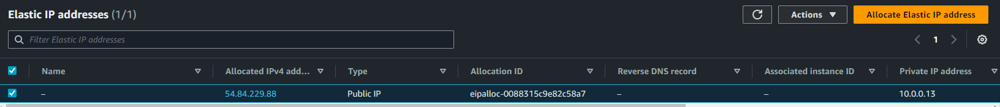
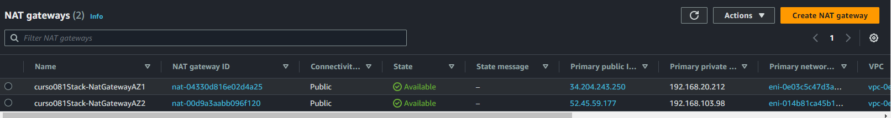

# Imersão DevOps & Cloud 1   

### Repository: [course](../../../../)
### Platform: <a href="../../">fabricio_veronez   </a>
### Software/Subject: <a href="../">devops   </a>
### Course: <a href="./">curso_081 (Imersão DevOps & Cloud 1)   </a>

---

### Theme:
- Cloud Computing
- DevOps

### Used Tools:
- Operating System (OS): 
  - Linux   
  - Windows 11   
- Linux Distribution: 
  - Ubuntu   
- Cloud:
  - Amazon Web Services (AWS)   
- Cloud Services:
  - Amazon Elastic Compute Cloud (EC2)   
  - Amazon Elastic Container Registry (ECR)   
  - Amazon Elastic Kubernetes Service (EKS)   
  - Amazon Virtual Private Cloud (VPC)   
  - AWS Budgets  
  - AWS Identity and Access Management (IAM)   
  - Google Drive 
- Containerization: 
  - Docker   
- Cluster Management Software:
  - Kubernetes   
  - K3D   
- Configuration Management (CM):
  - Terraform   
- Language:
  - HTML   
  - Markdown   
  - Node.js   
  - YAML   
- BI Tool:
  - Grafana   
- Integrated Development Environment (IDE) and Text Editor:
  - Nano   
  - Visual Studio Code (VS Code)   
- Versioning: 
  - Git   
- Repository:
  - Docker Hub   
  - Docker Registry   
  - GitHub   
  - Terraform Registry   
- Command Line Interpreter (CLI):
  - AWS Command Line Interface (CLI)   
  - Bash e Sh   
  - Eksctl   
  - Oh My Zshell (Oh My ZSh)   
  - Systemctl   
  - Windows PowerShell   
  - ZShell   
- Server and Databases:
  - Nginx   
  - Prometheus   
- Workflow Management System (WFMS):
  - GitHub Actions   
- Tools:
  - Advanced Package Tool (Apt)   
  - Advanced Package Tool (Apt-Get)   
  - Curl   
  - Node Package Manager (npm)   
  - Unrar   
  - Wget   
  
---

<a name="item0"><h3>Course Strcuture:</h3></a>
1. <a href="#item01">Aula 1 - Revolução Digital com DevOps e Cloud</a><br>
2. <a href="#item02">Aula 2 - Kubernetes do zero ao deploy</a><br>
3. <a href="#item03">Aula 3 - AWS: Potencialize sua aplicação com o poder da Cloud Computing</a><br>
4. <a href="#item04">Aula 4 - Github Actions - Eficiência em entregas automatizadas</a><br>
5. <a href="#item05">Aula 5 - Terraform: Produtividade com automações Infra as Code</a><br>

---

### Objective:
O objetivo desse projeto prático foi introduzir algumas das principais ferramentas da área de **DevOps**, que são elas: **Docker**, **Kubernetes**, **AWS**, **GitHub Actions** e **Terraform**. Neste projeto foi desenvolvido uma aplicação web de um microblog (portal de notícias) escrito em **Node.js** que tem como persistência dos dados no banco **PostgreSQL**. Também foi desenvolvido um pipeline de entrega e integração contínua deste projeto utilizando os softwares **GitHub Actions**, **Kubernetes** como ambiente de execução da aplicação, o **Docker** como tecnologia para empacotar a imagem de container para rodar essa aplicação, e o monitoramento dessa aplicação com o **Grafana** e o **Prometheus**.

### Structure:
A estrutura do projeto (Imagem 01) é formada por:
- A pasta `automation` com os arquivos de scripts em **PowerShell** de automação (`criacao`, `exclusao` e `variaveis`) .
- Duas sub-pastas (`resources` e `secrets`) dentro da pasta `automation`. A primeira com recursos utilizados nesse projeto, como arquivos de script em **Bash**, arquivos de manifesto **YAML**, arquivos **Dockerfile**, entre outros. Já a segunda com sub-pastas e arquivos de configuração do usuário da **AWS CLI** e do **Docker Hub**, além do arquivo par de chaves `.pem` para acesso remoto, sendo esta pasta não versionada para o **GitHub** por ter dados sensíveis.
- A pasta do repositório do projeto do **GitHub** do professor, com os projetos da aula 1 e das aulas 2, utilizado também na aula 3.
- A pasta `0-aux`, pasta auxiliar com imagens utilizadas na construção desse arquivo de README. 

<div align="Center"><figure>
    <br>
    <figcaption>Imagem 01.</figcaption>
</figure></div><br>

### Development:
Este projeto foi desenvolvido em cinco aulas, além de conter quatro lives e três desafios. As etapas do projeto estão listadas abaixo.

- Empacotar a aplicação em imagens Docker para executar em containers.
- Rodar a aplicação em ambiente Kubernetes local usando K3D e ambiente de nuvem com AWS.
- Automatizar a entrega das aplicações usando pipeline CI/CD com GitHub Actions.
- Utilizar infraestrutura como código para criar a infraestrutura pra conseguir agilidade, reaproveitamento e confiabilidade.
- Monitorar a aplicação e a infraestrutura para saber o que está acontencendo e se antecipar aos problemas.

Este curso teve a maior parte do seu desenvolvimento executado na cloud da **AWS** no intuito de evitar instalações na maquina física **Windows**. Para isso, a maquina física já possuia instalada a interface de linha de comando da AWS (**AWS CLI**), configurada com acesso do usuário administrador da conta (`PedroheegerAdmin`) e utilizada através do **PowerShell**. O desenvolvimento deste curso foi dividido em etapas, sendo que uma aula poderia conter mais de uma etapa. Cada etapa compreendeu a realização de um projeto, podendo este ser um projeto preeliminar apenas para aprendizado do software em questão, ou o projeto principal que foi o objetivo do curso.

A maior parte do curso foi realizada de forma automatizada com uso de três arquivos de scripts **PowerShell**, exceto em situações onde foi necessário interagir com alguma interface gráfica. Os scripts utilizados foram [criacao](./automation/criacao.ps1), [exclusao](./automation/exclusao.ps1) e [variaveis](./automation/variaveis.ps1), armazenados no diretório [automation](./automation/). Este diretório ainda conteve duas sub-pastas, a primeira ([resources](./automation/resources/)), para armazenar os arquivos de recursos necessários dos projetos do curso. O sub-diretório `resources` foi sub-dividido nas seguintes pastas para uma melhor organização dos arquivos: [bash](./automation/resources/bash/) contendo os arquivos em **Bash** utilizados no decorrero do curso; [docker](./automation/resources/docker/) contendo o arquivo `Dockerfile` utilizado na aula 2; [gbActions](./automation/resources/gbActions/) contendo o arquivo de manifesto referente ao **GitHub Actions**; [iac1](./automation/resources/iac1/) contendo o arquivo de manifesto YAML do **Terraform** da primeira etapa da aula cinco; [iac2](./automation/resources/iac2/) contendo o arquivo de manifesto e o arquivo de variáveis do projeto **Terraform** da segunda etapa da aula cinco; além da pasta [others](./automation/resources/others/) contendo outros arquivos.

A outra sub-pasta de nome `secrets` também continha sub-diretórios, sendo o primeiro deles o `.aws` armazenando os arquivos de credenciais e configuração do usuário na **AWS CLI**. O sub-diretório de nome `.docker` armazenava o arquivo configuração do usuário no **Docker Hub**. Já o último sub-diretório foi o `keyPair` contendo arquivos par de chaves `.pem` gerado para realização de acesso remoto em maquinas virtuais instanciadas na cloud da **AWS** durante o curso. A sub-pasta `secrets` não foi versionado para o **GitHub** por conter dados pessoais sensíveis.

No script de criação, assim como no de exclusão, as etapas do curso foram separadas por meio de uma estrutura de condição que a partir de um input inserido pelo usuário, determinava se aquele bloco de código referente a etapa seria executado ou não. Em ambos os scripts, a maior parte dos comandos executados foram precedidos por comandos de verificação, também através de estruturas de condicionais `if else`, determinando se o serviço ou recurso já havia sido criado ou não. Caso o resultado fosse que o elemento já tinha sido criado, o nome dele era listado, além de informações necessárias que também eram exibidas. Já se não houvesse sido criado, era listado o antes e o depois do comando de criação para evidenciar a construção do serviço. Nesta segunda situação, também era listada informações adicionais quando necessário.

O script de exclusão basicamente desfazia tudo que o de criação fez, removendo e desvinculando os serviços e elementos criados durante os projetos. O script de variáveis, o próprio nome já diz, foi elaborado apenas para armazenar variáveis que seriam utilizados nos outros dois scripts, sendo necessário importá-lo em cada um deles.

Alguns etapas das aulas deste curso gerariam custos na **AWS**, principalmente a partir da aula 3 que o desenvolvimento foi em ambiente de cloud. Então foi necessário acessar o console da **AWS** com o usuário root e configurar um alerta através do serviço **AWS Budget** para receber uma notificação por email quando os custos dos serviços atingissem 50% do valor determinado. Este processo teve que ser feito diretamente na conta do usuário root e pelo console, pois na **AWS CLI** instalada na maquina física, o usuário configurado era o usuário administrador que não tinha permissões relacionadas a finanças.

<a name="item01"><h4>Aula 1 - Revolução Digital com DevOps e Cloud</h4></a>[Back to summary](#item0)

Na primeira aula desse curso, foi realizada uma introdução sobre o software **Docker**, mostrando alguns comandos básicos e desenvolvendo um projeto preeliminar apenas para aprendizado da ferramenta. Este projeto consistiu na criação de uma imagem **Docker** da aplicação [conversao-temperatura](./imersao-devops-cloud-02-main/conversao-temperatura/), ou seja, um conversor de temperaturas que convertia as temperaturas em Fahrenheit para Celsius e Celsius para Fahrenheit. Esta imagem foi enviada para o repositório de imagens Docker (**Docker Hub**) e um container foi executado a partir dessa imagem, configurando o acesso a aplicação pelo navegador de internet, tudo isso realizado de forma local. Porém foi decidido que as execuções em ambiente local também seriam realizadas no ambiente em cloud. Então as aulas 1 e 2 que foram realizadas em ambiente local pelo professor, seriam realizadas em uma maquina virtual na cloud da **AWS**.

Dessa forma, o script **PowerShell** de criação iniciou com a geração de um par de chaves na cloud da **AWS**, onde as informações foram também armazenadas em um arquivo formato `.pem` dentro da sub-pasta `secrets`, para utilização durante o acesso remoto pela maquina física **Windows** às instâncias da cloud via software **OpenSSH**. Esse par de chaves gerado na aula 1, também foi utilizado nas aulas posteriores, caso fosse excluído, seria necessário gerá-lo novamente.

Em seguida, foi instanciada a maquina virtual **Linux Ubuntu** do tipo `t3.medium` no serviço **Amazon EC2** que funcionaria como ambiente de execução, indicando um arquivo de script **Bash** ([ec2Script.sh](./automation/resources/bash/ec2Script.sh)), armazenado na sub-pasta `resources/bash`, que seria responsável por realizar as instalações dos softwares, download dos arquivos dos projetos nesta maquina e execução de alguns comandos do projeto. O tipo escolhido para essa maquina gerou custos, pois não estava dentro do plano `free tier` da **AWS**, mas tornou-se necessário por causa dos recursos de processamento desse tipo de maquina, fundamentais para execução de um cluster **Kubernetes**.

Após isso, uma regra foi adicionada ao grupo de segurança padrão da VPC padrão, ambos utilizados nesta maquina virtual instanciada. Esta regra consistiu na liberação da porta `8080` do protocolo `TCP` para todas as faixas de IP, para que posteriormente fosse possível acessar a aplicação, em execução em um container **Docker**, por um navegador da web na maquina física. Foi aguardado alguns segundos para que uma parte do script em **Bash** fosse executado, o que incluia o download de alguns softwares e também o clone do repositório do projeto do **GitHub** do professor para a instância, pois alguns arquivos que seriam transferidos da maquina física para a instância iriam para sub-pastas da pasta desse projeto e portanto era necessário que essa pasta já estivesse na instância. 

Passado esse tempo, foi exibido o endereço para acesso a aplicação que seria executada no container, no qual era formado pelo o IP público da maquina virtual concatenado com o número da porta, que no caso foi a `:8080`. Este número de IP passou por um processo de conversão de caracteres para trocar os pontos (`.`) que separavam os números do IP por traços (`-`), e então exibindo na tela o comando para acesso remoto a instância da cloud (`ssh -i "$keyPairPath\$keyPairName.pem" ubuntu@ec2-$ipEc2.compute-1.amazonaws.com`). Observe que neste comando para acesso remoto foi necessário informar o arquivo par de chaves `.pem` para autenticar o acesso a maquina. Note também que a URL ou endereço para acesso a instância foi um pouco diferente da forma mais comum que é `ubuntu@$ipEc2`. Essas duas formas possuem uma diferença na formatação do número de IP, a primeira utiliza os traços (`-`) para separar os números, enquanto a segunda utiliza os pontos (`.`). Agora ficou mais claro o porque da substituição de caracteres. Este comando de acesso remoto foi utilizada no **PowerShell** da maquina física para acessar a instância da cloud de forma manual, se houvesse necessida.

Mais 15 segundos foram aguardados para realização do acesso remoto manual, só para acompanhar o processo de automação de dentro da instância através do script **Bash**, onde nesse momento ela estaria terminando de instalar e configurar o software **Docker**. Então, de volta ao script de criação, através do software **OpenSSH**, o mesmo utilizado para acesso remoto, foram realizadas verificações dentro da maquina virtual da cloud para determinar se os arquivos e pastas que deveriam ser enviadas já existiam nos seus respectivos locais do sistema de arquivos, caso esses arquivos não fossem encontrados, eram enviados da maquina física para a instância. Os arquivos transferidos foram: a pasta `.aws` contendo os arquivos `credentials` e `config` para configuração do usuário administrador `PedroheegerAdmin` na **AWS CLI** da maquina virtual; a pasta `.docker` contendo o arquivo `config.json` que configurava o acesso do usuário ao repositório do Docker (**Docker Hub**); os arquivos `deployment1.yaml` e `deployment2.yaml` para execução de dois projetos da aula 2, um projeto preeliminar do software **Kubernetes** e o projeto principal; e também o arquivo `Dockerfile` para construção da imagem do projeto principal. As pastas `.aws` e `.docker` estavam armazenadas no sub-diretório `secrets` por conter conteúdos sensíveis, já os demais estavam armazenados no sub-diretório `resources`.

##### Script Bash

Enquanto o script de criação era executado, o script **Bash** também era executado na instância logo após ela ficar disponível. Este script também foi dividido em etapas e todos os comandos e etapas executados precederam por um comando de `echo` para exibir a ação que foi realizada e em que parte do projeto estava. A execução desses comandos puderam ser visualizadas através do arquivo `/var/log/cloud-init-output.log` dentro da maquina virtual. Todos os projetos, preeliminares e principal, foram executados sequenciadamente e praticamente todo de forma automatizada, ou seja, a medida que o script estava em execução um projeto menor era realizado, em seguida ele era excluído e o próximo projeto era executado.

A primeira parte do script em **Bash** que rodou dentro da instância, realizou procedimentos que já eram padrões dos projetos que tenho criado em outros cursos ou bootcamps, sendo eles: alteração para o diretório do usuário `/home/ubuntu`, atualização dos pacotes e do sistema, execução de instalações de softwares básicos (**Nano** **Wget**, **Curl**, **Git**), instalação e configuração da interface de linha de comando (CLI) **ZShell** com os três seguintes plugins: **powerlevel10k**, **zsh-autosuggestions** e **zsh-syntax-highlighting**, e definição do **ZShell** como shell padrão do usuário `ubuntu` desta maquina. O software de CLI da **AWS** também foi baixado e instalado, onde não foi necessário fazer o login do usuário, pois a pasta `.aws` com os arquivos enviados da maquina física, cujo login já estava feito, se encarregaram de fazer essa configuração.

Na segunda etapa desse script foi feito o clone do repositório do projeto do **GitHub** fornecido pelo professor cujo nome da pasta do projeto foi [imersao-devops-cloud-02](./imersao-devops-cloud-02/), ela também foi baixada na maquina física, pois seria utilizada na aula 3. Na instância, essa pasta teve seu proprietário e grupo alterado de usuário `root` para o usuário `ubuntu`, usuário que realizava o acesso remoto, e também foi criado o sub-diretório `k8s` dentro da pasta do projeto `kube-news`, utilizado na aula 2 etapa 2. Em seguida foi feita a instalação do software **Docker** e a adição do usuário `ubuntu` ao grupo de usuários do **Docker** para executar os comandos sem a utilização do `sudo`. Antes de partir para etapa três, foi aguardado mais alguns segundos para esperar que todos os cinco arquivos da maquina física fossem transferidos para a instância na cloud.

A etapa 3 compreende extamente o desenvolvido na aula 1 deste curso, que foi um projeto preeliminar para aprendizagem do software **Docker**, cujo nome era `conversao-temperatura`. Ele foi inciado com o acesso a pasta `src` deste projeto (`/home/ubuntu/imersao-devops-cloud-02/conversao-temperatura/src`) onde já existia um arquivo `Dockerfile` e os arquivos da aplicação clonados do repositório do **GitHub** do professor. Nesta pasta foi elaborado um arquivo `.dockerignore` para ignorar a pasta do `node_modules` que era criada e então foi feito o build da imagem **Docker**. Essa imagem foi tagueda para as versões `v1` e `latest` sendo ambas enviadas para o **Docker Hub** (um repositório de imagens **Docker**) e podendo ser baixadas de qualquer lugar e por qualquer pessoa com acesso a internet e conta no **Docker Hub**. Como a pasta `.docker` foi enviada da maquina físca para a instância, não foi necessário configurar o usuário para acesso ao **Docker Hub**, pois isto já tinha sido feito na maquina física, cujo o arquivo `config.json` com essa configuração estava dentro do diretório `.docker`. Por fim, foi executado o comando (`docker container run --name aplicacao1 -d -p 8080:8080 conversao-temperatura`) para criação do container da aplicação a partir dessa imagem construída pelo arquivo `Dockerfile`, realizando um bind de portas, ou seja, combinando a porta `8080` da maquina instanciada com a porta `8080` do container. Assim a aplicação pode ser acessada e interagida através do número de IP público da maquina virtual concatenado com o número da porta `:8080`. 

A imagem 02 a seguir mostra a aplicação sendo acessada pelo navegador de internet da maquina física no IP público da instância e na porta estabelecida. Agora ficou explicado o porque foi nessário criar uma regra para a liberação da porta `8080` da maquina virtual da cloud. Após a imagem, o script do arquivo `Dockerfile` é exibido, observe que foi utilizado uma imagem base do **Node.js**, os arquivos `package` em formato **JSON** foram copiados e com a execução do comando `npm install` as dependências nesses arquivos foram criadas no sub-diretório `node_modules` que também foi criado. Por fim, os demais arquivos da aplicação foram copiados, a aplicação ficava exposta na porta `8080` do container e o comando `node server.js` era acionado para execução da aplicação. Enquanto este container estivesse ativo, a aplicação estaria sendo executada no endereço estabelecido. 

<div align="Center"><figure>
    <br>
    <figcaption>Imagem 02.</figcaption>
</figure></div><br>

```dockerfile
FROM node:18.16.0
WORKDIR /app
COPY package*.json ./
RUN npm install
COPY . .
EXPOSE 8080
CMD ["node", "server.js"]
```

A imagem 03 mostra a imagem **Docker** no repositório do **Docker Hub**. Já a imagem 04 exibe as imagens e containers **Docker** criados na maquina virtual da cloud da **AWS**.

<div align="Center"><figure>
    <br>
    <figcaption>Imagem 03.</figcaption>
</figure></div><br>

<div align="Center"><figure>
    <br>
    <figcaption>Imagem 04.</figcaption>
</figure></div><br>

<a name="item02"><h4>Aula 2 - Kubernetes do zero ao deploy</h4></a>[Back to summary](#item0)

As próximas três etapas (4, 5 e 6) do arquivo de script em **Bash** são referentes a aula 2 deste curso. A etapa 4 consistiu na instalação do softwares **k3d** para execução de clusters **Kubernetes** e o **kubectl** que é um CLI para **Kubernetes**. Ao terminar de baixar o **kubectl** foi necessário alterar o proprietário e grupo da pasta `.kube`. Alguns segundos foram aguardados antes de iniciar a etapa 5, neste momento o projeto 1 (`conversao-temperatura`) ainda estava no ar.

A etapa cinco iniciou com a remoção do container da aplicação do projeto 1 e exclusão de todos os recursos do **Docker** que não estavam sendo utilizados, em seguida a pasta do projeto 2 (`kube-news`) foi acessada. Neste diretório, um segundo projeto foi criado, assim como o primeiro também foi um projeto preeliminar, agora para introduzir o software **Kubernetes**. Neste projeto foi criado um cluster com o comando `k3d cluster create meucluster1 -p "8080:30000@loadbalancer"`, sendo o primeiro cluster criado, o arquivo `config` foi gerado na pasta `.kube`, portanto foi necessário alterar o proprietário e grupo dele para o usuário `ubuntu`.

Com o comando `kubectl apply -f deployment1.yaml`, foi realizado o deploy do primeiro arquivo de manifesto **YAML** ([deployment1.yaml](./automation/resources/kubernetes/deployment1.yaml)) que foi enviado da maquina física para instância na pasta `kube-news`. Alguns segundos foram aguardados antes de realizar uma alteração na aplicação. No arquivo de manifesto **YAML** `deployment1.yaml`, uma aplicação e um serviço eram construídos, a imagem utilizada pelo container da aplicação era `fabricioveronez/web-page:blue` que era baixado do repositório do professor no **Docker Hub**. Porém, agora, essa imagem foi alterada para `fabricioveronez/web-page:green`, também do repositório do professor. A diferença entre uma e outra era apenas a cor de fundo da aplicação, a aplicação em si era apenas uma página de teste, o objetivo mesmo era exercitar o deploy de um aplicação com imagens **Docker** em cluster **Kubernetes**, realizando a troca de versões. Um ponto importante é que as imagens utilizadas podem ser encontradas no repositório do professor com outro nome, no meu caso, tive que alterá-las para `fabricioveronez/web-color:blue` e `fabricioveronez/web-color:green`. Pode ser que futuramente essas imagens não estejam mais disponíveis no repositório do professor, então o ideal é certificá-las que elas existem no repositório, caso não, deve-se procurá-las em outro repositório do professor. Lembrando de ter cuidado com a utilização de imagens de repositórios desconhecidos.

Então, feita a alteração, um novo deploy do arquivo **YAML** foi feito para a trocar da imagem do container da aplicação e mais alguns segundos foram aguardados com essa aplicação rodando. Por fim, a aplicação foi derrubada com o comando `kubectl delete -f deployment1.yaml` e o cluster removido com o comando `k3d cluster delete meucluster1`, finalizando o segundo projeto. As imagens 05 e 06 exibem a aplicação no ar através do navegador da web, sendo uma com a imagem cujo fundo da aplicação é azul e a outra com o fundo verde. Novamente, alguns segundos foram aguardados para concluir a remoção do cluster. Já a imagem 07 exibe todos os elementos do cluster **Kubernetes** criados, evidenciando que este cluster tem apenas um server e nenhum worker node.

<div align="Center"><figure>
    <br>
    <figcaption>Imagem 05.</figcaption>
</figure></div><br>

<div align="Center"><figure>
    <br>
    <figcaption>Imagem 06.</figcaption>
</figure></div><br>

<div align="Center"><figure>
    <br>
    <figcaption>Imagem 07.</figcaption>
</figure></div><br>

Na etapa 6 foi acessada a pasta `src` do projeto `kube-news`, que era o projeto principal. Neste diretório, também foi criado um arquivo `.dockerignore`, ignorando a pasta `node_modules`. Como visto anteriormente essa pasta é criada ao executar o comando `npm install`, que no caso foi executado no arquivo `Dockerfile`, que foi enviado da maquina física para a instância no sub-diretório `src`. A partir desse arquivo, o build da imagem foi realizado cujo nome ficou `pedroheeger/curso081_kube-news:v1`. Uma versão `latest` também foi tagueada a partir da versão `v1`. Ambas foram enviadas para um repositório no **Docker Hub**. Com a imagem criada, o cluster foi construído com o comando `k3d cluster create meucluster2 -p "8080:30000@loadbalancer"`.

O segundo arquivo de manifesto ([deployment2.yaml](./automation/resources/kubernetes/deployment2.yaml)) foi transferido da maquina física para a sub-pasta `k8s` dentro do diretório do projeto principal `kube-news` da instância. Alterando para esse sub-diretório, foi realizado o deploy da aplicação a partir do segundo arquivo de manifesto (`kubectl apply -f deployment2.yaml`). Nesse momento, a aplicação já estava rodando na porta `8080` e pode ser acessada pelo navegador da web da maquina física através do IP público da instância, conforme imagem 08. Essa aplicação consistiu em um blog, onde era possível inserir dados através da opção `Novo Post`. Quando Post era criado, esses dados eram armazenados no container de banco de dados em execução no cluster e eram retornados de volta para o site da aplicação como conteúdo do blog.

<div align="Center"><figure>
    <br>
    <figcaption>Imagem 08.</figcaption>
</figure></div><br>

No primeiro momento este blog estava vazio, sem nenhum post, com isso foi utilizado o arquivo [popula-dados.http](./automation/resources/others/popula-dados.http). Nele, foi alterado na URL `http://localhost:8080/api/post`, o `localhost` pelo IP da maquina da instância e com esse arquivo aberto no **Visual Studio Code (VS Code)**, utilizando a extensão **REST Client** foi clicado na opção `Send Request` para enviar uma requisição do tipo `POST` para endereço do IP público da instância, na porta onde a aplicação estava rodando (`8080`), conforme visualizado na imagem 09. Alguns segundos foram aguardados para garantir que o blog fosse populado com dados através do envio dessa requisição, sendo esta parte feita de forma manual no **VS Code** da maquina física. Na imagem 10 é possível ver o blog populado com posts gerados pelo arquivo `popula-dados.http`. Já na imagem 11 é exibido todos os objetos do cluster, bem como os containers e imagens **Docker** utilizados. Mais um tempo for aguardado com a aplicação rodando nesta versão.

<div align="Center"><figure>
    <br>
    <figcaption>Imagem 09.</figcaption>
</figure></div><br>

<div align="Center"><figure>
    <br>
    <figcaption>Imagem 10.</figcaption>
</figure></div><br>

<div align="Center"><figure>
    <br>
    <figcaption>Imagem 11.</figcaption>
</figure></div><br>

Agora foi o momento de realizar a mudança de versão, ou seja, foi realizada uma alteração no arquivo da aplicação (`/home/ubuntu/imersao-devops-cloud-02/kube-news/src/views/partial/header.ejs`), onde na linha 4 deste arquivo foi inserido `- v2` após o comando ``, utilizando o comando **Bash** no arquivo de script `ec2Script.sh`, conforme abaixo. Neste instante, a pasta corrente era a `k8s`, então foi necessário alterar para a pasta do arquivo `DockerFile` (`/home/ubuntu/imersao-devops-cloud-02/kube-news/src`) e fazer o build da imagem na versão `v2` e subi-lá para o **Docker Hub**. Voltando para a pasta `k8s`, foi feita uma modificação também no arquivo de manifesto **YAML** (`deployment2.yaml`), trocando a imagem do container da aplicação de `v1` para `v2`. As alterações foram aplicadas executando o arquivo de manifesto `kubectl apply -f deployment2.yaml` e o resultado da aplicação agora na versão 2 acessada pelo navegador é exibida na imagem 12, observe que o `- v2` está bem pequeno ao lado do título `KubeNews`. Na imagem 13 é possível perceber as três versões da imagem **Docker** construídas para essa aplicação no repositório **Docker Hub**. Por fim, após alguns segundos a aplicação foi removida e o cluster excluído. O script **Bash** executado na instância se encerra aqui, não sendo mais necessário essa instância, pois a partir da aula 3, o desenvolvimento é feito em ambiente de cloud seguindo os passos do professor.

```bash
sed -i 's// - v2/' "/home/ubuntu/imersao-devops-cloud-02/kube-news/src/views/partial/header.ejs"
```

<div align="Center"><figure>
    <br>
    <figcaption>Imagem 12.</figcaption>
</figure></div><br>

<div align="Center"><figure>
    <br>
    <figcaption>Imagem 13.</figcaption>
</figure></div><br>

<a name="item03"><h4>Aula 3 - AWS: Potencialize sua aplicação com o poder da Cloud Computing</h4></a>[Back to summary](#item0)

Para aula três foi necessário a criação de uma conta na **AWS** e de um usuário administrador (`PedroheegerAdmin`) para esta conta, anexando a ele a permissão `AdministratorAccess`. Também foi preciso baixar, instalar e configurar este usuário no **AWS CLI** que foi usado no **PowerShell** da maquina física para executar comandos na cloud da **AWS**. Esta aula possuiu duas etapas, sendo que elas gerariam custos na **AWS**. Então foi necessário acessar o console da **AWS** com o usuário root e configurar um alerta através do serviço **AWS Budget** para receber uma notificação por email quando os custos dos serviços atingissem 50% do valor determinado. Este processo teve que ser feito diretamente na conta do usuário root e pelo console, pois na **AWS CLI** instalada na maquina física, o usuário configurado era o usuário administrador que não tinha permissões relacionadas a finanças. Todos esses procedimentos já foram mencionados anteriormente no início desse curso e já estavam feitos.

A primeira etapa desta aula foi a construção de uma pequena infraestrutura de rede para entender o seu funcionamento. Através do script de criação foram criados no serviço **AWS VPC**, uma VPC com duas sub-redes, sendo uma pública e outra privada. Também foram criados um Internet Gateway para liberar o acesso a internet para a sub-rede pública e um NAT Gateway para liberar o acesso a internet de dentro para fora da sub-rede privada. Ou seja, é possível acessar a internet de dentro da sub-rede privada para fora, mas não ser acessada de fora da internet para dentro da sub-rede privada. Para o NAT Gateway foi necessário alocar um IP Elástico aleatório. Foram construídas duas tabelas de rotas, sendo também uma pública e uma privada, cada uma com uma rota criada vinculando a sub-rede pública com o Internet Gateway e a sub-rede privada com o NAT Gateway.

Ao criar a VPC, automaticamente um grupo de segurança padrão para esta VPC foi gerado. Este foi utilizado, recebendo uma tag de nome e criando três regras de entrada para liberação das portas `8080`, `443` e `22` no protocolo `TCP` para todos os IPs. A porta `8080` e `443` eram as portas para acesso ao servidor **Nginx** que seria construído, sendo a `8080` para o protocolo `HTTP` e `443` para o protoclo `HTTPS`. Já a porta `22` era para acesso remoto as instâncias na cloud via software **OpenSSH** utilizado no **PowerShell** da maquina física **Windows**.

Em seguida, duas instâncias **Linux Ubuntu** foram criadas no serviço **Amazon EC2** do tipo `t2.micro`, sendo uma vinculada a sub-rede pública e outra a sub-rede privada. Em ambas foi indicado que o arquivo de script em **Bash** [ec2Script2.sh](./automation/resources/bash/ec2Script2.sh) deveria ser executado quando as maquinas estivessem prontas. Este script apenas atualizou os pacotes e o sistema e fez a instalação dos softwares: **Nano**, **Wget**, **Curl** e o **Nginx**. Na instância vinculada a sub-rede pública o acesso remoto era feito com o comando `ssh -i "$keyPairPath\$keyPairName.pem" ubuntu@ec2-$ipEc2.compute-1.amazonaws.com` ou `ssh -i "$keyPairPath\$keyPairName.pem" ubuntu@$ipEc2`, sendo na primeira opção o IP deve ser separados por traços (`-`) e na segunda separado da forma normal por pontos (`.`). 

O par de chaves gerado na cloud **AWS** e o arquivo `.pem` foram os mesmos dos desenvolvidos na Aula 1 e 2, onde só seria necessário gerá-los novamente se tivessem sido excluídos, sendo que para gerar era só executar o bloco de código destinado a criação do par de chaves da Aula 1 e 2. Lembrando que o arquivo par de chaves `.pem` ficou armazenado na sub-pasta `secrets`, pasta essa que não é versionada para o **GitHub** por ter dados sensíveis. Este arquivo foi enviado da maquina física **Windows** para a instância pública na cloud **AWS** via **OpenSSH** para o diretório `/home/ubuntu` através do comando `scp -i "$keyPairPath\$keyPairName.pem" -o StrictHostKeyChecking=no -r "$keyPairPath\$keyPairName.pem" ubuntu@${ipEc2}:/home/ubuntu/.ssh` para que fosse possível acessar remotamente a maquina privada com a instância pública, logo a instância pública seria um **Jump Server**. Este segundo acesso remoto utilizou o IP privado da instância privada e não o IP público como de costume. Este acesso só foi possível, pois as duas sub-redes onde estavam cada uma dessas instâncias eram partes da mesma rede. A imagem 14 abaixo mostra o arquivo par de chaves `.pem` já na instância pública dentro do diretório `.ssh` e o funcinamento do Jump Server, ou seja acessando remotamente a maquina privada pela maquina pública.

<div align="Center"><figure>
    <br>
    <figcaption>Imagem 14.</figcaption>
</figure></div><br>

Como foi instalado o software **Nginx** nas duas maquinas, foi possível acessar este servidor web através do navegador de internet da maquina física, utilizando como URL, apenas IP público da instância concatenado com a porta `:80`, que poderia ser omitida. A imagem 15 a seguir mostra a realização dessa etapa apenas na instância pública. Na instância privada, o acesso não era possível pelo navegador tanto no IP público como no privado, como mostrado nas imagens 16 e 17, pois como dito anteriormente a sub-rede privada só tinha acesso a internet de dentro para fora. Neste caso, para ver o funcionamento do **Nginx** foi necessário fazer o acesso remoto normal na instância pública pelo seu IP público no **PowerShell** e nela utilizar o software **Curl** para enviar uma requisição ao **Nginx** da maquina privada. A URL utilizada pelo **Curl** seria praticamente a mesma da utilizada do navegador, porém o IP da maquina que no navegador era público da instância pública, agora seria o IP privado da instância privada, mantendo a mesma porta `:80`. O comando utilizado foi o seguinte `curl -IL https://IP:80`. Na imagem 18 é possível visualizar o status de retorno de três requisições como sucedido feita pelo **Curl** dentro da instância pública. A primeira e segunda requisição são as mesmas, onde o IP público da instância pública é igual ao `localhost`, que é o IP público da própria maquina, que no caso era a instância pública. Já a terceira requisição era para o IP privado da maquina privada.

<div align="Center"><figure>
    <br>
    <figcaption>Imagem 15.</figcaption>
</figure></div><br>

<div align="Center"><figure>
    <br>
    <figcaption>Imagem 16.</figcaption>
</figure></div><br>

<div align="Center"><figure>
    <br>
    <figcaption>Imagem 17.</figcaption>
</figure></div><br>

<div align="Center"><figure>
    <br>
    <figcaption>Imagem 18.</figcaption>
</figure></div><br>

Para ficar um pouco melhor de entender, na maquina pública, o IP Público era `54.210.244.172` e o IP privado era `10.0.0.35`, já na maquina privada, o IP público era `54.173.6.213` e o IP privado era `10.0.1.147`. Observe que os IPs privados da instâncias obedeceram as faixas de IPs determinadas nas sub-redes construídas da VPC. Como pode ver, na imagem 19 é exibido as sub-redes, sendo a pública com IP `10.0.0.0/24` e a privada com IP `10.0.1.0/24`.

<div align="Center"><figure>
    <br>
    <figcaption>Imagem 19.</figcaption>
</figure></div><br>

Nas imagens 20, 21, 22, 23 e 24 são evidenciados a criação do seguintes recursos: **Internet Gateway**, **NAT Gateway**, duas **Route Tables**, **IP Elástico** usado pelo NAT Gateway e o **Security Group**, onde foram definidas as regras de Firewall.

<div align="Center"><figure>
    <br>
    <figcaption>Imagem 20.</figcaption>
</figure></div><br>

<div align="Center"><figure>
    <br>
    <figcaption>Imagem 21.</figcaption>
</figure></div><br>

<div align="Center"><figure>
    <br>
    <figcaption>Imagem 22.</figcaption>
</figure></div><br>

<div align="Center"><figure>
    <br>
    <figcaption>Imagem 23.</figcaption>
</figure></div><br>

<div align="Center"><figure>
    <br>
    <figcaption>Imagem 24.</figcaption>
</figure></div><br>

A primeira etapa desta aula 3 encerra aqui, com o script de exclusão tudo que foi construído foi removido, essa etapa gerou alguns gastos relacionados aos recursos do **NAT Gateway** e **Elastic IP** utilizados.

Na segunda etapa da aula 2, o projeto `kube-news` foi executado em ambiente de cloud utilizando o serviço **Amazon EKS** para executar o cluster **Kubernetes**. Para essa etapa, além das configurações padrões de criação de conta e usuário administrador na **AWS**, instalação e conexão da **AWS CLI** com o usuário administrador, criação dos alertas na **AWS Budget**, também foi necessário baixar, instalar e configurar o **Kubectl** na maquina física **Windows** e baixar e instalar o **Eksctl**. Ambos são interfaces de linha de comandos (CLI) que foram utilizados no **PowerShell**, sendo o **Kubectl** para manipulação dos comandos do Kubernetes e o **Eksctl**, uma outra CLI, além da **AWS CLI**, para manipulação dos recursos apenas do serviços **Amazon EKS**, sendo utilizado apenas para conhecimento. O arquivo `config` e o diretório `.kube` também foram criados na maquina física, pois era este arquivo responsável por conectar a CLI do Kubernetes com softwares executadores de clusters Kubernetes, sendo neste caso conectado ao serviço **Amazon EKS**, pois era ele o responsável por executar o cluster nesta aula. A pasta `.kube` no **Windows** também ficou armazenado na pasta do usuário `C:\Users\pedro`.

Após essa parte preeliminar, com o script de criação, o projeto foi iniciado com a elaboração de duas roles no serviço **AWS IAM**, sendo uma vinculada ao cluster construído no serviço **Amazon EKS** e a outra vinculada as instâncias criadas no node group deste cluster. Na primeira role foi anexada a policy `AmazonEKSClusterPolicy`, permitindo a interação com recursos do **Amazon EKS**, enquanto na segunda role foram anexadas as três seguintes polices: `AmazonEKS_CNI_Policy`, `AmazonEKSWorkerNodePolicy` e `AmazonEC2ContainerRegistryReadOnly`. A policy `AmazonEKS_CNI_Policy` forneceu as permissões necessárias para o **Amazon EKS** gerenciar a configuração de rede das instâncias no cluster **Kubernetes**, configurando o `Container Networking Interface (CNI)` nas instâncias **Amazon EC2**. A policy `AmazonEKSWorkerNodePolicy` concedeu as permissões necessárias para que as instâncias pudessem se registrar no cluster do **Amazon EKS**, interagir com o serviço e executar containers. Já a policy `AmazonEC2ContainerRegistryReadOnly` concedeu permissões de leitura apenas para o **Amazon Elastic Container Registry (ECR)**, permitindo que as instâncias EC2 lessem (pull) imagens de container do **Amazon ECR**, mas não gravassem (push). As imagens 25 e 26 evidenciam a criação dessas duas roles com suas respectivas polices. Observando que todas as polices utilizadas já existem na cloud da **AWS**.

<div align="Center"><figure>
    <br>
    <figcaption>Imagem 25.</figcaption>
</figure></div><br>

<div align="Center"><figure>
    <br>
    <figcaption>Imagem 26.</figcaption>
</figure></div><br>

Com as roles criadas, foi realizado o provisionamento da infraestrutura de rede através do serviço de infraestrutura como código (IaC) **AWS Cloud Formation**. Uma stack foi criada indicando um arquivo formato **YAML** como template. Este arquivo estava armazenado em um bucket do serviço **Amazon S3** do professor do curso. O próprio **AWS Cloud Formation** possuia uma opção para indicar como template um arquivo em um bucket do serviço **Amazon S3**. Este arquivo, cujo nome foi o [amazon-eks-vpc-private-subnets.yaml](./automation/resources/others/amazon-eks-vpc-private-subnets.yaml), também foi baixado e armazenado na sub-pasta `resources/others`, porém não foi utilizado pela maquina física.

Após esta execução, foi aguardado alguns segundos para que a infraestrutura de rede fosse toda provisionada através do arquivo fornecido pelo professor do curso, conforme imagem 27 abaixo. Esta infraestrutura conteve os seguintes recursos: uma VPC (Imagem 28), sub-redes (Imagem 29), Internet Gateway (Imagem 30), NAT Gateway (Imagem 31), Route Tables com rotas já desenvolvidas (Imagem 32), Elastic IP (Imagem 33) e Security Group com regras de liberação de portas já estabelecidas (Imagem 34), todos esses recursos foram vistos na etapa um desta aula. Na sequência, com o comando abaixo após as imagens, foi realizado a criação do cluster **Kubernetes** no serviço **Amazon EKS**. Observe que foi necessário extrair os Ids das quatro sub-redes criadas na VPC, sendo duas públicas e duas privadas. Também foi necessário o Id do Security Group desta mesma VPC e o **Amazon Resource Name (ARN)** da role com permissões para o **Amazon EKS**.

<div align="Center"><figure>
    <br>
    <figcaption>Imagem 27.</figcaption>
</figure></div><br>

<div align="Center"><figure>
    <br>
    <figcaption>Imagem 28.</figcaption>
</figure></div><br>

<div align="Center"><figure>
    <br>
    <figcaption>Imagem 29.</figcaption>
</figure></div><br>

<div align="Center"><figure>
    <br>
    <figcaption>Imagem 30.</figcaption>
</figure></div><br>

<div align="Center"><figure>
    <br>
    <figcaption>Imagem 31.</figcaption>
</figure></div><br>

<div align="Center"><figure>
    <br>
    <figcaption>Imagem 32.</figcaption>
</figure></div><br>

<div align="Center"><figure>
    <br>
    <figcaption>Imagem 33.</figcaption>
</figure></div><br>

<div align="Center"><figure>
    <br>
    <figcaption>Imagem 34.</figcaption>
</figure></div><br>

```powershell
aws eks create-cluster --name $clusterName --role-arn $arnRole --resources-vpc-config "subnetIds=$subnetPub1Id,$subnetPub2Id,$subnetPriv1Id,$subnetPriv2Id,securityGroupIds=$securityGroupId" --no-cli-pager
```

Novamente, foi aguardado alguns segundos para que o cluster terminasse de ser construído. Então foi provisionado um node group para esse cluster com dois nós cujo tipo de instância foi a `t3.medium`, lembrando que esta instância não está dentro do plano **Free Tier**, portanto custos foram gerados. O comando executado foi o abaixo. Observe que foi necessário definir vários parâmetros, entre eles, as sub-redes privadas da VPC, a **ARN** da segunda role, o tipo de instância e imagem de maquina, o tamanho do disco em Gib e configurações da quantidade de nós. Na imagem 35 é visualizado pelo console da **AWS** o cluster criado. Já na imagem 36 é listado os nós do cluster, que são exibidos pelo console na imagem 37 no serviço **Amazon EC2**, onde foram instanciadas duas maquinas que integram esse cluster. Por fim, na imagem 38, é exibido o node group do cluster pelo console.

```PowerShell
aws eks create-nodegroup --cluster-name $clusterName --nodegroup-name $nodeGroupName --subnets "$subnetPriv1Id" "$subnetPriv2Id" --instance-types $instanceTypeCash --ami-type $amiType --disk-size 20 --scaling-config minSize=2,maxSize=3,desiredSize=2 --tags "KeyName1=$tagNameNode1,KeyName2=$tagNameNode2" --node-role $arnRole --no-cli-pager
```

<div align="Center"><figure>
    <br>
    <figcaption>Imagem 35.</figcaption>
</figure></div><br>

<div align="Center"><figure>
    <br>
    <figcaption>Imagem 36.</figcaption>
</figure></div><br>

<div align="Center"><figure>
    <br>
    <figcaption>Imagem 37.</figcaption>
</figure></div><br>

<div align="Center"><figure>
    <br>
    <figcaption>Imagem 38.</figcaption>
</figure></div><br>

Agora, com toda a infraestrutura pronta chegou a hora de fazer o deploy da aplicação. Como dito anteriormente, a aplicação utilizada foi a mesma da etapa 2 da aula 2, cujo nome foi `kube-news`. Diferentemente da execução das aulas 1 e 2, onde a pasta do projeto foi baixada do repositório do **GitHub** do professor direto para instância provisionada na cloud, desta vez a pasta do projeto [imersao-devops-cloud-02](./imersao-devops-cloud-02/) foi baixado do **GitHub** para a pasta deste curso. Na pasta do projeto, duas sub-pastas eram contidas, sendo uma do projeto da aula 1 (`conversao-temperatura`) e a outra do projeto da aula 2 etapa 2 (`kube-news`). Na sub-pasta do projeto `kube-news` foi criada a sub-pasta `k8s`, onde foi feito uma cópia do arquivo de manifesto **YAML** utilizado na aula 2 etapa 2, cujo nome era [deployment2.yaml](./automation/resources/kubernetes/deployment2.yaml) e estava na sub-pasta `resource/kubernetes`. Neste arquivo copiado foi necessário realizar uma alteração, para utilização do recurso do **Load Balancer** já que agora estava sendo utilizado no ambiente de cloud. Então, no `service` da aplicação o `type` foi alterado de `NodePort` para `Load Balancer` e a opção `nodeport` foi comentada. O arquivo de manifesto **YAML** alterado para aula três pode ser visualizado em [deployment3.yaml](./imersao-devops-cloud-02/kube-news/k8s/deployment3.yaml). Importante mencionar aqui, que foi necessário ter a imagem da aplicação criado na aula 2 etapa 2 (`pedroheeger/kube-news:v1`) no repositório **DockerHub**, pois o arquivo de manifesto baixaria de lá. Caso não tivesse essa imagem, uma sugestão era alterar no arquivo `deployment3.yaml` a imagem da aplicação para a imagem do repositório do professor `fabricioveronez/kube-news:v1`. Também foi importante fazer uma cópia do arquivo [Dockerfile](./automation/resources/docker/Dockerfile) utilizado na aula 2 etapa 2, armazenado na sub-pasta `resource/docker`, para a sub-pasta [src](./imersao-devops-cloud-02/kube-news/src), pois seria usado na auala 4. Todos esses procedimentos foram realizados por fora do script de criação, pois foi decidido que não seria uma etapa recorrente, ou seja, não seria baixado e excluído pelos scripts de automação, já seriam arquivos fixos e versionados para **GitHub**. Dessa forma, esse procedimento não era necessário realizar novamente quando fosse executar o projeto, podendo pular para próxima etapa e fazer o deploy do arquivo de manifesto.

Continuando no script de criação, alguns segundos foram aguardados para que o processo de construção do node group tivesse sido finalizado. Então com o comando `aws eks update-kubeconfig --name $clusterName` o arquivo de configuração do **Kubectl** da maquina física foi conectado com o serviço **Amazon EKS**, assim os comandos para gerenciamento e manipulação do cluster **Kubernetes** puderam ser executados pelo **PowerShell** da maquina física **Windows** através do **Kubectl**. Em seguida, foi executado o comando `kubectl get nodes` para verificar os nós do cluster, que no caso eram dois, como mostrado na imagem 36. Então foi alterado para o diretório do arquivo de manifesto **YAML** com o comando `Set-Location $projectPath/kube-news/k8s` e executado o deploy com o comando `kubectl apply -f deployment3.yaml`. Na imagem 39 é exibida a aplicação em execução no cluster através do navegador da maquina **Windows** no endereço de IP externo fornecido pelo `service` da aplicação que pode ser visualizado na imagem 40, junto com os demais objetos do cluster **Kubernetes** deste projeto. Por fim, na imagem 41, os posts que na aula 2 foram realizados com o arquivo `popula-dados.http`, agora foram criados dentro do site. No ambiente de cloud não foi realizado a troca de versões, mas segue o mesmo princípio da aula 2, porém o arquivo alterado seria da pasta do projeto baixada na maquina física.

<div align="Center"><figure>
    <br>
    <figcaption>Imagem 39.</figcaption>
</figure></div><br>

<div align="Center"><figure>
    <br>
    <figcaption>Imagem 40.</figcaption>
</figure></div><br>

<div align="Center"><figure>
    <br>
    <figcaption>Imagem 41.</figcaption>
</figure></div><br>

<a name="item05"><h4>Aula 5 - Terraform: Produtividade com automações Infra as Code</h4></a>[Back to summary](#item0)

A aula cinco foi dividida em duas etapas, onde a primeira etapa foi um projeto preeliminar para conhecimento do software **Tearraform** e a segunda etapa o projeto principal. A etapa 1 inicou, no script de criação, com a verificação da existência dos arquivos de par de chaves da aula 5, caso não existissem ainda, era gerado uma chave SSH no **PowerShell** da maquina física **Windows** com o comando `ssh-keygen -t rsa -b 2048 -f "$secretsPath\$keyPairName2"`, no qual dois arquivos eram criados, sendo um formato `.pub` e outro sem formato. O objetivo disso foi para utilização dessa chave na maquina que seria instanciada na cloud da **AWS** através do arquivo de manifesto do **Terraform**. Neste arquivo a linha com o comando `public_key = file("G:\\Meu Drive\\4_PROJ\\course\\outros\\fabricio_veronez\\devops\\curso_081\\automation\\secrets\\curso081KeyPair2.pub")` já indicava que o arquivo de nome `curso081KeyPair2.pub` no diretório estabelecido seria utilizado como chave de acesso para esta maquina virtual instanciada na cloud.

Após a criação do par de chaves, conforme imagem 42, o diretório corrente foi alterado para [iac1](./automation/resources/iac1/), onde estava localizado o primeiro projeto **Terraform** ([main.tf](./automation/resources/iac1/main.tf)). Com o comando `terraform init` foi inicializado o projeto, no qual as dependências foram criadas. Em seguida com o comando `terraform plan` foi visualizado o plano de execução do projeto, o que seria construído na cloud da **AWS**, sendo a parte inicial mostrado na imagem 43. Este primeiro projeto **Terraform** consistiu na criação de alguns elementos de rede iguais ao criados pelo serviço **AWS CloudFormation** na aula 3, foram eles: VPC, Subnet, Internet Gateway, NAT Gateway, Route Tables com rotas e Security Group com regras de liberação de Firewall. Também foi desenvolvido um par de chaves com base no já gerado na maquina física e uma instância EC2 do tipo `t2.micro`. Um output foi elaborado para extrair o IP público desta instância e exibir na tela ao executar o comando `terraform output`. Porém antes deste comando, foi executado o comando `terraform apply -auto-approve` para aplicar o projeto **Terraform**, sendo tudo construído na cloud. A imagem 44 mostra o final do comando apply e o output sendo exibido. Já as imagens 45 e 46 são mostradas alguns elementos de rede criados e a maquina virtual instanciada no serviço **AWS EC2**.

<div align="Center"><figure>
    <br>
    <figcaption>Imagem 42.</figcaption>
</figure></div><br>

<div align="Center"><figure>
    <br>
    <figcaption>Imagem 43.</figcaption>
</figure></div><br>

<div align="Center"><figure>
    <br>
    <figcaption>Imagem 44.</figcaption>
</figure></div><br>

<div align="Center"><figure>
    <br>
    <figcaption>Imagem 45.</figcaption>
</figure></div><br>

<div align="Center"><figure>
    <br>
    <figcaption>Imagem 46.</figcaption>
</figure></div><br>

Na segunda etapa desta aula, o processo foi o mesmo da etapa 1. Seguindo o script de criação, foi verificado a existência de uma chave SSH na maquina física, caso não existisse, os arquivos de par de chaves eram gerados. Em seguida, o diretório corrente foi alterado para o diretório [iac2](./automation/resources/iac2/), onde estava armazenado o arquivo de manifesto **YAML** do projeto principal de **Terraform**. Este sub-diretório também continha uma arquivo de variáveis de nome [terraform.tfvars](./automation/resources/iac2/terraform.tfvars) que era utilizado pelo arquivo principal [main.tf](./automation/resources/iac2/main.tf). Os comandos de inicialização, exibição do plano e aplicação do projeto foram executados e então toda a infraestrutura foi construída na cloud da **AWS**.

Este projeto **Terraform** foi dividido em dois módulos e realizou a mesma construção do serviço **AWS CloudFormation** da aula 3 etapa 2, com a adição da criação do cluster. O primeiro módulo provisionou uma VPC com duas sub-redes públicas e duas privadas e NAT Gateway. Já o segundo módulo construiu um cluster Kubernetes no serviço **AWS EKS** utilizando as sub-redes privadas da VPC elaborada e a própria VPC. Também foram definidos a geração de um endpoint de acesso, a quantidade de nós mínimo, máximo e desejado no cluster e o tipo de instância que esses nós executariam, que no caso, teve que ser `t3.micro`. Foram definidos valores padrões para as variáveis, que no caso foram os IPs das sub-redes, porém com a declaração dessas variáveis no arquivo de variáveis do **Terraform**, esses valores foram substituídos pelo do arquivo.

Dando sequência, agora foi a vez de configurar o arquivo de configuração do **Kubectl** da maquina local para se conectar com o cluster no serviço **AWS EKS**. Para isso, o comando `aws eks update-kubeconfig --name $clusterName` foi utilizado. Poucos segundos foram aguardados para que essa configuração fosse realizada. Então com o comando `kubectl get nodes` foram exibidos os nós do cluster. O diretório corrente foi alterado para o diretório `k8s` do projeto `kube-news`, onde estava o arquivo `deployment3.yaml` utilizado na aula 3 etapa 2. Com o comando `kubectl apply -f $deploymentFile3` foi realizado a implantação da aplicação que pode ser acessada pelo IP externo fornecido pelo `service` da aplicação, sendo visualizado através do comando `kubectl get services`. Por fim, foi retornado para o diretório `automation`. Com o script de exclusão, ambos os projetos eram removidos. Na imagem 47 é exibido a aplicação em execução no cluster, sendo acessada pelo navegador da maquina física **Windows** no IP externo fornecido pelo `service`. Já na imagem 48, através do **PowerShell** é listado todos os objetos desse cluster.

<div align="Center"><figure>
    <br>
    <figcaption>Imagem 47.</figcaption>
</figure></div><br>

<div align="Center"><figure>
    <br>
    <figcaption>Imagem 48.</figcaption>
</figure></div><br>


As próximas imagens evidenciam a criação de toda infraestrutura tanto de rede como do cluster **Kubernentes** utilizando o **Terraform**, são elas: VPC (Imagem 49), Subnets (Imagem 50), Route Tables (Imagem 51), Internet Gateway (Imagem 52), Elastic IP (Imagem 53), NAT Gateway (Imagem 54), Security Group (Imagem 55), Instâncias EC2 (Imagem 56) e Cluster Kubernetes no serviço **AWS EKS** (Imagem 57).

<div align="Center"><figure>
    <br>
    <figcaption>Imagem 49.</figcaption>
</figure></div><br>

<div align="Center"><figure>
    <br>
    <figcaption>Imagem 50.</figcaption>
</figure></div><br>


<div align="Center"><figure>
    <br>
    <figcaption>Imagem 51.</figcaption>
</figure></div><br>

<div align="Center"><figure>
    <br>
    <figcaption>Imagem 52.</figcaption>
</figure></div><br>

<div align="Center"><figure>
    <br>
    <figcaption>Imagem 53.</figcaption>
</figure></div><br>

<div align="Center"><figure>
    <br>
    <figcaption>Imagem 54.</figcaption>
</figure></div><br>

<div align="Center"><figure>
    <br>
    <figcaption>Imagem 55.</figcaption>
</figure></div><br>

<div align="Center"><figure>
    <br>
    <figcaption>Imagem 56.</figcaption>
</figure></div><br>

<div align="Center"><figure>
    <br>
    <figcaption>Imagem 57.</figcaption>
</figure></div><br>


<a name="item04"><h4>Aula 4 - Github Actions - Eficiência em entregas automatizadas</h4></a>[Back to summary](#item0)

Na quarta aula foi introduzido o software **GitHub Actions** para construção de pipelines de integração contínua (CI) e entrega contínua (CD). Para execução dos pipelines, a infraestrutura tinha que está construída ou ser construída, portanto, três formas eram possíveis. A primeira executando a aula 3 etapa 2, onde a infraestrutura de rede foi criada pelo serviço **AWS CloudFormation** e a infraestrutura do cluster **Kubernetes** através de comandos **AWS CLI** no **PowerShell** da maquina física **Windows**. Na segunda forma seria semelhante a primeira, porém com a execução da aula 5 etapa 5, no qual ao invés de parte da infraestrutura ser desenvolvida pelo **AWS CloudFormation** e parte pelo script de criação com comandos **AWS CLI**, agora toda a infraestrutura tanto de rede como do cluster **Kubernetes** foi construída pelo **Terraform**. Nesses dois casos, o deploy e gerenciamento da aplicação foi feito através de comandos do **Kubectl** também no **PowerShell** da maquina física utilizados no script de criação. Nestas formas, toda a infraestrutura estava na cloud da **AWS** e a pasta do projeto na maquina física, com a conexão do **Kubectl** com o cluster no serviço **AWS EKS** a aplicação foi implantada no cluster.

Com toda a infraestrutura pronta, um arquivo de manifesto **YAML** para o **GitHub Actions** foi elaborado para montagem do Workflow. Neste Workflow dois jobs eram criados, um para execução do pipeline de CI e outro para o pipeline de CD, sendo o de CD dependente do pipeline de CI. No job de integração conítnua, três steps foram realizados para construção de imagens **Docker** e envio para o repositório do **Docker Hub**. O primeiro step foi a verificação dos arquivos do repositório onde este curso estava, em seguida, foi realizando o login no **Docker Hub**, e por último, a criação de duas imagens, uma na versão `latest` e outra na versão de mesmo número de execução do Workflow, sendo enviadas para o repositório **Docker**.

O segundo job, onde o pipeline de CD foi executado, conteve quantro steps. O primeiro step também foi para a verificação dos arquivos do repositório, em seguida, foi feito o credenciamento do usuário administrador da conta da **AWS** para que fosse possível acessá-la com este usuário. No terceiro passo foi realizado a conexão do **Kubectl** da maquina física com o cluster **Kubernetes** em execução no serviço **AWS EKS**. Por fim, foi realizado do deploy da aplicação no cluster através da indicação do arquivo de manifesto **YAML** [deployment3.yaml](./imersao-devops-cloud-02/kube-news/k8s/deployment3.yaml) que estava na pasta do projeto e indicação da imagem **Docker** utilizada que já estava no repositório **Docker Hub**, realizado pelo pipeline de CI.

Com esse Workflow, toda a parte de deploy da aplicação foi automatizada e caso seja feito alguma alteração na aplicação, o próprio **GitHub Actions** executa os pipelines para trocar a versão em execução da aplicação no cluster **Kubernetes**. Neste arquivo de Workflow foi definido como uma trigger, o envio do próprio arquivo [curso_081.yaml](./automation/resources/gbActions/curso_081.yaml), que estava armazenado na sub-pasta `resources/gbActions` para a pasta de `.github/workflows`. Esta é uma pasta que o **GitHub** usa para armazenar os arquivos de Workflow.

Para automatizar esse processo dentro do script de criação, no bloco da aula 4 foram executados os comandos `git add`, `git commit` e `git push`, para adicionar o arquivo Workflow que agora estava dentro da pasta de Workflow, commitá-lo e enviá-lo para o repositório remoto no **GitHub**. Como a trigger que aciona este arquivo foi um `push` para o repositório padrão de `Workflow`, todo o pipeline foi executado e aplicação ficou disponível no endpoint do `service`. Um ponto importante, é que tanto na aula 3 etapa 2 e aula 5 etapa 2, após a construção da infraestrutura é realizado o deploy da aplicação. Então para que esse primeiro deploy fosse executado pelos pipelines foi necessário comentar essa parte no script de criação, de forma manual.

Após o primeiro deploy, o próprio script de criação alterou o arquivo `header.ejs` que integra a aplicação, comentando a linha que contém o título `Kube-News` e então os comandos **Git** para envio do arquivo Workflow e também do arquivo `header.ejs` foram executados. Assim, o Workflow foi acionado novamente e os pipelines foram executados, construindo a imagem **Docker** em uma nova versão contendo essa alteração, em seguida, essa alteração foi enviada para aplicação em execução no cluster.

<a name="item06"><h4>Monitoramento com Prometheus e Grafana + Abertura de Matrículas DevOps Pro</h4></a>[Back to summary](#item0)

kubectl get secret --namespace default grafana -o jsonpath="{.data.admin-password}" | base64 --decode ; echo