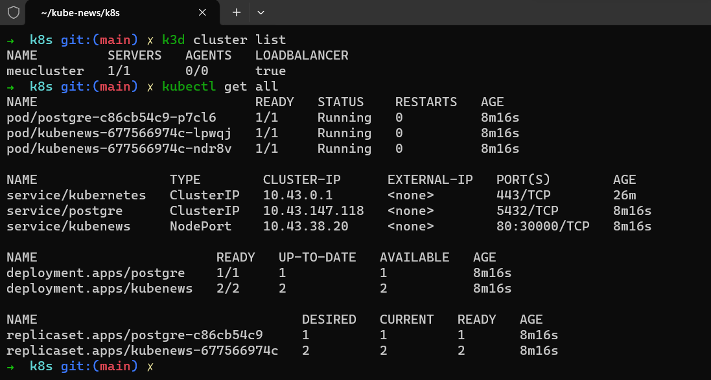

# Imersão Docker e Kubernetes 1   

### Repository: [course](../../../../)
### Platform: <a href="../../">fabricio_veronez   </a>
### Software/Subject: <a href="../">devops   </a>
### Course: <a href="./">curso_116 (Imersão Docker e Kubernetes 1)   </a>

---

### Theme:
- DevOps

### Used Tools:
- Operating System (OS): 
  - Linux   
  - Windows 11   
- Linux Distribution: 
  - Ubuntu   
- Cloud:
  - Amazon Web Services (AWS)   
- Cloud Services:
  - Amazon Elastic Compute Cloud (EC2)   
  - Google Drive 
- Containerization: 
  - Docker   
  - Docker Compose   
- Cluster Management Software:
  - Kubernetes   
  - K3D   
- Language:
  - HTML   
  - Markdown   
  - Node.js   
  - YAML   
- Integrated Development Environment (IDE) and Text Editor:
  - Nano   
  - Visual Studio Code (VS Code)   
- Versioning: 
  - Git   
- Repository:
  - Docker Hub   
  - Docker Registry   
  - GitHub   
- Command Line Interpreter (CLI):
  - AWS Command Line Interface (CLI)   
  - Bash e Sh   
  - Kubectl   
  - Windows PowerShell   
- Server and Databases:
  - Nginx   
  - PostgreSQL   
- Database Administration Tool:
  - DBeaver   
- Tools:
  - Advanced Package Tool (Apt)   
  - Advanced Package Tool (Apt-Get)   
  - Curl   
  - Node Package Manager (npm)   
  - Unzip   
  - Wget   
  
---

<a name="item0"><h3>Course Strcuture:</h3></a>
1. <a href="#item01">Aula 1 - Fundamentos e primeiros passos com Docker</a> 
2. <a href="#item02">Aula 2 - Imagem Docker e sua aplicação 100% em containers com Docker Compose</a> 
3. <a href="#item03">Aula 3 - Kubernetes: deploy eficiente das aplicações + Oportunidade de se tornar Expert</a> 

---

### Objective:
O objetivo desse curso foi introduzir duas das principais ferramentas da área de **DevOps**, que são os softwares **Docker** e **Kubernetes**. No curso foi desenvolvido um projeto unindo as duas tecnologias. Este projeto consistiu em uma aplicação web containerizada de um microblog (portal de notícias) escrito em **Node.js** que tem como persistência dos dados um container com imagem do banco **PostgreSQL**.

### Structure:
A estrutura do projeto (Imagem 01) é formada por:
- A pasta [automation](./automation/) com os arquivos de scripts em **PowerShell** de automação (`creation.ps1`, `exclusion.ps1` e `variable.ps1`) .
- A pasta [project](./project/) armazenando a pasta do repositório do **GitHub** do professor do curso que foi baixada para a maquina física.
- A pasta [resources](./resources/) que continha os arquivos de recursos necessários para execução do projeto do curso. Esta pasta foi sub-dividido nos seguintes diretórios para uma melhor organização dos arquivos: 
    - A sub-pasta [bash](./automation/resources/bash/) contendo o arquivo de script em **Bash** para realizar a automação dentro da instância do EC2;
    - A sub-pasta [docker](./automation/resources/docker/) contendo o arquivo `Dockerfile` e `compose.yaml` utilizados na aula 2;
    - A sub-pasta [kubernetes](./automation/resources/kubernetes/) contendo o arquivo de manifesto `deployment.yaml` do **Kubernetes** utilizados na aula 3;
    - A sub-pasta [others](./automation/resources/others/) contendo o arquivo `popula-dados.http` para realizar a ingestão de dados na aplicação.
- A pasta `secrets` era onde estavam os dados pessoais sensíveis e por isso não foi versionada para o **GitHub**. Ela foi ramificada nos seguintes diretórios:
    - A sub-pasta `.aws` armazenando os arquivos de credenciais e configuração do usuário do IAM worker da minha conta da **AWS**, `PedroHeegerWorker`, para utilizar na **AWS CLI** da instância.
    - A sub-pasta `.docker` que armazenava o arquivo configuração com a autenticação no usuário da minha conta no **Docker Hub**.
    - A sub-pasta `keyPair` contendo os arquivos par de chaves `.pem` gerados para realização de acesso remoto da maquina física **Windows** à instância do EC2.
- A pasta `0-aux`, pasta auxiliar com imagens utilizadas na construção desse arquivo de README. 

<figure>
     
    <figcaption>Imagem 01.</figcaption>
</figure>
 

### Development:
Esse curso, realizado em três aulas, teve a maior parte do seu desenvolvimento executado na cloud da **AWS** no intuito de evitar instalações na maquina física **Windows**. Assim, o que foi realizado de forma local, na maquina física pelo professor, seria realizado em uma maquina virtual em ambiente de cloud. Para isso, a maquina física já possuia instalada a interface de linha de comando da AWS (**AWS CLI**), configurada com acesso do usuário do IAM (`PedroHeegerAdmin`) que era o administrador da minha conta **AWS**, sendo utilizada através do **PowerShell** para interagir com os serviços da **AWS**. 

O desenvolvimento do curso foi fragmentado em etapas, sendo que em uma etapa poderia ter mais de uma aula e uma aula poderia ter mais de uma etapa. Como forma de automatizar o máximo do curso, cada etapa correspondia a um script **PowerShell** elaborado no arquivo de criação de nome [creation.ps1](./automation/creation.ps1) e a um script **Bash** desenvolvido no arquivo de user data [udCurso116.sh](./resources/bash/udCurso116.sh) executado dentro da instância do serviço EC2 da **AWS** que seria criada como ambiente de execução. Em cada script do arquivo `creation.ps1`, era utilizado uma estrutura de condicional que aguardava uma entrada do usuário para determinar se a etapa referente ao script seria executada ou não. Já os scripts do arquivo `udCurso116.sh` eram executados sequencialmente logo após a maquina ser instanciada na **AWS**. O arquivo de criação foi executado na maquina física e possuíu apenas uma etapa, listada abaixo. Enquanto o arquivo de user data foi executado dentro da instância desenvolvida e possuíu cinco etapas.

- Etapas do arquivo `creation.ps1`:
  - ETAPA 1 (AULAS 1, 2 E 3): Nesta etapa, com o arquivo `creation.ps1`, foi criada uma instância **Linux Ubuntu** no serviço **Amazon Elastic Compute Cloud (EC2)** para funcionar como ambiente de execução, pois o que fosse realizado localmente pelo curso, seria realizado nesta maquina na cloud **AWS**. Essa instância precisou ainda da criação de um arquivo par de chaves vinculado a ela, para possibilitar a realização de acesso remoto. Também foi necessário a criação de regras de entrada no grupo de segurança vinculado a essa instância, para a liberação de algumas portas. A porta `8080`, pois seria a porta onde as aplicações iriam rodar tanto no container como na própria instância. A liberação da porta `5432`, porta padrão do banco de dados **PostgreSQL**, para permitir o acesso ao banco de dados através do software **Dbeaver**. A liberação da porta `22` para realização do acesso remoto pela maquina física **Windows** a instância via software **OpenSSH**. Além disso, foi realizado a transferência de arquivos e pastas da maquina física para a instância, para configuração dos softwares que seriam instalados **AWS CLI** e **Docker** e os arquivos referente a execução do projeto. Também foi vinculado a instância o arquivo user data de nome `udCurso116.sh` que executaria as etapas dentro da instância (ambiente de execução) de forma automatizada, sendo neste caso cinco etapas que são listadas abaixo.

- Etapas do arquivo `udFileCurso116.sh`:
  - ETAPA 1: INSTALACOES DE SOFTWARES: Nesta primeira etapa foram realizadas instalações de várias softwares que seriam utilizados ao longo do curso. A sequência foi: ferramentas básicas do **Linux** (**Nano**, **Wget**, **Curl** e **Unzip**), **Git**, **ZSH**, **Oh My ZShell** e três plugins dele, **AWS CLI**, **Docker**, **K3D**, **Kubectl**, **NPM** e **Node.js**.
  - ETAPA 2: BAIXANDO OS ARQUIVOS DO PROJETO DO GITHUB: Na etapa dois, a pasta do repositório do **GitHub** do professor do curso foi baixada e a sub-pasta `k8s` necessária para o projeto do curso foi criada. Essa pasta receberia o arquivo de manifesto `deployment.yaml` do **Kubernetes** enviado da maquina física para instância.
  - ETAPA 3: EXECUTANDO APLICACAO WEB DO PROJETO SEM O DOCKER (AULA 1): Nesta etapa foi criando um container de banco de dados **PostgreSQL** para persistência dos dados, mas a aplicação web foi executada direto na instância criada, sem utilização de container.
  - ETAPA 4: DOCKER COMPOSE PROJETO (AULA 2): Na quarta etapa, foi realizado o build de uma imagem **Docker** exatamente igual a aplicação web anterior executada direto na instância, no qual essa imagem foi enviada para um repositório do **Docker Hub** e então, utilizando o arquivo de manifesto **YAML** do **Docker Compose**, foi implantada a aplicação web, agora containerizada, e também o container de banco de dados para persistência dos dados da aplicação.
  - ETAPA 5: KUBERNETES PROJETO (AULA 3): Na última etapa deste arquivo em **Bash** na instância do EC2 da **AWS**, o projeto foi implantado de uma forma diferente. Foi criado um cluster **Kubernetes** dentro da instância e realizado o deploy da aplicação com o arquivo de manifesto **YAML** do **Kubernetes**.

Adicionalmente ao arquivo de criação, em **PowerShell** também existia o arquivo de exclusão, [exclusion.ps1](./automation/exclusion.ps1), que fazia o processo inverso, removendo o que tinha sido construído nas etapas e o arquivo [variable.ps1](./automation/variable.ps1) que continha todas as variáveis utilizadas por este dois arquivos. Para o arquivo de variáveis ser utilizado neste dois arquivos foi necessário declará-lo em cada um deles. Além das estruturas de condição `if else` presentes nesses dois arquivos (`creation.ps1` e `exclusion.ps1`), a maior parte dos comandos executados durante as etapas foram precedidos por comandos de verificação, também através de estruturas de condicionais, determinando se o serviço ou recurso já havia sido criado ou excluído na cloud **AWS**. Todos os três arquivos foram armazenados no diretório [automation](./automation/) referente a automação realizada pela maquina física **Windows**.

<a name="item01"><h4>Aula 1 - Fundamentos e primeiros passos com Docker</h4></a>[Back to summary](#item0)

Nesta primeira aula do curso, foi realizado uma introdução sobre o software **Docker**, explicando suas vantagens, as tecnologias principais que permitem trabalhar com essa ferramenta, os conceitos de *container* e *imagem*, a arquitetura do **Docker**, as vantagens de utilizá-lo e como está o mercado em relação ao **Docker**. Também foi iniciado uma demonstração de como utilizá-lo, apresentando comandos básicos.

O mercado está cada vez mais competitivo, entregas mais rápidas e com qualidade são uma necessidade, a adoção da arquitetura de microsserviços se tornou um requisito, diversas tecnologias estão sendo utilizadas no mesmo projeto, as empresas cada vez mais estão implementando soluções de DevOps e Cloud. Por conta disso tudo, o uso de containers se tornou um padrão de mercado e para trabalhar com containers, **Docker** e **Kubernetes** são as ferramentas mais adotadas atualmente. Um profissional que domina o **Docker**, consegue ter mais velocidade e mais independência na hora de desenvolver, tem mais facilidade em trabalhar com tecnologias complexas, consegue participar de projetos mais desafiadores e, por consequência, consegue as melhores oportunidades.

A utilização do **Docker** tem como vantagens: melhorar o aproveitamento de recurso da maquina, ter velocidade pra desenvolver e executar aplicações, simplificaçar o deploy, ter portabilidade entre ambientes e similaridade entre ambiente dev e de produção e garantir a idempotência, que é garantir que sempre que for executado um container, ele terá o mesmo comportamento, não importa em qual ambiente esteja sendo executado desde que esse ambiente execute containers.

O **Linux** é quem tem a tecnologia, os recursos no kernel para poder trabalhar com containers. As três principais tecnologias para se trabalhar com containers são: *Namespace*, *Cgroup* e *Overlay File System (OverlayFS)*. O *Namespace* é a tecnologia do kernel que possibilita executar processos dentro de processos no **Linux** e dessa forma é que se consegue criar o isolamento de processos. O *Cgroups* entra para limitar a quantidade de recursos para cada processo, então é possível limitar cpu, limitar memória, contribuindo para o isolamento de processos. Já o *Overlay File System* é uma tecnologia que faz com que consiga juntar duas camadas de arquivos de file system, ou seja, pegar dois diretórios com suas estruturas de arquivos dentro deles e uní-los. Essa tecnologia é utilizada na hora de construir imagens de container **Docker**.

A *imagem* é um objeto do **Docker** quer serve de template para criação dos containers. Então a partir de uma única imagem é possível criar vários containers. Nela vai ser colocado tudo que é necessário para criar e executar a aplicação. A imagem, nada mais é, que um conjunto de arquivos criando um File System (Sistema de arquivos). Os *containers* por sua vez, são instâncias das imagens. Eles são objetos efêmeros, que após terem cumprido seu papel podem ser removidos.

Com relação a arquitetura do **Docker**, o primeiro elemento e o principal é o *Docker Daemon*. No *Docker Daemon*, é onde é executado e gerenciado todos os objetos do **Docker** (*imagens*, *containers* e *networks*), todos os componentes do **Docker** vão está dentro do *Docker Daemon* e é nele que vão ser executados e gerenciados os containers. Mas para trabalhar com o *Docker Daemon*, tem que ser utilizado o *Docker Client*. O *Docker Client* é responsável por enviar as instruções e fazer a comunicação do usuário com o *Docker Daemon*. Então toda vez que um comando é executado, o *Docker Client* está sendo utilizado para comunicar com o *Docker Daemon*. Muitas vezes, é possível ter instalado o *Docker Daemon* e o *Docker Client* no mesmo ambiente, no que é chamado de *Docker Host* que é a maquina responsável por hospedar e executar o *Docker Daemon*, normalmente tem-se os dois no *Docker Host*. Mas existe a possibilidade de ter o *Docker Client* em uma maquina se comunicando com o *Docker Daemon* que está em outra maquina remota que está em um datacenter em um ambiente de cloud.

Contudo, as imagens que vão ser utilizadas como base para criar os containers, elas precisam estar em algum lugar. É ai que entra o *Docker Registry*, o *Docker Registry* é componente do **Docker** utilizado para armazenar as imagens. Junto com o conceito do *Docker Registry*, tem o **Docker Hub** que é o *Docker Registry* oficial do **Docker**, o principal serviço de *Docker Registry* hoje do mercado e que pertence a **Docker**. Ele não é o único, existem diversos outros serviços, inclusive cada Cloud Provider tem o seu serviço de Docker ou Container Registry, como ECR na **AWS** ou o ACR na **Azure**. Também é possível utilizar ferramentas como o **Harbor** para criar seu próprio Registry no seu ambiente de datacenter.

###### Demonstração

A demonstração da utilização do **Docker** foi realizado na instância **Linux Ubuntu** criada no serviço **Amazon Elastic Compute Cloud (EC2)** da **AWS**, para o projeto do curso. Essa demonstração foi executada de forma manual, após a instância estar ativa, realizando um acesso remoto à ela com o software **OpenSSH**. Essa instância foi criada através do arquivo de criação em **PowerShell** explicado no sub-tópico `Automatização (PowerShell)` logo abaixo. A demonstração foi iniciada com o comando `docker container run hello-world` para baixar e executar um container de exemplo que exibiu a mensagem `hello-world` e depois se encerrou. Com o parâmetro `--name meucontainer1` foi possível executá-lo novamente dando um nome para o container. Com o comando `docker ls` foi listado todos os containers em execução, porém como esses dois criados já tinham sido encerrados, pois depois que eles exibiram a mensagem eles se encerraram, nenhum container foi exibido nesta listagem. Para listar todos os containers tanto os ativos e os inativos foi acrescentado o parâmetro `-a (--all)`. Para remover os containers inativos utilizou-se o comando `docker rm` com o ID ou nome do container. Quando utilizado com o ID não foi necessário por o ID todo, se não houvesse IDs com digitos inicias iguais, bastava por os dois primeiros IDs que ele identificava e deletava. Caso tivesse containers com IDs com dois dígitos iguais, só era acrescentar mais um dígito até que eles se diferenciassem. Com o comando `docker container --name meucontainer2 run --rm` e a imagem `hello-world` foi construído um container auto-destrutivo, no qual após ele terminasse a execução, ao invés de ficar encerrado, ele era removido.

Dando sequencia, com o comando `docker container run --name container2 -it ubuntu /bin/bash` era criado um container nomeado e com a imagem do **Linux Ubuntu**. O parâmetro `-i (--interactive)` mantinha o o stdin aberto para que fosse possível interagir com o processo executado no container. O *Standard Input (stdin)* é o canal de entrada padrão, sendo uma das três "streams" padrão associadas a um processo em sistemas operacionais Unix-like (como o **Linux**), juntamente com *stdout (saída padrão)* e *stderr (saída de erro padrão)*. Ou seja, com o stdin pôde ser fornecido dados de entrada para o processo dentro do container. Já o parâmetro `-t (--tty)` alocava um interface de terminal, pseudo-TTY (Terminal Teletype), dentro do ambiente do container para que fosse possível enviar e receber sinais de controle para os processos do container. A opção `/bin/bash` foi apenas um comando **Linux** sendo executado, que neste caso, era o caminho até o binário do **Bash**, ou simplesmente o link simbólico `bash`, para iniciar um shell bash. Com o pseudo-terminal alocado, foi possível interagir com os processos desse container que era o **Linux Ubuntu**. Com comando `cat /ect/os-release` foi visualizada as informações do sistema operacional que esse container utilizava. Já com o comando `apt-get update -y` e `apt-get install -y curl` foi atualizado os pacotes do sistema e baixado o software **Curl**. Com o **Curl** foi executado `curl -IL www.google.com` para verificar se o acesso ao site funcionava. Após isso, foi cancelado o processo em execução no terminal local, para voltar ao ambiente local e encerrar o pseudo-terminal do ambiente de container criado.

Com o comando `docker container run -it alpine /bin/bash` foi desenvolvido um outro container que utilizava a imagem do **Linux Alpine** que é uma imagem **Linux** bem mais leve que as outras distribuições. Também foi alocado o tty e permitido a interatividade, executando novamente um shell bash. Em seguida, foi encerrado o processo e voltado para o terminal local. Com o comando `docker container ls -aq` era listado apenas os IDs de todos os containers (ativos e inativos). O parâmetro `-q (--quiet)` exibiu apenas os IDs dos containers. Com uma combinação de dois comandos `docker container rm $(docker container ls -aq)` foram listados todos os IDs de todos os containers (ativos e inativos) e executado a exclusão deles.

Agora, com o comando `docker container run --name meucontainer2 nginx` foi criado um novo container com imagem do servidor web **Nginx**, porém esse processo estava sendo executado em primeiro plano do terminal, o que deixa o terminal preso. Para liberar o terminal, teve que utilizar o parâmetro `-d (--detach)` para enviar o processo para segundo plano ou background. Assim, o container continuava em execução (ativo) e o terminal local estava livre para executar novos comandos. Com o comando `docker logs` e o nome ou ID do container foi possível visualizar os logs do container especificado. Já para executar um comando no container pelo terminal local utilizou-se `docker container exec`, nome ou ID do container e o comando que quisesse executar, no caso foi o `ls`. Caso fosse necessário permitir a interatividade e alocar uma tty no ambiente de container com ele em execução era utilizado o comando `docker container exec -it meucontainer2 /bin/bash`, iniciando o shell bash.

Um outro container com a mesma imagem foi executado com o comando `docker container run -d -p 8080:80 nginx`, neste caso, foi utilizado o parâmetro `-p (--pubish)` para realizar um bind de portas, ou seja, direcionar o tráfego da porta `8080` do host, que no caso era a instância do EC2, para a porta `80` do container. Assim, era possível acessar a aplicação em execução no container, que era um servidor web **Nginx**, no IP público da instância concatenado com `:` e a porta `8080`. Na imagem 02 é exibido a aplicação containerizada, no caso o servidor web, sendo acessada pelo navegador da maquina física.

<figure>
     
    <figcaption>Imagem 02.</figcaption>
</figure>
 

Para criar um container de banco de dados, foi utilizado o comando `docker container run -d -p 5432:5432 postgres` que utilizou os mesmos parâmetros do anterior, apenas alterando a imagem para de um **PostgreSQL** e o bind de portas para `5432:5432` que é a padrão deste banco de dados. Contudo, após ele ser executado, ele ficou inativo. Isso ocorreu, porque o **PostgreSQL**, assim como outras imagens, necessitavam que fossem definidas as variáveis de ambiente. Para isso, foi utilizado o comando `-e (--environment)` e passado as variáveis `POSTGRES_PASSWORD`, `POSTGRES_USER` e `POSTGRES_DB`, que eram a senha, o usuário e o nome do banco de dados. O novo comando ficou assim `docker container run -d -p 5432:5432 -e POSTGRES_PASSWORD=Pg#123 -e POSTGRES_USER=kubenews -e POSTGRES_DB=kubenews postgres`. Com o container de banco de dados aitvo, foi utilizado um software de administração de banco de dados, instalado na maquina física, que no caso foi o **Dbeaver**, utilizado para acessar esse banco do container com uma interface gráfica. No **Dbeaver** foi criada uma conexão com o container de banco de dados, informando que o host era o IP público da instância, a porta era a `5432` definida no port bind, o nome do banco, o nome do usuário e a senha foram os mesmos estabelecidos nas variáveis de ambiente. Na imagem 03 é visualizado o banco de dados do container sendo acessado pelo **Dbeaver**. Na imagem 04 é listado na instância do EC2 os dois containers criados.

<figure>
     
    <figcaption>Imagem 03.</figcaption>
</figure>
 

<figure>
     
    <figcaption>Imagem 04.</figcaption>
</figure>
 

##### Automatização (PowerShell)

Até esse momento, os comandos tinham sido executados de forma manual através do acesso remoto realizado na instância criada, após a conclusão da execução dos arquivos de automação do projeto. Agora vai ser explicado como foi feito toda a parte automatizada do curso, como a montagem do ambiente de execução e a construção e implantação do projeto. A construção do ambiente e deploy do projeto foi efetuada inicialmente através do arquivo de criação [creation.ps1](./automation/creation.ps1) em **PowerShell**, utilizando o **AWS CLI** previamente instalado e com o usuário do IAM administrador da minha conta **AWS** (`PedroHeegerAdmin`) já configurado na maquina física. Assim, foi possível interagir com os serviços da **AWS**. A primeira etapa e única desse arquivo de criação executou alguns scripts, sendo o primeiro deles a construção de um par de chaves na **AWS** que seria vinculado com a instância para possibilitar a autenticação durante um acesso remoto da maquina física à instância. Ao mesmo tempo que o par de chaves era criado, foi realizado um redirecionamento da chave privada para armazená-la em arquivo de nome `keyPairCurso116.pem` que era também criado neste momento no diretório `secrets/keyPair`. Esse conteúdo não foi versionado por conter dados sensíveis.

Após a geração do par de chaves, a instância do tipo `t3.medium` era construída, pois para executar cluster **Kubernetes** era necessário do poder computacional que esse tipo de instância possibilitava. Foram definidos as sub-redes e o grupo de segurança vinculados a instância como os padrões da VPC padrão da região (`us-east-1`). Também foram definidas uma tag de noma para instância e a imagem de maquina que ela utilizaria, ou seja, o sistema operacional, que foi um **Linux Ubuntu**. Por fim, como parâmetro `user data` foi passado o arquivo de script em **Bash** [udCurso116.sh](./resources/bash/udCurso116.sh). Esse arquivo foi o responsável por realizar a automação dentro da instância, com instalações e configurações de software, organização e implantação do projeto do curso. Mais a frente será detalhado as etapas dele. 

O próximo script do arquivo `creation.ps1` criou três regras de entrada no grupo de segurança padrão que era o utilizado pela instância, liberando as entradas nas portas `8080`, `5432` e `22` que eram referentes a aplicação web do projeto, o banco de dados **PostgreSQL** e a permissão para acesso remoto pela maquina física a instância utilizando o software **OpenSSH**. Foi permitindo acesso de qualquer faixa de IP. Contudo, isso não é uma prática recomendada, mas como neste caso foi para fins didáticos, foi realizada. Nesse momento, foi aguardado alguns segundos antes de executar o próximo script, isso porque, o arquivo de script em **Bash** estava em execução na instância e era necessário que os softwares **AWS CLI** e **Docker** já tivessem sido instalados por ele.

Depois de alguns segundos de espera, foi exibido o endereço para acesso a aplicação web pelo navegador da maquina física. Esse endereço era formado pelo IP público da instância, onde a aplicação iria ser executada, e a porta, que no caso para aplicação web era `8080`, enquanto para o banco de dados era `5432`. Também foi exibido o comando para acesso remoto da maquina física a instância com o software **OpenSSH**. Em seguida, estruturas condicionais verificavam se alguns arquivos e pastas que desejava-se transferir para instância, já existiam nela, caso não existissem, esses arquivos eram transferidos da maquina física para instância utilizando também o **OpenSSH**. O primeiro a ser verificado foi a pasta `.aws` que continha os arquivos `.config` e `.credentials`, esses arquivos realizavam o login do usuário do IAM worker da minha conta da **AWS** (`PedroHeegerWorker`) no **AWS CLI** instalado na instância. O segundo foi a pasta `.docker` que continha o arquivo `config.json` com a autenticação para acesso a minha conta no **Docker Hub** pelo **Docker** instalado na instância. O terceiro arquivo foi o [Dockerfile](./resources/docker/Dockerfile) para realização do build da imagem **Docker** da aplicação web que seria desenvolvida. O arquivo de número quatro foi o [compose.yaml](./resources/docker/compose.yaml) que implantava os dois containers, a aplicação web e o banco de dados. O último arquivo foi o arquivo de manifesto **YAML** do **Kubernetes** [deployment.yaml](./resources/kubernetes/deployment.yaml) que implantava em um cluster **Kubernetes** a aplicação web containerizada.

##### Automatização Instância (Bash)

Após a instância ser criada, o arquivo de script **Bash** passado como parâmetro `user data` era executado dentro da instância. Esse arquivo também foi dividido em etapas, sendo cinco etapas realizadas. A primeira delas foi a instalação de todos os softwares, sendo alguns básicos e outros necessários para o projeto do curso. Os primeiros softwares instalados foram as ferramentas do **Linux**: **Nano**, **Wget**, **Curl** e **Unzip**. Na sequência foi instalado o **Git** e logo depois o **ZShell**, definido ele como shell padrão para esse usuário da instância, que no caso era `ubuntu`. Com o **ZShell** foi instalado o **Oh My ZShell** e três de seus plugins: `Power Level`, `Auto Suggestions` e `Syntax Highlighting`. Após a configuração do shell, foi instalada a **AWS CLI** para a instância interagir com os serviços da **AWS**, caso necessário. Como o arquivo de configuração do usuário do IAM worker da minha conta da **AWS** já era enviado pelo arquivo de criação com o software **OpenSSH**, este **AWS CLI** já era vinculado a esse usuário. Em seguida, foi realizada a instalação e configuração do software **Docker** utilizado nas aulas do curso. Como o arquivo de configuração do **Docker** também tinha sido enviado da maquina física para instância, não foi necessário autenticar minha conta do **Docker Hub** no **Docker** da instância, pois isso já estava feito. O **K3D** e o **Kubectl** foram instalados logo em seguida, esses dois permitiram trabalhar com o **Kubernetes**, assunto da aula 3 do curso. Por fim, foram instalados os softwares **NPM** e **Node.js** para executar a aplicação web sem a utilização de containers, rodando direto na instância.

Na segunda etapa desse arquivo de script **Bash**, foi feito o clone da pasta do repositório do **GitHub** do professor do curso, cujo nome era `kube-news`, para a instância, armazenando dentro do diretório do usuário `/home/ubuntu`. Também foi alterado o usuário e grupo desta pasta para o usuário `ubuntu`, que era o usuário que realizava os acessos remotos. Dentro dela foi criada uma sub-pasta de nome `k8s` para receber o arquivo de manifesto **YAML** do **Kubernetes**. Alguns segundos foram aguardados antes de iniciar a execução do projeto.

O projeto que como dito anteriormente, era de um microblog, foi implantado de três formas. A primeira forma foi realizado na etapa três desse arquivo em **Bash**, na aula 1 deste curso. Ela iniciou acessando a sub-pasta `src` onde ficavam os arquivos de código. Com o comando `docker container run --name db1 -d -p 5432:5432 -e POSTGRES_PASSWORD=Pg#123 -e POSTGRES_USER=kubedevnews -e POSTGRES_DB=kubedevnews postgres` foi construído o container de banco de dados para persistir os dados da aplicação web. Em seguida, foi instalado as dependências da aplicação web com o comando `npm install`, gerando a pasta `node_modules`. Então a aplicação foi implantada com o comando `timeout 150s node server.js`. Durante 120 segundos a aplicação ficou em execução diretamente na instância, sem a utilização de container. Esse tempo foi o necessário para verificar no navegador da maquina física a aplicação rodando na instância, conforme imagem 05, e acessar o banco de dados do container pelo software **Dbeaver** criando uma conexão. Nessa conexão, o host era o IP público da instância, a porta era a `5432` definida no port bind, o nome do banco, o nome do usuário e a senha foram os mesmos estabelecidos nas variáveis de ambiente. Na imagem 06 é visualizado o banco de dados do container sendo acessado pelo **Dbeaver** na maquina física. 

<figure>
     
    <figcaption>Imagem 05.</figcaption>
</figure>
 

<figure>
     
    <figcaption>Imagem 06.</figcaption>
</figure>
 

Agora, ainda durante esse tempo, no **Visual Studio Code (VS Code)** da maquina física, de forma manual, com o arquivo [popula-dados.http](./resources/others/popula-dados.http) que veio junto com pasta do repositório do **GitHub** do professor do curso, foi alterado no comando `POST http://localhost:4503/api/post`, o `localhost` para o IP público da instância e a porta para `8080`, para popular o banco de dados, criando posts na aplicação através do envio de uma requisição pela extensão *REST Client*. Nas imagens 07 e 08 é mostrada novamente a aplicação web e o banco de dados, só que agora populados. A segunda forma de implantação foi realizada na aula 2 deste curso, sendo a etapa quatro desse arquivo de scripts em **Bash**.

<figure>
     
    <figcaption>Imagem 07.</figcaption>
</figure>
 

<figure>
     
    <figcaption>Imagem 08.</figcaption>
</figure>
 

<a name="item02"><h4>Aula 2 - Imagem Docker e sua aplicação 100% em containers com Docker Compose</h4></a>[Back to summary](#item0)

Após esse tempo, a aplicação web executada direto na instância foi encerrada. A etapa quatro iniciou com a remoção do container de banco de dados e alterando o diretório corrente para o `src`. O arquivo `.dockerignore` foi elaborado, indicando para ignorar a pasta `node_modules`. Isso porque, na construção da imagem **Docker**, o comando `RUN npm install` foi utilizado após o comando `COPY package*.json ./`, ou seja, quando o container fosse criado as dependências da aplicação iriam ser instaladas, logo a pasta `node_modules` iria ser criada. Só que o comando posterior foi o `COPY . .` que copiava tudo para dentro do container, assim a pasta `node_modules` da instância iria sobrescrever a pasta `node_modules` gerada no container. Então por isso que foi indicado que essa pasta deveria ser ignorada. Com o comando `docker build -t kube-news .` foi realizado o build da imagem **Docker** da aplicação web. Lembrando que o arquivo `Dockerfile` foi enviado da maquina física para instância justamente na pasta `src`. Com a imagem da aplicação gerada, ela foi tagueda para duas novas tags `pedroheeger/curso116_kube-news:v1` e `pedroheeger/curso116_kube-news:latest`. Então essas duas imagens foram enviadas para um repositório no **Docker Hub** criado na minha conta. Observe que o nome do repositório foi `curso116_kube-news` e as tags (versões) foram `v1` e `latest`. 

Na sequência, o diretório corrente foi alterado para a pasta inicial do projeto `kube-news`, onde o arquivo `compose.yaml` tinha sido transferido da maquina física para a instância. Neste arquivo, era indicado a criação de dois serviços que originariam os containers, o primeiro de nome `postgre` que utilizava como imagem o banco de dados **PostgreSQL** e tinha como configuração o bind de portas (`5432:5432`) e as mesmas variáveis de ambiente `POSTGRES_PASSWORD`, `POSTGRES_USER` e `POSTGRES_DB`, porém com valores diferentes. Já o segundo serviço, era a aplicação web, cujo nome era `kubenews`, dependente do serviço `postgre` e utilizava a imagem enviada para o repositório do **Docker Hub** (`pedroheeger/curso116_kube-news:v1`). Neste serviço, também era definidio um bind de portas (`8080:8080`) e as mesmas três variáveis do serviço anterior, além da variável de ambiente `DB_HOST` cujo valor dela era o nome do serviço anterior, `postgre`. Por fim, esse arquivo criou uma rede cujo nome era `kubenews_net` e o driver era `bridge`, possibilitando a comunicação entre os containers. Assim, foi executado o comando `docker compose up -d` para implantar esses dois containers e a rede, concluindo assim a segunda forma de implatanção. Infelizmente, ocorreu um erro no qual o container da aplicação mesmo dependente do container de banco de dados, esperou o banco de dados subir e logo em seguida tentava subir e não conseguia. Isso aconteceu porque o container de banco de dados não estava totalmente pronto, portanto foi necessário no arquivo `compose.yaml`, no serviço do banco de dados colocar uma verificação de integridade e no serviço da aplicação definir a condição `service_healthy` para de dependência para o serviço do banco de dados. Assim, o container da aplicação aguardaria até o container do banco de dados estar saudável para subir. Na imagem 09 é exibida a aplicação web executada agora no container, sendo acessada pelo navegador da maquina física. Enquanto na imagem 10 é mostrado o banco de dados acessado pelo **Dbeaver**. Foi necessário criar uma nova conexão, pois os valores das variáveis de ambiente foram diferentes.

<figure>
     
    <figcaption>Imagem 09.</figcaption>
</figure>
 

<figure>
     
    <figcaption>Imagem 10.</figcaption>
</figure>
 

Como essa era uma nova forma de implantação, o banco de dados não estava populado. Para popular, bastava fazer o mesmo processo da forma de implantação anterior, pois os IPs eram os mesmos, já que os binds de portas `8080:8080` e `5432:5432` definiam que o que batesse na porta do host, no caso a instância do EC2, seria direcionado para a mesma porta do container. Na imagem 11 é mostrado o repositório no **Docker Hub** com as duas tags enviadas.

<figure>
     
    <figcaption>Imagem 11.</figcaption>
</figure>
 

<a name="item03"><h4>Aula 3 - Kubernetes: deploy eficiente das aplicações + Oportunidade de se tornar Expert</h4></a>[Back to summary](#item0)

Para iniciar a terceira forma de implantação, realizada na etapa cinco do arquivo em **Bash**, foi aguardado novamente alguns segundos com a aplicação em execução e então com o comando `docker compose down`, os dois containers e a rede foram derrubados. Com o comando `docker system prune -af` foi removido qualquer objeto do **Docker** não utilizado, ou seja, tudo que houvesse, para realizar a limpeza da instância. Em seguida, foi alterado a pasta corrente para a sub-pasta `k8s` e então com o comando `k3d cluster create meucluster -p "8080:30000@loadbalancer"`, utilizando o software **K3D**, foi criado um cluster **Kubernetes** com um único nó, que era o server node. Neste comando ainda foi realizado um bind de portas, encaminhando o tráfego que chegasse na porta `8080` do host, no caso a instância do EC2, para a porta `30000` do cluster, ou seja, para os nós do cluster, que só existia o server node. 

A implantação da aplicação foi realizada com o comando `kubectl apply -f deployment.yaml`, que foi o último arquivo enviado da maquina física para a instância do EC2. Este arquivo era o arquivo de manifesto **YAML** do **Kubernetes**. Ele era um pouco parecido com o arquivo `compose.yaml` do **Docker Compose**. Nele, era declarado dois `deployment` e dois `service`, sendo um par de cada para aplicação web e outro para o banco de dados. Os `deployment` dos dois eram iguais ao do `compose.yaml`, apenas era acrescentado os objetos `select` e `label` em cada um, para que o seu respectivo `service` o encontrasse. No `deployment` da aplicação ainda foi declarada a quantidade réplicas como 2, ou seja, seriam criados dois pods da aplicação web, cada um com um container executando a aplicação. O `service` do banco de dados, apenas expôs a porta `5432`, que era a utilizada pelo banco. Já o `service` da aplicação foi um pouco diferente, ele era exposto na porta `80` e direcionava o tráfego para a porta `8080` que era onde os pods da aplicação escutavam. Este `service` era definido como do tipo `NodePort`, declarando que o `service` estava acessível externamente na porta `30000` dos nós do cluster, justamente, onde chegava o tráfego. Em todos esses objetos **Kubernetes** foram declaradas a versão da API utilizada e o seu tipo (`deployment` ou `service`). Assim, a aplicação agora estava rodando dentro do cluster **Kubernetes**, dentro da instância. Na imagem 12 é possível verificar o acesso a aplicação web pela maquina física, novamente no IP público da instância concatenada com `:` e a porta `8080`. Já o banco de dados, não pode ser acessada pelo **Dbeaver**, pois o `service` do banco era do tipo `ClusterIP` que é o default, e portanto estava expondo nenhuma porta para os nós do cluster, a comunicação aqui era da aplicação web com o banco de dados. A imagem 13 evidencia o cluster criado com apenas um nó e os objetos do **Kubernetes** que foram desenvolvidos.

<figure>
     
    <figcaption>Imagem 12.</figcaption>
</figure>
 

<figure>
     
    <figcaption>Imagem 13.</figcaption>
</figure>
 

Antes de modificar a versão da aplicação web, foi populado o banco de dados do mesmo jeito que na primeira forma de implantação. De forma manual, utilizando o arquivo [popula-dados.http](./resources/others/popula-dados.http) no **VS Code** da maquina física **Windows**, foi alterado neste comando `POST http://localhost:4503/api/post`, o IP para o IP público da instância e a porta para a `8080` da aplicação web. Com a extensão *REST Client* foi enviada uma requisição, inserindo dados no banco. A imagem 14 mostra os dados que foram armazenados no banco retornando para aplicação como posts.

<figure>
     
    <figcaption>Imagem 14.</figcaption>
</figure>
 

Cerca de 150 segundos foram aguardados para inserção dos dados e verificação da aplicação. Com o comando `sed` foi alterado uma linha do arquivo `/home/ubuntu/kube-news/src/views/partial/header.ejs`, acrescentado o `- V2` ao lado da palavra `Novo Post` no botão. Então, o diretório corrente foi novamente alterado para `src` para realizar o build da imagem de nome `pedroheeger/curso116_kube-news:v2` e enviá-la para o repositório no **Docker Hub**. De volta a sub-pasta `k8s`, no arquivo de manifesto `deployment.yaml`, foi alterado também a tag da imagem de `v1` para `v2`. Nesse momento a versão `v1` estava em execução. Então, com o comando `kubectl apply -f deployment.yaml` a nova versão, `v2`, foi implantada, e progressivamente o cluster **Kubernetes** foi alterando os dois pods da aplicação web para a nova versão. Os demais objetos, como não houve alteração, permaneceram iguais. A imagem 15 mostra a aplicação web acessada pelo navegador da maquina física, agora na versão `v2`. Já a imagem 16 evidencia a imagem de nova tag no repositório do **Docker Hub**.

<figure>
     
    <figcaption>Imagem 15.</figcaption>
</figure>
 

<figure>
     
    <figcaption>Imagem 16.</figcaption>
</figure>
 

Alguns segundos foram aguardados com a aplicação na versão `v2` em execução. Então, toda a aplicação foi derrubada com o comando `kubectl delete -f deployment.yaml` e o cluster deletado com o comando `k3d cluster delete meucluster`. Finalizando o arquivo de script em **Bash** dentro da instância, o último comando foi alterar as modificações realizadas nos arquivo `header.js` e `deployment.yaml` para o estado anterior, pois caso quisesse era possível executar novamente o arquivo. 

Assim foi concluída a terceira forma de implantação, o arquivo de script em **Bash** e todo o projeto, não sendo mais necessário a instância. Então para finalizar o curso, o arquivo de exclusão [exclusion.ps1](./automation/exclusion.ps1) foi acionado na maquina física **Windows** para encerrar a instância do EC2 criada, remover as duas regras de entrada configurada no grupo de segurança padrão da VPC padrão da região e excluir o par de chaves gerado na **AWS**, bem como o arquivo par de chaves `.pem` salvo na maquina física.