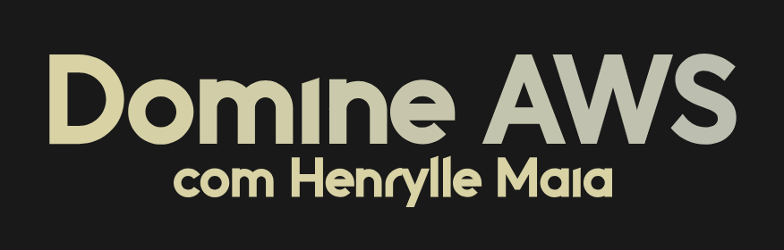

# AWS   

### Repository: [course](../../../)
### Platform: <a href="../">fabricio_veronez   </a>
### Software/Subject: <a href="./">aws   </a>

---

This folder refers to all the courses I took on the Henrylle Maia platform (AWS teacher) regarding the AWS platform.

### Courses:
- <a href="./curso_117">curso_117 (Domine AWS com Henrylle Maia)   </a>