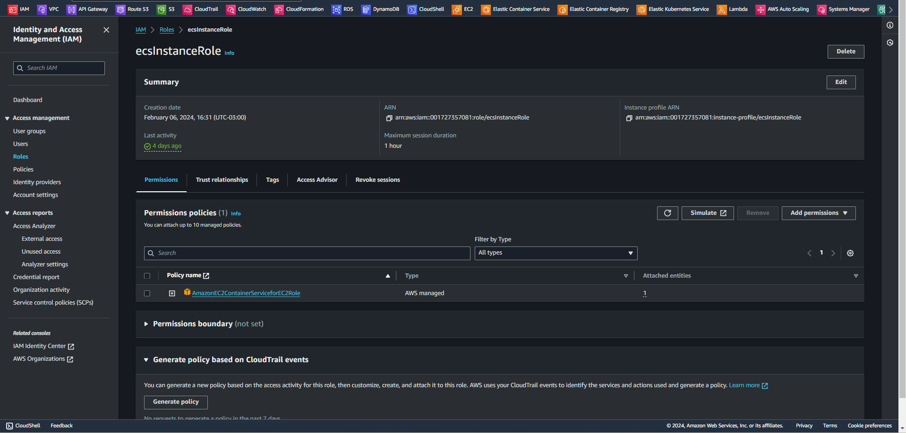

# Domine AWS com Henrylle Maia   

### Repository: [course](../../../../)
### Platform: <a href="../../">fabricio_veronez   </a>
### Software/Subject: <a href="../">devops   </a>
### Course: <a href="./">curso_117 (Domine AWS com Henrylle Maia)   </a>

---

### Theme:
- Cloud Computing

### Used Tools:
- Operating System (OS): 
  - Linux   
  - Windows 11   
- Linux Distribution: 
  - Ubuntu   
- Cloud:
  - Amazon Web Services (AWS)   
- Cloud Services:
  - Amazon Application Load Balancer (ALB)   
  - Amazon Elastic Compute Cloud (EC2)   
  - Amazon Elastic Container Registry (ECR)   
  - Amazon Elastic Container Service (ECS)   
  - Amazon Elastic Load Balancing (ELB)   
  - Amazon Relational Database Service (RDS)   
  - Amazon Route 53   
  - Amazon Virtual Private Cloud (VPC)   
  - AWS Certificate Manager (ACM)   
  - AWS System Manager (SSM)   
  - Google Drive 
- Containerization: 
  - Docker   
  - Docker Compose   
- Language:
  - HTML   
  - Markdown   
  - Node.js   
  - YAML   
- Integrated Development Environment (IDE) and Text Editor:
  - Nano   
  - Visual Studio Code (VS Code)   
- Versioning: 
  - Git   
- Repository:
  - Docker Hub   
  - Docker Registry   
  - GitHub   
- Command Line Interpreter (CLI):
  - AWS Command Line Interface (CLI)   
  - Bash e Sh   
  - Windows PowerShell   
- Server and Databases:
  - PostgreSQL   
- Database Administration Tool:
  - DBeaver   
- Tools:
  - Advanced Package Tool (Apt)   
  - Advanced Package Tool (Apt-Get)   
  - Curl   
  - Node Package Manager (npm)   
  - Unzip   
  - Wget   
- Network:
  - Registro .br   
  
---

<a name="item0"><h3>Course Strcuture:</h3></a>
1. <a href="#item01">AULA 01: Configuração do Ambiente na nuvem + Oportunidade em trabalhar com AWS</a><br>
2. <a href="#item02">AULA 02: Migrando nossa app para a AWS e realizando deploy</a><br>
3. <a href="#item03">AULA 03: Colocando nossa app em Alta Disponibilidade</a><br>
4. <a href="#item04">AULA 04: Escalabilidade na AWS + próximo passo para se preparar para as melhores oportunidades de TI</a><br>

---

### Objective:
Este curso teve com objetivo explicar como fazer o deploy de uma aplicação web containerizada com **Docker** no serviço **Amazon Elastic Container Service (ECS)**, utilizando como infraestrutura instâncias de container do serviço **Amazon Elastic Compute Cloud (EC2)** e criando um banco de dados **PostgreSQL** no serviço **Amazon Relational Database Service (RDS)**. Além disso, foi ensinado como integrá-lo com um serviço de load balancer que foi o **Amazon Application Load Balancer (ALB)** para distribuição do tráfego de requisições, como utilizar um domínio criado no **Registro.BR** para acessar a aplicação, utilizando o serviço **Amazon Route53**, e configurando um certificado com o serviço **AWS Certificate Manager (ACM)** para acessar a aplicação de forma segura.

### Structure:
A estrutura do projeto (Imagem 01) é formada por:
- A pasta [automation](./automation/) com os arquivos de scripts em **PowerShell** de automação (`creation.ps1`, `exclusion.ps1` e `variable.ps1`).
- A pasta [project](./project/) armazenando a pasta do repositório do **GitHub** do professor do curso que foi baixada para a maquina física.
- A pasta [resources](./resources/) que continha os arquivos de recursos necessários para execução do projeto do curso. Esta pasta conteve a seguinte sub-pasta:
    - A sub-pasta [bash](./automation/resources/bash/) contendo o arquivo de script em **Bash** para realizar as configurações na instância do EC2.
- A pasta `0-aux`, pasta auxiliar com imagens utilizadas na construção desse arquivo de README. 

<div align="Center"><figure>
    <br>
    <figcaption>Imagem 01.</figcaption>
</figure></div><br>

### Development:

Esse curso foi realizado em quatro aulas, sendo a quarta aula apenas informações sobre o curso completo do professor e uma explicação de como escalar a aplicação. No curso foi desenvolvido um projeto, na cloud **Amazon Web Services (AWS)**, de uma aplicação web containerizada com **Docker** no serviço **Amazon Elastic Container Service (ECS)**, utilizando como infraestrutura instâncias de container do serviço **Amazon Elastic Compute Cloud (EC2)**. A aplicação web de nome `bia`, rodava dentro de um container **Docker** no ECS e consistiu em uma espécie de bloco de tarefas, onde eram adicionadas tarefas e que ficavam armazenadas como posts na aplicação. Esse armazenamento ficou sob responsabilidade do banco de dados **PostgreSQL** construído no serviço **Amazon Relational Database Service (RDS)**.

A execuções desse projeto foram desenvolvidos em três arquivos de scripts em **PowerShell** que automatizavam todos os processos, sendo eles armazenados no diretório [automation](./automation/). O primeiro foi o arquivo [creation.ps1](./automation/creation.ps1) que realizava todas as criações de infraestrutura necessárias na cloud da **AWS** e todas as execuções. Já o arquivo [exclusion.ps1](./automation/exclusion.ps1) realizava o inverso, excluindo tudo que tinha sido construído. Nesses arquivos, cada comando executado para criar ou remover algo, era precedido por estruturas de condição que verificavam a existência do recurso que desejava-se criar ou excluir. Em ambos eram importado o terceiro arquivo que era o arquivo de variáveis, de nome [variable.ps1](./automation/variable.ps1). Este arquivo simplesmente continha todas as variáveis utilizadas nos outros dois arquivos. Ainda no arquivo de criação e exclusão, foi realizada uma divisão em etapas para execução dos comandos, sendo cada etapa referente a uma aula. As etapas 2 e 3 referentes as aulas 2 e 3, foram executadas conjuntamente, pois a aula 3 foi um aprimoramento do desenvolvimento realizado na aula 2 com inserção de novos recursos e serviços. Portanto, foi optado por realizar logo a execução final com tudo completo. 

Por conta dessa decisão de executar as aulas 2 e 3 juntas, foi necessário criar logo um domínio na internet. Na web, um domínio refere-se a um nome exclusivo que identifica um site na internet. Ele é parte de um endereço web mais longo chamado *Uniform Resource Locator (URL)*. O domínio de nome `pedroheeger.com.br` foi criado no site **Registro.BR**, sendo cobrado um valor para manutenção deste domínio.

<a name="item01"><h4>AULA 01: Configuração do Ambiente na nuvem + Oportunidade em trabalhar com AWS</h4></a>[Back to summary](#item0)

A primeira aula deste curso, foi iniciada com o arquivo de script [creation.ps1](./automation/creation.ps1) para construção de um grupo de segurança de nome `bia-dev`, criando uma única regra de entrada para liberação da porta `3001`, onde a aplicação web iria rodar, no protocolo `tcp` para todas as faixas de IP `0.0.0.0/0`. Esse grupo de segurança seria utilizado pela instância de desenvolvimento que seria construída. Em seguida, foi desenvolvida a role de nome `role-acesso-ssm`, para que essa instância que seria construída assumisse ela. Nesta role, foram vinculadas as três seguintes policies: `AmazonSSMManagedInstanceCore`, para permitir acesso à instância via *SSM Agent* do serviço **AWS System Manager (SSM)**; `AmazonECS_FullAccess` para permitir acesso total da instância aos recursos do serviço **Amazon Elastic Container Service (ECS)**; e `AmazonEC2ContainerRegistryFullAccess` concedendo permissão de acesso total da instância aos recursos do serviço **Amazon Elastic Container Registry (ECR)**. Esta role também seria utilizada pelas instâncias de container que seriam desenvolvidas no cluster do ECS nas próximas aulas. As imagens 02 e 03 mostram o grupo de segurança criado com a regra estabelecida e a role desenvolvida com as três policies vinculadas a ela.

<div align="Center"><figure>
    <br>
    <figcaption>Imagem 02.</figcaption>
</figure></div><br>

<div align="Center"><figure>
    <br>
    <figcaption>Imagem 03.</figcaption>
</figure></div><br>

Para vincular a role a instância que seria criada foi necessário desenvolver um perfil de instância, cujo nome foi o mesmo da role que ele utilizaria (`role-acesso-ssm`). A imagem 04 abaixo exibe o perfil de instância criado.

<div align="Center"><figure>
    <br>
    <figcaption>Imagem 04.</figcaption>
</figure></div><br>

Nesse momento, foi instanciada a maquina de trabalho de nome `bia-dev` com algumas configurações. Foi definida a sub-rede utilizada da zona de disponibilidade `us-east-1a` e o grupo de segurança construído (`bia-dev`). O tipo da instância foi `t2.micro` e a imagem de maquina foi do `Amazon Linux`. Com relação ao mapeamento de dispositivo de bloco foi definido um volume no serviço **Amazon Elastic Block Storage (EBS)** cujo nome do dispositivo associado foi `/dev/sda1` com `15` gigas e do tipo `gp2`. O perfil de instância desenvolvido foi vinculado a essa instância e o arquivo [udFileCurso117.sh](./resources/bash/udFileCurso117.sh) foi indicado como user data. Este arquivo de user data, fornecido pelo professor do curso, foi escrito em **Bash** e realizou instalações dos softwares **Git**, **Docker**, **Docker Compose**, **Node**, **NPM** e o *SSM Agent* do serviço *Session Manager* do **Amazon System Manager (SSM)**. O arquivo também configurou o **Docker** para permitir que o usuário `ec2-user` e `ssm-user` fossem adicionados ao grupo do **Docker**, podendo executar comandos sem o `sudo`. Este ainda adicionou um arquivo de swap na instância, proporcionando uma extensão temporária da capacidade de memória. A swap é uma área de armazenamento temporário no disco que o sistema operacional pode usar como memória virtual adicional quando a RAM física está esgotada. Nas imagens 05 e 06 é evidenciada a instância criada e um volume do EBS com 15 gigas desenvolvido para essa instância.

<div align="Center"><figure>
    <br>
    <figcaption>Imagem 05.</figcaption>
</figure></div><br>

<div align="Center"><figure>
    <br>
    <figcaption>Imagem 06.</figcaption>
</figure></div><br>

O último passo dessa aula, foi acessar a instância para executar alguns comandos para implantar a aplicação web. Isso foi feito através do acesso remoto com *SSM Agent* que tinha sido instalado na maquina. Diferente do professor, que nesta parte executou manulamente os comandos na instância, eu preferi executar todos os comandos de forma automatizada, indicando para o *SSM Agent* uma série de comandos **Bash** que ele deveria utilizar na instância de forma sequenciada, quando abrisse a sessão. O comando para abrir uma sessão na instância com o *SSM Agent* é o ```aws ssm start-session --target $instanceId1 --document-name AWS-StartInteractiveCommand --parameters command=`"bash -l`"```, no qual é indicado o Id da instância, o nome do documento utilizado na sessão e em parâmetros o comando a ser utilizado, que neste caso é `bash -l` para abrir um shell **Bash** na instância assim que a sessão for iniciada. Qualquer outro comando **Linux** poderia ser passado e foi assim que optei por fazer, indiquei uma sequência de comandos que deveriam ser executados na ordem. Assim a sessão foi aberta apenas uma vez, executou tudo e depois encerrou. Os documentos são scripts que fornecem instruções para realizar tarefas específicas em instâncias. O documento `AWS-StartInteractiveCommand` é projetado para iniciar uma sessão interativa com uma instância, permitindo que seja executado comandos diretamente na maquina remota. Na imagem 07 a seguir é mostrada uma demonstração feita de como acessar a instância, caso queira executar os comandos manualmente dentro dela.

<div align="Center"><figure>
    <br>
    <figcaption>Imagem 07.</figcaption>
</figure></div><br>

Nessa sequência de comandos **Bash** executado dentro da instância, o primeiro deles foi o `sudo su ec2-user -c` que alterou o usuário corrente para o usuário `ec2-user` e indicou vários comandos que esse usuário deveria executar. Todos os demais comandos foram executados por esse usuário. Então com o comando `cd /home/ec2-user` foi alterado para o diretório padrão do usuário e em seguida, com uma estrutura de condição foi verificado se existia a pasta `bia` dentro deste diretório, se não hovesse, seria feito um clone da pasta do projeto do repositório no **GitHub** do professor do curso com o comando `git clone https://github.com/henrylle/bia`. Após isso, foi acessada essa nova pasta com o comando `cd /home/ec2-user/bia` que já tinha todos os arquivos referente a aplicação do projeto, incluíndo os arquivos do **Docker**. Então foi executado o comando `docker compose up -d` para subir a aplicação web a partir do arquivo [docker-compose.yml](./project/bia/docker-compose.yml).

O arquivo compose do **Docker** criava dois services, no qual cada um originaria um container **Docker**. O primeiro service foi o da aplicação web, cujo nome do container era `bia`, que utilizou a imagem gerada pelo arquivo [Dockerfile](./project/bia/Dockerfile). Um mapeamento de portas foi realizado para apontar a porta do host, no caso a instância do EC2, para a porta `8080` do container, onde a aplicação rodava dentro dele. Também foi estabelecida uma comunicação, linkando o service da aplicação web com o outro service que era de banco de dados. Ainda no service da aplicação web foram definidas as seguintes variáveis de ambiente: `DB_USER`, `DB_PWD`, `DB_HOST` e `DB_PORT`. Essas variáveis eram necessárias para que o container da aplicação web conseguisse de fato acessar o container de banco de dados. Já o service de banco de dados, cujo nome do container foi `database` utilizou uma imagem do **PostgreSQL** do repositório do **Docker Hub**. Também foi realizando um mapeamento de portas, onde a porta `5432` do host apontava para a porta `5432` do container de banco de dados. Esta é a porta padrão utilizada pelo banco de dados **PostgreSQL**. As variáveis de ambiente definidas foram: `POSTGRES_USER`, nome do usuário, `POSTGRES_PASSWORD`, senha do usuário e nome do banco criado `POSTGRES_DB`. Um mapeamento de volume foi feito para apontar a pasta padrão do **PostgreSQL** (`/var/lib/postgresql/data`) para o volume desenvolvido, cujo nome foi `db`.

Com relação ao arquivo `Dockerfile`, foi utilizada como base uma imagem do **Node.js** do repositório do **Docker Hub** para a construção da aplicação web também **Node.js**. Essa aplicação utilizava o **React** para construí-la, onde a URL que a API do **React** usaria era informada em uma variável neste arquivo `Dockerfile`. Esta URL iniciou como `localhost`, mas foi sendo alterada ao longo do curso, primeiro para o IP público da instância de desenvolvimento `bia-dev`, depois para o IP público da instância de container `bia-web` do cluster que seria criado no ECS, depois para o DNS do load balancer que seria construído, e por fim para o nome de domínio criado no **Registro.BR**. Nesse `Dockerfile` ainda foi indicado que a porta que essa aplicação iria rodar seria `8080`. Nas imagens 08 e 09 são exibidos os containers em execução na instância `bia-dev` e a aplicação web containerizada sendo acessada pelo navegador da maquina física **Windows** através do IP público dessa instância concatenado com `:` e a porta `3001`, que foi definida no port bind como a porta que rodaria a aplicação no host.

<div align="Center"><figure>
    <br>
    <figcaption>Imagem 08.</figcaption>
</figure></div><br>

<div align="Center"><figure>
    <br>
    <figcaption>Imagem 09.</figcaption>
</figure></div><br>

Após alguns segundos para verificar a aplicação em execução no container, ela foi derrubada com o comando `docker compose down -v`, excluindo também qualquer volume que tivesse sido criado, no caso o volume `db`.

<a name="item02"><h4>AULA 02: Migrando nossa app para a AWS e realizando deploy</h4></a>[Back to summary](#item0)

A partir de agora, as aulas 2 e 3, referente as etapas 2 e 3, foram realizadas conjuntamente, com objetivo de realizar o projeto todo completo de uma única vez. Isso foi decidido, pois se fosse feito separadamente, muitas dos elementos construídos na etapa 2 teriam que ser modificados ou até mesmo excluídos para serem criados novamente acrescentando novos recursos que foram explicados na aula 3. Neste momento, precisava ter o domínio criado no **Registro.BR** que foi explicado no início do curso, e tudo que tinha sido executado na etapa 1 tinha que ser mantido para as etapas subsequentes. Caso tivesse sido excluído, era necessário realizar a etapa 1 novamente.

Essas duas etapas iniciaram com uma nova abertura de sessão com o **SSM Agent** na instância `bia-dev` para executar outros comandos, mas antes, além de extrair o Id da instância que era necessário para iniciar a sessão, foi extraído o IP público desta instância. O primeiro comando **Bash** a ser executado foi novamente o `sudo su ec2-user -c` para que todos os próximos comandos fossem executados pelo usuário `ec2-user`. O primeiro comando que esse usuário executou foi `cd /home/ec2-user/bia` para alterar o diretório corrente para a pasta do projeto `bia` já clonada do **GitHub**. Com o comando `sed` foi feita uma modificação no arquivo `Dockerfile` para trocar o valor da variável de URL da API do **React** de `localhost` para o IP público da instância que já tinha sido extraído. Isso faz necessário para quando fosse realizada uma interação com a aplicação web pela maquina física **Windows**, a requisição fosse enviada corretamente para API do **React** que rodava dentro do container da aplicação web que, por sua vez, era executado dentro da instância. Assim, qualquer nota que fosse adicionada, a aplicação web receberia a informação, pois foram enviadas para o destino correto. 

Após essa alteração, foi realizado o build o server com o comando `docker compose build server`, ou seja, a nova imagem **Docker** era criada com essa alteração no arquivo `Dockerfile`. Em seguida, os containers eram implantados com o comando `docker compose up -d`. Então com o comando `docker compose exec server bash -c 'npx sequelize db:migrate'` foi executado no container da aplicação web (`server`), o comando em **Bash** `npx sequelize db:migrate'`. Este comando utilizava o **Sequelize**, que é um *Object-Relational Mapping (ORM)* para **Node.js**, para verificar se existia migrações pendentes para o banco de dados, sendo esta verificação realizada através dos arquivos presente na pasta `migrations`. Nesta pasta, só existia o arquivo [20210924000838-criar-tarefas](./project/bia/database/migrations/20210924000838-criar-tarefas.js) que criava o esquema do banco no container de banco de dados. Na imagem 10 é exibida a aplicação web acessada pelo navegador novamente, mas agora com as notas criadas. Essas informações estavam armazenadas no container de banco de dados, mas como a porta `5432` não estava liberada no grupo de segurança, não era possível acessá-lo diretamente.

<div align="Center"><figure>
    <br>
    <figcaption>Imagem 10.</figcaption>
</figure></div><br>

Alguns segundos foram aguardados para verificar a aplicação, agora com dados, e então com o comando `docker compose down -v` os containers e volume foram removidos, finalizando a sessão com *SSM Agent*.

Dando continuidade, foi construído um segundo grupo de segurança, cujo nome foi `bia-web-teste` e nele foi adicionada uma regra de entrada liberando a porta `80` para todas as faixas de IP. Esse security group seria utilizado pela instância `bia-web` que seria criada. Na aula três, esse grupo de segurança mudou para `bia-ec2-teste` liberando todas as portas do protocolo `tcp` apenas para o grupo de segurança `bia-alb-teste`. Então ignorei o security group `bia-web-teste` e já criei logo esse. Porém, o quarto security group de nome `bia-alb-teste`, teve que ser executado antes desse, pois com a alteração da aula 3, onde as portas foram liberadas apenas para grupo `bia-alb-teste`, era necessário que esse grupo já existisse.

O terceiro grupo de segurança foi desenvolvido, sendo o nome desse `bia-db-teste`, onde a regra de entrada nele liberava a porta `5432` do protocolo `tcp` para os grupos `bia-web-teste` (alterado na aula 3 para `bia-alb-teste`) e `bia-dev` que foi o security group construído na aula um para a instância de desenvolvimento. Por fim, o quarto grupo de segurança foi criado com nome de `bia-alb-teste`, liberando a porta `80` e `443` para todas as faixas de IP. Esse último, era o security group do load balancer que seria criado. Como o grupo de segurança 2, que era `bia-web-teste` foi alterado para `bia-ec2-teste`, a regra de entrada foi modificada, liberando a comunicação em qualquer porta com esse quarto grupo. Assim, o que vinha do load balancer era encaminhado para as instâncias de container EC2 do cluster no ECS. Abaixo, as imagens 11, 12, 13 mostram os grupos de segurança 4 (`bia-alb-teste`), 2 (já alterado para `bia-ec2-teste`) e 3 (`bia-db-teste`), na ordem de construção.

<div align="Center"><figure>
    <br>
    <figcaption>Imagem 11.</figcaption>
</figure></div><br>

<div align="Center"><figure>
    <br>
    <figcaption>Imagem 12.</figcaption>
</figure></div><br>

<div align="Center"><figure>
    <br>
    <figcaption>Imagem 13.</figcaption>
</figure></div><br>

Com os grupos de segurança criados e com as regras estabelecidas, foi construído o banco de dados no serviço **Amazon Relational Database Service**, cujo nome de identificação da instância de banco foi `bia`, o tipo dela foi `db.t3.micro`, o engine (tipo de banco) foi `postgres` na versão `16.1`. Foi definido como storage `20` gigas do tipo `gp2`, o perído de backup de `7` dias. O grupo de segurança vinculado a essa instância foi o `bia-db-teste` e a sub-rede utilizada foi da zona de disponibilidade `us-east-1a`. Por fim, foi definido o nome de usuário e senha para acesso ao banco como `postgres`. O nome do banco em sí, não foi definido aqui, pois seria feito posteriormente. Na imagem 14 é ilustrado o banco de dados instanciado.

<div align="Center"><figure>
    <br>
    <figcaption>Imagem 14.</figcaption>
</figure></div><br>

O próximo passo foi criar um repositório no serviço **Amazon Container Registry (ECR)** que é o repositório de imagens de containers da **AWS**. Este foi definido com o nome `bia`, conforme imagem 15. Logo em seguida, uma nova sessão do *SSM Agent* foi aberta, iniciando com o comando `sudo su ec2-user -c` para que os próximos comandos fosse executados pelo usuário `ec2-user`. Com esse usuário, o primeiro comando efetuado foi `cd /home/ec2-user/bia` para alterar a pasta corrente para a do projeto. Com o comando `aws ecr get-login-password --region us-east-1 | docker login --username AWS --password-stdin $repositoryPath` foi feita a vinculação do **Docker** na instância com o **Amazon Container Registry (ECR)** na minha conta da **AWS**. Como na maquina física **Windows** estava configurada com o usuário do IAM worker da minha conta **AWS** (`PedroHeegerAdmin`), as credenciais foram as mesmas utilizadas na abertura da sessão pelo *Session Manager* do serviço **AWS System Manager (SSM)**, e portanto foram as mesmas utilizada para fazer essa vinculação. Logo, quando uma imagem fosse enviada para o repositório no ECR, o usuário do IAM que estaria executado isso seria o `PedroHeegerAdmin`. Após isso, foi feito o build da imagem com o comando `docker build -t bia .`, já que estava na pasta onde o arquivo `Dockerfile` se encontrava. Em seguida, essa imagem criada foi tagueada com o comando `docker tag bia:lastest $repositoryPath/${repositoryName}:lastest` com o objetivo de padronizar o caminho dela, para que com o comando `docker push $repositoryPath/${repositoryName}:lastest` ela fosse enviada exatamente para o repositório construído no ECR, tendo como tag (versão) `latest`. Alguns segundos foram aguardados antes de finalizar a sessão. Na imagem 16 é possível visualizar a imagem de tag `latest` armazenada no repsitório `bia` criado no ECR.

<div align="Center"><figure>
    <br>
    <figcaption>Imagem 15.</figcaption>
</figure></div><br>

<div align="Center"><figure>
    <br>
    <figcaption>Imagem 16.</figcaption>
</figure></div><br>

Seguindo o projeto, o próximo passo foi desenvolver o load balancer. Para isso, a primeira coisa a ser feita foi criar um *Application Load Balancer* que é um dos tipos de load balancer. Nele foram definidas três sub-redes, cada um em uma zona de disponibilidade diferente (`us-east-1a`, `us-east-1b` e `us-east-1c`). O grupo de segurança vinculado foi o `bia-alb-teste`, o nome dele foi `bia-alb` e o tipo de endereço de IP foi `IPv4`. Também foi definido o esquema dele como `internet-facing`, que significava que ele estava disponível na internet para rotear o tráfego. Após o load balancer, o próximo passo foi criar o target group, sendo esse de nome `tg-bia` e tipo `instance`. O protocolo e porta que seria utilizado era o `HTTP` e a porta `80`, que seria a porta que a aplicação web iria rodar nas instâncias de container do cluster do ECS. Essa mesma porta e protocolo foram os utilizados na verificação de integridade, junto com o path que foi `/`, ou seja, diretório raíz, além de outras configurações de integridade como: limite saudável e não saudável, tempo máximo de espera para a verificação, intervalo entre as verificações e a condição utilizada para determinar se um destino está saudável ou não, sendo essa `"HttpCode=200-299"`. Nas imagens 17 e 18 são evidenciados o load balancer do tipo ALB e o target group construídos. Observe que neste momento, o target group ainda estava sem alvos e o load balancer sem listener. 

<div align="Center"><figure>
    <br>
    <figcaption>Imagem 17.</figcaption>
</figure></div><br>

<div align="Center"><figure>
    <br>
    <figcaption>Imagem 18.</figcaption>
</figure></div><br>

Para vincular o target group com o ALB foi criado um listener passando a ARN dos dois recursos e definindo como protocolo e porta do listener, `HTTP` e `80`. A imagem 19 a seguir mostra agora o load balancer com um listener configurado. Mais a frente será configurado um outro listener para comunicação segura, assim que um certificado for criado.

<div align="Center"><figure>
    <br>
    <figcaption>Imagem 19.</figcaption>
</figure></div><br>

Com o load balancer pronto, chegou a vez de criar o launch template, que é um modelo de implantação que seria utilizado por um grupo de auto scaling. O script de criação do launch template era um pouco diferente, pois como ele trabalhava com versões. Então a verificação realizada pela estrutura de condição era para determinar se exisita ou não o launch template, caso existisse, ele descobria a última versão implantada e construía uma nova na versão imediatamente superior. Mas, caso o launch template de nome determinado não fosse encontrado, era construído na primeira versão. Por conta disso, algumas partes do script foi repetido tanto para primeira condição como para a segunda.

No launch template, cujo nome foi `launchTempCurso117`, foi definido a descrição da versão, o tipo de maquina que foi *Amazon Linux*, o tipo da instância como `t3.micro` e o grupo de segurança que seria utilizado pelas instâncias. Neste caso, o grupo de segurança era o segundo criado, no qual na aula 2 era o `bia-web-teste`, sendo alterado na aula três para `bia-ec2-teste`. Como estava executando direto, foi utilizado logo o `bia-ec2-teste`. Também um volume do serviço **Amazon Elastic Block Storage (EBS)** foi vinculado, cujas configurações foram padrões (nome do dispositivo `/dev/sda1`, tamanho do volume `8` e tipo `gp2`). A imagem 20 exibe esse launch template elaborado.

<div align="Center"><figure>
    <br>
    <figcaption>Imagem 20.</figcaption>
</figure></div><br>

Assim foi possível, logo em seguida, criar o auto scaling group que utilizou esse launch template construído na versão 1, a única criada. Esse auto scaling group foi nomeado de `asgCurso117` e nele foram definidas as três sub-redes utilizadas, cada uma de uma zona de disponibilidade diferente (`us-east-1a`, `us-east-1b` e `us-east-1c`). A tag de noma `ECS Instances - cluster-bia` foi determinada para esse grupo. Nele ainda foi definido um tempo de espera default em segundos para cenários de ecalabilidade, onde esse tempo tem que ser aguardado para que as métricas estabelecidas possam ser calculadas e a partir do resultado, as instâncias serem escaladas ou não. O tipo de verificação de integridade foi `EC2` e o tempo de aguardo para começar a verificação foi de `300` segundos. Um outro comando em seguida habilitou a coleção de diversas métricas com granulometria de 1 minuto para serem enviadas para o **Amazon CloudWatch**.

Aqui, duas coisas se diferem entre a aula 2 e 3. A primeira delas é a quantidade mínima, máxima e desejada de instâncias, que na aula 2 foi um para todas, enquanto na aula 3 foram duas instâncias para todas as quantidades. A segunda diferença foi que na aula 3 foi vinculado o target group construído, para que as instâncias que fossem criadas por esse grupo de auto scaling também fizem parte do target group. Na aula 2, não houve load balancer, então não houve target group. A imagem 21 evidencia o auto scaling group desenvolvido. Já a imagem 22 mostra as instâncias desse grupo também no target group.

<div align="Center"><figure>
    <br>
    <figcaption>Imagem 21.</figcaption>
</figure></div><br>

<div align="Center"><figure>
    <br>
    <figcaption>Imagem 22.</figcaption>
</figure></div><br>

O próximo passo foi a construção do cluster no serviço **Amazon Elastic Container Service (ECS)**, cujo nome dele foi `cluster-bia-alb`. Porém, foi necessário criar antes um capacity provider vinculando o auto scaling group nele. Esse capacity provider foi utilizado no cluster, para indicar que o auto scaling group atuaria no cluster. Nas definições do cluster foi habilitado o containers insights no **Amazon CloudWatch**. A imagem 23 ilustra a construção do cluster com o capacity provider e as instâncias do auto scaling group como instâncias de contâiner. Para que as instâncias do grupo de auto scaling fossem de fato instâncias de contâiner foi preciso passar como user data no launch template, o comando `echo ECS_CLUSTER=$clusterName >> /etc/ecs/ecs.config` e utilizar uma imagem de maquina (AMI) própria para este fim, sendo esta a `ami-0f90bd3669358d247` (`al2023-ami-ecs-hvm-2023.0.20240201-kernel-6.1-x86_64`).

<div align="Center"><figure>
    <br>
    <figcaption>Imagem 23.</figcaption>
</figure></div><br>

Na aula 1, tinha sido elaborada uma role referente a instância de desenvolvimento. Agora, foi necessário construir uma segunda role, cujo nome foi `ecsTaskExecutionRole`. Nela, foi definida que quem assumiria a role seria as tasks do cluster do ECS. A única policy anexada a essa role foi a `AmazonECSTaskExecutionRolePolicy`, permitindo as tasks algumas ações básicas de execução dentro do cluster do ECS. Na imagem 24 é mostrada a role já com a policy anexada. 

<div align="Center"><figure>
    <br>
    <figcaption>Imagem 24.</figcaption>
</figure></div><br>

Com o cluster criado, agora foi o momento de de construir a definição de tarefa que iria ser executada nele. Essa task definition na aula 2 teve o nome de `task-def-bia`, mas na aula 3 mudou para `task-def-bia-alb`. Nela foi definida a rede como modo `bridge`, o tipo de implantação como `EC2`, a plataforma de tempo de execução, cujo sistema operacional foi `LINUX` e a arquitetura da cpu `X86_64`, e a segunda role elaborada como role de execução. Além disso, foram definidas as restrições de posicionamento, no qual o objetivo foi espalhar as tarefas pelas zonas de disponibilidade. A definição de container foi declarada com um único container de nome `bia`, cujo caminho para imagem foi no repositório criado no ECR e a imagem foi de tag `lastest`. O poder computacional deste container foi determinado com 1024 de cpu e 512 de memória. As seguintes variáveis de ambientes foram definidas: `DB_USER`, nome do usuário do banco; `DB_PWD`, senha desse usuário, `DB_PORT`; a porta que o banco estava rodando que foi a porta `5432`, que é a padrão do **PostgreSQL**; `DB_HOST`, que agora neste cenário, foi o endpoint da instância de banco de dados criada no RDS, para isso foi necessário extrair esse valor antes. Por fim, um mapeamento de portas foi realizado, onde a porta host era apontada para a porta `8080` do container, onde a aplicação web rodava nele. A porta do host na aula 2 foi `80`, pois estava utilizando instâncias de container para acessar aplicação. Já na aula três, o acesso a aplicação era feita no DNS do load balancer e posteriormente no domínio criado no **Registro.BR**, portanto essa porta foi `0`, que significa que o host, que eram as instâncias de container EC2 no cluster do ECS, gerariam portas aleatórias. A imagem 25 a seguir exibe a definição de tarefa desenvolvida.

<div align="Center"><figure>
    <br>
    <figcaption>Imagem 25.</figcaption>
</figure></div><br>

Na sequência, foi criado o service no cluster para executar a task definition elaborada. Na aula 2, o nome do service foi `service-bia`, enquanto na aula 3 foi `service-bia-alb`. Foram indicados a definição de tarefa e versão utilizada, o cluster onde seria implantado essa task definition, o tipo de implantação que foi `EC2` e a estratégia de agendamento foi `REPLICA`. Na aula 2, a quantidade de tarefas a ser implantadas foi de apenas uma e na configuração de implantação o percentual mínimo e máximo saudável foram de `0` e `100` respectivamente. Já na aula 3, a quantidade de tarefas mudou para 2, e os percentuais saudáveis foram de `50` e `100`, ou seja, era removido primeiro 50% das tasks em execução, logo como eram 2, uma era removida, e então 100% das tasks em execução eram lançadas, como nesse momento era 1, outra era lançada, completando as duas tasks. Na aula 2 não foi vinculado um load balancer, mas na aula 3 foi vinculado o load balancer, passando o nome do ALB criado, a ARN do target group, o nome do container e a porta em que a aplicação rodava nele, que era a `8080`. Na imagem 26 a seguir é mostrado o service criado. Na imagem 27 é possível visualizar as duas tasks originadas desse service.

<div align="Center"><figure>
    <br>
    <figcaption>Imagem 26.</figcaption>
</figure></div><br>

<div align="Center"><figure>
    <br>
    <figcaption>Imagem 27.</figcaption>
</figure></div><br>

Agora, com o DNS do load balancer foi possível acessar a aplicação no navegador da maquina física, conforme visualizado na imagem 28.

<div align="Center"><figure>
    <br>
    <figcaption>Imagem 28.</figcaption>
</figure></div><br>

Uma nova sessão foi aberta no *Session Manager* do serviço **AWS System Manager (SSM)**, sempre na instância de desenvolvimento `bia-dev`. Porém antes, além do extração do Id dessa instância, foram extraídos o IP público dessa instância e da instância de container EC2 do cluster do ECS e o endpoint da instância de banco de dados do RDS, sendo todos esses utilizados na sessão aberta. Ao abrir a sessão, o comando `sudo su ec2-user -c` foi executado para que todos os próximos comandos fossem executados por esse usuário, que no caso era o `ec2-user`. Com esse usuário, o diretório corrente foi alterado para o diretório do projeto com o comando `cd /home/ec2-user/bia` e então com o comando `sed`, o arquivo `docker-compose.yml` foi alterado, modificando a variável `DB_HOST` do nome do container de banco de dados para o endpoint da instância de banco criada no RDS. Com o comando `docker compose up -d` foi implantada a aplicação na maquina de trabalho `bia-dev`, enquanto isso no cluster do ECS também estava executando a aplicação, porém era nas instâncias de container.

Com o comando `docker compose exec server bash -c 'npx sequelize db:create'` foi executado no container da aplicação na instância `bia-dev`, o comando `npx sequelize db:create` para que o software **Sequelize** criasse o banco de dados agora no serviço **Amazon Relational Database Service (RDS)**, pois a variável `DB_HOST` tinha sido alterada para apontar a instância do RDS. Com o comando `docker compose exec server bash -c 'npx sequelize db:migrate'` também foi executado no container da aplicação da instância `bia-dev`, o comando `npx sequelize db:migrate` para construir o esquema do banco no RDS. Nesse momento, tanto a aplicação web que rodava no container na instância `bia-dev`, como a mesma aplicação web que rodava no container das instâncias do cluster apontavam para a instância de banco de dados criada no RDS. Alguns segundos foram aguardados para realizar essa verificação. Na imagem 29 é evidenciado a instância de banco de dados no RDS, agora com um banco com esquema montado. Nas imagens 30 e 31 são mostradas a aplicação web sendo acessada pelo navegador da maquina física **Windows**, as duas aplicações web em execução, uma na maquina de trabalho `bia-dev` e a outra nas instâncias do cluster.

<div align="Center"><figure>
    <br>
    <figcaption>Imagem 29.</figcaption>
</figure></div><br>

<div align="Center"><figure>
    <br>
    <figcaption>Imagem 30.</figcaption>
</figure></div><br>

<div align="Center"><figure>
    <br>
    <figcaption>Imagem 31.</figcaption>
</figure></div><br>

Ainda executando os comandos com o usuário `ec2-user` na sessão iniciada, o próximo comando foi o `docker compose down -v` para remover os containers e volume implantados na instância `bia-dev`. Com o comando `sed`, foi realizada outra alteração, agora no arquivo `Dockerfile`, modificando a URL da API que o **React** iria utilizar, do IP público da instância `bia-dev` para o da `bia-web`, que era das instâncias de container. Isso foi utilizado na aula 2, para que os dados que fossem enviados da aplicação web fossem enviados para a API correta que rodava no container das instâncias, que na aula 2 era só uma, do cluster do ECS. Porém na aula 3, essa URL foi alterada para o DNS do load balancer, então foi decidido fazer logo com ele. Com o comando `aws ecr get-login-password --region us-east-1 | docker login --username AWS --password-stdin $repository` foi feita novamente a conexão do **Docker** da instância `bia-dev` com o serviço ECR, utilizando as credencias do usuário do IAM worker da minha conta (`PedroHeegerAdmin`).

No arquivo de código `/home/ec2-user/bia/client/src/components/Header.js` que faz parte do projeto, foi alterado o texto do butão de `Close` para `Fechar` e a cor de `black` para `green` para testar a mudança de versão com downtime zero no cluster do ECS. O build da nova imagem **Docker** foi executado com o comando `docker build -t bia .`. Com o comando `docker tag bia:lastest $repository/${repositoryName}:lastest` essa nova imagem foi tagueada para os padrões necessário para ser enviada com o comando `docker push $repository/${repositoryName}:lastest` para o repositório construído no ECR, sendo a tag dessa imagem `latest` novamente. Com o comando `aws ecs update-service --cluster $clusterName --service $ecsServiceName --force-new-deployment`, de dentro da instância `bia-dev`, foi forçada a atualização do cluster para que o service fosse implantado novamente. Assim, as novas tasks desse service utilizaria a nova imagem enviada para o ECR. Alguns segundos foram aguardados para confirmar a mudança de versão da aplicação. Observe que como já estava com duas instâncias de container, logo duas tasks em execução, o processo foi retirar uma task, subir uma nova task, retirar a outra e subir mais uma nova. A imagem 32 exibe o momento dessa substituição das tasks. Na imagem 33 é mostrada aplicação web que rodava no container nas instâncias do cluster sendo acessada pelo navegador da maquina física, agora com a mudança de versão.

<div align="Center"><figure>
    <br>
    <figcaption>Imagem 32.</figcaption>
</figure></div><br>

<div align="Center"><figure>
    <br>
    <figcaption>Imagem 33.</figcaption>
</figure></div><br>

Perceba, na imagem 34, que agora, ao adicionar uma nota na aplicação web executada no cluster, a nota aparece na aplicação. Isso porque os dados estão sendo enviados para a URL da API do **React** do container correto, que no caso, são os das instâncias de container do ECS. Observe também, na imagem 35, que o dado agora é alimentado no banco de dados desenvolvido no RDS.
xxxxxxxx

<div align="Center"><figure>
    <br>
    <figcaption>Imagem 34.</figcaption>
</figure></div><br>

<div align="Center"><figure>
    <br>
    <figcaption>Imagem 35.</figcaption>
</figure></div><br>

Após isso, a sessão foi encerrada. O próximo passo foi criar um hosted zone no serviço **Amazon Route53**, onde foi definido um nome de domínio e uma referência para essa zona de hospedagem. Logo em seguida, no serviço **AWS Certificate Manager (ACM)** foi desenvolvido um certificado, passando o nome de domínio da hosted zone e o método de validação que foi o `DNS`. O objetivo de criar esse certificado era para comunicar de forma segura, utilizando protocolo `HTTPS`. Esse certificado teve que ser registrado na zona de hospedagem criando um record. Nesse record, a ação era `CREATE`, o tipe era `CNAME`, o TTL era `300`, e o nome e valor do certificado eram extraídos para passar como parâmetro. Nas imagens a seguir (36, 37 e 38) é evidenciado a criação da hosted zone, do certificado no ACM e do registro do certificado na zona de hospedagem construída no Route53.

<div align="Center"><figure>
    <br>
    <figcaption>Imagem 36.</figcaption>
</figure></div><br>

<div align="Center"><figure>
    <br>
    <figcaption>Imagem 37.</figcaption>
</figure></div><br>

<div align="Center"><figure>
    <br>
    <figcaption>Imagem 38.</figcaption>
</figure></div><br>

Nessa hosted zone, foi desenvolvido um outro record, sendo esse para vincular essa zona com o load balancer construído. Assim essa zona de hospedagem apontaria para o load balancer. Os parâmetros foram parecidos com o registo anterior, só modificando o nome, que foi um nome aleatório criado, e o valor que era o DNS do load balancer e teve que ser extraído antes. Na imagem 39 é exibido esse novo record criado na hosted zone.

<div align="Center"><figure>
    <br>
    <figcaption>Imagem 39.</figcaption>
</figure></div><br>

Também foi necessário elaborar um outro listener cujo protocolo foi `HTTPS` e a porta mudou para `443`, vinculando o ALB com o target group. Nesse comando, ainda foi necesário informar a ARN do certificado criado, que foi extraído previamente. Assim, agora seria possível ter conexão segura, podendo acessar a aplicação por `HTTPS` no DNS do load balancer, ou pelo domínio criado no **Registro.BR**. Na imagem 40 a aplicação é acessada na maquina física no protocolo `HTTPS` com o DNS do load balancer. Enquanto na imagem 41 ela é acessada da mesma forma só que com o domínio criado no **Registro.BR**. Porém para de fato, o domínio do **Registro.BR** funcionar era necessário pegar 

<div align="Center"><figure>
    <br>
    <figcaption>Imagem 40.</figcaption>
</figure></div><br>

<div align="Center"><figure>
    <br>
    <figcaption>Imagem 41.</figcaption>
</figure></div><br>

Uma última sessão foi iniciada no *Session Manager* do serviço **AWS System Manager (SSM)**, sendo essa a quarta sessão, cujo objetivo foram dois. O primeiro deles, foi alterar a URL da API do **React** que neste momento tinha o DNS do load balancer, para o domínio criado no **Registro.BR**. O fato de alterar essa URL, não impedia que a aplicação fosse acessada pelo DNS do load balancer, tanto ele como o domínio conseguiria acessar a aplicação web. A diferença é que ao interagir com a aplicação criando uma nota nela, o dado era enviado apenas para a URL determinada, ou seja, só aparecia na aplicação web as notas que fossem criadas na URL que foi definida, a outra não conseguiria criar essas notas.

O segundo objetivo foi realizar uma nova mudança de versão, repetido os mesmos passos realizado na sessão anterior, de número 3. As modificações foram trocar no botão, o texto `Add` por `Adicionar` e a cor `red` por `black`. Assim, é realizado o build da nova imagem, alterada a tag, enviada para o repositório construído no ECR, e o cluster atualizado para que um novo service utilizasse novas tasks que baixavam as novas imagens com essa mudança de versão. Na imagem 42, a aplicação web executada dentro do container da instâncias do EC2 no cluster do ECS é acessada pelo navegador da maquina física com o nome de domínio criado no **Registro.BR**, sendo possível acessar com `HTTPS` de forma segura, pois agora a aplicação possui um certificado. Na imagem 43 é mostrado o banco de dados na instância do RDS com os dados criados .

<div align="Center"><figure>
    <br>
    <figcaption>Imagem 42.</figcaption>
</figure></div><br>

<div align="Center"><figure>
    <br>
    <figcaption>Imagem 43.</figcaption>
</figure></div><br>

<a name="item03"><h4>AULA 03: Colocando nossa app em Alta Disponibilidade</h4></a>[Back to summary](#item0)

A aula 3 foi realizada conjuntamente com a aula 2 (<a href="#item02">AULA 02: Migrando nossa app para a AWS e realizando deploy</a><br>), portanto volte ao item anterior para saber mais. 

<a name="item04"><h4>AULA 04: Escalabilidade na AWS + próximo passo para se preparar para as melhores oportunidades de TI</h4></a>[Back to summary](#item0)

Esta aula não foi realizada, pois não houve tempo de fazê-la até o prazo final do curso. Mas, acredito que boa parte dela tenha sido para explicar sobre o curso completo do professor deste curso, sendo a única parte referente ao projeto a questão da escalabilidade.