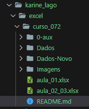
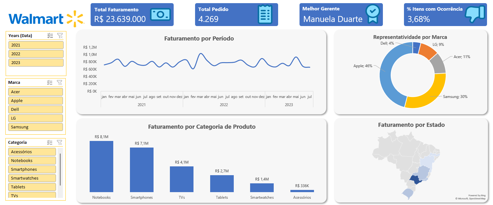

# Imersão Excel 2   

### Repository: [course](../../../)
### Platform: <a href="../">karine_lago   </a>
### Software/Subject: <a href="../../">excel   </a>
### Course: <a href="./curso_072">curso_072 (Imersão Excel 2)   </a>

#### <a href="https://github.com/PedroHeeger/main/blob/main/cert_ti/05-particip/data/excel/(23-07-06)%20Cert%20Excel%20PH%20Karine%20Lago%20(Imersão).pdf">Certificate</a>
##### Para conferir outros reports e dashboards de outros projetos, consulte meu repositório principal na sub-pasta de report clicando [aqui](https://github.com/PedroHeeger/main/tree/main/report).

---

### Theme:
- Data Analysis

### Used Tools:
- BI Tool: 
  - Excel 
- Integrated Development Environment (IDE):
  - VS Code   
- Versioning: 
  - Git   
- Repository:
  - GitHub   
- Others:
  - Google Drive 
  - Looka 

---

### Objective:
- O objetivo desse projeto prático foi introduzir as principais ferramentas e fórmulas do software **Microsoft Excel**. Além de desenvolver um report do zero sobre a temática **vendas**, onde foi realizado uma análise das vendas da uma base de dados hipotética da Walmart. 

### Structure:
- A estrutura (Imagem 01) do projeto é formada por dois arquivos em **Excel** um para cada aula, sendo a aula 2 e 3 resolvida no mesmo arquivo. Uma pasta com as imagens dos ícones inseridos no report. Duas pastas, uma contendo três arquivos de base de dados em **Excel**, um para cada ano (2021, 2022, 2023); a outra contendo, também em um arquivo de **Excel**, a base de dados só do mês de Julho/2023 para ser inserido posteriormente. Além da pasta **0-aux**, pasta auxiliar com imagens utilizadas na construção desse arquivo de README. A logomarca do curso foi criado apenas para fins didáticos utilizando o site de inteligência artificial **Looka**.

<figure>
     
    <figcaption>Imagem 01.</figcaption>
</figure>
 

### Development:
Este projeto foi desenvolvido em três aulas.

#### Class 1
Na primeira aula foi apenas uma introdução as ferramentas e fórmulas do **Excel**. Nesta aula foi utilizada a fórmula `VLOOKUP` para preencher três colunas vazias (**Marca**, **Categoria** e **Classificação**) que estavam em outra aba. Foram realizados operações com as fórmulas `COUNTIF` e `SUMIF` e a utilização da fórmula condicional `IFS` para calcular as métricas: **Quantidade de Pedidos**, **Faturamento**, **Quantidade Vendida** e **Porcentagem de Comissão**. Também foi utilizado a ferramenta de **Validação Dados** para criar uma validação no formato de lista.

#### Class 2 e 3
Na aula 2 e 3 foi utilizado o **Power Query** em um novo arquivo para realizar um processo de ETL (Extração, Transformação e Carregamento) de uma base de dados formada por três arquivos de **Excel**, um para cada ano (2021, 2022 e 2023). A extração foi realizada direto na pasta dos arquivos, pois estavam todos sozinhos na mesma pasta e possuiam a mesma estrutura de dados. Os dados foram carregados no **Excel** em uma tabela formatada, onde foi criado uma condicional junto com uma validação de dados para quando selecionarmos o tipo de classificação (**Bronze**, **Prata** e **Ouro**), as linhas correspondentes seriam destacadas.

Em uma outra aba foi desenvolvido todas as tabelas dinâmicas referente aos dados, que no caso foram onze. Essas tabelas alimentaram os gráficos dinâmicos construídos na aba do report e também os quatro visuais de cartões (**Total Faturamento**, **Total Pedido**, **Melhor Gerente**, **Percentual de Itens com Ocorrência**) criados com as formas do **Excel**. Em relação aos gráficos foram de efetuadas **análise de faturamento por período** (Gráfico de Linha), **análise de representatividade por marca** (Gráfico de Rosca), **análise de faturamento por categoria de produto** (Gráfico de Colunas) e **análise de faturamento por estado** (Gráfico de Mapa).

Além dos gráficos, foram criadas três segmentações de dados (**Anos**, **Marca** e **Categoria**) para filtragem dos visuais. Alguns ícones foram inseridos para confecção do report, e também configurações de layout foram realizadas. Com o report concluído, foi copiado a base de dados de Julho/2023 que estava em outra pasta e colado na pasta das bases atuais, sendo necessário atualizar os dados no arquivo do report para que a tabela recebesse os novos dados e passasse as informaçõs para as tabelas dinâmicas que por sua vez, atualizaram os gráficos. Por fim, o report é apresentado na imagem 02 abaixo.

<figure>
     
    <figcaption>Imagem 02: Report.</a></figcaption>
</figure>
 